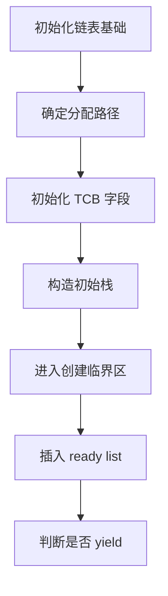
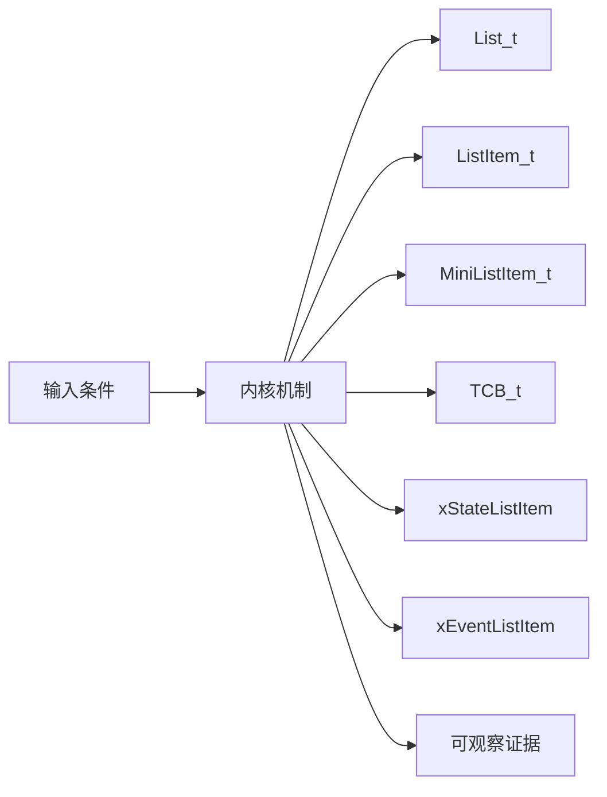
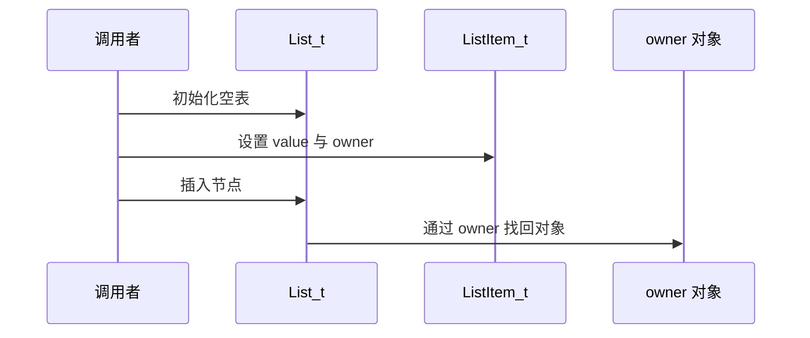
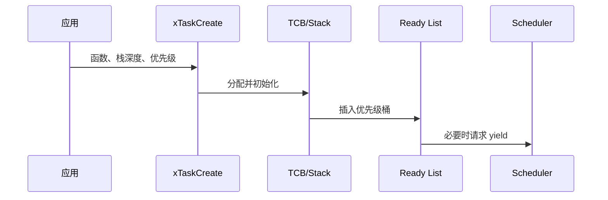
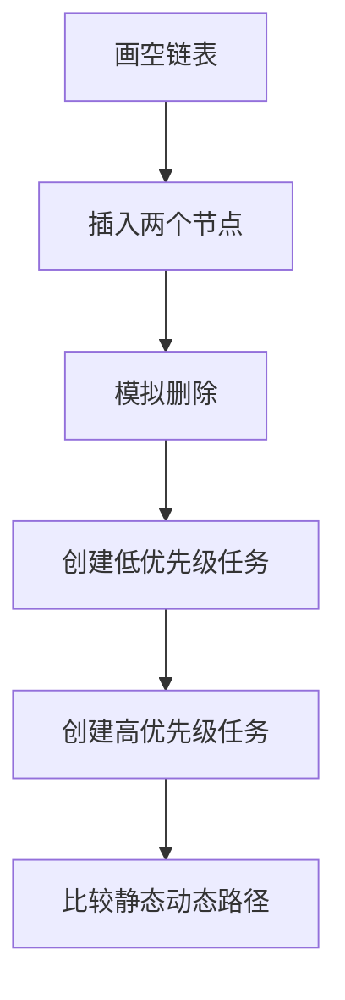
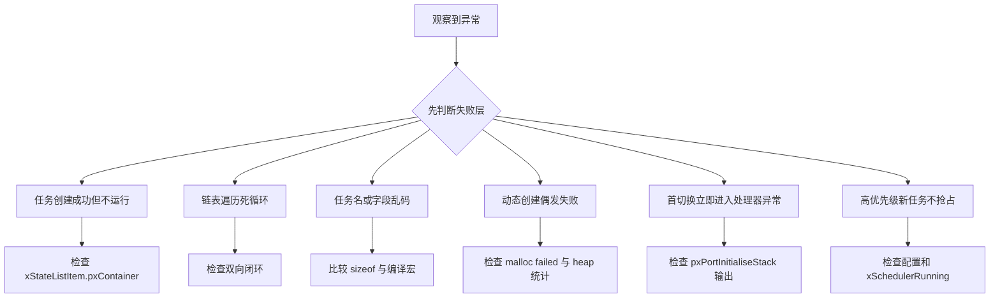

任务创建不是分配一块栈后返回句柄，它要建立 TCB、两个链表节点、初始上下文，并在正确的临界区加入就绪集合。

本篇只回答一个核心问题：**xTaskCreate 如何把函数、参数、优先级和栈变成调度器可以选择的 TCB？**

分析范围固定为 **FreeRTOS-Kernel V11.3.0**。所有函数、字段、宏和条件编译都以该 tag 为准。

本篇先读 list.c 的通用容器，再把 TCB 的状态节点与事件节点映射到任务创建链，最后解释创建高优先级任务为何可能触发 yield。

## 1. 从一个待创建的任务开始

只分析单核任务创建主线；MPU task、SMP core affinity 和具体架构压栈细节留在对应机制中。



## 2. List_t、ListItem_t 与 TCB 如何关联

TCB 不保存“任务状态枚举”，任务处于哪个状态主要由 xStateListItem 当前属于哪条链表决定。



| 对象 | 角色 | 必须保持的不变量 | 观察方法 | 常见误读 |
|---|---|---|---|---|
| List_t | 保存节点数、遍历索引和哨兵节点。 | uxNumberOfItems 与实际节点一致，哨兵不计数。 | 观察节点数与 end marker。 | 把它当普通双向链表头。 |
| ListItem_t | 把排序值、前后指针、owner 和 container 绑定。 | container 为空或指向唯一所属 List_t。 | 检查 pxContainer 与 pvOwner。 | 把 owner 当链表本身。 |
| MiniListItem_t | 作为 List_t 的 xListEnd 哨兵。 | xItemValue 为最大值并形成闭环。 | 检查 xListEnd 前后指针。 | 把哨兵当真实任务节点。 |
| TCB_t | 保存栈顶、优先级、名称和内嵌链表项。 | pxTopOfStack 位于可用栈，链表项 owner 指回 TCB。 | 调试器查看 pxCurrentTCB。 | 寻找单独 task state 字段。 |
| xStateListItem | 让任务进入 ready/delayed/suspended/termination list。 | 同一时刻只属于一条状态链表。 | pxContainer 指示任务状态。 | 名称只表示用途不表示当前状态。 |
| xEventListItem | 让任务等待 queue/semaphore/event。 | 可与状态节点同时属于事件列表。 | 同时检查两个 container。 | 认为任务只能在一条链表。 |
| 任务栈 | 保存函数运行帧和初始上下文。 | 对齐、增长方向和边界符合 port。 | 检查 pxStack 与 pxTopOfStack。 | 把 uxStackDepth 当字节数。 |
| pxCurrentTCB | 指向当前调度任务。 | 运行任务必须来自 ready list。 | 记录地址和优先级。 | 句柄为空就表示没有任务。 |

## 3. 调用链一：ListItem 从空闲节点到有序链表成员

vListInitialise 建立哨兵，vListInsert 按 xItemValue 找位置，uxListRemove 恢复节点脱离状态。



### 调用链一：vListInitialise -> vListInsert/vListInsertEnd -> uxListRemove

vListInitialise 先把 xListEnd 建成自指的哨兵，并把 uxNumberOfItems 清零；空表因此已经是一个完整闭环，而不是 NULL 结尾的普通链表。单独的 ListItem_t 经过 vListInitialiseItem 初始化后，pxContainer 必须保持为 NULL，表示它尚不属于任何容器。

插入前，调用者设置 xItemValue 和 pvOwner。若 xValueOfInsertion 等于 portMAX_DELAY，vListInsert 直接把 xListEnd.pxPrevious 作为前驱；哨兵值本身也是 portMAX_DELAY，若继续执行“小于等于”比较，循环将无法终止。其他值才从哨兵沿 pxNext 查找第一个值更大的位置。前驱确定后，函数一次性改写新节点、前驱和后继涉及的四个指针；这个更新窗口必须由调用者提供必要的互斥。

指针闭合后才写入 pxContainer 并增加节点数，此时节点身份才真正成立。uxListRemove 走相反过程：先让邻居绕过目标节点，再调整遍历索引、清空 container 并减少计数。验证时应同时检查正向与反向遍历、uxNumberOfItems 和 pxContainer，任何一项不一致都说明链表不变量已经破坏。

### 源码片段：ListItem 保存排序、owner 与 container

> 源码位置：`include/list.h` · `struct xLIST_ITEM` · `V11.3.0`
> 配置条件：configUSE_LIST_DATA_INTEGRITY_CHECK_BYTES 任意
> 固定链接：[查看上游源码](https://github.com/FreeRTOS/FreeRTOS-Kernel/blob/V11.3.0/include/list.h)

```c
struct xLIST_ITEM
{
    TickType_t xItemValue;
    struct xLIST_ITEM * pxNext;
    struct xLIST_ITEM * pxPrevious;
    void * pvOwner;
    struct xLIST * pxContainer;
};
```

- xItemValue 提供排序键。
- pvOwner 让调度器从节点回到 TCB。
- pxContainer 是成员身份的直接证据。
- 完整定义还可能包含完整性检查字段。

> **关键约束**：节点最多属于一个 List_t，且前后指针构成闭环。 **验证重点**： owner、container、next、previous 与列表计数。

### 源码片段：vListInsert 按值连接节点

> 源码位置：`list.c` · `vListInsert()` · `V11.3.0`
> 配置条件：所有内核构建
> 固定链接：[查看上游源码](https://github.com/FreeRTOS/FreeRTOS-Kernel/blob/V11.3.0/list.c)

```c
if( xValueOfInsertion == portMAX_DELAY )
{
    pxIterator = pxList->xListEnd.pxPrevious;
}
else
{
    for( pxIterator = &( pxList->xListEnd );
         pxIterator->pxNext->xItemValue <= xValueOfInsertion;
         pxIterator = pxIterator->pxNext )
    {
    }
}
pxNewListItem->pxNext = pxIterator->pxNext;
pxNewListItem->pxPrevious = pxIterator;
```

- 普通值从哨兵开始遍历；portMAX_DELAY 直接选择尾节点作为前驱。
- 等值节点的顺序由比较条件决定。
- 后续还会回写邻居指针。
- 最后设置 container 并增加节点数。

> **关键约束**：普通值插入后，前驱值不大于新值且后继值更大；portMAX_DELAY 节点必须直接位于 xListEnd 之前。 **验证重点**：分别推演普通值、等值和 portMAX_DELAY 三种输入。

## 4. 调用链二：xTaskCreate 到 ready list 与切换请求

创建链把应用参数转换为 TCB，并在对象完全初始化后才暴露给 scheduler。



### 调用链二：xTaskCreate -> prvCreateTask -> prvInitialiseNewTask -> prvAddNewTaskToReadyList

xTaskCreate 只负责动态创建入口；它把函数、名称、栈深度、参数和优先级交给 prvCreateTask。prvCreateTask 根据 portSTACK_GROWTH 决定 TCB 与栈的分配顺序，并保证任一分配失败时回收已经获得的内存，所以半成品不会进入全局任务集合。

内存就绪后，prvInitialiseNewTask 填写名称、优先级和栈边界，初始化 xStateListItem 与 xEventListItem，并把两个节点的 owner 设回 TCB。随后 pxPortInitialiseStack 根据函数入口和参数构造可恢复的初始上下文，返回值成为 pxTopOfStack。到这里任务对象已经完整，但调度器仍看不到它。

prvAddNewTaskToReadyList 在临界区内更新任务计数和任务编号，把状态节点插入 pxReadyTasksLists[uxPriority]，再根据调度器是否运行、抢占配置以及新旧任务优先级决定是否请求 yield。判断创建是否成功不能只看 pdPASS，还要核对任务计数、ready list 长度、owner/container 回指和切换请求。

### 源码片段：TCB 内嵌状态和事件链表项

> 源码位置：`tasks.c` · `TCB_t` · `V11.3.0`
> 配置条件：单核与 SMP 共享基础字段
> 固定链接：[查看上游源码](https://github.com/FreeRTOS/FreeRTOS-Kernel/blob/V11.3.0/tasks.c)

```c
typedef struct tskTaskControlBlock
{
    volatile StackType_t * pxTopOfStack;
    ListItem_t xStateListItem;
    ListItem_t xEventListItem;
    UBaseType_t uxPriority;
    StackType_t * pxStack;
} TCB_t;
```

- 真实字段受配置宏影响且更多。
- pxTopOfStack 必须位于首字段以满足部分 port。
- 两个 list item 可以同时服务状态与事件等待。
- 优先级决定 ready list 桶。

> **关键约束**：状态链表项 owner 指向当前 TCB，栈指针满足 port 对齐。 **验证重点**：在任务创建后打印 TCB 与两个 container。

### 源码片段：xTaskCreate 完成对象后加入 ready list

> 源码位置：`tasks.c` · `xTaskCreate()` · `V11.3.0`
> 配置条件：configSUPPORT_DYNAMIC_ALLOCATION == 1
> 固定链接：[查看上游源码](https://github.com/FreeRTOS/FreeRTOS-Kernel/blob/V11.3.0/tasks.c)

```c
pxNewTCB = prvCreateTask( pxTaskCode, pcName, uxStackDepth,
                          pvParameters, uxPriority, pxCreatedTask );

if( pxNewTCB != NULL )
{
    prvAddNewTaskToReadyList( pxNewTCB );
    xReturn = pdPASS;
}
```

- 分配与字段初始化封装在 prvCreateTask。
- NULL 时不能把半成品加入全局任务集合。
- ready list 插入在独立 helper 中处理临界区。
- 返回句柄在初始化阶段写入。

> **关键约束**：只有完整初始化的 TCB 才能进入 ready list。 **验证重点**：比较创建前后任务总数和对应优先级 list length。

## 5. 用最小实验验证链表与任务创建



### 配置矩阵

| 配置或条件 | 取值 A | 取值 B | 源码影响 | 验证重点 |
|---|---|---|---|---|
| configSUPPORT_DYNAMIC_ALLOCATION | 0 | 1 | 决定 xTaskCreate 动态路径。 | 验证 API 与 heap 依赖。 |
| configSUPPORT_STATIC_ALLOCATION | 0 | 1 | 决定 xTaskCreateStatic 路径。 | 验证 TCB/stack 由调用者提供。 |
| configMAX_PRIORITIES | 较小值 | 较大值 | 决定 ready list 数组和优先级上限。 | 测试边界优先级。 |
| configUSE_TRACE_FACILITY | 0 | 1 | 增加任务编号等观测字段。 | 比较 TCB 布局。 |
| portSTACK_GROWTH | -1 | 1 | 决定 TCB/stack 分配和初始指针方向。 | 检查 pxTopOfStack。 |
| configUSE_LIST_DATA_INTEGRITY_CHECK_BYTES | 0 | 1 | 增加链表完整性标记。 | 验证初始化值。 |

### 实验步骤

1. **画空链表。** 手工写出哨兵闭环，并保存 next/previous/计数；只有所有反向关系成立，这一步才算完成。
2. **插入两个节点。** 使用不同 xItemValue 推演。重点核对排序和 container，结果应满足“顺序与计数正确”。
3. **模拟删除。** 移除头部节点，把邻居、index、container 保存为证据；判断依据是节点彻底脱离。
4. **创建低优先级任务。** 记录 TCB 与 ready list；观察栈、owner、container。若进入对应优先级桶，即可进入下一步。
5. **创建高优先级任务。** scheduler 运行时创建，随后比较 yield 请求和 current TCB；预期是符合抢占配置。
6. **比较静态动态路径。** 切换 allocation 配置。最后用函数链和内存归属确认公共初始化逻辑一致。

### 证据表

| 证据 | 获取方法 | 通过标准 | 失败说明 |
|---|---|---|---|
| 链表闭环 | 调试器遍历 next/previous | 最终回到 xListEnd | 断链说明指针更新错误 |
| container 归属 | 读取 xStateListItem.pxContainer | 指向唯一 ready list | NULL/错误列表表示任务不可调度 |
| owner 回指 | 读取 pvOwner | 等于 TCB 地址 | 错误 owner 会返回错误任务 |
| 任务计数 | 创建前后读取 uxCurrentNumberOfTasks | 成功时增加一次 | 增加但无 ready 节点表示原子性破坏 |
| 栈边界 | 检查 pxStack 与 pxTopOfStack | 方向与对齐符合 port | 越界会在首切换崩溃 |
| 切换请求 | trace yield 与优先级 | 仅满足条件时请求 | 无条件 yield 改变时序 |

## 6. 从 container、owner 和 ready list 定位创建故障

先验证对象成员和链表归属，再检查锁、配置分支和调度请求。



| 现象 | 根因 | 第一检查点 | 应保存的证据 | 修复原则 |
|---|---|---|---|---|
| 任务创建成功但不运行 | TCB 未进入正确 ready list | 检查 xStateListItem.pxContainer | TCB、priority、list length | 修正创建链和优先级 |
| 链表遍历死循环 | 节点前后指针或哨兵损坏 | 检查双向闭环 | 崩溃前最后一次插入删除 | 修复锁与指针更新 |
| 任务名或字段乱码 | TCB 内存越界或配置布局不一致 | 比较 sizeof 与编译宏 | map 文件和字段快照 | 统一配置并检查栈溢出 |
| 动态创建偶发失败 | heap 不足或碎片 | 检查 malloc failed 与 heap 统计 | 申请大小和剩余块 | 选择正确 heap/静态分配 |
| 首切换立即进入处理器异常 | 初始栈方向、对齐或 port 错 | 检查 pxPortInitialiseStack 输出 | 栈帧和异常寄存器 | 修复 port 契约 |
| 高优先级新任务不抢占 | 抢占关闭或 scheduler 未运行 | 检查配置和 xSchedulerRunning | yield trace | 按配置解释行为 |
| 同一节点出现在两条状态链 | 重复插入前未删除 | 检查 pxContainer | 两条链表和最后操作 | 先 remove 再 insert |

## 7. 源码索引、阶段验收与面试表达

### 源码索引

| 文件 | 结构体 / 函数 / 宏 | 作用 |
|---|---|---|
| [include/list.h](https://github.com/FreeRTOS/FreeRTOS-Kernel/blob/V11.3.0/include/list.h) | List_t、ListItem_t、list 宏 | 链表对象模型 |
| [list.c](https://github.com/FreeRTOS/FreeRTOS-Kernel/blob/V11.3.0/list.c) | vListInitialise、vListInsert、uxListRemove | 链表操作实现 |
| [tasks.c](https://github.com/FreeRTOS/FreeRTOS-Kernel/blob/V11.3.0/tasks.c) | TCB_t、xTaskCreate、prvCreateTask | 任务创建主线 |
| [tasks.c](https://github.com/FreeRTOS/FreeRTOS-Kernel/blob/V11.3.0/tasks.c) | prvInitialiseNewTask、prvAddNewTaskToReadyList | 对象初始化与公开 |
| [include/task.h](https://github.com/FreeRTOS/FreeRTOS-Kernel/blob/V11.3.0/include/task.h) | TaskHandle_t 与创建 API | 公开契约 |

### 阶段验收

1. 能画出 List_t 空表哨兵。
2. 能解释 item value、owner、container。
3. 能证明任务状态主要来自链表归属。
4. 能区分静态和动态创建的内存所有权。
5. 能跟踪 xTaskCreate 的四层 helper。
6. 能检查初始栈与 port 边界。
7. 能解释 ready list 按优先级分桶。
8. 能解释创建后何时请求 yield。

### 面试表达

TCB 同时内嵌状态节点和事件节点，因此任务阻塞时可以既属于 delayed list，又在某个 queue 的 event list 中等待。

任务创建只有在 TCB 和初始栈完整后才进入 ready list，临界区保证其他上下文看不到半初始化对象。

判断任务状态时我优先看 xStateListItem.pxContainer，而不是寻找一个不存在的统一 state 字段。

### 参考资料

- [FreeRTOS-Kernel V11.3.0](https://github.com/FreeRTOS/FreeRTOS-Kernel/tree/V11.3.0)
- [FreeRTOS Kernel Book](https://github.com/FreeRTOS/FreeRTOS-Kernel-Book)

> 🏷️ FreeRTOS / List_t / TCB_t / xTaskCreate / Ready List
