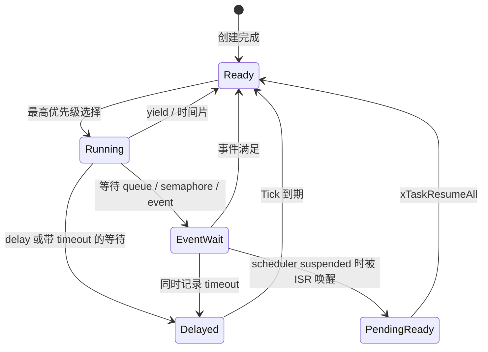
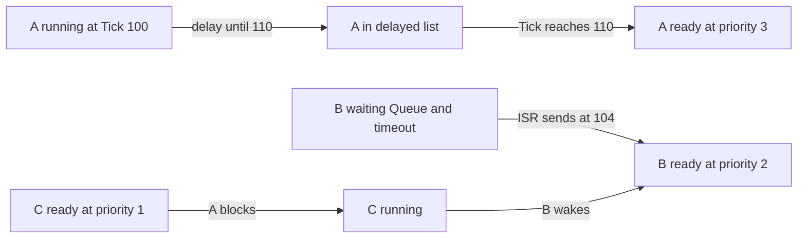

# FreeRTOS 内核源码解读 03：调度器、Tick、阻塞与唤醒

FreeRTOS 调度器没有一张集中保存“所有任务当前状态”的表。它维护多组链表：每个优先级一条 ready list，两条处理 Tick 回绕的 delayed list，以及 scheduler suspended 期间暂存唤醒结果的 pending ready list。任务状态的改变，本质上是 TCB 内嵌链表节点在这些容器之间移动。

本篇固定使用 **FreeRTOS-Kernel V11.3.0**，commit `9b777ae5c5b8e9e456065a00294d1e5f5f9facf5`。只解释单核公共调度策略。portable 层如何保存旧上下文、恢复新上下文，不属于本文范围。

## 调度器首先是一组有明确职责的链表

[`tasks.c`](https://github.com/FreeRTOS/FreeRTOS-Kernel/blob/V11.3.0/tasks.c#L472-L488) 中与本篇有关的全局容器如下：

```c
static List_t pxReadyTasksLists[ configMAX_PRIORITIES ];

static List_t xDelayedTaskList1;
static List_t xDelayedTaskList2;
static List_t * volatile pxDelayedTaskList;
static List_t * volatile pxOverflowDelayedTaskList;

static List_t xPendingReadyList;
```

`pxReadyTasksLists[p]` 保存所有优先级为 p 的可运行任务。数组下标已经表达优先级，链表内部不需要再按 `xItemValue` 排序；新任务通过 `listINSERT_END` 加入，`pxIndex` 负责同优先级轮转。

Delayed list 的排序键是绝对唤醒 Tick。Tick 计数是有限宽度无符号整数，`now + delay` 可能回绕到较小值。如果把回绕前后的绝对值放在同一条升序链表里，较小的“下一周期时间”会错误地排到当前周期任务之前，所以内核同时维护 current 和 overflow 两条 delayed list。

`xPendingReadyList` 不是另一种长期任务状态。scheduler suspended 时，ISR 仍可能让任务满足事件条件，但此时任务链表不能完成全部搬迁。内核先把被唤醒任务的事件节点放进 pending ready，等 `xTaskResumeAll()` 恢复调度器后再完成迁移。



图中的 `EventWait` 不是独立状态链表名称。等待事件的任务通常仍通过 `xStateListItem` 位于 delayed list，同时通过 `xEventListItem` 位于对象事件链表；这是两个索引描述同一个阻塞任务。

## 启动调度器前，内核先保证永远有任务可选

[`vTaskStartScheduler()`](https://github.com/FreeRTOS/FreeRTOS-Kernel/blob/V11.3.0/tasks.c#L3700-L3802) 第一件事不是配置 Tick，而是创建 Idle task。如果打开 `configUSE_TIMERS`，还要创建 Timer daemon task。只有这些系统任务创建成功，启动过程才继续。

Idle task 的最低优先级保证至少存在一个 ready task。没有这个保证，最高优先级选择逻辑可能从空的 ready 数组一路向下越界。Idle 还承担当前任务删除后的延迟内存回收，因此它不仅是“无事可做时执行的空循环”。

系统任务准备完成后，内核关闭中断，建立公共调度状态，再把控制权交给 portable 层：

```c
portDISABLE_INTERRUPTS();

xNextTaskUnblockTime = portMAX_DELAY;
xSchedulerRunning = pdTRUE;
xTickCount = ( TickType_t ) configINITIAL_TICK_COUNT;

traceTASK_SWITCHED_IN();
traceSTARTING_SCHEDULER( xIdleTaskHandles );

( void ) xPortStartScheduler();
```

`xNextTaskUnblockTime` 初始为最大值，表示当前没有已知超时任务；`xSchedulerRunning` 在 port 启动前置位；`xTickCount` 使用配置的初始值。`xPortStartScheduler()` 负责启动硬件 Tick 和恢复第一个任务，正常情况下不会像普通函数一样返回。

公共内核在这里已经决定首个 `pxCurrentTCB`。任务创建阶段会持续让它指向调度器启动前已创建任务中的最高优先级者；portable 层只负责让这个已经选定的 TCB 真正开始执行。

## vTaskSwitchContext 只负责选择，不负责搬运任务状态

单核通用选择宏位于 [`tasks.c`](https://github.com/FreeRTOS/FreeRTOS-Kernel/blob/V11.3.0/tasks.c#L194-L210)：

```c
#define taskSELECT_HIGHEST_PRIORITY_TASK()                                  \
    do {                                                                    \
        UBaseType_t uxTopPriority = uxTopReadyPriority;                     \
                                                                            \
        while( listLIST_IS_EMPTY(                                           \
                   &( pxReadyTasksLists[ uxTopPriority ] ) ) != pdFALSE )    \
        {                                                                   \
            configASSERT( uxTopPriority );                                  \
            --uxTopPriority;                                                \
        }                                                                   \
                                                                            \
        listGET_OWNER_OF_NEXT_ENTRY(                                        \
            pxCurrentTCB, &( pxReadyTasksLists[ uxTopPriority ] ) );         \
        uxTopReadyPriority = uxTopPriority;                                 \
    } while( 0 )
```

`uxTopReadyPriority` 是搜索起点，不是无需验证的最终答案。任务从某个最高优先级桶移走后，普通 C 路径会向下寻找第一个非空 ready list。若 port 提供优化选择，则使用位图等架构能力直接找到最高非空优先级，但最终仍要从对应 ready list 取得 TCB。

`listGET_OWNER_OF_NEXT_ENTRY` 会推进该 ready list 的 `pxIndex`，因此同优先级多个任务按链表顺序轮转。最高优先级选择和同优先级轮转在一个宏里完成：先确定哪条 ready list，再确定该 list 的下一个 owner。

[`vTaskSwitchContext()`](https://github.com/FreeRTOS/FreeRTOS-Kernel/blob/V11.3.0/tasks.c#L5119-L5190) 只有在 scheduler 未 suspended 时才执行选择：

```c
if( uxSchedulerSuspended != 0U )
{
    xYieldPendings[ 0 ] = pdTRUE;
}
else
{
    xYieldPendings[ 0 ] = pdFALSE;
    traceTASK_SWITCHED_OUT();

    taskCHECK_FOR_STACK_OVERFLOW();
    taskSELECT_HIGHEST_PRIORITY_TASK();

    traceTASK_SWITCHED_IN();
    portTASK_SWITCH_HOOK( pxCurrentTCB );
}
```

如果调度器被挂起，函数只记住 pending yield，不更新 `pxCurrentTCB`。否则它完成 trace、运行时间统计、栈检查和新任务选择。寄存器保存和栈指针切换发生在调用它的 port handler 中，不在这个 C 函数里。

## vTaskDelay 与 xTaskDelayUntil 使用不同的时间基准

`vTaskDelay(n)` 表示从本次调用时刻起至少阻塞 n 个 Tick。函数在 scheduler suspended 窗口调用 `prvAddCurrentTaskToDelayedList(n, pdFALSE)`，然后恢复 scheduler 并请求重新调度。若 n 为零，它不进入 delayed list，只产生一次 yield。

[`vTaskDelay()`](https://github.com/FreeRTOS/FreeRTOS-Kernel/blob/V11.3.0/tasks.c#L2467-L2514) 的相对时间语义意味着任务执行时间会累积进周期。任务每次运行 2 Tick 再 delay 10 Tick，下一次启动间隔大约是 12 Tick，而不是固定 10 Tick。

`xTaskDelayUntil()` 使用调用者保存的上一次计划唤醒时间：

```c
xTimeToWake = *pxPreviousWakeTime + xTimeIncrement;

/* 无论本次是否已经错过，基准都推进到下一个计划点。 */
*pxPreviousWakeTime = xTimeToWake;

if( xShouldDelay != pdFALSE )
{
    prvAddCurrentTaskToDelayedList(
        xTimeToWake - xConstTickCount, pdFALSE );
}
```

固定实现见 [`tasks.c`](https://github.com/FreeRTOS/FreeRTOS-Kernel/blob/V11.3.0/tasks.c#L2375-L2464)。新唤醒时间从 previous wake 而不是 current tick 计算，因此任务执行时间不会直接改变相位。函数还要同时判断 current tick 和 previous wake 是否已经回绕，避免把“下一周期的较小数值”误认为早已到期。

如果任务已经错过本次计划点，`xShouldDelay` 为 false，但 `*pxPreviousWakeTime` 仍前进。调用者下一次再以同一基准计算，周期不会退化成相对延时。

## 两条 delayed list 把 Tick 回绕变成一次指针交换

`prvAddCurrentTaskToDelayedList()` 先把当前任务从 ready list 移除，再计算绝对唤醒时间并写入 `xStateListItem.xItemValue`：

```c
xTimeToWake = xTickCount + xTicksToWait;
listSET_LIST_ITEM_VALUE(
    &( pxCurrentTCB->xStateListItem ), xTimeToWake );

if( xTimeToWake < xTickCount )
{
    vListInsert( pxOverflowDelayedTaskList,
                 &( pxCurrentTCB->xStateListItem ) );
}
else
{
    vListInsert( pxDelayedTaskList,
                 &( pxCurrentTCB->xStateListItem ) );
}
```

`xTimeToWake < xTickCount` 说明无符号加法已经回绕，任务属于下一轮 Tick 周期，进入 overflow list。否则进入当前 delayed list。两条链表内部仍按绝对 Tick 升序排列。

当 `xTaskIncrementTick()` 把 Tick 增加到零时，当前 delayed list 理论上已经被清空。`taskSWITCH_DELAYED_LISTS()` 只交换两个 `List_t *`，原 overflow list 立即成为新周期的 current list，然后重新读取其头部更新 `xNextTaskUnblockTime`。

这种设计避免给每个任务保存额外的“回绕世代”，也避免每个 Tick 扫描全部阻塞任务。当前 delayed list 的头部就是最近唤醒时间。

## xTaskIncrementTick 只扫描已经到期的链表头

每次 kernel Tick 到来，portable 层调用 [`xTaskIncrementTick()`](https://github.com/FreeRTOS/FreeRTOS-Kernel/blob/V11.3.0/tasks.c#L4736-L4903)。scheduler 没有 suspended 时，函数先增加 `xTickCount`，必要时交换 delayed lists，然后比较 `xNextTaskUnblockTime`。

```c
if( xConstTickCount >= xNextTaskUnblockTime )
{
    for( ; ; )
    {
        if( listLIST_IS_EMPTY( pxDelayedTaskList ) != pdFALSE )
        {
            xNextTaskUnblockTime = portMAX_DELAY;
            break;
        }

        pxTCB = listGET_OWNER_OF_HEAD_ENTRY( pxDelayedTaskList );
        xItemValue = listGET_LIST_ITEM_VALUE(
            &( pxTCB->xStateListItem ) );

        if( xConstTickCount < xItemValue )
        {
            xNextTaskUnblockTime = xItemValue;
            break;
        }

        listREMOVE_ITEM( &( pxTCB->xStateListItem ) );

        if( listLIST_ITEM_CONTAINER(
                &( pxTCB->xEventListItem ) ) != NULL )
        {
            listREMOVE_ITEM( &( pxTCB->xEventListItem ) );
        }

        prvAddTaskToReadyList( pxTCB );
    }
}
```

因为 delayed list 已按唤醒时间排序，一旦头部任务尚未到期，后面所有任务也必然未到期，循环可以立即结束。一个 Tick 同时到期多个任务时，循环会连续搬运所有头部值不大于当前 Tick 的 TCB。

任务可能既在 delayed list 等待 timeout，又在对象 event list 等待事件。Tick 超时路径必须同时删除 `xStateListItem` 和仍有 container 的 `xEventListItem`，再把状态节点加入 ready list。否则任务虽然重新可运行，事件链表仍会保留指向它的陈旧节点。

解阻塞后是否立即切换由配置和优先级共同决定。打开抢占时，只有新就绪任务优先级高于当前任务，timeout 才直接要求切换；相同优先级轮转由后面的 time slicing 分支处理。`configUSE_PREEMPTION == 1` 且 `configUSE_TIME_SLICING == 1` 时，如果当前优先级 ready list 长度大于一，本次 Tick 也会请求切换。

## 把任务 A、任务 B、任务 C 放进同一条时间线

用三个任务把前面的链表连接起来：任务 A 优先级 3，每 10 Tick 运行一次；任务 B 优先级 2，阻塞等待 Queue；任务 C 优先级 1，空闲时持续处理后台工作。假设当前 Tick 为 100，A 正在运行，B 已经位于 Queue 的接收等待链表，C 位于 ready list。

A 调用 `xTaskDelayUntil(&xLastWakeTime, 10)`，目标 Tick 为 110。内核把 A 的 `xStateListItem.xItemValue` 写成 110，插入当前 delayed list，再从优先级 3 的 ready list 移除。B 仍同时拥有两条索引：`xEventListItem` 在 Queue 的 `xTasksWaitingToReceive`，`xStateListItem` 在 delayed list 表达它的 timeout。此时最高可运行任务只剩 C，所以 `vTaskSwitchContext()` 选择 C。

Tick 104 时，ISR 向 Queue 发送数据。Queue 路径先把 B 的事件节点从对象等待链表移除，再把状态节点从 delayed list 移除。若 scheduler 没有 suspended，B 直接进入优先级 2 ready list；`pxHigherPriorityTaskWoken` 变为 `pdTRUE`，ISR 退出前请求切换，B 抢占 C。B 真正运行后仍要重新检查并接收 Queue 数据，因为“被唤醒”只表示等待条件可能成立，不授予数据所有权。

Tick 到 110 时，`xTaskIncrementTick()` 查看 delayed list 头部，发现 A 到期。它移除 A 的状态节点并放回优先级 3 ready list，更新最高优先级记录，返回需要切换。A 再次成为运行任务。整个过程中没有代码把 TCB 的状态枚举从 Blocked 改成 Ready；所谓状态变化就是节点从 delayed/event list 被移回 `pxReadyTasksLists[3]`。



如果 A 的优先级队列中还有另一个 ready 任务 A2，是否在每个 Tick 轮转取决于 `configUSE_PREEMPTION` 和 `configUSE_TIME_SLICING`。抢占与时间片都打开时，`xTaskIncrementTick()` 看到当前优先级 ready list 中节点数大于 1，会请求切换；关闭 `configUSE_TIME_SLICING` 后，Tick 不再因为同优先级多任务主动轮转，但任务阻塞、显式 yield 或更高优先级唤醒仍可触发选择。不能把“FreeRTOS 同优先级一定轮转”写成脱离配置的结论。

调试这条时间线时，至少同时观察 `xTickCount`、`pxCurrentTCB`、`uxTopReadyPriority`、`pxReadyTasksLists[1..3]`、`pxDelayedTaskList` 和 Queue 的两条等待链表。单看当前任务名称只能看到结果，看这些链表才知道任务为何有资格或没有资格被选中。

## scheduler suspended 不等于关闭中断

`vTaskSuspendAll()` 阻止任务切换和任务链表的完整搬迁，但它不承诺关闭全部中断。ISR 仍可能让等待对象的任务满足条件。为了不在 scheduler suspended 期间直接改写 ready list，内核把任务的 `xEventListItem` 临时插入 `xPendingReadyList`，并保留它的状态节点供恢复阶段处理。

[`xTaskResumeAll()`](https://github.com/FreeRTOS/FreeRTOS-Kernel/blob/V11.3.0/tasks.c#L4026-L4096) 在 suspend nesting 回到零后完成搬迁：

```c
while( listLIST_IS_EMPTY( &xPendingReadyList ) == pdFALSE )
{
    pxTCB = listGET_OWNER_OF_HEAD_ENTRY( &xPendingReadyList );

    listREMOVE_ITEM( &( pxTCB->xEventListItem ) );
    listREMOVE_ITEM( &( pxTCB->xStateListItem ) );
    prvAddTaskToReadyList( pxTCB );

    if( pxTCB->uxPriority > pxCurrentTCB->uxPriority )
    {
        xYieldPendings[ 0 ] = pdTRUE;
    }
}
```

这里同一个 TCB 的两个节点承担了不同的临时职责：事件节点证明它在 pending ready，状态节点仍证明它尚未离开 blocked/delayed 状态。恢复时先从两条旧关系中移除，再加入真正 ready list。

scheduler suspended 期间到来的 Tick 也不能丢失。内核会累计 pended ticks，恢复时逐次调用公共 Tick 处理，使超时和时间片逻辑按实际经过的 Tick 数补齐。由此可见，suspend scheduler 是“延迟提交调度状态变化”，不是冻结时间，也不是替代短临界区的全局中断锁。

整个公共调度器可以归结为两步：链表迁移决定哪些任务具备运行资格，`taskSELECT_HIGHEST_PRIORITY_TASK` 再从 ready 集合中选择 `pxCurrentTCB`。Tick、事件和 API 调用都只是在不同并发边界下推动这两步；真正的处理器上下文切换由 portable 层在公共选择完成后兑现。
