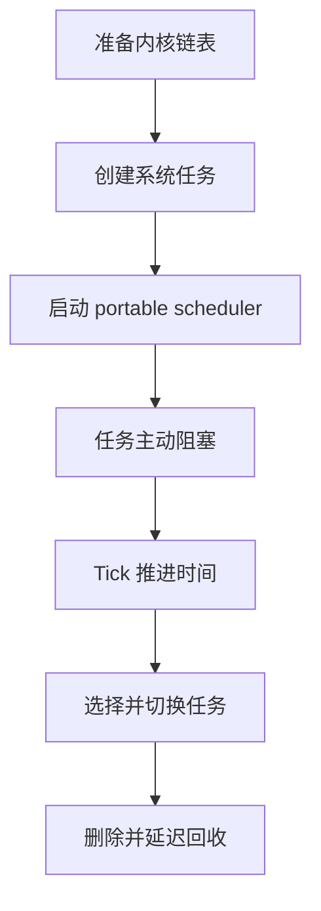
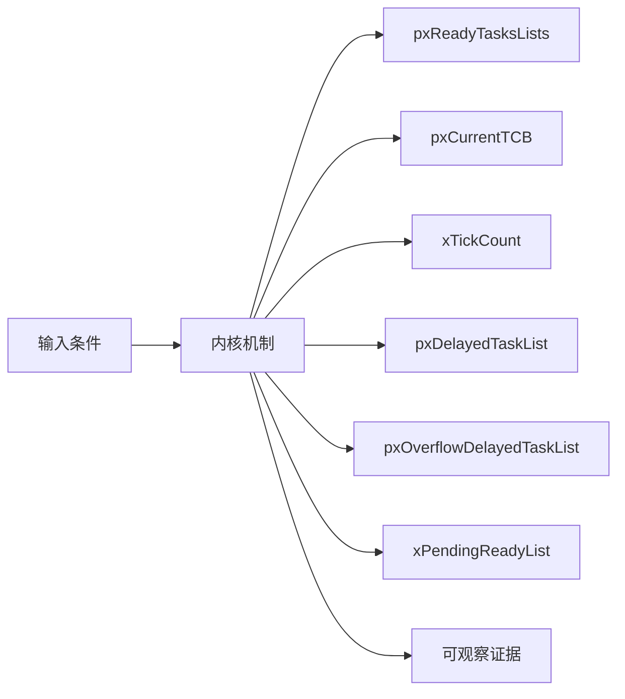
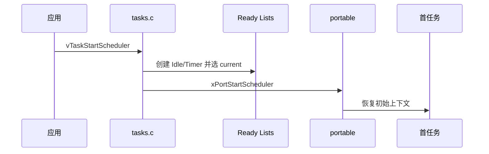
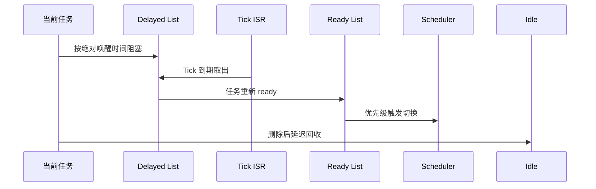
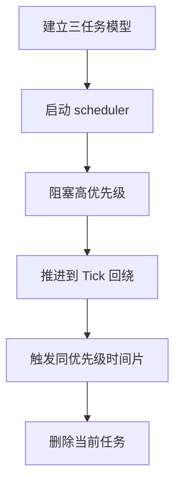
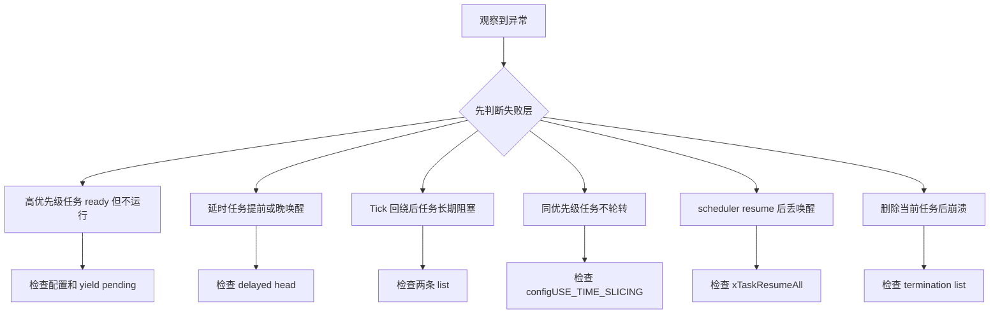

调度器不是一个持续运行的 C 循环，它由当前任务、Tick 中断、阻塞 API 和 portable 上下文切换共同推进。

本篇只回答一个核心问题：**一个任务如何从 ready 变为 running、blocked、再次 ready，最终进入延迟回收？**

分析范围固定为 **FreeRTOS-Kernel V11.3.0**。所有函数、字段、宏和条件编译都以该 tag 为准。

本篇用状态链表作为主证据，把 scheduler start、Tick、delay、unblock、switch、delete 和 Idle cleanup 连成一条闭环。

## 1. 问题边界、前置条件与验收证据

主线固定单核、抢占式调度；SMP 的多 current TCB 和跨核 yield 在进阶机制中单独解释。

读者已经会使用基本任务 API，但不能把 API 行为替代为源码证明。

阅读源码前先写清输入状态、允许的状态变化和输出证据。只看函数名或最终返回值，无法判断链表、锁和调度点是否正确。



| 顺序 | 阅读动作 | 入口条件 | 状态变化 | 验收证据 |
|---:|---|---|---|---|
| 1 | 准备内核链表 | 首任务创建。 | 状态容器可用。 | 初始化函数 trace。 |
| 2 | 创建系统任务 | scheduler 尚未运行。 | 最低优先级与 daemon 进入 ready。 | ready list 快照。 |
| 3 | 启动 portable scheduler | 公共状态已就绪。 | 控制权交给 port。 | 首次 current TCB。 |
| 4 | 任务主动阻塞 | 当前任务调用 delay/等待 API。 | 当前任务不再可运行。 | container 变化。 |
| 5 | Tick 推进时间 | Tick 中断到达。 | 到期任务转入 ready。 | unblock trace。 |
| 6 | 选择并切换任务 | yield pending 或 port 请求。 | pxCurrentTCB 更新。 | 切换前后 TCB。 |
| 7 | 删除并延迟回收 | 任务结束生命周期。 | Idle 最终释放 TCB/stack。 | 删除和回收 trace。 |

### 1. 准备内核链表

入口条件：首任务创建。

执行动作：初始化 ready/delayed/pending/suspended/termination lists。

核心状态变化：状态容器可用。

离开这一步时必须成立：任务创建可插入。

可观察证据：初始化函数 trace。

停止条件：链表未初始化时停止。

### 2. 创建系统任务

入口条件：scheduler 尚未运行。

执行动作：按配置创建 Idle 和 Timer task。

核心状态变化：最低优先级与 daemon 进入 ready。

离开这一步时必须成立：至少 Idle 可运行。

可观察证据：ready list 快照。

停止条件：Idle 创建失败时停止。

### 3. 启动 portable scheduler

入口条件：公共状态已就绪。

执行动作：设置运行标志并调用 xPortStartScheduler。

核心状态变化：控制权交给 port。

离开这一步时必须成立：首任务开始。

可观察证据：首次 current TCB。

停止条件：port 返回异常时停止。

### 4. 任务主动阻塞

入口条件：当前任务调用 delay/等待 API。

执行动作：从 ready 移除并插入 delayed/event list。

核心状态变化：当前任务不再可运行。

离开这一步时必须成立：必须请求切换。

可观察证据：container 变化。

停止条件：节点仍在 ready 时停止。

### 5. Tick 推进时间

入口条件：Tick 中断到达。

执行动作：增加 xTickCount 并检查 delayed head。

核心状态变化：到期任务转入 ready。

离开这一步时必须成立：设置是否需要 switch。

可观察证据：unblock trace。

停止条件：锁/优先级不合法时停止。

### 6. 选择并切换任务

入口条件：yield pending 或 port 请求。

执行动作：vTaskSwitchContext 选择最高优先级 owner。

核心状态变化：pxCurrentTCB 更新。

离开这一步时必须成立：port 恢复新上下文。

可观察证据：切换前后 TCB。

停止条件：选择非 ready 任务时停止。

### 7. 删除并延迟回收

入口条件：任务结束生命周期。

执行动作：从状态/event list 移除，当前任务进入 termination。

核心状态变化：Idle 最终释放 TCB/stack。

离开这一步时必须成立：全局计数一致。

可观察证据：删除和回收 trace。

停止条件：当前栈仍使用时禁止释放。

## 2. 核心数据结构、所有权与不变量

FreeRTOS 用按优先级分桶的 ready lists 和两条 delayed lists 表达时间与可运行性，pxCurrentTCB 只是当前选择结果。

这里不把字段当作词汇表，而是解释字段由谁修改、在哪个临界区修改、它和哪个链表或对象保持一致。



| 对象 | 角色 | 必须保持的不变量 | 观察方法 | 常见误读 |
|---|---|---|---|---|
| pxReadyTasksLists | 每个优先级一个 ready list。 | 非空最高优先级提供 current TCB。 | 记录每桶 length。 | 以为只有一条 ready queue。 |
| pxCurrentTCB | 当前运行任务指针。 | 必须来自 ready list。 | 记录指针和优先级。 | 把它当唯一任务集合。 |
| xTickCount | 系统 Tick 计数。 | 按 TickType_t 自然回绕。 | 记录回绕前后值。 | 认为回绕会破坏 delay。 |
| pxDelayedTaskList | 保存未跨回绕的唤醒时间有序任务。 | 头节点是最近唤醒时间。 | 观察 head item value。 | 把 delay ticks 直接存为 item value。 |
| pxOverflowDelayedTaskList | 保存唤醒时间跨 Tick 回绕的任务。 | Tick 回绕时与当前 delayed list 交换。 | 记录 list swap。 | 用特殊比较函数跨回绕。 |
| xPendingReadyList | scheduler suspended 时暂存已就绪任务。 | resume 时全部转回 ready。 | 检查 event item container。 | 认为 scheduler suspend 等于关中断。 |
| xSuspendedTaskList | 保存显式 suspend 或 indefinite block 任务。 | 不由 Tick 自动唤醒。 | 检查状态 item container。 | 把所有 blocked 任务都放这里。 |
| xTasksWaitingTermination | 保存已删除但待 Idle 释放的 TCB。 | 任务不可调度但内存仍有效。 | 观察 deleted count。 | 在 vTaskDelete 内直接释放当前栈。 |

### pxReadyTasksLists

角色：每个优先级一个 ready list。

所有权：tasks.c。

不变量：非空最高优先级提供 current TCB。

变化时机：创建、解阻塞、yield。

观察方法：记录每桶 length。

常见误读：以为只有一条 ready queue。

### pxCurrentTCB

角色：当前运行任务指针。

所有权：scheduler 与 port。

不变量：必须来自 ready list。

变化时机：首次选择和每次切换。

观察方法：记录指针和优先级。

常见误读：把它当唯一任务集合。

### xTickCount

角色：系统 Tick 计数。

所有权：Tick 路径。

不变量：按 TickType_t 自然回绕。

变化时机：每次有效 Tick 或 step tick。

观察方法：记录回绕前后值。

常见误读：认为回绕会破坏 delay。

### pxDelayedTaskList

角色：保存未跨回绕的唤醒时间有序任务。

所有权：tasks.c。

不变量：头节点是最近唤醒时间。

变化时机：任务 delay 或 unblock。

观察方法：观察 head item value。

常见误读：把 delay ticks 直接存为 item value。

### pxOverflowDelayedTaskList

角色：保存唤醒时间跨 Tick 回绕的任务。

所有权：tasks.c。

不变量：Tick 回绕时与当前 delayed list 交换。

变化时机：插入跨回绕任务和 Tick 归零。

观察方法：记录 list swap。

常见误读：用特殊比较函数跨回绕。

### xPendingReadyList

角色：scheduler suspended 时暂存已就绪任务。

所有权：ISR/API unblock 路径。

不变量：resume 时全部转回 ready。

变化时机：scheduler suspend 期间事件到达。

观察方法：检查 event item container。

常见误读：认为 scheduler suspend 等于关中断。

### xSuspendedTaskList

角色：保存显式 suspend 或 indefinite block 任务。

所有权：tasks.c。

不变量：不由 Tick 自动唤醒。

变化时机：suspend/resume 或无限等待。

观察方法：检查状态 item container。

常见误读：把所有 blocked 任务都放这里。

### xTasksWaitingTermination

角色：保存已删除但待 Idle 释放的 TCB。

所有权：delete/Idle。

不变量：任务不可调度但内存仍有效。

变化时机：删除运行任务。

观察方法：观察 deleted count。

常见误读：在 vTaskDelete 内直接释放当前栈。

## 3. 调用链一：scheduler start 到首任务运行

公共内核先保证 Idle 可运行，再把首任务恢复交给 port。vTaskStartScheduler 正常情况下不会返回。

调用链中的每一跳都要区分普通函数调用、宏展开、临界区边界和可能触发调度的 port hook。



### 调用链一：vTaskStartScheduler -> system task creation -> xPortStartScheduler -> first context

#### 链路步骤 1：检查 scheduler 状态

进入时：至少存在应用任务。

本步读取：xSchedulerRunning 与任务计数。

本步修改：无。

并发边界：调度器尚未运行。

返回或转交：允许启动。

证据：断言和返回值。

#### 链路步骤 2：创建 Idle task

进入时：静态/动态配置确定。

本步读取：Idle entry、最低优先级、内存 hook。

本步修改：ready list 增加。

并发边界：创建阶段临界区。

返回或转交：保证至少一个可运行任务。

证据：Idle TCB。

#### 链路步骤 3：创建 Timer task

进入时：configUSE_TIMERS 启用。

本步读取：timer queue 与 daemon 配置。

本步修改：daemon ready。

并发边界：timer 模块内部。

返回或转交：软件定时器可服务。

证据：Timer TCB/queue。

#### 链路步骤 4：关闭启动窗口

进入时：系统任务完成。

本步读取：中断状态与调度全局变量。

本步修改：xSchedulerRunning 等。

并发边界：port 定义的启动规则。

返回或转交：公共状态冻结。

证据：启动 trace。

#### 链路步骤 5：调用 xPortStartScheduler

进入时：current 候选已存在。

本步读取：pxCurrentTCB 与 port 配置。

本步修改：CPU Tick/异常机制。

并发边界：portable 边界。

返回或转交：port 接管。

证据：函数入口。

#### 链路步骤 6：恢复首任务

进入时：port 已配置。

本步读取：TCB 栈顶和初始帧。

本步修改：CPU 寄存器与执行流。

并发边界：异常返回。

返回或转交：任务函数开始。

证据：PC/PSP 或架构上下文。

### 源码片段：调度器用多组链表表达任务状态

> 源码位置：`tasks.c` · `scheduler list declarations` · `V11.3.0`
> 配置条件：单核主线
> 固定链接：[查看上游源码](https://github.com/FreeRTOS/FreeRTOS-Kernel/blob/V11.3.0/tasks.c)

```c
static List_t pxReadyTasksLists[ configMAX_PRIORITIES ];
static List_t xDelayedTaskList1;
static List_t xDelayedTaskList2;
static List_t * volatile pxDelayedTaskList;
static List_t * volatile pxOverflowDelayedTaskList;
static List_t xPendingReadyList;
```

这段摘录只保留当前机制需要的语句；省略的参数检查、trace hook 或条件分支必须回到固定链接核对。

解读 1：ready 按优先级分桶。

解读 2：两条 delayed list 处理 Tick 回绕。

解读 3：pending ready 用于 scheduler suspended 窗口。

解读 4：其他配置还会加入 suspended 和 termination list。

不变量：每个任务状态节点只能属于一个状态链表。

观察点：同时记录各 list length 与每个 TCB 的 container。

### 源码片段：scheduler start 把控制权交给 port

> 源码位置：`tasks.c` · `vTaskStartScheduler()` · `V11.3.0`
> 配置条件：configNUMBER_OF_CORES == 1 主线
> 固定链接：[查看上游源码](https://github.com/FreeRTOS/FreeRTOS-Kernel/blob/V11.3.0/tasks.c)

```c
xReturn = xTaskCreate( prvIdleTask, configIDLE_TASK_NAME,
                       configMINIMAL_STACK_SIZE, NULL,
                       portPRIVILEGE_BIT, &xIdleTaskHandle );

if( xReturn == pdPASS )
{
    xPortStartScheduler();
}
```

这段摘录只保留当前机制需要的语句；省略的参数检查、trace hook 或条件分支必须回到固定链接核对。

解读 1：实际代码按静态/动态分配选择 Idle 创建路径。

解读 2：启用 timers 时先创建 daemon task。

解读 3：公共状态在调用 port 前设置完成。

解读 4：成功启动时一般不会返回应用调用点。

不变量：调用 port 前至少存在可运行的 Idle task。

观察点：检查 Idle TCB、ready list 和 xSchedulerRunning。

## 4. 调用链二：delay、Tick 解阻塞、抢占与删除回收

一条完整生命周期必须同时观察状态节点、event 节点、Tick、ready 优先级和 port 切换请求。

第二条链用于验证同一对象在另一条执行路径上的行为，重点检查它是否复用相同不变量，还是进入 ISR、daemon 或 portable 层的特殊规则。



### 调用链二：vTaskDelay -> delayed list -> xTaskIncrementTick -> ready list -> vTaskSwitchContext -> vTaskDelete -> Idle cleanup

#### 链路步骤 1：计算唤醒时间

进入时：当前任务运行。

本步读取：xTickCount 与等待 ticks。

本步修改：xTimeToWake。

并发边界：scheduler suspend + critical。

返回或转交：决定 delayed/overflow list。

证据：item value。

#### 链路步骤 2：移出 ready

进入时：阻塞条件成立。

本步读取：当前 priority ready list。

本步修改：状态节点脱离。

并发边界：scheduler 锁。

返回或转交：当前任务不可选。

证据：container 变化。

#### 链路步骤 3：插入 delayed

进入时：唤醒时间确定。

本步读取：目标 delayed list。

本步修改：按时间排序。

并发边界：同一状态变化窗口。

返回或转交：更新 next unblock time。

证据：head value。

#### 链路步骤 4：Tick 处理到期

进入时：Tick 增加。

本步读取：delayed head 与 xTickCount。

本步修改：到期节点被 remove。

并发边界：Tick 临界区/ISR。

返回或转交：准备进入 ready。

证据：traceTASK_INCREMENT_TICK。

#### 链路步骤 5：解除事件等待并 ready

进入时：任务可能还在 event list。

本步读取：两个 list item。

本步修改：状态节点进入 ready。

并发边界：ISR 安全原语。

返回或转交：决定是否抢占。

证据：priority 比较。

#### 链路步骤 6：删除与 Idle 回收

进入时：任务调用 delete 或被删除。

本步读取：状态/event list 与 TCB 内存。

本步修改：termination list 后释放。

并发边界：当前栈不能自释放。

返回或转交：任务数最终一致。

证据：deleted count 和 heap。

### 源码片段：Tick 只检查 delayed list 头部

> 源码位置：`tasks.c` · `xTaskIncrementTick()` · `V11.3.0`
> 配置条件：Tick 中断调用且 scheduler 状态允许
> 固定链接：[查看上游源码](https://github.com/FreeRTOS/FreeRTOS-Kernel/blob/V11.3.0/tasks.c)

```c
const TickType_t xConstTickCount = xTickCount + ( TickType_t ) 1;
xTickCount = xConstTickCount;

if( xConstTickCount == ( TickType_t ) 0U )
{
    taskSWITCH_DELAYED_LISTS();
}

pxTCB = listGET_OWNER_OF_HEAD_ENTRY( pxDelayedTaskList );
```

这段摘录只保留当前机制需要的语句；省略的参数检查、trace hook 或条件分支必须回到固定链接核对。

解读 1：TickType_t 自然回绕到零。

解读 2：回绕时交换两条 delayed list。

解读 3：链表按唤醒时间排序，因此从头检查。

解读 4：到期任务会移出 delayed/event 并进入 ready。

不变量：xNextTaskUnblockTime 等于当前 delayed list 最近唤醒时间。

观察点：记录 Tick、两条 list 指针和 head item value。

### 源码片段：单核切换从最高优先级 ready list 选 owner

> 源码位置：`tasks.c` · `vTaskSwitchContext()` · `V11.3.0`
> 配置条件：configNUMBER_OF_CORES == 1
> 固定链接：[查看上游源码](https://github.com/FreeRTOS/FreeRTOS-Kernel/blob/V11.3.0/tasks.c)

```c
if( uxSchedulerSuspended != ( UBaseType_t ) 0U )
{
    xYieldPendings[ 0 ] = pdTRUE;
}
else
{
    traceTASK_SWITCHED_OUT();
    taskSELECT_HIGHEST_PRIORITY_TASK();
    traceTASK_SWITCHED_IN();
}
```

这段摘录只保留当前机制需要的语句；省略的参数检查、trace hook 或条件分支必须回到固定链接核对。

解读 1：scheduler suspended 时不立即改 current。

解读 2：yield pending 记录延迟切换请求。

解读 3：真正选择由 taskSELECT 宏完成。

解读 4：trace hook 位于切出和切入边界。

不变量：scheduler 未挂起时，切换后 current 必须是最高优先级 ready 成员。

观察点：记录 uxSchedulerSuspended、yield pending 和 current TCB。

## 5. 配置矩阵、观测实验与证据记录

使用可控输入和 trace hook 观察对象变化，不依赖特定开发板。

实验只承诺观察软件状态和调用顺序。没有实际目标硬件或 trace 数据时，不写虚构时间和性能数字。



### 配置矩阵

| 配置或条件 | 取值 A | 取值 B | 源码影响 | 验证重点 |
|---|---|---|---|---|
| configUSE_PREEMPTION | 0 | 1 | 决定高优先级 ready 后是否自动请求切换。 | 观察 yield pending。 |
| configUSE_TIME_SLICING | 0 | 1 | 决定同优先级多任务是否随 Tick 轮转。 | 比较 current 序列。 |
| configUSE_16_BIT_TICKS | 0 | 1 | 改变 TickType_t 宽度和回绕周期。 | 缩短实验验证 list swap。 |
| configUSE_TIMERS | 0 | 1 | 决定 scheduler start 是否创建 Timer task。 | 检查 ready list 与 daemon。 |
| INCLUDE_vTaskDelete | 0 | 1 | 决定删除和 termination cleanup 路径。 | 验证 Idle 回收。 |
| INCLUDE_vTaskSuspend | 0 | 1 | 决定显式 suspend 和 indefinite block 相关路径。 | 检查 suspended list。 |

### 实验步骤

1. **建立三任务模型**

   操作：设置高/中/低优先级及不同 delay。

   记录：任务优先级和状态节点。

   通过标准：初始 ready 桶正确。

2. **启动 scheduler**

   操作：记录 Idle/Timer/current。

   记录：首任务与系统任务。

   通过标准：最高优先级任务运行。

3. **阻塞高优先级**

   操作：调用 delay 并记录容器。

   记录：唤醒 Tick 与 delayed list。

   通过标准：切换到次高任务。

4. **推进到 Tick 回绕**

   操作：使用窄 Tick 或设置初值。

   记录：两条 delayed list 指针。

   通过标准：回绕交换正确。

5. **触发同优先级时间片**

   操作：创建同优先级任务。

   记录：每 Tick current owner。

   通过标准：配置开启时轮转。

6. **删除当前任务**

   操作：记录 termination 与 heap。

   记录：删除和 Idle 回收事件。

   通过标准：当前栈离开后才释放。

### 证据表

| 证据 | 获取方法 | 通过标准 | 失败说明 |
|---|---|---|---|
| 首任务选择 | scheduler start trace | 最高优先级 ready owner 运行 | 选择错误说明 ready/top priority 不一致 |
| 阻塞容器 | 查看 state item container | 从 ready 进入 delayed/suspended | 仍在 ready 会导致阻塞失效 |
| 唤醒时间 | 查看 item value 与 next unblock | 等于绝对 Tick | 存相对值会破坏排序 |
| 回绕交换 | 记录两个 delayed 指针 | Tick 归零时交换一次 | 未交换会延迟跨回绕任务 |
| 切换原因 | trace switched in/out 与 yield | 每次切换可解释 | 无原因切换提示 hook/port 问题 |
| 删除回收 | termination length 和 heap | Idle 后内存回收且计数一致 | 提前释放会破坏当前上下文 |

#### 证据：首任务选择

获取方法：scheduler start trace

应当看到：最高优先级 ready owner 运行

如果不满足：选择错误说明 ready/top priority 不一致

为什么这项证据有效：首任务验证公共策略与 port 交接。

#### 证据：阻塞容器

获取方法：查看 state item container

应当看到：从 ready 进入 delayed/suspended

如果不满足：仍在 ready 会导致阻塞失效

为什么这项证据有效：链表归属直接表达状态。

#### 证据：唤醒时间

获取方法：查看 item value 与 next unblock

应当看到：等于绝对 Tick

如果不满足：存相对值会破坏排序

为什么这项证据有效：Tick 只需检查头节点。

#### 证据：回绕交换

获取方法：记录两个 delayed 指针

应当看到：Tick 归零时交换一次

如果不满足：未交换会延迟跨回绕任务

为什么这项证据有效：双列表避免复杂环形比较。

#### 证据：切换原因

获取方法：trace switched in/out 与 yield

应当看到：每次切换可解释

如果不满足：无原因切换提示 hook/port 问题

为什么这项证据有效：调度证据必须带触发源。

#### 证据：删除回收

获取方法：termination length 和 heap

应当看到：Idle 后内存回收且计数一致

如果不满足：提前释放会破坏当前上下文

为什么这项证据有效：延迟回收保护正在使用的栈。

## 6. 常见误读、故障定位与修复原则

排错从最早被破坏的不变量开始，不从最终崩溃位置随机回退。

先验证对象成员和链表归属，再检查锁、配置分支和调度请求。



### 1. 高优先级任务 ready 但不运行

根因：scheduler suspended、抢占关闭或中断屏蔽

第一检查点：检查配置和 yield pending

需要保存的证据：ready list、suspend depth、port 状态

修复原则：恢复正确调度边界

不能采用的绕过方式：不要循环主动 yield。

### 2. 延时任务提前或晚唤醒

根因：把相对 delay 当绝对 item value

第一检查点：检查 delayed head

需要保存的证据：Tick、item value、list 指针

修复原则：按 xTickCount 计算唤醒时间

不能采用的绕过方式：不要手工修改 xTickCount。

### 3. Tick 回绕后任务长期阻塞

根因：overflow list 插入或交换错误

第一检查点：检查两条 list

需要保存的证据：回绕前后指针和节点

修复原则：修复 list 选择/交换

不能采用的绕过方式：不要扩大 Tick 位宽掩盖。

### 4. 同优先级任务不轮转

根因：时间片关闭或 Tick 未触发 yield

第一检查点：检查 configUSE_TIME_SLICING

需要保存的证据：Tick trace 与 list length

修复原则：按配置启用或主动阻塞

不能采用的绕过方式：不要提高某任务优先级伪装公平。

### 5. scheduler resume 后丢唤醒

根因：pending ready 未搬回 ready

第一检查点：检查 xTaskResumeAll

需要保存的证据：pending list 与 pended ticks

修复原则：完整处理 pending 事件

不能采用的绕过方式：不要在 suspend 窗口直接改 ready。

### 6. 删除当前任务后崩溃

根因：在当前栈上提前释放 TCB/stack

第一检查点：检查 termination list

需要保存的证据：delete 与 Idle 时间线

修复原则：延迟到 Idle cleanup

不能采用的绕过方式：不要在 vTaskDelete 后访问局部对象。

### 7. Idle 得不到运行导致内存不回收

根因：高优先级任务从不阻塞

第一检查点：检查 Idle runtime

需要保存的证据：termination length 和 CPU 占用

修复原则：让任务阻塞或 yield 到 Idle 条件

不能采用的绕过方式：不要在业务任务直接释放别的 TCB。

## 7. 源码索引、阶段验收与面试表达

完成本篇后，读者应能不依赖文章复述对象模型、两条调用链、配置差异和取证顺序。

### 源码索引

| 文件 | 结构体 / 函数 / 宏 | 作用 |
|---|---|---|
| [tasks.c](https://github.com/FreeRTOS/FreeRTOS-Kernel/blob/V11.3.0/tasks.c) | vTaskStartScheduler、vTaskSwitchContext | 启动与调度主线 |
| [tasks.c](https://github.com/FreeRTOS/FreeRTOS-Kernel/blob/V11.3.0/tasks.c) | xTaskIncrementTick、taskSWITCH_DELAYED_LISTS | Tick 与延时唤醒 |
| [tasks.c](https://github.com/FreeRTOS/FreeRTOS-Kernel/blob/V11.3.0/tasks.c) | prvAddCurrentTaskToDelayedList | 阻塞与绝对唤醒时间 |
| [tasks.c](https://github.com/FreeRTOS/FreeRTOS-Kernel/blob/V11.3.0/tasks.c) | vTaskDelete、prvCheckTasksWaitingTermination | 删除与 Idle 回收 |
| [include/task.h](https://github.com/FreeRTOS/FreeRTOS-Kernel/blob/V11.3.0/include/task.h) | delay/suspend/delete API guard | 公开生命周期契约 |

### 阶段验收

1. 能画出全部状态链表关系。
2. 能解释 ready list 的优先级分桶。
3. 能跟踪 scheduler start 到首任务。
4. 能解释 Tick 只检查 delayed head。
5. 能推演 Tick 回绕时双链表交换。
6. 能区分 scheduler suspend 与关中断。
7. 能解释同优先级时间片。
8. 能解释当前任务删除为何延迟回收。

### 验收记录模板

| 项目 | 实际证据 | 结论 |
|---|---|---|
| 能画出全部状态链表关系。 |  |  |
| 能解释 ready list 的优先级分桶。 |  |  |
| 能跟踪 scheduler start 到首任务。 |  |  |
| 能解释 Tick 只检查 delayed head。 |  |  |
| 能推演 Tick 回绕时双链表交换。 |  |  |
| 能区分 scheduler suspend 与关中断。 |  |  |
| 能解释同优先级时间片。 |  |  |
| 能解释当前任务删除为何延迟回收。 |  |  |

### 面试表达

FreeRTOS 的任务状态主要由 xStateListItem 属于哪条链表表达，ready、delayed、suspended 和 termination 是互斥的状态容器。

Tick 回绕通过交换 delayed 与 overflow delayed 两条有序链表处理，不要求对每个节点做跨回绕比较。

删除当前任务时不能释放正在使用的栈，因此先移到 termination list，再由 Idle task 在安全上下文回收。

### 参考资料

- [FreeRTOS-Kernel V11.3.0](https://github.com/FreeRTOS/FreeRTOS-Kernel/tree/V11.3.0)
- [FreeRTOS Kernel Book](https://github.com/FreeRTOS/FreeRTOS-Kernel-Book)

> 🏷️ FreeRTOS / Scheduler / Tick / Delayed List / Idle Task
