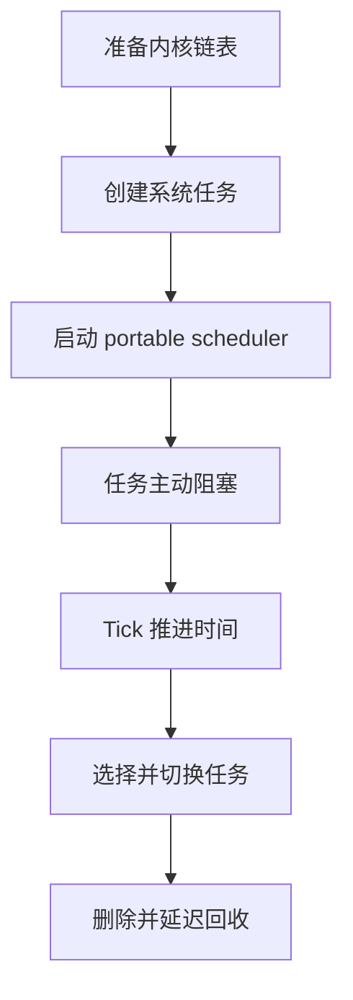
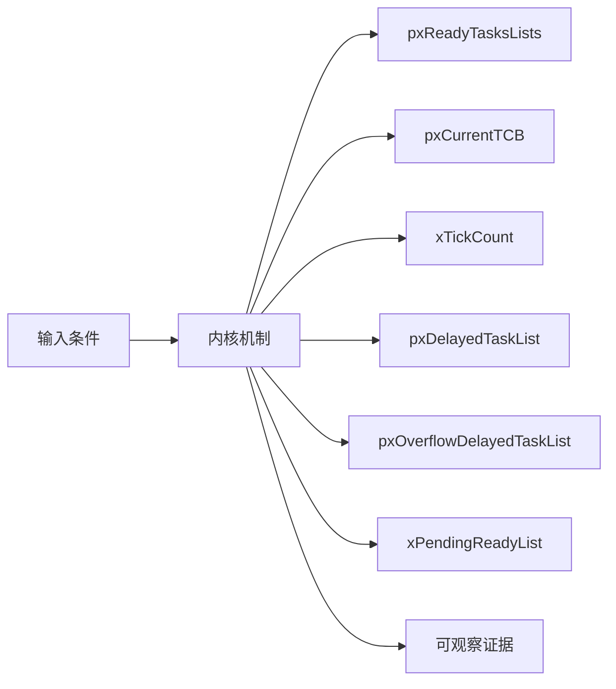
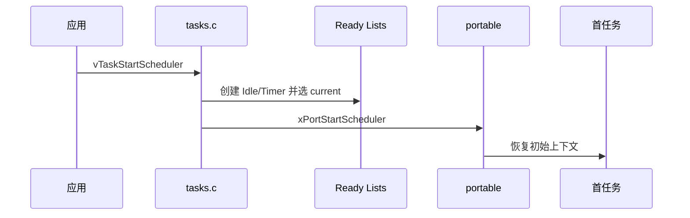
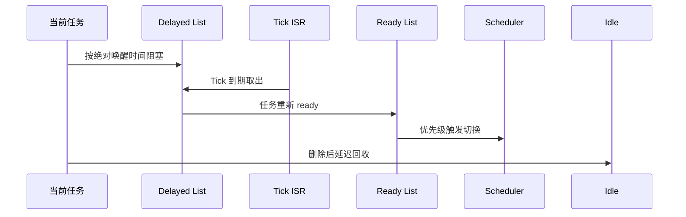
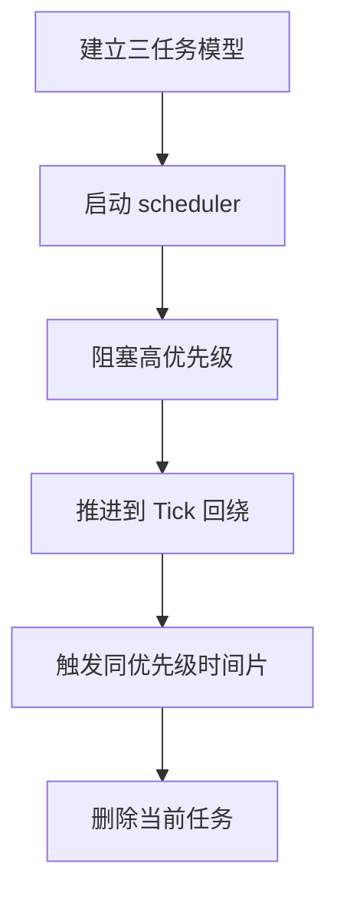
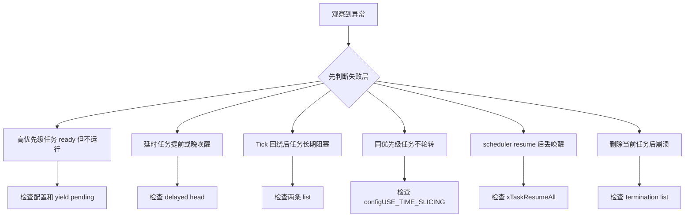

调度器不是一个持续运行的 C 循环，它由当前任务、Tick 中断、阻塞 API 和 portable 上下文切换共同推进。

本篇只回答一个核心问题：**一个任务如何从 ready 变为 running、blocked、再次 ready，最终进入延迟回收？**

分析范围固定为 **FreeRTOS-Kernel V11.3.0**。所有函数、字段、宏和条件编译都以该 tag 为准。

本篇用状态链表作为主证据，把 scheduler start、Tick、delay、unblock、switch、delete 和 Idle cleanup 连成一条闭环。

## 1. 调度器究竟维护哪些状态

主线固定单核、抢占式调度；SMP 的多 current TCB 和跨核 yield 在进阶机制中单独解释。



## 2. Ready、Delayed 与 Pending Ready 共同表达任务状态

FreeRTOS 用按优先级分桶的 ready lists 和两条 delayed lists 表达时间与可运行性，pxCurrentTCB 只是当前选择结果。



| 对象 | 角色 | 必须保持的不变量 | 观察方法 | 常见误读 |
|---|---|---|---|---|
| pxReadyTasksLists | 每个优先级一个 ready list。 | 非空最高优先级提供 current TCB。 | 记录每桶 length。 | 以为只有一条 ready queue。 |
| pxCurrentTCB | 当前运行任务指针。 | 必须来自 ready list。 | 记录指针和优先级。 | 把它当唯一任务集合。 |
| xTickCount | 系统 Tick 计数。 | 按 TickType_t 自然回绕。 | 记录回绕前后值。 | 认为回绕会破坏 delay。 |
| pxDelayedTaskList | 保存未跨回绕的唤醒时间有序任务。 | 头节点是最近唤醒时间。 | 观察 head item value。 | 把 delay ticks 直接存为 item value。 |
| pxOverflowDelayedTaskList | 保存唤醒时间跨 Tick 回绕的任务。 | Tick 回绕时与当前 delayed list 交换。 | 记录 list swap。 | 用特殊比较函数跨回绕。 |
| xPendingReadyList | scheduler suspended 时暂存已就绪任务。 | resume 时全部转回 ready。 | 检查 event item container。 | 认为 scheduler suspend 等于关中断。 |
| xSuspendedTaskList | 保存显式 suspend 或 indefinite block 任务。 | 不由 Tick 自动唤醒。 | 检查状态 item container。 | 把所有 blocked 任务都放这里。 |
| xTasksWaitingTermination | 保存已删除但待 Idle 释放的 TCB。 | 任务不可调度但内存仍有效。 | 观察 deleted count。 | 在 vTaskDelete 内直接释放当前栈。 |

## 3. 调用链一：scheduler start 到首任务运行

公共内核先保证 Idle 可运行，再把首任务恢复交给 port。vTaskStartScheduler 正常情况下不会返回。



### 调用链一：vTaskStartScheduler -> system task creation -> xPortStartScheduler -> first context

vTaskStartScheduler 首先确认至少有一个可运行任务，然后创建 Idle task；Idle 处于最低优先级，它保证 ready 集合永远不会完全为空，并承担已删除任务的延迟回收。如果 configUSE_TIMERS 打开，还要先建立 timer command queue 和 daemon task，软件定时器才有执行上下文。

系统任务创建成功后，内核初始化调度相关全局状态并选择首个 pxCurrentTCB。随后 xPortStartScheduler 接管处理器相关的 Tick 和首任务恢复工作。从这一调用开始，正常成功路径不会像普通 C 函数那样返回；portable 层恢复首个 TCB 的初始上下文后，执行流直接进入任务函数。

这里必须区分两层职责：tasks.c 决定 Idle、Timer daemon 和首个 current task 的状态，portable 层只把已经选定的任务上下文恢复到处理器。验证启动链时应记录系统任务的 TCB、xSchedulerRunning、首个 pxCurrentTCB，以及 portable 入口前后的执行流，而不依赖某一种处理器的栈指针名称。

### 源码片段：调度器用多组链表表达任务状态

> 源码位置：`tasks.c` · `scheduler list declarations` · `V11.3.0`
> 配置条件：单核主线
> 固定链接：[查看上游源码](https://github.com/FreeRTOS/FreeRTOS-Kernel/blob/V11.3.0/tasks.c)

```c
static List_t pxReadyTasksLists[ configMAX_PRIORITIES ];
static List_t xDelayedTaskList1;
static List_t xDelayedTaskList2;
static List_t * volatile pxDelayedTaskList;
static List_t * volatile pxOverflowDelayedTaskList;
static List_t xPendingReadyList;
```

- ready 按优先级分桶。
- 两条 delayed list 处理 Tick 回绕。
- pending ready 用于 scheduler suspended 窗口。
- 其他配置还会加入 suspended 和 termination list。

> **关键约束**：每个任务状态节点只能属于一个状态链表。 **验证重点**：同时记录各 list length 与每个 TCB 的 container。

### 源码片段：scheduler start 把控制权交给 port

> 源码位置：`tasks.c` · `vTaskStartScheduler()` · `V11.3.0`
> 配置条件：configNUMBER_OF_CORES == 1 主线
> 固定链接：[查看上游源码](https://github.com/FreeRTOS/FreeRTOS-Kernel/blob/V11.3.0/tasks.c)

```c
xReturn = xTaskCreate( prvIdleTask, configIDLE_TASK_NAME,
                       configMINIMAL_STACK_SIZE, NULL,
                       portPRIVILEGE_BIT, &xIdleTaskHandle );

if( xReturn == pdPASS )
{
    xPortStartScheduler();
}
```

- 实际代码按静态/动态分配选择 Idle 创建路径。
- 启用 timers 时先创建 daemon task。
- 公共状态在调用 port 前设置完成。
- 成功启动时一般不会返回应用调用点。

> **关键约束**：调用 port 前至少存在可运行的 Idle task。 **验证重点**： Idle TCB、ready list 和 xSchedulerRunning。

## 4. 调用链二：delay、Tick 解阻塞、抢占与删除回收

一条完整生命周期必须同时观察状态节点、event 节点、Tick、ready 优先级和 port 切换请求。



### 调用链二：vTaskDelay -> delayed list -> xTaskIncrementTick -> ready list -> vTaskSwitchContext -> vTaskDelete -> Idle cleanup

vTaskDelay 读取当前 xTickCount 并计算绝对唤醒时间，然后把当前任务的状态节点从 ready list 移出。根据加法是否跨越 Tick 回绕点，任务被按 xItemValue 插入当前 delayed list 或 overflow delayed list；列表头同时决定 xNextTaskUnblockTime，Tick 处理无需扫描全部任务。

xTaskIncrementTick 每次只检查 delayed list 头部。到期任务先从状态链表移除；如果它还挂在某个事件等待链表，也要移除 xEventListItem，然后按优先级进入 ready list。只有新就绪任务足以触发抢占或时间片轮转时，函数才返回需要切换的标志，portable 层随后在合适边界完成实际切换。

删除路径解决的是另一种生命周期问题。删除非当前任务可以直接进入回收；当前任务仍在使用自己的栈，内核只能把它移出可调度集合并放入 xTasksWaitingTermination，切换到其他任务后再由 Idle task 释放 TCB 和栈。任务数、termination list 长度和 heap 余量应在 Idle 运行后最终一致。

### 源码片段：Tick 只检查 delayed list 头部

> 源码位置：`tasks.c` · `xTaskIncrementTick()` · `V11.3.0`
> 配置条件：Tick 中断调用且 scheduler 状态允许
> 固定链接：[查看上游源码](https://github.com/FreeRTOS/FreeRTOS-Kernel/blob/V11.3.0/tasks.c)

```c
const TickType_t xConstTickCount = xTickCount + ( TickType_t ) 1;
xTickCount = xConstTickCount;

if( xConstTickCount == ( TickType_t ) 0U )
{
    taskSWITCH_DELAYED_LISTS();
}

pxTCB = listGET_OWNER_OF_HEAD_ENTRY( pxDelayedTaskList );
```

- TickType_t 自然回绕到零。
- 回绕时交换两条 delayed list。
- 链表按唤醒时间排序，因此从头检查。
- 到期任务会移出 delayed/event 并进入 ready。

> **关键约束**：xNextTaskUnblockTime 等于当前 delayed list 最近唤醒时间。 **验证重点**：记录 Tick、两条 list 指针和 head item value。

### 源码片段：单核切换从最高优先级 ready list 选 owner

> 源码位置：`tasks.c` · `vTaskSwitchContext()` · `V11.3.0`
> 配置条件：configNUMBER_OF_CORES == 1
> 固定链接：[查看上游源码](https://github.com/FreeRTOS/FreeRTOS-Kernel/blob/V11.3.0/tasks.c)

```c
if( uxSchedulerSuspended != ( UBaseType_t ) 0U )
{
    xYieldPendings[ 0 ] = pdTRUE;
}
else
{
    traceTASK_SWITCHED_OUT();
    taskSELECT_HIGHEST_PRIORITY_TASK();
    traceTASK_SWITCHED_IN();
}
```

- scheduler suspended 时不立即改 current。
- yield pending 记录延迟切换请求。
- 真正选择由 taskSELECT 宏完成。
- trace hook 位于切出和切入边界。

> **关键约束**：scheduler 未挂起时，切换后 current 必须是最高优先级 ready 成员。 **验证重点**：记录 uxSchedulerSuspended、yield pending 和 current TCB。

## 5. 推演启动、延时、Tick 回绕与删除回收



### 配置矩阵

| 配置或条件 | 取值 A | 取值 B | 源码影响 | 验证重点 |
|---|---|---|---|---|
| configUSE_PREEMPTION | 0 | 1 | 决定高优先级 ready 后是否自动请求切换。 | 观察 yield pending。 |
| configUSE_TIME_SLICING | 0 | 1 | 决定同优先级多任务是否随 Tick 轮转。 | 比较 current 序列。 |
| configUSE_16_BIT_TICKS | 0 | 1 | 改变 TickType_t 宽度和回绕周期。 | 缩短实验验证 list swap。 |
| configUSE_TIMERS | 0 | 1 | 决定 scheduler start 是否创建 Timer task。 | 检查 ready list 与 daemon。 |
| INCLUDE_vTaskDelete | 0 | 1 | 决定删除和 termination cleanup 路径。 | 验证 Idle 回收。 |
| INCLUDE_vTaskSuspend | 0 | 1 | 决定显式 suspend 和 indefinite block 相关路径。 | 检查 suspended list。 |

### 实验步骤

1. **建立三任务模型。** 设置高/中/低优先级及不同 delay，并保存任务优先级和状态节点；只有初始 ready 桶正确，这一步才算完成。
2. **启动 scheduler。** 记录 Idle/Timer/current。重点核对首任务与系统任务，结果应满足“最高优先级任务运行”。
3. **阻塞高优先级。** 调用 delay 并记录容器，把唤醒 Tick 与 delayed list 保存为证据；判断依据是切换到次高任务。
4. **推进到 Tick 回绕。** 使用窄 Tick 或设置初值；观察两条 delayed list 指针。若回绕交换正确，即可进入下一步。
5. **触发同优先级时间片。** 创建同优先级任务，随后比较每 Tick current owner；预期是配置开启时轮转。
6. **删除当前任务。** 记录 termination 与 heap。最后用删除和 Idle 回收事件确认当前栈离开后才释放。

### 证据表

| 证据 | 获取方法 | 通过标准 | 失败说明 |
|---|---|---|---|
| 首任务选择 | scheduler start trace | 最高优先级 ready owner 运行 | 选择错误说明 ready/top priority 不一致 |
| 阻塞容器 | 查看 state item container | 从 ready 进入 delayed/suspended | 仍在 ready 会导致阻塞失效 |
| 唤醒时间 | 查看 item value 与 next unblock | 等于绝对 Tick | 存相对值会破坏排序 |
| 回绕交换 | 记录两个 delayed 指针 | Tick 归零时交换一次 | 未交换会延迟跨回绕任务 |
| 切换原因 | trace switched in/out 与 yield | 每次切换可解释 | 无原因切换提示 hook/port 问题 |
| 删除回收 | termination length 和 heap | Idle 后内存回收且计数一致 | 提前释放会破坏当前上下文 |

## 6. 从状态链表和 Tick 时间线定位调度故障

先验证对象成员和链表归属，再检查锁、配置分支和调度请求。



| 现象 | 根因 | 第一检查点 | 应保存的证据 | 修复原则 |
|---|---|---|---|---|
| 高优先级任务 ready 但不运行 | scheduler suspended、抢占关闭或中断屏蔽 | 检查配置和 yield pending | ready list、suspend depth、port 状态 | 恢复正确调度边界 |
| 延时任务提前或晚唤醒 | 把相对 delay 当绝对 item value | 检查 delayed head | Tick、item value、list 指针 | 按 xTickCount 计算唤醒时间 |
| Tick 回绕后任务长期阻塞 | overflow list 插入或交换错误 | 检查两条 list | 回绕前后指针和节点 | 修复 list 选择/交换 |
| 同优先级任务不轮转 | 时间片关闭或 Tick 未触发 yield | 检查 configUSE_TIME_SLICING | Tick trace 与 list length | 按配置启用或主动阻塞 |
| scheduler resume 后丢唤醒 | pending ready 未搬回 ready | 检查 xTaskResumeAll | pending list 与 pended ticks | 完整处理 pending 事件 |
| 删除当前任务后崩溃 | 在当前栈上提前释放 TCB/stack | 检查 termination list | delete 与 Idle 时间线 | 延迟到 Idle cleanup |
| Idle 得不到运行导致内存不回收 | 高优先级任务从不阻塞 | 检查 Idle runtime | termination length 和 CPU 占用 | 让任务阻塞或 yield 到 Idle 条件 |

## 7. 源码索引、阶段验收与面试表达

### 源码索引

| 文件 | 结构体 / 函数 / 宏 | 作用 |
|---|---|---|
| [tasks.c](https://github.com/FreeRTOS/FreeRTOS-Kernel/blob/V11.3.0/tasks.c) | vTaskStartScheduler、vTaskSwitchContext | 启动与调度主线 |
| [tasks.c](https://github.com/FreeRTOS/FreeRTOS-Kernel/blob/V11.3.0/tasks.c) | xTaskIncrementTick、taskSWITCH_DELAYED_LISTS | Tick 与延时唤醒 |
| [tasks.c](https://github.com/FreeRTOS/FreeRTOS-Kernel/blob/V11.3.0/tasks.c) | prvAddCurrentTaskToDelayedList | 阻塞与绝对唤醒时间 |
| [tasks.c](https://github.com/FreeRTOS/FreeRTOS-Kernel/blob/V11.3.0/tasks.c) | vTaskDelete、prvCheckTasksWaitingTermination | 删除与 Idle 回收 |
| [include/task.h](https://github.com/FreeRTOS/FreeRTOS-Kernel/blob/V11.3.0/include/task.h) | delay/suspend/delete API guard | 公开生命周期契约 |

### 阶段验收

1. 能画出全部状态链表关系。
2. 能解释 ready list 的优先级分桶。
3. 能跟踪 scheduler start 到首任务。
4. 能解释 Tick 只检查 delayed head。
5. 能推演 Tick 回绕时双链表交换。
6. 能区分 scheduler suspend 与关中断。
7. 能解释同优先级时间片。
8. 能解释当前任务删除为何延迟回收。

### 面试表达

FreeRTOS 的任务状态主要由 xStateListItem 属于哪条链表表达，ready、delayed、suspended 和 termination 是互斥的状态容器。

Tick 回绕通过交换 delayed 与 overflow delayed 两条有序链表处理，不要求对每个节点做跨回绕比较。

删除当前任务时不能释放正在使用的栈，因此先移到 termination list，再由 Idle task 在安全上下文回收。

### 参考资料

- [FreeRTOS-Kernel V11.3.0](https://github.com/FreeRTOS/FreeRTOS-Kernel/tree/V11.3.0)
- [FreeRTOS Kernel Book](https://github.com/FreeRTOS/FreeRTOS-Kernel-Book)

> 🏷️ FreeRTOS / Scheduler / Tick / Delayed List / Idle Task
