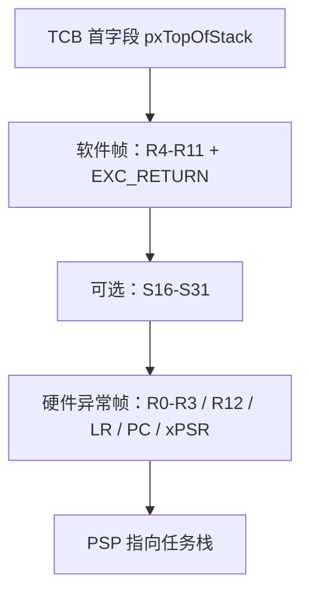

# FreeRTOS 内核源码解读 04：Cortex-M4 移植与上下文切换

公共调度器把新任务写入 `pxCurrentTCB` 后，只完成了“谁应该运行”的决定。Cortex-M4 port 还要把旧任务的处理器现场写回旧 TCB，再从新 TCB 恢复另一套现场。这个过程之所以集中在 SVC、SysTick 和 PendSV 三个异常入口，是因为 Cortex-M 的异常机制已经替软件完成了一半寄存器保存。

本篇固定使用 **FreeRTOS-Kernel V11.3.0**，commit `9b777ae5c5b8e9e456065a00294d1e5f5f9facf5`，源码目录为 `portable/GCC/ARM_CM4F`。只讨论架构和上游 port，不绑定具体 MCU、开发板、启动文件生成器或厂商库。

## 一个任务现场由硬件帧和软件帧共同组成

Cortex-M 异常入口会自动把 R0-R3、R12、LR、PC 和 xPSR 压入当前线程栈；异常返回时，硬件再自动弹出这些寄存器。R4-R11 属于被调用者保存寄存器，硬件异常入口不负责它们，FreeRTOS 必须自行保存。

任务上下文因此分成两段：

- 硬件异常帧：R0-R3、R12、LR、PC、xPSR，以及使用浮点扩展帧时由硬件处理的低位浮点现场；
- port 软件帧：R4-R11、EXC_RETURN，以及任务使用 FPU 时的 S16-S31。

`EXC_RETURN` 不是普通函数返回地址。它编码异常返回后的模式、使用 MSP 还是 PSP、是否存在浮点扩展帧。FreeRTOS 把它作为每任务上下文的一部分保存，因为不同任务可能具有不同的浮点现场状态。



图中从 TCB 栈顶到高地址的实际顺序取决于压栈过程，但保存和恢复必须严格对称。只要软件帧多一个或少一个槽位，PSP 最终就无法指到硬件期望的异常帧边界。

## pxPortInitialiseStack 伪造一次“已经被异常打断”的任务

新任务从未运行过，没有可保存的现场。port 的做法不是为首次启动另写一套完全不同的恢复逻辑，而是提前在任务栈上构造一份与异常切换兼容的现场，让通用恢复路径把它当成暂停中的任务。

[`pxPortInitialiseStack()`](https://github.com/FreeRTOS/FreeRTOS-Kernel/blob/V11.3.0/portable/GCC/ARM_CM4F/port.c#L202-L231) 依次放置硬件帧中的关键值：

```c
pxTopOfStack--;

*pxTopOfStack = portINITIAL_XPSR;                                    /* xPSR */
pxTopOfStack--;
*pxTopOfStack = ( ( StackType_t ) pxCode ) & portSTART_ADDRESS_MASK; /* PC */
pxTopOfStack--;
*pxTopOfStack = ( StackType_t ) portTASK_RETURN_ADDRESS;             /* LR */

pxTopOfStack -= 5;                            /* R12, R3, R2, R1 */
*pxTopOfStack = ( StackType_t ) pvParameters; /* R0 */

pxTopOfStack--;
*pxTopOfStack = portINITIAL_EXC_RETURN;

pxTopOfStack -= 8;                            /* R11 到 R4 */
return pxTopOfStack;
```

xPSR 的 Thumb 状态位必须正确，PC 指向任务函数，R0 放入 `pvParameters`。R1-R3 和 R12 没有初始语义，源码只预留槽位以节省代码。

LR 被设置为 `portTASK_RETURN_ADDRESS`，默认落到 `prvTaskExitError`。任务函数不应像普通函数一样 return，因为没有合法调用者栈帧可返回；任务结束应调用 `vTaskDelete(NULL)`。如果任务错误返回，port 会触发断言并停止。

`portINITIAL_EXC_RETURN` 为 `0xfffffffd`，表示异常返回到 Thread mode、使用 PSP，并按无浮点扩展帧的初始状态恢复。R4-R11 只预留空间，不需要特定初值。函数返回的新栈顶写入 TCB 的第一个成员，正好对应 SVC/PendSV 的恢复起点。

## 首任务用 SVC 启动，是为了复用异常返回语义

[`xPortStartScheduler()`](https://github.com/FreeRTOS/FreeRTOS-Kernel/blob/V11.3.0/portable/GCC/ARM_CM4F/port.c#L305-L453) 在启动首任务前先验证和配置异常环境。

当 `configCHECK_HANDLER_INSTALLATION == 1` 时，port 从 VTOR 指向的向量表检查 SVCall 和 PendSV 是否安装为 `vPortSVCHandler` 与 `xPortPendSVHandler`。它没有强制检查 SysTick，因为应用可以覆盖弱定义的 `vPortSetupTimerInterrupt()`，用其他定时源驱动 RTOS Tick。

随后 port 探测实现的 NVIC 优先级位，验证 `configMAX_SYSCALL_INTERRUPT_PRIORITY` 没有使用未实现位，也不允许掩码结果为零。之后设置异常优先级并启动 Tick：

```c
portNVIC_SHPR3_REG |= portNVIC_PENDSV_PRI;
portNVIC_SHPR3_REG |= portNVIC_SYSTICK_PRI;
portNVIC_SHPR2_REG = 0;

vPortSetupTimerInterrupt();
uxCriticalNesting = 0;

vPortEnableVFP();
*( portFPCCR ) |= portASPEN_AND_LSPEN_BITS;

prvPortStartFirstTask();
```

PendSV 与 SysTick 被放到最低优先级，使上下文切换不会打断更紧急的外设中断；SVC 优先级被置为最高。FPU 打开自动和惰性状态保存，为后续按需处理浮点上下文做准备。

`prvPortStartFirstTask()` 从向量表第一个条目恢复启动时 MSP，清除 CONTROL 中的旧线程状态，全局允许中断，然后执行 `svc 0`。这一步先回到标准异常环境，再由 [`vPortSVCHandler()`](https://github.com/FreeRTOS/FreeRTOS-Kernel/blob/V11.3.0/portable/GCC/ARM_CM4F/port.c#L260-L275) 恢复任务：

```asm
ldr r3, =pxCurrentTCB
ldr r1, [r3]
ldr r0, [r1]              /* TCB[0] -> pxTopOfStack */
ldmia r0!, {r4-r11, r14}  /* 软件帧和 EXC_RETURN */
msr psp, r0
isb
mov r0, #0
msr basepri, r0
bx r14                    /* 触发异常返回 */
```

`bx r14` 使用刚从任务栈恢复的 EXC_RETURN。硬件随后从 PSP 上的异常帧恢复 R0-R3、R12、LR、PC 和 xPSR，任务函数第一次开始执行。首任务和后续任务共享同一种异常返回格式，只是首任务的帧由 `pxPortInitialiseStack()` 人工构造。

## SysTick 只推进时间并请求 PendSV

[`xPortSysTickHandler()`](https://github.com/FreeRTOS/FreeRTOS-Kernel/blob/V11.3.0/portable/GCC/ARM_CM4F/port.c#L560-L584) 不在 Tick ISR 内保存旧任务、调用调度器并恢复新任务。它只保护公共 Tick 处理，调用 `xTaskIncrementTick()`，在返回需要切换时设置 PendSV pending 位：

```c
portDISABLE_INTERRUPTS();
{
    if( xTaskIncrementTick() != pdFALSE )
    {
        portNVIC_INT_CTRL_REG = portNVIC_PENDSVSET_BIT;
    }
}
portENABLE_INTERRUPTS();
```

将请求和真正切换分开有两个结果。第一，SysTick 可以尽快完成；第二，如果 Tick 到来时还有更高优先级异常正在执行，PendSV 会保持 pending，直到所有更高优先级异常退出后才进入最低优先级切换点。

`portDISABLE_INTERRUPTS()` 在这个 port 中通过 BASEPRI 屏蔽允许调用内核 API 的那一段中断优先级，而不是用 PRIMASK 关闭所有可屏蔽中断。高紧急度中断仍可运行，但它们不能调用会访问受保护内核对象的 FromISR API。

## PendSV 把旧 PSP 写回旧 TCB，再读取新 TCB

真正切换发生在 [`xPortPendSVHandler()`](https://github.com/FreeRTOS/FreeRTOS-Kernel/blob/V11.3.0/portable/GCC/ARM_CM4F/port.c#L504-L557)。进入 PendSV 时，硬件已经把低位寄存器帧压到旧任务 PSP。汇编从 PSP 继续向下保存软件负责的部分：

```asm
mrs r0, psp
ldr r3, =pxCurrentTCB
ldr r2, [r3]

tst r14, #0x10
it eq
vstmdbeq r0!, {s16-s31}

stmdb r0!, {r4-r11, r14}
str r0, [r2]                /* 新栈顶写入旧 TCB[0] */
```

EXC_RETURN bit 4 为零表示存在浮点扩展帧，port 才保存 S16-S31。S0-S15 和 FPSCR 属于硬件扩展帧的职责；无浮点现场的任务不会无条件承担全部高位浮点寄存器开销。

旧栈顶安全写回 TCB 后，汇编把临时值压到 MSP，设置 BASEPRI，再调用公共 `vTaskSwitchContext()`：

```asm
stmdb sp!, {r0, r3}
mov r0, configMAX_SYSCALL_INTERRUPT_PRIORITY
msr basepri, r0
dsb
isb
bl vTaskSwitchContext
mov r0, #0
msr basepri, r0
ldmia sp!, {r0, r3}
```

BASEPRI 保护的是 `vTaskSwitchContext()` 读取 ready lists 和更新 `pxCurrentTCB` 的窗口。数值优先级高于该阈值的紧急中断仍可抢占 PendSV，但必须遵守“不调用内核 API”的约束，因而不会并发修改这些链表。

恢复路径重新读取 `pxCurrentTCB`，从新 TCB 第一个成员取得栈顶，恢复 R4-R11 和 EXC_RETURN，按 bit 4 条件恢复 S16-S31，最后写回 PSP 并 `bx r14`。硬件异常返回再完成剩余寄存器恢复。

这条汇编的分界非常清楚：`str r0, [r2]` 之前属于旧任务，`vTaskSwitchContext()` 只选择新 TCB，之后的 `ldr r0, [r1]` 已经属于新任务。任何调试都应同时记录两个 TCB 地址和各自 `pxTopOfStack`，只看当前 PSP 无法还原完整切换。

## BASEPRI 边界决定哪些 ISR 能调用 FreeRTOS

Cortex-M 的数值优先级越小，紧急度越高。`configMAX_SYSCALL_INTERRUPT_PRIORITY` 定义了可以调用 FreeRTOS FromISR API 的最高紧急度边界；port 会把它写入 BASEPRI，屏蔽数值不小于阈值的中断，保护内核临界区。

因此存在两类 ISR：

- 高紧急度、数值更小的 ISR 不受 BASEPRI 屏蔽，可以获得更低延迟，但不能调用 FreeRTOS API；
- 数值不小于 syscall 阈值的 ISR 可以调用 FromISR API，但会在内核临界区期间被 BASEPRI 延迟。

[`vPortValidateInterruptPriority()`](https://github.com/FreeRTOS/FreeRTOS-Kernel/blob/V11.3.0/portable/GCC/ARM_CM4F/port.c#L835-L901) 在启用 `configASSERT` 时读取当前中断号和 NVIC 优先级，检查调用 API 的 ISR 是否落在允许范围，并检查 PRIGROUP 没有把本应作为抢占优先级的位分配给 sub-priority。

这里最容易犯的错误是把库函数里的“逻辑优先级”直接填进硬件寄存器，或忘记 FreeRTOS 配置值已经位于实现的高位优先级字段。可靠的验证不是背一个数值，而是读取启动时 port 探测出的优先级位数、当前 IRQ priority、BASEPRI 和 PRIGROUP，确认三者使用同一种编码。

Cortex-M4 port 的完整契约由这些步骤闭合：任务创建时构造兼容异常返回的初始帧；SVC 用该帧启动首任务；SysTick 只推进时间并 pend PendSV；PendSV 保存旧软件帧、调用公共选择函数、恢复新软件帧；硬件异常入口和返回负责低位寄存器帧。公共内核从未直接操作 PSP、EXC_RETURN 或 BASEPRI，但 port 必须让这些架构状态始终与 `pxCurrentTCB->pxTopOfStack` 对应。