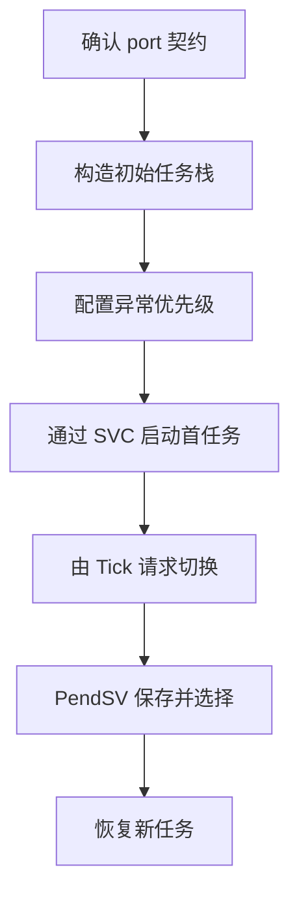
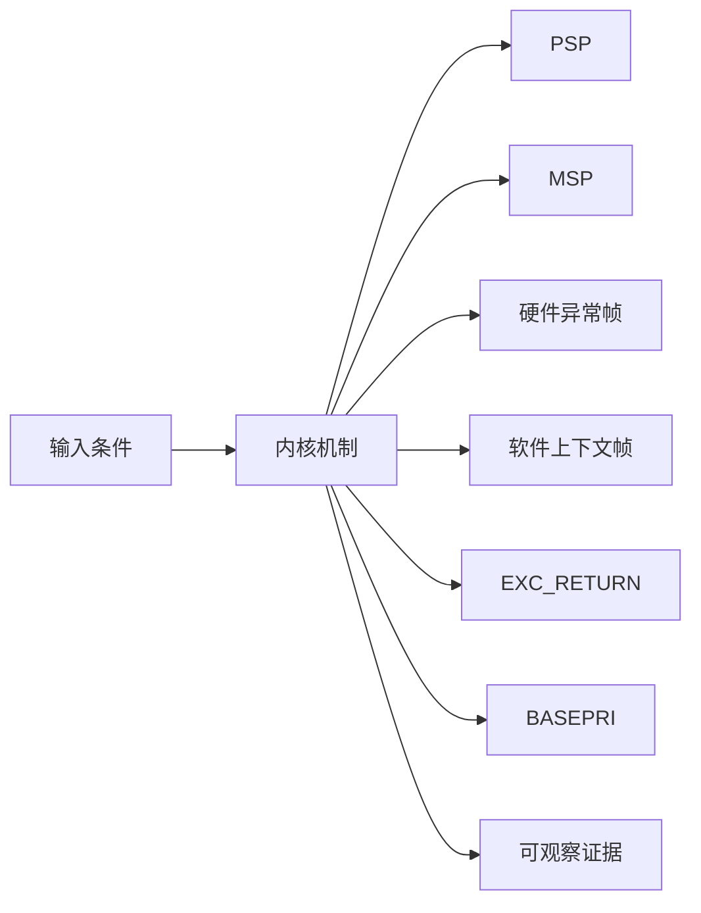
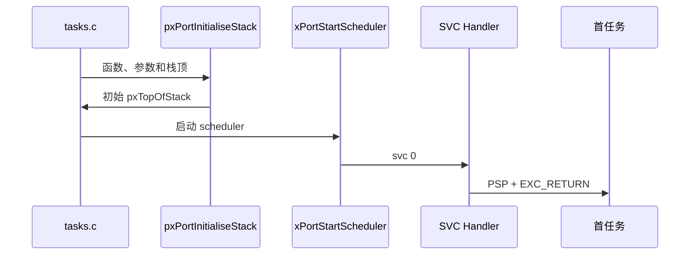
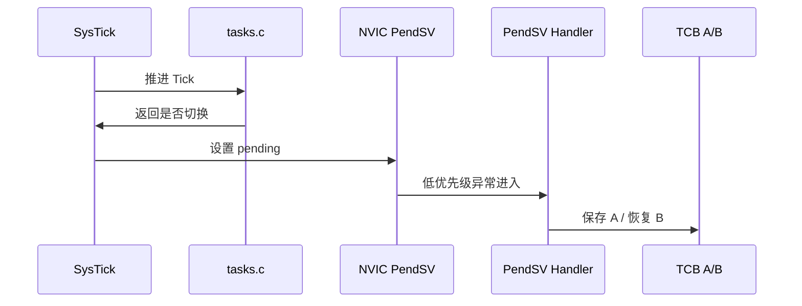
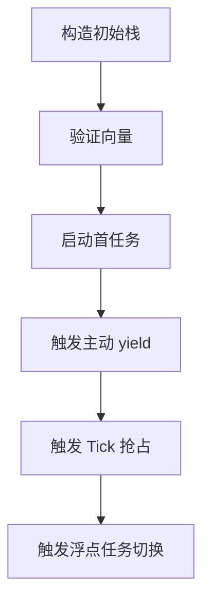
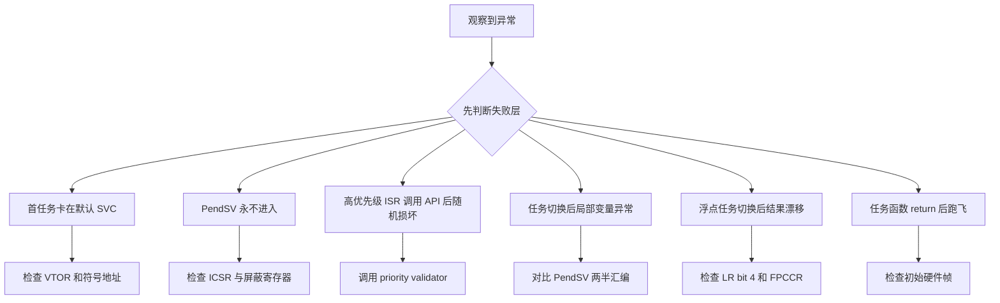

公共调度器只决定哪个 TCB 应当运行，真正让 CPU 从一个栈切到另一个栈的是 Cortex-M4 port。

本篇只回答一个核心问题：**ARM_CM4F port 如何利用异常机制启动首任务并完成可抢占的上下文切换？**

分析范围固定为 **FreeRTOS-Kernel V11.3.0**。所有函数、字段、宏和条件编译都以该 tag 为准。

本篇把任务栈分为硬件异常帧与软件保存帧，沿 SVC 首启、SysTick 调度请求和 PendSV 切换三条路径解释 PSP、BASEPRI、EXC_RETURN 与 FPU。

## 1. Cortex-M4 切换问题的边界

只讨论 ARMv7E-M Cortex-M4F 架构和上游 GCC port，不绑定任何 MCU、向量表生成器或 vendor HAL。

读者知道 Cortex-M 有 Handler/Thread mode，但需要从汇编证明哪些寄存器由硬件保存、哪些由 port 保存。



## 2. 硬件异常帧与软件上下文怎样拼成任务栈

Cortex-M4 异常入口自动保存 R0-R3、R12、LR、PC、xPSR；port 在 PSP 上补充 R4-R11 与 EXC_RETURN，并按需要保存 S16-S31。



| 对象 | 角色 | 必须保持的不变量 | 观察方法 | 常见误读 |
|---|---|---|---|---|
| PSP | Thread mode 任务使用的进程栈指针。 | 值必须对应 pxCurrentTCB 首字段保存的 top of stack。 | 对比 PSP 与 TCB[0]。 | 把 MSP 当任务栈。 |
| MSP | 异常 handler 和 scheduler 汇编临时使用的主栈。 | 不能覆盖任务 PSP 内容。 | 记录 CONTROL 与 SP 选择。 | 认为所有异常都继续使用 PSP。 |
| 硬件异常帧 | R0-R3、R12、LR、PC、xPSR。 | 异常返回时布局符合架构。 | 查看 PSP 上固定帧。 | 把它归因于 FreeRTOS C 代码。 |
| 软件上下文帧 | R4-R11、EXC_RETURN 和可选高 FPU 寄存器。 | 保存与恢复顺序完全对称。 | 按偏移标注栈。 | 忽略 EXC_RETURN 也是任务上下文。 |
| EXC_RETURN | 编码返回模式、栈选择和浮点帧状态。 | 每个任务恢复原有 FP frame 语义。 | 检查 bit 4 与 PSP 位。 | 把它当普通函数 LR。 |
| BASEPRI | 屏蔽数值优先级不低于阈值的中断。 | 高紧急度中断仍可运行但不得调用 RTOS API。 | 读 BASEPRI 与中断优先级。 | 认为 BASEPRI 等于全局关中断。 |
| PendSV | 最低优先级的延迟上下文切换异常。 | 只在安全异常边界切换 current TCB。 | 检查 ICSR pending 位。 | 在 SysTick 内直接切栈。 |
| FPU lazy state | 硬件与 port 共同管理浮点上下文。 | 使用 FPU 的任务保存 S16-S31，硬件管理低寄存器帧。 | 观察 EXC_RETURN 与 FPCA。 | 所有任务无条件保存全部浮点寄存器。 |

## 3. 调用链一：初始栈构造与 SVC 启动首任务

初始栈必须伪装成一次已经被保存的异常上下文，SVC handler 才能用与普通恢复相同的布局启动任务。



### 调用链一：prvInitialiseNewTask -> pxPortInitialiseStack -> xPortStartScheduler -> prvPortStartFirstTask -> SVC -> Thread mode

prvInitialiseNewTask 把空栈交给 pxPortInitialiseStack。ARM_CM4F port 先按硬件异常返回格式放置 xPSR、任务入口 PC、LR 和参数 R0，再保存 EXC_RETURN，并为 R4-R11 预留软件上下文位置。返回的 pxTopOfStack 必须与 SVC 和 PendSV 的恢复顺序完全一致，否则首任务会在异常返回时直接失败。

xPortStartScheduler 配置 PendSV 与 SysTick 优先级、Tick 源和中断优先级位数，然后通过 prvPortStartFirstTask 回到启动时的 MSP 环境并执行 SVC。SVC handler 从 pxCurrentTCB 取得 PSP，恢复 R4-R11 和 EXC_RETURN，清除 BASEPRI 后执行 bx lr；硬件再从异常帧恢复低寄存器、PC 和 xPSR。

验证首启不能只看任务函数是否打印日志。应在 SVC 返回前解码 PSP 上的每个槽位，确认 PC 指向任务入口、R0 等于 pvParameters、EXC_RETURN 选择 PSP，并检查 PSP/CONTROL 与 pxCurrentTCB->pxTopOfStack 的对应关系。

### 源码片段：初始栈模拟异常帧

> 源码位置：`portable/GCC/ARM_CM4F/port.c` · `pxPortInitialiseStack()` · `V11.3.0`
> 配置条件：GCC ARM_CM4F port
> 固定链接：[查看上游源码](https://github.com/FreeRTOS/FreeRTOS-Kernel/blob/V11.3.0/portable/GCC/ARM_CM4F/port.c)

```c
*pxTopOfStack = portINITIAL_XPSR;
pxTopOfStack--;
*pxTopOfStack = ( ( StackType_t ) pxCode ) & portSTART_ADDRESS_MASK;
pxTopOfStack--;
*pxTopOfStack = ( StackType_t ) portTASK_RETURN_ADDRESS;
pxTopOfStack -= 5;
*pxTopOfStack = ( StackType_t ) pvParameters;
```

- xPSR 需要 Thumb 状态。
- PC 保存任务入口并清理不允许的地址位。
- R0 放任务参数。
- 随后还保存 EXC_RETURN 并预留 R4-R11。

> **关键约束**：返回的 top 与 PendSV/SVC 恢复布局一致。 **验证重点**：按地址从 pxTopOfStack 解码每个槽位。

### 源码片段：SVC 恢复首任务软件帧

> 源码位置：`portable/GCC/ARM_CM4F/port.c` · `vPortSVCHandler()` · `V11.3.0`
> 配置条件：SVCall vector 指向该 handler
> 固定链接：[查看上游源码](https://github.com/FreeRTOS/FreeRTOS-Kernel/blob/V11.3.0/portable/GCC/ARM_CM4F/port.c)

```asm
ldr r3, =pxCurrentTCB
ldr r1, [r3]
ldr r0, [r1]
ldmia r0!, {r4-r11, r14}
msr psp, r0
mov r0, #0
msr basepri, r0
bx r14
```

- TCB 首字段是 top of stack。
- 恢复软件保存寄存器与 EXC_RETURN。
- PSP 指向硬件异常帧。
- bx LR 触发架构异常返回。

> **关键约束**：恢复后 PSP 指向 R0-R3 等硬件帧首部。 **验证重点**：在 bx 前检查 PSP、LR 和 current TCB。

## 4. 调用链二：SysTick 请求与 PendSV 上下文切换

SysTick 只计算是否需要切换；PendSV 处于最低优先级，等所有高优先级异常结束后执行真正保存和恢复。



### 调用链二：xPortSysTickHandler -> xTaskIncrementTick -> pend PendSV -> save old -> vTaskSwitchContext -> restore new

SysTick handler 调用 xTaskIncrementTick 来推进公共内核时间。如果有更高优先级任务到期，handler 只向 ICSR 写入 PENDSVSET；它不在 SysTick 内直接改写 pxCurrentTCB，也不碰任务软件帧。PendSV 被设置为最低优先级，因此会等更高优先级异常退出后再执行。

PendSV 入口时，硬件异常帧已经位于旧任务 PSP。汇编根据 EXC_RETURN 判断是否需要保存 S16-S31，再保存 R4-R11 和 LR，并把新的栈顶写回旧 TCB。随后通过 BASEPRI 保护 vTaskSwitchContext 对 ready lists 和 pxCurrentTCB 的更新，选择结束后立即恢复屏蔽状态。

恢复路径从新 TCB 读取 top，按与保存相反的顺序恢复软件寄存器和可选 FPU 上下文，更新 PSP 并通过 EXC_RETURN 让硬件恢复低寄存器帧。两侧栈布局、BASEPRI 配对和切换前后的 TCB top 是判断 port 是否正确的核心证据。

### 源码片段：PendSV 保存旧任务并调用公共调度器

> 源码位置：`portable/GCC/ARM_CM4F/port.c` · `xPortPendSVHandler()` · `V11.3.0`
> 配置条件：PendSV 最低优先级，configMAX_SYSCALL_INTERRUPT_PRIORITY 合法
> 固定链接：[查看上游源码](https://github.com/FreeRTOS/FreeRTOS-Kernel/blob/V11.3.0/portable/GCC/ARM_CM4F/port.c)

```asm
mrs r0, psp
tst r14, #0x10
it eq
vstmdbeq r0!, {s16-s31}
stmdb r0!, {r4-r11, r14}
str r0, [r2]
msr basepri, r0
bl vTaskSwitchContext
```

- 硬件帧已经位于 PSP。
- EXC_RETURN bit 4 决定是否有浮点扩展帧。
- 软件寄存器保存后 top 写回旧 TCB。
- BASEPRI 保护选择新任务的公共状态。

> **关键约束**：写 pxCurrentTCB 前旧任务 top 已完整保存。 **验证重点**：切换前后比较两个 TCB top 和 LR bit 4。

### 源码片段：SysTick 只 pend PendSV

> 源码位置：`portable/GCC/ARM_CM4F/port.c` · `xPortSysTickHandler()` · `V11.3.0`
> 配置条件：SysTick vector 与优先级配置正确
> 固定链接：[查看上游源码](https://github.com/FreeRTOS/FreeRTOS-Kernel/blob/V11.3.0/portable/GCC/ARM_CM4F/port.c)

```c
portDISABLE_INTERRUPTS();
if( xTaskIncrementTick() != pdFALSE )
{
    portNVIC_INT_CTRL_REG = portNVIC_PENDSVSET_BIT;
}
portENABLE_INTERRUPTS();
```

- Tick 计算在公共 tasks.c。
- 返回 true 只代表需要请求切换。
- 真正切换在 PendSV。
- handler 退出前恢复中断状态假设。

> **关键约束**：SysTick 不直接修改 PSP 或 pxCurrentTCB。 **验证重点**：记录 Tick 返回值、ICSR pending 和 PendSV 入口。

<!-- IMAGE_PROMPT: 16:9 深色技术插画，左侧展示 Cortex-M4 异常自动压栈 R0-R3/R12/LR/PC/xPSR，右侧展示 FreeRTOS 软件保存 R4-R11/EXC_RETURN/S16-S31，中间以 PSP 和 PendSV 箭头连接；标签清晰，无芯片型号、无厂商 logo、无渐变文字。 -->

## 5. 在栈帧和异常现场验证 Cortex-M4 切换



### 配置矩阵

| 配置或条件 | 取值 A | 取值 B | 源码影响 | 验证重点 |
|---|---|---|---|---|
| configMAX_SYSCALL_INTERRUPT_PRIORITY | 较高屏蔽阈值 | 较低屏蔽阈值 | 决定 BASEPRI 屏蔽范围。 | 验证 ISR API 边界。 |
| configKERNEL_INTERRUPT_PRIORITY | 最低优先级 | 非最低值 | 决定 PendSV/SysTick 调度安全性。 | 读取 SHPR。 |
| configUSE_PREEMPTION | 0 | 1 | 决定 Tick 解阻塞后是否请求 PendSV。 | 观察 ICSR pending。 |
| configUSE_TIME_SLICING | 0 | 1 | 决定同优先级 Tick 轮转。 | 比较 current TCB。 |
| configASSERT_DEFINED | 0 | 1 | 决定向量和优先级运行期验证。 | 故意错误配置看断言。 |
| FPU task state | 未使用 | 已使用 | 决定 S16-S31 保存恢复。 | 检查 EXC_RETURN bit 4。 |

### 实验步骤

1. **构造初始栈。** 对已知函数和参数调用 port 初始化逻辑，并保存槽位和地址；只有 xPSR/PC/R0/EXC_RETURN 正确，这一步才算完成。
2. **验证向量。** 读取 VTOR 指向表。重点核对 SVC/PendSV/SysTick handler，结果应满足“映射唯一正确”。
3. **启动首任务。** 断点 SVC handler，把 PSP/LR/BASEPRI/PC 保存为证据；判断依据是异常返回进入任务。
4. **触发主动 yield。** 任务调用 taskYIELD；观察 ICSR 和 PendSV。若不在普通函数栈直接切换，即可进入下一步。
5. **触发 Tick 抢占。** 高优先级任务到期，随后比较 Tick 返回值与 pending；预期是 PendSV 后 current 改变。
6. **触发浮点任务切换。** 一个任务执行 FPU 指令。最后用 EXC_RETURN 与 S16-S31确认仅需要时保存高寄存器。

### 证据表

| 证据 | 获取方法 | 通过标准 | 失败说明 |
|---|---|---|---|
| 初始栈布局 | 内存窗口逐槽标注 | 与恢复指令顺序一致 | 偏移错误会首启崩溃 |
| 向量映射 | VTOR 和符号地址 | 三 handler 正确 | 弱默认 handler 会卡死 |
| BASEPRI 边界 | 读寄存器与 NVIC priority | 临界区只屏蔽允许 API 的范围 | 全局屏蔽会破坏高紧急度响应 |
| PendSV pending | 读 ICSR 和 trace | 请求后在安全时机进入 | 未进入说明优先级/屏蔽错误 |
| TCB top 对称 | 切换前后栈 dump | 旧 top 保存、新 top 恢复 | 不对称导致寄存器污染 |
| FPU 上下文 | LR bit 4 与 FP 寄存器 | 仅 FP task 保存扩展状态 | 无条件保存浪费切换时间 |

## 6. 从 PSP、EXC_RETURN 与 BASEPRI 定位端口故障

先验证对象成员和链表归属，再检查锁、配置分支和调度请求。



| 现象 | 根因 | 第一检查点 | 应保存的证据 | 修复原则 |
|---|---|---|---|---|
| 首任务卡在默认 SVC | 向量未映射 port handler | 检查 VTOR 和符号地址 | VECTACTIVE 与 PC | 修正向量映射 |
| PendSV 永不进入 | BASEPRI/PRIMASK 或优先级配置错误 | 检查 ICSR 与屏蔽寄存器 | pending 位和 SHPR | 修正中断优先级 |
| 高优先级 ISR 调用 API 后随机损坏 | ISR 数值优先级高于 syscall 阈值 | 调用 priority validator | 当前 IRQ priority 与 BASEPRI | 移动 API 到合法优先级或延迟处理 |
| 任务切换后局部变量异常 | R4-R11 或 PSP 保存恢复不对称 | 对比 PendSV 两半汇编 | 两个栈帧和 TCB top | 修复端口汇编 |
| 浮点任务切换后结果漂移 | EXC_RETURN/FPU 上下文处理错误 | 检查 LR bit 4 和 FPCCR | S16-S31 前后值 | 按 port 逻辑条件保存 |
| 任务函数 return 后跑飞 | LR 没有指向 prvTaskExitError | 检查初始硬件帧 | LR/PC/xPSR 槽位 | 要求任务调用 vTaskDelete |
| 进入 critical 后中断永久关闭 | nesting 或 exit 不匹配 | 检查 uxCriticalNesting/BASEPRI | 每次 enter/exit trace | 配对临界区并恢复阈值 |

## 7. 源码索引、阶段验收与面试表达

### 源码索引

| 文件 | 结构体 / 函数 / 宏 | 作用 |
|---|---|---|
| [portable/GCC/ARM_CM4F/port.c](https://github.com/FreeRTOS/FreeRTOS-Kernel/blob/V11.3.0/portable/GCC/ARM_CM4F/port.c) | pxPortInitialiseStack、SVC、PendSV、SysTick | 端口主实现 |
| [portable/GCC/ARM_CM4F/portmacro.h](https://github.com/FreeRTOS/FreeRTOS-Kernel/blob/V11.3.0/portable/GCC/ARM_CM4F/portmacro.h) | portYIELD、critical、ISR mask | 公共宏契约 |
| [tasks.c](https://github.com/FreeRTOS/FreeRTOS-Kernel/blob/V11.3.0/tasks.c) | xTaskIncrementTick、vTaskSwitchContext | 公共调度策略 |
| [include/FreeRTOS.h](https://github.com/FreeRTOS/FreeRTOS-Kernel/blob/V11.3.0/include/FreeRTOS.h) | interrupt priority 配置校验 | 配置边界 |

### 阶段验收

1. 能分开硬件帧和软件帧。
2. 能逐槽解释初始任务栈。
3. 能跟踪 SVC 启动首任务。
4. 能解释 SysTick 为什么不直接切栈。
5. 能逐条解释 PendSV 保存恢复。
6. 能说明 BASEPRI 与全局关中断差别。
7. 能解释 EXC_RETURN 的栈和 FPU 位。
8. 能用证据定位向量与优先级错误。

### 面试表达

Cortex-M4 port 把调度请求放到最低优先级 PendSV，使高优先级异常先完成，再在统一异常边界切换 PSP。

硬件自动保存调用者易失寄存器，port 保存 R4-R11 和 EXC_RETURN；使用 FPU 时再根据 EXC_RETURN 条件保存 S16-S31。

BASEPRI 只屏蔽可以调用内核 API 的那部分中断，高紧急度 ISR 可以继续运行，但不能访问受该临界区保护的内核对象。

### 参考资料

- [FreeRTOS-Kernel V11.3.0](https://github.com/FreeRTOS/FreeRTOS-Kernel/tree/V11.3.0)
- [FreeRTOS Kernel Book](https://github.com/FreeRTOS/FreeRTOS-Kernel-Book)
- [FreeRTOS Cortex-M interrupt priority guidance](https://www.freertos.org/Documentation/02-Kernel/03-Supported-devices/04-Demos/01-Cortex-M3)

> 🏷️ FreeRTOS / Cortex-M4 / PendSV / SVC / SysTick / Context Switch
