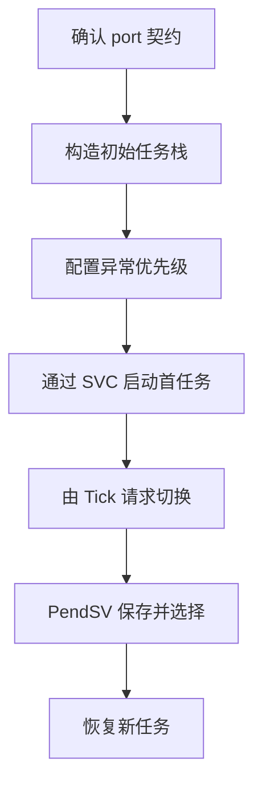
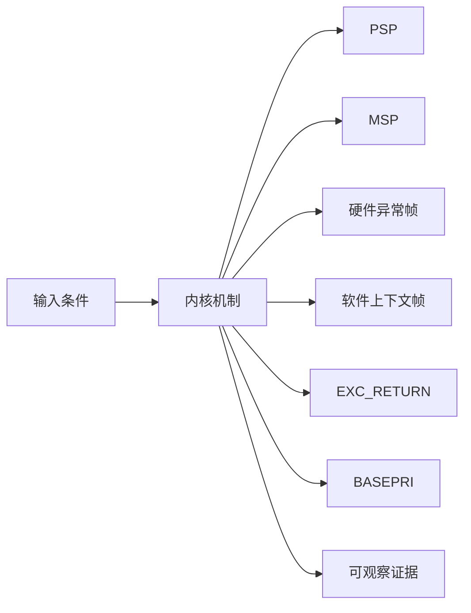
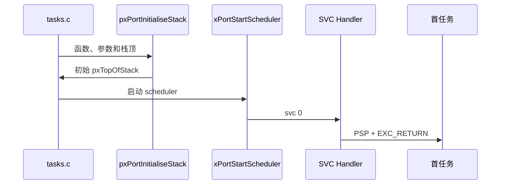
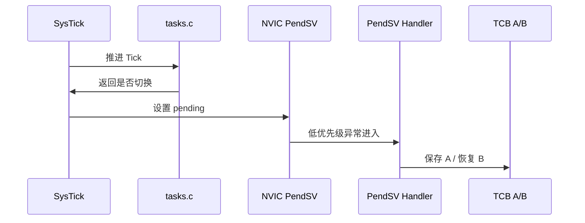
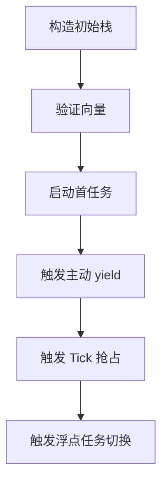
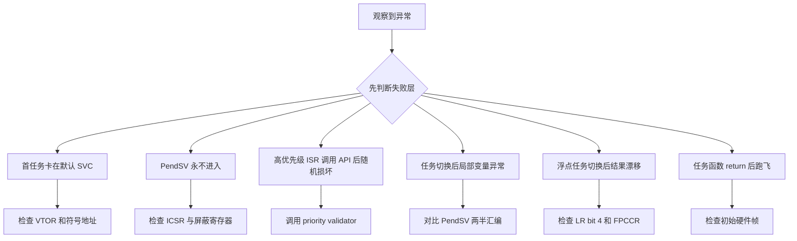

公共调度器只决定哪个 TCB 应当运行，真正让 CPU 从一个栈切到另一个栈的是 Cortex-M4 port。

本篇只回答一个核心问题：**ARM_CM4F port 如何利用异常机制启动首任务并完成可抢占的上下文切换？**

分析范围固定为 **FreeRTOS-Kernel V11.3.0**。所有函数、字段、宏和条件编译都以该 tag 为准。

本篇把任务栈分为硬件异常帧与软件保存帧，沿 SVC 首启、SysTick 调度请求和 PendSV 切换三条路径解释 PSP、BASEPRI、EXC_RETURN 与 FPU。

## 1. 问题边界、前置条件与验收证据

只讨论 ARMv7E-M Cortex-M4F 架构和上游 GCC port，不绑定任何 MCU、向量表生成器或 vendor HAL。

读者知道 Cortex-M 有 Handler/Thread mode，但需要从汇编证明哪些寄存器由硬件保存、哪些由 port 保存。

阅读源码前先写清输入状态、允许的状态变化和输出证据。只看函数名或最终返回值，无法判断链表、锁和调度点是否正确。



| 顺序 | 阅读动作 | 入口条件 | 状态变化 | 验收证据 |
|---:|---|---|---|---|
| 1 | 确认 port 契约 | 公共 scheduler 已就绪。 | 公共内核可调用唯一 port。 | 构建 map 文件。 |
| 2 | 构造初始任务栈 | TCB 和 stack 已分配。 | pxTopOfStack 指向 R4-R11 区域。 | 栈偏移表。 |
| 3 | 配置异常优先级 | scheduler 尚未启动。 | RTOS 临界区模型成立。 | NVIC 寄存器快照。 |
| 4 | 通过 SVC 启动首任务 | pxCurrentTCB 已选定。 | Thread mode 使用 PSP 执行任务。 | 首次 PC/PSP。 |
| 5 | 由 Tick 请求切换 | SysTick 到达。 | 只设置切换请求，不在 Tick 内换栈。 | ICSR 和 Tick trace。 |
| 6 | PendSV 保存并选择 | 进入 PendSV。 | 旧 PSP 写入旧 TCB，新 current 被选。 | 两个 TCB top。 |
| 7 | 恢复新任务 | 新 pxCurrentTCB 已确定。 | 硬件自动恢复异常帧。 | 异常返回后寄存器。 |

### 1. 确认 port 契约

入口条件：公共 scheduler 已就绪。

执行动作：核对 portmacro 与 port.c 提供的类型、临界区、Tick 和切换入口。

核心状态变化：公共内核可调用唯一 port。

离开这一步时必须成立：函数和向量符号完整。

可观察证据：构建 map 文件。

停止条件：同名 handler 冲突时停止。

### 2. 构造初始任务栈

入口条件：TCB 和 stack 已分配。

执行动作：pxPortInitialiseStack 模拟异常返回帧。

核心状态变化：pxTopOfStack 指向 R4-R11 区域。

离开这一步时必须成立：首恢复可进入任务函数。

可观察证据：栈偏移表。

停止条件：对齐或 PC 位错误时停止。

### 3. 配置异常优先级

入口条件：scheduler 尚未启动。

执行动作：设置 PendSV/SysTick 最低优先级并验证 syscall 阈值。

核心状态变化：RTOS 临界区模型成立。

离开这一步时必须成立：高优先级 ISR 边界明确。

可观察证据：NVIC 寄存器快照。

停止条件：priority bits 未知时停止。

### 4. 通过 SVC 启动首任务

入口条件：pxCurrentTCB 已选定。

执行动作：prvPortStartFirstTask 触发 SVC，handler 恢复软件帧和 PSP。

核心状态变化：Thread mode 使用 PSP 执行任务。

离开这一步时必须成立：BASEPRI 清零。

可观察证据：首次 PC/PSP。

停止条件：向量未指向 handler 时停止。

### 5. 由 Tick 请求切换

入口条件：SysTick 到达。

执行动作：调用 xTaskIncrementTick，必要时 pend PendSV。

核心状态变化：只设置切换请求，不在 Tick 内换栈。

离开这一步时必须成立：PendSV 等待更高异常完成。

可观察证据：ICSR 和 Tick trace。

停止条件：SysTick 优先级不合法时停止。

### 6. PendSV 保存并选择

入口条件：进入 PendSV。

执行动作：保存 R4-R11、LR 与可选 S16-S31，调用 vTaskSwitchContext。

核心状态变化：旧 PSP 写入旧 TCB，新 current 被选。

离开这一步时必须成立：BASEPRI 保护选择窗口。

可观察证据：两个 TCB top。

停止条件：旧栈未保存完成时禁止切 current。

### 7. 恢复新任务

入口条件：新 pxCurrentTCB 已确定。

执行动作：按对称顺序恢复软件帧、PSP 并 bx EXC_RETURN。

核心状态变化：硬件自动恢复异常帧。

离开这一步时必须成立：Thread mode 继续新任务。

可观察证据：异常返回后寄存器。

停止条件：save/restore 不对称时停止。

## 2. 核心数据结构、所有权与不变量

Cortex-M4 异常入口自动保存 R0-R3、R12、LR、PC、xPSR；port 在 PSP 上补充 R4-R11 与 EXC_RETURN，并按需要保存 S16-S31。

这里不把字段当作词汇表，而是解释字段由谁修改、在哪个临界区修改、它和哪个链表或对象保持一致。



| 对象 | 角色 | 必须保持的不变量 | 观察方法 | 常见误读 |
|---|---|---|---|---|
| PSP | Thread mode 任务使用的进程栈指针。 | 值必须对应 pxCurrentTCB 首字段保存的 top of stack。 | 对比 PSP 与 TCB[0]。 | 把 MSP 当任务栈。 |
| MSP | 异常 handler 和 scheduler 汇编临时使用的主栈。 | 不能覆盖任务 PSP 内容。 | 记录 CONTROL 与 SP 选择。 | 认为所有异常都继续使用 PSP。 |
| 硬件异常帧 | R0-R3、R12、LR、PC、xPSR。 | 异常返回时布局符合架构。 | 查看 PSP 上固定帧。 | 把它归因于 FreeRTOS C 代码。 |
| 软件上下文帧 | R4-R11、EXC_RETURN 和可选高 FPU 寄存器。 | 保存与恢复顺序完全对称。 | 按偏移标注栈。 | 忽略 EXC_RETURN 也是任务上下文。 |
| EXC_RETURN | 编码返回模式、栈选择和浮点帧状态。 | 每个任务恢复原有 FP frame 语义。 | 检查 bit 4 与 PSP 位。 | 把它当普通函数 LR。 |
| BASEPRI | 屏蔽数值优先级不低于阈值的中断。 | 高紧急度中断仍可运行但不得调用 RTOS API。 | 读 BASEPRI 与中断优先级。 | 认为 BASEPRI 等于全局关中断。 |
| PendSV | 最低优先级的延迟上下文切换异常。 | 只在安全异常边界切换 current TCB。 | 检查 ICSR pending 位。 | 在 SysTick 内直接切栈。 |
| FPU lazy state | 硬件与 port 共同管理浮点上下文。 | 使用 FPU 的任务保存 S16-S31，硬件管理低寄存器帧。 | 观察 EXC_RETURN 与 FPCA。 | 所有任务无条件保存全部浮点寄存器。 |

### PSP

角色：Thread mode 任务使用的进程栈指针。

所有权：当前任务与 port。

不变量：值必须对应 pxCurrentTCB 首字段保存的 top of stack。

变化时机：SVC/PendSV 恢复或保存。

观察方法：对比 PSP 与 TCB[0]。

常见误读：把 MSP 当任务栈。

### MSP

角色：异常 handler 和 scheduler 汇编临时使用的主栈。

所有权：CPU/启动代码。

不变量：不能覆盖任务 PSP 内容。

变化时机：异常进入和 port handler。

观察方法：记录 CONTROL 与 SP 选择。

常见误读：认为所有异常都继续使用 PSP。

### 硬件异常帧

角色：R0-R3、R12、LR、PC、xPSR。

所有权：Cortex-M4 硬件。

不变量：异常返回时布局符合架构。

变化时机：异常 entry/return。

观察方法：查看 PSP 上固定帧。

常见误读：把它归因于 FreeRTOS C 代码。

### 软件上下文帧

角色：R4-R11、EXC_RETURN 和可选高 FPU 寄存器。

所有权：ARM_CM4F port。

不变量：保存与恢复顺序完全对称。

变化时机：PendSV 和初始栈构造。

观察方法：按偏移标注栈。

常见误读：忽略 EXC_RETURN 也是任务上下文。

### EXC_RETURN

角色：编码返回模式、栈选择和浮点帧状态。

所有权：CPU 产生，port 随任务保存。

不变量：每个任务恢复原有 FP frame 语义。

变化时机：异常 LR 被保存/恢复。

观察方法：检查 bit 4 与 PSP 位。

常见误读：把它当普通函数 LR。

### BASEPRI

角色：屏蔽数值优先级不低于阈值的中断。

所有权：port critical/ISR mask。

不变量：高紧急度中断仍可运行但不得调用 RTOS API。

变化时机：进入临界区和切换选择。

观察方法：读 BASEPRI 与中断优先级。

常见误读：认为 BASEPRI 等于全局关中断。

### PendSV

角色：最低优先级的延迟上下文切换异常。

所有权：port 与 NVIC。

不变量：只在安全异常边界切换 current TCB。

变化时机：yield、Tick 或 ISR 请求。

观察方法：检查 ICSR pending 位。

常见误读：在 SysTick 内直接切栈。

### FPU lazy state

角色：硬件与 port 共同管理浮点上下文。

所有权：CPU FPCCR 与 EXC_RETURN。

不变量：使用 FPU 的任务保存 S16-S31，硬件管理低寄存器帧。

变化时机：PendSV 检查 LR bit。

观察方法：观察 EXC_RETURN 与 FPCA。

常见误读：所有任务无条件保存全部浮点寄存器。

## 3. 调用链一：初始栈构造与 SVC 启动首任务

初始栈必须伪装成一次已经被保存的异常上下文，SVC handler 才能用与普通恢复相同的布局启动任务。

调用链中的每一跳都要区分普通函数调用、宏展开、临界区边界和可能触发调度的 port hook。



### 调用链一：prvInitialiseNewTask -> pxPortInitialiseStack -> xPortStartScheduler -> prvPortStartFirstTask -> SVC -> Thread mode

#### 链路步骤 1：放置硬件帧

进入时：栈顶与任务函数有效。

本步读取：xPSR、PC、LR、R0 参数。

本步修改：PSP 内存。

并发边界：任务尚未公开运行。

返回或转交：异常返回目标明确。

证据：栈 dump。

#### 链路步骤 2：放置 EXC_RETURN

进入时：硬件帧已放置。

本步读取：portINITIAL_EXC_RETURN。

本步修改：软件帧元数据。

并发边界：port 构造阶段。

返回或转交：返回使用 PSP。

证据：栈偏移。

#### 链路步骤 3：预留 R4-R11

进入时：callee-saved 尚无初值需求。

本步读取：栈空间。

本步修改：pxTopOfStack 前移。

并发边界：对齐约束。

返回或转交：恢复指令可统一。

证据：top 地址。

#### 链路步骤 4：配置 scheduler 异常

进入时：Idle/current 已存在。

本步读取：SHPR、SysTick、priority bits。

本步修改：NVIC 状态。

并发边界：启动前中断控制。

返回或转交：PendSV/SysTick 最低。

证据：寄存器读取。

#### 链路步骤 5：触发 SVC

进入时：MSP 已恢复到启动栈。

本步读取：svc 指令和向量表。

本步修改：进入 Handler mode。

并发边界：硬件异常边界。

返回或转交：handler 执行。

证据：VECTACTIVE。

#### 链路步骤 6：恢复并返回

进入时：pxCurrentTCB 有 top。

本步读取：R4-R11、LR、PSP、BASEPRI。

本步修改：CPU 任务上下文。

并发边界：异常返回原子性。

返回或转交：首任务函数运行。

证据：PC/CONTROL/PSP。

### 源码片段：初始栈模拟异常帧

> 源码位置：`portable/GCC/ARM_CM4F/port.c` · `pxPortInitialiseStack()` · `V11.3.0`
> 配置条件：GCC ARM_CM4F port
> 固定链接：[查看上游源码](https://github.com/FreeRTOS/FreeRTOS-Kernel/blob/V11.3.0/portable/GCC/ARM_CM4F/port.c)

```c
*pxTopOfStack = portINITIAL_XPSR;
pxTopOfStack--;
*pxTopOfStack = ( ( StackType_t ) pxCode ) & portSTART_ADDRESS_MASK;
pxTopOfStack--;
*pxTopOfStack = ( StackType_t ) portTASK_RETURN_ADDRESS;
pxTopOfStack -= 5;
*pxTopOfStack = ( StackType_t ) pvParameters;
```

这段摘录只保留当前机制需要的语句；省略的参数检查、trace hook 或条件分支必须回到固定链接核对。

解读 1：xPSR 需要 Thumb 状态。

解读 2：PC 保存任务入口并清理不允许的地址位。

解读 3：R0 放任务参数。

解读 4：随后还保存 EXC_RETURN 并预留 R4-R11。

不变量：返回的 top 与 PendSV/SVC 恢复布局一致。

观察点：按地址从 pxTopOfStack 解码每个槽位。

### 源码片段：SVC 恢复首任务软件帧

> 源码位置：`portable/GCC/ARM_CM4F/port.c` · `vPortSVCHandler()` · `V11.3.0`
> 配置条件：SVCall vector 指向该 handler
> 固定链接：[查看上游源码](https://github.com/FreeRTOS/FreeRTOS-Kernel/blob/V11.3.0/portable/GCC/ARM_CM4F/port.c)

```asm
ldr r3, =pxCurrentTCB
ldr r1, [r3]
ldr r0, [r1]
ldmia r0!, {r4-r11, r14}
msr psp, r0
mov r0, #0
msr basepri, r0
bx r14
```

这段摘录只保留当前机制需要的语句；省略的参数检查、trace hook 或条件分支必须回到固定链接核对。

解读 1：TCB 首字段是 top of stack。

解读 2：恢复软件保存寄存器与 EXC_RETURN。

解读 3：PSP 指向硬件异常帧。

解读 4：bx LR 触发架构异常返回。

不变量：恢复后 PSP 指向 R0-R3 等硬件帧首部。

观察点：在 bx 前检查 PSP、LR 和 current TCB。

## 4. 调用链二：SysTick 请求与 PendSV 上下文切换

SysTick 只计算是否需要切换；PendSV 处于最低优先级，等所有高优先级异常结束后执行真正保存和恢复。

第二条链用于验证同一对象在另一条执行路径上的行为，重点检查它是否复用相同不变量，还是进入 ISR、daemon 或 portable 层的特殊规则。



### 调用链二：xPortSysTickHandler -> xTaskIncrementTick -> pend PendSV -> save old -> vTaskSwitchContext -> restore new

#### 链路步骤 1：进入 SysTick

进入时：异常优先级为最低。

本步读取：Tick 和中断屏蔽状态。

本步修改：无任务栈修改。

并发边界：handler 上下文。

返回或转交：可调用 xTaskIncrementTick。

证据：traceISR_ENTER。

#### 链路步骤 2：计算切换需求

进入时：scheduler 运行。

本步读取：delayed/ready list。

本步修改：ready 任务与返回标志。

并发边界：公共内核临界区。

返回或转交：pdTRUE/pdFALSE。

证据：Tick trace。

#### 链路步骤 3：pend PendSV

进入时：返回 pdTRUE。

本步读取：ICSR PENDSVSET。

本步修改：NVIC pending 状态。

并发边界：写一位寄存器。

返回或转交：延迟切换。

证据：ICSR 读取。

#### 链路步骤 4：保存旧任务

进入时：PendSV 最终进入。

本步读取：PSP、EXC_RETURN、FPU bit。

本步修改：旧任务软件帧和 TCB top。

并发边界：BASEPRI 前后。

返回或转交：旧上下文完整。

证据：栈 dump。

#### 链路步骤 5：选择新 TCB

进入时：旧 top 已保存。

本步读取：ready lists。

本步修改：pxCurrentTCB。

并发边界：BASEPRI 屏蔽可调用 API 的 ISR。

返回或转交：新 TCB 确定。

证据：trace switched out/in。

#### 链路步骤 6：恢复与异常返回

进入时：新 TCB top 有效。

本步读取：R4-R11/LR/FPU/PSP。

本步修改：新 CPU 上下文。

并发边界：EXC_RETURN。

返回或转交：硬件恢复低寄存器。

证据：任务 PC。

### 源码片段：PendSV 保存旧任务并调用公共调度器

> 源码位置：`portable/GCC/ARM_CM4F/port.c` · `xPortPendSVHandler()` · `V11.3.0`
> 配置条件：PendSV 最低优先级，configMAX_SYSCALL_INTERRUPT_PRIORITY 合法
> 固定链接：[查看上游源码](https://github.com/FreeRTOS/FreeRTOS-Kernel/blob/V11.3.0/portable/GCC/ARM_CM4F/port.c)

```asm
mrs r0, psp
tst r14, #0x10
it eq
vstmdbeq r0!, {s16-s31}
stmdb r0!, {r4-r11, r14}
str r0, [r2]
msr basepri, r0
bl vTaskSwitchContext
```

这段摘录只保留当前机制需要的语句；省略的参数检查、trace hook 或条件分支必须回到固定链接核对。

解读 1：硬件帧已经位于 PSP。

解读 2：EXC_RETURN bit 4 决定是否有浮点扩展帧。

解读 3：软件寄存器保存后 top 写回旧 TCB。

解读 4：BASEPRI 保护选择新任务的公共状态。

不变量：写 pxCurrentTCB 前旧任务 top 已完整保存。

观察点：切换前后比较两个 TCB top 和 LR bit 4。

### 源码片段：SysTick 只 pend PendSV

> 源码位置：`portable/GCC/ARM_CM4F/port.c` · `xPortSysTickHandler()` · `V11.3.0`
> 配置条件：SysTick vector 与优先级配置正确
> 固定链接：[查看上游源码](https://github.com/FreeRTOS/FreeRTOS-Kernel/blob/V11.3.0/portable/GCC/ARM_CM4F/port.c)

```c
portDISABLE_INTERRUPTS();
if( xTaskIncrementTick() != pdFALSE )
{
    portNVIC_INT_CTRL_REG = portNVIC_PENDSVSET_BIT;
}
portENABLE_INTERRUPTS();
```

这段摘录只保留当前机制需要的语句；省略的参数检查、trace hook 或条件分支必须回到固定链接核对。

解读 1：Tick 计算在公共 tasks.c。

解读 2：返回 true 只代表需要请求切换。

解读 3：真正切换在 PendSV。

解读 4：handler 退出前恢复中断状态假设。

不变量：SysTick 不直接修改 PSP 或 pxCurrentTCB。

观察点：记录 Tick 返回值、ICSR pending 和 PendSV 入口。

<!-- IMAGE_PROMPT: 16:9 深色技术插画，左侧展示 Cortex-M4 异常自动压栈 R0-R3/R12/LR/PC/xPSR，右侧展示 FreeRTOS 软件保存 R4-R11/EXC_RETURN/S16-S31，中间以 PSP 和 PendSV 箭头连接；标签清晰，无芯片型号、无厂商 logo、无渐变文字。 -->

## 5. 配置矩阵、观测实验与证据记录

使用可控输入和 trace hook 观察对象变化，不依赖特定开发板。

实验只承诺观察软件状态和调用顺序。没有实际目标硬件或 trace 数据时，不写虚构时间和性能数字。



### 配置矩阵

| 配置或条件 | 取值 A | 取值 B | 源码影响 | 验证重点 |
|---|---|---|---|---|
| configMAX_SYSCALL_INTERRUPT_PRIORITY | 较高屏蔽阈值 | 较低屏蔽阈值 | 决定 BASEPRI 屏蔽范围。 | 验证 ISR API 边界。 |
| configKERNEL_INTERRUPT_PRIORITY | 最低优先级 | 非最低值 | 决定 PendSV/SysTick 调度安全性。 | 读取 SHPR。 |
| configUSE_PREEMPTION | 0 | 1 | 决定 Tick 解阻塞后是否请求 PendSV。 | 观察 ICSR pending。 |
| configUSE_TIME_SLICING | 0 | 1 | 决定同优先级 Tick 轮转。 | 比较 current TCB。 |
| configASSERT_DEFINED | 0 | 1 | 决定向量和优先级运行期验证。 | 故意错误配置看断言。 |
| FPU task state | 未使用 | 已使用 | 决定 S16-S31 保存恢复。 | 检查 EXC_RETURN bit 4。 |

### 实验步骤

1. **构造初始栈**

   操作：对已知函数和参数调用 port 初始化逻辑。

   记录：槽位和地址。

   通过标准：xPSR/PC/R0/EXC_RETURN 正确。

2. **验证向量**

   操作：读取 VTOR 指向表。

   记录：SVC/PendSV/SysTick handler。

   通过标准：映射唯一正确。

3. **启动首任务**

   操作：断点 SVC handler。

   记录：PSP/LR/BASEPRI/PC。

   通过标准：异常返回进入任务。

4. **触发主动 yield**

   操作：任务调用 taskYIELD。

   记录：ICSR 和 PendSV。

   通过标准：不在普通函数栈直接切换。

5. **触发 Tick 抢占**

   操作：高优先级任务到期。

   记录：Tick 返回值与 pending。

   通过标准：PendSV 后 current 改变。

6. **触发浮点任务切换**

   操作：一个任务执行 FPU 指令。

   记录：EXC_RETURN 与 S16-S31。

   通过标准：仅需要时保存高寄存器。

### 证据表

| 证据 | 获取方法 | 通过标准 | 失败说明 |
|---|---|---|---|
| 初始栈布局 | 内存窗口逐槽标注 | 与恢复指令顺序一致 | 偏移错误会首启崩溃 |
| 向量映射 | VTOR 和符号地址 | 三 handler 正确 | 弱默认 handler 会卡死 |
| BASEPRI 边界 | 读寄存器与 NVIC priority | 临界区只屏蔽允许 API 的范围 | 全局屏蔽会破坏高紧急度响应 |
| PendSV pending | 读 ICSR 和 trace | 请求后在安全时机进入 | 未进入说明优先级/屏蔽错误 |
| TCB top 对称 | 切换前后栈 dump | 旧 top 保存、新 top 恢复 | 不对称导致寄存器污染 |
| FPU 上下文 | LR bit 4 与 FP 寄存器 | 仅 FP task 保存扩展状态 | 无条件保存浪费切换时间 |

#### 证据：初始栈布局

获取方法：内存窗口逐槽标注

应当看到：与恢复指令顺序一致

如果不满足：偏移错误会首启崩溃

为什么这项证据有效：恢复指令是布局的直接消费者。

#### 证据：向量映射

获取方法：VTOR 和符号地址

应当看到：三 handler 正确

如果不满足：弱默认 handler 会卡死

为什么这项证据有效：异常入口决定 port 是否获得控制。

#### 证据：BASEPRI 边界

获取方法：读寄存器与 NVIC priority

应当看到：临界区只屏蔽允许 API 的范围

如果不满足：全局屏蔽会破坏高紧急度响应

为什么这项证据有效：BASEPRI 是 Cortex-M port 核心契约。

#### 证据：PendSV pending

获取方法：读 ICSR 和 trace

应当看到：请求后在安全时机进入

如果不满足：未进入说明优先级/屏蔽错误

为什么这项证据有效：pending 将调度决策与切栈分离。

#### 证据：TCB top 对称

获取方法：切换前后栈 dump

应当看到：旧 top 保存、新 top 恢复

如果不满足：不对称导致寄存器污染

为什么这项证据有效：pxTopOfStack 是公共与 port 交点。

#### 证据：FPU 上下文

获取方法：LR bit 4 与 FP 寄存器

应当看到：仅 FP task 保存扩展状态

如果不满足：无条件保存浪费切换时间

为什么这项证据有效：EXC_RETURN 编码真实 FP 状态。

## 6. 常见误读、故障定位与修复原则

排错从最早被破坏的不变量开始，不从最终崩溃位置随机回退。

先验证对象成员和链表归属，再检查锁、配置分支和调度请求。



### 1. 首任务卡在默认 SVC

根因：向量未映射 port handler

第一检查点：检查 VTOR 和符号地址

需要保存的证据：VECTACTIVE 与 PC

修复原则：修正向量映射

不能采用的绕过方式：不要在 main 直接调用任务函数。

### 2. PendSV 永不进入

根因：BASEPRI/PRIMASK 或优先级配置错误

第一检查点：检查 ICSR 与屏蔽寄存器

需要保存的证据：pending 位和 SHPR

修复原则：修正中断优先级

不能采用的绕过方式：不要在 Tick 内手工调用 switch。

### 3. 高优先级 ISR 调用 API 后随机损坏

根因：ISR 数值优先级高于 syscall 阈值

第一检查点：调用 priority validator

需要保存的证据：当前 IRQ priority 与 BASEPRI

修复原则：移动 API 到合法优先级或延迟处理

不能采用的绕过方式：不要关闭 configASSERT。

### 4. 任务切换后局部变量异常

根因：R4-R11 或 PSP 保存恢复不对称

第一检查点：对比 PendSV 两半汇编

需要保存的证据：两个栈帧和 TCB top

修复原则：修复端口汇编

不能采用的绕过方式：不要增大任务栈掩盖。

### 5. 浮点任务切换后结果漂移

根因：EXC_RETURN/FPU 上下文处理错误

第一检查点：检查 LR bit 4 和 FPCCR

需要保存的证据：S16-S31 前后值

修复原则：按 port 逻辑条件保存

不能采用的绕过方式：不要所有任务共享浮点临时区。

### 6. 任务函数 return 后跑飞

根因：LR 没有指向 prvTaskExitError

第一检查点：检查初始硬件帧

需要保存的证据：LR/PC/xPSR 槽位

修复原则：要求任务调用 vTaskDelete

不能采用的绕过方式：不要让任务自然返回。

### 7. 进入 critical 后中断永久关闭

根因：nesting 或 exit 不匹配

第一检查点：检查 uxCriticalNesting/BASEPRI

需要保存的证据：每次 enter/exit trace

修复原则：配对临界区并恢复阈值

不能采用的绕过方式：不要直接写 BASEPRI 清零。

## 7. 源码索引、阶段验收与面试表达

完成本篇后，读者应能不依赖文章复述对象模型、两条调用链、配置差异和取证顺序。

### 源码索引

| 文件 | 结构体 / 函数 / 宏 | 作用 |
|---|---|---|
| [portable/GCC/ARM_CM4F/port.c](https://github.com/FreeRTOS/FreeRTOS-Kernel/blob/V11.3.0/portable/GCC/ARM_CM4F/port.c) | pxPortInitialiseStack、SVC、PendSV、SysTick | 端口主实现 |
| [portable/GCC/ARM_CM4F/portmacro.h](https://github.com/FreeRTOS/FreeRTOS-Kernel/blob/V11.3.0/portable/GCC/ARM_CM4F/portmacro.h) | portYIELD、critical、ISR mask | 公共宏契约 |
| [tasks.c](https://github.com/FreeRTOS/FreeRTOS-Kernel/blob/V11.3.0/tasks.c) | xTaskIncrementTick、vTaskSwitchContext | 公共调度策略 |
| [include/FreeRTOS.h](https://github.com/FreeRTOS/FreeRTOS-Kernel/blob/V11.3.0/include/FreeRTOS.h) | interrupt priority 配置校验 | 配置边界 |

### 阶段验收

1. 能分开硬件帧和软件帧。
2. 能逐槽解释初始任务栈。
3. 能跟踪 SVC 启动首任务。
4. 能解释 SysTick 为什么不直接切栈。
5. 能逐条解释 PendSV 保存恢复。
6. 能说明 BASEPRI 与全局关中断差别。
7. 能解释 EXC_RETURN 的栈和 FPU 位。
8. 能用证据定位向量与优先级错误。

### 验收记录模板

| 项目 | 实际证据 | 结论 |
|---|---|---|
| 能分开硬件帧和软件帧。 |  |  |
| 能逐槽解释初始任务栈。 |  |  |
| 能跟踪 SVC 启动首任务。 |  |  |
| 能解释 SysTick 为什么不直接切栈。 |  |  |
| 能逐条解释 PendSV 保存恢复。 |  |  |
| 能说明 BASEPRI 与全局关中断差别。 |  |  |
| 能解释 EXC_RETURN 的栈和 FPU 位。 |  |  |
| 能用证据定位向量与优先级错误。 |  |  |

### 面试表达

Cortex-M4 port 把调度请求放到最低优先级 PendSV，使高优先级异常先完成，再在统一异常边界切换 PSP。

硬件自动保存调用者易失寄存器，port 保存 R4-R11 和 EXC_RETURN；使用 FPU 时再根据 EXC_RETURN 条件保存 S16-S31。

BASEPRI 只屏蔽可以调用内核 API 的那部分中断，高紧急度 ISR 可以继续运行，但不能访问受该临界区保护的内核对象。

### 参考资料

- [FreeRTOS-Kernel V11.3.0](https://github.com/FreeRTOS/FreeRTOS-Kernel/tree/V11.3.0)
- [FreeRTOS Kernel Book](https://github.com/FreeRTOS/FreeRTOS-Kernel-Book)
- [FreeRTOS Cortex-M interrupt priority guidance](https://www.freertos.org/Documentation/02-Kernel/03-Supported-devices/04-Demos/01-Cortex-M3)

> 🏷️ FreeRTOS / Cortex-M4 / PendSV / SVC / SysTick / Context Switch
