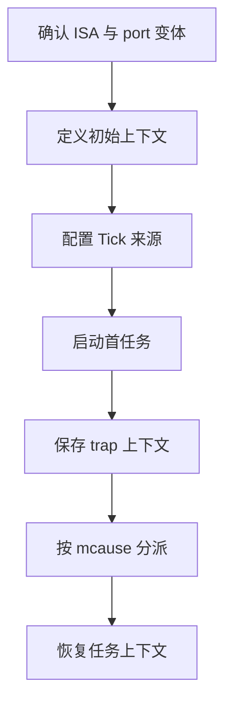
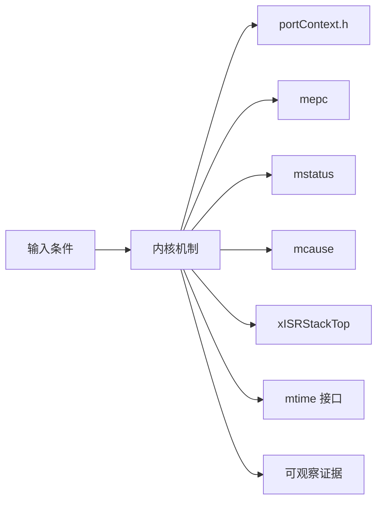
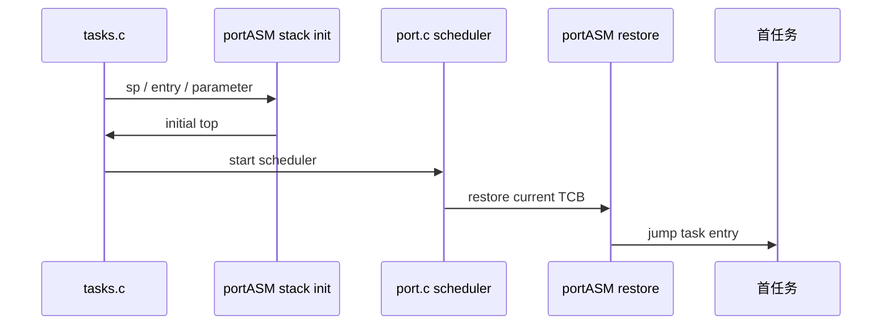
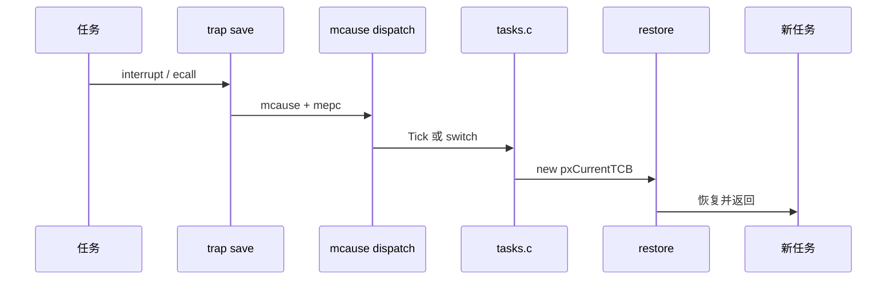
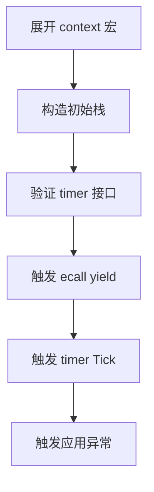
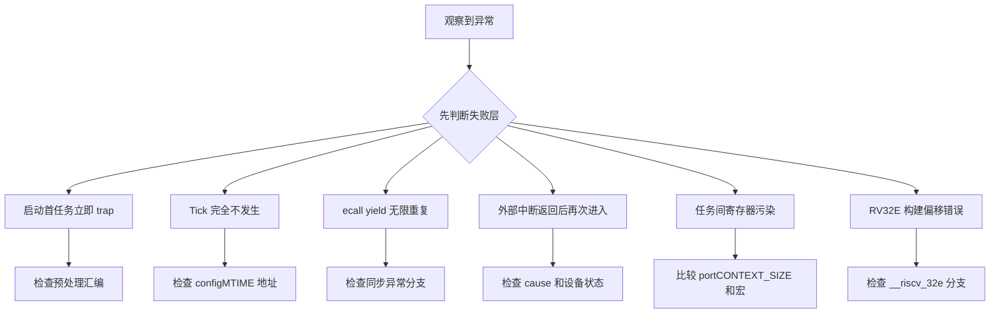

RISC-V 没有 Cortex-M 那套固定异常自动压栈，FreeRTOS port 必须显式定义上下文大小、CSR 槽位、trap 分派和平台 timer 接口。

本篇只回答一个核心问题：**上游 RISC-V port 如何在多种实现差异下保存任务上下文、处理 Tick 并切换任务？**

分析范围固定为 **FreeRTOS-Kernel V11.3.0**。所有函数、字段、宏和条件编译都以该 tag 为准。

本篇把公共 portASM.S、portContext.h 和 chip-specific extensions 分开，沿 initial stack、first task、timer interrupt、ecall yield 与通用 trap 五条路径建立契约。

## 1. 问题边界、前置条件与验收证据

只解释上游 Machine mode GCC port。mtime/mtimecmp、CLINT 与额外寄存器属于平台能力，不能写成所有 RISC-V 的固定事实。

读者理解通用寄存器和 M-mode CSR，需要进一步理解 port 为什么同时支持 RV32I/RV64I、RV32E、FPU/VPU 与芯片扩展。

阅读源码前先写清输入状态、允许的状态变化和输出证据。只看函数名或最终返回值，无法判断链表、锁和调度点是否正确。



| 顺序 | 阅读动作 | 入口条件 | 状态变化 | 验收证据 |
|---:|---|---|---|---|
| 1 | 确认 ISA 与 port 变体 | 构建目标已知。 | context size 唯一。 | 编译宏清单。 |
| 2 | 定义初始上下文 | TCB/stack 与任务入口有效。 | 可由 restore 宏启动。 | 逐槽布局。 |
| 3 | 配置 Tick 来源 | scheduler 尚未启动。 | timer compare 能产生周期 trap。 | timer 地址和频率证据。 |
| 4 | 启动首任务 | current TCB 已选。 | 任务在预期特权运行。 | 首 PC/SP/CSR。 |
| 5 | 保存 trap 上下文 | trap 到达。 | 任务 frame 完整。 | sp、mepc、mstatus。 |
| 6 | 按 mcause 分派 | context 已保存。 | 决定是否改变 current。 | cause 和调用 trace。 |
| 7 | 恢复任务上下文 | handler 完成。 | CSR/通用寄存器和 sp 恢复。 | 切换后 PC/CSR。 |

### 1. 确认 ISA 与 port 变体

入口条件：构建目标已知。

执行动作：记录 XLEN、RV32E、FPU/VPU 和扩展头。

核心状态变化：context size 唯一。

离开这一步时必须成立：汇编器 include 正确。

可观察证据：编译宏清单。

停止条件：ISA 条件不明时停止。

### 2. 定义初始上下文

入口条件：TCB/stack 与任务入口有效。

执行动作：pxPortInitialiseStack 写 critical nesting、参数、mstatus、PC。

核心状态变化：可由 restore 宏启动。

离开这一步时必须成立：栈对齐。

可观察证据：逐槽布局。

停止条件：mstatus/PC 不明时停止。

### 3. 配置 Tick 来源

入口条件：scheduler 尚未启动。

执行动作：调用 vPortSetupTimerInterrupt 或平台实现。

核心状态变化：timer compare 能产生周期 trap。

离开这一步时必须成立：不假设 CLINT。

可观察证据：timer 地址和频率证据。

停止条件：平台无 mtime 却使用默认时停止。

### 4. 启动首任务

入口条件：current TCB 已选。

执行动作：xPortStartFirstTask 恢复寄存器/mstatus 并跳转。

核心状态变化：任务在预期特权运行。

离开这一步时必须成立：中断状态正确。

可观察证据：首 PC/SP/CSR。

停止条件：ISR stack 未对齐时停止。

### 5. 保存 trap 上下文

入口条件：trap 到达。

执行动作：portcontextSAVE_CONTEXT_INTERNAL 保存任务并切 ISR stack。

核心状态变化：任务 frame 完整。

离开这一步时必须成立：异步/同步尚未分派。

可观察证据：sp、mepc、mstatus。

停止条件：保存未完成时禁止调 C。

### 6. 按 mcause 分派

入口条件：context 已保存。

执行动作：timer 调 Tick、ecall 调 switch、其他交应用 handler。

核心状态变化：决定是否改变 current。

离开这一步时必须成立：返回 PC 规则正确。

可观察证据：cause 和调用 trace。

停止条件：未知异常被误当 yield 时停止。

### 7. 恢复任务上下文

入口条件：handler 完成。

执行动作：portcontextRESTORE_CONTEXT 读取 current TCB。

核心状态变化：CSR/通用寄存器和 sp 恢复。

离开这一步时必须成立：mret/ret 路径符合 port。

可观察证据：切换后 PC/CSR。

停止条件：额外寄存器不对称时停止。

## 2. 核心数据结构、所有权与不变量

RISC-V port 以 portCONTEXT_SIZE 统一栈布局，保存 mepc、mstatus、通用寄存器、critical nesting 和可选扩展状态；trap handler 再按 mcause 分流。

这里不把字段当作词汇表，而是解释字段由谁修改、在哪个临界区修改、它和哪个链表或对象保持一致。



| 对象 | 角色 | 必须保持的不变量 | 观察方法 | 常见误读 |
|---|---|---|---|---|
| portContext.h | 定义上下文大小与保存恢复宏。 | save 与 restore 使用同一偏移。 | 检查宏展开。 | 只阅读 portASM.S 不看布局宏。 |
| mepc | 保存异常返回 PC。 | 同步 ecall 返回地址需要前移。 | 记录异常前后值。 | 所有 trap 都原样保存 mepc。 |
| mstatus | 保存 MIE/MPIE/MPP 与扩展状态。 | 恢复值决定返回特权和中断状态。 | 查看 FS/VS/MPIE。 | 只把它当中断开关。 |
| mcause | 区分中断位和 cause 编号。 | handler 必须先分同步/异步再分具体 source。 | 记录高位和 code。 | 把 cause 数字脱离 XLEN 解读。 |
| xISRStackTop | trap 处理切换到独立 ISR stack。 | 对齐且不覆盖任务 context frame。 | 记录 sp 切换。 | 在任务栈上运行所有 ISR C 代码。 |
| mtime 接口 | 一种可选 Machine timer Tick 来源。 | 地址与频率由配置或应用提供。 | 检查 configMTIME 地址。 | 认为 RISC-V 必然有 CLINT。 |
| chip-specific extensions | 保存 ISA 实现额外寄存器。 | additional save/restore 对称且 assembler include 正确。 | 检查 include path 和 size。 | 选错扩展头仍期望稳定运行。 |
| ecall yield | 同步异常触发调度。 | mepc 前移避免重复执行 ecall。 | 记录 cause、mepc、current。 | 把 ecall 当普通函数调用。 |

### portContext.h

角色：定义上下文大小与保存恢复宏。

所有权：通用 RISC-V port。

不变量：save 与 restore 使用同一偏移。

变化时机：trap 与首任务恢复。

观察方法：检查宏展开。

常见误读：只阅读 portASM.S 不看布局宏。

### mepc

角色：保存异常返回 PC。

所有权：CPU CSR/port frame。

不变量：同步 ecall 返回地址需要前移。

变化时机：trap 进入与 restore。

观察方法：记录异常前后值。

常见误读：所有 trap 都原样保存 mepc。

### mstatus

角色：保存 MIE/MPIE/MPP 与扩展状态。

所有权：CPU 与 port。

不变量：恢复值决定返回特权和中断状态。

变化时机：初始栈与 trap。

观察方法：查看 FS/VS/MPIE。

常见误读：只把它当中断开关。

### mcause

角色：区分中断位和 cause 编号。

所有权：CPU CSR。

不变量：handler 必须先分同步/异步再分具体 source。

变化时机：trap 分派。

观察方法：记录高位和 code。

常见误读：把 cause 数字脱离 XLEN 解读。

### xISRStackTop

角色：trap 处理切换到独立 ISR stack。

所有权：port/链接环境。

不变量：对齐且不覆盖任务 context frame。

变化时机：保存任务后。

观察方法：记录 sp 切换。

常见误读：在任务栈上运行所有 ISR C 代码。

### mtime 接口

角色：一种可选 Machine timer Tick 来源。

所有权：平台/CLINT。

不变量：地址与频率由配置或应用提供。

变化时机：scheduler start 与 timer ISR。

观察方法：检查 configMTIME 地址。

常见误读：认为 RISC-V 必然有 CLINT。

### chip-specific extensions

角色：保存 ISA 实现额外寄存器。

所有权：目标芯片扩展头。

不变量：additional save/restore 对称且 assembler include 正确。

变化时机：context macro。

观察方法：检查 include path 和 size。

常见误读：选错扩展头仍期望稳定运行。

### ecall yield

角色：同步异常触发调度。

所有权：portYIELD 与 trap handler。

不变量：mepc 前移避免重复执行 ecall。

变化时机：任务主动 yield。

观察方法：记录 cause、mepc、current。

常见误读：把 ecall 当普通函数调用。

## 3. 调用链一：初始栈到首任务启动

RISC-V 初始栈由汇编函数构造，保存任务参数、mstatus、入口 PC、critical nesting 和可选扩展槽位。

调用链中的每一跳都要区分普通函数调用、宏展开、临界区边界和可能触发调度的 port hook。



### 调用链一：prvInitialiseNewTask -> pxPortInitialiseStack -> xPortStartScheduler -> xPortStartFirstTask

#### 链路步骤 1：预留 critical nesting

进入时：栈顶对齐。

本步读取：每任务 nesting 初值。

本步修改：stack slot。

并发边界：任务尚未运行。

返回或转交：值为零。

证据：内存窗口。

#### 链路步骤 2：预留通用寄存器

进入时：ISA 变体已知。

本步读取：RV32E 或完整寄存器集。

本步修改：context frame 大小。

并发边界：汇编宏条件。

返回或转交：参数位于 a0 槽。

证据：偏移表。

#### 链路步骤 3：构造 mstatus

进入时：当前 CSR 可读。

本步读取：MIE/MPIE/MPP/FS/VS。

本步修改：初始 CSR 槽。

并发边界：Machine mode port。

返回或转交：任务启动中断状态。

证据：mstatus 解码。

#### 链路步骤 4：写入口 PC

进入时：任务函数已知。

本步读取：pxCode。

本步修改：mepc/return slot。

并发边界：栈写入。

返回或转交：restore 可跳转。

证据：PC 槽。

#### 链路步骤 5：配置 timer/ISR stack

进入时：port start 进入。

本步读取：xISRStackTop 和 timer hook。

本步修改：trap 环境。

并发边界：启动前。

返回或转交：Tick 可用。

证据：对齐断言和 timer register。

#### 链路步骤 6：恢复首任务

进入时：current TCB 有 top。

本步读取：sp、CSR、通用寄存器。

本步修改：CPU context。

并发边界：汇编恢复原子性。

返回或转交：进入任务。

证据：首 PC/SP/mstatus。

### 源码片段：RISC-V 初始上下文由汇编构造

> 源码位置：`portable/GCC/RISC-V/portASM.S` · `pxPortInitialiseStack` · `V11.3.0`
> 配置条件：GCC RISC-V Machine mode port
> 固定链接：[查看上游源码](https://github.com/FreeRTOS/FreeRTOS-Kernel/blob/V11.3.0/portable/GCC/RISC-V/portASM.S)

```asm
pxPortInitialiseStack:
    addi a0, a0, -portWORD_SIZE
    store_x x0, 0(a0)
    addi a0, a0, -(22 * portWORD_SIZE)
    store_x a2, 0(a0)
    csrr t0, mstatus
    store_x t0, 0(a0)
    store_x a1, 0(a0)
```

这段摘录只保留当前机制需要的语句；省略的参数检查、trace hook 或条件分支必须回到固定链接核对。

解读 1：真实偏移受 RV32E/FPU/VPU/extension 条件影响。

解读 2：critical nesting 每任务从零开始。

解读 3：任务参数进入 a0 寄存器槽。

解读 4：mstatus 与入口 PC 都是 context frame 一部分。

不变量：初始 frame 与 portcontextRESTORE_CONTEXT 偏移完全一致。

观察点：展开宏后生成完整偏移表。

### 源码片段：scheduler start 把 timer 来源留给平台

> 源码位置：`portable/GCC/RISC-V/port.c` · `xPortStartScheduler()` · `V11.3.0`
> 配置条件：configMTIME 地址决定默认或应用 timer hook
> 固定链接：[查看上游源码](https://github.com/FreeRTOS/FreeRTOS-Kernel/blob/V11.3.0/portable/GCC/RISC-V/port.c)

```c
configASSERT( ( xISRStackTop & portBYTE_ALIGNMENT_MASK ) == 0 );
vPortSetupTimerInterrupt();

#if ( configMTIME_BASE_ADDRESS != 0 )
    __asm volatile ( "csrs mie, %0" :: "r" ( 0x880 ) );
#endif

xPortStartFirstTask();
```

这段摘录只保留当前机制需要的语句；省略的参数检查、trace hook 或条件分支必须回到固定链接核对。

解读 1：ISR stack 对齐在启动前验证。

解读 2：vPortSetupTimerInterrupt 是平台交接点。

解读 3：只有配置了 mtime 地址才使用默认 machine timer 路径。

解读 4：首任务由汇编恢复。

不变量：没有可用 mtime 时应用必须提供正确 Tick 配置。

观察点：记录 configMTIME 地址、mie 和 timer compare。

## 4. 调用链二：trap 分派到 Tick 或 ecall context switch

通用 trap handler 先保存任务，再在 ISR stack 上按 mcause 区分 machine timer、ecall 和应用异常/中断。

第二条链用于验证同一对象在另一条执行路径上的行为，重点检查它是否复用相同不变量，还是进入 ISR、daemon 或 portable 层的特殊规则。



### 调用链二：trap -> SAVE_CONTEXT -> mcause -> Tick/ecall/application -> vTaskSwitchContext -> RESTORE_CONTEXT

#### 链路步骤 1：保存 internal context

进入时：trap 刚进入。

本步读取：sp 与所有 context 槽。

本步修改：任务栈和 TCB top。

并发边界：中断关闭/汇编边界。

返回或转交：可安全调用 C。

证据：frame dump。

#### 链路步骤 2：读取 cause 与 PC

进入时：保存完成。

本步读取：mcause、mepc。

本步修改：a0/a1 参数。

并发边界：ISR stack。

返回或转交：进入分派。

证据：CSR trace。

#### 链路步骤 3：处理 timer interrupt

进入时：cause 为 machine timer。

本步读取：compare register、Tick。

本步修改：xTickCount 和 maybe current。

并发边界：handler 上下文。

返回或转交：决定是否 switch。

证据：Tick 返回值。

#### 链路步骤 4：处理 ecall

进入时：cause 为 M environment call。

本步读取：mepc。

本步修改：返回 PC 加一条指令。

并发边界：同步异常规则。

返回或转交：调用 switch。

证据：更新后的 mepc。

#### 链路步骤 5：处理应用 source

进入时：非内核 source。

本步读取：application handler hook。

本步修改：设备状态。

并发边界：应用负责清 source。

返回或转交：返回 common restore。

证据：handler trace。

#### 链路步骤 6：恢复 current

进入时：分派完成。

本步读取：pxCurrentTCB top。

本步修改：寄存器、CSR、sp。

并发边界：restore 对称。

返回或转交：旧或新任务继续。

证据：PC 与 current 对应。

### 源码片段：上下文宏保存 CSR 与可扩展寄存器

> 源码位置：`portable/GCC/RISC-V/portContext.h` · `portcontextSAVE_CONTEXT_INTERNAL` · `V11.3.0`
> 配置条件：XLEN/RV32E/FPU/VPU 与 chip extension
> 固定链接：[查看上游源码](https://github.com/FreeRTOS/FreeRTOS-Kernel/blob/V11.3.0/portable/GCC/RISC-V/portContext.h)

```asm
addi sp, sp, -portCONTEXT_SIZE
csrr t0, mstatus
store_x t0, 1 * portWORD_SIZE( sp )
portasmSAVE_ADDITIONAL_REGISTERS
csrr a0, mcause
csrr a1, mepc
```

这段摘录只保留当前机制需要的语句；省略的参数检查、trace hook 或条件分支必须回到固定链接核对。

解读 1：portCONTEXT_SIZE 根据 ISA 特性改变。

解读 2：mstatus 和 mepc 有固定槽位。

解读 3：chip extension 通过宏追加对称保存。

解读 4：保存结束后才能切到 ISR stack 调 C。

不变量：additional save/restore 数量与 portCONTEXT_SIZE 一致。

观察点：反汇编核对 sp 差值和每个 store/load。

### 源码片段：trap handler 区分 timer、ecall 和应用 source

> 源码位置：`portable/GCC/RISC-V/portASM.S` · `freertos_risc_v_trap_handler` · `V11.3.0`
> 配置条件：通用 RISC-V trap vector 指向该符号
> 固定链接：[查看上游源码](https://github.com/FreeRTOS/FreeRTOS-Kernel/blob/V11.3.0/portable/GCC/RISC-V/portASM.S)

```asm
csrr a0, mcause
csrr a1, mepc
bge a0, x0, synchronous_exception

/* machine timer */
call xTaskIncrementTick
beqz a0, processed_source
call vTaskSwitchContext

/* ecall */
addi a1, a1, 4
call vTaskSwitchContext
```

这段摘录只保留当前机制需要的语句；省略的参数检查、trace hook 或条件分支必须回到固定链接核对。

解读 1：mcause 最高位区分中断和异常。

解读 2：同步 ecall 必须跳过触发指令。

解读 3：timer 只有在 Tick 返回 true 时切换。

解读 4：其他 source 转交应用 handler。

不变量：restore 前保存的返回 PC 必须与 trap 类型语义一致。

观察点：记录 mcause、原始/更新 mepc 和 current TCB。

<!-- IMAGE_PROMPT: 16:9 深色技术插画，展示 RISC-V 任务栈中的 mepc、mstatus、x1-x31、critical nesting 和 chip-specific slots；右侧是 trap handler 按 mcause 分为 timer interrupt、ecall、application handler 三条路径；标签简洁，无具体开发板、无厂商 logo。 -->

## 5. 配置矩阵、观测实验与证据记录

使用可控输入和 trace hook 观察对象变化，不依赖特定开发板。

实验只承诺观察软件状态和调用顺序。没有实际目标硬件或 trace 数据时，不写虚构时间和性能数字。



### 配置矩阵

| 配置或条件 | 取值 A | 取值 B | 源码影响 | 验证重点 |
|---|---|---|---|---|
| __riscv_xlen | 32 | 64 | 改变 word size、cause high bit 与 context slot。 | 核对 portWORD_SIZE。 |
| __riscv_32e | 关闭 | 开启 | 决定保存 x16-x31 与 context size。 | 展开 portCONTEXT_SIZE。 |
| configMTIME_BASE_ADDRESS | 0 | 非零 | 选择应用 timer hook 或默认 mtime。 | 检查 vPortSetupTimerInterrupt。 |
| configENABLE_FPU | 0 | 1 | 决定 mstatus FS 和 FP context。 | 查看 FS 状态和 frame。 |
| configENABLE_VPU | 0 | 1 | 决定 VS 状态和向量 context。 | 查看 VS 与额外槽位。 |
| chip extension header | 无额外寄存器 | 有额外寄存器 | 改变 additional save/restore。 | 核对 assembler include path。 |

### 实验步骤

1. **展开 context 宏**

   操作：按目标 ISA 预处理汇编。

   记录：context size 与槽位。

   通过标准：save/restore 对称。

2. **构造初始栈**

   操作：调用汇编初始化逻辑。

   记录：参数、mstatus、PC。

   通过标准：首恢复布局正确。

3. **验证 timer 接口**

   操作：分别设置 mtime 地址零/非零。

   记录：timer hook 与 mie。

   通过标准：走正确平台路径。

4. **触发 ecall yield**

   操作：任务执行 portYIELD。

   记录：mcause/mepc/current。

   通过标准：mepc 前移且任务切换。

5. **触发 timer Tick**

   操作：推进到高优先级任务到期。

   记录：compare、Tick 返回值。

   通过标准：必要时 switch。

6. **触发应用异常**

   操作：使用非 ecall cause。

   记录：application hook 与返回。

   通过标准：不误走内核 yield。

### 证据表

| 证据 | 获取方法 | 通过标准 | 失败说明 |
|---|---|---|---|
| context size | 预处理和反汇编 | sp 调整等于定义大小 | 不一致会覆盖 frame |
| initial mstatus | 解码栈中 CSR | MPP/MPIE/FS/VS 符合配置 | 错误状态会首启异常 |
| timer source | 配置与寄存器/hook trace | 只有一个 Tick 来源 | 双 Tick 会加速时间 |
| mcause 分派 | trap trace | timer/ecall/application 各走正确分支 | 错误分派会重复异常或漏清源 |
| mepc 处理 | 比较异常前后 PC | ecall 前移，异步中断保持 | 重复 ecall 会死循环 |
| extension 对称 | 保存恢复前后寄存器 | 额外状态不污染 | 选错头会跨任务泄漏 |

#### 证据：context size

获取方法：预处理和反汇编

应当看到：sp 调整等于定义大小

如果不满足：不一致会覆盖 frame

为什么这项证据有效：布局宏是所有保存恢复证据。

#### 证据：initial mstatus

获取方法：解码栈中 CSR

应当看到：MPP/MPIE/FS/VS 符合配置

如果不满足：错误状态会首启异常

为什么这项证据有效：CSR 决定返回权限和中断。

#### 证据：timer source

获取方法：配置与寄存器/hook trace

应当看到：只有一个 Tick 来源

如果不满足：双 Tick 会加速时间

为什么这项证据有效：平台接口必须唯一。

#### 证据：mcause 分派

获取方法：trap trace

应当看到：timer/ecall/application 各走正确分支

如果不满足：错误分派会重复异常或漏清源

为什么这项证据有效：cause 是控制流直接依据。

#### 证据：mepc 处理

获取方法：比较异常前后 PC

应当看到：ecall 前移，异步中断保持

如果不满足：重复 ecall 会死循环

为什么这项证据有效：同步与异步返回语义不同。

#### 证据：extension 对称

获取方法：保存恢复前后寄存器

应当看到：额外状态不污染

如果不满足：选错头会跨任务泄漏

为什么这项证据有效：芯片差异必须封装在扩展宏。

## 6. 常见误读、故障定位与修复原则

排错从最早被破坏的不变量开始，不从最终崩溃位置随机回退。

先验证对象成员和链表归属，再检查锁、配置分支和调度请求。



### 1. 启动首任务立即 trap

根因：初始 context size/布局不匹配

第一检查点：检查预处理汇编

需要保存的证据：sp、mstatus、PC 槽

修复原则：统一 portContext 与 portASM

不能采用的绕过方式：不要随机调整栈深度。

### 2. Tick 完全不发生

根因：平台无 mtime 却未实现 timer hook

第一检查点：检查 configMTIME 地址

需要保存的证据：mie、timer compare、hook trace

修复原则：提供正确 vPortSetupTimerInterrupt

不能采用的绕过方式：不要假设所有核有 CLINT。

### 3. ecall yield 无限重复

根因：mepc 未前移

第一检查点：检查同步异常分支

需要保存的证据：连续 mcause/mepc

修复原则：保存 pxCode 后一条指令

不能采用的绕过方式：不要在应用 handler 吞掉。

### 4. 外部中断返回后再次进入

根因：应用 handler 未清中断源

第一检查点：检查 cause 和设备状态

需要保存的证据：handler 前后 pending

修复原则：在应用 hook 正确 ack

不能采用的绕过方式：不要让内核通用 handler猜设备。

### 5. 任务间寄存器污染

根因：save/restore 或 extension 不对称

第一检查点：比较 portCONTEXT_SIZE 和宏

需要保存的证据：切换前后寄存器样本

修复原则：修复扩展头与汇编路径

不能采用的绕过方式：不要在任务入口重置寄存器掩盖。

### 6. RV32E 构建偏移错误

根因：仍按 31 寄存器 frame

第一检查点：检查 __riscv_32e 分支

需要保存的证据：反汇编 sp 调整

修复原则：使用正确 context size

不能采用的绕过方式：不要硬编码偏移。

### 7. FPU/VPU 状态丢失

根因：配置和硬件扩展不一致

第一检查点：检查 misa/mstatus 与宏

需要保存的证据：FS/VS 和任务结果

修复原则：启用并验证扩展保存

不能采用的绕过方式：不要所有任务共享扩展状态。

## 7. 源码索引、阶段验收与面试表达

完成本篇后，读者应能不依赖文章复述对象模型、两条调用链、配置差异和取证顺序。

### 源码索引

| 文件 | 结构体 / 函数 / 宏 | 作用 |
|---|---|---|
| [portable/GCC/RISC-V/portASM.S](https://github.com/FreeRTOS/FreeRTOS-Kernel/blob/V11.3.0/portable/GCC/RISC-V/portASM.S) | initial stack、first task、trap handler | 汇编主路径 |
| [portable/GCC/RISC-V/portContext.h](https://github.com/FreeRTOS/FreeRTOS-Kernel/blob/V11.3.0/portable/GCC/RISC-V/portContext.h) | context size、save/restore 宏 | 上下文布局 |
| [portable/GCC/RISC-V/port.c](https://github.com/FreeRTOS/FreeRTOS-Kernel/blob/V11.3.0/portable/GCC/RISC-V/port.c) | scheduler start、timer hook | C 端口入口 |
| [portable/GCC/RISC-V/portmacro.h](https://github.com/FreeRTOS/FreeRTOS-Kernel/blob/V11.3.0/portable/GCC/RISC-V/portmacro.h) | ecall yield、interrupt macros | 公共宏契约 |
| [portable/GCC/RISC-V/readme.txt](https://github.com/FreeRTOS/FreeRTOS-Kernel/blob/V11.3.0/portable/GCC/RISC-V/readme.txt) | chip-specific extension 选择 | 构建边界 |

### 阶段验收

1. 能解释 RISC-V port 为什么显式保存上下文。
2. 能展开 portCONTEXT_SIZE。
3. 能标注 mstatus/mepc/通用寄存器槽位。
4. 能跟踪首任务恢复。
5. 能区分 timer interrupt 与 ecall。
6. 能说明 mtime 不是所有平台必备。
7. 能解释 chip-specific extension。
8. 能与 Cortex-M4 port 做契约级比较。

### 验收记录模板

| 项目 | 实际证据 | 结论 |
|---|---|---|
| 能解释 RISC-V port 为什么显式保存上下文。 |  |  |
| 能展开 portCONTEXT_SIZE。 |  |  |
| 能标注 mstatus/mepc/通用寄存器槽位。 |  |  |
| 能跟踪首任务恢复。 |  |  |
| 能区分 timer interrupt 与 ecall。 |  |  |
| 能说明 mtime 不是所有平台必备。 |  |  |
| 能解释 chip-specific extension。 |  |  |
| 能与 Cortex-M4 port 做契约级比较。 |  |  |

### 面试表达

RISC-V port 把上下文布局集中在 portContext.h，并通过 chip-specific extension 宏兼容额外寄存器；save 和 restore 必须与 context size 完全对称。

portYIELD 使用 ecall 触发同步异常，因此 handler 必须推进 mepc；timer interrupt 是异步事件，保存原始返回 PC。

上游 port 可以使用 mtime/mtimecmp，但 RISC-V 架构不保证每个平台都有相同 timer，应用需要在地址为零时实现 vPortSetupTimerInterrupt。

### 参考资料

- [FreeRTOS-Kernel V11.3.0](https://github.com/FreeRTOS/FreeRTOS-Kernel/tree/V11.3.0)
- [FreeRTOS Kernel Book](https://github.com/FreeRTOS/FreeRTOS-Kernel-Book)
- [RISC-V Privileged Architecture](https://github.com/riscv/riscv-isa-manual/releases)

> 🏷️ FreeRTOS / RISC-V / trap / CSR / portASM.S / Context Switch
