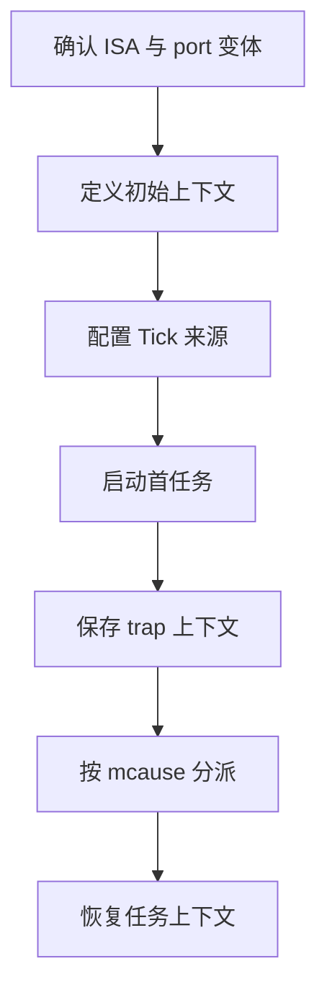
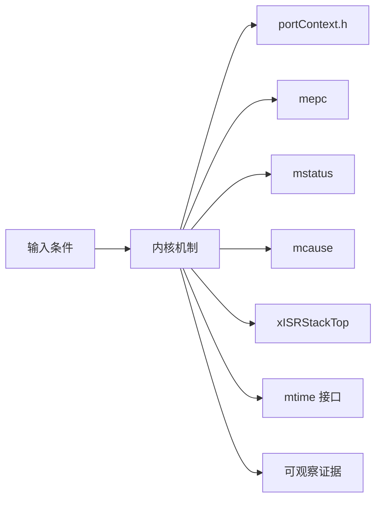
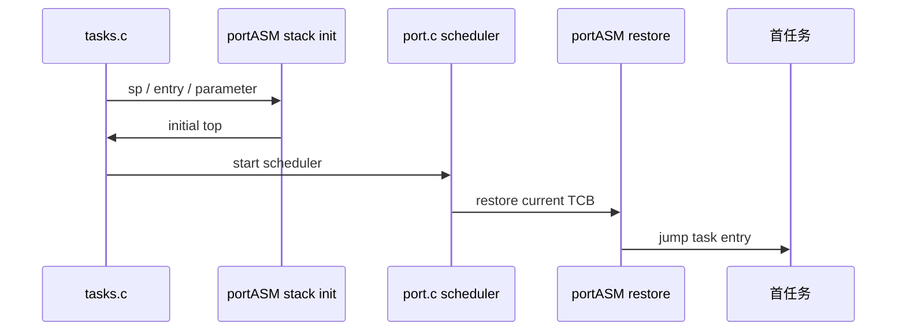
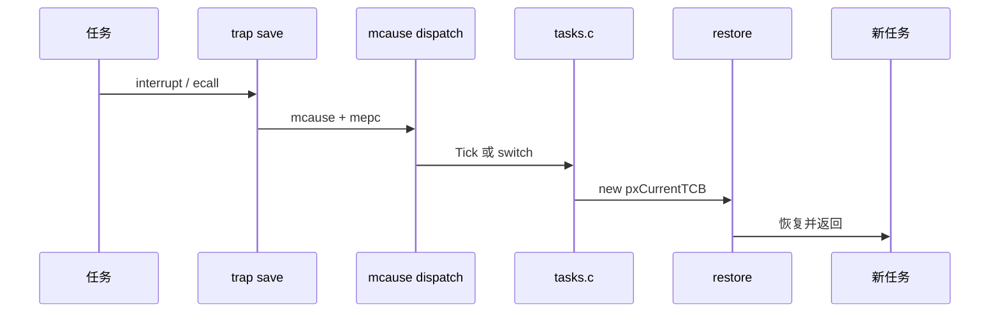
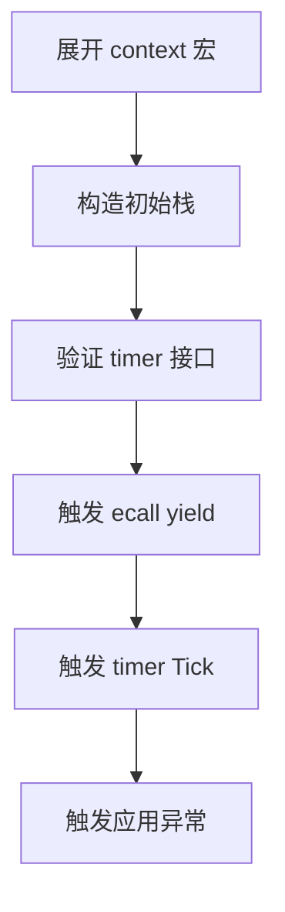
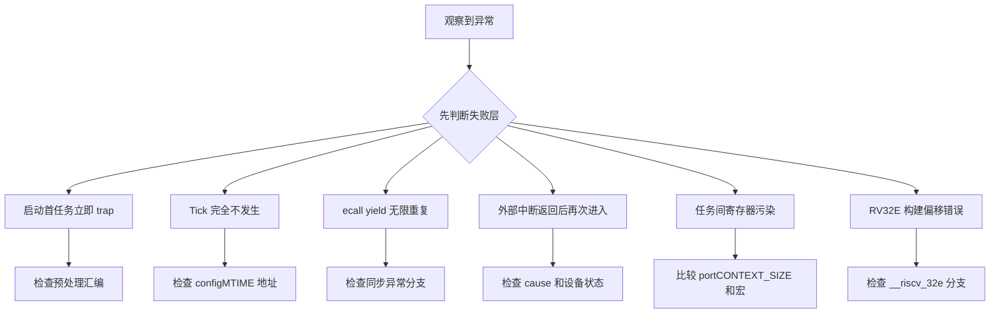

RISC-V 没有 Cortex-M 那套固定异常自动压栈，FreeRTOS port 必须显式定义上下文大小、CSR 槽位、trap 分派和平台 timer 接口。

本篇只回答一个核心问题：**上游 RISC-V port 如何在多种实现差异下保存任务上下文、处理 Tick 并切换任务？**

分析范围固定为 **FreeRTOS-Kernel V11.3.0**。所有函数、字段、宏和条件编译都以该 tag 为准。

本篇把公共 portASM.S、portContext.h 和 chip-specific extensions 分开，沿 initial stack、first task、timer interrupt、ecall yield 与通用 trap 五条路径建立契约。

## 1. RISC-V 端口要解决什么

只解释上游 Machine mode GCC port。mtime/mtimecmp、CLINT 与额外寄存器属于平台能力，不能写成所有 RISC-V 的固定事实。

读者理解通用寄存器和 M-mode CSR，需要进一步理解 port 为什么同时支持 RV32I/RV64I、RV32E、FPU/VPU 与芯片扩展。



## 2. Context frame、CSR 与 trap 分派的共同约束

RISC-V port 以 portCONTEXT_SIZE 统一栈布局，保存 mepc、mstatus、通用寄存器、critical nesting 和可选扩展状态；trap handler 再按 mcause 分流。



| 对象 | 角色 | 必须保持的不变量 | 观察方法 | 常见误读 |
|---|---|---|---|---|
| portContext.h | 定义上下文大小与保存恢复宏。 | save 与 restore 使用同一偏移。 | 检查宏展开。 | 只阅读 portASM.S 不看布局宏。 |
| mepc | 保存异常返回 PC。 | 同步 ecall 返回地址需要前移。 | 记录异常前后值。 | 所有 trap 都原样保存 mepc。 |
| mstatus | 保存 MIE/MPIE/MPP 与扩展状态。 | 恢复值决定返回特权和中断状态。 | 查看 FS/VS/MPIE。 | 只把它当中断开关。 |
| mcause | 区分中断位和 cause 编号。 | handler 必须先分同步/异步再分具体 source。 | 记录高位和 code。 | 把 cause 数字脱离 XLEN 解读。 |
| xISRStackTop | trap 处理切换到独立 ISR stack。 | 对齐且不覆盖任务 context frame。 | 记录 sp 切换。 | 在任务栈上运行所有 ISR C 代码。 |
| mtime 接口 | 一种可选 Machine timer Tick 来源。 | 地址与频率由配置或应用提供。 | 检查 configMTIME 地址。 | 认为 RISC-V 必然有 CLINT。 |
| chip-specific extensions | 保存 ISA 实现额外寄存器。 | additional save/restore 对称且 assembler include 正确。 | 检查 include path 和 size。 | 选错扩展头仍期望稳定运行。 |
| ecall yield | 同步异常触发调度。 | mepc 前移避免重复执行 ecall。 | 记录 cause、mepc、current。 | 把 ecall 当普通函数调用。 |

## 3. 调用链一：初始栈到首任务启动

RISC-V 初始栈由汇编函数构造，保存任务参数、mstatus、入口 PC、critical nesting 和可选扩展槽位。



### 调用链一：prvInitialiseNewTask -> pxPortInitialiseStack -> xPortStartScheduler -> xPortStartFirstTask

RISC-V port 的 pxPortInitialiseStack 先按 portBYTE_ALIGNMENT 对齐栈顶，并为每任务 critical nesting、通用寄存器和必要的 chip-specific 扩展预留固定槽位。任务参数写入 a0 对应槽，任务入口写入返回 PC 槽；mstatus 则根据 Machine mode、初始中断状态以及 FPU/向量扩展配置构造。

xPortStartScheduler 在进入汇编恢复前准备 ISR stack 和 Tick 来源。xPortStartFirstTask 从 pxCurrentTCB 读取保存的 sp，按 portContext.h 定义的偏移恢复 CSR 与通用寄存器，再跳转到任务入口。context size、保存宏和恢复宏必须使用同一组条件编译，否则任一可选扩展都会让后续槽位整体错位。

验证首任务时应把栈内存按 portContext.h 的槽位表解码，确认 a0、mepc/返回 PC、mstatus 和 critical nesting 的初值，同时核对 sp 对齐及启用扩展对应的额外保存区。

### 源码片段：RISC-V 初始上下文由汇编构造

> 源码位置：`portable/GCC/RISC-V/portASM.S` · `pxPortInitialiseStack` · `V11.3.0`
> 配置条件：GCC RISC-V Machine mode port
> 固定链接：[查看上游源码](https://github.com/FreeRTOS/FreeRTOS-Kernel/blob/V11.3.0/portable/GCC/RISC-V/portASM.S)

```asm
pxPortInitialiseStack:
    addi a0, a0, -portWORD_SIZE
    store_x x0, 0(a0)
    addi a0, a0, -(22 * portWORD_SIZE)
    store_x a2, 0(a0)
    csrr t0, mstatus
    store_x t0, 0(a0)
    store_x a1, 0(a0)
```

- 真实偏移受 RV32E/FPU/VPU/extension 条件影响。
- critical nesting 每任务从零开始。
- 任务参数进入 a0 寄存器槽。
- mstatus 与入口 PC 都是 context frame 一部分。

> **关键约束**：初始 frame 与 portcontextRESTORE_CONTEXT 偏移完全一致。 **验证重点**：展开宏后生成完整偏移表。

### 源码片段：scheduler start 把 timer 来源留给平台

> 源码位置：`portable/GCC/RISC-V/port.c` · `xPortStartScheduler()` · `V11.3.0`
> 配置条件：configMTIME 地址决定默认或应用 timer hook
> 固定链接：[查看上游源码](https://github.com/FreeRTOS/FreeRTOS-Kernel/blob/V11.3.0/portable/GCC/RISC-V/port.c)

```c
configASSERT( ( xISRStackTop & portBYTE_ALIGNMENT_MASK ) == 0 );
vPortSetupTimerInterrupt();

#if ( configMTIME_BASE_ADDRESS != 0 )
    __asm volatile ( "csrs mie, %0" :: "r" ( 0x880 ) );
#endif

xPortStartFirstTask();
```

- ISR stack 对齐在启动前验证。
- vPortSetupTimerInterrupt 是平台交接点。
- 只有配置了 mtime 地址才使用默认 machine timer 路径。
- 首任务由汇编恢复。

> **关键约束**：没有可用 mtime 时应用必须提供正确 Tick 配置。 **验证重点**：记录 configMTIME 地址、mie 和 timer compare。

## 4. 调用链二：trap 分派到 Tick 或 ecall context switch

通用 trap handler 先保存任务，再在 ISR stack 上按 mcause 区分 machine timer、ecall 和应用异常/中断。



### 调用链二：trap -> SAVE_CONTEXT -> mcause -> Tick/ecall/application -> vTaskSwitchContext -> RESTORE_CONTEXT

trap handler 进入后先通过 SAVE_CONTEXT 把当前任务的寄存器、CSR 和 sp 保存到任务栈，并将新 top 写回 TCB；只有上下文完整后，汇编才能切到 ISR stack 调用 C 逻辑。随后读取 mcause 与 mepc，区分 timer interrupt、ecall 和应用提供的其他异常/中断处理入口。

machine timer 路径推进 Tick，并根据 xTaskIncrementTick 的返回值决定是否调用 vTaskSwitchContext。ecall 是同步异常，若它承担 yield，返回 PC 必须越过触发指令；异步 timer interrupt 则保留被打断位置。应用中断还必须在返回前清除自己的硬件源，否则 restore 后会立即再次进入 trap。

分派结束后，RESTORE_CONTEXT 始终从当前 pxCurrentTCB 读取 top，所以它既可以恢复原任务，也可以恢复调度器刚选中的新任务。保存与恢复的寄存器集合、mepc 更新规则以及 current TCB 对应关系必须逐项对称。

### 源码片段：上下文宏保存 CSR 与可扩展寄存器

> 源码位置：`portable/GCC/RISC-V/portContext.h` · `portcontextSAVE_CONTEXT_INTERNAL` · `V11.3.0`
> 配置条件：XLEN/RV32E/FPU/VPU 与 chip extension
> 固定链接：[查看上游源码](https://github.com/FreeRTOS/FreeRTOS-Kernel/blob/V11.3.0/portable/GCC/RISC-V/portContext.h)

```asm
addi sp, sp, -portCONTEXT_SIZE
csrr t0, mstatus
store_x t0, 1 * portWORD_SIZE( sp )
portasmSAVE_ADDITIONAL_REGISTERS
csrr a0, mcause
csrr a1, mepc
```

- portCONTEXT_SIZE 根据 ISA 特性改变。
- mstatus 和 mepc 有固定槽位。
- chip extension 通过宏追加对称保存。
- 保存结束后才能切到 ISR stack 调 C。

> **关键约束**：additional save/restore 数量与 portCONTEXT_SIZE 一致。 **验证重点**：反汇编核对 sp 差值和每个 store/load。

### 源码片段：trap handler 区分 timer、ecall 和应用 source

> 源码位置：`portable/GCC/RISC-V/portASM.S` · `freertos_risc_v_trap_handler` · `V11.3.0`
> 配置条件：通用 RISC-V trap vector 指向该符号
> 固定链接：[查看上游源码](https://github.com/FreeRTOS/FreeRTOS-Kernel/blob/V11.3.0/portable/GCC/RISC-V/portASM.S)

```asm
csrr a0, mcause
csrr a1, mepc
bge a0, x0, synchronous_exception

/* machine timer */
call xTaskIncrementTick
beqz a0, processed_source
call vTaskSwitchContext

/* ecall */
addi a1, a1, 4
call vTaskSwitchContext
```

- mcause 最高位区分中断和异常。
- 同步 ecall 必须跳过触发指令。
- timer 只有在 Tick 返回 true 时切换。
- 其他 source 转交应用 handler。

> **关键约束**：restore 前保存的返回 PC 必须与 trap 类型语义一致。 **验证重点**：记录 mcause、原始/更新 mepc 和 current TCB。

<!-- IMAGE_PROMPT: 16:9 深色技术插画，展示 RISC-V 任务栈中的 mepc、mstatus、x1-x31、critical nesting 和 chip-specific slots；右侧是 trap handler 按 mcause 分为 timer interrupt、ecall、application handler 三条路径；标签简洁，无具体开发板、无厂商 logo。 -->

## 5. 用栈槽、mcause 与 mepc 验证 RISC-V port



### 配置矩阵

| 配置或条件 | 取值 A | 取值 B | 源码影响 | 验证重点 |
|---|---|---|---|---|
| __riscv_xlen | 32 | 64 | 改变 word size、cause high bit 与 context slot。 | 核对 portWORD_SIZE。 |
| __riscv_32e | 关闭 | 开启 | 决定保存 x16-x31 与 context size。 | 展开 portCONTEXT_SIZE。 |
| configMTIME_BASE_ADDRESS | 0 | 非零 | 选择应用 timer hook 或默认 mtime。 | 检查 vPortSetupTimerInterrupt。 |
| configENABLE_FPU | 0 | 1 | 决定 mstatus FS 和 FP context。 | 查看 FS 状态和 frame。 |
| configENABLE_VPU | 0 | 1 | 决定 VS 状态和向量 context。 | 查看 VS 与额外槽位。 |
| chip extension header | 无额外寄存器 | 有额外寄存器 | 改变 additional save/restore。 | 核对 assembler include path。 |

### 实验步骤

1. **展开 context 宏。** 按目标 ISA 预处理汇编，并保存 context size 与槽位；只有 save/restore 对称，这一步才算完成。
2. **构造初始栈。** 调用汇编初始化逻辑。重点核对参数、mstatus、PC，结果应满足“首恢复布局正确”。
3. **验证 timer 接口。** 分别设置 mtime 地址零/非零，把 timer hook 与 mie 保存为证据；判断依据是走正确平台路径。
4. **触发 ecall yield。** 任务执行 portYIELD；观察 mcause/mepc/current。若 mepc 前移且任务切换，即可进入下一步。
5. **触发 timer Tick。** 推进到高优先级任务到期，随后比较 compare、Tick 返回值；预期是必要时 switch。
6. **触发应用异常。** 使用非 ecall cause。最后用 application hook 与返回确认不误走内核 yield。

### 证据表

| 证据 | 获取方法 | 通过标准 | 失败说明 |
|---|---|---|---|
| context size | 预处理和反汇编 | sp 调整等于定义大小 | 不一致会覆盖 frame |
| initial mstatus | 解码栈中 CSR | MPP/MPIE/FS/VS 符合配置 | 错误状态会首启异常 |
| timer source | 配置与寄存器/hook trace | 只有一个 Tick 来源 | 双 Tick 会加速时间 |
| mcause 分派 | trap trace | timer/ecall/application 各走正确分支 | 错误分派会重复异常或漏清源 |
| mepc 处理 | 比较异常前后 PC | ecall 前移，异步中断保持 | 重复 ecall 会死循环 |
| extension 对称 | 保存恢复前后寄存器 | 额外状态不污染 | 选错头会跨任务泄漏 |

## 6. 从上下文布局和 trap 返回点定位端口故障

先验证对象成员和链表归属，再检查锁、配置分支和调度请求。



| 现象 | 根因 | 第一检查点 | 应保存的证据 | 修复原则 |
|---|---|---|---|---|
| 启动首任务立即 trap | 初始 context size/布局不匹配 | 检查预处理汇编 | sp、mstatus、PC 槽 | 统一 portContext 与 portASM |
| Tick 完全不发生 | 平台无 mtime 却未实现 timer hook | 检查 configMTIME 地址 | mie、timer compare、hook trace | 提供正确 vPortSetupTimerInterrupt |
| ecall yield 无限重复 | mepc 未前移 | 检查同步异常分支 | 连续 mcause/mepc | 保存 pxCode 后一条指令 |
| 外部中断返回后再次进入 | 应用 handler 未清中断源 | 检查 cause 和设备状态 | handler 前后 pending | 在应用 hook 正确 ack |
| 任务间寄存器污染 | save/restore 或 extension 不对称 | 比较 portCONTEXT_SIZE 和宏 | 切换前后寄存器样本 | 修复扩展头与汇编路径 |
| RV32E 构建偏移错误 | 仍按 31 寄存器 frame | 检查 __riscv_32e 分支 | 反汇编 sp 调整 | 使用正确 context size |
| FPU/VPU 状态丢失 | 配置和硬件扩展不一致 | 检查 misa/mstatus 与宏 | FS/VS 和任务结果 | 启用并验证扩展保存 |

## 7. 源码索引、阶段验收与面试表达

### 源码索引

| 文件 | 结构体 / 函数 / 宏 | 作用 |
|---|---|---|
| [portable/GCC/RISC-V/portASM.S](https://github.com/FreeRTOS/FreeRTOS-Kernel/blob/V11.3.0/portable/GCC/RISC-V/portASM.S) | initial stack、first task、trap handler | 汇编主路径 |
| [portable/GCC/RISC-V/portContext.h](https://github.com/FreeRTOS/FreeRTOS-Kernel/blob/V11.3.0/portable/GCC/RISC-V/portContext.h) | context size、save/restore 宏 | 上下文布局 |
| [portable/GCC/RISC-V/port.c](https://github.com/FreeRTOS/FreeRTOS-Kernel/blob/V11.3.0/portable/GCC/RISC-V/port.c) | scheduler start、timer hook | C 端口入口 |
| [portable/GCC/RISC-V/portmacro.h](https://github.com/FreeRTOS/FreeRTOS-Kernel/blob/V11.3.0/portable/GCC/RISC-V/portmacro.h) | ecall yield、interrupt macros | 公共宏契约 |
| [portable/GCC/RISC-V/readme.txt](https://github.com/FreeRTOS/FreeRTOS-Kernel/blob/V11.3.0/portable/GCC/RISC-V/readme.txt) | chip-specific extension 选择 | 构建边界 |

### 阶段验收

1. 能解释 RISC-V port 为什么显式保存上下文。
2. 能展开 portCONTEXT_SIZE。
3. 能标注 mstatus/mepc/通用寄存器槽位。
4. 能跟踪首任务恢复。
5. 能区分 timer interrupt 与 ecall。
6. 能说明 mtime 不是所有平台必备。
7. 能解释 chip-specific extension。
8. 能与 Cortex-M4 port 做契约级比较。

### 面试表达

RISC-V port 把上下文布局集中在 portContext.h，并通过 chip-specific extension 宏兼容额外寄存器；save 和 restore 必须与 context size 完全对称。

portYIELD 使用 ecall 触发同步异常，因此 handler 必须推进 mepc；timer interrupt 是异步事件，保存原始返回 PC。

上游 port 可以使用 mtime/mtimecmp，但 RISC-V 架构不保证每个平台都有相同 timer，应用需要在地址为零时实现 vPortSetupTimerInterrupt。

### 参考资料

- [FreeRTOS-Kernel V11.3.0](https://github.com/FreeRTOS/FreeRTOS-Kernel/tree/V11.3.0)
- [FreeRTOS Kernel Book](https://github.com/FreeRTOS/FreeRTOS-Kernel-Book)
- [RISC-V Privileged Architecture](https://github.com/riscv/riscv-isa-manual/releases)

> 🏷️ FreeRTOS / RISC-V / trap / CSR / portASM.S / Context Switch
