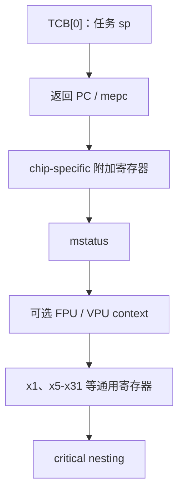

# FreeRTOS 内核源码解读 05：RISC-V 移植与 trap 上下文

RISC-V 没有一个等价于 Cortex-M PendSV 的固定最低优先级切换异常，也不会在 trap 入口自动生成一份 FreeRTOS 可以直接续接的软件上下文。GCC RISC-V port 必须明确规定 context frame 的每个槽位，保存通用寄存器和 CSR，区分同步异常与异步中断，再用同一套恢复宏返回旧任务或调度器刚选中的新任务。

本篇固定使用 **FreeRTOS-Kernel V11.3.0**，commit `9b777ae5c5b8e9e456065a00294d1e5f5f9facf5`，源码目录为 `portable/GCC/RISC-V`。上游通用 port 运行在 Machine mode；具体 SoC 的中断控制器、timer 地址和附加寄存器由平台扩展提供，不在本文绑定。

## context frame 是 port 的核心 ABI

公共内核只要求 TCB 第一个成员保存任务栈顶。RISC-V port 需要自行决定这个栈顶指向怎样的内存布局，并保证三个地方完全一致：

1. `pxPortInitialiseStack` 为从未运行过的任务构造初始 frame；
2. `portcontextSAVE_CONTEXT_INTERNAL` 在 trap 入口保存正在运行的任务；
3. `portcontextRESTORE_CONTEXT` 从当前 TCB 恢复任务。

`portContext.h` 根据 XLEN、RV32E、FPU、VPU 和 chip-specific extension 计算 `portCONTEXT_SIZE` 与各字段偏移。任何条件只在 save 侧打开而 restore 侧关闭，后续所有寄存器槽位都会错位。



上图只表达逻辑组成，实际偏移以 [`portContext.h`](https://github.com/FreeRTOS/FreeRTOS-Kernel/blob/V11.3.0/portable/GCC/RISC-V/portContext.h) 的宏为准。`gp` 和 `tp` 在该通用实现中被假定为常量，不进入普通任务 context；额外实现若需要保存其他寄存器，必须通过 chip-specific extension 宏扩展。

## pxPortInitialiseStack 用 ABI 参数构造首次恢复现场

该 port 的 `pxPortInitialiseStack()` 写在 [`portASM.S`](https://github.com/FreeRTOS/FreeRTOS-Kernel/blob/V11.3.0/portable/GCC/RISC-V/portASM.S#L135-L251)，因为汇编需要直接使用 `portasmADDITIONAL_CONTEXT_SIZE` 和寄存器槽位宏。按照 RISC-V ABI，入口参数分别位于 a0、a1、a2：栈顶、任务函数和 `pvParameters`；返回的新栈顶仍放在 a0。

```asm
pxPortInitialiseStack:
    addi a0, a0, -portWORD_SIZE
    store_x x0, 0(a0)             /* 每任务 critical nesting 初值为 0。 */

#ifndef __riscv_32e
    addi a0, a0, -(22 * portWORD_SIZE)
#else
    addi a0, a0, -(6 * portWORD_SIZE)
#endif
    store_x a2, 0(a0)             /* 首次恢复后进入任务的 a0。 */

    addi a0, a0, -(6 * portWORD_SIZE)
    load_x t0, xTaskReturnAddress
    store_x t0, 0(a0)             /* 任务错误 return 时的去向。 */
```

RV32E 只有精简寄存器集，因此 frame 大小不同。`pvParameters` 被放入未来的 x10/a0 槽，任务函数第一次运行时自然获得应用传入参数。

随后汇编构造初始 `mstatus`：

```asm
csrr t0, mstatus
andi t0, t0, ~0x8                 /* 构造期间清 MIE。 */
addi t1, x0, 0x188
slli t1, t1, 4
or t0, t0, t1                     /* MPIE=1，MPP=Machine mode。 */

#if( configENABLE_FPU == 1 )
    /* 将 FS 初始化为 clean。 */
#endif
#if( configENABLE_VPU == 1 )
    /* 将 VS 初始化为 clean。 */
#endif

addi a0, a0, -portWORD_SIZE
store_x t0, 0(a0)
```

MIE 在构造 frame 时保持关闭，MPIE 则决定 trap 返回后的中断状态。FPU/VPU 打开时，初始状态标为 clean，表示当前任务尚未产生需要保存的脏扩展寄存器。

汇编再为 chip-specific registers 预留 `portasmADDITIONAL_CONTEXT_SIZE` 个槽，最后把 `pxCode` 放入 frame 的返回 PC 位置。返回的 a0 写入 TCB `pxTopOfStack`，从此 frame 布局成为该任务的 portable 状态。

## 首任务不是通过普通 trap restore 启动

[`xPortStartScheduler()`](https://github.com/FreeRTOS/FreeRTOS-Kernel/blob/V11.3.0/portable/GCC/RISC-V/port.c#L160-L198) 先验证 ISR stack 对齐，配置 Tick 来源，再调用 `xPortStartFirstTask()`：

```c
vPortSetupTimerInterrupt();

#if ( configMTIME_BASE_ADDRESS != 0 ) && \
    ( configMTIMECMP_BASE_ADDRESS != 0 )
{
    __asm volatile ( "csrs mie, %0" : : "r" ( 0x880 ) );
}
#endif

xPortStartFirstTask();
return pdFAIL;
```

如果配置给出 mtime/mtimecmp 地址，上游提供默认 machine timer 设置；地址为零时，应用必须实现弱函数 `vPortSetupTimerInterrupt()`，使用平台实际 Tick 来源。这个接口边界比假设所有 RISC-V 都有同一种 CLINT 更可靠。

[`xPortStartFirstTask`](https://github.com/FreeRTOS/FreeRTOS-Kernel/blob/V11.3.0/portable/GCC/RISC-V/portASM.S#L254-L300) 读取 `pxCurrentTCB` 的第一个成员到 sp，取得初始返回地址和 mstatus，恢复通用寄存器，然后直接 `ret` 进入任务函数。它在写回 mstatus 前显式设置 MIE，使首任务开始时允许中断。

首任务路径使用 `ret`，普通 trap 恢复最终使用 `mret`，但两者读取的是同一份初始 context frame。首任务启动成功后 `xPortStartScheduler()` 不应返回。

## trap 入口先完整保存任务，再切到 ISR stack

所有内核和应用 trap 都进入 `freertos_risc_v_trap_handler`。第一条重要操作是 `portcontextSAVE_CONTEXT_INTERNAL`，其定义位于 [`portContext.h`](https://github.com/FreeRTOS/FreeRTOS-Kernel/blob/V11.3.0/portable/GCC/RISC-V/portContext.h#L273-L369)。

```asm
.macro portcontextSAVE_CONTEXT_INTERNAL
    addi sp, sp, -portCONTEXT_SIZE

    store_x x1,  2  * portWORD_SIZE( sp )
    store_x x5,  3  * portWORD_SIZE( sp )
    /* 按配置继续保存 x6-x31。 */

    load_x t0, xCriticalNesting
    store_x t0, portCRITICAL_NESTING_OFFSET * portWORD_SIZE( sp )

    /* FPU/VPU 只在 mstatus 显示 dirty 时保存。 */
    csrr t0, mstatus
    store_x t0, 1 * portWORD_SIZE( sp )

    portasmSAVE_ADDITIONAL_REGISTERS

    load_x t0, pxCurrentTCB
    store_x sp, 0( t0 )             /* 新 sp 写回旧 TCB[0]。 */
.endm
```

与只保存 callee-saved 寄存器的普通函数调用不同，trap 可能打断任意指令，handler 必须保存任务恢复所需的全部通用现场。FPU/VPU 是例外：只有 FS/VS 处于 dirty 时才执行昂贵的扩展保存，并把硬件状态改回 clean。

任务 sp 写入旧 TCB 后，handler 才读取 `mcause/mepc` 并切到独立 ISR stack。这样后续 C 函数、嵌套中断和调度器不继续消耗任务栈，也不会在选择新任务后依赖旧任务的运行栈。

## 同步异常和异步中断对 mepc 的处理不同

[`freertos_risc_v_trap_handler`](https://github.com/FreeRTOS/FreeRTOS-Kernel/blob/V11.3.0/portable/GCC/RISC-V/portASM.S#L351-L405) 用 `mcause` 符号位区分中断和异常：最高位为一的 interrupt 在有符号比较中为负，其他 cause 进入同步异常路径。

```asm
portcontextSAVE_CONTEXT_INTERNAL

csrr a0, mcause
csrr a1, mepc

bge a0, x0, synchronous_exception

asynchronous_interrupt:
    store_x a1, 0( sp )             /* 保留原 mepc。 */
    load_x sp, xISRStackTop
    j handle_interrupt

synchronous_exception:
    addi a1, a1, 4
    store_x a1, 0( sp )             /* 返回到触发指令之后。 */
    load_x sp, xISRStackTop
    j handle_exception
```

异步中断与当前指令没有因果关系，返回后应继续执行原 `mepc`。同步异常由当前指令触发，通用 handler 将返回地址推进 4 字节。FreeRTOS 的 `portYIELD()` 展开为 `ecall`，ecall 是 4 字节同步异常；如果不推进 mepc，恢复后会再次执行同一条 ecall，形成无限 trap。

异常分派把 Machine environment call cause 11 解释为 yield，并调用 `vTaskSwitchContext()`。其他同步异常交给 `freertos_risc_v_application_exception_handler`。因为上游通用入口已经推进返回 PC，平台异常处理代码必须理解这份契约，不能再次重复调整。

## timer interrupt 与应用 interrupt 共用恢复出口

当 port 内建 mtime 支持时，machine timer cause 进入 Tick 路径：

```asm
portUPDATE_MTIMER_COMPARE_REGISTER
call xTaskIncrementTick
beqz a0, processed_source
call vTaskSwitchContext
j processed_source
```

先更新 compare register，避免同一 Tick 源持续 pending；`xTaskIncrementTick()` 返回非零时才调用公共任务选择。其他中断交给 `freertos_risc_v_application_interrupt_handler`，应用负责识别并清除真实硬件源。

无论 timer、ecall 还是应用 handler，最终都到 `processed_source`，执行 `portcontextRESTORE_CONTEXT`。此时 `pxCurrentTCB` 可能仍指向旧任务，也可能已经由 `vTaskSwitchContext()` 更新为新任务。恢复宏不需要知道为什么切换，只读取当前指针：

```asm
.macro portcontextRESTORE_CONTEXT
    load_x t1, pxCurrentTCB
    load_x sp, 0( t1 )

    load_x t0, 0( sp )
    csrw mepc, t0

    portasmRESTORE_ADDITIONAL_REGISTERS

    load_x t3, 1 * portWORD_SIZE( sp )
    csrw mstatus, t3

    /* 按保存时相同条件恢复 VPU、FPU、通用寄存器和 nesting。 */
.endm
```

restore 必须与 save 使用相同的 RV32E、FPU、VPU 和 additional context 配置。特别是 chip-specific 扩展必须同时定义保存、恢复和 frame size；只增加保存代码而未增加 `portCONTEXT_SIZE` 会覆盖 frame 中其他槽位。

最后的 `mret` 使用恢复后的 mepc 和 mstatus 回到任务。同步 yield 从 ecall 下一条指令继续，异步 timer 从被打断位置继续；如果发生任务切换，则这些值来自新 TCB 的 frame。

RISC-V port 的完整边界由这条对称链保证：创建任务时按 context 宏构造 frame；trap 时保存全部必要状态并写回旧 TCB；公共内核只更新 `pxCurrentTCB`；restore 再从当前 TCB 取出 frame。调试首启或切换故障时，最有价值的不是只看某个 CSR，而是同时核对 `portCONTEXT_SIZE`、sp、TCB[0]、mepc、mstatus、mcause 和启用的扩展宏是否来自同一份配置。