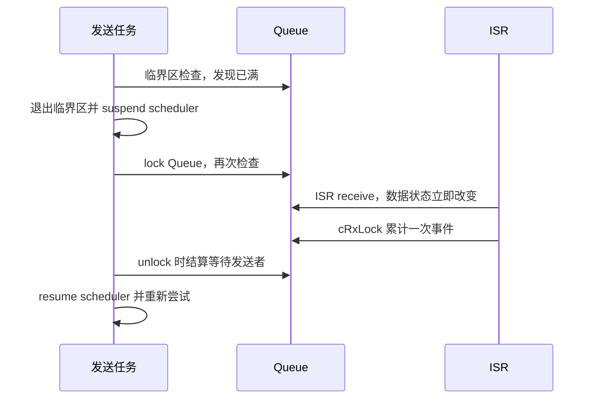

# FreeRTOS 内核源码解读 06：Queue、ISR 路径与 Queue Set

FreeRTOS Queue 不只是环形缓冲。一个 `Queue_t` 同时保存数据区指针、消息计数、等待发送者、等待接收者以及 scheduler suspended 期间的事件累计值。数据复制只是快速路径的一部分；真正困难的是队列在“刚检查完为空”和“准备阻塞”之间可能被另一个任务或 ISR 修改，内核必须重新检查条件并保证唤醒不会丢失。

本篇固定使用 **FreeRTOS-Kernel V11.3.0**，commit `9b777ae5c5b8e9e456065a00294d1e5f5f9facf5`。只讨论存储数据的 Queue、任务/ISR 并发和 Queue Set；信号量与 mutex 的零长度数据语义留给下一篇。

## Queue_t 把数据状态和等待关系放在同一个对象里

[`queue.c`](https://github.com/FreeRTOS/FreeRTOS-Kernel/blob/V11.3.0/queue.c#L56-L140) 中的 `Queue_t` 同时包含环形缓冲状态和两条任务事件链表：

```c
/* 以下中文注释为本文添加，省略可选 trace 字段。 */
typedef struct QueueDefinition
{
    int8_t * pcHead;
    int8_t * pcWriteTo;

    union
    {
        QueuePointers_t xQueue;
        SemaphoreData_t xSemaphore;
    } u;

    List_t xTasksWaitingToSend;
    List_t xTasksWaitingToReceive;

    volatile UBaseType_t uxMessagesWaiting;
    UBaseType_t uxLength;
    UBaseType_t uxItemSize;

    volatile int8_t cRxLock;
    volatile int8_t cTxLock;

    #if ( configUSE_QUEUE_SETS == 1 )
        struct QueueDefinition * pxQueueSetContainer;
    #endif
} Queue_t;
```

`uxLength` 的单位是 item，不是字节；实际存储区大小为 `uxLength * uxItemSize`。Queue 按值复制 item，应用传入的对象地址不会保存在队列里。`pcWriteTo` 指向下一次写入位置，`u.xQueue.pcReadFrom` 指向上一次读取位置，两个指针到达 `pcTail` 后回绕到 `pcHead`。

`uxMessagesWaiting` 同时是数据数量和快速条件判断。发送只需比较它与 `uxLength`，接收只需判断是否大于零。两条事件链表按任务优先级组织：满队列上的发送者进入 `xTasksWaitingToSend`，空队列上的接收者进入 `xTasksWaitingToReceive`。

Queue 的状态因此不能只靠环形指针判断。覆盖写入时消息数可能不变；scheduler suspended 时数据数已经改变，事件链表却还没有同步唤醒；Queue Set 打开时新数据还要向另一个 queue 发布成员句柄。

## 用一个 4 个槽位的 Queue 手算指针移动

假设调用 `xQueueCreate(4, sizeof(uint32_t))`。动态创建路径为 `Queue_t` 加 16 字节数据区准备一块连续内存，再由 `prvInitialiseNewQueue()` 初始化对象。为便于手算，假设数据区 `pcHead = 0x20002000`，那么 4 个槽位起始地址依次为 `0x20002000`、`0x20002004`、`0x20002008`、`0x2000200C`，`pcTail = 0x20002010`。

初始化后 `pcWriteTo == pcHead`，而 `pcReadFrom` 被放到最后一个槽位 `0x2000200C`。这是因为 receive 在复制前先让读指针前进一个 item；第一次接收正好从最后一槽回绕到头部。依次发送 11、22、33 后，内存和指针关系为：

```text
地址          数据
0x20002000    11   <- 下一次 receive 先到这里
0x20002004    22
0x20002008    33
0x2000200C    --

pcWriteTo = 0x2000200C
pcReadFrom = 0x2000200C
uxMessagesWaiting = 3
```

第一次 receive 先把 `pcReadFrom` 增加到 `0x20002010`，发现到达 `pcTail` 后回绕到 `pcHead`，再复制出 11。消息数减为 2，但旧字节 11 不会被清零；Queue 的有效性由消息数和指针决定，不由数据区是否还残留旧值决定。调试时看到槽位里有数据，不能据此判断 Queue 非空。

当发送第四个 item 后，`uxMessagesWaiting == uxLength == 4`。第五次非阻塞发送立即返回 `errQUEUE_FULL`；允许等待时才进入 scheduler suspend、queue lock 和事件链表路径。这个具体例子也说明 Queue 的容量没有像 Stream Buffer 那样故意空出一个字节：满与空由独立的 `uxMessagesWaiting` 区分。

创建阶段还要检查乘法和总大小溢出。`uxQueueLength * uxItemSize` 必须能够用 `size_t` 表示，随后还要加上 `sizeof(Queue_t)`；失败时 API 返回 NULL，不能假设“长度很小所以永远成功”。静态创建则由调用者提供 `StaticQueue_t` 和至少 16 字节且生命周期足够长的数据区。

## 发送快速路径在一个短 critical section 内完成

[`xQueueGenericSend()`](https://github.com/FreeRTOS/FreeRTOS-Kernel/blob/V11.3.0/queue.c#L949-L1164) 使用无限循环统一处理立即成功、等待后重试和 timeout。每一轮先进入短 critical section，重新读取实时队列状态：

```c
for( ; ; )
{
    taskENTER_CRITICAL();
    {
        if( ( pxQueue->uxMessagesWaiting < pxQueue->uxLength ) ||
            ( xCopyPosition == queueOVERWRITE ) )
        {
            xYieldRequired = prvCopyDataToQueue(
                pxQueue, pvItemToQueue, xCopyPosition );

            if( listLIST_IS_EMPTY(
                    &( pxQueue->xTasksWaitingToReceive ) ) == pdFALSE )
            {
                if( xTaskRemoveFromEventList(
                        &( pxQueue->xTasksWaitingToReceive ) ) != pdFALSE )
                {
                    queueYIELD_IF_USING_PREEMPTION();
                }
            }

            taskEXIT_CRITICAL();
            return pdPASS;
        }
    }
    taskEXIT_CRITICAL();

    /* 满队列等待路径在临界区外继续。 */
}
```

`prvCopyDataToQueue()` 在 [`queue.c`](https://github.com/FreeRTOS/FreeRTOS-Kernel/blob/V11.3.0/queue.c#L2393-L2473) 中处理三种位置：send to back 从 `pcWriteTo` 写入并前进；send to front 从 `pcReadFrom` 反方向写入；overwrite 只允许长度为一的 queue，并在覆盖旧 item 时保持消息数不变。

普通 send 成功后，若有任务等待读取，`xTaskRemoveFromEventList()` 解除最高优先级接收者。这个函数可能把任务放入 ready list，也可能在 scheduler suspended 时放入 pending ready；返回值表示是否唤醒了比当前任务更高优先级的任务。

数据复制、消息计数和决定解除哪个等待者都在同一个 critical section 中完成。否则接收者可能在消息尚未完整写入时运行，或两个发送者同时写同一个 `pcWriteTo`。

## 阻塞路径必须离开 critical section 后再次确认条件

队列已满且 `xTicksToWait == 0` 时，send 立即返回 `errQUEUE_FULL`。允许等待时，函数先用 `vTaskInternalSetTimeOutState()` 保存 timeout 基准，然后退出短 critical section。

接下来不能直接把当前任务放进等待链表。退出 critical section 后，其他任务或 ISR 可能已经接收数据，使队列重新有空间。内核先 suspend scheduler、锁住 queue，再更新剩余 timeout 并重新检查是否仍满：

```c
vTaskSuspendAll();
prvLockQueue( pxQueue );

if( xTaskCheckForTimeOut( &xTimeOut, &xTicksToWait ) == pdFALSE )
{
    if( prvIsQueueFull( pxQueue ) != pdFALSE )
    {
        vTaskPlaceOnEventList(
            &( pxQueue->xTasksWaitingToSend ), xTicksToWait );
        prvUnlockQueue( pxQueue );

        if( xTaskResumeAll() == pdFALSE )
        {
            taskYIELD_WITHIN_API();
        }
    }
    else
    {
        prvUnlockQueue( pxQueue );
        ( void ) xTaskResumeAll();
        /* 回到循环重新尝试发送。 */
    }
}
```

scheduler suspended 保证任务链表不会在检查和入链之间切换，但 ISR 仍可修改 queue 数据。queue lock 让 ISR 暂时只累计“发生了多少次发送/接收”，不直接改任务事件链表；`prvUnlockQueue()` 稍后结算这些事件。

任务被唤醒不等于本次 send 一定成功。它可能因为空间出现、timeout 或其他任务竞争而恢复，因此 API 回到外层循环再次检查 `uxMessagesWaiting`。这个循环是条件变量式等待的核心：唤醒只是获得重试机会，不是获得队列槽位的所有权。

## 接收路径与发送对称，但读指针语义不同

[`xQueueReceive()`](https://github.com/FreeRTOS/FreeRTOS-Kernel/blob/V11.3.0/queue.c#L1509-L1656) 在短 critical section 内判断 `uxMessagesWaiting > 0`，调用 `prvCopyDataFromQueue()`，递减消息数，再解除最高优先级等待发送者。

`pcReadFrom` 指向上一次读取位置，所以读取前先增加 `uxItemSize`，必要时从 `pcTail` 回绕到 `pcHead`，然后复制 item。这样初始化时把 `pcReadFrom` 放在存储区最后一个 item 位置，第一次 receive 正好前进到头部。

空队列且允许等待时，receive 使用与 send 相同的两阶段协议：先记录 timeout，退出 critical section；再 suspend scheduler、lock queue、重新确认仍为空，最后把当前任务放入 `xTasksWaitingToReceive`。若数据在窗口中到达，就解锁并回到循环立即读取。

Peek 路径会在复制后恢复原 `pcReadFrom`，因此数据和消息数都不改变，但仍可能解除等待接收者，让其他任务看到同一 item。overwrite、peek 和普通 receive 的区别都集中在指针与消息计数的提交方式，不需要三套完全独立的等待框架。

## FromISR 路径不阻塞，queue lock 负责延迟事件结算

[`xQueueGenericSendFromISR()`](https://github.com/FreeRTOS/FreeRTOS-Kernel/blob/V11.3.0/queue.c#L1167-L1270) 先验证当前中断优先级是否允许调用内核，再使用 port 提供的 ISR mask 保护短操作。它没有 `xTicksToWait`，空间不足只能立即返回 `errQUEUE_FULL`。

数据成功复制后，ISR 读取进入临界区时的 `cTxLock`：

```c
const int8_t cTxLock = pxQueue->cTxLock;

( void ) prvCopyDataToQueue(
    pxQueue, pvItemToQueue, xCopyPosition );

if( cTxLock == queueUNLOCKED )
{
    if( listLIST_IS_EMPTY(
            &( pxQueue->xTasksWaitingToReceive ) ) == pdFALSE )
    {
        if( xTaskRemoveFromEventList(
                &( pxQueue->xTasksWaitingToReceive ) ) != pdFALSE )
        {
            *pxHigherPriorityTaskWoken = pdTRUE;
        }
    }
}
else
{
    prvIncrementQueueTxLock( pxQueue, cTxLock );
}
```

queue 未锁时，ISR 可以直接解除一个等待接收者，但不会在 ISR 内执行普通 task yield；它通过 `pxHigherPriorityTaskWoken` 把决定传给中断退出代码。

queue 已锁时，任务层正处于 scheduler suspended 的复合操作中，ISR 只增加 `cTxLock`。对应地，接收 ISR 增加 `cRxLock`。数据指针和消息数已经更新，延迟的只是事件链表唤醒。

[`prvUnlockQueue()`](https://github.com/FreeRTOS/FreeRTOS-Kernel/blob/V11.3.0/queue.c#L2497-L2635) 必须在 scheduler suspended 时调用。它按 `cTxLock` 次数解除等待接收者，按 `cRxLock` 次数解除等待发送者；被解除任务先进入 pending ready，`xTaskResumeAll()` 再搬到真正 ready list。计数器让多次 ISR 操作在 unlock 时得到对应数量的唤醒机会，而不是压缩成一个布尔事件。

## Queue Set 是一条存放成员句柄的 Queue

[`xQueueCreateSet()`](https://github.com/FreeRTOS/FreeRTOS-Kernel/blob/V11.3.0/queue.c#L3177-L3192) 调用 `xQueueGenericCreate()`，item size 为 `sizeof(Queue_t *)`。因此 Queue Set 本身就是一条 queue，里面存放“哪个成员产生了可消费事件”的句柄。

[`xQueueAddToSet()`](https://github.com/FreeRTOS/FreeRTOS-Kernel/blob/V11.3.0/queue.c#L3215-L3250) 将成员加入 set 时必须满足两个条件：没有属于其他 set，且当前 `uxMessagesWaiting == 0`。非空成员已经产生的旧事件无法补写到 set，强行加入会使成员状态与 set 中句柄数量不一致。移除成员同样要求成员为空。

成员 queue 增加一个 item 时，`prvNotifyQueueSetContainer()` 把成员自身的指针复制进 set queue：

```c
Queue_t * pxQueueSetContainer = pxQueue->pxQueueSetContainer;

xReturn = prvCopyDataToQueue(
    pxQueueSetContainer, &pxQueue, queueSEND_TO_BACK );
```

固定实现见 [`queue.c`](https://github.com/FreeRTOS/FreeRTOS-Kernel/blob/V11.3.0/queue.c#L3331-L3365)。Set queue 的容量必须能够容纳所有成员可能同时产生的未消费事件，通常至少是成员 queue 长度和 semaphore 最大计数之和。

`xQueueSelectFromSet()` 只是从 set queue 接收一个成员句柄：

```c
( void ) xQueueReceive(
    ( QueueHandle_t ) xQueueSet, &xReturn, xTicksToWait );
return xReturn;
```

返回句柄不等于返回真实数据。调用者还必须对该成员执行 `xQueueReceive()` 或 semaphore take，消费与通知对应的 item/token。Queue Set 解决的是“多个对象里谁可读”，不是把多个数据源合并成一条共享 payload queue。

把“检查队列已满”和“任务真正进入等待链表”画开，就能看到 queue lock 的必要性：



如果没有“锁后重查”，ISR 可能恰好在第一次检查之后腾出空间，任务却仍把自己挂进等待链表并睡到 timeout；如果锁 Queue 时完全禁止 ISR 修改数据，又会把中断延迟拉长。FreeRTOS 的折中是让 ISR 继续提交数据指针和计数，只把任务链表操作累计到 `cTxLock/cRxLock`，由 `prvUnlockQueue()` 在 scheduler suspended 的受控窗口结算。

Queue Set 的容量也可以按事件数量手算。一个长度 4 的数据 Queue 和一个最大计数 3 的 counting semaphore 同时加入 set，最坏情况下会产生 4 + 3 = 7 个尚未消费的成员通知，所以 set 长度至少为 7。`xQueueSelectFromSet()` 取走一个成员句柄后，调用者必须立刻从该成员接收数据或 take token；只取句柄不消费成员，会让 set 通知和成员实际可消费数量逐渐失配。

调试 Queue 并发问题时，先记录 `uxMessagesWaiting`、`pcWriteTo`、`u.xQueue.pcReadFrom` 和两条等待链表，再看 `cTxLock/cRxLock`。若数据数已经变化但任务没 ready，问题通常在 lock 结算或 pending-ready；若 `pxHigherPriorityTaskWoken` 已经为真但任务仍未运行，则继续检查 ISR 尾部是否执行 port yield。不要把这三类问题都归结为“Queue 丢数据”。

Queue 的完整并发协议由三层组成：短 critical section 原子提交数据状态，scheduler suspended 窗口安全修改任务等待关系，queue lock 把 ISR 期间无法立即处理的唤醒累计到 unlock。只看环形缓冲代码无法解释为什么不丢唤醒；只看事件链表又无法解释为什么任务恢复后必须重试条件。两部分必须放在同一条 send/receive 循环里理解。
