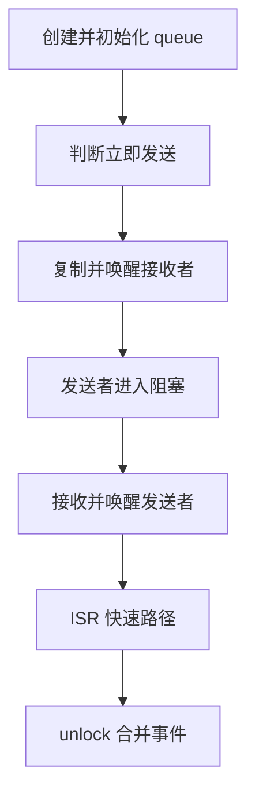
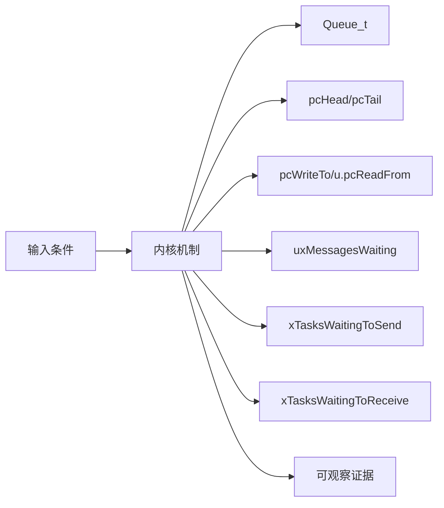
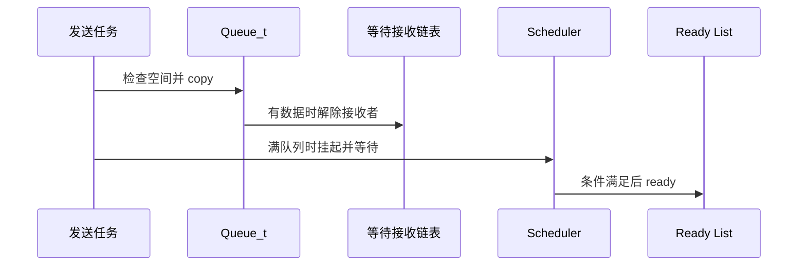
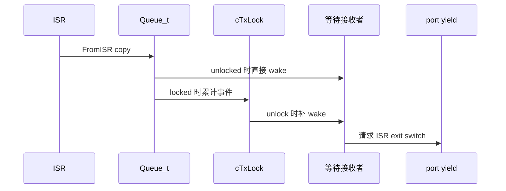
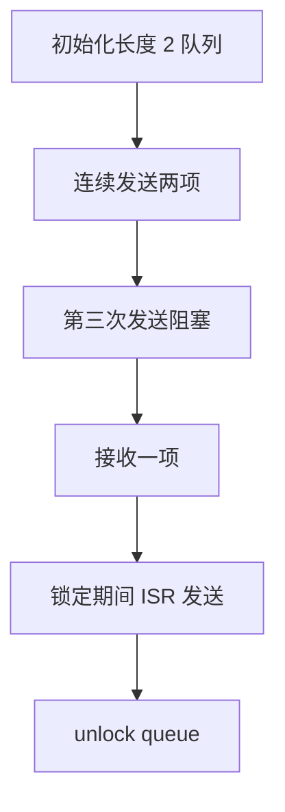
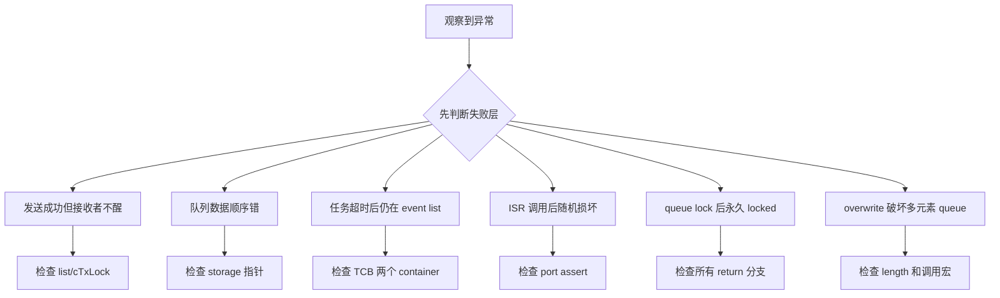

FreeRTOS 队列同时管理字节存储和任务调度：复制一个元素可能解除接收者阻塞，也可能只在 lock counter 中留下待处理事件。

本篇只回答一个核心问题：**Queue_t 如何在任务与 ISR 并发访问时保持数据、等待链表和切换请求一致？**

分析范围固定为 **FreeRTOS-Kernel V11.3.0**。所有函数、字段、宏和条件编译都以该 tag 为准。

本篇先冻结 Queue_t 不变量，再沿 send/receive 的立即成功和阻塞路径展开，最后解释 ISR 与 queue locked 时为什么使用 cTxLock/cRxLock。

## 1. Queue 为什么既是容器也是等待点

分析标准 queue 主线和 Queue Set 通知交接，不展开 semaphore/mutex 的特殊字段语义。



## 2. Queue_t、存储区与两条事件链表

Queue_t 既是环形存储描述符，也是两个 event list 的拥有者；uxMessagesWaiting 把数据平面与调度平面连接起来。



| 对象 | 角色 | 必须保持的不变量 | 观察方法 | 常见误读 |
|---|---|---|---|---|
| Queue_t | 保存存储区、位置、元素计数、长度和等待链表。 | 0 <= messages <= length。 | 检查计数与指针。 | 只把它当 ring buffer。 |
| pcHead/pcTail | 定义存储区边界。 | tail 是 head + length*itemSize。 | 核对地址跨度。 | 把 tail 当最后一个元素。 |
| pcWriteTo/u.pcReadFrom | 保存下一写位置与上次读位置。 | 每次成功操作按 item size 回绕。 | 记录地址序列。 | 认为 read 指针直接指下一项。 |
| uxMessagesWaiting | 记录当前元素数。 | 与成功 copy 数量同步且不越界。 | 每次操作前后读取。 | 使用等待任务数代替元素数。 |
| xTasksWaitingToSend | 满队列上的发送等待者。 | 按任务优先级排序。 | 检查 event item owner。 | 按 FIFO 唤醒发送者。 |
| xTasksWaitingToReceive | 空队列上的接收等待者。 | 数据到达时优先解除最高优先级等待者。 | 检查 list head。 | 认为写数据不会触发调度。 |
| cTxLock/cRxLock | 记录 queue lock 期间发生的发送/接收次数。 | unlock 后将计数折算为有限次唤醒。 | 记录 lock 状态与计数。 | 把 lock 当数据互斥锁。 |

## 3. 调用链一：任务发送从快速成功到满队列阻塞

xQueueGenericSend 先在 critical section 尝试 copy；只有确定不能立即完成且 timeout 未到，才挂起 scheduler 并进入 event list。



### 调用链一：xQueueGenericSend -> prvCopyDataToQueue / vTaskPlaceOnEventList -> prvUnlockQueue -> xTaskResumeAll

xQueueGenericSend 进入短临界区后先检查 uxMessagesWaiting 和队列长度。有空间时，prvCopyDataToQueue 按发送位置更新写指针、复制数据并增加消息数；若接收等待链表非空，最高优先级等待者会被移出事件链表并进入 ready list，返回值再决定是否请求 yield。

队列已满且允许等待时，函数不会一直占着临界区。它记录 TimeOut_t，挂起 scheduler，锁住 queue 后离开短临界区，再次确认队列仍满，才用 vTaskPlaceOnEventList 把当前任务同时挂到发送等待链表和 delayed list。事件和 timeout 因而竞争同一个任务状态，但两个 ListItem 分别表达事件关系与时间关系。

生产者、接收者或 Tick 改变条件后，prvUnlockQueue 根据 cTxLock/cRxLock 补做锁定期间积累的唤醒，xTaskResumeAll 再处理 pending ready 和 pended ticks。任务恢复后必须重新检查队列条件，不能假设被唤醒就一定发送成功。

### 源码片段：Queue_t 同时拥有数据和等待链表

> 源码位置：`queue.c` · `struct QueueDefinition` · `V11.3.0`
> 配置条件：queue 核心始终编译
> 固定链接：[查看上游源码](https://github.com/FreeRTOS/FreeRTOS-Kernel/blob/V11.3.0/queue.c)

```c
typedef struct QueueDefinition
{
    int8_t * pcHead;
    int8_t * pcWriteTo;
    UBaseType_t uxMessagesWaiting;
    UBaseType_t uxLength;
    UBaseType_t uxItemSize;
    List_t xTasksWaitingToSend;
    List_t xTasksWaitingToReceive;
    volatile int8_t cRxLock;
    volatile int8_t cTxLock;
} Queue_t;
```

- 真实结构还包含 union、trace 和 queue set 条件字段。
- 两条等待链表按任务优先级排序。
- messages 将数据数量与 wake 条件连接。
- lock counter 是调度事件账本。

> **关键约束**：元素计数、读写位置和等待任务唤醒必须描述同一个 queue 状态。 **验证重点**：同时记录 messages、positions、两个 list length 和 lock。

### 源码片段：发送快速路径在 copy 后解除接收者

> 源码位置：`queue.c` · `xQueueGenericSend()` · `V11.3.0`
> 配置条件：任务上下文，queue 非 NULL
> 固定链接：[查看上游源码](https://github.com/FreeRTOS/FreeRTOS-Kernel/blob/V11.3.0/queue.c)

```c
if( ( pxQueue->uxMessagesWaiting < pxQueue->uxLength ) ||
    ( xCopyPosition == queueOVERWRITE ) )
{
    xYieldRequired = prvCopyDataToQueue( pxQueue, pvItemToQueue, xCopyPosition );
    if( listLIST_IS_EMPTY( &( pxQueue->xTasksWaitingToReceive ) ) == pdFALSE )
    {
        xTaskRemoveFromEventList( &( pxQueue->xTasksWaitingToReceive ) );
    }
}
```

- 空间判断和 copy 在同一 critical 快照中。
- overwrite 只适用于规定场景。
- 接收等待者只在数据已经可见后解除。
- helper 返回值还可能处理 mutex 特例。

> **关键约束**：等待接收者 ready 前，queue 中必须已经存在可接收元素。 **验证重点**：trace send、messages 和 event list removal 顺序。

## 4. 调用链二：ISR 发送与 queue lock 延迟唤醒

FromISR 不能挂起 scheduler 或阻塞；如果 queue 已被任务路径 lock，它只增加 cTxLock，unlock 时再处理等待接收者。



### 调用链二：xQueueGenericSendFromISR -> copy -> direct wake or cTxLock++ -> prvUnlockQueue -> pending ready

xQueueGenericSendFromISR 先验证当前中断优先级是否允许调用内核，再设置 port 提供的 ISR mask。它只执行有界操作：检查空间、复制数据、更新消息数，然后尽快恢复 mask；FromISR 路径没有 delayed list，也绝不等待队列变空。

如果 queue 没有被任务路径锁住，ISR 可以直接解除接收等待链表中的任务，并通过 pxHigherPriorityTaskWoken 把抢占决定交给中断退出代码。若 cTxLock 表示 scheduler suspended 期间的锁定窗口，ISR 只增加 lock counter，不在此时遍历或修改任务事件链表。

任务稍后执行 prvUnlockQueue 时，会按 counter 次数补偿这些发送事件，逐个解除允许数量的等待者并清零 lock。验证 ISR 路径要同时观察消息数、lock counter、等待链表长度和 wake flag，才能证明事件没有因锁定窗口而丢失。

### 源码片段：接收成功后为发送者释放空间

> 源码位置：`queue.c` · `xQueueReceive()` · `V11.3.0`
> 配置条件：任务上下文，非 peek 路径
> 固定链接：[查看上游源码](https://github.com/FreeRTOS/FreeRTOS-Kernel/blob/V11.3.0/queue.c)

```c
if( uxMessagesWaiting > ( UBaseType_t ) 0 )
{
    prvCopyDataFromQueue( pxQueue, pvBuffer );
    pxQueue->uxMessagesWaiting = uxMessagesWaiting - 1U;
    if( listLIST_IS_EMPTY( &( pxQueue->xTasksWaitingToSend ) ) == pdFALSE )
    {
        xTaskRemoveFromEventList( &( pxQueue->xTasksWaitingToSend ) );
    }
}
```

- copy helper 推进 read position。
- messages 减少后才形成空间。
- 最高优先级发送等待者可能 ready。
- peek 有不同的计数和指针规则。

> **关键约束**：发送者解除阻塞前 queue 必须真实拥有空间。 **验证重点**：记录读值、messages 和 waiting send head。

### 源码片段：unlock 将 lock counter 转换为有限次唤醒

> 源码位置：`queue.c` · `prvUnlockQueue()` · `V11.3.0`
> 配置条件：scheduler suspended 且 queue 已 lock
> 固定链接：[查看上游源码](https://github.com/FreeRTOS/FreeRTOS-Kernel/blob/V11.3.0/queue.c)

```c
int8_t cTxLock = pxQueue->cTxLock;
while( cTxLock > queueLOCKED_UNMODIFIED )
{
    if( listLIST_IS_EMPTY( &( pxQueue->xTasksWaitingToReceive ) ) == pdFALSE )
    {
        xTaskRemoveFromEventList( &( pxQueue->xTasksWaitingToReceive ) );
    }
    --cTxLock;
}
pxQueue->cTxLock = queueUNLOCKED;
```

- 每次 locked send 最多对应一次接收者唤醒机会。
- 等待链表为空时无需继续无意义处理。
- cRxLock 对等待发送者做对称处理。
- 最终必须恢复 UNLOCKED。

> **关键约束**：unlock 后 lock counter 不携带未处理事件。 **验证重点**：记录进入/退出 counter 与 event list 长度。

## 5. 构造满队列、超时与 ISR 发送验证两条路径



### 配置矩阵

| 配置或条件 | 取值 A | 取值 B | 源码影响 | 验证重点 |
|---|---|---|---|---|
| configSUPPORT_STATIC_ALLOCATION | 0 | 1 | 决定静态 queue storage 路径。 | 比较内存归属。 |
| configSUPPORT_DYNAMIC_ALLOCATION | 0 | 1 | 决定 xQueueGenericCreate 与 heap。 | 检查分配失败。 |
| configUSE_QUEUE_SETS | 0 | 1 | 加入 pxQueueSetContainer 和转发分支。 | 观察 set event。 |
| configUSE_PREEMPTION | 0 | 1 | 影响解除高优先级任务后的 yield。 | 记录返回标志。 |
| INCLUDE_xTaskGetSchedulerState | 0 | 1 | 影响部分状态查询但不改变 queue 不变量。 | 核对 API 可见性。 |
| configUSE_TRACE_FACILITY | 0 | 1 | 增加 queue number/type 观测字段。 | 比较结构布局。 |

### 实验步骤

1. **初始化长度 2 队列。** 记录所有字段，并保存 head/tail/read/write/messages；只有空队列不变量成立，这一步才算完成。
2. **连续发送两项。** 记录每次指针。重点核对 storage 与 messages，结果应满足“写位置正确回绕”。
3. **第三次发送阻塞。** 设置 timeout，把状态/event list container 保存为证据；判断依据是任务进入双链表。
4. **接收一项。** 记录 wake；观察 messages、waiting send。若发送者 ready，即可进入下一步。
5. **锁定期间 ISR 发送。** 在 queue lock 窗口触发，随后比较 cTxLock；预期是不直接改等待链表。
6. **unlock queue。** 恢复 scheduler。最后用 counter 和 pending ready 确认事件全部结算。

### 证据表

| 证据 | 获取方法 | 通过标准 | 失败说明 |
|---|---|---|---|
| 数据计数 | 每次 copy 前后读取 messages | 始终在 0..length | 越界表示 copy/overwrite 错 |
| 指针回绕 | 记录 write/read 地址 | 在 storage 边界回绕 | 越界会破坏 queue 内存 |
| 等待链表 | 读取两个 event list | 满时 send wait、空时 receive wait | 放反链表会永不唤醒 |
| 双节点归属 | 检查等待任务 TCB | 状态 item 在 delayed，event item 在 queue | 缺一会失去 timeout 或 event |
| ISR wake flag | 记录 higherPriorityTaskWoken | 仅唤醒更高任务时置位 | 错误值导致延迟或多余切换 |
| lock counter | ISR 与 unlock trace | 变化次数被有限结算 | 遗留非 unlocked 表示事件丢失 |

## 6. 从消息计数、事件链表和 lock counter 定位故障

先验证对象成员和链表归属，再检查锁、配置分支和调度请求。



| 现象 | 根因 | 第一检查点 | 应保存的证据 | 修复原则 |
|---|---|---|---|---|
| 发送成功但接收者不醒 | waiting receive 未移除或 queue locked 未结算 | 检查 list/cTxLock | messages、counter、head owner | 修复 wake/unlock 路径 |
| 队列数据顺序错 | read/write 回绕或 send position 错 | 检查 storage 指针 | 每次地址和值 | 修复 copy helper 参数 |
| 任务超时后仍在 event list | 双链表移除不完整 | 检查 TCB 两个 container | timeout 前后 list | 使用内核 event list 原语 |
| ISR 调用后随机损坏 | ISR priority 不合法或用了普通 API | 检查 port assert | IRQ priority 与调用栈 | 使用 FromISR 并修正优先级 |
| queue lock 后永久 locked | 异常退出漏 prvUnlockQueue | 检查所有 return 分支 | lock trace 和 scheduler depth | 保证成对 lock/unlock |
| overwrite 破坏多元素 queue | 错误使用 queueOVERWRITE | 检查 length 和调用宏 | copy position 与 length | 只在允许的一元素语义使用 |
| higherPriorityTaskWoken 总为 false | 未传指针或等待者优先级不高 | 检查 event head | current/woken priority | 正确传递并在 ISR exit yield |

## 7. 源码索引、阶段验收与面试表达

### 源码索引

| 文件 | 结构体 / 函数 / 宏 | 作用 |
|---|---|---|
| [queue.c](https://github.com/FreeRTOS/FreeRTOS-Kernel/blob/V11.3.0/queue.c) | Queue_t、xQueueGenericCreate | 对象与存储初始化 |
| [queue.c](https://github.com/FreeRTOS/FreeRTOS-Kernel/blob/V11.3.0/queue.c) | xQueueGenericSend、xQueueReceive | 任务快慢路径 |
| [queue.c](https://github.com/FreeRTOS/FreeRTOS-Kernel/blob/V11.3.0/queue.c) | xQueueGenericSendFromISR | ISR 发送 |
| [queue.c](https://github.com/FreeRTOS/FreeRTOS-Kernel/blob/V11.3.0/queue.c) | prvLockQueue、prvUnlockQueue | 延迟事件结算 |
| [tasks.c](https://github.com/FreeRTOS/FreeRTOS-Kernel/blob/V11.3.0/tasks.c) | vTaskPlaceOnEventList、xTaskRemoveFromEventList | 任务阻塞唤醒 |

### 阶段验收

1. 能画出 Queue_t 数据与等待字段。
2. 能推演读写指针回绕。
3. 能跟踪 send 快速路径。
4. 能解释满队列阻塞的双链表。
5. 能跟踪 receive 唤醒发送者。
6. 能区分普通与 FromISR API。
7. 能解释 cTxLock/cRxLock。
8. 能用证据定位 queue 状态损坏。

### 面试表达

FreeRTOS queue 不只是环形缓冲，它还拥有发送和接收等待链表；数据变化后可能直接使高优先级任务 ready。

任务路径阻塞时先 suspend scheduler 并 lock queue，ISR 在这个窗口只累计 cTxLock/cRxLock，unlock 再统一处理 event list。

FromISR API 不允许等待，它通过 pxHigherPriorityTaskWoken 把是否切换的决定传给 port 的中断退出路径。

### 参考资料

- [FreeRTOS-Kernel V11.3.0](https://github.com/FreeRTOS/FreeRTOS-Kernel/tree/V11.3.0)
- [FreeRTOS Kernel Book](https://github.com/FreeRTOS/FreeRTOS-Kernel-Book)

> 🏷️ FreeRTOS / Queue_t / Queue / ISR / cTxLock / cRxLock
