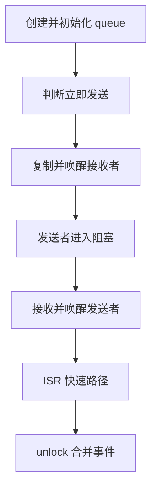
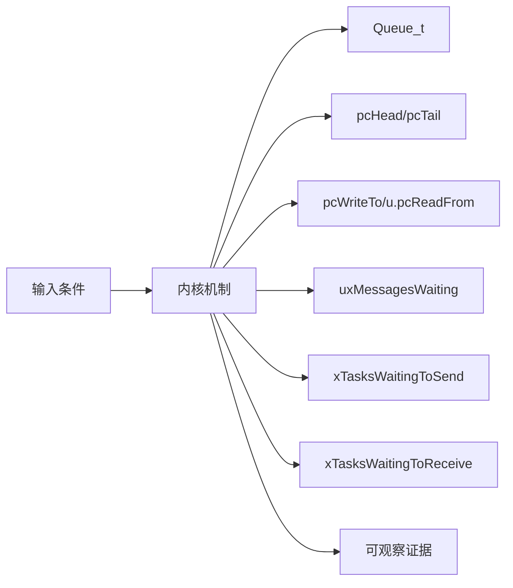
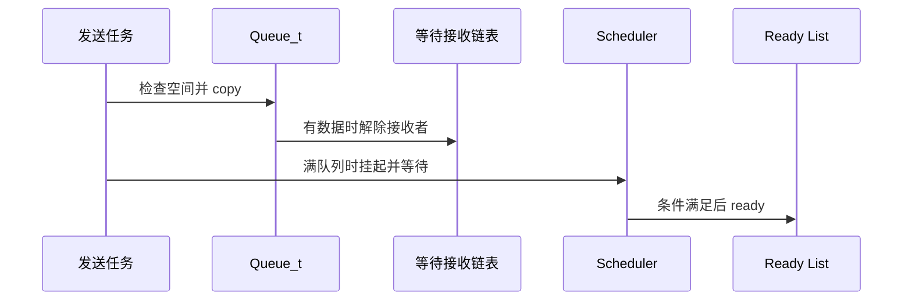
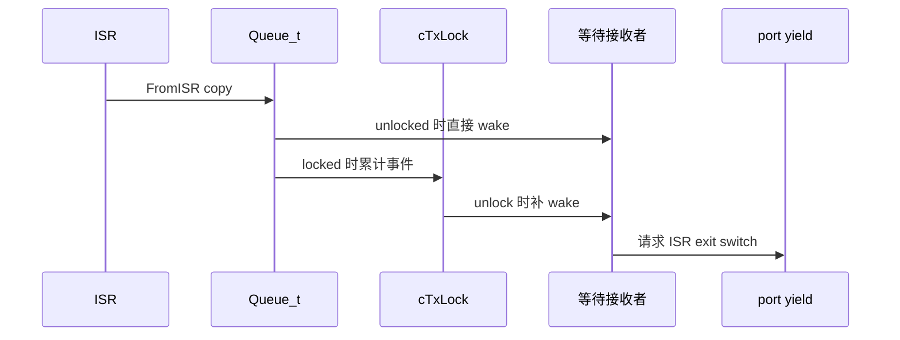
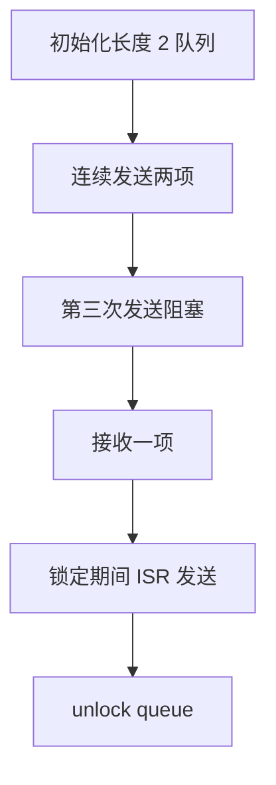
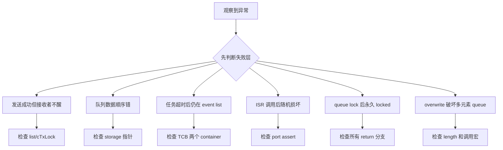

FreeRTOS 队列同时管理字节存储和任务调度：复制一个元素可能解除接收者阻塞，也可能只在 lock counter 中留下待处理事件。

本篇只回答一个核心问题：**Queue_t 如何在任务与 ISR 并发访问时保持数据、等待链表和切换请求一致？**

分析范围固定为 **FreeRTOS-Kernel V11.3.0**。所有函数、字段、宏和条件编译都以该 tag 为准。

本篇先冻结 Queue_t 不变量，再沿 send/receive 的立即成功和阻塞路径展开，最后解释 ISR 与 queue locked 时为什么使用 cTxLock/cRxLock。

## 1. 问题边界、前置条件与验收证据

分析标准 queue 主线和 Queue Set 通知交接，不展开 semaphore/mutex 的特殊字段语义。

读者已经会使用基本任务 API，但不能把 API 行为替代为源码证明。

阅读源码前先写清输入状态、允许的状态变化和输出证据。只看函数名或最终返回值，无法判断链表、锁和调度点是否正确。



| 顺序 | 阅读动作 | 入口条件 | 状态变化 | 验收证据 |
|---:|---|---|---|---|
| 1 | 创建并初始化 queue | length/item size 合法。 | 空队列不变量成立。 | 字段快照。 |
| 2 | 判断立即发送 | 任务调用 send。 | 选择快速路径或等待路径。 | messages/space。 |
| 3 | 复制并唤醒接收者 | 存在空间。 | 可能移除 waiting receive。 | 数据与 list trace。 |
| 4 | 发送者进入阻塞 | 队列满且允许等待。 | 任务同时进入 delayed list。 | 两个 list container。 |
| 5 | 接收并唤醒发送者 | 队列非空。 | 空间和 ready 状态同步。 | 读值和 wake task。 |
| 6 | ISR 快速路径 | 合法 ISR 调 FromISR。 | 直接唤醒或增加 lock counter。 | higherPriorityTaskWoken。 |
| 7 | unlock 合并事件 | scheduler 即将恢复。 | lock 回到 UNLOCKED。 | 计数清零与 pending ready。 |

### 1. 创建并初始化 queue

入口条件：length/item size 合法。

执行动作：分配 Queue_t+storage，初始化 lists 和 lock。

核心状态变化：空队列不变量成立。

离开这一步时必须成立：句柄可公开。

可观察证据：字段快照。

停止条件：size 乘法溢出时停止。

### 2. 判断立即发送

入口条件：任务调用 send。

执行动作：检查空间或 overwrite 条件。

核心状态变化：选择快速路径或等待路径。

离开这一步时必须成立：critical section 内判断。

可观察证据：messages/space。

停止条件：条件与 copy 分离时停止。

### 3. 复制并唤醒接收者

入口条件：存在空间。

执行动作：prvCopyDataToQueue 更新指针和计数。

核心状态变化：可能移除 waiting receive。

离开这一步时必须成立：必要时 yield。

可观察证据：数据与 list trace。

停止条件：计数未同步时停止。

### 4. 发送者进入阻塞

入口条件：队列满且允许等待。

执行动作：挂起 scheduler、lock queue、放入 send event list。

核心状态变化：任务同时进入 delayed list。

离开这一步时必须成立：unlock 后恢复 scheduler。

可观察证据：两个 list container。

停止条件：未重检条件时停止。

### 5. 接收并唤醒发送者

入口条件：队列非空。

执行动作：copy out、减少计数、解除 waiting send。

核心状态变化：空间和 ready 状态同步。

离开这一步时必须成立：critical section。

可观察证据：读值和 wake task。

停止条件：peek 误减计数时停止。

### 6. ISR 快速路径

入口条件：合法 ISR 调 FromISR。

执行动作：短临界区 copy 数据。

核心状态变化：直接唤醒或增加 lock counter。

离开这一步时必须成立：不允许阻塞。

可观察证据：higherPriorityTaskWoken。

停止条件：普通 API 在 ISR 时停止。

### 7. unlock 合并事件

入口条件：scheduler 即将恢复。

执行动作：按 cTx/cRx 次数处理等待链表。

核心状态变化：lock 回到 UNLOCKED。

离开这一步时必须成立：不能无限循环超过等待任务数。

可观察证据：计数清零与 pending ready。

停止条件：漏处理 counter 时停止。

## 2. 核心数据结构、所有权与不变量

Queue_t 既是环形存储描述符，也是两个 event list 的拥有者；uxMessagesWaiting 把数据平面与调度平面连接起来。

这里不把字段当作词汇表，而是解释字段由谁修改、在哪个临界区修改、它和哪个链表或对象保持一致。



| 对象 | 角色 | 必须保持的不变量 | 观察方法 | 常见误读 |
|---|---|---|---|---|
| Queue_t | 保存存储区、位置、元素计数、长度和等待链表。 | 0 <= messages <= length。 | 检查计数与指针。 | 只把它当 ring buffer。 |
| pcHead/pcTail | 定义存储区边界。 | tail 是 head + length*itemSize。 | 核对地址跨度。 | 把 tail 当最后一个元素。 |
| pcWriteTo/u.pcReadFrom | 保存下一写位置与上次读位置。 | 每次成功操作按 item size 回绕。 | 记录地址序列。 | 认为 read 指针直接指下一项。 |
| uxMessagesWaiting | 记录当前元素数。 | 与成功 copy 数量同步且不越界。 | 每次操作前后读取。 | 使用等待任务数代替元素数。 |
| xTasksWaitingToSend | 满队列上的发送等待者。 | 按任务优先级排序。 | 检查 event item owner。 | 按 FIFO 唤醒发送者。 |
| xTasksWaitingToReceive | 空队列上的接收等待者。 | 数据到达时优先解除最高优先级等待者。 | 检查 list head。 | 认为写数据不会触发调度。 |
| cTxLock/cRxLock | 记录 queue lock 期间发生的发送/接收次数。 | unlock 后将计数折算为有限次唤醒。 | 记录 lock 状态与计数。 | 把 lock 当数据互斥锁。 |

### Queue_t

角色：保存存储区、位置、元素计数、长度和等待链表。

所有权：queue.c。

不变量：0 <= messages <= length。

变化时机：send/receive/reset。

观察方法：检查计数与指针。

常见误读：只把它当 ring buffer。

### pcHead/pcTail

角色：定义存储区边界。

所有权：Queue_t。

不变量：tail 是 head + length*itemSize。

变化时机：创建/reset。

观察方法：核对地址跨度。

常见误读：把 tail 当最后一个元素。

### pcWriteTo/u.pcReadFrom

角色：保存下一写位置与上次读位置。

所有权：Queue_t。

不变量：每次成功操作按 item size 回绕。

变化时机：copy helper。

观察方法：记录地址序列。

常见误读：认为 read 指针直接指下一项。

### uxMessagesWaiting

角色：记录当前元素数。

所有权：Queue_t。

不变量：与成功 copy 数量同步且不越界。

变化时机：send/receive/overwrite。

观察方法：每次操作前后读取。

常见误读：使用等待任务数代替元素数。

### xTasksWaitingToSend

角色：满队列上的发送等待者。

所有权：Queue_t/event list。

不变量：按任务优先级排序。

变化时机：send block/unblock。

观察方法：检查 event item owner。

常见误读：按 FIFO 唤醒发送者。

### xTasksWaitingToReceive

角色：空队列上的接收等待者。

所有权：Queue_t/event list。

不变量：数据到达时优先解除最高优先级等待者。

变化时机：send/ISR send。

观察方法：检查 list head。

常见误读：认为写数据不会触发调度。

### cTxLock/cRxLock

角色：记录 queue lock 期间发生的发送/接收次数。

所有权：Queue_t。

不变量：unlock 后将计数折算为有限次唤醒。

变化时机：scheduler suspend 阻塞窗口。

观察方法：记录 lock 状态与计数。

常见误读：把 lock 当数据互斥锁。

## 3. 调用链一：任务发送从快速成功到满队列阻塞

xQueueGenericSend 先在 critical section 尝试 copy；只有确定不能立即完成且 timeout 未到，才挂起 scheduler 并进入 event list。

调用链中的每一跳都要区分普通函数调用、宏展开、临界区边界和可能触发调度的 port hook。



### 调用链一：xQueueGenericSend -> prvCopyDataToQueue / vTaskPlaceOnEventList -> prvUnlockQueue -> xTaskResumeAll

#### 链路步骤 1：进入 critical

进入时：句柄和参数已校验。

本步读取：messages/length/copy position。

本步修改：无或 queue 字段。

并发边界：taskENTER_CRITICAL。

返回或转交：获得一致快照。

证据：trace 入口。

#### 链路步骤 2：执行快速 copy

进入时：有空间或 overwrite。

本步读取：写位置和 item。

本步修改：storage、messages。

并发边界：同一 critical。

返回或转交：copy 成功。

证据：指针/计数。

#### 链路步骤 3：检查等待接收者

进入时：copy 已完成。

本步读取：receive event list head。

本步修改：任务移出 event list。

并发边界：task list 原语。

返回或转交：返回是否需 yield。

证据：owner/priority。

#### 链路步骤 4：准备阻塞

进入时：无空间且 ticks>0。

本步读取：timeout state。

本步修改：scheduler suspend、queue lock。

并发边界：离开短 critical。

返回或转交：可安全操作双 list。

证据：suspend depth。

#### 链路步骤 5：放入等待链表

进入时：再次确认仍满。

本步读取：send event list 和 delayed list。

本步修改：两个 TCB item container。

并发边界：scheduler suspended。

返回或转交：当前任务不可运行。

证据：container 快照。

#### 链路步骤 6：unlock/resume

进入时：事件或 timeout 到达。

本步读取：lock counters/pended ticks。

本步修改：等待者搬回 ready。

并发边界：xTaskResumeAll。

返回或转交：API 重试或超时返回。

证据：resume trace。

### 源码片段：Queue_t 同时拥有数据和等待链表

> 源码位置：`queue.c` · `struct QueueDefinition` · `V11.3.0`
> 配置条件：queue 核心始终编译
> 固定链接：[查看上游源码](https://github.com/FreeRTOS/FreeRTOS-Kernel/blob/V11.3.0/queue.c)

```c
typedef struct QueueDefinition
{
    int8_t * pcHead;
    int8_t * pcWriteTo;
    UBaseType_t uxMessagesWaiting;
    UBaseType_t uxLength;
    UBaseType_t uxItemSize;
    List_t xTasksWaitingToSend;
    List_t xTasksWaitingToReceive;
    volatile int8_t cRxLock;
    volatile int8_t cTxLock;
} Queue_t;
```

这段摘录只保留当前机制需要的语句；省略的参数检查、trace hook 或条件分支必须回到固定链接核对。

解读 1：真实结构还包含 union、trace 和 queue set 条件字段。

解读 2：两条等待链表按任务优先级排序。

解读 3：messages 将数据数量与 wake 条件连接。

解读 4：lock counter 是调度事件账本。

不变量：元素计数、读写位置和等待任务唤醒必须描述同一个 queue 状态。

观察点：同时记录 messages、positions、两个 list length 和 lock。

### 源码片段：发送快速路径在 copy 后解除接收者

> 源码位置：`queue.c` · `xQueueGenericSend()` · `V11.3.0`
> 配置条件：任务上下文，queue 非 NULL
> 固定链接：[查看上游源码](https://github.com/FreeRTOS/FreeRTOS-Kernel/blob/V11.3.0/queue.c)

```c
if( ( pxQueue->uxMessagesWaiting < pxQueue->uxLength ) ||
    ( xCopyPosition == queueOVERWRITE ) )
{
    xYieldRequired = prvCopyDataToQueue( pxQueue, pvItemToQueue, xCopyPosition );
    if( listLIST_IS_EMPTY( &( pxQueue->xTasksWaitingToReceive ) ) == pdFALSE )
    {
        xTaskRemoveFromEventList( &( pxQueue->xTasksWaitingToReceive ) );
    }
}
```

这段摘录只保留当前机制需要的语句；省略的参数检查、trace hook 或条件分支必须回到固定链接核对。

解读 1：空间判断和 copy 在同一 critical 快照中。

解读 2：overwrite 只适用于规定场景。

解读 3：接收等待者只在数据已经可见后解除。

解读 4：helper 返回值还可能处理 mutex 特例。

不变量：等待接收者 ready 前，queue 中必须已经存在可接收元素。

观察点：trace send、messages 和 event list removal 顺序。

## 4. 调用链二：ISR 发送与 queue lock 延迟唤醒

FromISR 不能挂起 scheduler 或阻塞；如果 queue 已被任务路径 lock，它只增加 cTxLock，unlock 时再处理等待接收者。

第二条链用于验证同一对象在另一条执行路径上的行为，重点检查它是否复用相同不变量，还是进入 ISR、daemon 或 portable 层的特殊规则。



### 调用链二：xQueueGenericSendFromISR -> copy -> direct wake or cTxLock++ -> prvUnlockQueue -> pending ready

#### 链路步骤 1：验证 ISR 优先级

进入时：异常上下文进入。

本步读取：queue state 与 interrupt priority。

本步修改：无。

并发边界：portASSERT priority。

返回或转交：允许调用内核。

证据：priority evidence。

#### 链路步骤 2：设置 ISR mask

进入时：优先级合法。

本步读取：原 mask。

本步修改：临时保护 queue 字段。

并发边界：port ISR mask。

返回或转交：短临界区。

证据：mask trace。

#### 链路步骤 3：copy 数据

进入时：存在空间。

本步读取：write pointer/messages。

本步修改：storage 与计数。

并发边界：ISR mask 内。

返回或转交：元素可见。

证据：数据快照。

#### 链路步骤 4：判断 lock

进入时：copy 完成。

本步读取：cTxLock。

本步修改：直接 event removal 或 counter++。

并发边界：仍在 ISR mask。

返回或转交：不操作被 task 锁住的 list。

证据：lock 值。

#### 链路步骤 5：返回 wake 标志

进入时：直接解除高优先级任务。

本步读取：waiting head priority。

本步修改：pxHigherPriorityTaskWoken。

并发边界：不直接阻塞。

返回或转交：port 可在 exit yield。

证据：flag。

#### 链路步骤 6：任务路径 unlock

进入时：scheduler resume。

本步读取：cTxLock 和 wait list。

本步修改：有限次任务 ready，counter reset。

并发边界：scheduler suspended 范围。

返回或转交：事件没有丢失。

证据：unlock loop trace。

### 源码片段：接收成功后为发送者释放空间

> 源码位置：`queue.c` · `xQueueReceive()` · `V11.3.0`
> 配置条件：任务上下文，非 peek 路径
> 固定链接：[查看上游源码](https://github.com/FreeRTOS/FreeRTOS-Kernel/blob/V11.3.0/queue.c)

```c
if( uxMessagesWaiting > ( UBaseType_t ) 0 )
{
    prvCopyDataFromQueue( pxQueue, pvBuffer );
    pxQueue->uxMessagesWaiting = uxMessagesWaiting - 1U;
    if( listLIST_IS_EMPTY( &( pxQueue->xTasksWaitingToSend ) ) == pdFALSE )
    {
        xTaskRemoveFromEventList( &( pxQueue->xTasksWaitingToSend ) );
    }
}
```

这段摘录只保留当前机制需要的语句；省略的参数检查、trace hook 或条件分支必须回到固定链接核对。

解读 1：copy helper 推进 read position。

解读 2：messages 减少后才形成空间。

解读 3：最高优先级发送等待者可能 ready。

解读 4：peek 有不同的计数和指针规则。

不变量：发送者解除阻塞前 queue 必须真实拥有空间。

观察点：记录读值、messages 和 waiting send head。

### 源码片段：unlock 将 lock counter 转换为有限次唤醒

> 源码位置：`queue.c` · `prvUnlockQueue()` · `V11.3.0`
> 配置条件：scheduler suspended 且 queue 已 lock
> 固定链接：[查看上游源码](https://github.com/FreeRTOS/FreeRTOS-Kernel/blob/V11.3.0/queue.c)

```c
int8_t cTxLock = pxQueue->cTxLock;
while( cTxLock > queueLOCKED_UNMODIFIED )
{
    if( listLIST_IS_EMPTY( &( pxQueue->xTasksWaitingToReceive ) ) == pdFALSE )
    {
        xTaskRemoveFromEventList( &( pxQueue->xTasksWaitingToReceive ) );
    }
    --cTxLock;
}
pxQueue->cTxLock = queueUNLOCKED;
```

这段摘录只保留当前机制需要的语句；省略的参数检查、trace hook 或条件分支必须回到固定链接核对。

解读 1：每次 locked send 最多对应一次接收者唤醒机会。

解读 2：等待链表为空时无需继续无意义处理。

解读 3：cRxLock 对等待发送者做对称处理。

解读 4：最终必须恢复 UNLOCKED。

不变量：unlock 后 lock counter 不携带未处理事件。

观察点：记录进入/退出 counter 与 event list 长度。

## 5. 配置矩阵、观测实验与证据记录

使用可控输入和 trace hook 观察对象变化，不依赖特定开发板。

实验只承诺观察软件状态和调用顺序。没有实际目标硬件或 trace 数据时，不写虚构时间和性能数字。



### 配置矩阵

| 配置或条件 | 取值 A | 取值 B | 源码影响 | 验证重点 |
|---|---|---|---|---|
| configSUPPORT_STATIC_ALLOCATION | 0 | 1 | 决定静态 queue storage 路径。 | 比较内存归属。 |
| configSUPPORT_DYNAMIC_ALLOCATION | 0 | 1 | 决定 xQueueGenericCreate 与 heap。 | 检查分配失败。 |
| configUSE_QUEUE_SETS | 0 | 1 | 加入 pxQueueSetContainer 和转发分支。 | 观察 set event。 |
| configUSE_PREEMPTION | 0 | 1 | 影响解除高优先级任务后的 yield。 | 记录返回标志。 |
| INCLUDE_xTaskGetSchedulerState | 0 | 1 | 影响部分状态查询但不改变 queue 不变量。 | 核对 API 可见性。 |
| configUSE_TRACE_FACILITY | 0 | 1 | 增加 queue number/type 观测字段。 | 比较结构布局。 |

### 实验步骤

1. **初始化长度 2 队列**

   操作：记录所有字段。

   记录：head/tail/read/write/messages。

   通过标准：空队列不变量成立。

2. **连续发送两项**

   操作：记录每次指针。

   记录：storage 与 messages。

   通过标准：写位置正确回绕。

3. **第三次发送阻塞**

   操作：设置 timeout。

   记录：状态/event list container。

   通过标准：任务进入双链表。

4. **接收一项**

   操作：记录 wake。

   记录：messages、waiting send。

   通过标准：发送者 ready。

5. **锁定期间 ISR 发送**

   操作：在 queue lock 窗口触发。

   记录：cTxLock。

   通过标准：不直接改等待链表。

6. **unlock queue**

   操作：恢复 scheduler。

   记录：counter 和 pending ready。

   通过标准：事件全部结算。

### 证据表

| 证据 | 获取方法 | 通过标准 | 失败说明 |
|---|---|---|---|
| 数据计数 | 每次 copy 前后读取 messages | 始终在 0..length | 越界表示 copy/overwrite 错 |
| 指针回绕 | 记录 write/read 地址 | 在 storage 边界回绕 | 越界会破坏 queue 内存 |
| 等待链表 | 读取两个 event list | 满时 send wait、空时 receive wait | 放反链表会永不唤醒 |
| 双节点归属 | 检查等待任务 TCB | 状态 item 在 delayed，event item 在 queue | 缺一会失去 timeout 或 event |
| ISR wake flag | 记录 higherPriorityTaskWoken | 仅唤醒更高任务时置位 | 错误值导致延迟或多余切换 |
| lock counter | ISR 与 unlock trace | 变化次数被有限结算 | 遗留非 unlocked 表示事件丢失 |

#### 证据：数据计数

获取方法：每次 copy 前后读取 messages

应当看到：始终在 0..length

如果不满足：越界表示 copy/overwrite 错

为什么这项证据有效：计数决定快慢路径。

#### 证据：指针回绕

获取方法：记录 write/read 地址

应当看到：在 storage 边界回绕

如果不满足：越界会破坏 queue 内存

为什么这项证据有效：位置是数据顺序证据。

#### 证据：等待链表

获取方法：读取两个 event list

应当看到：满时 send wait、空时 receive wait

如果不满足：放反链表会永不唤醒

为什么这项证据有效：链表表达阻塞原因。

#### 证据：双节点归属

获取方法：检查等待任务 TCB

应当看到：状态 item 在 delayed，event item 在 queue

如果不满足：缺一会失去 timeout 或 event

为什么这项证据有效：任务等待同时依赖时间和对象。

#### 证据：ISR wake flag

获取方法：记录 higherPriorityTaskWoken

应当看到：仅唤醒更高任务时置位

如果不满足：错误值导致延迟或多余切换

为什么这项证据有效：ISR 不直接调度。

#### 证据：lock counter

获取方法：ISR 与 unlock trace

应当看到：变化次数被有限结算

如果不满足：遗留非 unlocked 表示事件丢失

为什么这项证据有效：counter 保护 scheduler suspended 窗口。

## 6. 常见误读、故障定位与修复原则

排错从最早被破坏的不变量开始，不从最终崩溃位置随机回退。

先验证对象成员和链表归属，再检查锁、配置分支和调度请求。



### 1. 发送成功但接收者不醒

根因：waiting receive 未移除或 queue locked 未结算

第一检查点：检查 list/cTxLock

需要保存的证据：messages、counter、head owner

修复原则：修复 wake/unlock 路径

不能采用的绕过方式：不要轮询 queue 绕过。

### 2. 队列数据顺序错

根因：read/write 回绕或 send position 错

第一检查点：检查 storage 指针

需要保存的证据：每次地址和值

修复原则：修复 copy helper 参数

不能采用的绕过方式：不要扩大 queue 掩盖。

### 3. 任务超时后仍在 event list

根因：双链表移除不完整

第一检查点：检查 TCB 两个 container

需要保存的证据：timeout 前后 list

修复原则：使用内核 event list 原语

不能采用的绕过方式：不要直接清 container。

### 4. ISR 调用后随机损坏

根因：ISR priority 不合法或用了普通 API

第一检查点：检查 port assert

需要保存的证据：IRQ priority 与调用栈

修复原则：使用 FromISR 并修正优先级

不能采用的绕过方式：不要关闭断言。

### 5. queue lock 后永久 locked

根因：异常退出漏 prvUnlockQueue

第一检查点：检查所有 return 分支

需要保存的证据：lock trace 和 scheduler depth

修复原则：保证成对 lock/unlock

不能采用的绕过方式：不要直接写 UNLOCKED。

### 6. overwrite 破坏多元素 queue

根因：错误使用 queueOVERWRITE

第一检查点：检查 length 和调用宏

需要保存的证据：copy position 与 length

修复原则：只在允许的一元素语义使用

不能采用的绕过方式：不要把 overwrite 当丢旧策略。

### 7. higherPriorityTaskWoken 总为 false

根因：未传指针或等待者优先级不高

第一检查点：检查 event head

需要保存的证据：current/woken priority

修复原则：正确传递并在 ISR exit yield

不能采用的绕过方式：不要在 ISR 内 taskYIELD。

## 7. 源码索引、阶段验收与面试表达

完成本篇后，读者应能不依赖文章复述对象模型、两条调用链、配置差异和取证顺序。

### 源码索引

| 文件 | 结构体 / 函数 / 宏 | 作用 |
|---|---|---|
| [queue.c](https://github.com/FreeRTOS/FreeRTOS-Kernel/blob/V11.3.0/queue.c) | Queue_t、xQueueGenericCreate | 对象与存储初始化 |
| [queue.c](https://github.com/FreeRTOS/FreeRTOS-Kernel/blob/V11.3.0/queue.c) | xQueueGenericSend、xQueueReceive | 任务快慢路径 |
| [queue.c](https://github.com/FreeRTOS/FreeRTOS-Kernel/blob/V11.3.0/queue.c) | xQueueGenericSendFromISR | ISR 发送 |
| [queue.c](https://github.com/FreeRTOS/FreeRTOS-Kernel/blob/V11.3.0/queue.c) | prvLockQueue、prvUnlockQueue | 延迟事件结算 |
| [tasks.c](https://github.com/FreeRTOS/FreeRTOS-Kernel/blob/V11.3.0/tasks.c) | vTaskPlaceOnEventList、xTaskRemoveFromEventList | 任务阻塞唤醒 |

### 阶段验收

1. 能画出 Queue_t 数据与等待字段。
2. 能推演读写指针回绕。
3. 能跟踪 send 快速路径。
4. 能解释满队列阻塞的双链表。
5. 能跟踪 receive 唤醒发送者。
6. 能区分普通与 FromISR API。
7. 能解释 cTxLock/cRxLock。
8. 能用证据定位 queue 状态损坏。

### 验收记录模板

| 项目 | 实际证据 | 结论 |
|---|---|---|
| 能画出 Queue_t 数据与等待字段。 |  |  |
| 能推演读写指针回绕。 |  |  |
| 能跟踪 send 快速路径。 |  |  |
| 能解释满队列阻塞的双链表。 |  |  |
| 能跟踪 receive 唤醒发送者。 |  |  |
| 能区分普通与 FromISR API。 |  |  |
| 能解释 cTxLock/cRxLock。 |  |  |
| 能用证据定位 queue 状态损坏。 |  |  |

### 面试表达

FreeRTOS queue 不只是环形缓冲，它还拥有发送和接收等待链表；数据变化后可能直接使高优先级任务 ready。

任务路径阻塞时先 suspend scheduler 并 lock queue，ISR 在这个窗口只累计 cTxLock/cRxLock，unlock 再统一处理 event list。

FromISR API 不允许等待，它通过 pxHigherPriorityTaskWoken 把是否切换的决定传给 port 的中断退出路径。

### 参考资料

- [FreeRTOS-Kernel V11.3.0](https://github.com/FreeRTOS/FreeRTOS-Kernel/tree/V11.3.0)
- [FreeRTOS Kernel Book](https://github.com/FreeRTOS/FreeRTOS-Kernel-Book)

> 🏷️ FreeRTOS / Queue_t / Queue / ISR / cTxLock / cRxLock
