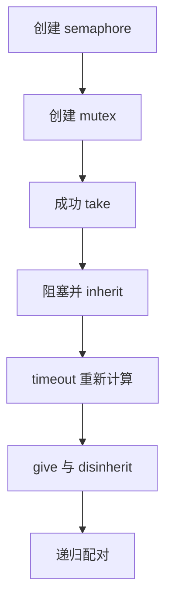
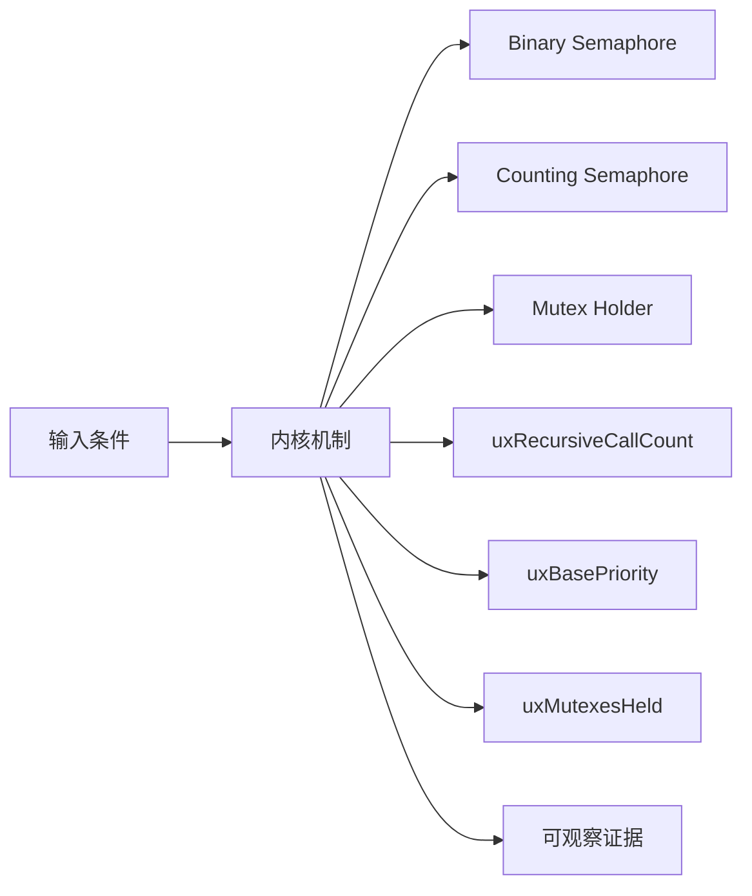
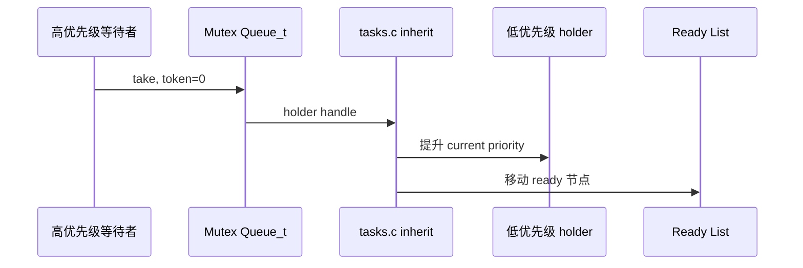
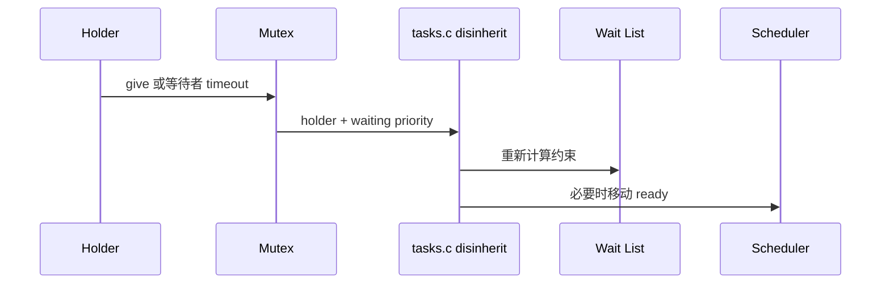
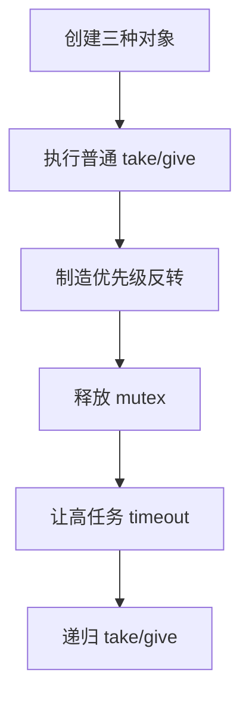
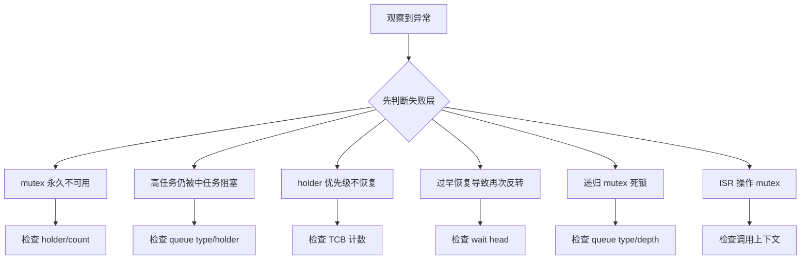

信号量和互斥锁都复用 Queue_t，但互斥锁多了所有者、递归计数和优先级继承，因此不能把它理解成容量为一的普通信号量。

本篇只回答一个核心问题：**FreeRTOS 如何在 Queue_t 上实现 semaphore 与 mutex，并用 TCB 优先级字段限制优先级反转？**

分析范围固定为 **FreeRTOS-Kernel V11.3.0**。所有函数、字段、宏和条件编译都以该 tag 为准。

本篇先比较对象初始化，再沿 take/give、阻塞、inherit、timeout disinherit 与 recursive 路径证明语义差异。

## 1. 问题边界、前置条件与验收证据

讨论上游简化 priority inheritance 机制，不承诺解决死锁、嵌套锁顺序或任意形式的优先级反转。

读者已经会使用基本任务 API，但不能把 API 行为替代为源码证明。

阅读源码前先写清输入状态、允许的状态变化和输出证据。只看函数名或最终返回值，无法判断链表、锁和调度点是否正确。



| 顺序 | 阅读动作 | 入口条件 | 状态变化 | 验收证据 |
|---:|---|---|---|---|
| 1 | 创建 semaphore | max/initial count 合法。 | token 模型成立。 | 字段快照。 |
| 2 | 创建 mutex | 选择 mutex type。 | mutex 可 take。 | queue type/holder。 |
| 3 | 成功 take | token 可用。 | 调用者拥有资源。 | holder/current 一致。 |
| 4 | 阻塞并 inherit | token 不可用且允许等待。 | holder 可能提升。 | base/current 和 ready list。 |
| 5 | timeout 重新计算 | 等待超时。 | 必要时降低 holder 但不低于约束。 | priority trace。 |
| 6 | give 与 disinherit | holder 释放。 | 可能恢复 base。 | holder/priority/list。 |
| 7 | 递归配对 | 同一 holder 再 take。 | ownership 连续。 | 递归深度。 |

### 1. 创建 semaphore

入口条件：max/initial count 合法。

执行动作：初始化 queue length 和 messages。

核心状态变化：token 模型成立。

离开这一步时必须成立：无 holder 语义。

可观察证据：字段快照。

停止条件：initial>max 时停止。

### 2. 创建 mutex

入口条件：选择 mutex type。

执行动作：创建长度一 queue 并初始化 holder/recursive/type。

核心状态变化：mutex 可 take。

离开这一步时必须成立：初始 token 正确。

可观察证据：queue type/holder。

停止条件：普通 queue type 时停止。

### 3. 成功 take

入口条件：token 可用。

执行动作：messages--，mutex 记录 holder 并 mutexesHeld++。

核心状态变化：调用者拥有资源。

离开这一步时必须成立：critical section。

可观察证据：holder/current 一致。

停止条件：ISR 上下文时停止。

### 4. 阻塞并 inherit

入口条件：token 不可用且允许等待。

执行动作：查 holder，调用 xTaskPriorityInherit，等待者进入 event list。

核心状态变化：holder 可能提升。

离开这一步时必须成立：scheduler/critical 边界。

可观察证据：base/current 和 ready list。

停止条件：holder 为空时不继承。

### 5. timeout 重新计算

入口条件：等待超时。

执行动作：查看仍在等待的最高优先级。

核心状态变化：必要时降低 holder 但不低于约束。

离开这一步时必须成立：timeout path。

可观察证据：priority trace。

停止条件：直接恢复 base 时停止。

### 6. give 与 disinherit

入口条件：holder 释放。

执行动作：清 holder、mutexesHeld--、token++，唤醒等待者。

核心状态变化：可能恢复 base。

离开这一步时必须成立：只有 owner 可 give。

可观察证据：holder/priority/list。

停止条件：非 owner give 时停止。

### 7. 递归配对

入口条件：同一 holder 再 take。

执行动作：recursive count++，最终 give 到零才真正释放。

核心状态变化：ownership 连续。

离开这一步时必须成立：无需重新 inherit。

可观察证据：递归深度。

停止条件：普通 give 混用时停止。

## 2. 核心数据结构、所有权与不变量

semaphore 使用 uxMessagesWaiting 表示 token；mutex 还把 queue type、holder 与 recursive count 连接到 TCB 的 base/current priority 和 mutexesHeld。

这里不把字段当作词汇表，而是解释字段由谁修改、在哪个临界区修改、它和哪个链表或对象保持一致。



| 对象 | 角色 | 必须保持的不变量 | 观察方法 | 常见误读 |
|---|---|---|---|---|
| Binary Semaphore | token 最大一，不记录 owner。 | messages 为 0 或 1。 | 读取 token。 | 认为 give 必须由 take 者执行。 |
| Counting Semaphore | token 上限为 uxLength。 | messages 不超过 max count。 | 记录计数。 | 把它当携带数据的 queue。 |
| Mutex Holder | 记录当前持有任务句柄。 | 非空 holder 必须对应已 take mutex 的任务。 | 读取 holder。 | ISR 可以持有 mutex。 |
| uxRecursiveCallCount | 同一 holder 的递归深度。 | 只有 holder 修改且 give 次数配对。 | 记录深度。 | 普通 mutex 自动支持递归。 |
| uxBasePriority | 任务原始分配优先级。 | inherit 期间保持原值。 | 对比 current/base。 | inherit 直接覆盖原始优先级。 |
| uxMutexesHeld | 任务当前持有 mutex 数。 | give 后递减且不能下溢。 | 记录计数。 | 持有任意一个 mutex 后都立即恢复。 |
| Priority Inheritance | holder 临时提升到最高等待者优先级。 | current >= base，恢复受持锁数和等待者约束。 | trace inherit/disinherit。 | 等同 priority ceiling。 |

### Binary Semaphore

角色：token 最大一，不记录 owner。

所有权：Queue_t。

不变量：messages 为 0 或 1。

变化时机：give/take。

观察方法：读取 token。

常见误读：认为 give 必须由 take 者执行。

### Counting Semaphore

角色：token 上限为 uxLength。

所有权：Queue_t。

不变量：messages 不超过 max count。

变化时机：give/take。

观察方法：记录计数。

常见误读：把它当携带数据的 queue。

### Mutex Holder

角色：记录当前持有任务句柄。

所有权：Queue_t union。

不变量：非空 holder 必须对应已 take mutex 的任务。

变化时机：take/give。

观察方法：读取 holder。

常见误读：ISR 可以持有 mutex。

### uxRecursiveCallCount

角色：同一 holder 的递归深度。

所有权：Mutex Queue_t。

不变量：只有 holder 修改且 give 次数配对。

变化时机：recursive take/give。

观察方法：记录深度。

常见误读：普通 mutex 自动支持递归。

### uxBasePriority

角色：任务原始分配优先级。

所有权：TCB。

不变量：inherit 期间保持原值。

变化时机：优先级设置/inherit。

观察方法：对比 current/base。

常见误读：inherit 直接覆盖原始优先级。

### uxMutexesHeld

角色：任务当前持有 mutex 数。

所有权：TCB。

不变量：give 后递减且不能下溢。

变化时机：take/give。

观察方法：记录计数。

常见误读：持有任意一个 mutex 后都立即恢复。

### Priority Inheritance

角色：holder 临时提升到最高等待者优先级。

所有权：tasks.c/queue.c。

不变量：current >= base，恢复受持锁数和等待者约束。

变化时机：高优先级任务阻塞时。

观察方法：trace inherit/disinherit。

常见误读：等同 priority ceiling。

## 3. 调用链一：mutex take 触发 priority inheritance

高优先级任务在 holder 持有 mutex 时阻塞，queue.c 找到 holder，tasks.c 再修改 TCB 优先级和 ready list 位置。

调用链中的每一跳都要区分普通函数调用、宏展开、临界区边界和可能触发调度的 port hook。



### 调用链一：xQueueSemaphoreTake -> xTaskPriorityInherit -> vTaskPlaceOnEventList -> holder runs

#### 链路步骤 1：检测空 token

进入时：take 进入。

本步读取：messages/type/holder。

本步修改：无。

并发边界：critical section。

返回或转交：确认需等待。

证据：queue trace。

#### 链路步骤 2：找到 holder

进入时：对象为 mutex。

本步读取：xMutexHolder。

本步修改：无。

并发边界：holder 只在 owner 路径改变。

返回或转交：任务句柄有效。

证据：holder field。

#### 链路步骤 3：比较优先级

进入时：holder 存在。

本步读取：holder base/current 与 waiter。

本步修改：可能提升 current。

并发边界：tasks critical。

返回或转交：inherit 条件明确。

证据：priority snapshot。

#### 链路步骤 4：移动 ready 节点

进入时：holder 位于 ready。

本步读取：旧/新优先级桶。

本步修改：state item container。

并发边界：scheduler list lock。

返回或转交：holder 可按新优先级运行。

证据：list owner。

#### 链路步骤 5：阻塞等待者

进入时：inherit 已处理。

本步读取：mutex event list 和 timeout。

本步修改：等待任务双链表。

并发边界：scheduler suspended。

返回或转交：current 切走。

证据：event container。

#### 链路步骤 6：holder 得到执行

进入时：调度器选择。

本步读取：最高 ready priority。

本步修改：资源临界段推进。

并发边界：正常任务上下文。

返回或转交：减少反转时间。

证据：switch trace。

### 源码片段：mutex 在 Queue_t 上增加特殊字段

> 源码位置：`queue.c` · `prvInitialiseMutex()` · `V11.3.0`
> 配置条件：configUSE_MUTEXES == 1
> 固定链接：[查看上游源码](https://github.com/FreeRTOS/FreeRTOS-Kernel/blob/V11.3.0/queue.c)

```c
pxNewQueue->u.xSemaphore.xMutexHolder = NULL;
pxNewQueue->uxQueueType = queueQUEUE_IS_MUTEX;
pxNewQueue->u.xSemaphore.uxRecursiveCallCount = 0;
traceCREATE_MUTEX( pxNewQueue );
( void ) xQueueGenericSend( pxNewQueue, NULL, 0U, queueSEND_TO_BACK );
```

这段摘录只保留当前机制需要的语句；省略的参数检查、trace hook 或条件分支必须回到固定链接核对。

解读 1：holder 初始为空。

解读 2：queue type 区分 mutex 特例。

解读 3：recursive count 只由 owner 修改。

解读 4：发送一个空 item 建立初始可用 token。

不变量：可用 mutex 的 token、holder 与 recursive count 组合必须一致。

观察点：创建后记录 messages、type、holder、recursive count。

### 源码片段：take mutex 时记录 holder 与持锁数

> 源码位置：`queue.c` · `xQueueSemaphoreTake()` · `V11.3.0`
> 配置条件：configUSE_MUTEXES == 1 且 queue type 为 mutex
> 固定链接：[查看上游源码](https://github.com/FreeRTOS/FreeRTOS-Kernel/blob/V11.3.0/queue.c)

```c
pxQueue->uxMessagesWaiting = uxSemaphoreCount - 1U;
#if ( configUSE_MUTEXES == 1 )
{
    if( pxQueue->uxQueueType == queueQUEUE_IS_MUTEX )
    {
        pxQueue->u.xSemaphore.xMutexHolder = pvTaskIncrementMutexHeldCount();
    }
}
#endif
```

这段摘录只保留当前机制需要的语句；省略的参数检查、trace hook 或条件分支必须回到固定链接核对。

解读 1：semaphore count 与 queue messages 共用。

解读 2：只有 mutex type 记录 owner。

解读 3：pvTaskIncrementMutexHeldCount 同时更新 TCB 计数。

解读 4：普通 semaphore 不产生所有权。

不变量：mutex token 被取走时 holder 非空且 holder mutexesHeld 已增加。

观察点：同步记录 queue 与 holder TCB。

## 4. 调用链二：give、timeout 与 priority disinherit

恢复优先级不是简单写回 base；需要考虑任务仍持有多少 mutex，以及 timeout 后仍等待该 mutex 的最高优先级。

第二条链用于验证同一对象在另一条执行路径上的行为，重点检查它是否复用相同不变量，还是进入 ISR、daemon 或 portable 层的特殊规则。



### 调用链二：give/timeout -> uxMutexesHeld update -> xTaskPriorityDisinherit / vTaskPriorityDisinheritAfterTimeout -> ready relocation

#### 链路步骤 1：验证 owner

进入时：give 路径进入。

本步读取：current 与 holder。

本步修改：无。

并发边界：任务上下文。

返回或转交：仅 owner 继续。

证据：assert/return。

#### 链路步骤 2：递减持锁计数

进入时：真正释放 mutex。

本步读取：uxMutexesHeld。

本步修改：计数--。

并发边界：TCB critical。

返回或转交：不下溢。

证据：TCB snapshot。

#### 链路步骤 3：选择恢复优先级

进入时：current!=base。

本步读取：base、held、waiting highest。

本步修改：目标 priority。

并发边界：tasks helper。

返回或转交：不破坏其他 mutex 约束。

证据：计算记录。

#### 链路步骤 4：移动 ready item

进入时：holder ready。

本步读取：旧优先级桶。

本步修改：进入目标桶。

并发边界：scheduler lock。

返回或转交：top ready 更新。

证据：list trace。

#### 链路步骤 5：释放 token

进入时：holder 清空。

本步读取：messages/holder。

本步修改：等待者可 take。

并发边界：queue critical。

返回或转交：event wake。

证据：queue trace。

#### 链路步骤 6：超时特殊路径

进入时：waiter timeout。

本步读取：剩余 wait list head。

本步修改：holder 可部分降低。

并发边界：timeout helper。

返回或转交：priority 仍满足剩余等待者。

证据：timeout trace。

### 源码片段：inherit 提升 holder 当前优先级

> 源码位置：`tasks.c` · `xTaskPriorityInherit()` · `V11.3.0`
> 配置条件：configUSE_MUTEXES == 1
> 固定链接：[查看上游源码](https://github.com/FreeRTOS/FreeRTOS-Kernel/blob/V11.3.0/tasks.c)

```c
if( pxMutexHolderTCB->uxPriority < pxCurrentTCB->uxPriority )
{
    if( listIS_CONTAINED_WITHIN( &( pxReadyTasksLists[ pxMutexHolderTCB->uxPriority ] ),
                                &( pxMutexHolderTCB->xStateListItem ) ) != pdFALSE )
    {
        uxListRemove( &( pxMutexHolderTCB->xStateListItem ) );
        pxMutexHolderTCB->uxPriority = pxCurrentTCB->uxPriority;
        prvAddTaskToReadyList( pxMutexHolderTCB );
    }
}
```

这段摘录只保留当前机制需要的语句；省略的参数检查、trace hook 或条件分支必须回到固定链接核对。

解读 1：等待者是当前高优先级任务。

解读 2：holder 在 ready 时需要移动优先级桶。

解读 3：base priority 保持不变。

解读 4：holder blocked 时 event item value 也可能需要调整。

不变量：继承后 current priority 不低于触发继承的等待者。

观察点：记录 base/current 与 ready container。

### 源码片段：disinherit 受持有 mutex 数限制

> 源码位置：`tasks.c` · `xTaskPriorityDisinherit()` · `V11.3.0`
> 配置条件：configUSE_MUTEXES == 1
> 固定链接：[查看上游源码](https://github.com/FreeRTOS/FreeRTOS-Kernel/blob/V11.3.0/tasks.c)

```c
configASSERT( pxTCB->uxMutexesHeld );
( pxTCB->uxMutexesHeld )--;

if( pxTCB->uxPriority != pxTCB->uxBasePriority )
{
    if( pxTCB->uxMutexesHeld == ( UBaseType_t ) 0 )
    {
        pxTCB->uxPriority = pxTCB->uxBasePriority;
    }
}
```

这段摘录只保留当前机制需要的语句；省略的参数检查、trace hook 或条件分支必须回到固定链接核对。

解读 1：释放前必须确实持有 mutex。

解读 2：计数先递减。

解读 3：仍持有其他 mutex 时不直接恢复。

解读 4：恢复时还要维护 ready/event list。

不变量：current priority 不低于 base，且恢复不能违反仍持有 mutex 的约束。

观察点：记录 held count、base/current 与 ready list。

## 5. 配置矩阵、观测实验与证据记录

使用可控输入和 trace hook 观察对象变化，不依赖特定开发板。

实验只承诺观察软件状态和调用顺序。没有实际目标硬件或 trace 数据时，不写虚构时间和性能数字。



### 配置矩阵

| 配置或条件 | 取值 A | 取值 B | 源码影响 | 验证重点 |
|---|---|---|---|---|
| configUSE_MUTEXES | 0 | 1 | 决定 holder、base priority 与继承代码。 | 比较 TCB/Queue 布局。 |
| configUSE_RECURSIVE_MUTEXES | 0 | 1 | 决定 recursive take/give API。 | 验证 depth 配对。 |
| configUSE_COUNTING_SEMAPHORES | 0 | 1 | 决定 counting create API。 | 检查 initial/max。 |
| configMAX_PRIORITIES | 较小 | 较大 | 影响 event list priority encoding。 | 验证 inherit 移桶。 |
| configUSE_PREEMPTION | 0 | 1 | 影响 wake 后立即切换。 | 记录 give 返回路径。 |
| configSUPPORT_STATIC_ALLOCATION | 0 | 1 | 决定 static mutex/semaphore 创建。 | 比较内存归属。 |

### 实验步骤

1. **创建三种对象**

   操作：binary/counting/mutex。

   记录：Queue_t 关键字段。

   通过标准：type/token/holder 正确。

2. **执行普通 take/give**

   操作：记录 token。

   记录：messages 与 wait list。

   通过标准：无 owner 语义。

3. **制造优先级反转**

   操作：低持锁、中计算、高等待。

   记录：base/current 与切换。

   通过标准：holder 被提升。

4. **释放 mutex**

   操作：记录 disinherit。

   记录：held count 与 ready move。

   通过标准：恢复 base。

5. **让高任务 timeout**

   操作：mutex 仍被持有。

   记录：remaining highest 与 holder。

   通过标准：部分恢复正确。

6. **递归 take/give**

   操作：同一 owner 重入。

   记录：recursive count。

   通过标准：到零才释放。

### 证据表

| 证据 | 获取方法 | 通过标准 | 失败说明 |
|---|---|---|---|
| 对象类型 | 读取 uxQueueType | mutex 与 semaphore 分支明确 | type 错会走错误 copy 路径 |
| 所有权 | holder 与 current | take 后相同、give 后清空 | 非 owner give 破坏互斥 |
| 持锁计数 | TCB uxMutexesHeld | take/give 配对 | 下溢或残留阻止恢复 |
| 优先级对 | base/current | inherit 时 current 提升、base 不变 | 覆盖 base 无法恢复 |
| ready 迁移 | 两个优先级 list | holder owner 移到新桶 | 只改字段会让 scheduler 看错 |
| timeout 约束 | 剩余 wait head | holder 不低于剩余最高等待者 | 直接 base 会再次反转 |

#### 证据：对象类型

获取方法：读取 uxQueueType

应当看到：mutex 与 semaphore 分支明确

如果不满足：type 错会走错误 copy 路径

为什么这项证据有效：type 是语义选择入口。

#### 证据：所有权

获取方法：holder 与 current

应当看到：take 后相同、give 后清空

如果不满足：非 owner give 破坏互斥

为什么这项证据有效：mutex 与 semaphore 关键区别。

#### 证据：持锁计数

获取方法：TCB uxMutexesHeld

应当看到：take/give 配对

如果不满足：下溢或残留阻止恢复

为什么这项证据有效：简化继承依赖计数。

#### 证据：优先级对

获取方法：base/current

应当看到：inherit 时 current 提升、base 不变

如果不满足：覆盖 base 无法恢复

为什么这项证据有效：两个字段保存临时与长期策略。

#### 证据：ready 迁移

获取方法：两个优先级 list

应当看到：holder owner 移到新桶

如果不满足：只改字段会让 scheduler 看错

为什么这项证据有效：priority 与 list 归属必须同步。

#### 证据：timeout 约束

获取方法：剩余 wait head

应当看到：holder 不低于剩余最高等待者

如果不满足：直接 base 会再次反转

为什么这项证据有效：timeout helper 需要重算。

## 6. 常见误读、故障定位与修复原则

排错从最早被破坏的不变量开始，不从最终崩溃位置随机回退。

先验证对象成员和链表归属，再检查锁、配置分支和调度请求。



### 1. mutex 永久不可用

根因：非 owner give 或递归次数未归零

第一检查点：检查 holder/count

需要保存的证据：take/give trace

修复原则：修复所有权和配对

不能采用的绕过方式：不要重新创建 mutex 绕过。

### 2. 高任务仍被中任务阻塞

根因：inherit 未触发或 holder 不可识别

第一检查点：检查 queue type/holder

需要保存的证据：base/current/wait list

修复原则：使用 mutex 并确保 holder 正确

不能采用的绕过方式：不要用 binary semaphore 期待继承。

### 3. holder 优先级不恢复

根因：uxMutexesHeld 残留或锁未释放

第一检查点：检查 TCB 计数

需要保存的证据：所有 mutex owner

修复原则：配对 give 并统一锁顺序

不能采用的绕过方式：不要手工 vTaskPrioritySet。

### 4. 过早恢复导致再次反转

根因：timeout 路径忽略剩余等待者

第一检查点：检查 wait head

需要保存的证据：timeout 前后 priority

修复原则：使用 disinheritAfterTimeout 语义

不能采用的绕过方式：不要直接写 base。

### 5. 递归 mutex 死锁

根因：使用普通 take 或 give 次数不足

第一检查点：检查 queue type/depth

需要保存的证据：recursive trace

修复原则：统一 recursive API

不能采用的绕过方式：不要混用普通 give。

### 6. ISR 操作 mutex

根因：mutex 需要任务 owner 与继承

第一检查点：检查调用上下文

需要保存的证据：ISR stack/call trace

修复原则：ISR 使用 semaphore/notification 延迟处理

不能采用的绕过方式：不要伪造 holder。

### 7. 多 mutex 锁顺序死锁

根因：inherit 不解决循环等待

第一检查点：画 wait-for graph

需要保存的证据：holder/wait chain

修复原则：固定全局锁顺序和 timeout

不能采用的绕过方式：不要提高优先级当修复。

## 7. 源码索引、阶段验收与面试表达

完成本篇后，读者应能不依赖文章复述对象模型、两条调用链、配置差异和取证顺序。

### 源码索引

| 文件 | 结构体 / 函数 / 宏 | 作用 |
|---|---|---|
| [queue.c](https://github.com/FreeRTOS/FreeRTOS-Kernel/blob/V11.3.0/queue.c) | prvInitialiseMutex、xQueueSemaphoreTake | 对象初始化与 take |
| [queue.c](https://github.com/FreeRTOS/FreeRTOS-Kernel/blob/V11.3.0/queue.c) | recursive/counting semaphore functions | 特殊同步对象 |
| [tasks.c](https://github.com/FreeRTOS/FreeRTOS-Kernel/blob/V11.3.0/tasks.c) | xTaskPriorityInherit | 优先级继承 |
| [tasks.c](https://github.com/FreeRTOS/FreeRTOS-Kernel/blob/V11.3.0/tasks.c) | xTaskPriorityDisinherit、timeout helper | 优先级恢复 |
| [include/semphr.h](https://github.com/FreeRTOS/FreeRTOS-Kernel/blob/V11.3.0/include/semphr.h) | 公开 semaphore/mutex 宏 | API 到 queue 映射 |

### 阶段验收

1. 能证明 semaphore 复用 Queue_t。
2. 能解释 mutex 特殊字段。
3. 能区分 token 与 owner。
4. 能跟踪 take 到 holder TCB。
5. 能重建 priority inheritance。
6. 能解释 base/current priority。
7. 能解释 timeout 后部分恢复。
8. 能说明 inheritance 不解决死锁。

### 验收记录模板

| 项目 | 实际证据 | 结论 |
|---|---|---|
| 能证明 semaphore 复用 Queue_t。 |  |  |
| 能解释 mutex 特殊字段。 |  |  |
| 能区分 token 与 owner。 |  |  |
| 能跟踪 take 到 holder TCB。 |  |  |
| 能重建 priority inheritance。 |  |  |
| 能解释 base/current priority。 |  |  |
| 能解释 timeout 后部分恢复。 |  |  |
| 能说明 inheritance 不解决死锁。 |  |  |

### 面试表达

Binary semaphore 不记录 owner，也没有优先级继承；mutex 在 Queue_t 上增加 holder，并在 TCB 中维护 base priority 和 mutexesHeld。

优先级继承只缩短 holder 被中优先级任务抢占的时间，不解决循环等待、锁顺序或长临界段本身。

FreeRTOS 的简化恢复逻辑会考虑任务仍持有的 mutex 数；等待者 timeout 时还要参考剩余最高优先级，不能盲目恢复 base。

### 参考资料

- [FreeRTOS-Kernel V11.3.0](https://github.com/FreeRTOS/FreeRTOS-Kernel/tree/V11.3.0)
- [FreeRTOS Kernel Book](https://github.com/FreeRTOS/FreeRTOS-Kernel-Book)

> 🏷️ FreeRTOS / Semaphore / Mutex / Priority Inheritance / Queue_t
