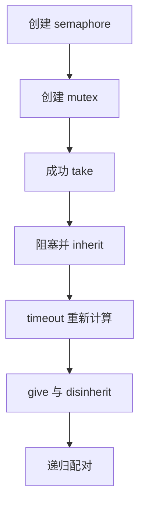
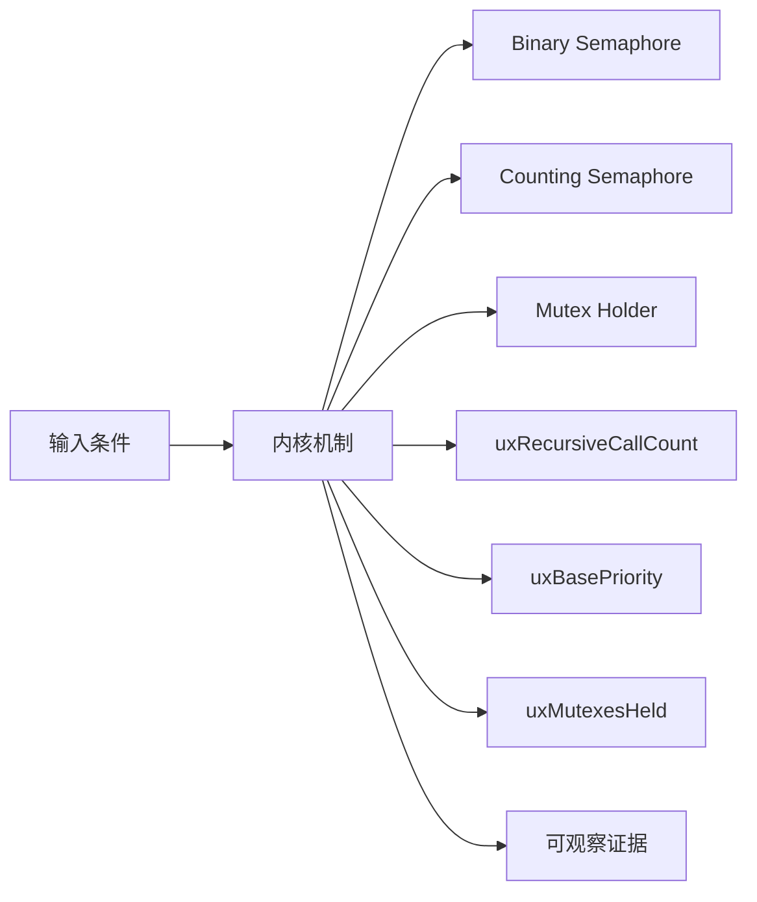
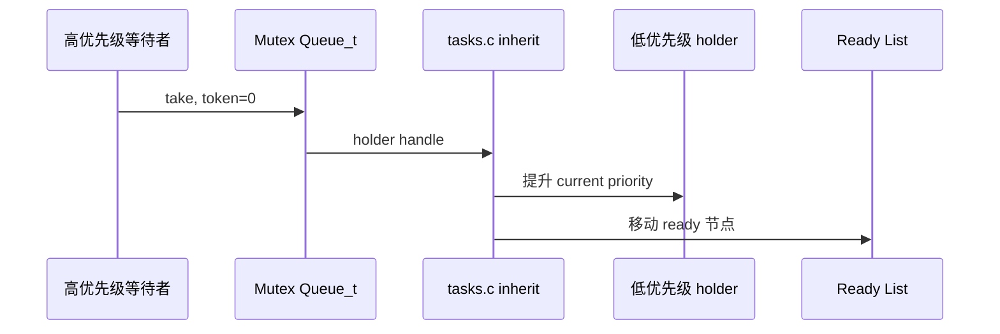
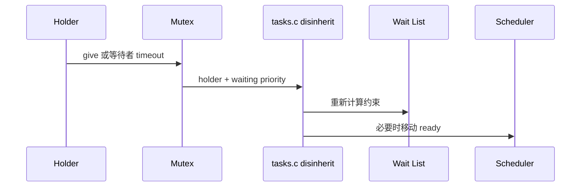
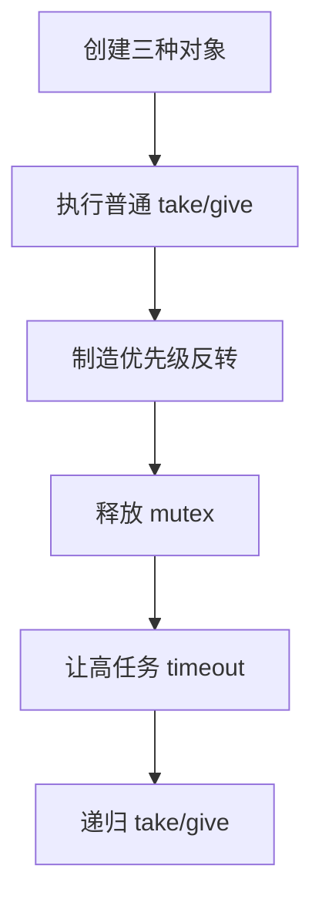
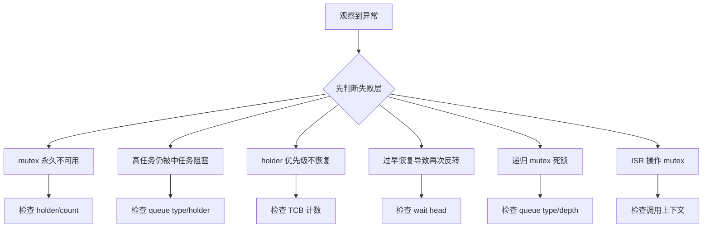

信号量和互斥锁都复用 Queue_t，但互斥锁多了所有者、递归计数和优先级继承，因此不能把它理解成容量为一的普通信号量。

本篇只回答一个核心问题：**FreeRTOS 如何在 Queue_t 上实现 semaphore 与 mutex，并用 TCB 优先级字段限制优先级反转？**

分析范围固定为 **FreeRTOS-Kernel V11.3.0**。所有函数、字段、宏和条件编译都以该 tag 为准。

本篇先比较对象初始化，再沿 take/give、阻塞、inherit、timeout disinherit 与 recursive 路径证明语义差异。

## 1. 优先级继承解决的具体反转

讨论上游简化 priority inheritance 机制，不承诺解决死锁、嵌套锁顺序或任意形式的优先级反转。



## 2. Token、Holder 与任务优先级之间的关系

semaphore 使用 uxMessagesWaiting 表示 token；mutex 还把 queue type、holder 与 recursive count 连接到 TCB 的 base/current priority 和 mutexesHeld。



| 对象 | 角色 | 必须保持的不变量 | 观察方法 | 常见误读 |
|---|---|---|---|---|
| Binary Semaphore | token 最大一，不记录 owner。 | messages 为 0 或 1。 | 读取 token。 | 认为 give 必须由 take 者执行。 |
| Counting Semaphore | token 上限为 uxLength。 | messages 不超过 max count。 | 记录计数。 | 把它当携带数据的 queue。 |
| Mutex Holder | 记录当前持有任务句柄。 | 非空 holder 必须对应已 take mutex 的任务。 | 读取 holder。 | ISR 可以持有 mutex。 |
| uxRecursiveCallCount | 同一 holder 的递归深度。 | 只有 holder 修改且 give 次数配对。 | 记录深度。 | 普通 mutex 自动支持递归。 |
| uxBasePriority | 任务原始分配优先级。 | inherit 期间保持原值。 | 对比 current/base。 | inherit 直接覆盖原始优先级。 |
| uxMutexesHeld | 任务当前持有 mutex 数。 | give 后递减且不能下溢。 | 记录计数。 | 持有任意一个 mutex 后都立即恢复。 |
| Priority Inheritance | holder 临时提升到最高等待者优先级。 | current >= base，恢复受持锁数和等待者约束。 | trace inherit/disinherit。 | 等同 priority ceiling。 |

## 3. 调用链一：mutex take 触发 priority inheritance

高优先级任务在 holder 持有 mutex 时阻塞，queue.c 找到 holder，tasks.c 再修改 TCB 优先级和 ready list 位置。



### 调用链一：xQueueSemaphoreTake -> xTaskPriorityInherit -> vTaskPlaceOnEventList -> holder runs

xQueueSemaphoreTake 发现 mutex token 不可用时，先从 xMutexHolder 找到持有者。只有对象类型确实是 mutex、holder 存在且等待任务优先级更高，xTaskPriorityInherit 才需要修改 holder 的当前优先级；binary semaphore 没有 holder 语义，因此不会进入这条路径。

如果 holder 仍在 ready list，内核把它的 xStateListItem 从原优先级桶移出并插入新的高优先级桶，同时保留 uxBasePriority 作为最终恢复依据。等待者随后进入 mutex 的接收事件链表和 delayed list，调度器便有机会优先运行 holder，让它尽快离开资源临界段。

优先级继承不会转移 mutex 所有权，也不会让等待者越过 take 操作。验证时应沿时间线记录 holder、base/current priority、ready list 归属、等待链表头和切换顺序，才能区分真正的继承与普通高优先级任务抢占。

### 源码片段：mutex 在 Queue_t 上增加特殊字段

> 源码位置：`queue.c` · `prvInitialiseMutex()` · `V11.3.0`
> 配置条件：configUSE_MUTEXES == 1
> 固定链接：[查看上游源码](https://github.com/FreeRTOS/FreeRTOS-Kernel/blob/V11.3.0/queue.c)

```c
pxNewQueue->u.xSemaphore.xMutexHolder = NULL;
pxNewQueue->uxQueueType = queueQUEUE_IS_MUTEX;
pxNewQueue->u.xSemaphore.uxRecursiveCallCount = 0;
traceCREATE_MUTEX( pxNewQueue );
( void ) xQueueGenericSend( pxNewQueue, NULL, 0U, queueSEND_TO_BACK );
```

- holder 初始为空。
- queue type 区分 mutex 特例。
- recursive count 只由 owner 修改。
- 发送一个空 item 建立初始可用 token。

> **关键约束**：可用 mutex 的 token、holder 与 recursive count 组合必须一致。 **验证重点**：创建后记录 messages、type、holder、recursive count。

### 源码片段：take mutex 时记录 holder 与持锁数

> 源码位置：`queue.c` · `xQueueSemaphoreTake()` · `V11.3.0`
> 配置条件：configUSE_MUTEXES == 1 且 queue type 为 mutex
> 固定链接：[查看上游源码](https://github.com/FreeRTOS/FreeRTOS-Kernel/blob/V11.3.0/queue.c)

```c
pxQueue->uxMessagesWaiting = uxSemaphoreCount - 1U;
#if ( configUSE_MUTEXES == 1 )
{
    if( pxQueue->uxQueueType == queueQUEUE_IS_MUTEX )
    {
        pxQueue->u.xSemaphore.xMutexHolder = pvTaskIncrementMutexHeldCount();
    }
}
#endif
```

- semaphore count 与 queue messages 共用。
- 只有 mutex type 记录 owner。
- pvTaskIncrementMutexHeldCount 同时更新 TCB 计数。
- 普通 semaphore 不产生所有权。

> **关键约束**：mutex token 被取走时 holder 非空且 holder mutexesHeld 已增加。 **验证重点**：同步记录 queue 与 holder TCB。

## 4. 调用链二：give、timeout 与 priority disinherit

恢复优先级不是简单写回 base；需要考虑任务仍持有多少 mutex，以及 timeout 后仍等待该 mutex 的最高优先级。



### 调用链二：give/timeout -> uxMutexesHeld update -> xTaskPriorityDisinherit / vTaskPriorityDisinheritAfterTimeout -> ready relocation

give 路径首先确认当前任务确实是 holder，然后在真正释放时递减 uxMutexesHeld。内核不能看到一次 give 就无条件恢复 base priority，因为任务可能还持有其他 mutex，而那些 mutex 上仍有更高优先级等待者。

xTaskPriorityDisinherit 根据剩余持锁计数决定是否恢复基础优先级；timeout 路径则由 vTaskPriorityDisinheritAfterTimeout 查看仍在等待链表中的最高优先级，必要时只下降到该优先级，而不是直接回到 base。优先级变化发生时，ready 状态节点还要同步迁移到新的优先级桶。

最后 queue 核心清除 holder、恢复 token 并唤醒等待者。验证释放链要把 uxMutexesHeld、holder 字段、base/current priority、等待链表头和 ready list 搬迁放在同一时间线上，避免把一次正常的部分降级误判为“优先级没有恢复”。

### 源码片段：inherit 提升 holder 当前优先级

> 源码位置：`tasks.c` · `xTaskPriorityInherit()` · `V11.3.0`
> 配置条件：configUSE_MUTEXES == 1
> 固定链接：[查看上游源码](https://github.com/FreeRTOS/FreeRTOS-Kernel/blob/V11.3.0/tasks.c)

```c
if( pxMutexHolderTCB->uxPriority < pxCurrentTCB->uxPriority )
{
    if( listIS_CONTAINED_WITHIN( &( pxReadyTasksLists[ pxMutexHolderTCB->uxPriority ] ),
                                &( pxMutexHolderTCB->xStateListItem ) ) != pdFALSE )
    {
        uxListRemove( &( pxMutexHolderTCB->xStateListItem ) );
        pxMutexHolderTCB->uxPriority = pxCurrentTCB->uxPriority;
        prvAddTaskToReadyList( pxMutexHolderTCB );
    }
}
```

- 等待者是当前高优先级任务。
- holder 在 ready 时需要移动优先级桶。
- base priority 保持不变。
- holder blocked 时 event item value 也可能需要调整。

> **关键约束**：继承后 current priority 不低于触发继承的等待者。 **验证重点**：记录 base/current 与 ready container。

### 源码片段：disinherit 受持有 mutex 数限制

> 源码位置：`tasks.c` · `xTaskPriorityDisinherit()` · `V11.3.0`
> 配置条件：configUSE_MUTEXES == 1
> 固定链接：[查看上游源码](https://github.com/FreeRTOS/FreeRTOS-Kernel/blob/V11.3.0/tasks.c)

```c
configASSERT( pxTCB->uxMutexesHeld );
( pxTCB->uxMutexesHeld )--;

if( pxTCB->uxPriority != pxTCB->uxBasePriority )
{
    if( pxTCB->uxMutexesHeld == ( UBaseType_t ) 0 )
    {
        pxTCB->uxPriority = pxTCB->uxBasePriority;
    }
}
```

- 释放前必须确实持有 mutex。
- 计数先递减。
- 仍持有其他 mutex 时不直接恢复。
- 恢复时还要维护 ready/event list。

> **关键约束**：current priority 不低于 base，且恢复不能违反仍持有 mutex 的约束。 **验证重点**：记录 held count、base/current 与 ready list。

## 5. 构造三任务反转，观察继承与降级



### 配置矩阵

| 配置或条件 | 取值 A | 取值 B | 源码影响 | 验证重点 |
|---|---|---|---|---|
| configUSE_MUTEXES | 0 | 1 | 决定 holder、base priority 与继承代码。 | 比较 TCB/Queue 布局。 |
| configUSE_RECURSIVE_MUTEXES | 0 | 1 | 决定 recursive take/give API。 | 验证 depth 配对。 |
| configUSE_COUNTING_SEMAPHORES | 0 | 1 | 决定 counting create API。 | 检查 initial/max。 |
| configMAX_PRIORITIES | 较小 | 较大 | 影响 event list priority encoding。 | 验证 inherit 移桶。 |
| configUSE_PREEMPTION | 0 | 1 | 影响 wake 后立即切换。 | 记录 give 返回路径。 |
| configSUPPORT_STATIC_ALLOCATION | 0 | 1 | 决定 static mutex/semaphore 创建。 | 比较内存归属。 |

### 实验步骤

1. **创建三种对象。** binary/counting/mutex，并保存 Queue_t 关键字段；只有 type/token/holder 正确，这一步才算完成。
2. **执行普通 take/give。** 记录 token。重点核对 messages 与 wait list，结果应满足“无 owner 语义”。
3. **制造优先级反转。** 低持锁、中计算、高等待，把 base/current 与切换保存为证据；判断依据是 holder 被提升。
4. **释放 mutex。** 记录 disinherit；观察 held count 与 ready move。若恢复 base，即可进入下一步。
5. **让高任务 timeout。** mutex 仍被持有，随后比较 remaining highest 与 holder；预期是部分恢复正确。
6. **递归 take/give。** 同一 owner 重入。最后用 recursive count 确认到零才释放。

### 证据表

| 证据 | 获取方法 | 通过标准 | 失败说明 |
|---|---|---|---|
| 对象类型 | 读取 uxQueueType | mutex 与 semaphore 分支明确 | type 错会走错误 copy 路径 |
| 所有权 | holder 与 current | take 后相同、give 后清空 | 非 owner give 破坏互斥 |
| 持锁计数 | TCB uxMutexesHeld | take/give 配对 | 下溢或残留阻止恢复 |
| 优先级对 | base/current | inherit 时 current 提升、base 不变 | 覆盖 base 无法恢复 |
| ready 迁移 | 两个优先级 list | holder owner 移到新桶 | 只改字段会让 scheduler 看错 |
| timeout 约束 | 剩余 wait head | holder 不低于剩余最高等待者 | 直接 base 会再次反转 |

## 6. 从 holder、等待者和优先级桶定位互斥故障

先验证对象成员和链表归属，再检查锁、配置分支和调度请求。



| 现象 | 根因 | 第一检查点 | 应保存的证据 | 修复原则 |
|---|---|---|---|---|
| mutex 永久不可用 | 非 owner give 或递归次数未归零 | 检查 holder/count | take/give trace | 修复所有权和配对 |
| 高任务仍被中任务阻塞 | inherit 未触发或 holder 不可识别 | 检查 queue type/holder | base/current/wait list | 使用 mutex 并确保 holder 正确 |
| holder 优先级不恢复 | uxMutexesHeld 残留或锁未释放 | 检查 TCB 计数 | 所有 mutex owner | 配对 give 并统一锁顺序 |
| 过早恢复导致再次反转 | timeout 路径忽略剩余等待者 | 检查 wait head | timeout 前后 priority | 使用 disinheritAfterTimeout 语义 |
| 递归 mutex 死锁 | 使用普通 take 或 give 次数不足 | 检查 queue type/depth | recursive trace | 统一 recursive API |
| ISR 操作 mutex | mutex 需要任务 owner 与继承 | 检查调用上下文 | ISR stack/call trace | ISR 使用 semaphore/notification 延迟处理 |
| 多 mutex 锁顺序死锁 | inherit 不解决循环等待 | 画 wait-for graph | holder/wait chain | 固定全局锁顺序和 timeout |

## 7. 源码索引、阶段验收与面试表达

### 源码索引

| 文件 | 结构体 / 函数 / 宏 | 作用 |
|---|---|---|
| [queue.c](https://github.com/FreeRTOS/FreeRTOS-Kernel/blob/V11.3.0/queue.c) | prvInitialiseMutex、xQueueSemaphoreTake | 对象初始化与 take |
| [queue.c](https://github.com/FreeRTOS/FreeRTOS-Kernel/blob/V11.3.0/queue.c) | recursive/counting semaphore functions | 特殊同步对象 |
| [tasks.c](https://github.com/FreeRTOS/FreeRTOS-Kernel/blob/V11.3.0/tasks.c) | xTaskPriorityInherit | 优先级继承 |
| [tasks.c](https://github.com/FreeRTOS/FreeRTOS-Kernel/blob/V11.3.0/tasks.c) | xTaskPriorityDisinherit、timeout helper | 优先级恢复 |
| [include/semphr.h](https://github.com/FreeRTOS/FreeRTOS-Kernel/blob/V11.3.0/include/semphr.h) | 公开 semaphore/mutex 宏 | API 到 queue 映射 |

### 阶段验收

1. 能证明 semaphore 复用 Queue_t。
2. 能解释 mutex 特殊字段。
3. 能区分 token 与 owner。
4. 能跟踪 take 到 holder TCB。
5. 能重建 priority inheritance。
6. 能解释 base/current priority。
7. 能解释 timeout 后部分恢复。
8. 能说明 inheritance 不解决死锁。

### 面试表达

Binary semaphore 不记录 owner，也没有优先级继承；mutex 在 Queue_t 上增加 holder，并在 TCB 中维护 base priority 和 mutexesHeld。

优先级继承只缩短 holder 被中优先级任务抢占的时间，不解决循环等待、锁顺序或长临界段本身。

FreeRTOS 的简化恢复逻辑会考虑任务仍持有的 mutex 数；等待者 timeout 时还要参考剩余最高优先级，不能盲目恢复 base。

### 参考资料

- [FreeRTOS-Kernel V11.3.0](https://github.com/FreeRTOS/FreeRTOS-Kernel/tree/V11.3.0)
- [FreeRTOS Kernel Book](https://github.com/FreeRTOS/FreeRTOS-Kernel-Book)

> 🏷️ FreeRTOS / Semaphore / Mutex / Priority Inheritance / Queue_t
