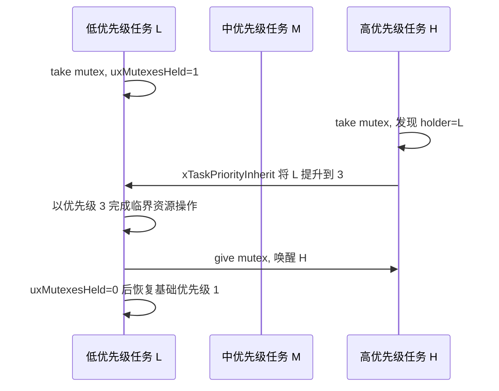

# FreeRTOS 内核源码解读 07：信号量、互斥锁与优先级继承

信号量和 mutex 都复用 `Queue_t`，但“复用同一个结构体”不等于“拥有同一种语义”。Binary/counting semaphore 只需要一个 token 计数；mutex 还要知道谁持有 token、该任务持有多少 mutex，以及等待者是否迫使 holder 临时提高优先级。没有 holder，就不可能实现 priority inheritance。

本篇固定使用 **FreeRTOS-Kernel V11.3.0**，commit `9b777ae5c5b8e9e456065a00294d1e5f5f9facf5`。只解释任务上下文中的 semaphore/mutex 主路径；mutex 不能在 ISR 中 take/give，FromISR semaphore API 仍遵循上一篇 Queue 的短临界区规则。

## 零长度 Queue 把消息数变成 semaphore count

`Queue_t` 通过 union 在普通 queue 指针和 semaphore 数据之间复用存储：

```c
typedef struct SemaphoreData
{
    TaskHandle_t xMutexHolder;
    UBaseType_t uxRecursiveCallCount;
} SemaphoreData_t;

/* semaphore 不复制 payload。 */
#define queueSEMAPHORE_QUEUE_ITEM_LENGTH ( ( UBaseType_t ) 0 )
```

对 item size 为零的对象，`prvCopyDataToQueue()` 不移动读写指针，只增加 `uxMessagesWaiting`；`xQueueSemaphoreTake()` 则在 count 大于零时减一。因此：

- binary semaphore 的 `uxLength == 1`，count 只能在 0/1 间变化；
- counting semaphore 的 `uxLength` 是最大计数，`uxMessagesWaiting` 是当前 token 数；
- mutex 也使用长度一、item size 零，但额外启用 holder 和 inheritance 逻辑。

等待关系仍复用 Queue 的事件链表。count 为零时，take 任务进入 `xTasksWaitingToReceive`；count 已满时，普通 semaphore give 若允许阻塞，会使用 `xTasksWaitingToSend`。没有新的“semaphore task list”。

Binary semaphore 不保存哪个任务执行过 take。任何允许的任务或 ISR 都可以 give，它适合表达事件或资源数量，但不能证明所有权，也不能把等待者优先级传递给某个 holder。

## mutex 初始化时先制造一个可取 token

[`prvInitialiseMutex()`](https://github.com/FreeRTOS/FreeRTOS-Kernel/blob/V11.3.0/queue.c#L615-L642) 在 generic queue 初始化后覆盖 mutex 专有字段：

```c
pxNewQueue->u.xSemaphore.xMutexHolder = NULL;
pxNewQueue->uxQueueType = queueQUEUE_IS_MUTEX;
pxNewQueue->u.xSemaphore.uxRecursiveCallCount = 0;

/* 初始状态为“可获取”。 */
( void ) xQueueGenericSend(
    pxNewQueue, NULL, 0U, queueSEND_TO_BACK );
```

`xQueueCreateMutex()` 创建长度一、item size 零的 Queue，再调用这个初始化函数。最后一次 generic send 把 `uxMessagesWaiting` 从零变成一，等价于放入唯一 token；holder 仍为 NULL，因为还没有任务 take。

`uxQueueType` 复用了 `pcHead` 的存储，`queueQUEUE_IS_MUTEX` 定义为 NULL。普通 queue 需要 `pcHead` 指向数据区，mutex 不需要数据区，因此用 NULL 同时标识对象类型。这个实现节省字段，但调试时不能把 mutex 的 `pcHead == NULL` 误判为未初始化。

## take 成功后 count 归零，holder 指向当前任务

[`xQueueSemaphoreTake()`](https://github.com/FreeRTOS/FreeRTOS-Kernel/blob/V11.3.0/queue.c#L1659-L1881) 先执行与 Queue receive 相同的 count 检查。count 大于零时，快速路径减一；若对象是 mutex，再记录 holder：

```c
const UBaseType_t uxSemaphoreCount = pxQueue->uxMessagesWaiting;

if( uxSemaphoreCount > 0U )
{
    pxQueue->uxMessagesWaiting = uxSemaphoreCount - 1U;

    if( pxQueue->uxQueueType == queueQUEUE_IS_MUTEX )
    {
        pxQueue->u.xSemaphore.xMutexHolder =
            pvTaskIncrementMutexHeldCount();
    }

    return pdPASS;
}
```

`pvTaskIncrementMutexHeldCount()` 返回 `pxCurrentTCB`，同时增加该 TCB 的 `uxMutexesHeld`。Queue 对象保存“这个 mutex 属于谁”，TCB 保存“这个任务总共持有多少 mutex”。前者用于找到继承目标，后者决定 give 时是否可以恢复基础优先级。

普通 mutex 再次被同一任务 take 时，count 已经是零，任务会像其他等待者一样阻塞并最终 timeout；只有 recursive mutex 允许 owner 重入。

count 为零且允许等待时，函数 suspend scheduler、lock queue、重新确认仍为空。对象确实为 mutex 时，在把当前任务加入等待链表之前调用 `xTaskPriorityInherit(xMutexHolder)`。顺序很重要：holder 优先级先提升，等待者才阻塞并让出 CPU，调度器随后有机会尽快运行 holder 释放资源。

先放入三个任务观察经典优先级反转。低优先级任务 L 的优先级为 1，它取得 mutex 后开始更新共享设备；中优先级任务 M 的优先级为 2，只做与设备无关的计算；高优先级任务 H 的优先级为 3，随后也要取得同一 mutex。



没有继承时，H 阻塞后 M 可以一直抢占 L，导致 H 等待一个比自己优先级更低、还拿不到 CPU 的任务。继承发生时，`xTaskPriorityInherit()` 保留 L 的 `uxBasePriority == 1`，把当前 `uxPriority` 提升到 3；如果 L 正在 ready list，还必须从优先级 1 链表移到优先级 3 链表。M 因为优先级 2，不能再阻止 L 尽快释放 mutex。

继承不是把 H 的时间片交给 L，也不会让 H 继续运行。H 的状态节点仍在 delayed/event list 中；只是 holder L 获得足够高的调度资格。L give 时 Queue 恢复 token、清空 `xMutexHolder`、减少 `uxMutexesHeld`，再解除 H 的事件等待。只有当 L 已不再持有任何 mutex 时，`xTaskPriorityDisinherit()` 才能完全恢复基础优先级。

多个 mutex 是 FreeRTOS 简化继承模型最需要说明的边界。若 L 同时持有 M1 和 M2，H 等待 M1，即使 L 先释放 M1，只要 `uxMutexesHeld` 仍非零，L 可能继续保持提升后的优先级，直到最后一个 mutex 释放。这会延长 boost，但避免在缺少完整依赖信息时过早降级。它不是 priority ceiling，也不检测死锁；应用仍需统一锁顺序并缩短持锁路径。

## priority inheritance 会修改 TCB，也可能搬迁 ready list

[`xTaskPriorityInherit()`](https://github.com/FreeRTOS/FreeRTOS-Kernel/blob/V11.3.0/tasks.c#L6648-L6748) 比较 holder 当前优先级与等待任务 `pxCurrentTCB->uxPriority`。holder 更低时，目标是把 holder 临时提升到等待者优先级。

```c
if( pxMutexHolderTCB->uxPriority < pxCurrentTCB->uxPriority )
{
    if( ( listGET_LIST_ITEM_VALUE(
              &( pxMutexHolderTCB->xEventListItem ) ) &
          taskEVENT_LIST_ITEM_VALUE_IN_USE ) == 0U )
    {
        listSET_LIST_ITEM_VALUE(
            &( pxMutexHolderTCB->xEventListItem ),
            ( TickType_t ) configMAX_PRIORITIES -
            ( TickType_t ) pxCurrentTCB->uxPriority );
    }

    if( listIS_CONTAINED_WITHIN(
            &( pxReadyTasksLists[ pxMutexHolderTCB->uxPriority ] ),
            &( pxMutexHolderTCB->xStateListItem ) ) != pdFALSE )
    {
        uxListRemove( &( pxMutexHolderTCB->xStateListItem ) );
        pxMutexHolderTCB->uxPriority = pxCurrentTCB->uxPriority;
        prvAddTaskToReadyList( pxMutexHolderTCB );
    }
    else
    {
        pxMutexHolderTCB->uxPriority = pxCurrentTCB->uxPriority;
    }
}
```

任务优先级决定 ready list 数组下标。holder 若处于 Ready，不能只改 `uxPriority`，还必须从旧优先级链表移出并加入新链表；若正在 Running 或 Blocked，则没有对应 ready list 节点需要搬迁，只更新字段。

`xEventListItem.xItemValue` 通常编码反向优先级，holder 优先级变化时也要同步更新。但 `taskEVENT_LIST_ITEM_VALUE_IN_USE` 表示该值正被其他机制临时占用，此时不能覆盖。

继承只改变 `uxPriority`，不会修改 `uxBasePriority`。一个更高优先级等待者稍后到来时，holder 可以继续提升；已继承到相同或更高优先级时，函数仍会返回“如果尚未继承则本应发生”，帮助 timeout 路径判断是否需要重新计算。

## give 时只有最后一个 mutex 才允许完全恢复基础优先级

Mutex give 最终进入 `xQueueGenericSend()`。因为 item size 为零，`prvCopyDataToQueue()` 识别 mutex 后先调用 `xTaskPriorityDisinherit(holder)`，再清空 `xMutexHolder`，最后把 count 加回一。

[`xTaskPriorityDisinherit()`](https://github.com/FreeRTOS/FreeRTOS-Kernel/blob/V11.3.0/tasks.c#L6751-L6842) 要求 give 的任务就是当前 holder。函数先减少 `uxMutexesHeld`，然后只在计数归零时恢复基础优先级：

```c
configASSERT( pxTCB == pxCurrentTCB );
configASSERT( pxTCB->uxMutexesHeld );
pxTCB->uxMutexesHeld--;

if( pxTCB->uxPriority != pxTCB->uxBasePriority )
{
    if( pxTCB->uxMutexesHeld == 0U )
    {
        uxListRemove( &( pxTCB->xStateListItem ) );
        pxTCB->uxPriority = pxTCB->uxBasePriority;
        listSET_LIST_ITEM_VALUE(
            &( pxTCB->xEventListItem ),
            ( TickType_t ) configMAX_PRIORITIES -
            ( TickType_t ) pxTCB->uxPriority );
        prvAddTaskToReadyList( pxTCB );
    }
}
```

这是 FreeRTOS inheritance 的一个明确简化：TCB 只记录持有 mutex 的数量，没有为每个已持 mutex 保存其最高等待者。只要还持有任何 mutex，内核无法证明其他 mutex 不再需要继承优先级，因此保守地保持当前提升值。

最后一个 mutex 释放时，当前任务位于 ready list 中，源码先从旧优先级桶移除，恢复 `uxBasePriority` 和事件节点值，再加入基础优先级 ready list。优先级下降后可能需要切换到另一个更高优先级任务。

## 等待者 timeout 只能在信息足够时部分降级

高优先级任务等待 mutex 时可能在拿到锁前 timeout。它不再等待后，holder 没必要继续继承该任务优先级，但同一 mutex 上可能还有其他等待者。

`xQueueSemaphoreTake()` 在 timeout 路径读取 `xTasksWaitingToReceive` 中剩余的最高等待优先级，调用 [`vTaskPriorityDisinheritAfterTimeout()`](https://github.com/FreeRTOS/FreeRTOS-Kernel/blob/V11.3.0/tasks.c#L6845-L6962)。目标优先级取以下两者较大值：

```c
if( pxTCB->uxBasePriority < uxHighestPriorityWaitingTask )
{
    uxPriorityToUse = uxHighestPriorityWaitingTask;
}
else
{
    uxPriorityToUse = pxTCB->uxBasePriority;
}
```

即使计算出更低目标，源码也只在 `uxMutexesHeld == 1` 时执行降级。holder 同时持有其他 mutex 时，那些 mutex 可能仍有高优先级等待者，而 TCB 没有足够信息逐一判断，继续保留较高优先级是安全但不一定最小的选择。

这说明 FreeRTOS priority inheritance 解决的是典型的有界优先级反转，不是完整的 priority ceiling/protection 协议。嵌套多个 mutex、复杂锁顺序和长期 holder 仍需在应用架构中避免。

## Binary semaphore 的 count 也可能是 0 或 1，却没有 `xMutexHolder` 和任务所有权。ISR 可以 give，另一个任务可以 take，内核无法也不应该推断“谁必须尽快运行来释放它”。因此用 binary semaphore 保护共享资源不会触发上述继承；反过来，用 mutex 做 ISR 到任务通知则违反 holder 只属于任务上下文的模型。

现场调试时，先在 mutex 对象中查看 `u.xSemaphore.xMutexHolder`，再看 holder TCB 的 `uxBasePriority`、`uxPriority`、`uxMutexesHeld` 和所在 ready list。若 H 已进入 `xTasksWaitingToReceive` 而 holder 优先级没有提升，检查对象是否真由 mutex 创建 API 产生，而不是一个长度为 1 的普通 semaphore。若 holder 永久保持高优先级，则检查是否还有另一个 mutex 未释放，而不要强行改写 `uxPriority`。

recursive mutex 只把同一 owner 的嵌套次数包在外层

[`xQueueTakeMutexRecursive()`](https://github.com/FreeRTOS/FreeRTOS-Kernel/blob/V11.3.0/queue.c#L816-L867) 先检查当前任务是否已经是 holder。是则直接增加 `uxRecursiveCallCount`，不再次消费 token；不是则调用普通 `xQueueSemaphoreTake()`，成功后把递归计数从零增加到一。

`xQueueGiveMutexRecursive()` 只允许 holder 调用。每次 give 先减少递归计数，只有归零时才调用普通 generic send，真正清空 holder、执行 priority disinherit、恢复 token 并唤醒其他等待任务。

因此递归 mutex 的 owner 语义没有改变，只多了一层“同一 owner 尚未完全释放”的计数。take/give 次数不匹配会让 token 永远不归还；普通 mutex 与 recursive mutex API 混用也会破坏这层约定。

信号量与 mutex 的源码分界最终落在三个状态上：`uxMessagesWaiting` 表示 token 数，`xMutexHolder` 表示 token 的所有者，TCB 的 `uxMutexesHeld/uxBasePriority/uxPriority` 表示所有权对调度的影响。Binary semaphore 只有第一项，mutex 三项齐全；这就是它们虽然共享 Queue_t，却不能互相替代的原因。
