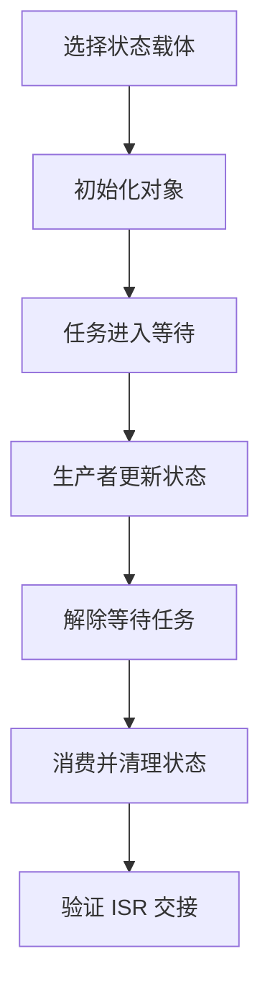
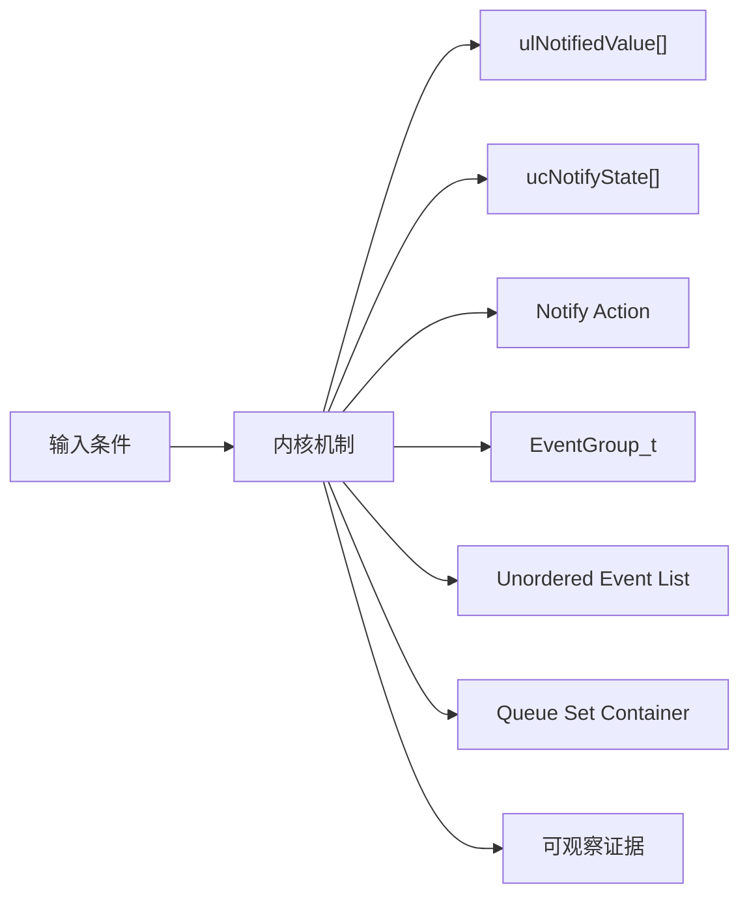
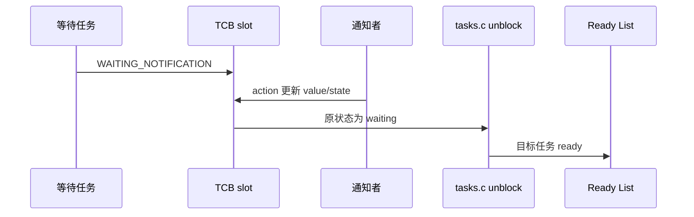
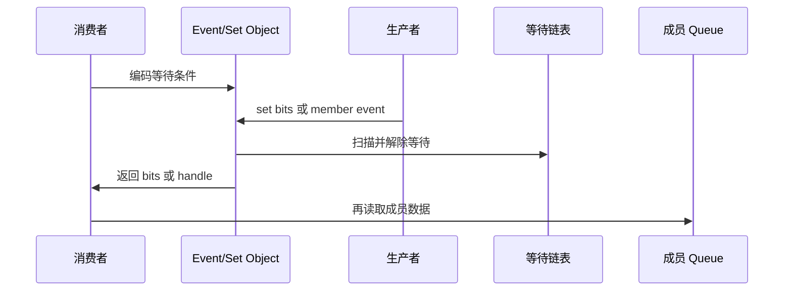
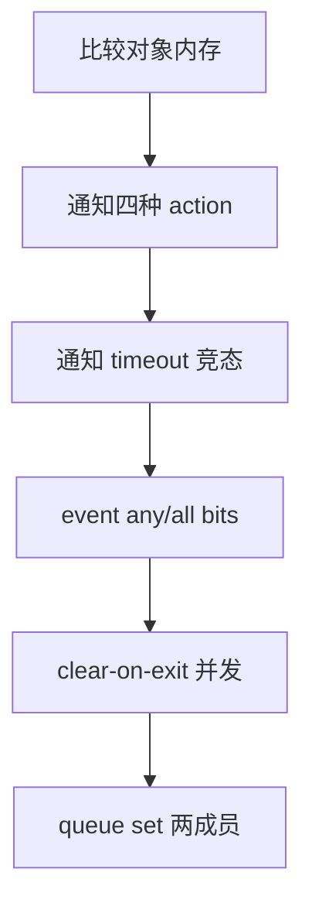
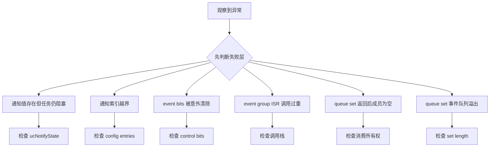

轻量同步并不等于语义相同：task notification 绑定一个目标 TCB，event group 表达位条件，queue set 转发哪个成员可读。

本篇只回答一个核心问题：**任务通知、事件组和 Queue Set 分别怎样保存状态、阻塞任务并传递唤醒原因？**

分析范围固定为 **FreeRTOS-Kernel V11.3.0**。所有函数、字段、宏和条件编译都以该 tag 为准。

本篇从三个对象的状态载体出发，分别追踪 notify/wait、set/wait bits 和 member/set queue，再用场景矩阵证明选型。

## 1. 问题边界、前置条件与验收证据

不把这些机制当 queue 的性能替代品；选择依据是数据语义、等待者数量、所有权和 ISR 路径。

读者已经会使用基本任务 API，但不能把 API 行为替代为源码证明。

阅读源码前先写清输入状态、允许的状态变化和输出证据。只看函数名或最终返回值，无法判断链表、锁和调度点是否正确。



| 顺序 | 阅读动作 | 入口条件 | 状态变化 | 验收证据 |
|---:|---|---|---|---|
| 1 | 选择状态载体 | 需求已写清。 | 选 notification/event/set。 | 选择表。 |
| 2 | 初始化对象 | 配置启用。 | 空状态不变量成立。 | 字段快照。 |
| 3 | 任务进入等待 | 条件当前不满足。 | 任务进入 delayed/suspended。 | 双 list container。 |
| 4 | 生产者更新状态 | 任务或 ISR 产生事件。 | 状态先可见。 | 旧新值。 |
| 5 | 解除等待任务 | 条件满足。 | 任务 ready。 | wake trace。 |
| 6 | 消费并清理状态 | 任务恢复。 | 对象进入下一轮状态。 | 返回值和剩余状态。 |
| 7 | 验证 ISR 交接 | 事件来自 ISR。 | 返回 higherPriority flag。 | ISR exit trace。 |

### 1. 选择状态载体

入口条件：需求已写清。

执行动作：判断数据、bits、计数或成员事件。

核心状态变化：选 notification/event/set。

离开这一步时必须成立：语义先于性能。

可观察证据：选择表。

停止条件：只按 API 数量选择时停止。

### 2. 初始化对象

入口条件：配置启用。

执行动作：初始化 TCB 槽、event object 或 set queue。

核心状态变化：空状态不变量成立。

离开这一步时必须成立：内存归属明确。

可观察证据：字段快照。

停止条件：索引/容量错误时停止。

### 3. 任务进入等待

入口条件：条件当前不满足。

执行动作：设置 notify state 或插入 event/set wait list。

核心状态变化：任务进入 delayed/suspended。

离开这一步时必须成立：scheduler 边界。

可观察证据：双 list container。

停止条件：等待条件未编码时停止。

### 4. 生产者更新状态

入口条件：任务或 ISR 产生事件。

执行动作：原子修改 value/bits/member queue。

核心状态变化：状态先可见。

离开这一步时必须成立：critical/ISR mask。

可观察证据：旧新值。

停止条件：先 wake 后写状态时停止。

### 5. 解除等待任务

入口条件：条件满足。

执行动作：移出 event list 并写返回原因。

核心状态变化：任务 ready。

离开这一步时必须成立：按机制选择最高等待者或多个任务。

可观察证据：wake trace。

停止条件：丢失 clear 语义时停止。

### 6. 消费并清理状态

入口条件：任务恢复。

执行动作：take/wait/select 读取并按规则 clear。

核心状态变化：对象进入下一轮状态。

离开这一步时必须成立：任务上下文。

可观察证据：返回值和剩余状态。

停止条件：重复消费时停止。

### 7. 验证 ISR 交接

入口条件：事件来自 ISR。

执行动作：使用 FromISR 或 timer pend 路径。

核心状态变化：返回 higherPriority flag。

离开这一步时必须成立：不阻塞。

可观察证据：ISR exit trace。

停止条件：普通 API 在 ISR 时停止。

## 2. 核心数据结构、所有权与不变量

notification 把 value/state 放进 TCB；event group 把 bits 放进独立对象并编码等待条件；queue set 把成员 handle 当作另一个 queue 的数据。

这里不把字段当作词汇表，而是解释字段由谁修改、在哪个临界区修改、它和哪个链表或对象保持一致。



| 对象 | 角色 | 必须保持的不变量 | 观察方法 | 常见误读 |
|---|---|---|---|---|
| ulNotifiedValue[] | 每个任务的通知值数组。 | 索引合法且由 action 定义更新语义。 | 记录旧新值。 | 只支持一个固定槽。 |
| ucNotifyState[] | 区分未等待、等待中、已收到。 | 状态与阻塞/返回路径一致。 | 记录状态迁移。 | 只看 value 判断是否阻塞。 |
| Notify Action | set bits/increment/overwrite/no-overwrite。 | 每种 action 遵守原子更新规则。 | 对比 eAction。 | 所有通知都只是加一。 |
| EventGroup_t | 保存 uxEventBits 与等待任务链表。 | 控制位不泄漏为用户 bits。 | 读 bits 和 list。 | 把 event bits 当计数器。 |
| Unordered Event List | item value 编码等待 bits 与控制标志。 | 解除时把返回 bits 带回任务。 | 解码 item value。 | 按优先级有序等待。 |
| Queue Set Container | 一个存放 member handle 的 queue。 | 成员每次变可读时推送一次有效事件。 | 读取 set storage。 | 从 set 取 handle 就自动取走成员数据。 |
| pxQueueSetContainer | 成员反向指向所属 set。 | 成员最多属于一个 set，移除时必须不可读。 | 检查指针。 | 运行中随意迁移非空成员。 |

### ulNotifiedValue[]

角色：每个任务的通知值数组。

所有权：TCB。

不变量：索引合法且由 action 定义更新语义。

变化时机：notify/take/wait。

观察方法：记录旧新值。

常见误读：只支持一个固定槽。

### ucNotifyState[]

角色：区分未等待、等待中、已收到。

所有权：TCB。

不变量：状态与阻塞/返回路径一致。

变化时机：wait/notify/clear。

观察方法：记录状态迁移。

常见误读：只看 value 判断是否阻塞。

### Notify Action

角色：set bits/increment/overwrite/no-overwrite。

所有权：调用 API。

不变量：每种 action 遵守原子更新规则。

变化时机：notify critical section。

观察方法：对比 eAction。

常见误读：所有通知都只是加一。

### EventGroup_t

角色：保存 uxEventBits 与等待任务链表。

所有权：event_groups.c。

不变量：控制位不泄漏为用户 bits。

变化时机：wait/set/clear/sync。

观察方法：读 bits 和 list。

常见误读：把 event bits 当计数器。

### Unordered Event List

角色：item value 编码等待 bits 与控制标志。

所有权：tasks/event group。

不变量：解除时把返回 bits 带回任务。

变化时机：wait/set。

观察方法：解码 item value。

常见误读：按优先级有序等待。

### Queue Set Container

角色：一个存放 member handle 的 queue。

所有权：queue.c。

不变量：成员每次变可读时推送一次有效事件。

变化时机：member send/give。

观察方法：读取 set storage。

常见误读：从 set 取 handle 就自动取走成员数据。

### pxQueueSetContainer

角色：成员反向指向所属 set。

所有权：成员 Queue_t。

不变量：成员最多属于一个 set，移除时必须不可读。

变化时机：add/remove set。

观察方法：检查指针。

常见误读：运行中随意迁移非空成员。

## 3. 调用链一：任务通知 wait 与 notify

通知无需独立 Queue_t，发送者直接修改目标 TCB 的 value/state；目标正在等待时，再把它从状态链表移到 ready。

调用链中的每一跳都要区分普通函数调用、宏展开、临界区边界和可能触发调度的 port hook。



### 调用链一：xTaskGenericNotifyWait/Take -> TCB state -> xTaskGenericNotify/FromISR -> ready -> consume

#### 链路步骤 1：检查已有通知

进入时：wait/take 进入。

本步读取：state/value。

本步修改：可能立即消费。

并发边界：critical section。

返回或转交：决定是否阻塞。

证据：slot snapshot。

#### 链路步骤 2：设置等待状态

进入时：无可消费值。

本步读取：clear-on-entry 与 state。

本步修改：WAITING_NOTIFICATION。

并发边界：scheduler suspend。

返回或转交：等待条件可见。

证据：state trace。

#### 链路步骤 3：放入 delayed

进入时：允许 timeout。

本步读取：state list。

本步修改：任务 blocked。

并发边界：tasks helper。

返回或转交：current 切走。

证据：container。

#### 链路步骤 4：更新通知值

进入时：生产者进入。

本步读取：eAction 与旧 value。

本步修改：value/state received。

并发边界：critical 或 ISR mask。

返回或转交：原子结果。

证据：previous value。

#### 链路步骤 5：解除目标任务

进入时：原 state waiting。

本步读取：state/event container。

本步修改：ready list。

并发边界：优先级比较。

返回或转交：maybe yield。

证据：wake trace。

#### 链路步骤 6：恢复并消费

进入时：任务再次运行。

本步读取：clear/decrement 规则。

本步修改：返回值和 NOT_WAITING。

并发边界：任务 context。

返回或转交：下一轮状态。

证据：value/state。

### 源码片段：通知值与状态直接嵌入 TCB

> 源码位置：`tasks.c` · `TCB_t notification fields` · `V11.3.0`
> 配置条件：configUSE_TASK_NOTIFICATIONS == 1
> 固定链接：[查看上游源码](https://github.com/FreeRTOS/FreeRTOS-Kernel/blob/V11.3.0/tasks.c)

```c
volatile uint32_t ulNotifiedValue[ configTASK_NOTIFICATION_ARRAY_ENTRIES ];
volatile uint8_t ucNotifyState[ configTASK_NOTIFICATION_ARRAY_ENTRIES ];
```

这段摘录只保留当前机制需要的语句；省略的参数检查、trace hook 或条件分支必须回到固定链接核对。

解读 1：数组长度由配置确定。

解读 2：value 与 state 分开避免仅凭数值推断等待状态。

解读 3：每个任务拥有自己的槽。

解读 4：没有独立 queue storage 和等待接收者列表。

不变量：每个索引的 state 与 value 更新在内核临界区内保持一致。

观察点：记录目标 TCB 索引的旧新值与状态。

### 源码片段：notify 先更新状态和值再解除等待

> 源码位置：`tasks.c` · `xTaskGenericNotify()` · `V11.3.0`
> 配置条件：configUSE_TASK_NOTIFICATIONS == 1
> 固定链接：[查看上游源码](https://github.com/FreeRTOS/FreeRTOS-Kernel/blob/V11.3.0/tasks.c)

```c
ucOriginalNotifyState = pxTCB->ucNotifyState[ uxIndexToNotify ];
pxTCB->ucNotifyState[ uxIndexToNotify ] = taskNOTIFICATION_RECEIVED;

switch( eAction )
{
    case eSetBits:
        pxTCB->ulNotifiedValue[ uxIndexToNotify ] |= ulValue;
        break;
    case eIncrement:
        ( pxTCB->ulNotifiedValue[ uxIndexToNotify ] )++;
        break;
}
```

这段摘录只保留当前机制需要的语句；省略的参数检查、trace hook 或条件分支必须回到固定链接核对。

解读 1：保存原 state 用于判断目标是否在等待。

解读 2：state 先标记 received。

解读 3：action 决定 value 语义。

解读 4：目标等待时后续移出 blocked list。

不变量：目标 ready 前通知值和 received 状态已经可见。

观察点：trace notify 与 TCB slot。

## 4. 调用链二：event bits 与 queue set 事件转发

event group 可以一次解除多个满足 bit 条件的任务；queue set 只告诉消费者哪个成员可读，实际数据仍留在成员对象。

第二条链用于验证同一对象在另一条执行路径上的行为，重点检查它是否复用相同不变量，还是进入 ISR、daemon 或 portable 层的特殊规则。



### 调用链二：wait bits / select set -> producer set/send -> condition scan / member handle enqueue -> task ready -> consume

#### 链路步骤 1：编码 event wait

进入时：bits 条件未满足。

本步读取：wait mask/control bits。

本步修改：unordered item value。

并发边界：scheduler suspended。

返回或转交：可由 set bits 解码。

证据：item value。

#### 链路步骤 2：设置 event bits

进入时：生产者更新。

本步读取：uxEventBits。

本步修改：bits OR。

并发边界：scheduler suspended。

返回或转交：状态先可见。

证据：bits snapshot。

#### 链路步骤 3：扫描等待者

进入时：bits 已更新。

本步读取：每个 item mask/flags。

本步修改：满足任务移出。

并发边界：unordered list safe iteration。

返回或转交：收集 clear mask。

证据：wake records。

#### 链路步骤 4：应用 clear-on-exit

进入时：扫描完成。

本步读取：uxBitsToClear。

本步修改：event bits 清理。

并发边界：同一 suspend 窗口。

返回或转交：所有等待者看到一致触发快照。

证据：before/after bits。

#### 链路步骤 5：转发 set member

进入时：成员从不可读到可读。

本步读取：pxQueueSetContainer。

本步修改：member handle 写入 set queue。

并发边界：queue critical。

返回或转交：set consumer 可醒。

证据：set storage。

#### 链路步骤 6：消费者读取成员

进入时：select 返回 handle。

本步读取：member queue/token。

本步修改：真正数据由成员 API 消耗。

并发边界：任务上下文。

返回或转交：事件与数据配对。

证据：handle/data trace。

### 源码片段：event group 用 item value 编码等待条件

> 源码位置：`event_groups.c` · `xEventGroupWaitBits()` · `V11.3.0`
> 配置条件：configUSE_EVENT_GROUPS == 1
> 固定链接：[查看上游源码](https://github.com/FreeRTOS/FreeRTOS-Kernel/blob/V11.3.0/event_groups.c)

```c
uxControlBits = 0U;
if( xClearOnExit != pdFALSE )
{
    uxControlBits |= eventCLEAR_EVENTS_ON_EXIT_BIT;
}
if( xWaitForAllBits != pdFALSE )
{
    uxControlBits |= eventWAIT_FOR_ALL_BITS;
}
vTaskPlaceOnUnorderedEventList( &( pxEventBits->xTasksWaitingForBits ),
                                ( uxBitsToWaitFor | uxControlBits ),
                                xTicksToWait );
```

这段摘录只保留当前机制需要的语句；省略的参数检查、trace hook 或条件分支必须回到固定链接核对。

解读 1：用户 mask 与内核控制位共存在 item value。

解读 2：无序列表因为 value 不是时间/优先级排序键。

解读 3：任务状态节点仍负责 timeout。

解读 4：set bits 时按 mask 和 flags 扫描。

不变量：用户可用 bits 不得占用保留控制位。

观察点：解码 event list item value。

### 源码片段：queue set 把成员句柄写入容器 queue

> 源码位置：`queue.c` · `prvNotifyQueueSetContainer()` · `V11.3.0`
> 配置条件：configUSE_QUEUE_SETS == 1
> 固定链接：[查看上游源码](https://github.com/FreeRTOS/FreeRTOS-Kernel/blob/V11.3.0/queue.c)

```c
Queue_t * pxQueueSetContainer = pxQueue->pxQueueSetContainer;

if( pxQueueSetContainer->uxMessagesWaiting < pxQueueSetContainer->uxLength )
{
    xReturn = prvCopyDataToQueue( pxQueueSetContainer, &pxQueue, queueSEND_TO_BACK );
    if( listLIST_IS_EMPTY( &( pxQueueSetContainer->xTasksWaitingToReceive ) ) == pdFALSE )
    {
        xTaskRemoveFromEventList( &( pxQueueSetContainer->xTasksWaitingToReceive ) );
    }
}
```

这段摘录只保留当前机制需要的语句；省略的参数检查、trace hook 或条件分支必须回到固定链接核对。

解读 1：set 本身是存放 member handle 的 queue。

解读 2：成员数据不复制到 set。

解读 3：set consumer 被唤醒后还要读取成员。

解读 4：容器长度必须容纳成员可能产生的事件。

不变量：set 中每个事件句柄必须对应仍可从成员消费的事件。

观察点：同时记录 set storage handle 与成员 messages/token。

## 5. 配置矩阵、观测实验与证据记录

使用可控输入和 trace hook 观察对象变化，不依赖特定开发板。

实验只承诺观察软件状态和调用顺序。没有实际目标硬件或 trace 数据时，不写虚构时间和性能数字。



### 配置矩阵

| 配置或条件 | 取值 A | 取值 B | 源码影响 | 验证重点 |
|---|---|---|---|---|
| configUSE_TASK_NOTIFICATIONS | 0 | 1 | 决定 TCB notification 字段和 API。 | 比较 TCB 大小。 |
| configTASK_NOTIFICATION_ARRAY_ENTRIES | 1 | 大于 1 | 决定每任务槽数量。 | 验证索引断言。 |
| configUSE_EVENT_GROUPS | 0 | 1 | 决定 EventGroup_t 和 API。 | 检查 event_groups.c 编译。 |
| configUSE_QUEUE_SETS | 0 | 1 | 决定 Queue_t container 字段和 set API。 | 检查结构布局。 |
| configUSE_TIMERS | 0 | 1 | 影响 event group FromISR 通过 pend function。 | 验证 timer daemon 路径。 |
| configUSE_PREEMPTION | 0 | 1 | 影响解除任务后的切换时机。 | 记录 wake/yield。 |

### 实验步骤

1. **比较对象内存**

   操作：创建等价信号场景。

   记录：TCB/heap/queue storage。

   通过标准：说明 notification 轻量原因。

2. **通知四种 action**

   操作：逐次发送。

   记录：value/state。

   通过标准：语义与 action 一致。

3. **通知 timeout 竞态**

   操作：临界点注入 notify。

   记录：state/container/return。

   通过标准：事件不丢失。

4. **event any/all bits**

   操作：两个等待任务。

   记录：mask、flags、wake。

   通过标准：条件正确。

5. **clear-on-exit 并发**

   操作：多个任务共享 bits。

   记录：触发快照和 clear mask。

   通过标准：无误清。

6. **queue set 两成员**

   操作：queue+semaphore 加入 set。

   记录：set handle 与 member 数据。

   通过标准：select 后正确消费。

### 证据表

| 证据 | 获取方法 | 通过标准 | 失败说明 |
|---|---|---|---|
| 通知槽 | TCB value/state | 每次 action 状态一致 | 只看 value 会误判已收零值 |
| notify wake | state 原值和 ready list | waiting 时解除，非 waiting 只留值 | 无条件 wake 会重复 ready |
| event item value | 解码 mask/control | 用户 bits 与 flags 正确 | 控制位冲突会错误 clear/wait |
| event clear | set 前后 bits | 只清满足任务要求的集合 | 逐任务立即清会影响后续扫描 |
| set handle | set queue 内容 | 等于实际成员地址 | 错误 handle 会读错对象 |
| 成员可读性 | select 后检查 member | 对应数据/token 仍存在 | set 自己不保存业务数据 |

#### 证据：通知槽

获取方法：TCB value/state

应当看到：每次 action 状态一致

如果不满足：只看 value 会误判已收零值

为什么这项证据有效：state 与 value 是联合证据。

#### 证据：notify wake

获取方法：state 原值和 ready list

应当看到：waiting 时解除，非 waiting 只留值

如果不满足：无条件 wake 会重复 ready

为什么这项证据有效：原 state 决定调度动作。

#### 证据：event item value

获取方法：解码 mask/control

应当看到：用户 bits 与 flags 正确

如果不满足：控制位冲突会错误 clear/wait

为什么这项证据有效：无序事件节点承载等待语义。

#### 证据：event clear

获取方法：set 前后 bits

应当看到：只清满足任务要求的集合

如果不满足：逐任务立即清会影响后续扫描

为什么这项证据有效：clear mask 应在一致窗口应用。

#### 证据：set handle

获取方法：set queue 内容

应当看到：等于实际成员地址

如果不满足：错误 handle 会读错对象

为什么这项证据有效：queue set 是事件多路复用。

#### 证据：成员可读性

获取方法：select 后检查 member

应当看到：对应数据/token 仍存在

如果不满足：set 自己不保存业务数据

为什么这项证据有效：必须二次消费成员。

## 6. 常见误读、故障定位与修复原则

排错从最早被破坏的不变量开始，不从最终崩溃位置随机回退。

先验证对象成员和链表归属，再检查锁、配置分支和调度请求。



### 1. 通知值存在但任务仍阻塞

根因：state 与 value 操作不匹配

第一检查点：检查 ucNotifyState

需要保存的证据：wait/notify trace

修复原则：使用匹配的 wait/take 语义

不能采用的绕过方式：不要只轮询 value。

### 2. 通知索引越界

根因：配置数组长度与调用索引不一致

第一检查点：检查 config entries

需要保存的证据：断言和 TCB layout

修复原则：统一索引常量

不能采用的绕过方式：不要关闭 bounds assert。

### 3. event bits 被意外清除

根因：clear-on-exit 与多个等待者理解错误

第一检查点：检查 control bits

需要保存的证据：set 扫描前后 bits

修复原则：按触发快照集中 clear

不能采用的绕过方式：不要每个任务手工 clear。

### 4. event group ISR 调用过重

根因：直接调用非 ISR API

第一检查点：检查调用栈

需要保存的证据：timer pend queue

修复原则：使用 FromISR 延迟到 daemon

不能采用的绕过方式：不要在 ISR suspend scheduler。

### 5. queue set 返回后成员为空

根因：成员被其他消费者取走

第一检查点：检查消费所有权

需要保存的证据：set handle/member trace

修复原则：保证单一消费路径或加同步

不能采用的绕过方式：不要把 select 当锁。

### 6. queue set 事件队列溢出

根因：容量小于成员可能事件数

第一检查点：检查 set length

需要保存的证据：messages 与 member capacity

修复原则：按官方容量规则设计

不能采用的绕过方式：不要丢弃 handle。

### 7. 轻量机制选错后难扩展

根因：notification 绑定单 TCB/无多消费者

第一检查点：检查需求变化

需要保存的证据：对象/等待者图

修复原则：按数据语义改用 queue/event

不能采用的绕过方式：不要堆多个 ad-hoc 标志。

## 7. 源码索引、阶段验收与面试表达

完成本篇后，读者应能不依赖文章复述对象模型、两条调用链、配置差异和取证顺序。

### 源码索引

| 文件 | 结构体 / 函数 / 宏 | 作用 |
|---|---|---|
| [tasks.c](https://github.com/FreeRTOS/FreeRTOS-Kernel/blob/V11.3.0/tasks.c) | notification TCB fields 与 generic APIs | 任务通知主线 |
| [event_groups.c](https://github.com/FreeRTOS/FreeRTOS-Kernel/blob/V11.3.0/event_groups.c) | EventGroup_t、wait/set/sync | 事件位同步 |
| [queue.c](https://github.com/FreeRTOS/FreeRTOS-Kernel/blob/V11.3.0/queue.c) | Queue Set create/add/select/notify | 成员事件多路复用 |
| [include/task.h](https://github.com/FreeRTOS/FreeRTOS-Kernel/blob/V11.3.0/include/task.h) | notification public API | 通知契约 |
| [include/event_groups.h](https://github.com/FreeRTOS/FreeRTOS-Kernel/blob/V11.3.0/include/event_groups.h) | event bit API 与保留位说明 | 事件组契约 |

### 阶段验收

1. 能解释 notification 无独立对象的原因。
2. 能区分通知 value 与 state。
3. 能跟踪 notify 到 ready。
4. 能解释 event wait item 编码。
5. 能推演 any/all 与 clear-on-exit。
6. 能解释 event group ISR 延迟路径。
7. 能说明 queue set 只转发 handle。
8. 能按语义选择三种机制。

### 验收记录模板

| 项目 | 实际证据 | 结论 |
|---|---|---|
| 能解释 notification 无独立对象的原因。 |  |  |
| 能区分通知 value 与 state。 |  |  |
| 能跟踪 notify 到 ready。 |  |  |
| 能解释 event wait item 编码。 |  |  |
| 能推演 any/all 与 clear-on-exit。 |  |  |
| 能解释 event group ISR 延迟路径。 |  |  |
| 能说明 queue set 只转发 handle。 |  |  |
| 能按语义选择三种机制。 |  |  |

### 面试表达

Task notification 直接复用目标 TCB 的 value/state 数组，因此内存和路径更短，但天然绑定目标任务，不适合任意多消费者数据队列。

Event group 的 event list item value 同时编码等待 bits 和 clear/all 控制标志，set bits 在一致扫描后集中应用 clear mask。

Queue Set 本质是存放成员 handle 的 queue；select 只返回哪个成员可读，业务数据仍必须从该成员消费。

### 参考资料

- [FreeRTOS-Kernel V11.3.0](https://github.com/FreeRTOS/FreeRTOS-Kernel/tree/V11.3.0)
- [FreeRTOS Kernel Book](https://github.com/FreeRTOS/FreeRTOS-Kernel-Book)

> 🏷️ FreeRTOS / Task Notification / Event Group / Queue Set / Synchronization
