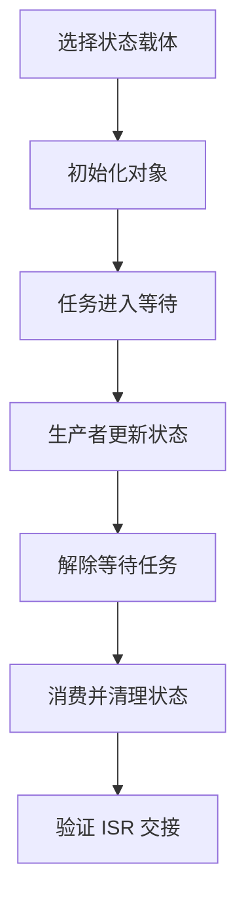
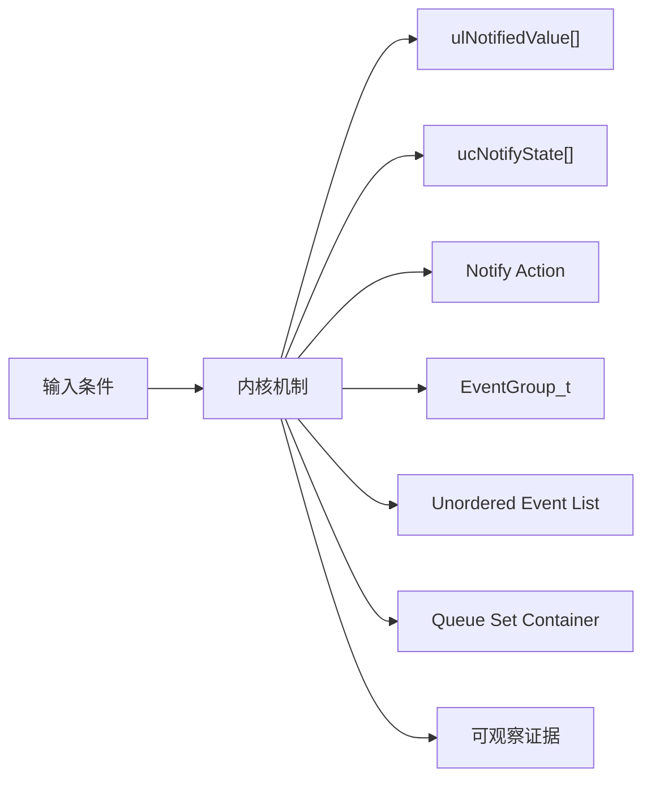
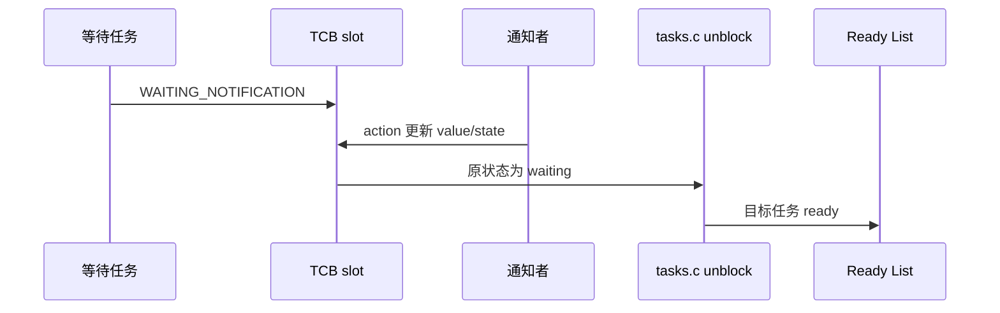
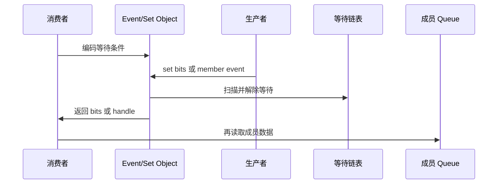
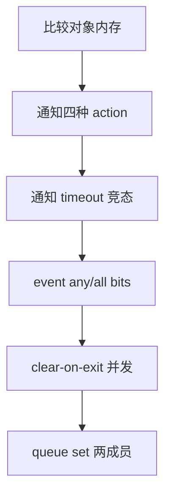
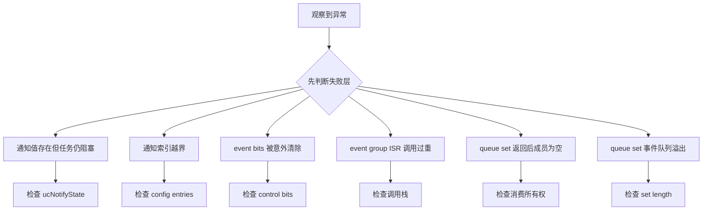

轻量同步并不等于语义相同：task notification 绑定一个目标 TCB，event group 表达位条件，queue set 转发哪个成员可读。

本篇只回答一个核心问题：**任务通知、事件组和 Queue Set 分别怎样保存状态、阻塞任务并传递唤醒原因？**

分析范围固定为 **FreeRTOS-Kernel V11.3.0**。所有函数、字段、宏和条件编译都以该 tag 为准。

本篇从三个对象的状态载体出发，分别追踪 notify/wait、set/wait bits 和 member/set queue，再用场景矩阵证明选型。

## 1. 三类轻量通信机制解决不同问题

不把这些机制当 queue 的性能替代品；选择依据是数据语义、等待者数量、所有权和 ISR 路径。



## 2. Notification slot、Event bits 与 Queue Set 成员

notification 把 value/state 放进 TCB；event group 把 bits 放进独立对象并编码等待条件；queue set 把成员 handle 当作另一个 queue 的数据。



| 对象 | 角色 | 必须保持的不变量 | 观察方法 | 常见误读 |
|---|---|---|---|---|
| ulNotifiedValue[] | 每个任务的通知值数组。 | 索引合法且由 action 定义更新语义。 | 记录旧新值。 | 只支持一个固定槽。 |
| ucNotifyState[] | 区分未等待、等待中、已收到。 | 状态与阻塞/返回路径一致。 | 记录状态迁移。 | 只看 value 判断是否阻塞。 |
| Notify Action | set bits/increment/overwrite/no-overwrite。 | 每种 action 遵守原子更新规则。 | 对比 eAction。 | 所有通知都只是加一。 |
| EventGroup_t | 保存 uxEventBits 与等待任务链表。 | 控制位不泄漏为用户 bits。 | 读 bits 和 list。 | 把 event bits 当计数器。 |
| Unordered Event List | item value 编码等待 bits 与控制标志。 | 解除时把返回 bits 带回任务。 | 解码 item value。 | 按优先级有序等待。 |
| Queue Set Container | 一个存放 member handle 的 queue。 | 成员每次变可读时推送一次有效事件。 | 读取 set storage。 | 从 set 取 handle 就自动取走成员数据。 |
| pxQueueSetContainer | 成员反向指向所属 set。 | 成员最多属于一个 set，移除时必须不可读。 | 检查指针。 | 运行中随意迁移非空成员。 |

## 3. 调用链一：任务通知 wait 与 notify

通知无需独立 Queue_t，发送者直接修改目标 TCB 的 value/state；目标正在等待时，再把它从状态链表移到 ready。



### 调用链一：xTaskGenericNotifyWait/Take -> TCB state -> xTaskGenericNotify/FromISR -> ready -> consume

任务通知把等待状态和通知值直接保存在目标 TCB 的槽位中。xTaskGenericNotifyWait 或 ulTaskNotifyTake 先在临界区检查是否已有可消费值；有值就按 clear/decrement 规则立即返回，没有值才设置 WAITING_NOTIFICATION，并在存在 timeout 时把任务放入 delayed list。

生产者调用 xTaskGenericNotify 或对应 FromISR API 时，根据 eAction 原子更新通知值，再检查旧状态是否正在等待。只有确实处于等待态的任务才需要从 delayed/state list 移出并进入 ready list；FromISR 版本仍通过 wake flag 把切换决定交给 port。

任务恢复后再次进入消费逻辑，得到更新后的值并把通知状态恢复为 NOT_WAITING。调试时必须把 slot index、通知 state、value、state-list container 和 API 的 clear/decrement 选项一起记录，否则相同数值可能对应完全不同的语义。

### 源码片段：通知值与状态直接嵌入 TCB

> 源码位置：`tasks.c` · `TCB_t notification fields` · `V11.3.0`
> 配置条件：configUSE_TASK_NOTIFICATIONS == 1
> 固定链接：[查看上游源码](https://github.com/FreeRTOS/FreeRTOS-Kernel/blob/V11.3.0/tasks.c)

```c
volatile uint32_t ulNotifiedValue[ configTASK_NOTIFICATION_ARRAY_ENTRIES ];
volatile uint8_t ucNotifyState[ configTASK_NOTIFICATION_ARRAY_ENTRIES ];
```

- 数组长度由配置确定。
- value 与 state 分开避免仅凭数值推断等待状态。
- 每个任务拥有自己的槽。
- 没有独立 queue storage 和等待接收者列表。

> **关键约束**：每个索引的 state 与 value 更新在内核临界区内保持一致。 **验证重点**：记录目标 TCB 索引的旧新值与状态。

### 源码片段：notify 先更新状态和值再解除等待

> 源码位置：`tasks.c` · `xTaskGenericNotify()` · `V11.3.0`
> 配置条件：configUSE_TASK_NOTIFICATIONS == 1
> 固定链接：[查看上游源码](https://github.com/FreeRTOS/FreeRTOS-Kernel/blob/V11.3.0/tasks.c)

```c
ucOriginalNotifyState = pxTCB->ucNotifyState[ uxIndexToNotify ];
pxTCB->ucNotifyState[ uxIndexToNotify ] = taskNOTIFICATION_RECEIVED;

switch( eAction )
{
    case eSetBits:
        pxTCB->ulNotifiedValue[ uxIndexToNotify ] |= ulValue;
        break;
    case eIncrement:
        ( pxTCB->ulNotifiedValue[ uxIndexToNotify ] )++;
        break;
}
```

- 保存原 state 用于判断目标是否在等待。
- state 先标记 received。
- action 决定 value 语义。
- 目标等待时后续移出 blocked list。

> **关键约束**：目标 ready 前通知值和 received 状态已经可见。 **验证重点**：trace notify 与 TCB slot。

## 4. 调用链二：event bits 与 queue set 事件转发

event group 可以一次解除多个满足 bit 条件的任务；queue set 只告诉消费者哪个成员可读，实际数据仍留在成员对象。



### 调用链二：wait bits / select set -> producer set/send -> condition scan / member handle enqueue -> task ready -> consume

Event Group 等待把 bit mask、wait-all 和 clear-on-exit 编码到任务事件节点。set bits 先更新 uxEventBits，再在 scheduler suspended 的一致窗口扫描所有等待者；满足条件的任务被解除，同时累积待清除 mask，扫描结束后才统一清位，因此同一轮扫描看到的是一致触发快照。

Queue Set 的路径不同。成员 queue/semaphore 从不可读变为可读时，只把“哪个成员就绪”的句柄写入 set 自身的 queue；xQueueSelectFromSet 返回该句柄后，消费者还必须调用对应成员 API 取走真实数据或 token。set 负责多路等待，不复制成员 payload。

两种机制都可能唤醒任务，但证据不同：Event Group 要记录 bits 前后值、每个 waiter 的 mask/flags 和 clear mask；Queue Set 要记录成员状态、set queue 中的 handle 与随后成员消费结果。

### 源码片段：event group 用 item value 编码等待条件

> 源码位置：`event_groups.c` · `xEventGroupWaitBits()` · `V11.3.0`
> 配置条件：configUSE_EVENT_GROUPS == 1
> 固定链接：[查看上游源码](https://github.com/FreeRTOS/FreeRTOS-Kernel/blob/V11.3.0/event_groups.c)

```c
uxControlBits = 0U;
if( xClearOnExit != pdFALSE )
{
    uxControlBits |= eventCLEAR_EVENTS_ON_EXIT_BIT;
}
if( xWaitForAllBits != pdFALSE )
{
    uxControlBits |= eventWAIT_FOR_ALL_BITS;
}
vTaskPlaceOnUnorderedEventList( &( pxEventBits->xTasksWaitingForBits ),
                                ( uxBitsToWaitFor | uxControlBits ),
                                xTicksToWait );
```

- 用户 mask 与内核控制位共存在 item value。
- 无序列表因为 value 不是时间/优先级排序键。
- 任务状态节点仍负责 timeout。
- set bits 时按 mask 和 flags 扫描。

> **关键约束**：用户可用 bits 不得占用保留控制位。 **验证重点**：解码 event list item value。

### 源码片段：queue set 把成员句柄写入容器 queue

> 源码位置：`queue.c` · `prvNotifyQueueSetContainer()` · `V11.3.0`
> 配置条件：configUSE_QUEUE_SETS == 1
> 固定链接：[查看上游源码](https://github.com/FreeRTOS/FreeRTOS-Kernel/blob/V11.3.0/queue.c)

```c
Queue_t * pxQueueSetContainer = pxQueue->pxQueueSetContainer;

if( pxQueueSetContainer->uxMessagesWaiting < pxQueueSetContainer->uxLength )
{
    xReturn = prvCopyDataToQueue( pxQueueSetContainer, &pxQueue, queueSEND_TO_BACK );
    if( listLIST_IS_EMPTY( &( pxQueueSetContainer->xTasksWaitingToReceive ) ) == pdFALSE )
    {
        xTaskRemoveFromEventList( &( pxQueueSetContainer->xTasksWaitingToReceive ) );
    }
}
```

- set 本身是存放 member handle 的 queue。
- 成员数据不复制到 set。
- set consumer 被唤醒后还要读取成员。
- 容器长度必须容纳成员可能产生的事件。

> **关键约束**：set 中每个事件句柄必须对应仍可从成员消费的事件。 **验证重点**：同时记录 set storage handle 与成员 messages/token。

## 5. 用同一事件分别验证通知、Event Group 与 Queue Set



### 配置矩阵

| 配置或条件 | 取值 A | 取值 B | 源码影响 | 验证重点 |
|---|---|---|---|---|
| configUSE_TASK_NOTIFICATIONS | 0 | 1 | 决定 TCB notification 字段和 API。 | 比较 TCB 大小。 |
| configTASK_NOTIFICATION_ARRAY_ENTRIES | 1 | 大于 1 | 决定每任务槽数量。 | 验证索引断言。 |
| configUSE_EVENT_GROUPS | 0 | 1 | 决定 EventGroup_t 和 API。 | 检查 event_groups.c 编译。 |
| configUSE_QUEUE_SETS | 0 | 1 | 决定 Queue_t container 字段和 set API。 | 检查结构布局。 |
| configUSE_TIMERS | 0 | 1 | 影响 event group FromISR 通过 pend function。 | 验证 timer daemon 路径。 |
| configUSE_PREEMPTION | 0 | 1 | 影响解除任务后的切换时机。 | 记录 wake/yield。 |

### 实验步骤

1. **比较对象内存。** 创建等价信号场景，并保存 TCB/heap/queue storage；只有说明 notification 轻量原因，这一步才算完成。
2. **通知四种 action。** 逐次发送。重点核对 value/state，结果应满足“语义与 action 一致”。
3. **通知 timeout 竞态。** 临界点注入 notify，把 state/container/return 保存为证据；判断依据是事件不丢失。
4. **event any/all bits。** 两个等待任务；观察 mask、flags、wake。若条件正确，即可进入下一步。
5. **clear-on-exit 并发。** 多个任务共享 bits，随后比较触发快照和 clear mask；预期是无误清。
6. **queue set 两成员。** queue+semaphore 加入 set。最后用 set handle 与 member 数据确认 select 后正确消费。

### 证据表

| 证据 | 获取方法 | 通过标准 | 失败说明 |
|---|---|---|---|
| 通知槽 | TCB value/state | 每次 action 状态一致 | 只看 value 会误判已收零值 |
| notify wake | state 原值和 ready list | waiting 时解除，非 waiting 只留值 | 无条件 wake 会重复 ready |
| event item value | 解码 mask/control | 用户 bits 与 flags 正确 | 控制位冲突会错误 clear/wait |
| event clear | set 前后 bits | 只清满足任务要求的集合 | 逐任务立即清会影响后续扫描 |
| set handle | set queue 内容 | 等于实际成员地址 | 错误 handle 会读错对象 |
| 成员可读性 | select 后检查 member | 对应数据/token 仍存在 | set 自己不保存业务数据 |

## 6. 从通知状态、bit 快照和成员句柄定位故障

先验证对象成员和链表归属，再检查锁、配置分支和调度请求。



| 现象 | 根因 | 第一检查点 | 应保存的证据 | 修复原则 |
|---|---|---|---|---|
| 通知值存在但任务仍阻塞 | state 与 value 操作不匹配 | 检查 ucNotifyState | wait/notify trace | 使用匹配的 wait/take 语义 |
| 通知索引越界 | 配置数组长度与调用索引不一致 | 检查 config entries | 断言和 TCB layout | 统一索引常量 |
| event bits 被意外清除 | clear-on-exit 与多个等待者理解错误 | 检查 control bits | set 扫描前后 bits | 按触发快照集中 clear |
| event group ISR 调用过重 | 直接调用非 ISR API | 检查调用栈 | timer pend queue | 使用 FromISR 延迟到 daemon |
| queue set 返回后成员为空 | 成员被其他消费者取走 | 检查消费所有权 | set handle/member trace | 保证单一消费路径或加同步 |
| queue set 事件队列溢出 | 容量小于成员可能事件数 | 检查 set length | messages 与 member capacity | 按官方容量规则设计 |
| 轻量机制选错后难扩展 | notification 绑定单 TCB/无多消费者 | 检查需求变化 | 对象/等待者图 | 按数据语义改用 queue/event |

## 7. 源码索引、阶段验收与面试表达

### 源码索引

| 文件 | 结构体 / 函数 / 宏 | 作用 |
|---|---|---|
| [tasks.c](https://github.com/FreeRTOS/FreeRTOS-Kernel/blob/V11.3.0/tasks.c) | notification TCB fields 与 generic APIs | 任务通知主线 |
| [event_groups.c](https://github.com/FreeRTOS/FreeRTOS-Kernel/blob/V11.3.0/event_groups.c) | EventGroup_t、wait/set/sync | 事件位同步 |
| [queue.c](https://github.com/FreeRTOS/FreeRTOS-Kernel/blob/V11.3.0/queue.c) | Queue Set create/add/select/notify | 成员事件多路复用 |
| [include/task.h](https://github.com/FreeRTOS/FreeRTOS-Kernel/blob/V11.3.0/include/task.h) | notification public API | 通知契约 |
| [include/event_groups.h](https://github.com/FreeRTOS/FreeRTOS-Kernel/blob/V11.3.0/include/event_groups.h) | event bit API 与保留位说明 | 事件组契约 |

### 阶段验收

1. 能解释 notification 无独立对象的原因。
2. 能区分通知 value 与 state。
3. 能跟踪 notify 到 ready。
4. 能解释 event wait item 编码。
5. 能推演 any/all 与 clear-on-exit。
6. 能解释 event group ISR 延迟路径。
7. 能说明 queue set 只转发 handle。
8. 能按语义选择三种机制。

### 面试表达

Task notification 直接复用目标 TCB 的 value/state 数组，因此内存和路径更短，但天然绑定目标任务，不适合任意多消费者数据队列。

Event group 的 event list item value 同时编码等待 bits 和 clear/all 控制标志，set bits 在一致扫描后集中应用 clear mask。

Queue Set 本质是存放成员 handle 的 queue；select 只返回哪个成员可读，业务数据仍必须从该成员消费。

### 参考资料

- [FreeRTOS-Kernel V11.3.0](https://github.com/FreeRTOS/FreeRTOS-Kernel/tree/V11.3.0)
- [FreeRTOS Kernel Book](https://github.com/FreeRTOS/FreeRTOS-Kernel-Book)

> 🏷️ FreeRTOS / Task Notification / Event Group / Queue Set / Synchronization
