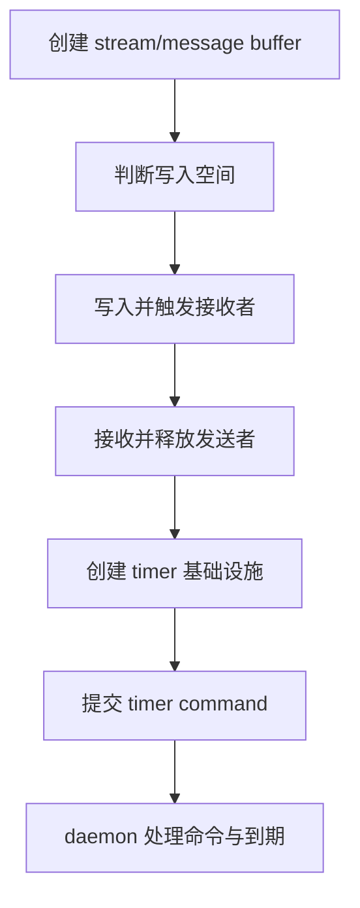
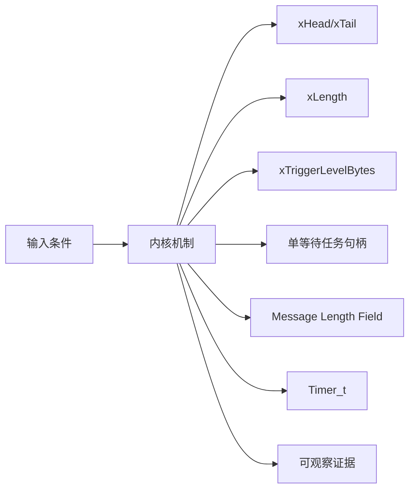
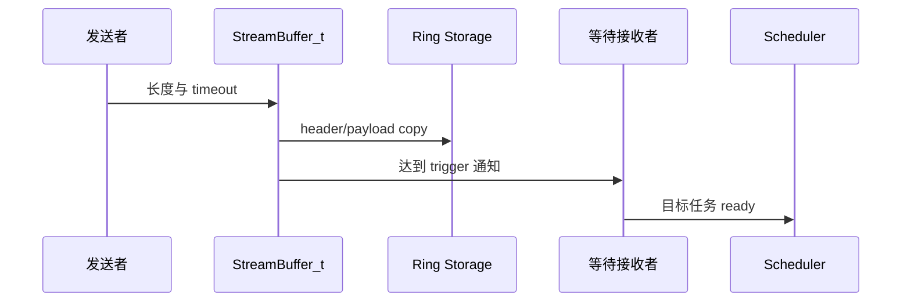
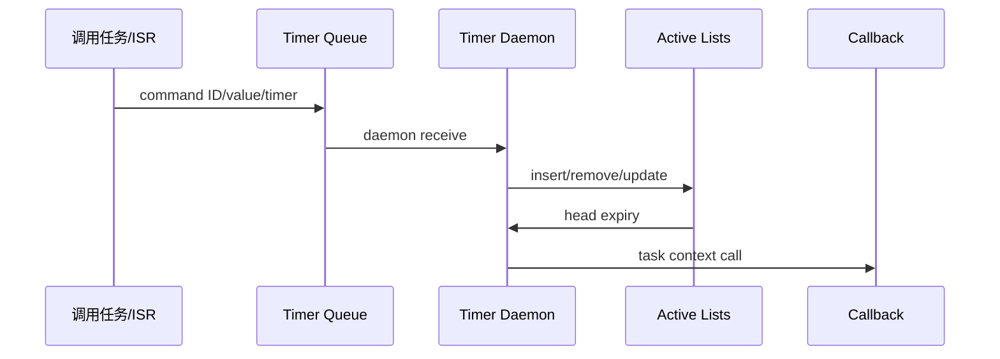
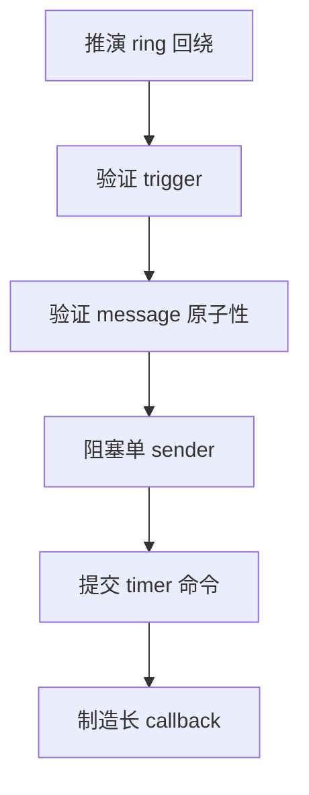
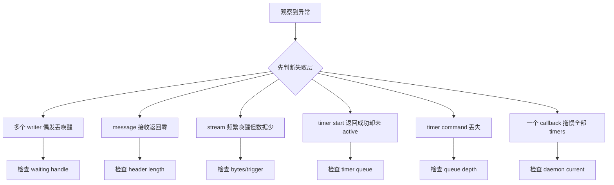

Stream Buffer 和软件定时器都依赖任务通知或 queue 完成异步交接，但一个传字节，一个传控制命令，不能混成同一套“后台任务”解释。

本篇只回答一个核心问题：**字节流、离散消息和软件定时器命令分别如何跨越调用者与等待任务/daemon task？**

分析范围固定为 **FreeRTOS-Kernel V11.3.0**。所有函数、字段、宏和条件编译都以该 tag 为准。

本篇先沿 head/tail 和 trigger level 推演 stream/message buffer，再单独沿 timer command queue、active lists 与 callback context 推演 timer。

## 1. 字节流、消息边界与延迟执行

Stream/Message Buffer 主线遵守单 writer、单 reader 契约；软件 timer callback 在 daemon task 上下文执行，不具备中断实时性。



## 2. 环形缓冲与 Timer daemon 的对象边界

StreamBuffer_t 用 head/tail 和两个任务句柄代替 queue 的等待链表；Timer_t 用 ListItem 排序到 active list，API 通过 xTimerQueue 异步改变它。



| 对象 | 角色 | 必须保持的不变量 | 观察方法 | 常见误读 |
|---|---|---|---|---|
| xHead/xTail | 下一写位置与下一读位置。 | 环形距离唯一决定 bytes/space。 | 记录回绕序列。 | 把 head==tail 当成满。 |
| xLength | 实际环形存储长度。 | 实现保留区分空满的空间。 | 比较容量 API。 | 认为可写字节等于 xLength。 |
| xTriggerLevelBytes | 解除接收等待者的字节阈值。 | 不超过 buffer size，零会归一为一。 | 记录 bytes 与 wake。 | 把它当 message 最大长度。 |
| 单等待任务句柄 | 保存唯一 waiting receiver/sender。 | 同方向最多一个等待任务。 | 检查句柄 NULL 断言。 | 允许多个 writer 无外部锁。 |
| Message Length Field | 在 payload 前编码长度。 | 整条消息要么完整写入，要么不写。 | 查看 header/payload。 | 允许接收一半消息。 |
| Timer_t | 保存 period、callback、ID、status 和 list item。 | active timer 的 item value 对应 expiry。 | 记录 active list。 | API 调用直接修改 timer。 |
| xTimerQueue | 传递 start/stop/change/delete 与 pended call。 | 命令顺序由 queue 保持。 | 记录 message ID/value。 | callback 与 API 调用者同上下文。 |
| Timer Daemon | 消费命令、等待最近 expiry、执行 callback。 | callback 串行且不能长时间阻塞。 | daemon runtime/queue depth。 | 把 timer 精度当硬件中断精度。 |

## 3. 调用链一：Stream/Message Buffer 写入、阻塞与唤醒

发送者先计算空间；Message Buffer 还需容纳长度字段。成功 copy 后只有达到 trigger 才通知等待接收者。



### 调用链一：xStreamBufferSend -> space/message length -> prvWriteBytesToBuffer -> sbSEND_COMPLETED -> task notification

xStreamBufferSend 先计算本次写入需要的空间。Stream Buffer 只计算 payload，Message Buffer 还要计入消息长度头，而且一条消息必须整体容纳，不能只写一部分。空间不足并允许等待时，只能登记一个 xTaskWaitingToSend，这正是 single-writer 契约的一部分。

空间足够后，prvWriteBytesToBuffer 按 head 到缓冲区末尾的距离决定一次或两次 memcpy，再原子提交新 head。写入完成后，只有累计字节达到 trigger level 才通过 sbSEND_COMPLETED 通知接收者。接收端按相同环形规则移动 tail；Message Buffer 先读取长度头，并保证一次返回不跨消息边界。

接收释放空间后会通知唯一等待发送者重试。调试时应同时记录 head、tail、space、bytes、trigger level、消息头和两个等待任务句柄；仅看返回长度无法区分容量不足、触发阈值未达或并发契约被破坏。

### 源码片段：StreamBuffer_t 保存环形状态与唯一等待者

> 源码位置：`stream_buffer.c` · `StreamBuffer_t` · `V11.3.0`
> 配置条件：configUSE_STREAM_BUFFERS == 1
> 固定链接：[查看上游源码](https://github.com/FreeRTOS/FreeRTOS-Kernel/blob/V11.3.0/stream_buffer.c)

```c
typedef struct StreamBufferDef_t
{
    volatile size_t xTail;
    volatile size_t xHead;
    size_t xLength;
    size_t xTriggerLevelBytes;
    volatile TaskHandle_t xTaskWaitingToReceive;
    volatile TaskHandle_t xTaskWaitingToSend;
    uint8_t * pucBuffer;
    uint8_t ucFlags;
} StreamBuffer_t;
```

- head/tail 是索引而不是裸指针。
- trigger 控制接收者 wake。
- 等待者用单一 handle 而非 List_t。
- flags 区分 message/static/callback 等语义。

> **关键约束**：同一方向最多一个等待任务，bytes/space 与 head/tail 一致。 **验证重点**：记录 head、tail、bytes、space 和两个 handle。

### 源码片段：发送者阻塞通过任务通知等待空间

> 源码位置：`stream_buffer.c` · `xStreamBufferSend()` · `V11.3.0`
> 配置条件：stream/message buffer task API
> 固定链接：[查看上游源码](https://github.com/FreeRTOS/FreeRTOS-Kernel/blob/V11.3.0/stream_buffer.c)

```c
configASSERT( pxStreamBuffer->xTaskWaitingToSend == NULL );
pxStreamBuffer->xTaskWaitingToSend = xTaskGetCurrentTaskHandle();

( void ) xTaskNotifyWait( 0U, 0U, NULL, xTicksToWait );

pxStreamBuffer->xTaskWaitingToSend = NULL;
```

- 断言体现单 waiting sender 契约。
- handle 在阻塞前写入。
- notification 只用作唤醒，不携带 payload。
- 恢复后清 handle 并重新计算空间。

> **关键约束**：等待句柄非空期间不会有第二发送任务进入同一路径。 **验证重点**：记录 handle、notification state 与实际 space。

## 4. 调用链二：Timer API 到 daemon callback

start/change/stop API 只是向 timer queue 发送命令；Timer_t 的 active list 和 callback 都由 daemon task 修改和执行。



### 调用链二：xTimerGenericCommandFromTask/ISR -> xTimerQueue -> prvTimerTask -> active list -> callback/reload

软件定时器 API 不在调用者上下文直接修改 active timer list，也不执行 callback。xTimerGenericCommandFromTask/ISR 把 command ID、timer handle 和时间参数封装成 DaemonTaskMessage_t，并发送到 xTimerQueue；API 的成功只表示命令入队，不表示 callback 已执行。

prvTimerTask 是 timer 对象状态的单线程所有者。它取出命令后更新 Timer_t 状态，根据 command time、period 和当前 Tick 把定时器插入当前或 overflow active list，然后按最近到期时间阻塞在受限 queue wait 上，同时仍能被新命令唤醒重算等待时间。

到期后 daemon 在自己的任务上下文调用 callback；auto-reload timer 再计算下一个 expiry 并重新入表。验证定时器时要区分命令入队时间、daemon 处理时间、expiry 和 callback 完成时间，callback 过长会阻塞同一 daemon 上的所有其他 timer。

### 源码片段：Timer_t 用 ListItem 表达到期时间

> 源码位置：`timers.c` · `Timer_t` · `V11.3.0`
> 配置条件：configUSE_TIMERS == 1
> 固定链接：[查看上游源码](https://github.com/FreeRTOS/FreeRTOS-Kernel/blob/V11.3.0/timers.c)

```c
typedef struct tmrTimerControl
{
    const char * pcTimerName;
    ListItem_t xTimerListItem;
    TickType_t xTimerPeriodInTicks;
    void * pvTimerID;
    TimerCallbackFunction_t pxCallbackFunction;
    uint8_t ucStatus;
} Timer_t;
```

- timer name 只用于调试。
- list item owner 会指回 Timer_t。
- period 与 expiry item value 分开。
- status 编码 active/auto reload/static。

> **关键约束**：active timer 的 list item container 与 active status 一致。 **验证重点**：记录 status、period、item value 和 container。

### 源码片段：Timer API 通过 command queue 异步交给 daemon

> 源码位置：`timers.c` · `xTimerGenericCommandFromTask()` · `V11.3.0`
> 配置条件：configUSE_TIMERS == 1
> 固定链接：[查看上游源码](https://github.com/FreeRTOS/FreeRTOS-Kernel/blob/V11.3.0/timers.c)

```c
xMessage.xMessageID = xCommandID;
xMessage.u.xTimerParameters.xMessageValue = xOptionalValue;
xMessage.u.xTimerParameters.pxTimer = xTimer;

if( xTaskGetSchedulerState() == taskSCHEDULER_RUNNING )
{
    xReturn = xQueueSendToBack( xTimerQueue, &xMessage, xTicksToWait );
}
else
{
    xReturn = xQueueSendToBack( xTimerQueue, &xMessage, tmrNO_DELAY );
}
```

- message 冻结命令与时间值。
- scheduler 未运行时不能阻塞发送。
- enqueue 成功不等于 timer 已经改变。
- FromISR 使用单独 queue API 和 wake flag。

> **关键约束**：只有 daemon 消费命令后才改变 active list 和执行 callback。 **验证重点**：关联 command enqueue、daemon receive 与 Timer_t list mutation。

## 5. 验证环形边界、消息原子性与 Timer daemon 串行语义



### 配置矩阵

| 配置或条件 | 取值 A | 取值 B | 源码影响 | 验证重点 |
|---|---|---|---|---|
| configUSE_STREAM_BUFFERS | 0 | 1 | 决定 stream/message buffer 模块。 | 检查源码是否编译。 |
| configUSE_SB_COMPLETED_CALLBACK | 0 | 1 | 决定完成 callback 字段和路径。 | 比较结构布局。 |
| configMESSAGE_BUFFER_LENGTH_TYPE | size_t | 更窄类型 | 决定 message header 宽度。 | 验证最大消息。 |
| configUSE_TIMERS | 0 | 1 | 决定 timer queue/daemon。 | scheduler start 检查。 |
| configTIMER_QUEUE_LENGTH | 较小 | 较大 | 决定命令突发承载。 | 观察 queue full。 |
| configTIMER_TASK_PRIORITY | 较低 | 较高 | 影响命令与 callback 延迟。 | 记录 daemon 调度。 |

### 实验步骤

1. **推演 ring 回绕。** 写入跨 buffer end 的字节，并保存 head/tail/storage；只有读出顺序一致，这一步才算完成。
2. **验证 trigger。** 逐步写到阈值。重点核对 bytes 与 receiver wake，结果应满足“仅达阈值唤醒”。
3. **验证 message 原子性。** 空间不足整条消息，把 header/payload/head 保存为证据；判断依据是不写半条消息。
4. **阻塞单 sender。** 填满 message buffer；观察 waiting handle/notify。若读后正确重试，即可进入下一步。
5. **提交 timer 命令。** start/change/stop 连续发送，随后比较 queue message 顺序；预期是 daemon 按序处理。
6. **制造长 callback。** 记录 daemon 与其他 timers。最后用 callback duration/next expiry 证明串行延迟影响。

### 证据表

| 证据 | 获取方法 | 通过标准 | 失败说明 |
|---|---|---|---|
| ring 距离 | head/tail/bytes API | 公式和实际数据一致 | 错误会导致覆盖或假空 |
| 等待句柄 | 两个 task handle | 每方向最多一个 | 多 writer 会互相覆盖句柄 |
| message header | 内存 dump 与返回长度 | 完整 header+payload | header 损坏会错读长度 |
| trigger wake | bytes/trigger/notify trace | 达到阈值后唤醒 | 过早 wake 增加空运行 |
| timer command | queue message 与 daemon trace | enqueue 与生效有明确间隔 | 把返回值当已执行会竞态 |
| callback context | current task 和调用栈 | current 为 timer daemon | 阻塞会延迟全部 timer |

## 6. 从 head/tail 与 daemon 队列定位缓冲和定时器故障

先验证对象成员和链表归属，再检查锁、配置分支和调度请求。



| 现象 | 根因 | 第一检查点 | 应保存的证据 | 修复原则 |
|---|---|---|---|---|
| 多个 writer 偶发丢唤醒 | 违反单 waiting sender 契约 | 检查 waiting handle | 任务 ID 与通知 trace | 外部互斥或改用 queue |
| message 接收返回零 | 目标缓冲小于完整消息 | 检查 header length | buffer size 与 bytes | 先查询/提供足够空间 |
| stream 频繁唤醒但数据少 | trigger 设置过低 | 检查 bytes/trigger | wake 次数和批量大小 | 按处理粒度设置阈值 |
| timer start 返回成功却未 active | 命令只入队尚未被 daemon 消费 | 检查 timer queue | enqueue/receive/list trace | 按异步语义等待状态 |
| timer command 丢失 | queue 太短或 ISR 忽略返回值 | 检查 queue depth | API return 与 messages | 增大容量/处理失败 |
| 一个 callback 拖慢全部 timers | callback 阻塞或计算过长 | 检查 daemon current | callback duration | 把工作投递给业务任务 |
| Tick 回绕后 timer 异常 | active/overflow list 插入或交换错误 | 检查两条 list | Tick/expiry/container | 使用 timer helper |

## 7. 源码索引、阶段验收与面试表达

### 源码索引

| 文件 | 结构体 / 函数 / 宏 | 作用 |
|---|---|---|
| [stream_buffer.c](https://github.com/FreeRTOS/FreeRTOS-Kernel/blob/V11.3.0/stream_buffer.c) | StreamBuffer_t、send/receive | 字节流与消息主线 |
| [include/stream_buffer.h](https://github.com/FreeRTOS/FreeRTOS-Kernel/blob/V11.3.0/include/stream_buffer.h) | 公开 stream API | 接口契约 |
| [include/message_buffer.h](https://github.com/FreeRTOS/FreeRTOS-Kernel/blob/V11.3.0/include/message_buffer.h) | message 宏与长度语义 | 离散消息接口 |
| [timers.c](https://github.com/FreeRTOS/FreeRTOS-Kernel/blob/V11.3.0/timers.c) | Timer_t、command queue、daemon | 软件定时器主线 |
| [include/timers.h](https://github.com/FreeRTOS/FreeRTOS-Kernel/blob/V11.3.0/include/timers.h) | timer API 与配置 | 公开命令契约 |

### 阶段验收

1. 能推演 head/tail 回绕。
2. 能解释 trigger level。
3. 能说明单 writer/reader 契约。
4. 能解释 message length header。
5. 能跟踪 timer command queue。
6. 能区分 API enqueue 与 timer 生效。
7. 能解释 active/overflow timer list。
8. 能说明 callback 阻塞影响。

### 面试表达

Stream Buffer 用单一 waiting sender/receiver handle 配合 task notification，因此轻量但要求单 writer、单 reader；多生产者需要外部串行化。

Message Buffer 在 payload 前存长度，空间不足整条消息时不写入半条消息，接收缓冲也必须容纳完整消息。

软件 timer API 只向 xTimerQueue 投递命令，active list 修改和 callback 都在 timer daemon task 中串行执行。

### 参考资料

- [FreeRTOS-Kernel V11.3.0](https://github.com/FreeRTOS/FreeRTOS-Kernel/tree/V11.3.0)
- [FreeRTOS Kernel Book](https://github.com/FreeRTOS/FreeRTOS-Kernel-Book)

> 🏷️ FreeRTOS / Stream Buffer / Message Buffer / Software Timer / Timer Daemon
