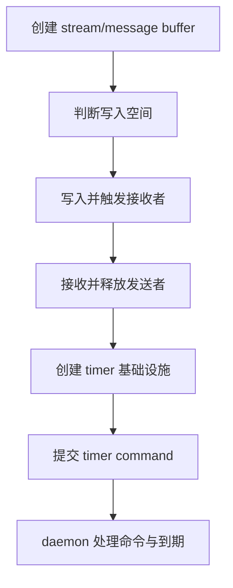
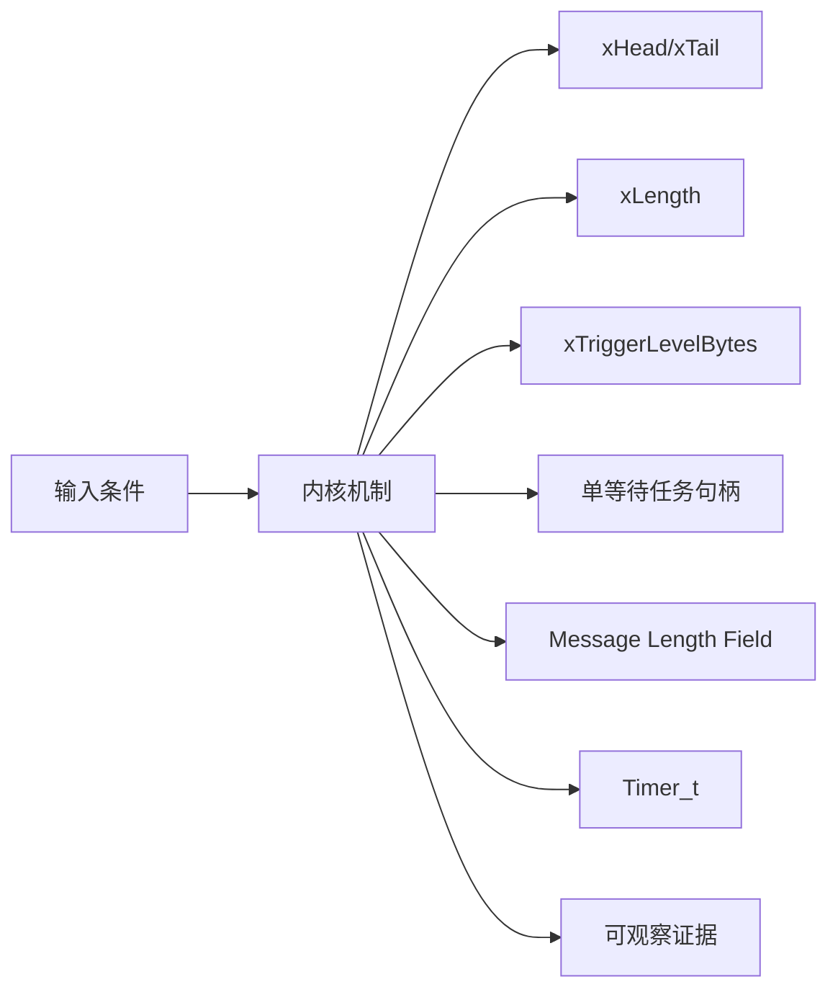
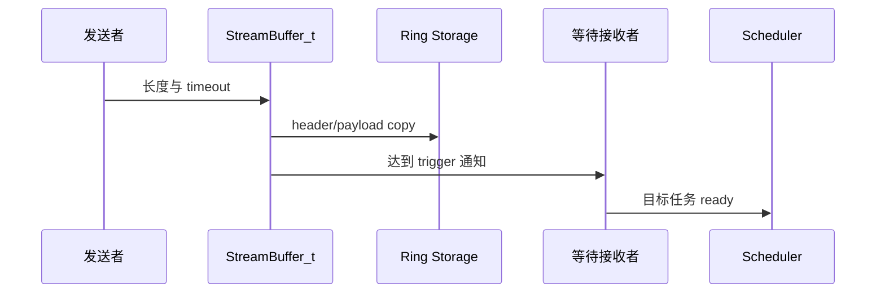
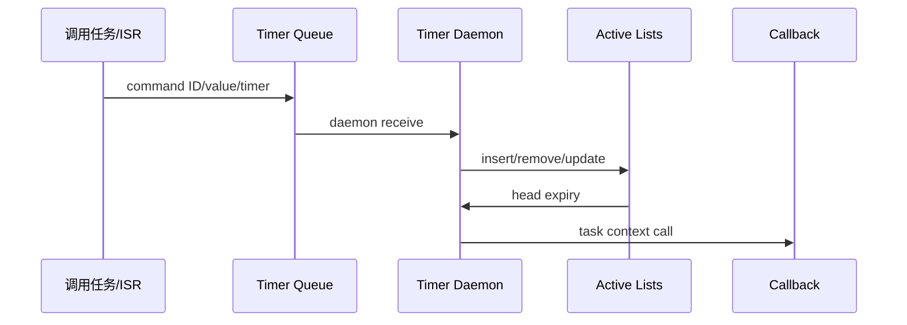
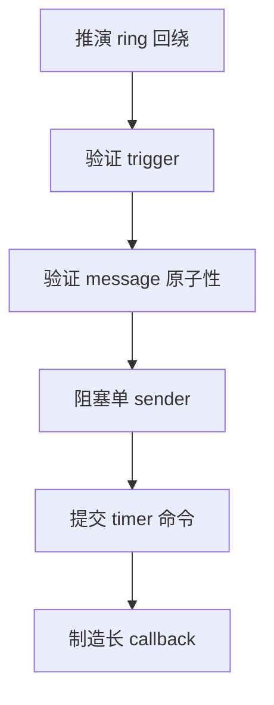
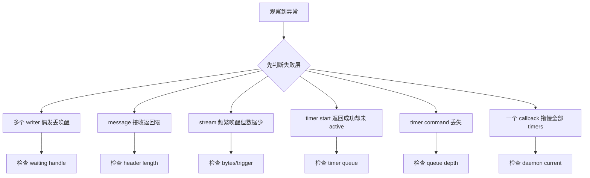

Stream Buffer 和软件定时器都依赖任务通知或 queue 完成异步交接，但一个传字节，一个传控制命令，不能混成同一套“后台任务”解释。

本篇只回答一个核心问题：**字节流、离散消息和软件定时器命令分别如何跨越调用者与等待任务/daemon task？**

分析范围固定为 **FreeRTOS-Kernel V11.3.0**。所有函数、字段、宏和条件编译都以该 tag 为准。

本篇先沿 head/tail 和 trigger level 推演 stream/message buffer，再单独沿 timer command queue、active lists 与 callback context 推演 timer。

## 1. 问题边界、前置条件与验收证据

Stream/Message Buffer 主线遵守单 writer、单 reader 契约；软件 timer callback 在 daemon task 上下文执行，不具备中断实时性。

读者已经会使用基本任务 API，但不能把 API 行为替代为源码证明。

阅读源码前先写清输入状态、允许的状态变化和输出证据。只看函数名或最终返回值，无法判断链表、锁和调度点是否正确。



| 顺序 | 阅读动作 | 入口条件 | 状态变化 | 验收证据 |
|---:|---|---|---|---|
| 1 | 创建 stream/message buffer | 容量与 trigger 合法。 | 空对象不变量成立。 | 字段快照。 |
| 2 | 判断写入空间 | 发送长度已知。 | 决定立即写或等待。 | space/required。 |
| 3 | 写入并触发接收者 | 空间足够。 | head 前移，bytes 增加。 | payload 与 head。 |
| 4 | 接收并释放发送者 | bytes/message 完整。 | tail 前移，space 增加。 | 返回长度和 tail。 |
| 5 | 创建 timer 基础设施 | configUSE_TIMERS。 | daemon 可创建。 | TmrQ 与 daemon TCB。 |
| 6 | 提交 timer command | 任务或 ISR 调 API。 | 只改变 queue，不立即改 active list。 | command trace。 |
| 7 | daemon 处理命令与到期 | daemon 获得 CPU。 | 到期 callback 执行并 auto reload。 | expiry/callback trace。 |

### 1. 创建 stream/message buffer

入口条件：容量与 trigger 合法。

执行动作：初始化 head/tail/flags/storage/wait handles。

核心状态变化：空对象不变量成立。

离开这一步时必须成立：内存归属明确。

可观察证据：字段快照。

停止条件：trigger 超范围时停止。

### 2. 判断写入空间

入口条件：发送长度已知。

执行动作：计算 space 和 message header。

核心状态变化：决定立即写或等待。

离开这一步时必须成立：单 writer 契约。

可观察证据：space/required。

停止条件：长度溢出时停止。

### 3. 写入并触发接收者

入口条件：空间足够。

执行动作：分段 copy 处理回绕。

核心状态变化：head 前移，bytes 增加。

离开这一步时必须成立：写完成后通知。

可观察证据：payload 与 head。

停止条件：先 notify 后 copy 时停止。

### 4. 接收并释放发送者

入口条件：bytes/message 完整。

执行动作：读取 header/payload。

核心状态变化：tail 前移，space 增加。

离开这一步时必须成立：读完成后通知。

可观察证据：返回长度和 tail。

停止条件：目标 buffer 太小时停止。

### 5. 创建 timer 基础设施

入口条件：configUSE_TIMERS。

执行动作：初始化两条 active list 与 command queue。

核心状态变化：daemon 可创建。

离开这一步时必须成立：scheduler start 前。

可观察证据：TmrQ 与 daemon TCB。

停止条件：queue 创建失败时停止。

### 6. 提交 timer command

入口条件：任务或 ISR 调 API。

执行动作：构造 command ID/value/timer pointer。

核心状态变化：只改变 queue，不立即改 active list。

离开这一步时必须成立：queue API context。

可观察证据：command trace。

停止条件：误判 API 返回为 timer 已执行时停止。

### 7. daemon 处理命令与到期

入口条件：daemon 获得 CPU。

执行动作：消费 command、插入/移除 timer、等待 head。

核心状态变化：到期 callback 执行并 auto reload。

离开这一步时必须成立：daemon task context。

可观察证据：expiry/callback trace。

停止条件：callback 阻塞时停止。

## 2. 核心数据结构、所有权与不变量

StreamBuffer_t 用 head/tail 和两个任务句柄代替 queue 的等待链表；Timer_t 用 ListItem 排序到 active list，API 通过 xTimerQueue 异步改变它。

这里不把字段当作词汇表，而是解释字段由谁修改、在哪个临界区修改、它和哪个链表或对象保持一致。



| 对象 | 角色 | 必须保持的不变量 | 观察方法 | 常见误读 |
|---|---|---|---|---|
| xHead/xTail | 下一写位置与下一读位置。 | 环形距离唯一决定 bytes/space。 | 记录回绕序列。 | 把 head==tail 当成满。 |
| xLength | 实际环形存储长度。 | 实现保留区分空满的空间。 | 比较容量 API。 | 认为可写字节等于 xLength。 |
| xTriggerLevelBytes | 解除接收等待者的字节阈值。 | 不超过 buffer size，零会归一为一。 | 记录 bytes 与 wake。 | 把它当 message 最大长度。 |
| 单等待任务句柄 | 保存唯一 waiting receiver/sender。 | 同方向最多一个等待任务。 | 检查句柄 NULL 断言。 | 允许多个 writer 无外部锁。 |
| Message Length Field | 在 payload 前编码长度。 | 整条消息要么完整写入，要么不写。 | 查看 header/payload。 | 允许接收一半消息。 |
| Timer_t | 保存 period、callback、ID、status 和 list item。 | active timer 的 item value 对应 expiry。 | 记录 active list。 | API 调用直接修改 timer。 |
| xTimerQueue | 传递 start/stop/change/delete 与 pended call。 | 命令顺序由 queue 保持。 | 记录 message ID/value。 | callback 与 API 调用者同上下文。 |
| Timer Daemon | 消费命令、等待最近 expiry、执行 callback。 | callback 串行且不能长时间阻塞。 | daemon runtime/queue depth。 | 把 timer 精度当硬件中断精度。 |

### xHead/xTail

角色：下一写位置与下一读位置。

所有权：StreamBuffer_t。

不变量：环形距离唯一决定 bytes/space。

变化时机：send/receive。

观察方法：记录回绕序列。

常见误读：把 head==tail 当成满。

### xLength

角色：实际环形存储长度。

所有权：StreamBuffer_t。

不变量：实现保留区分空满的空间。

变化时机：创建/reset。

观察方法：比较容量 API。

常见误读：认为可写字节等于 xLength。

### xTriggerLevelBytes

角色：解除接收等待者的字节阈值。

所有权：StreamBuffer_t。

不变量：不超过 buffer size，零会归一为一。

变化时机：send 后。

观察方法：记录 bytes 与 wake。

常见误读：把它当 message 最大长度。

### 单等待任务句柄

角色：保存唯一 waiting receiver/sender。

所有权：StreamBuffer_t。

不变量：同方向最多一个等待任务。

变化时机：阻塞 send/receive。

观察方法：检查句柄 NULL 断言。

常见误读：允许多个 writer 无外部锁。

### Message Length Field

角色：在 payload 前编码长度。

所有权：Message Buffer 逻辑。

不变量：整条消息要么完整写入，要么不写。

变化时机：message send/receive。

观察方法：查看 header/payload。

常见误读：允许接收一半消息。

### Timer_t

角色：保存 period、callback、ID、status 和 list item。

所有权：timers.c。

不变量：active timer 的 item value 对应 expiry。

变化时机：command 处理/reload。

观察方法：记录 active list。

常见误读：API 调用直接修改 timer。

### xTimerQueue

角色：传递 start/stop/change/delete 与 pended call。

所有权：timer module。

不变量：命令顺序由 queue 保持。

变化时机：任务/ISR API。

观察方法：记录 message ID/value。

常见误读：callback 与 API 调用者同上下文。

### Timer Daemon

角色：消费命令、等待最近 expiry、执行 callback。

所有权：prvTimerTask。

不变量：callback 串行且不能长时间阻塞。

变化时机：scheduler 运行后。

观察方法：daemon runtime/queue depth。

常见误读：把 timer 精度当硬件中断精度。

## 3. 调用链一：Stream/Message Buffer 写入、阻塞与唤醒

发送者先计算空间；Message Buffer 还需容纳长度字段。成功 copy 后只有达到 trigger 才通知等待接收者。

调用链中的每一跳都要区分普通函数调用、宏展开、临界区边界和可能触发调度的 port hook。



### 调用链一：xStreamBufferSend -> space/message length -> prvWriteBytesToBuffer -> sbSEND_COMPLETED -> task notification

#### 链路步骤 1：计算所需空间

进入时：输入长度已知。

本步读取：flags/length/header size。

本步修改：required bytes。

并发边界：单 writer。

返回或转交：判断能否原子写。

证据：space trace。

#### 链路步骤 2：记录等待发送者

进入时：空间不足且允许等待。

本步读取：xTaskWaitingToSend。

本步修改：唯一 task handle。

并发边界：scheduler/notification。

返回或转交：任务 blocked。

证据：handle/state。

#### 链路步骤 3：分段 copy

进入时：空间满足。

本步读取：head、buffer end。

本步修改：payload/header 与新 head。

并发边界：writer 独占。

返回或转交：数据完整。

证据：内存 dump。

#### 链路步骤 4：检查 trigger

进入时：copy 完成。

本步读取：bytes in buffer/trigger。

本步修改：无或 notify receiver。

并发边界：状态已可见。

返回或转交：wake 条件正确。

证据：bytes/handle。

#### 链路步骤 5：接收者消费

进入时：目标运行。

本步读取：message header 或 requested length。

本步修改：tail 和 return length。

并发边界：single reader。

返回或转交：不跨消息边界。

证据：return/data。

#### 链路步骤 6：通知等待发送者

进入时：space 增加。

本步读取：xTaskWaitingToSend。

本步修改：sender notification/handle clear。

并发边界：读完成后。

返回或转交：发送者可重试。

证据：notify trace。

### 源码片段：StreamBuffer_t 保存环形状态与唯一等待者

> 源码位置：`stream_buffer.c` · `StreamBuffer_t` · `V11.3.0`
> 配置条件：configUSE_STREAM_BUFFERS == 1
> 固定链接：[查看上游源码](https://github.com/FreeRTOS/FreeRTOS-Kernel/blob/V11.3.0/stream_buffer.c)

```c
typedef struct StreamBufferDef_t
{
    volatile size_t xTail;
    volatile size_t xHead;
    size_t xLength;
    size_t xTriggerLevelBytes;
    volatile TaskHandle_t xTaskWaitingToReceive;
    volatile TaskHandle_t xTaskWaitingToSend;
    uint8_t * pucBuffer;
    uint8_t ucFlags;
} StreamBuffer_t;
```

这段摘录只保留当前机制需要的语句；省略的参数检查、trace hook 或条件分支必须回到固定链接核对。

解读 1：head/tail 是索引而不是裸指针。

解读 2：trigger 控制接收者 wake。

解读 3：等待者用单一 handle 而非 List_t。

解读 4：flags 区分 message/static/callback 等语义。

不变量：同一方向最多一个等待任务，bytes/space 与 head/tail 一致。

观察点：记录 head、tail、bytes、space 和两个 handle。

### 源码片段：发送者阻塞通过任务通知等待空间

> 源码位置：`stream_buffer.c` · `xStreamBufferSend()` · `V11.3.0`
> 配置条件：stream/message buffer task API
> 固定链接：[查看上游源码](https://github.com/FreeRTOS/FreeRTOS-Kernel/blob/V11.3.0/stream_buffer.c)

```c
configASSERT( pxStreamBuffer->xTaskWaitingToSend == NULL );
pxStreamBuffer->xTaskWaitingToSend = xTaskGetCurrentTaskHandle();

( void ) xTaskNotifyWait( 0U, 0U, NULL, xTicksToWait );

pxStreamBuffer->xTaskWaitingToSend = NULL;
```

这段摘录只保留当前机制需要的语句；省略的参数检查、trace hook 或条件分支必须回到固定链接核对。

解读 1：断言体现单 waiting sender 契约。

解读 2：handle 在阻塞前写入。

解读 3：notification 只用作唤醒，不携带 payload。

解读 4：恢复后清 handle 并重新计算空间。

不变量：等待句柄非空期间不会有第二发送任务进入同一路径。

观察点：记录 handle、notification state 与实际 space。

## 4. 调用链二：Timer API 到 daemon callback

start/change/stop API 只是向 timer queue 发送命令；Timer_t 的 active list 和 callback 都由 daemon task 修改和执行。

第二条链用于验证同一对象在另一条执行路径上的行为，重点检查它是否复用相同不变量，还是进入 ISR、daemon 或 portable 层的特殊规则。



### 调用链二：xTimerGenericCommandFromTask/ISR -> xTimerQueue -> prvTimerTask -> active list -> callback/reload

#### 链路步骤 1：构造命令

进入时：timer handle 有效。

本步读取：command ID、value、pointer。

本步修改：message。

并发边界：调用者上下文。

返回或转交：参数冻结。

证据：trace command。

#### 链路步骤 2：发送队列

进入时：queue 已创建。

本步读取：timeout 或 FromISR flag。

本步修改：xTimerQueue messages。

并发边界：queue 规则。

返回或转交：API 返回 enqueue 结果。

证据：queue depth。

#### 链路步骤 3：daemon 取命令

进入时：daemon 被调度。

本步读取：message ID。

本步修改：Timer_t status/list。

并发边界：daemon 单线程所有权。

返回或转交：命令生效。

证据：receive trace。

#### 链路步骤 4：插入 active list

进入时：start/change 命令。

本步读取：command time、period、now。

本步修改：expiry item value。

并发边界：scheduler suspend for list wait。

返回或转交：进入 current/overflow list。

证据：list snapshot。

#### 链路步骤 5：等待最近到期

进入时：命令已清空。

本步读取：head expiry/current time。

本步修改：daemon block time。

并发边界：restricted queue wait。

返回或转交：按 Tick 唤醒。

证据：next expiry。

#### 链路步骤 6：执行并重载

进入时：timer 到期。

本步读取：callback/status/auto reload。

本步修改：应用状态与下次 expiry。

并发边界：daemon task context。

返回或转交：一次 callback 完成。

证据：callback duration。

### 源码片段：Timer_t 用 ListItem 表达到期时间

> 源码位置：`timers.c` · `Timer_t` · `V11.3.0`
> 配置条件：configUSE_TIMERS == 1
> 固定链接：[查看上游源码](https://github.com/FreeRTOS/FreeRTOS-Kernel/blob/V11.3.0/timers.c)

```c
typedef struct tmrTimerControl
{
    const char * pcTimerName;
    ListItem_t xTimerListItem;
    TickType_t xTimerPeriodInTicks;
    void * pvTimerID;
    TimerCallbackFunction_t pxCallbackFunction;
    uint8_t ucStatus;
} Timer_t;
```

这段摘录只保留当前机制需要的语句；省略的参数检查、trace hook 或条件分支必须回到固定链接核对。

解读 1：timer name 只用于调试。

解读 2：list item owner 会指回 Timer_t。

解读 3：period 与 expiry item value 分开。

解读 4：status 编码 active/auto reload/static。

不变量：active timer 的 list item container 与 active status 一致。

观察点：记录 status、period、item value 和 container。

### 源码片段：Timer API 通过 command queue 异步交给 daemon

> 源码位置：`timers.c` · `xTimerGenericCommandFromTask()` · `V11.3.0`
> 配置条件：configUSE_TIMERS == 1
> 固定链接：[查看上游源码](https://github.com/FreeRTOS/FreeRTOS-Kernel/blob/V11.3.0/timers.c)

```c
xMessage.xMessageID = xCommandID;
xMessage.u.xTimerParameters.xMessageValue = xOptionalValue;
xMessage.u.xTimerParameters.pxTimer = xTimer;

if( xTaskGetSchedulerState() == taskSCHEDULER_RUNNING )
{
    xReturn = xQueueSendToBack( xTimerQueue, &xMessage, xTicksToWait );
}
else
{
    xReturn = xQueueSendToBack( xTimerQueue, &xMessage, tmrNO_DELAY );
}
```

这段摘录只保留当前机制需要的语句；省略的参数检查、trace hook 或条件分支必须回到固定链接核对。

解读 1：message 冻结命令与时间值。

解读 2：scheduler 未运行时不能阻塞发送。

解读 3：enqueue 成功不等于 timer 已经改变。

解读 4：FromISR 使用单独 queue API 和 wake flag。

不变量：只有 daemon 消费命令后才改变 active list 和执行 callback。

观察点：关联 command enqueue、daemon receive 与 Timer_t list mutation。

## 5. 配置矩阵、观测实验与证据记录

使用可控输入和 trace hook 观察对象变化，不依赖特定开发板。

实验只承诺观察软件状态和调用顺序。没有实际目标硬件或 trace 数据时，不写虚构时间和性能数字。



### 配置矩阵

| 配置或条件 | 取值 A | 取值 B | 源码影响 | 验证重点 |
|---|---|---|---|---|
| configUSE_STREAM_BUFFERS | 0 | 1 | 决定 stream/message buffer 模块。 | 检查源码是否编译。 |
| configUSE_SB_COMPLETED_CALLBACK | 0 | 1 | 决定完成 callback 字段和路径。 | 比较结构布局。 |
| configMESSAGE_BUFFER_LENGTH_TYPE | size_t | 更窄类型 | 决定 message header 宽度。 | 验证最大消息。 |
| configUSE_TIMERS | 0 | 1 | 决定 timer queue/daemon。 | scheduler start 检查。 |
| configTIMER_QUEUE_LENGTH | 较小 | 较大 | 决定命令突发承载。 | 观察 queue full。 |
| configTIMER_TASK_PRIORITY | 较低 | 较高 | 影响命令与 callback 延迟。 | 记录 daemon 调度。 |

### 实验步骤

1. **推演 ring 回绕**

   操作：写入跨 buffer end 的字节。

   记录：head/tail/storage。

   通过标准：读出顺序一致。

2. **验证 trigger**

   操作：逐步写到阈值。

   记录：bytes 与 receiver wake。

   通过标准：仅达阈值唤醒。

3. **验证 message 原子性**

   操作：空间不足整条消息。

   记录：header/payload/head。

   通过标准：不写半条消息。

4. **阻塞单 sender**

   操作：填满 message buffer。

   记录：waiting handle/notify。

   通过标准：读后正确重试。

5. **提交 timer 命令**

   操作：start/change/stop 连续发送。

   记录：queue message 顺序。

   通过标准：daemon 按序处理。

6. **制造长 callback**

   操作：记录 daemon 与其他 timers。

   记录：callback duration/next expiry。

   通过标准：证明串行延迟影响。

### 证据表

| 证据 | 获取方法 | 通过标准 | 失败说明 |
|---|---|---|---|
| ring 距离 | head/tail/bytes API | 公式和实际数据一致 | 错误会导致覆盖或假空 |
| 等待句柄 | 两个 task handle | 每方向最多一个 | 多 writer 会互相覆盖句柄 |
| message header | 内存 dump 与返回长度 | 完整 header+payload | header 损坏会错读长度 |
| trigger wake | bytes/trigger/notify trace | 达到阈值后唤醒 | 过早 wake 增加空运行 |
| timer command | queue message 与 daemon trace | enqueue 与生效有明确间隔 | 把返回值当已执行会竞态 |
| callback context | current task 和调用栈 | current 为 timer daemon | 阻塞会延迟全部 timer |

#### 证据：ring 距离

获取方法：head/tail/bytes API

应当看到：公式和实际数据一致

如果不满足：错误会导致覆盖或假空

为什么这项证据有效：环形不变量是 stream 基础。

#### 证据：等待句柄

获取方法：两个 task handle

应当看到：每方向最多一个

如果不满足：多 writer 会互相覆盖句柄

为什么这项证据有效：单 writer/reader 是源码契约。

#### 证据：message header

获取方法：内存 dump 与返回长度

应当看到：完整 header+payload

如果不满足：header 损坏会错读长度

为什么这项证据有效：消息边界不靠分隔符。

#### 证据：trigger wake

获取方法：bytes/trigger/notify trace

应当看到：达到阈值后唤醒

如果不满足：过早 wake 增加空运行

为什么这项证据有效：trigger 只影响等待者。

#### 证据：timer command

获取方法：queue message 与 daemon trace

应当看到：enqueue 与生效有明确间隔

如果不满足：把返回值当已执行会竞态

为什么这项证据有效：timer API 是异步命令。

#### 证据：callback context

获取方法：current task 和调用栈

应当看到：current 为 timer daemon

如果不满足：阻塞会延迟全部 timer

为什么这项证据有效：daemon 串行执行是设计约束。

## 6. 常见误读、故障定位与修复原则

排错从最早被破坏的不变量开始，不从最终崩溃位置随机回退。

先验证对象成员和链表归属，再检查锁、配置分支和调度请求。



### 1. 多个 writer 偶发丢唤醒

根因：违反单 waiting sender 契约

第一检查点：检查 waiting handle

需要保存的证据：任务 ID 与通知 trace

修复原则：外部互斥或改用 queue

不能采用的绕过方式：不要增加随机 delay。

### 2. message 接收返回零

根因：目标缓冲小于完整消息

第一检查点：检查 header length

需要保存的证据：buffer size 与 bytes

修复原则：先查询/提供足够空间

不能采用的绕过方式：不要读取部分 payload。

### 3. stream 频繁唤醒但数据少

根因：trigger 设置过低

第一检查点：检查 bytes/trigger

需要保存的证据：wake 次数和批量大小

修复原则：按处理粒度设置阈值

不能采用的绕过方式：不要在接收者忙轮询。

### 4. timer start 返回成功却未 active

根因：命令只入队尚未被 daemon 消费

第一检查点：检查 timer queue

需要保存的证据：enqueue/receive/list trace

修复原则：按异步语义等待状态

不能采用的绕过方式：不要直接改 ucStatus。

### 5. timer command 丢失

根因：queue 太短或 ISR 忽略返回值

第一检查点：检查 queue depth

需要保存的证据：API return 与 messages

修复原则：增大容量/处理失败

不能采用的绕过方式：不要假设命令必达。

### 6. 一个 callback 拖慢全部 timers

根因：callback 阻塞或计算过长

第一检查点：检查 daemon current

需要保存的证据：callback duration

修复原则：把工作投递给业务任务

不能采用的绕过方式：不要提高 daemon 优先级掩盖。

### 7. Tick 回绕后 timer 异常

根因：active/overflow list 插入或交换错误

第一检查点：检查两条 list

需要保存的证据：Tick/expiry/container

修复原则：使用 timer helper

不能采用的绕过方式：不要手工写 item value。

## 7. 源码索引、阶段验收与面试表达

完成本篇后，读者应能不依赖文章复述对象模型、两条调用链、配置差异和取证顺序。

### 源码索引

| 文件 | 结构体 / 函数 / 宏 | 作用 |
|---|---|---|
| [stream_buffer.c](https://github.com/FreeRTOS/FreeRTOS-Kernel/blob/V11.3.0/stream_buffer.c) | StreamBuffer_t、send/receive | 字节流与消息主线 |
| [include/stream_buffer.h](https://github.com/FreeRTOS/FreeRTOS-Kernel/blob/V11.3.0/include/stream_buffer.h) | 公开 stream API | 接口契约 |
| [include/message_buffer.h](https://github.com/FreeRTOS/FreeRTOS-Kernel/blob/V11.3.0/include/message_buffer.h) | message 宏与长度语义 | 离散消息接口 |
| [timers.c](https://github.com/FreeRTOS/FreeRTOS-Kernel/blob/V11.3.0/timers.c) | Timer_t、command queue、daemon | 软件定时器主线 |
| [include/timers.h](https://github.com/FreeRTOS/FreeRTOS-Kernel/blob/V11.3.0/include/timers.h) | timer API 与配置 | 公开命令契约 |

### 阶段验收

1. 能推演 head/tail 回绕。
2. 能解释 trigger level。
3. 能说明单 writer/reader 契约。
4. 能解释 message length header。
5. 能跟踪 timer command queue。
6. 能区分 API enqueue 与 timer 生效。
7. 能解释 active/overflow timer list。
8. 能说明 callback 阻塞影响。

### 验收记录模板

| 项目 | 实际证据 | 结论 |
|---|---|---|
| 能推演 head/tail 回绕。 |  |  |
| 能解释 trigger level。 |  |  |
| 能说明单 writer/reader 契约。 |  |  |
| 能解释 message length header。 |  |  |
| 能跟踪 timer command queue。 |  |  |
| 能区分 API enqueue 与 timer 生效。 |  |  |
| 能解释 active/overflow timer list。 |  |  |
| 能说明 callback 阻塞影响。 |  |  |

### 面试表达

Stream Buffer 用单一 waiting sender/receiver handle 配合 task notification，因此轻量但要求单 writer、单 reader；多生产者需要外部串行化。

Message Buffer 在 payload 前存长度，空间不足整条消息时不写入半条消息，接收缓冲也必须容纳完整消息。

软件 timer API 只向 xTimerQueue 投递命令，active list 修改和 callback 都在 timer daemon task 中串行执行。

### 参考资料

- [FreeRTOS-Kernel V11.3.0](https://github.com/FreeRTOS/FreeRTOS-Kernel/tree/V11.3.0)
- [FreeRTOS Kernel Book](https://github.com/FreeRTOS/FreeRTOS-Kernel-Book)

> 🏷️ FreeRTOS / Stream Buffer / Message Buffer / Software Timer / Timer Daemon
