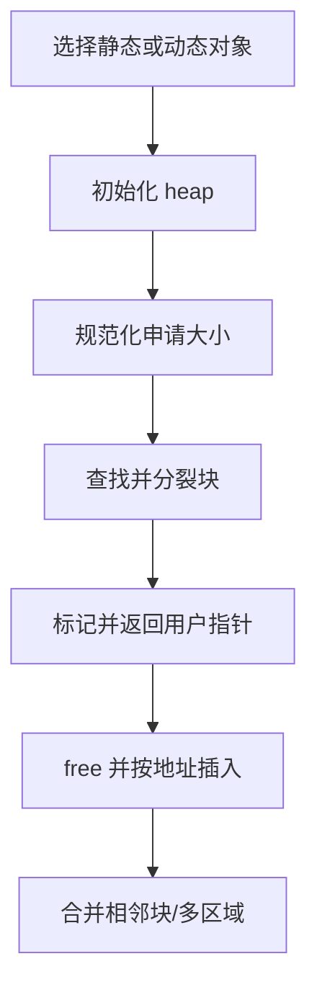
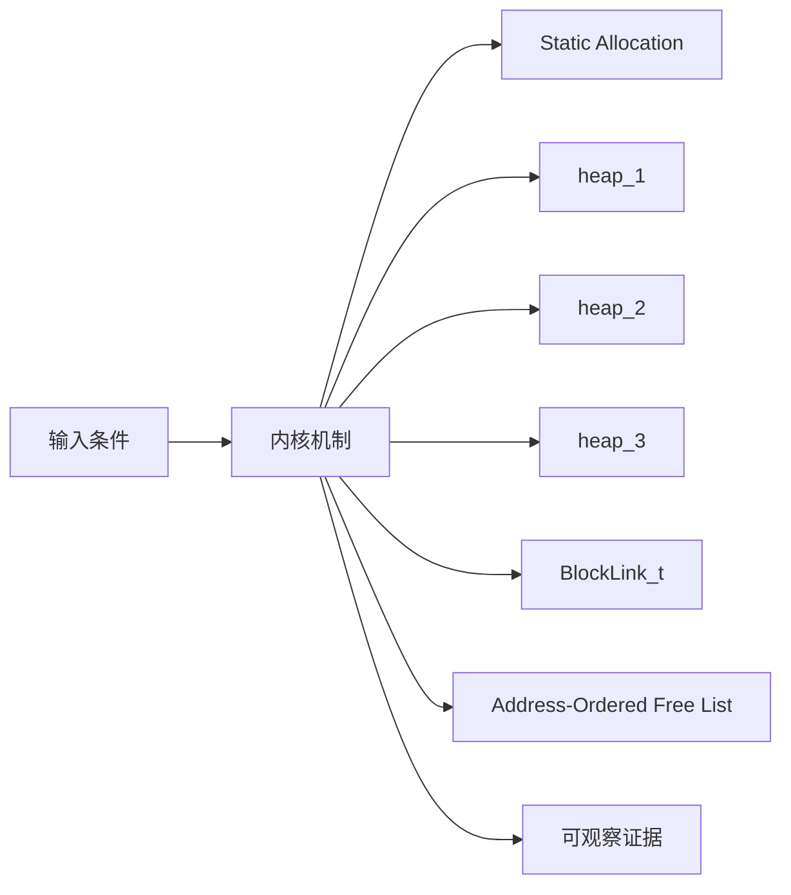
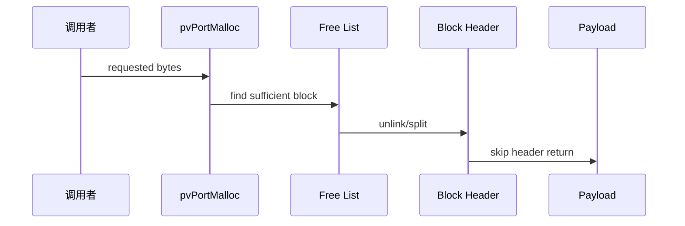
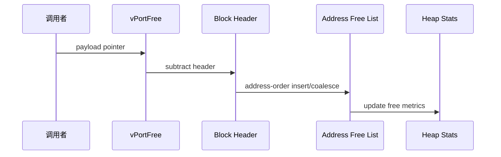
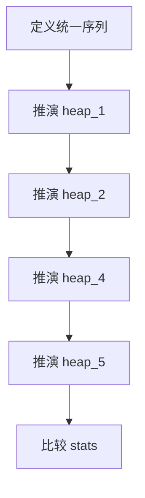
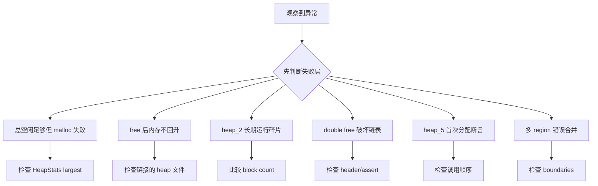

FreeRTOS 没有一个万能堆实现，heap_1～heap_5 是五种不同策略；选错时，问题可能不是剩余总字节，而是最大连续空闲块。

本篇只回答一个核心问题：**静态分配与五种 heap 如何管理内存，heap_4/5 又如何用地址有序链表减少外部碎片？**

分析范围固定为 **FreeRTOS-Kernel V11.3.0**。所有函数、字段、宏和条件编译都以该 tag 为准。

本篇先比较分配契约，再用同一序列推演五种 heap，重点逐行解释 BlockLink_t、split、allocated bit、address-order insert 和 adjacent coalescing。

## 1. 先明确内核内存管理的职责

只分析 FreeRTOS portable heap，不把 C library allocator、链接脚本区域或硬件 MPU 权限混为同一层。



## 2. Block header、Free list 与 Heap stats

动态内核对象最终依赖 pvPortMalloc/vPortFree；静态创建由调用者提供 storage。heap 实现是可替换契约，但一个构建通常只能选择一套。



| 对象 | 角色 | 必须保持的不变量 | 观察方法 | 常见误读 |
|---|---|---|---|---|
| Static Allocation | 调用者提供 TCB/stack/queue storage。 | 对象生命周期和 storage 生命周期一致。 | 记录地址与所有者。 | 静态等于不会越界。 |
| heap_1 | 只递增分配指针，不支持 free。 | 已分配内存永不回收。 | 记录 next free。 | 适合频繁创建删除。 |
| heap_2 | 按大小找块并分裂，不合并相邻 free。 | free list 有序策略不消除碎片。 | 比较 free block 数。 | 与 heap_4 等价。 |
| heap_3 | 包装标准 malloc/free 并加 scheduler 保护。 | 线程安全和碎片行为取决于 libc。 | 检查链接实现。 | FreeRTOS 自己管理 heap array。 |
| BlockLink_t | free/allocated block header。 | size 对齐且 allocated bit 与 free list 成员互斥。 | 查看 header。 | 用户指针指向 header。 |
| Address-Ordered Free List | 按内存地址串联 free blocks。 | 前后相邻关系可用地址+size 判断。 | 遍历地址单调。 | 按大小排序仍可合并。 |
| heap_5 Regions | 把多个非连续 region 接入一条 free list。 | 区域按地址升序、不重叠、以零项结束。 | 记录 region boundaries。 | 运行后动态追加 region。 |
| HeapStats_t | heap_4/5 统计总空闲、最小余量、最大/最小块和块数。 | 快照期间链表一致。 | 保存趋势。 | 误认为所有 heap 实现都提供完整统计。 |

## 3. 调用链一：heap_4 malloc 的 header、查找与分裂

申请大小先增加 BlockLink_t 并对齐，再从地址有序 free list 找第一个足够块；过大的块分裂后把余块重新插入。



### 调用链一：pvPortMalloc -> heap init -> size normalize -> free-list search -> split -> allocated bit -> payload

pvPortMalloc 首先把请求大小加上 BlockLink_t 头部，并在每次加法和对齐前检查 size_t 溢出。对齐后的块大小必须满足 portBYTE_ALIGNMENT；heap_4/heap_5 还使用最高位作为 allocation flag，因此可用大小不能占用该位。

heap_4 在第一次调用 pvPortMalloc 时通过 prvHeapInit 对 ucHeap 对齐，并建立 xStart、pxEnd 和初始大空闲块。heap_5 没有这条延迟初始化路径，应用必须在创建任何可能分配内存的内核对象之前调用 vPortDefineHeapRegions。两者完成各自初始化后，malloc 才会从地址有序的 free list 找到第一个足够大的块，并在余量超过 heapMINIMUM_BLOCK_SIZE 时分裂。

被选中的块从 free list 脱离，header 标记 allocated，统计量扣减，返回地址跳过 header 指向 payload。检查一次分配要同时验证规范化大小、payload 对齐、header 标志、free bytes 和余块链接，而不是只验证返回非 NULL。

### 源码片段：heap_4/5 free block 使用 BlockLink_t

> 源码位置：`portable/MemMang/heap_4.c` · `BlockLink_t` · `V11.3.0`
> 配置条件：选择 heap_4.c
> 固定链接：[查看上游源码](https://github.com/FreeRTOS/FreeRTOS-Kernel/blob/V11.3.0/portable/MemMang/heap_4.c)

```c
typedef struct A_BLOCK_LINK
{
    struct A_BLOCK_LINK * pxNextFreeBlock;
    size_t xBlockSize;
} BlockLink_t;

static const size_t xHeapStructSize =
    ( sizeof( BlockLink_t ) + ( portBYTE_ALIGNMENT - 1 ) )
    & ~( ( size_t ) portBYTE_ALIGNMENT_MASK );
```

- header 位于每个 block 开头。
- 用户指针跳过对齐后的 header。
- free block 通过 next 指针连接。
- size 高位还可编码 allocated 状态。

> **关键约束**：free list 成员 allocated bit 清零，allocated block 不出现在 free list。 **验证重点**：从用户指针回退 xHeapStructSize 解码 header。

### 源码片段：heap_4 malloc 搜索并分裂 free block

> 源码位置：`portable/MemMang/heap_4.c` · `pvPortMalloc()` · `V11.3.0`
> 配置条件：选择 heap_4.c
> 固定链接：[查看上游源码](https://github.com/FreeRTOS/FreeRTOS-Kernel/blob/V11.3.0/portable/MemMang/heap_4.c)

```c
pxPreviousBlock = &xStart;
pxBlock = xStart.pxNextFreeBlock;
while( ( pxBlock->xBlockSize < xWantedSize ) && ( pxBlock->pxNextFreeBlock != NULL ) )
{
    pxPreviousBlock = pxBlock;
    pxBlock = pxBlock->pxNextFreeBlock;
}

if( ( pxBlock->xBlockSize - xWantedSize ) > heapMINIMUM_BLOCK_SIZE )
{
    pxNewBlockLink = ( void * ) ( ( ( uint8_t * ) pxBlock ) + xWantedSize );
}
```

- 实现是 first sufficient 而非 best fit。
- xStart 是零大小哨兵。
- 分裂阈值避免产生不可用小块。
- 余块随后插回 free list。

> **关键约束**：分裂后 allocated size + remainder size 等于原 block size。 **验证重点**：记录选中块、wanted、余块地址和大小。

## 4. 调用链二：free、地址插入与相邻块合并

vPortFree 先从 payload 找回 header，验证 allocated bit，再按地址插入；只有地址有序才能 O(n) 判断前后物理相邻。



### 调用链二：vPortFree -> recover BlockLink_t -> clear allocated -> prvInsertBlockIntoFreeList -> merge previous/next

vPortFree 从 payload 地址向前恢复 BlockLink_t，先确认 allocation flag 已置位且 pxNextFreeBlock 为空，以捕获明显的非法地址或 double free。验证通过后才清除标志、增加空闲字节统计，并把候选块交给 prvInsertBlockIntoFreeList。

heap_4/heap_5 的 free list 按地址排序。插入时先找到地址上的前驱和后继：若前驱结束地址等于候选起始地址，就把两者合并；再检查合并后块的结束地址是否与后继相邻，满足时继续吞并后继。heap_5 必须尊重 region 间断，不能跨 region 合并。

释放后总空闲字节增加，但能否满足下一次大分配取决于 largest free block。验证应保存块头地址、大小、前后链接、free block count 和 largest free block，才能区分内存泄漏与外部碎片。

### 源码片段：地址有序插入支持前后合并

> 源码位置：`portable/MemMang/heap_4.c` · `prvInsertBlockIntoFreeList()` · `V11.3.0`
> 配置条件：heap_4 free path
> 固定链接：[查看上游源码](https://github.com/FreeRTOS/FreeRTOS-Kernel/blob/V11.3.0/portable/MemMang/heap_4.c)

```c
for( pxIterator = &xStart;
     pxIterator->pxNextFreeBlock < pxBlockToInsert;
     pxIterator = pxIterator->pxNextFreeBlock )
{
}

if( ( ( uint8_t * ) pxIterator + pxIterator->xBlockSize ) ==
    ( uint8_t * ) pxBlockToInsert )
{
    pxIterator->xBlockSize += pxBlockToInsert->xBlockSize;
    pxBlockToInsert = pxIterator;
}
```

- 先按地址找到插入点。
- 与前块连续就先合并。
- 随后再检查与后块连续。
- heap protector 开启时指针通过保护宏访问。

> **关键约束**：free list 地址单调且不存在可合并的相邻 free blocks。 **验证重点**：遍历输出 start/end/next。

### 源码片段：heap_5 将多个 region 串入一条链

> 源码位置：`portable/MemMang/heap_5.c` · `vPortDefineHeapRegions()` · `V11.3.0`
> 配置条件：选择 heap_5.c 且首次 malloc 前调用
> 固定链接：[查看上游源码](https://github.com/FreeRTOS/FreeRTOS-Kernel/blob/V11.3.0/portable/MemMang/heap_5.c)

```c
if( pxPreviousFreeBlock != NULL )
{
    pxPreviousFreeBlock->pxNextFreeBlock = pxFirstFreeBlockInRegion;
}

xTotalHeapSize += pxFirstFreeBlockInRegion->xBlockSize;
pxHeapRegion = &( pxHeapRegions[ ++xDefinedRegions ] );

xMinimumEverFreeBytesRemaining = xTotalHeapSize;
xFreeBytesRemaining = xTotalHeapSize;
```

- 每个 region 独立对齐和建立 end marker。
- 前一区域 sentinel 连接到后一区域首块。
- region 必须按地址升序。
- 定义完成后统计总可用大小。

> **关键约束**：不同 region 只链接不跨物理 gap 合并。 **验证重点**：记录每个 region start/end/sentinel 与全局 free list。

## 5. 用同一分配序列比较 heap_1 到 heap_5



### 配置矩阵

| 配置或条件 | 取值 A | 取值 B | 源码影响 | 验证重点 |
|---|---|---|---|---|
| configSUPPORT_STATIC_ALLOCATION | 0 | 1 | 决定是否可完全避开 heap 创建对象。 | 检查 create API。 |
| configSUPPORT_DYNAMIC_ALLOCATION | 0 | 1 | 决定内核动态对象和 heap 依赖。 | 链接 map 验证。 |
| configTOTAL_HEAP_SIZE | 较小 | 较大 | 决定 heap_1/2/4 内部数组。 | 检查链接占用。 |
| configAPPLICATION_ALLOCATED_HEAP | 0 | 1 | 决定 ucHeap 由内核或应用定义。 | 核对符号唯一。 |
| configUSE_MALLOC_FAILED_HOOK | 0 | 1 | 决定失败 hook。 | 制造失败验证。 |
| configENABLE_HEAP_PROTECTOR | 0 | 1 | 增加 canary/pointer protection。 | 注入溢出检查。 |

### 实验步骤

1. **定义统一序列。** 分配 A/B/C，释放 B/A，再分配 D，并为每种实现保存地址、申请大小与成功或失败；只有操作序列和公共证据一致，后续差异才可比较。
2. **推演 heap_1。** 只执行分配。重点核对 next free 与失败点，结果应满足“无 free 恢复”。
3. **推演 heap_2。** 执行释放与再分配，把 free blocks 保存为证据；判断依据是看到不合并碎片。
4. **推演 heap_4。** 释放相邻 A/B；观察地址 free list。若前后合并，即可进入下一步。
5. **推演 heap_5。** 定义两个非连续 region，随后比较 sentinel 和全局 list；预期是不跨 gap 合并。
6. **按实现能力采集统计。** heap_1/heap_2 每步读取 xPortGetFreeHeapSize；heap_4/heap_5 同时调用 vPortGetHeapStats；heap_3 使用所选 libc allocator 的统计接口，若该实现不提供统计，则至少记录返回地址、申请大小与成功或失败。只有证据与当前实现实际提供的接口一致，比较才有效。

### 证据表

| 证据 | 获取方法 | 通过标准 | 失败说明 |
|---|---|---|---|
| 内存所有权 | 对象创建参数和地址 | static/dynamic 来源明确 | delete 时处理错误会泄漏/double free |
| header 完整性 | payload 前 BlockLink_t | size/allocated/next 合法 | 损坏说明越界或 double free |
| free list 地址序 | 遍历 blocks | 地址严格递增 | 乱序会破坏合并判断 |
| 相邻合并 | 释放前后 block count/largest | 连续块合成一个 | 只看 total free 看不出碎片 |
| region 边界 | heap_5 sentinel | 每个 region 不跨 gap | 错误合并会访问无效内存 |
| 统计趋势 | heap_4/5 读取 HeapStats_t；heap_1/2 读取总空闲量 | 指标与当前实现提供的能力一致 | 用不存在的接口比较会得到伪证据 |

## 6. 用块头和空闲链表定位碎片、泄漏与越界

先验证对象成员和链表归属，再检查锁、配置分支和调度请求。



| 现象 | 根因 | 第一检查点 | 应保存的证据 | 修复原则 |
|---|---|---|---|---|
| 总空闲足够但 malloc 失败 | 最大连续块不足 | 检查 HeapStats largest | free blocks 与 requested size | 减少碎片/静态池/heap_4 |
| free 后内存不回升 | 使用 heap_1 或对象未 delete | 检查链接的 heap 文件 | map 与 free trace | 选择支持 free 的实现 |
| heap_2 长期运行碎片 | 不合并相邻块 | 比较 block count | 统一序列推演 | 改用 heap_4/固定块池 |
| double free 破坏链表 | allocated bit 已清或 next 非 NULL | 检查 header/assert | 两次 free 调用栈 | 修复生命周期并启用 protector |
| heap_5 首次分配断言 | 未先 define regions 或 regions 无终止项 | 检查调用顺序 | region array 和 total | 启动时一次定义有效数组 |
| 多 region 错误合并 | region 未按地址升序/重叠 | 检查 boundaries | start/end/sentinel | 排序并验证不重叠 |
| 静态对象仍出现 heap 调用 | Idle/Timer task hook 或其他对象仍动态 | 检查配置与 map | malloc call trace | 实现全部必要 static hooks |

## 7. 源码索引、阶段验收与面试表达

### 源码索引

| 文件 | 结构体 / 函数 / 宏 | 作用 |
|---|---|---|
| [portable/MemMang/heap_1.c](https://github.com/FreeRTOS/FreeRTOS-Kernel/blob/V11.3.0/portable/MemMang/heap_1.c) | pvPortMalloc、no-op free | 单向 bump allocator |
| [portable/MemMang/heap_2.c](https://github.com/FreeRTOS/FreeRTOS-Kernel/blob/V11.3.0/portable/MemMang/heap_2.c) | size-ordered free list | 不合并 allocator |
| [portable/MemMang/heap_3.c](https://github.com/FreeRTOS/FreeRTOS-Kernel/blob/V11.3.0/portable/MemMang/heap_3.c) | malloc/free wrapper | C library allocator |
| [portable/MemMang/heap_4.c](https://github.com/FreeRTOS/FreeRTOS-Kernel/blob/V11.3.0/portable/MemMang/heap_4.c) | BlockLink_t、split/coalesce | 单区域合并 allocator |
| [portable/MemMang/heap_5.c](https://github.com/FreeRTOS/FreeRTOS-Kernel/blob/V11.3.0/portable/MemMang/heap_5.c) | vPortDefineHeapRegions | 多区域合并 allocator |
| [include/portable.h](https://github.com/FreeRTOS/FreeRTOS-Kernel/blob/V11.3.0/include/portable.h) | pvPortMalloc/vPortFree/HeapStats_t | 公共契约 |

### 阶段验收

1. 能区分静态与动态对象所有权。
2. 能比较 heap_1～heap_5。
3. 能解释 BlockLink_t header。
4. 能推演 heap_4 split。
5. 能推演前后相邻合并。
6. 能定义合法 heap_5 regions。
7. 能用 largest block 判断碎片。
8. 能设计 malloc failed 取证。

### 面试表达

heap_1 只递增分配且不回收，heap_2 支持 free 但不合并相邻块，heap_4 在地址有序 free list 上分裂和合并，heap_5 再把多个 region 接入同一模型。

总空闲字节大于申请值仍可能失败，因为 allocator 需要单个足够大的连续 free block；应同时看 largest free block 和 free block count。

静态分配消除运行时 heap 依赖，但调用者仍必须保证 storage 对齐、生命周期、大小和并发所有权正确。

### 参考资料

- [FreeRTOS-Kernel V11.3.0](https://github.com/FreeRTOS/FreeRTOS-Kernel/tree/V11.3.0)
- [FreeRTOS Kernel Book](https://github.com/FreeRTOS/FreeRTOS-Kernel-Book)

> 🏷️ FreeRTOS / Memory Management / heap_4 / heap_5 / Static Allocation
