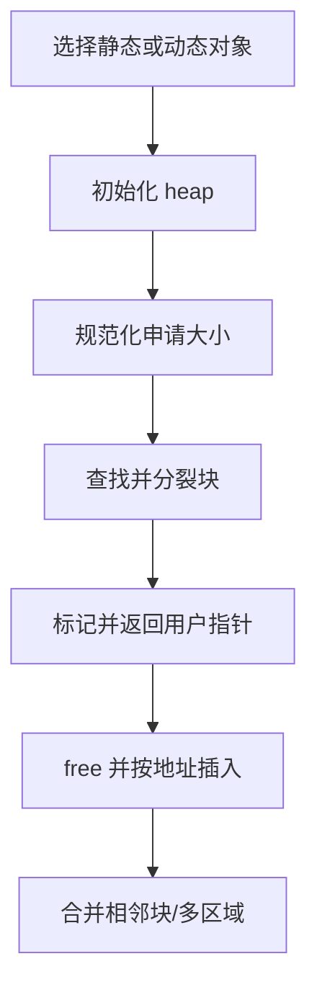
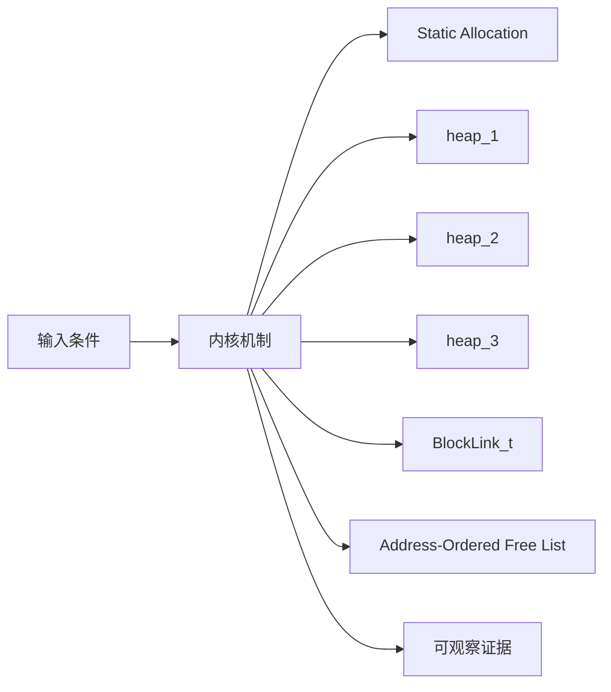
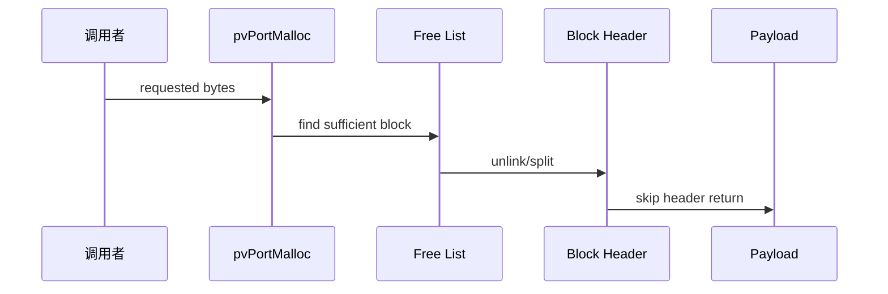
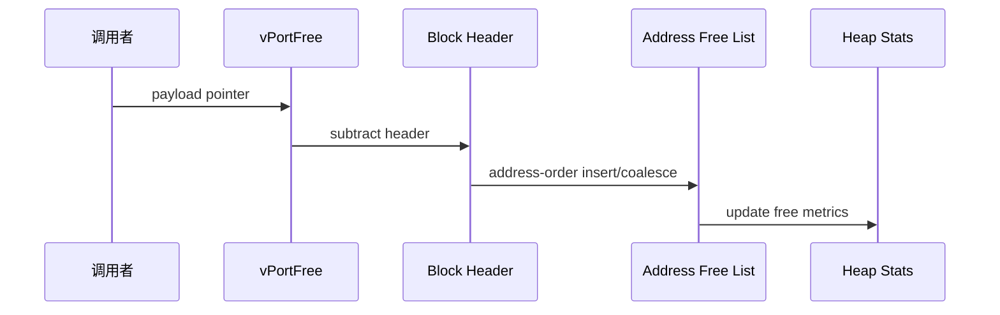
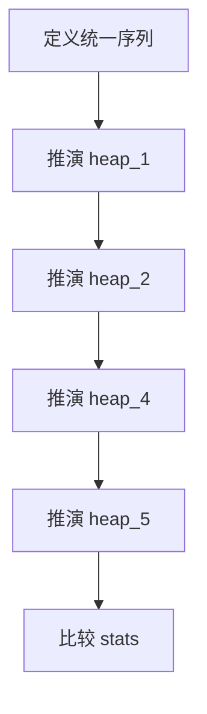
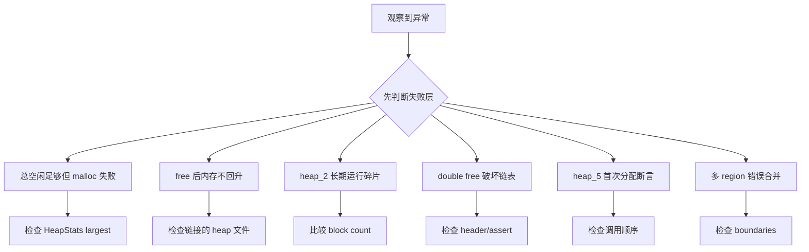

FreeRTOS 没有一个万能堆实现，heap_1～heap_5 是五种不同策略；选错时，问题可能不是剩余总字节，而是最大连续空闲块。

本篇只回答一个核心问题：**静态分配与五种 heap 如何管理内存，heap_4/5 又如何用地址有序链表减少外部碎片？**

分析范围固定为 **FreeRTOS-Kernel V11.3.0**。所有函数、字段、宏和条件编译都以该 tag 为准。

本篇先比较分配契约，再用同一序列推演五种 heap，重点逐行解释 BlockLink_t、split、allocated bit、address-order insert 和 adjacent coalescing。

## 1. 问题边界、前置条件与验收证据

只分析 FreeRTOS portable heap，不把 C library allocator、链接脚本区域或硬件 MPU 权限混为同一层。

读者已经会使用基本任务 API，但不能把 API 行为替代为源码证明。

阅读源码前先写清输入状态、允许的状态变化和输出证据。只看函数名或最终返回值，无法判断链表、锁和调度点是否正确。



| 顺序 | 阅读动作 | 入口条件 | 状态变化 | 验收证据 |
|---:|---|---|---|---|
| 1 | 选择静态或动态对象 | 生命周期和内存预算明确。 | 所有权清晰。 | 内存清单。 |
| 2 | 初始化 heap | 首次 malloc 或 define regions。 | free list 有效。 | 初始 stats。 |
| 3 | 规范化申请大小 | requested size 输入。 | wanted size 可比较。 | 对齐后大小。 |
| 4 | 查找并分裂块 | free list 已排序。 | allocated block 脱链，remainder 回链。 | block headers。 |
| 5 | 标记并返回用户指针 | block 已选。 | 用户只看到 payload。 | 地址与 size。 |
| 6 | free 并按地址插入 | 用户指针有效。 | free bytes 增加。 | free list。 |
| 7 | 合并相邻块/多区域 | 地址关系已知。 | 减少 free block 数。 | stats/addresses。 |

### 1. 选择静态或动态对象

入口条件：生命周期和内存预算明确。

执行动作：决定 caller storage 或 heap。

核心状态变化：所有权清晰。

离开这一步时必须成立：删除策略匹配。

可观察证据：内存清单。

停止条件：混合所有权不明时停止。

### 2. 初始化 heap

入口条件：首次 malloc 或 define regions。

执行动作：对齐 start/end，建立 xStart/pxEnd/free block。

核心状态变化：free list 有效。

离开这一步时必须成立：scheduler 保护。

可观察证据：初始 stats。

停止条件：region 未定义时停止。

### 3. 规范化申请大小

入口条件：requested size 输入。

执行动作：加 header、对齐、检查 allocated bit/overflow。

核心状态变化：wanted size 可比较。

离开这一步时必须成立：suspend scheduler。

可观察证据：对齐后大小。

停止条件：加法溢出时停止。

### 4. 查找并分裂块

入口条件：free list 已排序。

执行动作：选择首个足够块，必要时创建 remainder。

核心状态变化：allocated block 脱链，remainder 回链。

离开这一步时必须成立：heap lock。

可观察证据：block headers。

停止条件：剩余过小时不分裂。

### 5. 标记并返回用户指针

入口条件：block 已选。

执行动作：设置 allocated bit、清 next、跳过 header。

核心状态变化：用户只看到 payload。

离开这一步时必须成立：返回前 trace。

可观察证据：地址与 size。

停止条件：返回 header 时停止。

### 6. free 并按地址插入

入口条件：用户指针有效。

执行动作：回退 header、清 allocated bit、插入地址序列。

核心状态变化：free bytes 增加。

离开这一步时必须成立：scheduler suspend。

可观察证据：free list。

停止条件：double free 时停止。

### 7. 合并相邻块/多区域

入口条件：地址关系已知。

执行动作：与前后连续块合并；heap_5 跨 region sentinel。

核心状态变化：减少 free block 数。

离开这一步时必须成立：同一插入函数。

可观察证据：stats/addresses。

停止条件：跨不连续 region 合并时停止。

## 2. 核心数据结构、所有权与不变量

动态内核对象最终依赖 pvPortMalloc/vPortFree；静态创建由调用者提供 storage。heap 实现是可替换契约，但一个构建通常只能选择一套。

这里不把字段当作词汇表，而是解释字段由谁修改、在哪个临界区修改、它和哪个链表或对象保持一致。



| 对象 | 角色 | 必须保持的不变量 | 观察方法 | 常见误读 |
|---|---|---|---|---|
| Static Allocation | 调用者提供 TCB/stack/queue storage。 | 对象生命周期和 storage 生命周期一致。 | 记录地址与所有者。 | 静态等于不会越界。 |
| heap_1 | 只递增分配指针，不支持 free。 | 已分配内存永不回收。 | 记录 next free。 | 适合频繁创建删除。 |
| heap_2 | 按大小找块并分裂，不合并相邻 free。 | free list 有序策略不消除碎片。 | 比较 free block 数。 | 与 heap_4 等价。 |
| heap_3 | 包装标准 malloc/free 并加 scheduler 保护。 | 线程安全和碎片行为取决于 libc。 | 检查链接实现。 | FreeRTOS 自己管理 heap array。 |
| BlockLink_t | free/allocated block header。 | size 对齐且 allocated bit 与 free list 成员互斥。 | 查看 header。 | 用户指针指向 header。 |
| Address-Ordered Free List | 按内存地址串联 free blocks。 | 前后相邻关系可用地址+size 判断。 | 遍历地址单调。 | 按大小排序仍可合并。 |
| heap_5 Regions | 把多个非连续 region 接入一条 free list。 | 区域按地址升序、不重叠、以零项结束。 | 记录 region boundaries。 | 运行后动态追加 region。 |
| HeapStats_t | 统计总空闲、最小余量、最大/最小块和块数。 | 快照期间链表一致。 | 保存趋势。 | 只看 total free 判断可分配性。 |

### Static Allocation

角色：调用者提供 TCB/stack/queue storage。

所有权：应用。

不变量：对象生命周期和 storage 生命周期一致。

变化时机：create/delete。

观察方法：记录地址与所有者。

常见误读：静态等于不会越界。

### heap_1

角色：只递增分配指针，不支持 free。

所有权：heap_1.c。

不变量：已分配内存永不回收。

变化时机：pvPortMalloc。

观察方法：记录 next free。

常见误读：适合频繁创建删除。

### heap_2

角色：按大小找块并分裂，不合并相邻 free。

所有权：heap_2.c。

不变量：free list 有序策略不消除碎片。

变化时机：malloc/free。

观察方法：比较 free block 数。

常见误读：与 heap_4 等价。

### heap_3

角色：包装标准 malloc/free 并加 scheduler 保护。

所有权：C library。

不变量：线程安全和碎片行为取决于 libc。

变化时机：malloc/free。

观察方法：检查链接实现。

常见误读：FreeRTOS 自己管理 heap array。

### BlockLink_t

角色：free/allocated block header。

所有权：heap_4/5。

不变量：size 对齐且 allocated bit 与 free list 成员互斥。

变化时机：split/free/coalesce。

观察方法：查看 header。

常见误读：用户指针指向 header。

### Address-Ordered Free List

角色：按内存地址串联 free blocks。

所有权：heap_4/5。

不变量：前后相邻关系可用地址+size 判断。

变化时机：free insert。

观察方法：遍历地址单调。

常见误读：按大小排序仍可合并。

### heap_5 Regions

角色：把多个非连续 region 接入一条 free list。

所有权：应用定义+heap_5。

不变量：区域按地址升序、不重叠、以零项结束。

变化时机：首次分配前 define。

观察方法：记录 region boundaries。

常见误读：运行后动态追加 region。

### HeapStats_t

角色：统计总空闲、最小余量、最大/最小块和块数。

所有权：heap_4/5。

不变量：快照期间链表一致。

变化时机：诊断调用。

观察方法：保存趋势。

常见误读：只看 total free 判断可分配性。

## 3. 调用链一：heap_4 malloc 的 header、查找与分裂

申请大小先增加 BlockLink_t 并对齐，再从地址有序 free list 找第一个足够块；过大的块分裂后把余块重新插入。

调用链中的每一跳都要区分普通函数调用、宏展开、临界区边界和可能触发调度的 port hook。



### 调用链一：pvPortMalloc -> heap init -> size normalize -> free-list search -> split -> allocated bit -> payload

#### 链路步骤 1：增加 header

进入时：请求非零。

本步读取：wanted size。

本步修改：+xHeapStructSize。

并发边界：overflow check。

返回或转交：可容纳元数据。

证据：normalized size。

#### 链路步骤 2：对齐大小

进入时：header 已计入。

本步读取：port alignment mask。

本步修改：round up。

并发边界：size_t 安全。

返回或转交：所有后续块对齐。

证据：low bits。

#### 链路步骤 3：延迟初始化

进入时：pxEnd 为空。

本步读取：ucHeap boundaries。

本步修改：xStart/pxEnd/first free。

并发边界：scheduler suspended。

返回或转交：一块大 free。

证据：initial stats。

#### 链路步骤 4：搜索 free list

进入时：wanted<=free total。

本步读取：每块 size。

本步修改：previous/current。

并发边界：链表不变。

返回或转交：找到首块或 end。

证据：search trace。

#### 链路步骤 5：分裂余块

进入时：block 足够大。

本步读取：block size - wanted。

本步修改：allocated size + remainder header。

并发边界：minimum block threshold。

返回或转交：余块仍可分配。

证据：two headers。

#### 链路步骤 6：返回 payload

进入时：block 已脱链。

本步读取：allocated bit/header end。

本步修改：user pointer。

并发边界：更新 stats/trace。

返回或转交：pointer 对齐。

证据：address map。

### 源码片段：heap_4/5 free block 使用 BlockLink_t

> 源码位置：`portable/MemMang/heap_4.c` · `BlockLink_t` · `V11.3.0`
> 配置条件：选择 heap_4.c
> 固定链接：[查看上游源码](https://github.com/FreeRTOS/FreeRTOS-Kernel/blob/V11.3.0/portable/MemMang/heap_4.c)

```c
typedef struct A_BLOCK_LINK
{
    struct A_BLOCK_LINK * pxNextFreeBlock;
    size_t xBlockSize;
} BlockLink_t;

static const size_t xHeapStructSize =
    ( sizeof( BlockLink_t ) + ( portBYTE_ALIGNMENT - 1 ) )
    & ~( ( size_t ) portBYTE_ALIGNMENT_MASK );
```

这段摘录只保留当前机制需要的语句；省略的参数检查、trace hook 或条件分支必须回到固定链接核对。

解读 1：header 位于每个 block 开头。

解读 2：用户指针跳过对齐后的 header。

解读 3：free block 通过 next 指针连接。

解读 4：size 高位还可编码 allocated 状态。

不变量：free list 成员 allocated bit 清零，allocated block 不出现在 free list。

观察点：从用户指针回退 xHeapStructSize 解码 header。

### 源码片段：heap_4 malloc 搜索并分裂 free block

> 源码位置：`portable/MemMang/heap_4.c` · `pvPortMalloc()` · `V11.3.0`
> 配置条件：选择 heap_4.c
> 固定链接：[查看上游源码](https://github.com/FreeRTOS/FreeRTOS-Kernel/blob/V11.3.0/portable/MemMang/heap_4.c)

```c
pxPreviousBlock = &xStart;
pxBlock = xStart.pxNextFreeBlock;
while( ( pxBlock->xBlockSize < xWantedSize ) && ( pxBlock->pxNextFreeBlock != NULL ) )
{
    pxPreviousBlock = pxBlock;
    pxBlock = pxBlock->pxNextFreeBlock;
}

if( ( pxBlock->xBlockSize - xWantedSize ) > heapMINIMUM_BLOCK_SIZE )
{
    pxNewBlockLink = ( void * ) ( ( ( uint8_t * ) pxBlock ) + xWantedSize );
}
```

这段摘录只保留当前机制需要的语句；省略的参数检查、trace hook 或条件分支必须回到固定链接核对。

解读 1：实现是 first sufficient 而非 best fit。

解读 2：xStart 是零大小哨兵。

解读 3：分裂阈值避免产生不可用小块。

解读 4：余块随后插回 free list。

不变量：分裂后 allocated size + remainder size 等于原 block size。

观察点：记录选中块、wanted、余块地址和大小。

## 4. 调用链二：free、地址插入与相邻块合并

vPortFree 先从 payload 找回 header，验证 allocated bit，再按地址插入；只有地址有序才能 O(n) 判断前后物理相邻。

第二条链用于验证同一对象在另一条执行路径上的行为，重点检查它是否复用相同不变量，还是进入 ISR、daemon 或 portable 层的特殊规则。



### 调用链二：vPortFree -> recover BlockLink_t -> clear allocated -> prvInsertBlockIntoFreeList -> merge previous/next

#### 链路步骤 1：恢复 header

进入时：pv 非 NULL。

本步读取：payload address。

本步修改：pxLink=payload-header。

并发边界：scheduler suspend 前验证。

返回或转交：找到 block metadata。

证据：pointer arithmetic。

#### 链路步骤 2：验证 allocated

进入时：header 可读。

本步读取：allocated bit/next free。

本步修改：无。

并发边界：assert/protector。

返回或转交：排除 double free。

证据：header flags。

#### 链路步骤 3：清标志与记账

进入时：合法 allocated block。

本步读取：block size。

本步修改：allocated bit clear/free bytes++。

并发边界：scheduler suspended。

返回或转交：free candidate。

证据：stats。

#### 链路步骤 4：寻找地址位置

进入时：free list 地址升序。

本步读取：next block address。

本步修改：iterator。

并发边界：list protected。

返回或转交：前驱后继确定。

证据：address sequence。

#### 链路步骤 5：合并前块

进入时：前驱 end==candidate start。

本步读取：address+size。

本步修改：前块 size 扩大。

并发边界：同一 list mutation。

返回或转交：candidate 指向 merged。

证据：header addresses。

#### 链路步骤 6：合并后块

进入时：candidate end==next start。

本步读取：next size/link。

本步修改：merged size/link。

并发边界：不跨 pxEnd/region gap。

返回或转交：最大连续块恢复。

证据：block count/stats。

### 源码片段：地址有序插入支持前后合并

> 源码位置：`portable/MemMang/heap_4.c` · `prvInsertBlockIntoFreeList()` · `V11.3.0`
> 配置条件：heap_4 free path
> 固定链接：[查看上游源码](https://github.com/FreeRTOS/FreeRTOS-Kernel/blob/V11.3.0/portable/MemMang/heap_4.c)

```c
for( pxIterator = &xStart;
     pxIterator->pxNextFreeBlock < pxBlockToInsert;
     pxIterator = pxIterator->pxNextFreeBlock )
{
}

if( ( ( uint8_t * ) pxIterator + pxIterator->xBlockSize ) ==
    ( uint8_t * ) pxBlockToInsert )
{
    pxIterator->xBlockSize += pxBlockToInsert->xBlockSize;
    pxBlockToInsert = pxIterator;
}
```

这段摘录只保留当前机制需要的语句；省略的参数检查、trace hook 或条件分支必须回到固定链接核对。

解读 1：先按地址找到插入点。

解读 2：与前块连续就先合并。

解读 3：随后再检查与后块连续。

解读 4：heap protector 开启时指针通过保护宏访问。

不变量：free list 地址单调且不存在可合并的相邻 free blocks。

观察点：遍历输出 start/end/next。

### 源码片段：heap_5 将多个 region 串入一条链

> 源码位置：`portable/MemMang/heap_5.c` · `vPortDefineHeapRegions()` · `V11.3.0`
> 配置条件：选择 heap_5.c 且首次 malloc 前调用
> 固定链接：[查看上游源码](https://github.com/FreeRTOS/FreeRTOS-Kernel/blob/V11.3.0/portable/MemMang/heap_5.c)

```c
if( pxPreviousFreeBlock != NULL )
{
    pxPreviousFreeBlock->pxNextFreeBlock = pxFirstFreeBlockInRegion;
}

xTotalHeapSize += pxFirstFreeBlockInRegion->xBlockSize;
pxHeapRegion = &( pxHeapRegions[ ++xDefinedRegions ] );

xMinimumEverFreeBytesRemaining = xTotalHeapSize;
xFreeBytesRemaining = xTotalHeapSize;
```

这段摘录只保留当前机制需要的语句；省略的参数检查、trace hook 或条件分支必须回到固定链接核对。

解读 1：每个 region 独立对齐和建立 end marker。

解读 2：前一区域 sentinel 连接到后一区域首块。

解读 3：region 必须按地址升序。

解读 4：定义完成后统计总可用大小。

不变量：不同 region 只链接不跨物理 gap 合并。

观察点：记录每个 region start/end/sentinel 与全局 free list。

## 5. 配置矩阵、观测实验与证据记录

使用可控输入和 trace hook 观察对象变化，不依赖特定开发板。

实验只承诺观察软件状态和调用顺序。没有实际目标硬件或 trace 数据时，不写虚构时间和性能数字。



### 配置矩阵

| 配置或条件 | 取值 A | 取值 B | 源码影响 | 验证重点 |
|---|---|---|---|---|
| configSUPPORT_STATIC_ALLOCATION | 0 | 1 | 决定是否可完全避开 heap 创建对象。 | 检查 create API。 |
| configSUPPORT_DYNAMIC_ALLOCATION | 0 | 1 | 决定内核动态对象和 heap 依赖。 | 链接 map 验证。 |
| configTOTAL_HEAP_SIZE | 较小 | 较大 | 决定 heap_1/2/4 内部数组。 | 检查链接占用。 |
| configAPPLICATION_ALLOCATED_HEAP | 0 | 1 | 决定 ucHeap 由内核或应用定义。 | 核对符号唯一。 |
| configUSE_MALLOC_FAILED_HOOK | 0 | 1 | 决定失败 hook。 | 制造失败验证。 |
| configENABLE_HEAP_PROTECTOR | 0 | 1 | 增加 canary/pointer protection。 | 注入溢出检查。 |

### 实验步骤

1. **定义统一序列**

   操作：分配 A/B/C，释放 B/A，再分配 D。

   记录：地址、size、stats。

   通过标准：所有 heap 可比较。

2. **推演 heap_1**

   操作：只执行分配。

   记录：next free 与失败点。

   通过标准：无 free 恢复。

3. **推演 heap_2**

   操作：执行释放与再分配。

   记录：free blocks。

   通过标准：看到不合并碎片。

4. **推演 heap_4**

   操作：释放相邻 A/B。

   记录：地址 free list。

   通过标准：前后合并。

5. **推演 heap_5**

   操作：定义两个非连续 region。

   记录：sentinel 和全局 list。

   通过标准：不跨 gap 合并。

6. **比较 stats**

   操作：每步调用 heap stats。

   记录：total/min/largest/count。

   通过标准：能解释分配成功或失败。

### 证据表

| 证据 | 获取方法 | 通过标准 | 失败说明 |
|---|---|---|---|
| 内存所有权 | 对象创建参数和地址 | static/dynamic 来源明确 | delete 时处理错误会泄漏/double free |
| header 完整性 | payload 前 BlockLink_t | size/allocated/next 合法 | 损坏说明越界或 double free |
| free list 地址序 | 遍历 blocks | 地址严格递增 | 乱序会破坏合并判断 |
| 相邻合并 | 释放前后 block count/largest | 连续块合成一个 | 只看 total free 看不出碎片 |
| region 边界 | heap_5 sentinel | 每个 region 不跨 gap | 错误合并会访问无效内存 |
| 统计趋势 | HeapStats_t | minimum ever 单调不增，largest 合理 | 统计不一致提示锁/损坏 |

#### 证据：内存所有权

获取方法：对象创建参数和地址

应当看到：static/dynamic 来源明确

如果不满足：delete 时处理错误会泄漏/double free

为什么这项证据有效：所有权先于 allocator 选择。

#### 证据：header 完整性

获取方法：payload 前 BlockLink_t

应当看到：size/allocated/next 合法

如果不满足：损坏说明越界或 double free

为什么这项证据有效：header 是 allocator 事实源。

#### 证据：free list 地址序

获取方法：遍历 blocks

应当看到：地址严格递增

如果不满足：乱序会破坏合并判断

为什么这项证据有效：heap_4/5 coalesce 依赖地址。

#### 证据：相邻合并

获取方法：释放前后 block count/largest

应当看到：连续块合成一个

如果不满足：只看 total free 看不出碎片

为什么这项证据有效：largest block 决定大申请。

#### 证据：region 边界

获取方法：heap_5 sentinel

应当看到：每个 region 不跨 gap

如果不满足：错误合并会访问无效内存

为什么这项证据有效：region 只逻辑串联。

#### 证据：统计趋势

获取方法：HeapStats_t

应当看到：minimum ever 单调不增，largest 合理

如果不满足：统计不一致提示锁/损坏

为什么这项证据有效：多指标比 total 更可靠。

## 6. 常见误读、故障定位与修复原则

排错从最早被破坏的不变量开始，不从最终崩溃位置随机回退。

先验证对象成员和链表归属，再检查锁、配置分支和调度请求。



### 1. 总空闲足够但 malloc 失败

根因：最大连续块不足

第一检查点：检查 HeapStats largest

需要保存的证据：free blocks 与 requested size

修复原则：减少碎片/静态池/heap_4

不能采用的绕过方式：不要只增 total heap。

### 2. free 后内存不回升

根因：使用 heap_1 或对象未 delete

第一检查点：检查链接的 heap 文件

需要保存的证据：map 与 free trace

修复原则：选择支持 free 的实现

不能采用的绕过方式：不要假设所有 vPortFree 有效。

### 3. heap_2 长期运行碎片

根因：不合并相邻块

第一检查点：比较 block count

需要保存的证据：统一序列推演

修复原则：改用 heap_4/固定块池

不能采用的绕过方式：不要周期重启当修复。

### 4. double free 破坏链表

根因：allocated bit 已清或 next 非 NULL

第一检查点：检查 header/assert

需要保存的证据：两次 free 调用栈

修复原则：修复生命周期并启用 protector

不能采用的绕过方式：不要清零 header。

### 5. heap_5 首次分配断言

根因：未先 define regions 或 regions 无终止项

第一检查点：检查调用顺序

需要保存的证据：region array 和 total

修复原则：启动时一次定义有效数组

不能采用的绕过方式：不要运行中追加。

### 6. 多 region 错误合并

根因：region 未按地址升序/重叠

第一检查点：检查 boundaries

需要保存的证据：start/end/sentinel

修复原则：排序并验证不重叠

不能采用的绕过方式：不要用虚构连续地址。

### 7. 静态对象仍出现 heap 调用

根因：Idle/Timer task hook 或其他对象仍动态

第一检查点：检查配置与 map

需要保存的证据：malloc call trace

修复原则：实现全部必要 static hooks

不能采用的绕过方式：不要只改一个 create API。

## 7. 源码索引、阶段验收与面试表达

完成本篇后，读者应能不依赖文章复述对象模型、两条调用链、配置差异和取证顺序。

### 源码索引

| 文件 | 结构体 / 函数 / 宏 | 作用 |
|---|---|---|
| [portable/MemMang/heap_1.c](https://github.com/FreeRTOS/FreeRTOS-Kernel/blob/V11.3.0/portable/MemMang/heap_1.c) | pvPortMalloc、no-op free | 单向 bump allocator |
| [portable/MemMang/heap_2.c](https://github.com/FreeRTOS/FreeRTOS-Kernel/blob/V11.3.0/portable/MemMang/heap_2.c) | size-ordered free list | 不合并 allocator |
| [portable/MemMang/heap_3.c](https://github.com/FreeRTOS/FreeRTOS-Kernel/blob/V11.3.0/portable/MemMang/heap_3.c) | malloc/free wrapper | C library allocator |
| [portable/MemMang/heap_4.c](https://github.com/FreeRTOS/FreeRTOS-Kernel/blob/V11.3.0/portable/MemMang/heap_4.c) | BlockLink_t、split/coalesce | 单区域合并 allocator |
| [portable/MemMang/heap_5.c](https://github.com/FreeRTOS/FreeRTOS-Kernel/blob/V11.3.0/portable/MemMang/heap_5.c) | vPortDefineHeapRegions | 多区域合并 allocator |
| [include/portable.h](https://github.com/FreeRTOS/FreeRTOS-Kernel/blob/V11.3.0/include/portable.h) | pvPortMalloc/vPortFree/HeapStats_t | 公共契约 |

### 阶段验收

1. 能区分静态与动态对象所有权。
2. 能比较 heap_1～heap_5。
3. 能解释 BlockLink_t header。
4. 能推演 heap_4 split。
5. 能推演前后相邻合并。
6. 能定义合法 heap_5 regions。
7. 能用 largest block 判断碎片。
8. 能设计 malloc failed 取证。

### 验收记录模板

| 项目 | 实际证据 | 结论 |
|---|---|---|
| 能区分静态与动态对象所有权。 |  |  |
| 能比较 heap_1～heap_5。 |  |  |
| 能解释 BlockLink_t header。 |  |  |
| 能推演 heap_4 split。 |  |  |
| 能推演前后相邻合并。 |  |  |
| 能定义合法 heap_5 regions。 |  |  |
| 能用 largest block 判断碎片。 |  |  |
| 能设计 malloc failed 取证。 |  |  |

### 面试表达

heap_1 只递增分配且不回收，heap_2 支持 free 但不合并相邻块，heap_4 在地址有序 free list 上分裂和合并，heap_5 再把多个 region 接入同一模型。

总空闲字节大于申请值仍可能失败，因为 allocator 需要单个足够大的连续 free block；应同时看 largest free block 和 free block count。

静态分配消除运行时 heap 依赖，但调用者仍必须保证 storage 对齐、生命周期、大小和并发所有权正确。

### 参考资料

- [FreeRTOS-Kernel V11.3.0](https://github.com/FreeRTOS/FreeRTOS-Kernel/tree/V11.3.0)
- [FreeRTOS Kernel Book](https://github.com/FreeRTOS/FreeRTOS-Kernel-Book)

> 🏷️ FreeRTOS / Memory Management / heap_4 / heap_5 / Static Allocation
