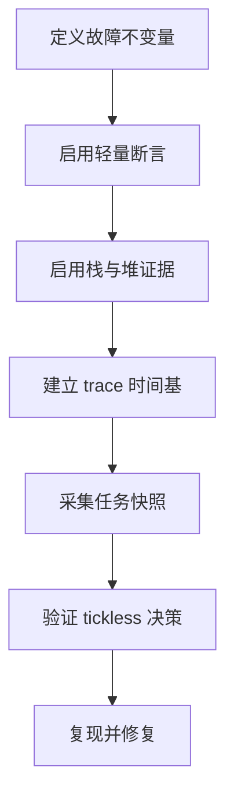
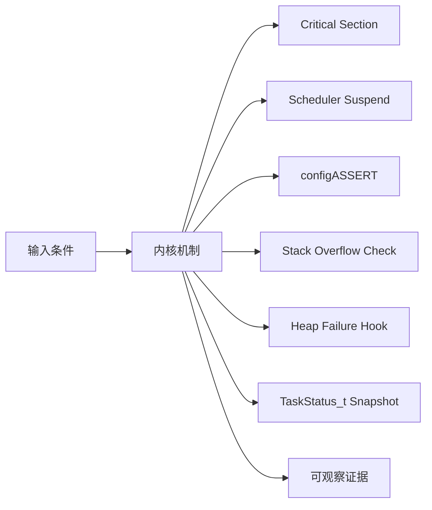
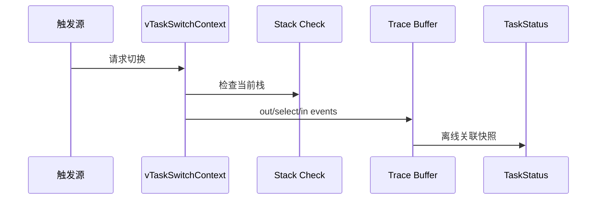
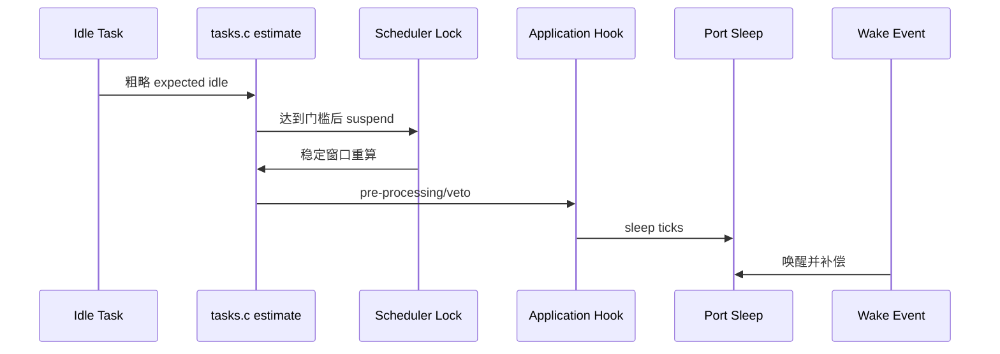
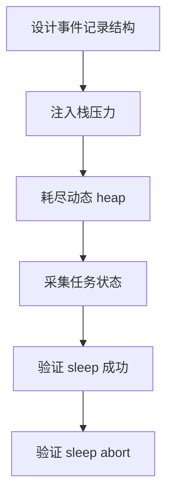
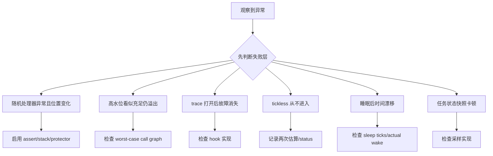

可靠性不是打开几个 hook：必须先知道它们在哪个上下文运行、能观察什么，以及观测代码是否改变调度和低功耗时序。

本篇只回答一个核心问题：**怎样用内核已有的断言、栈/堆指标、tickless 状态和 trace 定位调度延迟、内存损坏与低功耗失败？**

分析范围固定为 **FreeRTOS-Kernel V11.3.0**。所有函数、字段、宏和条件编译都以该 tag 为准。

本篇把保护原语、失败 hook、任务快照、runtime stats 和 tickless 决策连成一条证据链，强调先证明最早破坏的不变量。

## 1. 可靠性来自可观测状态

不提供特定芯片睡眠代码或实测功耗；portSUPPRESS_TICKS_AND_SLEEP 的时钟补偿和唤醒源由目标 port 负责。



## 2. Trace event、任务快照与休眠决策

critical section 保护短原子更新，scheduler suspend 允许中断但推迟任务切换；trace/hook 是观测边界，tickless 是 Idle 与 port 的协作协议。



| 对象 | 角色 | 必须保持的不变量 | 观察方法 | 常见误读 |
|---|---|---|---|---|
| Critical Section | 使用 port mask 保护内核共享状态。 | 短、可嵌套、上下文规则合法。 | 记录 nesting/mask。 | 用于包围阻塞 API。 |
| Scheduler Suspend | 推迟 task switch 和 state-list 更新结算。 | 中断可运行，unblock 进入 pending ready。 | 记录 suspend depth。 | 等同关闭中断。 |
| configASSERT | 把配置和不变量失败变成可定位停止点。 | 不得有副作用且保存现场。 | 断言表达式与 PC。 | 发布版全部移除且无替代证据。 |
| Stack Overflow Check | 切换边界检查栈指针或填充值。 | 检查策略与 portSTACK_GROWTH 对齐。 | 记录任务/stack boundaries。 | 高水位等于绝对安全。 |
| Heap Failure Hook | malloc 返回 NULL 时提供应用取证入口。 | hook 不继续使用失败对象。 | requested/free stats。 | hook 中再次大量分配。 |
| TaskStatus_t Snapshot | 导出状态、优先级、栈水位和 runtime counter。 | snapshot 在 scheduler suspend 窗口一致。 | 保存原始数组。 | 只使用格式化文本。 |
| Tickless Decision | Idle 计算 expected idle，并在稳定窗口确认可睡眠。 | pending ready/yield/ticks 时 abort。 | 记录 eSleepModeStatus。 | 只要 ready list 只剩 Idle 就睡。 |
| Trace Hooks | 在 create/switch/block/ISR/low-power 等边界记录事件。 | 低开销、不阻塞、时间基统一。 | 环形 trace buffer。 | 在 hook 中打印串口。 |

## 3. 调用链一：任务切换边界的栈检查与 trace

vTaskSwitchContext 在选择新任务前后提供 stack check 和 switched out/in trace，是关联 current TCB、栈余量和切换原因的稳定边界。



### 调用链一：yield/Tick -> vTaskSwitchContext -> stack check -> trace out -> select -> trace in -> runtime stats

一次可解释的上下文切换要先记录触发源：Tick、任务 API、ISR 解阻塞还是显式 yield。vTaskSwitchContext 仍持有旧 pxCurrentTCB 时，内核可以检查该任务栈边界或填充值，并用单调运行时间计数器把当前时间片累计到旧 TCB。

traceTASK_SWITCHED_OUT 必须在旧任务身份仍明确时记录，调度器随后从一致的 ready lists 选择新 TCB，再由 traceTASK_SWITCHED_IN 记录新任务和本时间片起点。trace hook 位于调度关键路径，不能阻塞、动态分配或输出慢速日志；更稳妥的做法是写入固定大小环形事件缓冲。

离线分析时，再用 uxTaskGetSystemState 等安全快照把任务名称、状态、栈余量和累计运行时间与事件流对齐。只有触发源、old/new TCB 和对象快照能够串成同一时间线，trace 才能回答“为什么切换”，而不只是列出切换发生过。

### 源码片段：任务切换时执行栈检查与 trace

> 源码位置：`tasks.c` · `vTaskSwitchContext()` · `V11.3.0`
> 配置条件：configCHECK_FOR_STACK_OVERFLOW/trace 配置
> 固定链接：[查看上游源码](https://github.com/FreeRTOS/FreeRTOS-Kernel/blob/V11.3.0/tasks.c)

```c
taskCHECK_FOR_STACK_OVERFLOW();

traceTASK_SWITCHED_OUT();

taskSELECT_HIGHEST_PRIORITY_TASK();

traceTASK_SWITCHED_IN();
```

- 栈检查发生在已知 current TCB 上。
- switched out 位于选择前。
- 调度策略仍由公共宏执行。
- trace hook 必须保持轻量。

> **关键约束**：trace in/out 顺序与 current TCB 更新一致。 **验证重点**：保存 event timestamp、old/new TCB 与 trigger。

### 源码片段：stack high-water 扫描未使用填充值

> 源码位置：`tasks.c` · `uxTaskGetStackHighWaterMark()` · `V11.3.0`
> 配置条件：INCLUDE_uxTaskGetStackHighWaterMark == 1
> 固定链接：[查看上游源码](https://github.com/FreeRTOS/FreeRTOS-Kernel/blob/V11.3.0/tasks.c)

```c
#if portSTACK_GROWTH < 0
    pucEndOfStack = ( uint8_t * ) pxTCB->pxStack;
#else
    pucEndOfStack = ( uint8_t * ) pxTCB->pxEndOfStack;
#endif

uxReturn = ( UBaseType_t ) prvTaskCheckFreeStackSpace( pucEndOfStack );
```

- 扫描起点随栈增长方向改变。
- 结果基于创建时填充值。
- 单位与配置的 stack type 相关。
- 运行历史未覆盖所有路径时余量可能乐观。

> **关键约束**：高水位是历史最小余量，不是未来安全保证。 **验证重点**：结合最大调用深度、ISR/FPU frame 与长期趋势。

## 4. 调用链二：Idle 两阶段 tickless sleep 决策

Idle 先做无锁粗测，达到阈值后 suspend scheduler，再精确重算并允许应用 veto，最后才调用 port sleep。



### 调用链二：Idle -> prvGetExpectedIdleTime -> vTaskSuspendAll -> confirm/recompute -> pre hook -> portSUPPRESS_TICKS_AND_SLEEP -> xTaskResumeAll

Idle task 先调用 prvGetExpectedIdleTime 做一次粗估；如果距离下一个唤醒点不足 configEXPECTED_IDLE_TIME_BEFORE_SLEEP，就继续普通 Idle 循环。粗估足够长时，内核挂起 scheduler，使任务状态链表在随后判断期间保持稳定，但中断仍可以到达并记录 pending ready 或 pended ticks。

在 scheduler suspended 窗口内重新计算 expected idle，并由 eTaskConfirmSleepModeStatus 检查 pending yield、pending ready 与其他禁止睡眠条件。应用 pre-sleep hook 可以进一步缩短或否决本次睡眠，但不能阻塞或破坏调度器挂起状态。

最终 portSUPPRESS_TICKS_AND_SLEEP 负责配置低功耗计时和唤醒源，返回后补偿 Tick，再由 xTaskResumeAll 处理睡眠期间积累的事件。验证 Tickless 要比较两次 idle 估计、sleep/abort 状态、实际补偿 Tick 和 next unblock time，不能只看处理器是否进入低功耗指令。

### 源码片段：Idle 在稳定窗口调用 tickless port hook

> 源码位置：`tasks.c` · `prvIdleTask() tickless block` · `V11.3.0`
> 配置条件：configUSE_TICKLESS_IDLE != 0
> 固定链接：[查看上游源码](https://github.com/FreeRTOS/FreeRTOS-Kernel/blob/V11.3.0/tasks.c)

```c
xExpectedIdleTime = prvGetExpectedIdleTime();
if( xExpectedIdleTime >= configEXPECTED_IDLE_TIME_BEFORE_SLEEP )
{
    vTaskSuspendAll();
    xExpectedIdleTime = prvGetExpectedIdleTime();
    configPRE_SUPPRESS_TICKS_AND_SLEEP_PROCESSING( xExpectedIdleTime );
    if( xExpectedIdleTime >= configEXPECTED_IDLE_TIME_BEFORE_SLEEP )
    {
        portSUPPRESS_TICKS_AND_SLEEP( xExpectedIdleTime );
    }
    ( void ) xTaskResumeAll();
}
```

- 第一次估算只是避免频繁 suspend。
- 第二次在稳定窗口使用。
- 应用 hook 可以 veto 或缩短。
- port 负责真正 timer/clock 和 Tick 补偿。

> **关键约束**：进入 port sleep 前不存在已知应立即调度的任务事件。 **验证重点**：记录两次 expected、sleep status、pending lists 和实际补偿 ticks。

### 源码片段：sleep status 会因 pending 工作中止

> 源码位置：`tasks.c` · `eTaskConfirmSleepModeStatus()` · `V11.3.0`
> 配置条件：configUSE_TICKLESS_IDLE != 0
> 固定链接：[查看上游源码](https://github.com/FreeRTOS/FreeRTOS-Kernel/blob/V11.3.0/tasks.c)

```c
if( listCURRENT_LIST_LENGTH( &xPendingReadyList ) != 0U )
{
    eReturn = eAbortSleep;
}
else if( xYieldPendings[ portGET_CORE_ID() ] != pdFALSE )
{
    eReturn = eAbortSleep;
}
else if( xPendedTicks != 0U )
{
    eReturn = eAbortSleep;
}
```

- ISR 在 suspend 窗口可产生 pending ready。
- yield pending 表示已有切换请求。
- pended ticks 表示时间工作待结算。
- 任一条件都不应进入深睡。

> **关键约束**：睡眠决策不能跨越已经发生但尚未结算的内核事件。 **验证重点**：在 abort trace 中记录三项状态。

## 5. 让 trace、栈检查与 Tickless 形成可复查证据



### 配置矩阵

| 配置或条件 | 取值 A | 取值 B | 源码影响 | 验证重点 |
|---|---|---|---|---|
| configASSERT | 关闭 | 启用保存现场 | 决定大量运行期契约检查。 | 注入非法优先级。 |
| configCHECK_FOR_STACK_OVERFLOW | 0 | 1/2 及 port 扩展 | 决定栈检查方式。 | 制造受控越界。 |
| INCLUDE_uxTaskGetStackHighWaterMark | 0 | 1 | 决定栈余量 API。 | 比较长期趋势。 |
| configUSE_MALLOC_FAILED_HOOK | 0 | 1 | 决定分配失败入口。 | 耗尽 heap 验证。 |
| configGENERATE_RUN_TIME_STATS | 0 | 1 | 决定 per-task runtime counter。 | 核对时间基。 |
| configUSE_TICKLESS_IDLE | 0 | 非零 | 决定 Idle sleep 路径。 | 验证 sleep/abort。 |

### 实验步骤

1. **设计事件记录结构。** 固定 type/time/task/arg，并保存结构大小和写入路径；只有 hook 无阻塞，这一步才算完成。
2. **注入栈压力。** 逐级增加调用深度。重点核对 high-water/overflow hook，结果应满足“在破坏前看到趋势”。
3. **耗尽动态 heap。** 有界申请直到失败，把 requested/stats/hook 保存为证据；判断依据是失败可诊断且无 NULL 使用。
4. **采集任务状态。** 周期调用 system state；观察 state/priority/stack/runtime。若数组完整，即可进入下一步。
5. **验证 sleep 成功。** 仅未来远期 timeout，随后比较两次 expected/port trace；预期是进入并正确补偿。
6. **验证 sleep abort。** ISR 在 suspend 窗口 ready 任务。最后用 pending/status 确认不进入 sleep。

### 证据表

| 证据 | 获取方法 | 通过标准 | 失败说明 |
|---|---|---|---|
| 断言现场 | assert hook 保存 PC/current/context | 首次非法条件明确 | 只重启会丢根因 |
| 栈趋势 | high-water 时间序列 | 最小余量稳定且有预算 | 单点值无法覆盖罕见路径 |
| heap 证据 | requested+HeapStats | largest/free/count 可解释失败 | total free 单项误导 |
| 切换 trace | in/out 与 trigger | 每次 current 变化有原因 | 串口日志改变时序 |
| runtime counter | TaskStatus 原始数组 | delta 与切换事件相符 | counter wrap/频率不明会错误 |
| tickless 决策 | expected/status/pending/compensation | sleep 或 abort 可解释 | 只看功耗看不到内核原因 |

## 6. 从事件时间线和休眠判定定位可靠性问题

先验证对象成员和链表归属，再检查锁、配置分支和调度请求。



| 现象 | 根因 | 第一检查点 | 应保存的证据 | 修复原则 |
|---|---|---|---|---|
| 随机处理器异常且位置变化 | 早期栈/heap 越界 | 启用 assert/stack/protector | 首次异常前 trace | 修复边界与预算 |
| 高水位看似充足仍溢出 | 罕见路径、ISR/FPU frame 未覆盖 | 检查 worst-case call graph | 长期水位与异常 frame | 增加证据和合理 margin |
| trace 打开后故障消失 | hook printf 改变调度时序 | 检查 hook 实现 | 事件开销与阻塞 | 改用无锁/短临界内存环 |
| tickless 从不进入 | expected 低、pending 工作或 port veto | 记录两次估算/status | pending lists/yield/ticks | 按根因减少活动或修 port |
| 睡眠后时间漂移 | port timer 补偿错误 | 检查 sleep ticks/actual wake | 前后 Tick 与 timer counter | 修正 portSUPPRESS 实现 |
| 任务状态快照卡顿 | 数组格式化或 suspend 窗口过长 | 检查采样实现 | duration/task count | 保存原始数组离线格式化 |
| malloc hook 再次崩溃 | hook 内分配或使用失败对象 | 检查 hook call tree | requested/stats/current | 只记录静态证据并安全降级 |

## 7. 源码索引、阶段验收与面试表达

### 源码索引

| 文件 | 结构体 / 函数 / 宏 | 作用 |
|---|---|---|
| [tasks.c](https://github.com/FreeRTOS/FreeRTOS-Kernel/blob/V11.3.0/tasks.c) | vTaskSwitchContext、Idle、tickless | 调度与低功耗观测点 |
| [include/StackMacros.h](https://github.com/FreeRTOS/FreeRTOS-Kernel/blob/V11.3.0/include/StackMacros.h) | taskCHECK_FOR_STACK_OVERFLOW | 栈检查策略 |
| [tasks.c](https://github.com/FreeRTOS/FreeRTOS-Kernel/blob/V11.3.0/tasks.c) | uxTaskGetSystemState、vTaskGetInfo | 任务状态快照 |
| [include/task.h](https://github.com/FreeRTOS/FreeRTOS-Kernel/blob/V11.3.0/include/task.h) | high-water/runtime stats API | 公开诊断接口 |
| [portable/MemMang/heap_4.c](https://github.com/FreeRTOS/FreeRTOS-Kernel/blob/V11.3.0/portable/MemMang/heap_4.c) | malloc failed hook/stats | 内存失败证据 |

### 阶段验收

1. 能区分 critical 与 scheduler suspend。
2. 能设计无阻塞 assert 现场。
3. 能正确解释 stack high-water。
4. 能采集 heap 多指标。
5. 能建立切换 trace 时间线。
6. 能使用 TaskStatus 原始数据。
7. 能推演 tickless 两阶段决策。
8. 能定位 sleep abort 与时间漂移。

### 面试表达

Critical section 屏蔽一部分中断来保护短原子更新；scheduler suspend 不关中断，而是把 ISR 解阻塞的任务放到 pending ready，恢复时再结算。

Stack high-water 是历史最小余量，不覆盖尚未执行的罕见路径、异常嵌套或 FPU frame，因此必须结合 worst-case 和长期 trace。

Tickless 在 Idle 中先粗测，suspend scheduler 后精确重算，并在 pending ready、yield pending 或 pended ticks 存在时中止睡眠。

### 参考资料

- [FreeRTOS-Kernel V11.3.0](https://github.com/FreeRTOS/FreeRTOS-Kernel/tree/V11.3.0)
- [FreeRTOS Kernel Book](https://github.com/FreeRTOS/FreeRTOS-Kernel-Book)

> 🏷️ FreeRTOS / Reliability / Tickless Idle / Trace / Stack Overflow / Debug
