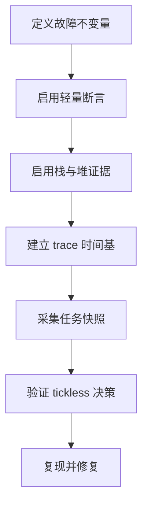
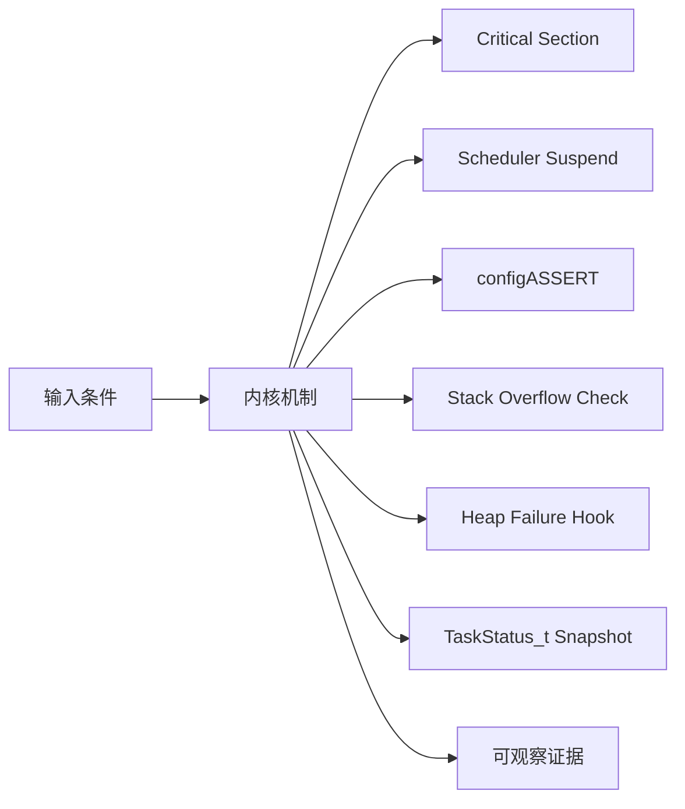
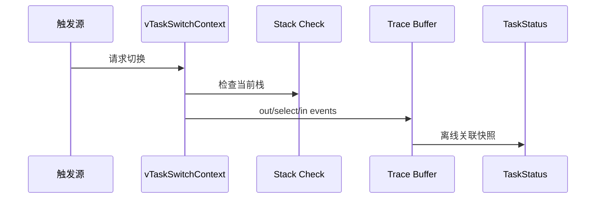
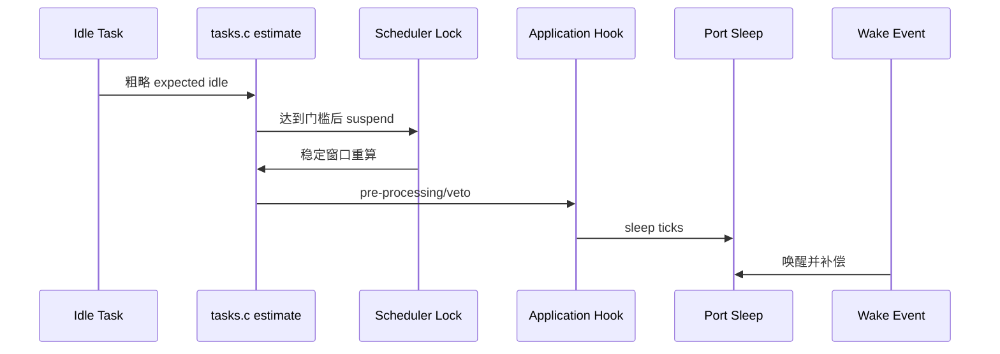
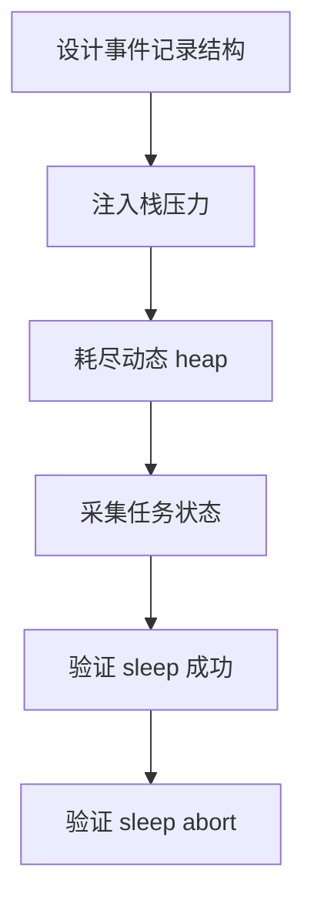
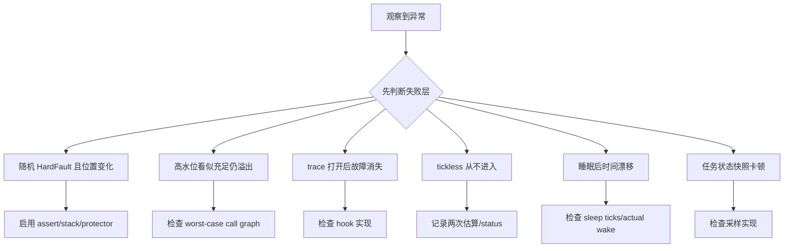

可靠性不是打开几个 hook：必须先知道它们在哪个上下文运行、能观察什么，以及观测代码是否改变调度和低功耗时序。

本篇只回答一个核心问题：**怎样用内核已有的断言、栈/堆指标、tickless 状态和 trace 定位调度延迟、内存损坏与低功耗失败？**

分析范围固定为 **FreeRTOS-Kernel V11.3.0**。所有函数、字段、宏和条件编译都以该 tag 为准。

本篇把保护原语、失败 hook、任务快照、runtime stats 和 tickless 决策连成一条证据链，强调先证明最早破坏的不变量。

## 1. 问题边界、前置条件与验收证据

不提供特定芯片睡眠代码或实测功耗；portSUPPRESS_TICKS_AND_SLEEP 的时钟补偿和唤醒源由目标 port 负责。

读者已经会使用基本任务 API，但不能把 API 行为替代为源码证明。

阅读源码前先写清输入状态、允许的状态变化和输出证据。只看函数名或最终返回值，无法判断链表、锁和调度点是否正确。



| 顺序 | 阅读动作 | 入口条件 | 状态变化 | 验收证据 |
|---:|---|---|---|---|
| 1 | 定义故障不变量 | 已观察异常。 | 确定第一类证据。 | 故障记录。 |
| 2 | 启用轻量断言 | 调试构建。 | 非法条件早停。 | assert record。 |
| 3 | 启用栈与堆证据 | 任务和 allocator 已知。 | 资源问题可量化。 | 趋势数据。 |
| 4 | 建立 trace 时间基 | 需要关联任务/ISR。 | 事件可排序。 | trace buffer。 |
| 5 | 采集任务快照 | 事件触发或周期采样。 | 状态与 runtime 可比较。 | 原始 TaskStatus。 |
| 6 | 验证 tickless 决策 | Idle 预计较长空闲。 | 睡眠或 abort 有原因。 | decision trace。 |
| 7 | 复现并修复 | 证据完整。 | 断言不再触发且回归通过。 | 前后 trace。 |

### 1. 定义故障不变量

入口条件：已观察异常。

执行动作：写出对象、时序和资源上限。

核心状态变化：确定第一类证据。

离开这一步时必须成立：不先改配置。

可观察证据：故障记录。

停止条件：现象无法重现时停止。

### 2. 启用轻量断言

入口条件：调试构建。

执行动作：实现 configASSERT 保存 PC/任务/中断状态。

核心状态变化：非法条件早停。

离开这一步时必须成立：assert context 安全。

可观察证据：assert record。

停止条件：assert 有阻塞副作用时停止。

### 3. 启用栈与堆证据

入口条件：任务和 allocator 已知。

执行动作：stack check/high-water/malloc hook/stats。

核心状态变化：资源问题可量化。

离开这一步时必须成立：采样开销可控。

可观察证据：趋势数据。

停止条件：只看单点余量时停止。

### 4. 建立 trace 时间基

入口条件：需要关联任务/ISR。

执行动作：定义单调 counter 和事件结构。

核心状态变化：事件可排序。

离开这一步时必须成立：hook 不阻塞。

可观察证据：trace buffer。

停止条件：串口 printf 在 hook 时停止。

### 5. 采集任务快照

入口条件：事件触发或周期采样。

执行动作：uxTaskGetSystemState/vTaskGetInfo。

核心状态变化：状态与 runtime 可比较。

离开这一步时必须成立：scheduler suspend 短窗口。

可观察证据：原始 TaskStatus。

停止条件：数组容量不足时停止。

### 6. 验证 tickless 决策

入口条件：Idle 预计较长空闲。

执行动作：两次 expected idle、sleep status、port hook。

核心状态变化：睡眠或 abort 有原因。

离开这一步时必须成立：scheduler suspended+critical。

可观察证据：decision trace。

停止条件：pending event 未检查时停止。

### 7. 复现并修复

入口条件：证据完整。

执行动作：只修改一个根因。

核心状态变化：断言不再触发且回归通过。

离开这一步时必须成立：同一输入。

可观察证据：前后 trace。

停止条件：同时改多个变量时停止。

## 2. 核心数据结构、所有权与不变量

critical section 保护短原子更新，scheduler suspend 允许中断但推迟任务切换；trace/hook 是观测边界，tickless 是 Idle 与 port 的协作协议。

这里不把字段当作词汇表，而是解释字段由谁修改、在哪个临界区修改、它和哪个链表或对象保持一致。



| 对象 | 角色 | 必须保持的不变量 | 观察方法 | 常见误读 |
|---|---|---|---|---|
| Critical Section | 使用 port mask 保护内核共享状态。 | 短、可嵌套、上下文规则合法。 | 记录 nesting/mask。 | 用于包围阻塞 API。 |
| Scheduler Suspend | 推迟 task switch 和 state-list 更新结算。 | 中断可运行，unblock 进入 pending ready。 | 记录 suspend depth。 | 等同关闭中断。 |
| configASSERT | 把配置和不变量失败变成可定位停止点。 | 不得有副作用且保存现场。 | 断言表达式与 PC。 | 发布版全部移除且无替代证据。 |
| Stack Overflow Check | 切换边界检查栈指针或填充值。 | 检查策略与 portSTACK_GROWTH 对齐。 | 记录任务/stack boundaries。 | 高水位等于绝对安全。 |
| Heap Failure Hook | malloc 返回 NULL 时提供应用取证入口。 | hook 不继续使用失败对象。 | requested/free stats。 | hook 中再次大量分配。 |
| TaskStatus_t Snapshot | 导出状态、优先级、栈水位和 runtime counter。 | snapshot 在 scheduler suspend 窗口一致。 | 保存原始数组。 | 只使用格式化文本。 |
| Tickless Decision | Idle 计算 expected idle，并在稳定窗口确认可睡眠。 | pending ready/yield/ticks 时 abort。 | 记录 eSleepModeStatus。 | 只要 ready list 只剩 Idle 就睡。 |
| Trace Hooks | 在 create/switch/block/ISR/low-power 等边界记录事件。 | 低开销、不阻塞、时间基统一。 | 环形 trace buffer。 | 在 hook 中打印串口。 |

### Critical Section

角色：使用 port mask 保护内核共享状态。

所有权：task/port。

不变量：短、可嵌套、上下文规则合法。

变化时机：关键字段更新。

观察方法：记录 nesting/mask。

常见误读：用于包围阻塞 API。

### Scheduler Suspend

角色：推迟 task switch 和 state-list 更新结算。

所有权：tasks.c。

不变量：中断可运行，unblock 进入 pending ready。

变化时机：复杂阻塞路径。

观察方法：记录 suspend depth。

常见误读：等同关闭中断。

### configASSERT

角色：把配置和不变量失败变成可定位停止点。

所有权：应用提供宏，内核调用。

不变量：不得有副作用且保存现场。

变化时机：参数/优先级/结构检查。

观察方法：断言表达式与 PC。

常见误读：发布版全部移除且无替代证据。

### Stack Overflow Check

角色：切换边界检查栈指针或填充值。

所有权：tasks.c/StackMacros。

不变量：检查策略与 portSTACK_GROWTH 对齐。

变化时机：vTaskSwitchContext。

观察方法：记录任务/stack boundaries。

常见误读：高水位等于绝对安全。

### Heap Failure Hook

角色：malloc 返回 NULL 时提供应用取证入口。

所有权：heap 实现/应用。

不变量：hook 不继续使用失败对象。

变化时机：动态创建或显式分配。

观察方法：requested/free stats。

常见误读：hook 中再次大量分配。

### TaskStatus_t Snapshot

角色：导出状态、优先级、栈水位和 runtime counter。

所有权：tasks.c。

不变量：snapshot 在 scheduler suspend 窗口一致。

变化时机：诊断采样。

观察方法：保存原始数组。

常见误读：只使用格式化文本。

### Tickless Decision

角色：Idle 计算 expected idle，并在稳定窗口确认可睡眠。

所有权：tasks.c/port。

不变量：pending ready/yield/ticks 时 abort。

变化时机：Idle loop。

观察方法：记录 eSleepModeStatus。

常见误读：只要 ready list 只剩 Idle 就睡。

### Trace Hooks

角色：在 create/switch/block/ISR/low-power 等边界记录事件。

所有权：内核宏/工具。

不变量：低开销、不阻塞、时间基统一。

变化时机：事件发生点。

观察方法：环形 trace buffer。

常见误读：在 hook 中打印串口。

## 3. 调用链一：任务切换边界的栈检查与 trace

vTaskSwitchContext 在选择新任务前后提供 stack check 和 switched out/in trace，是关联 current TCB、栈余量和切换原因的稳定边界。

调用链中的每一跳都要区分普通函数调用、宏展开、临界区边界和可能触发调度的 port hook。



### 调用链一：yield/Tick -> vTaskSwitchContext -> stack check -> trace out -> select -> trace in -> runtime stats

#### 链路步骤 1：记录触发源

进入时：Tick/API/ISR 已知。

本步读取：event type/time/current。

本步修改：trace entry。

并发边界：不可阻塞。

返回或转交：切换原因可见。

证据：event record。

#### 链路步骤 2：执行栈检查

进入时：current TCB 有 stack bounds。

本步读取：top/end/fill pattern。

本步修改：无或 hook。

并发边界：switch critical。

返回或转交：最早发现越界。

证据：task name/pointers。

#### 链路步骤 3：累计运行时间

进入时：runtime stats 开启。

本步读取：counter now/last switched in。

本步修改：TCB runtime counter。

并发边界：时间基单调。

返回或转交：本 slice 可归属。

证据：counter delta。

#### 链路步骤 4：记录 switched out

进入时：旧 current 尚有效。

本步读取：TCB/priority/state。

本步修改：trace event。

并发边界：选择前。

返回或转交：旧任务身份冻结。

证据：event buffer。

#### 链路步骤 5：选择并记录 switched in

进入时：ready lists 一致。

本步读取：new TCB。

本步修改：current 与 start counter。

并发边界：scheduler lock。

返回或转交：新任务身份。

证据：event sequence。

#### 链路步骤 6：离线对齐状态

进入时：安全上下文导出快照。

本步读取：TaskStatus array。

本步修改：状态/栈/runtime 表。

并发边界：短 suspend。

返回或转交：trace 可解释。

证据：raw snapshot。

### 源码片段：任务切换时执行栈检查与 trace

> 源码位置：`tasks.c` · `vTaskSwitchContext()` · `V11.3.0`
> 配置条件：configCHECK_FOR_STACK_OVERFLOW/trace 配置
> 固定链接：[查看上游源码](https://github.com/FreeRTOS/FreeRTOS-Kernel/blob/V11.3.0/tasks.c)

```c
taskCHECK_FOR_STACK_OVERFLOW();

traceTASK_SWITCHED_OUT();

taskSELECT_HIGHEST_PRIORITY_TASK();

traceTASK_SWITCHED_IN();
```

这段摘录只保留当前机制需要的语句；省略的参数检查、trace hook 或条件分支必须回到固定链接核对。

解读 1：栈检查发生在已知 current TCB 上。

解读 2：switched out 位于选择前。

解读 3：调度策略仍由公共宏执行。

解读 4：trace hook 必须保持轻量。

不变量：trace in/out 顺序与 current TCB 更新一致。

观察点：保存 event timestamp、old/new TCB 与 trigger。

### 源码片段：stack high-water 扫描未使用填充值

> 源码位置：`tasks.c` · `uxTaskGetStackHighWaterMark()` · `V11.3.0`
> 配置条件：INCLUDE_uxTaskGetStackHighWaterMark == 1
> 固定链接：[查看上游源码](https://github.com/FreeRTOS/FreeRTOS-Kernel/blob/V11.3.0/tasks.c)

```c
#if portSTACK_GROWTH < 0
    pucEndOfStack = ( uint8_t * ) pxTCB->pxStack;
#else
    pucEndOfStack = ( uint8_t * ) pxTCB->pxEndOfStack;
#endif

uxReturn = ( UBaseType_t ) prvTaskCheckFreeStackSpace( pucEndOfStack );
```

这段摘录只保留当前机制需要的语句；省略的参数检查、trace hook 或条件分支必须回到固定链接核对。

解读 1：扫描起点随栈增长方向改变。

解读 2：结果基于创建时填充值。

解读 3：单位与配置的 stack type 相关。

解读 4：运行历史未覆盖所有路径时余量可能乐观。

不变量：高水位是历史最小余量，不是未来安全保证。

观察点：结合最大调用深度、ISR/FPU frame 与长期趋势。

## 4. 调用链二：Idle 两阶段 tickless sleep 决策

Idle 先做无锁粗测，达到阈值后 suspend scheduler，再精确重算并允许应用 veto，最后才调用 port sleep。

第二条链用于验证同一对象在另一条执行路径上的行为，重点检查它是否复用相同不变量，还是进入 ISR、daemon 或 portable 层的特殊规则。



### 调用链二：Idle -> prvGetExpectedIdleTime -> vTaskSuspendAll -> confirm/recompute -> pre hook -> portSUPPRESS_TICKS_AND_SLEEP -> xTaskResumeAll

#### 链路步骤 1：粗测空闲

进入时：Idle 正在运行。

本步读取：next unblock/tick。

本步修改：expected idle。

并发边界：无 scheduler lock，结果仅筛选。

返回或转交：是否达到门槛。

证据：trace estimate。

#### 链路步骤 2：挂起 scheduler

进入时：粗测足够长。

本步读取：suspend depth。

本步修改：状态链表稳定窗口。

并发边界：中断仍可运行。

返回或转交：准备精确判断。

证据：suspend trace。

#### 链路步骤 3：精确重算

进入时：scheduler suspended。

本步读取：next unblock/current tick。

本步修改：可靠 expected idle。

并发边界：assert next>=tick。

返回或转交：可传给 port。

证据：second estimate。

#### 链路步骤 4：确认无 pending

进入时：可能有 ISR 事件。

本步读取：pending ready/yield/pended ticks。

本步修改：sleep/abort status。

并发边界：critical section。

返回或转交：不丢 wake。

证据：status enum。

#### 链路步骤 5：应用 pre hook

进入时：内核允许睡眠。

本步读取：业务 veto/expected value。

本步修改：可能置零。

并发边界：不得阻塞。

返回或转交：最终 sleep ticks。

证据：hook trace。

#### 链路步骤 6：port sleep 与恢复

进入时：ticks 仍达门槛。

本步读取：低功耗 timer/wake source。

本步修改：Tick 补偿和 scheduler resume。

并发边界：portable 边界。

返回或转交：时间连续。

证据：sleep begin/end。

### 源码片段：Idle 在稳定窗口调用 tickless port hook

> 源码位置：`tasks.c` · `prvIdleTask() tickless block` · `V11.3.0`
> 配置条件：configUSE_TICKLESS_IDLE != 0
> 固定链接：[查看上游源码](https://github.com/FreeRTOS/FreeRTOS-Kernel/blob/V11.3.0/tasks.c)

```c
xExpectedIdleTime = prvGetExpectedIdleTime();
if( xExpectedIdleTime >= configEXPECTED_IDLE_TIME_BEFORE_SLEEP )
{
    vTaskSuspendAll();
    xExpectedIdleTime = prvGetExpectedIdleTime();
    configPRE_SUPPRESS_TICKS_AND_SLEEP_PROCESSING( xExpectedIdleTime );
    if( xExpectedIdleTime >= configEXPECTED_IDLE_TIME_BEFORE_SLEEP )
    {
        portSUPPRESS_TICKS_AND_SLEEP( xExpectedIdleTime );
    }
    ( void ) xTaskResumeAll();
}
```

这段摘录只保留当前机制需要的语句；省略的参数检查、trace hook 或条件分支必须回到固定链接核对。

解读 1：第一次估算只是避免频繁 suspend。

解读 2：第二次在稳定窗口使用。

解读 3：应用 hook 可以 veto 或缩短。

解读 4：port 负责真正 timer/clock 和 Tick 补偿。

不变量：进入 port sleep 前不存在已知应立即调度的任务事件。

观察点：记录两次 expected、sleep status、pending lists 和实际补偿 ticks。

### 源码片段：sleep status 会因 pending 工作中止

> 源码位置：`tasks.c` · `eTaskConfirmSleepModeStatus()` · `V11.3.0`
> 配置条件：configUSE_TICKLESS_IDLE != 0
> 固定链接：[查看上游源码](https://github.com/FreeRTOS/FreeRTOS-Kernel/blob/V11.3.0/tasks.c)

```c
if( listCURRENT_LIST_LENGTH( &xPendingReadyList ) != 0U )
{
    eReturn = eAbortSleep;
}
else if( xYieldPendings[ portGET_CORE_ID() ] != pdFALSE )
{
    eReturn = eAbortSleep;
}
else if( xPendedTicks != 0U )
{
    eReturn = eAbortSleep;
}
```

这段摘录只保留当前机制需要的语句；省略的参数检查、trace hook 或条件分支必须回到固定链接核对。

解读 1：ISR 在 suspend 窗口可产生 pending ready。

解读 2：yield pending 表示已有切换请求。

解读 3：pended ticks 表示时间工作待结算。

解读 4：任一条件都不应进入深睡。

不变量：睡眠决策不能跨越已经发生但尚未结算的内核事件。

观察点：在 abort trace 中记录三项状态。

## 5. 配置矩阵、观测实验与证据记录

使用可控输入和 trace hook 观察对象变化，不依赖特定开发板。

实验只承诺观察软件状态和调用顺序。没有实际目标硬件或 trace 数据时，不写虚构时间和性能数字。



### 配置矩阵

| 配置或条件 | 取值 A | 取值 B | 源码影响 | 验证重点 |
|---|---|---|---|---|
| configASSERT | 关闭 | 启用保存现场 | 决定大量运行期契约检查。 | 注入非法优先级。 |
| configCHECK_FOR_STACK_OVERFLOW | 0 | 1/2 及 port 扩展 | 决定栈检查方式。 | 制造受控越界。 |
| INCLUDE_uxTaskGetStackHighWaterMark | 0 | 1 | 决定栈余量 API。 | 比较长期趋势。 |
| configUSE_MALLOC_FAILED_HOOK | 0 | 1 | 决定分配失败入口。 | 耗尽 heap 验证。 |
| configGENERATE_RUN_TIME_STATS | 0 | 1 | 决定 per-task runtime counter。 | 核对时间基。 |
| configUSE_TICKLESS_IDLE | 0 | 非零 | 决定 Idle sleep 路径。 | 验证 sleep/abort。 |

### 实验步骤

1. **设计事件记录结构**

   操作：固定 type/time/task/arg。

   记录：结构大小和写入路径。

   通过标准：hook 无阻塞。

2. **注入栈压力**

   操作：逐级增加调用深度。

   记录：high-water/overflow hook。

   通过标准：在破坏前看到趋势。

3. **耗尽动态 heap**

   操作：有界申请直到失败。

   记录：requested/stats/hook。

   通过标准：失败可诊断且无 NULL 使用。

4. **采集任务状态**

   操作：周期调用 system state。

   记录：state/priority/stack/runtime。

   通过标准：数组完整。

5. **验证 sleep 成功**

   操作：仅未来远期 timeout。

   记录：两次 expected/port trace。

   通过标准：进入并正确补偿。

6. **验证 sleep abort**

   操作：ISR 在 suspend 窗口 ready 任务。

   记录：pending/status。

   通过标准：不进入 sleep。

### 证据表

| 证据 | 获取方法 | 通过标准 | 失败说明 |
|---|---|---|---|
| 断言现场 | assert hook 保存 PC/current/context | 首次非法条件明确 | 只重启会丢根因 |
| 栈趋势 | high-water 时间序列 | 最小余量稳定且有预算 | 单点值无法覆盖罕见路径 |
| heap 证据 | requested+HeapStats | largest/free/count 可解释失败 | total free 单项误导 |
| 切换 trace | in/out 与 trigger | 每次 current 变化有原因 | 串口日志改变时序 |
| runtime counter | TaskStatus 原始数组 | delta 与切换事件相符 | counter wrap/频率不明会错误 |
| tickless 决策 | expected/status/pending/compensation | sleep 或 abort 可解释 | 只看功耗看不到内核原因 |

#### 证据：断言现场

获取方法：assert hook 保存 PC/current/context

应当看到：首次非法条件明确

如果不满足：只重启会丢根因

为什么这项证据有效：断言把远端崩溃前移。

#### 证据：栈趋势

获取方法：high-water 时间序列

应当看到：最小余量稳定且有预算

如果不满足：单点值无法覆盖罕见路径

为什么这项证据有效：趋势结合 worst-case 才有效。

#### 证据：heap 证据

获取方法：requested+HeapStats

应当看到：largest/free/count 可解释失败

如果不满足：total free 单项误导

为什么这项证据有效：连续块决定成功。

#### 证据：切换 trace

获取方法：in/out 与 trigger

应当看到：每次 current 变化有原因

如果不满足：串口日志改变时序

为什么这项证据有效：内存事件环保留原始顺序。

#### 证据：runtime counter

获取方法：TaskStatus 原始数组

应当看到：delta 与切换事件相符

如果不满足：counter wrap/频率不明会错误

为什么这项证据有效：统一时间基才能比较。

#### 证据：tickless 决策

获取方法：expected/status/pending/compensation

应当看到：sleep 或 abort 可解释

如果不满足：只看功耗看不到内核原因

为什么这项证据有效：决策链比最终电流更早定位。

## 6. 常见误读、故障定位与修复原则

排错从最早被破坏的不变量开始，不从最终崩溃位置随机回退。

先验证对象成员和链表归属，再检查锁、配置分支和调度请求。



### 1. 随机 HardFault 且位置变化

根因：早期栈/heap 越界

第一检查点：启用 assert/stack/protector

需要保存的证据：首次异常前 trace

修复原则：修复边界与预算

不能采用的绕过方式：不要只解析最后一次 PC。

### 2. 高水位看似充足仍溢出

根因：罕见路径、ISR/FPU frame 未覆盖

第一检查点：检查 worst-case call graph

需要保存的证据：长期水位与异常 frame

修复原则：增加证据和合理 margin

不能采用的绕过方式：不要把历史值当证明。

### 3. trace 打开后故障消失

根因：hook printf 改变调度时序

第一检查点：检查 hook 实现

需要保存的证据：事件开销与阻塞

修复原则：改用无锁/短临界内存环

不能采用的绕过方式：不要提高日志优先级。

### 4. tickless 从不进入

根因：expected 低、pending 工作或 port veto

第一检查点：记录两次估算/status

需要保存的证据：pending lists/yield/ticks

修复原则：按根因减少活动或修 port

不能采用的绕过方式：不要降低门槛掩盖。

### 5. 睡眠后时间漂移

根因：port timer 补偿错误

第一检查点：检查 sleep ticks/actual wake

需要保存的证据：前后 Tick 与 timer counter

修复原则：修正 portSUPPRESS 实现

不能采用的绕过方式：不要在应用手工改 Tick。

### 6. 任务状态快照卡顿

根因：数组格式化或 suspend 窗口过长

第一检查点：检查采样实现

需要保存的证据：duration/task count

修复原则：保存原始数组离线格式化

不能采用的绕过方式：不要在高优先级循环打印。

### 7. malloc hook 再次崩溃

根因：hook 内分配或使用失败对象

第一检查点：检查 hook call tree

需要保存的证据：requested/stats/current

修复原则：只记录静态证据并安全降级

不能采用的绕过方式：不要在 hook 构建动态字符串。

## 7. 源码索引、阶段验收与面试表达

完成本篇后，读者应能不依赖文章复述对象模型、两条调用链、配置差异和取证顺序。

### 源码索引

| 文件 | 结构体 / 函数 / 宏 | 作用 |
|---|---|---|
| [tasks.c](https://github.com/FreeRTOS/FreeRTOS-Kernel/blob/V11.3.0/tasks.c) | vTaskSwitchContext、Idle、tickless | 调度与低功耗观测点 |
| [include/StackMacros.h](https://github.com/FreeRTOS/FreeRTOS-Kernel/blob/V11.3.0/include/StackMacros.h) | taskCHECK_FOR_STACK_OVERFLOW | 栈检查策略 |
| [tasks.c](https://github.com/FreeRTOS/FreeRTOS-Kernel/blob/V11.3.0/tasks.c) | uxTaskGetSystemState、vTaskGetInfo | 任务状态快照 |
| [include/task.h](https://github.com/FreeRTOS/FreeRTOS-Kernel/blob/V11.3.0/include/task.h) | high-water/runtime stats API | 公开诊断接口 |
| [portable/MemMang/heap_4.c](https://github.com/FreeRTOS/FreeRTOS-Kernel/blob/V11.3.0/portable/MemMang/heap_4.c) | malloc failed hook/stats | 内存失败证据 |

### 阶段验收

1. 能区分 critical 与 scheduler suspend。
2. 能设计无阻塞 assert 现场。
3. 能正确解释 stack high-water。
4. 能采集 heap 多指标。
5. 能建立切换 trace 时间线。
6. 能使用 TaskStatus 原始数据。
7. 能推演 tickless 两阶段决策。
8. 能定位 sleep abort 与时间漂移。

### 验收记录模板

| 项目 | 实际证据 | 结论 |
|---|---|---|
| 能区分 critical 与 scheduler suspend。 |  |  |
| 能设计无阻塞 assert 现场。 |  |  |
| 能正确解释 stack high-water。 |  |  |
| 能采集 heap 多指标。 |  |  |
| 能建立切换 trace 时间线。 |  |  |
| 能使用 TaskStatus 原始数据。 |  |  |
| 能推演 tickless 两阶段决策。 |  |  |
| 能定位 sleep abort 与时间漂移。 |  |  |

### 面试表达

Critical section 屏蔽一部分中断来保护短原子更新；scheduler suspend 不关中断，而是把 ISR 解阻塞的任务放到 pending ready，恢复时再结算。

Stack high-water 是历史最小余量，不覆盖尚未执行的罕见路径、异常嵌套或 FPU frame，因此必须结合 worst-case 和长期 trace。

Tickless 在 Idle 中先粗测，suspend scheduler 后精确重算，并在 pending ready、yield pending 或 pended ticks 存在时中止睡眠。

### 参考资料

- [FreeRTOS-Kernel V11.3.0](https://github.com/FreeRTOS/FreeRTOS-Kernel/tree/V11.3.0)
- [FreeRTOS Kernel Book](https://github.com/FreeRTOS/FreeRTOS-Kernel-Book)

> 🏷️ FreeRTOS / Reliability / Tickless Idle / Trace / Stack Overflow / Debug
