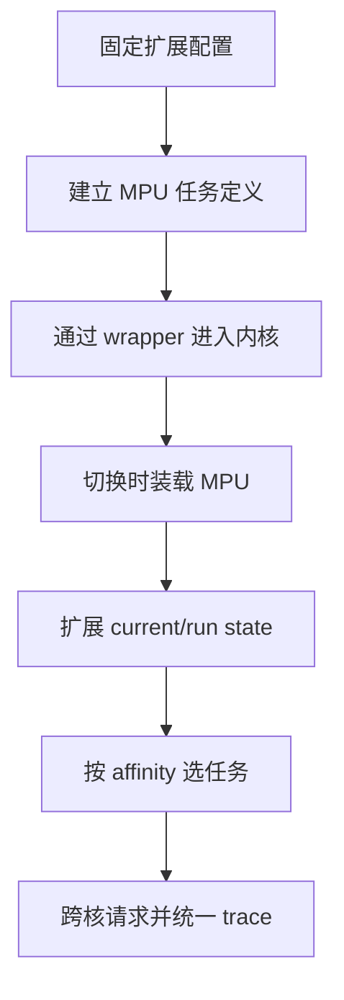
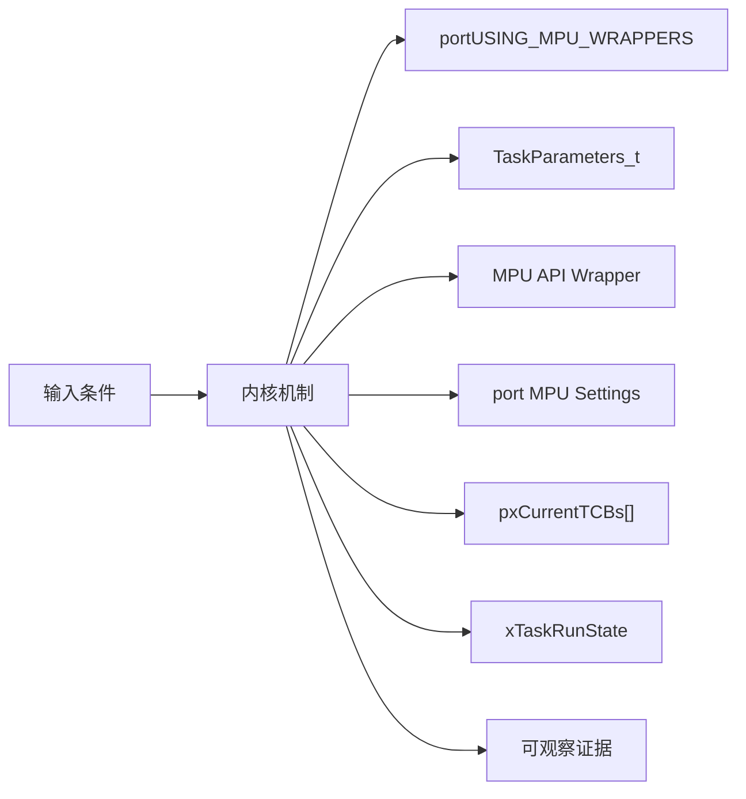
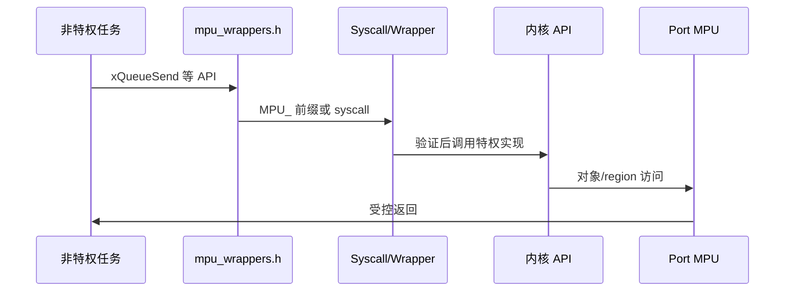
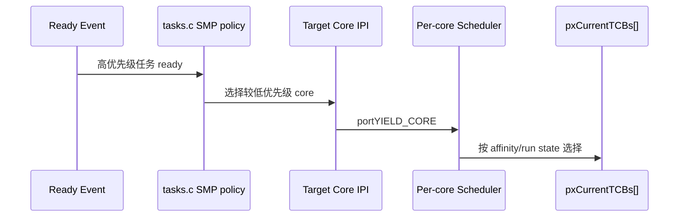
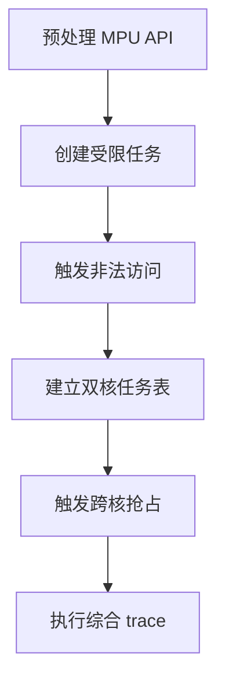
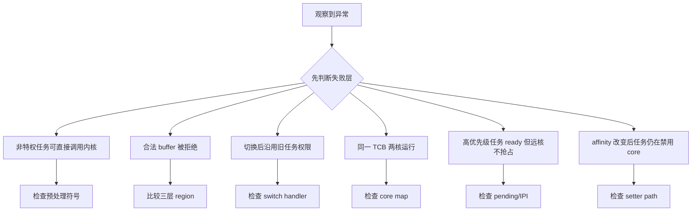

MPU 和 SMP 都不是给经典单核调度器增加一个开关：MPU改变 API 进入内核的信任边界，SMP改变“当前任务”和“是否正在运行”的定义。

本篇只回答一个核心问题：**V11.3.0 如何扩展单核内核以支持任务内存隔离和多核调度，又怎样用 trace 证明跨层行为？**

分析范围固定为 **FreeRTOS-Kernel V11.3.0**。所有函数、字段、宏和条件编译都以该 tag 为准。

本篇先拆 MPU wrapper/受限任务/region 设置，再拆 pxCurrentTCBs、run state、affinity 与 cross-core yield，最后用统一事件模型观察 task、queue、ISR 与 port。

## 1. 问题边界、前置条件与验收证据

MPU 寄存器布局由具体 MPU port 实现，SMP 跨核中断由 portYIELD_CORE 实现；公共源码只定义通用契约和调度策略。

读者已经会使用基本任务 API，但不能把 API 行为替代为源码证明。

阅读源码前先写清输入状态、允许的状态变化和输出证据。只看函数名或最终返回值，无法判断链表、锁和调度点是否正确。



| 顺序 | 阅读动作 | 入口条件 | 状态变化 | 验收证据 |
|---:|---|---|---|---|
| 1 | 固定扩展配置 | 单核主线已理解。 | 编译分支明确。 | 预处理清单。 |
| 2 | 建立 MPU 任务定义 | region 和 privilege 需求明确。 | 通用权限模型。 | 参数表。 |
| 3 | 通过 wrapper 进入内核 | 非特权任务调用 API。 | 特权实现被安全调用。 | call trace。 |
| 4 | 切换时装载 MPU | scheduler 选择任务。 | 硬件 regions 更新。 | region snapshot。 |
| 5 | 扩展 current/run state | SMP 构建。 | 每核 scheduler state。 | core map。 |
| 6 | 按 affinity 选任务 | ready lists 共享。 | pxCurrentTCBs[core] 更新。 | selected TCB。 |
| 7 | 跨核请求并统一 trace | 新高任务或 affinity 改变。 | 远核进入 switch。 | source-target event。 |

### 1. 固定扩展配置

入口条件：单核主线已理解。

执行动作：分别启用 MPU 或 SMP 所需宏。

核心状态变化：编译分支明确。

离开这一步时必须成立：不同时混入所有变量。

可观察证据：预处理清单。

停止条件：port 不支持时停止。

### 2. 建立 MPU 任务定义

入口条件：region 和 privilege 需求明确。

执行动作：填写 TaskParameters 与 stack。

核心状态变化：通用权限模型。

离开这一步时必须成立：应用负责输入。

可观察证据：参数表。

停止条件：区域重叠/对齐不明时停止。

### 3. 通过 wrapper 进入内核

入口条件：非特权任务调用 API。

执行动作：宏重定向/syscall/参数验证。

核心状态变化：特权实现被安全调用。

离开这一步时必须成立：port 异常边界。

可观察证据：call trace。

停止条件：直接链接内核函数时停止。

### 4. 切换时装载 MPU

入口条件：scheduler 选择任务。

执行动作：读取 TCB MPU settings。

核心状态变化：硬件 regions 更新。

离开这一步时必须成立：port context switch。

可观察证据：region snapshot。

停止条件：旧任务权限残留时停止。

### 5. 扩展 current/run state

入口条件：SMP 构建。

执行动作：初始化 per-core arrays 和 Idle tasks。

核心状态变化：每核 scheduler state。

离开这一步时必须成立：task/ISR locks。

可观察证据：core map。

停止条件：同一 TCB 多核运行时停止。

### 6. 按 affinity 选任务

入口条件：ready lists 共享。

执行动作：遍历最高优先级且 not running/mask 命中。

核心状态变化：pxCurrentTCBs[core] 更新。

离开这一步时必须成立：scheduler locks。

可观察证据：selected TCB。

停止条件：找不到 Idle 时停止。

### 7. 跨核请求并统一 trace

入口条件：新高任务或 affinity 改变。

执行动作：设置 target yield pending，portYIELD_CORE。

核心状态变化：远核进入 switch。

离开这一步时必须成立：IPI/port boundary。

可观察证据：source-target event。

停止条件：无 core ID 事件时停止。

## 2. 核心数据结构、所有权与不变量

MPU 把用户 API 重定向到受控 syscall wrapper并为 TCB 增加 port MPU settings；SMP 把 current、yield pending、Idle task 扩展为每核数组，并给任务增加 run state 与 affinity mask。

这里不把字段当作词汇表，而是解释字段由谁修改、在哪个临界区修改、它和哪个链表或对象保持一致。



| 对象 | 角色 | 必须保持的不变量 | 观察方法 | 常见误读 |
|---|---|---|---|---|
| portUSING_MPU_WRAPPERS | 标识当前 port 支持 MPU API 包装。 | wrapper 宏与实现版本一致。 | 预处理检查。 | 只设置 configENABLE_MPU 即完成隔离。 |
| TaskParameters_t | 描述受限任务入口、栈、优先级和 memory regions。 | region 地址、长度、权限合法。 | 记录参数与 TCB settings。 | 把 region 数组当通用页表。 |
| MPU API Wrapper | 把非特权 API 调用转入特权内核实现。 | 参数先验证，再访问内核对象。 | 记录 syscall number/context。 | wrapper 只改函数名不改权限。 |
| port MPU Settings | TCB 内的架构区域配置。 | 任务切换时与 current TCB 同步装载。 | 读取 region registers。 | 公共内核直接写硬件 region。 |
| pxCurrentTCBs[] | 每个 core 一个 current TCB。 | 同一 TCB 不同时运行在两个 core。 | 记录 core->TCB。 | 继续使用单一 pxCurrentTCB 地址。 |
| xTaskRunState | 编码 not running、core ID 或 scheduled-to-yield。 | 运行状态与 current array 一致。 | 记录 state。 | ready 就等于未运行。 |
| uxCoreAffinityMask | 限制任务可运行 core 集合。 | 至少一个允许 core，选择时必须命中 mask。 | 记录 mask/core。 | affinity 自动做负载均衡。 |
| portYIELD_CORE | 请求另一个 core 进入调度。 | 目标 core 有对应 yield pending 与 IPI/机制。 | 记录 source/target core。 | 普通函数调用能同步切换远核。 |

### portUSING_MPU_WRAPPERS

角色：标识当前 port 支持 MPU API 包装。

所有权：portmacro/common headers。

不变量：wrapper 宏与实现版本一致。

变化时机：include 展开。

观察方法：预处理检查。

常见误读：只设置 configENABLE_MPU 即完成隔离。

### TaskParameters_t

角色：描述受限任务入口、栈、优先级和 memory regions。

所有权：应用/task API。

不变量：region 地址、长度、权限合法。

变化时机：restricted create。

观察方法：记录参数与 TCB settings。

常见误读：把 region 数组当通用页表。

### MPU API Wrapper

角色：把非特权 API 调用转入特权内核实现。

所有权：mpu_wrappers。

不变量：参数先验证，再访问内核对象。

变化时机：API 调用。

观察方法：记录 syscall number/context。

常见误读：wrapper 只改函数名不改权限。

### port MPU Settings

角色：TCB 内的架构区域配置。

所有权：MPU port。

不变量：任务切换时与 current TCB 同步装载。

变化时机：create/update/switch。

观察方法：读取 region registers。

常见误读：公共内核直接写硬件 region。

### pxCurrentTCBs[]

角色：每个 core 一个 current TCB。

所有权：tasks.c/port。

不变量：同一 TCB 不同时运行在两个 core。

变化时机：每核 switch。

观察方法：记录 core->TCB。

常见误读：继续使用单一 pxCurrentTCB 地址。

### xTaskRunState

角色：编码 not running、core ID 或 scheduled-to-yield。

所有权：TCB SMP 字段。

不变量：运行状态与 current array 一致。

变化时机：select/yield/delete/affinity change。

观察方法：记录 state。

常见误读：ready 就等于未运行。

### uxCoreAffinityMask

角色：限制任务可运行 core 集合。

所有权：TCB。

不变量：至少一个允许 core，选择时必须命中 mask。

变化时机：create/set affinity。

观察方法：记录 mask/core。

常见误读：affinity 自动做负载均衡。

### portYIELD_CORE

角色：请求另一个 core 进入调度。

所有权：SMP port。

不变量：目标 core 有对应 yield pending 与 IPI/机制。

变化时机：高任务 ready/affinity 变化。

观察方法：记录 source/target core。

常见误读：普通函数调用能同步切换远核。

## 3. 调用链一：非特权 API 通过 MPU wrapper 进入内核

公共头文件在 MPU port 下把 API 名称映射为 MPU wrapper；wrapper/系统调用验证参数和权限，再调用真正内核实现。

调用链中的每一跳都要区分普通函数调用、宏展开、临界区边界和可能触发调度的 port hook。



### 调用链一：unprivileged task -> API macro -> MPU wrapper/syscall -> parameter/access validation -> privileged kernel -> return

#### 链路步骤 1：API 重定向

进入时：portUSING_MPU_WRAPPERS。

本步读取：宏与 wrapper version。

本步修改：调用符号改变。

并发边界：预处理。

返回或转交：非特权不直达内核。

证据：symbol map。

#### 链路步骤 2：进入 syscall

进入时：任务运行非特权。

本步读取：参数、syscall number、stack frame。

本步修改：异常上下文。

并发边界：port gate。

返回或转交：切换到特权。

证据：exception trace。

#### 链路步骤 3：验证 buffer/object

进入时：wrapper 收到参数。

本步读取：task MPU settings/ACL/length。

本步修改：允许或拒绝。

并发边界：特权检查。

返回或转交：无越界内核访问。

证据：validation result。

#### 链路步骤 4：调用真实实现

进入时：验证通过。

本步读取：内核对象。

本步修改：queue/task 等状态。

并发边界：普通内核锁。

返回或转交：结果产生。

证据：trace API。

#### 链路步骤 5：返回非特权

进入时：内核完成。

本步读取：返回值和异常 frame。

本步修改：Thread privilege 恢复。

并发边界：port return。

返回或转交：调用者继续。

证据：CONTROL/status。

#### 链路步骤 6：切换任务 region

进入时：scheduler 选择新任务。

本步读取：TCB MPU settings。

本步修改：硬件 region register。

并发边界：context switch。

返回或转交：新任务权限生效。

证据：region dump。

### 源码片段：MPU 构建把公开 API 重定向到 wrapper

> 源码位置：`include/mpu_wrappers.h` · `API name mappings` · `V11.3.0`
> 配置条件：portUSING_MPU_WRAPPERS == 1
> 固定链接：[查看上游源码](https://github.com/FreeRTOS/FreeRTOS-Kernel/blob/V11.3.0/include/mpu_wrappers.h)

```c
#if ( portUSING_MPU_WRAPPERS == 1 )
    #ifndef MPU_WRAPPERS_INCLUDED_FROM_API_FILE
        #define xTaskCreateRestricted       MPU_xTaskCreateRestricted
        #define vTaskDelay                 MPU_vTaskDelay
        #define xQueueGenericSend          MPU_xQueueGenericSend
    #endif
#endif
```

这段摘录只保留当前机制需要的语句；省略的参数检查、trace hook 或条件分支必须回到固定链接核对。

解读 1：真实映射按 wrapper v1/v2 和 API guard 展开。

解读 2：内核源文件定义 MPU_WRAPPERS_INCLUDED_FROM_API_FILE 避免自重定向。

解读 3：应用看到 MPU_ wrapper 而非直接实现。

解读 4：wrapper 仍需 port 提供权限切换。

不变量：非特权可见 API 必须经过匹配 wrapper，内核自身调用不能递归重定向。

观察点：比较应用与内核翻译单元预处理符号。

### 源码片段：受限任务参数携带内存区域

> 源码位置：`include/task.h` · `TaskParameters_t / MemoryRegion_t` · `V11.3.0`
> 配置条件：portUSING_MPU_WRAPPERS == 1
> 固定链接：[查看上游源码](https://github.com/FreeRTOS/FreeRTOS-Kernel/blob/V11.3.0/include/task.h)

```c
typedef struct xMEMORY_REGION
{
    void * pvBaseAddress;
    size_t ulLengthInBytes;
    uint32_t ulParameters;
} MemoryRegion_t;

typedef struct xTASK_PARAMETERS
{
    TaskFunction_t pvTaskCode;
    const MemoryRegion_t xRegions[ portNUM_CONFIGURABLE_REGIONS ];
} TaskParameters_t;
```

这段摘录只保留当前机制需要的语句；省略的参数检查、trace hook 或条件分支必须回到固定链接核对。

解读 1：真实 TaskParameters 还包含名称、栈、参数和优先级。

解读 2：region 是架构无关描述。

解读 3：port 把通用参数翻译为 MPU 寄存器设置。

解读 4：区域对齐和数量由 port 约束。

不变量：每个通用 region 必须能无歧义转换为目标 MPU 权限和边界。

观察点：保存 TaskParameters 与 TCB xMPUSettings/硬件 region 对照。

## 4. 调用链二：SMP 选择任务与跨核 yield

SMP ready lists 仍共享，但选择时必须跳过正在其他 core 运行或不匹配 affinity 的 TCB；新高优先级任务可能要求远核 yield。

第二条链用于验证同一对象在另一条执行路径上的行为，重点检查它是否复用相同不变量，还是进入 ISR、daemon 或 portable 层的特殊规则。



### 调用链二：task ready -> compare every core -> prvYieldForTask/prvYieldCore -> portYIELD_CORE -> per-core vTaskSwitchContext -> prvSelectHighestPriorityTask

#### 链路步骤 1：新任务 ready

进入时：共享 list 更新。

本步读取：priority/affinity/run state。

本步修改：候选任务。

并发边界：task+ISR locks。

返回或转交：需要比较 cores。

证据：ready event。

#### 链路步骤 2：扫描 current cores

进入时：每核 current 有效。

本步读取：priority/yield pending/affinity。

本步修改：目标 core。

并发边界：scheduler policy。

返回或转交：找到可被抢占 core。

证据：core table。

#### 链路步骤 3：设置 yield pending

进入时：目标确定。

本步读取：xYieldPendings[target]。

本步修改：跨核请求状态。

并发边界：锁保护。

返回或转交：防重复 request。

证据：pending array。

#### 链路步骤 4：触发 port IPI

进入时：target 可能远核。

本步读取：core ID。

本步修改：架构中断/事件。

并发边界：portYIELD_CORE。

返回或转交：远核进入 handler。

证据：IPI trace。

#### 链路步骤 5：保存目标 core current

进入时：远核 switch。

本步读取：pxCurrentTCBs[target]/run state。

本步修改：旧任务 not running/yield state。

并发边界：per-core port。

返回或转交：可重新选择。

证据：run-state trace。

#### 链路步骤 6：选择兼容任务

进入时：ready lists 非空。

本步读取：not running 与 affinity mask。

本步修改：new current/run state。

并发边界：prvSelectHighestPriorityTask。

返回或转交：同一 TCB 不重复运行。

证据：core->TCB map。

### 源码片段：SMP 将 current 与 yield pending 扩为每核数组

> 源码位置：`tasks.c` · `pxCurrentTCBs / xYieldPendings` · `V11.3.0`
> 配置条件：configNUMBER_OF_CORES > 1
> 固定链接：[查看上游源码](https://github.com/FreeRTOS/FreeRTOS-Kernel/blob/V11.3.0/tasks.c)

```c
TCB_t * volatile pxCurrentTCBs[ configNUMBER_OF_CORES ];
static volatile BaseType_t xYieldPendings[ configNUMBER_OF_CORES ] = { pdFALSE };
static TaskHandle_t xIdleTaskHandles[ configNUMBER_OF_CORES ];

#define pxCurrentTCB    xTaskGetCurrentTaskHandle()
```

这段摘录只保留当前机制需要的语句；省略的参数检查、trace hook 或条件分支必须回到固定链接核对。

解读 1：每个 core 有 current、yield 状态和 Idle task。

解读 2：兼容宏返回调用 core 的 current。

解读 3：共享 ready/delayed lists 仍需多核锁。

解读 4：trace 必须总是携带 core ID。

不变量：每个 core 恰有一个 current，任一非 Idle TCB 最多在一个 core 运行。

观察点：周期采样 core->TCB、run state、yield pending。

### 源码片段：SMP 选择同时检查 run state 与 affinity

> 源码位置：`tasks.c` · `prvSelectHighestPriorityTask()` · `V11.3.0`
> 配置条件：configNUMBER_OF_CORES > 1
> 固定链接：[查看上游源码](https://github.com/FreeRTOS/FreeRTOS-Kernel/blob/V11.3.0/tasks.c)

```c
for( pxIterator = listGET_HEAD_ENTRY( pxReadyList );
     pxIterator != pxEndMarker;
     pxIterator = listGET_NEXT( pxIterator ) )
{
    pxTCB = ( TCB_t * ) listGET_LIST_ITEM_OWNER( pxIterator );
    if( pxTCB->xTaskRunState == taskTASK_NOT_RUNNING )
    {
        if( ( pxTCB->uxCoreAffinityMask & ( 1U << xCoreID ) ) != 0U )
        {
            pxTCB->xTaskRunState = xCoreID;
            pxCurrentTCBs[ xCoreID ] = pxTCB;
        }
    }
}
```

这段摘录只保留当前机制需要的语句；省略的参数检查、trace hook 或条件分支必须回到固定链接核对。

解读 1：源码中 affinity 检查受 configUSE_CORE_AFFINITY guard。

解读 2：ready 不代表未在其他 core 运行。

解读 3：选择成功要同时更新 run state 和 current array。

解读 4：同优先级遍历仍考虑公平性。

不变量：选中的 TCB 未在其他 core 运行且 affinity 包含目标 core。

观察点：记录 ready owner、run state、mask、target core 和 current array。

<!-- IMAGE_PROMPT: 16:9 技术架构插画，左半展示非特权任务通过 syscall wrapper 进入特权 FreeRTOS 内核并受 MPU regions 限制，右半展示双核 scheduler 共享 ready lists、每核 current TCB、affinity mask 和 cross-core yield；红青黄配色，无芯片型号、无厂商 logo。 -->

## 5. 配置矩阵、观测实验与证据记录

使用可控输入和 trace hook 观察对象变化，不依赖特定开发板。

实验只承诺观察软件状态和调用顺序。没有实际目标硬件或 trace 数据时，不写虚构时间和性能数字。



### 配置矩阵

| 配置或条件 | 取值 A | 取值 B | 源码影响 | 验证重点 |
|---|---|---|---|---|
| configENABLE_MPU | 0 | 1 | 决定 port MPU 能力与 TCB settings。 | 检查 port 支持。 |
| configUSE_MPU_WRAPPERS_V1 | 0 | 1 | 选择 wrapper v2 或 v1。 | 比较 API 映射。 |
| configENABLE_ACCESS_CONTROL_LIST | 0 | 1 | 增加内核对象 ACL 检查。 | 验证 handle access。 |
| configNUMBER_OF_CORES | 1 | 大于 1 | 选择单 current 或 per-core SMP。 | 检查函数签名。 |
| configUSE_CORE_AFFINITY | 0 | 1 | 决定 affinity mask 字段与 API。 | 验证任务迁移限制。 |
| configRUN_MULTIPLE_PRIORITIES | 0 | 1 | 决定不同 core 能否同时运行不同非 Idle 优先级。 | 构造优先级组合。 |

### 实验步骤

1. **预处理 MPU API**

   操作：比较应用/内核翻译单元。

   记录：wrapper 符号。

   通过标准：无递归映射。

2. **创建受限任务**

   操作：定义只读/读写/XN region。

   记录：TaskParameters/TCB settings。

   通过标准：权限符合设计。

3. **触发非法访问**

   操作：访问 region 外地址。

   记录：fault context/task/region。

   通过标准：隔离失败可定位。

4. **建立双核任务表**

   操作：不同 priority/affinity。

   记录：ready/run/current arrays。

   通过标准：无重复运行。

5. **触发跨核抢占**

   操作：新高任务 ready。

   记录：source/target/pending/IPI。

   通过标准：目标 core 切换。

6. **执行综合 trace**

   操作：任务+queue+ISR+Tick。

   记录：统一 core/time/event。

   通过标准：可重建完整时间线。

### 证据表

| 证据 | 获取方法 | 通过标准 | 失败说明 |
|---|---|---|---|
| API 重定向 | 预处理和 map | 应用链接 MPU_ wrapper | 直达内核表示隔离绕过 |
| region 映射 | TaskParameters/TCB/硬件寄存器 | 三层边界权限一致 | 任一不一致会权限泄漏 |
| fault 归属 | 异常 frame/current task | 非法任务被定位且内核存活策略明确 | 只重启无法证明隔离 |
| core current map | pxCurrentTCBs/run state | 每核唯一且无 TCB 重复 | 重复运行会破坏栈和 TCB |
| affinity 选择 | ready owner/mask/core | 仅兼容 core 选择 | 忽略 mask 破坏隔离/性能规划 |
| cross-core yield | pending/IPI/switch trace | source-target 链完整 | 只见目标 switch 无原因 |

#### 证据：API 重定向

获取方法：预处理和 map

应当看到：应用链接 MPU_ wrapper

如果不满足：直达内核表示隔离绕过

为什么这项证据有效：符号链证明信任边界。

#### 证据：region 映射

获取方法：TaskParameters/TCB/硬件寄存器

应当看到：三层边界权限一致

如果不满足：任一不一致会权限泄漏

为什么这项证据有效：region 证据必须跨层。

#### 证据：fault 归属

获取方法：异常 frame/current task

应当看到：非法任务被定位且内核存活策略明确

如果不满足：只重启无法证明隔离

为什么这项证据有效：fault 是权限生效证据。

#### 证据：core current map

获取方法：pxCurrentTCBs/run state

应当看到：每核唯一且无 TCB 重复

如果不满足：重复运行会破坏栈和 TCB

为什么这项证据有效：SMP 首要不变量。

#### 证据：affinity 选择

获取方法：ready owner/mask/core

应当看到：仅兼容 core 选择

如果不满足：忽略 mask 破坏隔离/性能规划

为什么这项证据有效：mask 是 scheduler 输入。

#### 证据：cross-core yield

获取方法：pending/IPI/switch trace

应当看到：source-target 链完整

如果不满足：只见目标 switch 无原因

为什么这项证据有效：跨核调度需要 port 证据。

## 6. 常见误读、故障定位与修复原则

排错从最早被破坏的不变量开始，不从最终崩溃位置随机回退。

先验证对象成员和链表归属，再检查锁、配置分支和调度请求。



### 1. 非特权任务可直接调用内核

根因：wrapper include/宏失效

第一检查点：检查预处理符号

需要保存的证据：应用 map 与 call trace

修复原则：修正 portUSING_MPU_WRAPPERS

不能采用的绕过方式：不要仅依赖代码约定。

### 2. 合法 buffer 被拒绝

根因：region 边界/对齐/权限转换错误

第一检查点：比较三层 region

需要保存的证据：TaskParameters/TCB/register

修复原则：修正 port mapping

不能采用的绕过方式：不要扩大为全内存可写。

### 3. 切换后沿用旧任务权限

根因：port 未装载新 MPU settings

第一检查点：检查 switch handler

需要保存的证据：current 与 region snapshot

修复原则：在 context switch 恢复 settings

不能采用的绕过方式：不要在任务入口手工配置。

### 4. 同一 TCB 两核运行

根因：run state 更新/锁错误

第一检查点：检查 core map

需要保存的证据：ready/run/current timeline

修复原则：原子更新 run state/current

不能采用的绕过方式：不要复制任务栈。

### 5. 高优先级任务 ready 但远核不抢占

根因：未选择 target 或 portYIELD_CORE 失效

第一检查点：检查 pending/IPI

需要保存的证据：source/target priority

修复原则：修复 SMP policy 与 IPI

不能采用的绕过方式：不要让任务轮询。

### 6. affinity 改变后任务仍在禁用 core

根因：运行任务未 yield 或 mask 未检查

第一检查点：检查 setter path

需要保存的证据：old/new mask/run state

修复原则：请求对应 core yield

不能采用的绕过方式：不要直接写 mask 字段。

### 7. 综合 trace 顺序矛盾

根因：不同 core 时间基未同步

第一检查点：检查 timestamp source

需要保存的证据：每核 counter offset

修复原则：使用共享单调时钟或校准

不能采用的绕过方式：不要按日志到达顺序排序。

## 7. 源码索引、阶段验收与面试表达

完成本篇后，读者应能不依赖文章复述对象模型、两条调用链、配置差异和取证顺序。

### 源码索引

| 文件 | 结构体 / 函数 / 宏 | 作用 |
|---|---|---|
| [include/mpu_wrappers.h](https://github.com/FreeRTOS/FreeRTOS-Kernel/blob/V11.3.0/include/mpu_wrappers.h) | API wrapper 映射 | MPU 信任入口 |
| [portable/Common/mpu_wrappers_v2.c](https://github.com/FreeRTOS/FreeRTOS-Kernel/blob/V11.3.0/portable/Common/mpu_wrappers_v2.c) | wrapper 参数/ACL 检查 | 特权代理 |
| [include/task.h](https://github.com/FreeRTOS/FreeRTOS-Kernel/blob/V11.3.0/include/task.h) | MemoryRegion_t、TaskParameters_t | 受限任务描述 |
| [tasks.c](https://github.com/FreeRTOS/FreeRTOS-Kernel/blob/V11.3.0/tasks.c) | pxCurrentTCBs、run state、affinity | SMP 调度状态 |
| [tasks.c](https://github.com/FreeRTOS/FreeRTOS-Kernel/blob/V11.3.0/tasks.c) | prvSelectHighestPriorityTask、prvYieldCore | SMP 选择与跨核请求 |
| [include/FreeRTOS.h](https://github.com/FreeRTOS/FreeRTOS-Kernel/blob/V11.3.0/include/FreeRTOS.h) | MPU/SMP 配置 guard | 编译模型 |

### 阶段验收

1. 能解释 MPU API wrapper 的必要性。
2. 能画出通用 region 到 port settings。
3. 能区分特权切换与普通函数调用。
4. 能解释 per-core current arrays。
5. 能证明 TCB 不可双核运行。
6. 能推演 affinity selection。
7. 能跟踪 cross-core yield。
8. 能设计带 core ID 的统一 trace。

### 验收记录模板

| 项目 | 实际证据 | 结论 |
|---|---|---|
| 能解释 MPU API wrapper 的必要性。 |  |  |
| 能画出通用 region 到 port settings。 |  |  |
| 能区分特权切换与普通函数调用。 |  |  |
| 能解释 per-core current arrays。 |  |  |
| 能证明 TCB 不可双核运行。 |  |  |
| 能推演 affinity selection。 |  |  |
| 能跟踪 cross-core yield。 |  |  |
| 能设计带 core ID 的统一 trace。 |  |  |

### 面试表达

MPU 扩展改变 API 的信任边界：非特权调用通过 wrapper/系统调用进入特权内核，参数和对象访问受 TaskParameters 与 port region settings 约束。

SMP 中 ready 只表示可调度，不表示未运行；scheduler 还必须检查 xTaskRunState 和 affinity，避免同一 TCB 在两个 core 同时恢复。

跨核抢占需要公共策略选择目标 core、设置 per-core yield pending，再由 portYIELD_CORE 触发架构相关 IPI；trace 必须记录 source/target core。

### 参考资料

- [FreeRTOS-Kernel V11.3.0](https://github.com/FreeRTOS/FreeRTOS-Kernel/tree/V11.3.0)
- [FreeRTOS Kernel Book](https://github.com/FreeRTOS/FreeRTOS-Kernel-Book)

> 🏷️ FreeRTOS / MPU / SMP / Core Affinity / Kernel Trace / Observability
