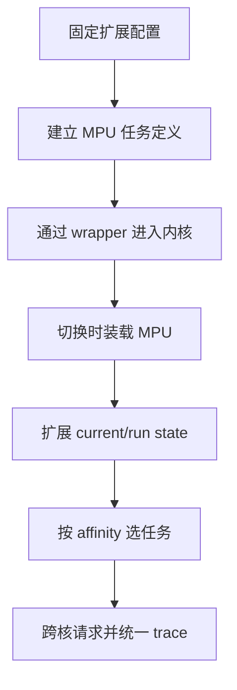
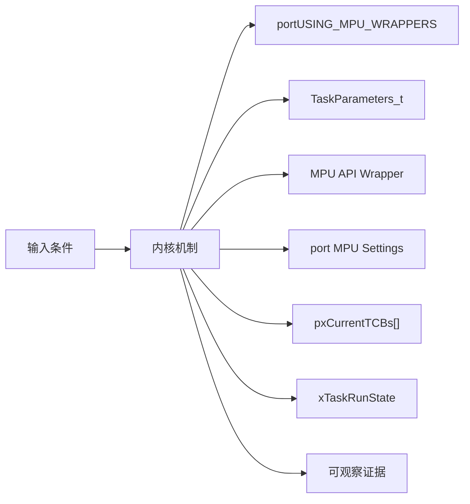
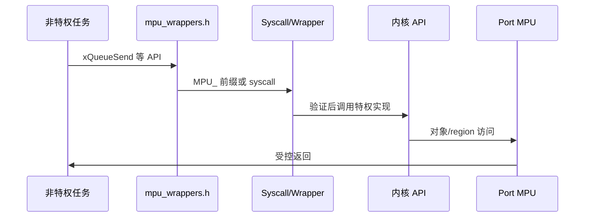
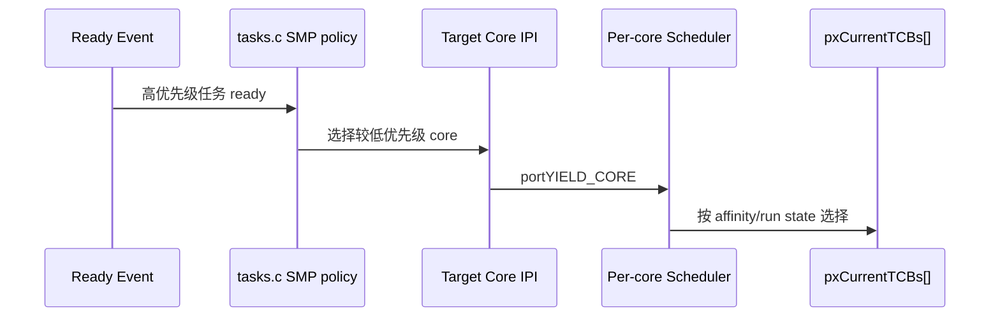
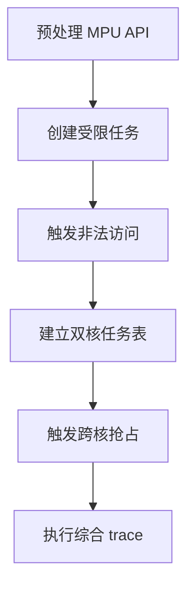
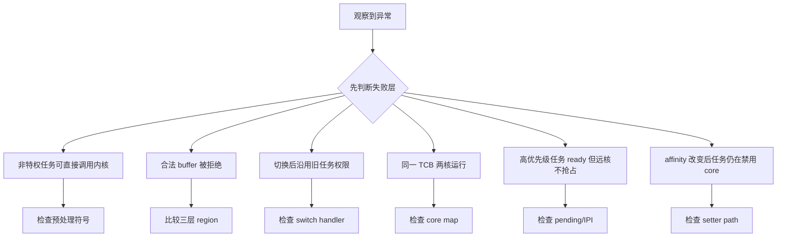

MPU 和 SMP 都不是给经典单核调度器增加一个开关：MPU 改变 API 进入内核的信任边界，SMP 改变“当前任务”和“是否正在运行”的定义。

本篇只回答一个核心问题：**V11.3.0 如何扩展单核内核以支持任务内存隔离和多核调度，又怎样用 trace 证明跨层行为？**

分析范围固定为 **FreeRTOS-Kernel V11.3.0**。所有函数、字段、宏和条件编译都以该 tag 为准。

本篇先拆 MPU wrapper/受限任务/region 设置，再拆 pxCurrentTCBs、run state、affinity 与 cross-core yield，最后用统一事件模型观察 task、queue、ISR 与 port。

## 1. MPU、SMP 与可观测性改变了什么

MPU 寄存器布局由具体 MPU port 实现，SMP 跨核中断由 portYIELD_CORE 实现；公共源码只定义通用契约和调度策略。



## 2. MPU settings、Core-local 状态与共享调度数据

MPU 把用户 API 重定向到受控 syscall wrapper，并为 TCB 增加 port MPU settings；SMP 把 current、yield pending、Idle task 扩展为每核数组，并给任务增加 run state 与 affinity mask。



| 对象 | 角色 | 必须保持的不变量 | 观察方法 | 常见误读 |
|---|---|---|---|---|
| portUSING_MPU_WRAPPERS | 标识当前 port 支持 MPU API 包装。 | wrapper 宏与实现版本一致。 | 预处理检查。 | 只设置 configENABLE_MPU 即完成隔离。 |
| TaskParameters_t | 描述受限任务入口、栈、优先级和 memory regions。 | region 地址、长度、权限合法。 | 记录参数与 TCB settings。 | 把 region 数组当通用页表。 |
| MPU API Wrapper | 把非特权 API 调用转入特权内核实现。 | 参数先验证，再访问内核对象。 | 记录 syscall number/context。 | wrapper 只改函数名不改权限。 |
| port MPU Settings | TCB 内的架构区域配置。 | 任务切换时与 current TCB 同步装载。 | 读取 region registers。 | 公共内核直接写硬件 region。 |
| pxCurrentTCBs[] | 每个 core 一个 current TCB。 | 同一 TCB 不同时运行在两个 core。 | 记录 core->TCB。 | 继续使用单一 pxCurrentTCB 地址。 |
| xTaskRunState | 编码 not running、core ID 或 scheduled-to-yield。 | 运行状态与 current array 一致。 | 记录 state。 | ready 就等于未运行。 |
| uxCoreAffinityMask | 限制任务可运行 core 集合。 | 至少一个允许 core，选择时必须命中 mask。 | 记录 mask/core。 | affinity 自动做负载均衡。 |
| portYIELD_CORE | 请求另一个 core 进入调度。 | 目标 core 有对应 yield pending 与 IPI/机制。 | 记录 source/target core。 | 普通函数调用能同步切换远核。 |

## 3. 调用链一：非特权 API 通过 MPU wrapper 进入内核

公共头文件在 MPU port 下把 API 名称映射为 MPU wrapper；wrapper/系统调用验证参数和权限，再调用真正内核实现。



### 调用链一：unprivileged task -> API macro -> MPU wrapper/syscall -> parameter/access validation -> privileged kernel -> return

启用 MPU wrapper 后，公开 API 宏会把非特权调用重定向到 wrapper 或系统调用入口，而不是直接进入 queue.c/tasks.c。异常入口从任务栈帧取得参数和 syscall 编号，切换到特权执行环境，再根据任务的 MPU settings、ACL 和缓冲区长度验证访问范围。

只有参数和对象权限都通过，wrapper 才调用原来的公共内核实现；失败路径必须在触碰对象前返回错误。内核完成后把返回值写回异常帧并恢复非特权执行。上下文切换时，portable 层还要从新 TCB 加载对应的 MPU region，使权限跟随任务而不是跟随 CPU 上一个运行者。

审计这条链时，应把预处理后的 API 符号、syscall 参数、验证结果、对象 ACL 和切换后的 region 配置连在一起。只验证“能进入内核”不足以证明隔离正确，拒绝越界缓冲和跨任务对象访问同样是验收的一部分。

### 源码片段：MPU 构建把公开 API 重定向到 wrapper

> 源码位置：`include/mpu_wrappers.h` · `API name mappings` · `V11.3.0`
> 配置条件：portUSING_MPU_WRAPPERS == 1
> 固定链接：[查看上游源码](https://github.com/FreeRTOS/FreeRTOS-Kernel/blob/V11.3.0/include/mpu_wrappers.h)

```c
#if ( portUSING_MPU_WRAPPERS == 1 )
    #ifndef MPU_WRAPPERS_INCLUDED_FROM_API_FILE
        #define xTaskCreateRestricted       MPU_xTaskCreateRestricted
        #define vTaskDelay                 MPU_vTaskDelay
        #define xQueueGenericSend          MPU_xQueueGenericSend
    #endif
#endif
```

- 真实映射按 wrapper v1/v2 和 API guard 展开。
- 内核源文件定义 MPU_WRAPPERS_INCLUDED_FROM_API_FILE 避免自重定向。
- 应用看到 MPU_ wrapper 而非直接实现。
- wrapper 仍需 port 提供权限切换。

> **关键约束**：非特权可见 API 必须经过匹配 wrapper，内核自身调用不能递归重定向。 **验证重点**：比较应用与内核翻译单元预处理符号。

### 源码片段：受限任务参数携带内存区域

> 源码位置：`include/task.h` · `TaskParameters_t / MemoryRegion_t` · `V11.3.0`
> 配置条件：portUSING_MPU_WRAPPERS == 1
> 固定链接：[查看上游源码](https://github.com/FreeRTOS/FreeRTOS-Kernel/blob/V11.3.0/include/task.h)

```c
typedef struct xMEMORY_REGION
{
    void * pvBaseAddress;
    size_t ulLengthInBytes;
    uint32_t ulParameters;
} MemoryRegion_t;

typedef struct xTASK_PARAMETERS
{
    TaskFunction_t pvTaskCode;
    const MemoryRegion_t xRegions[ portNUM_CONFIGURABLE_REGIONS ];
} TaskParameters_t;
```

- 真实 TaskParameters 还包含名称、栈、参数和优先级。
- region 是架构无关描述。
- port 把通用参数翻译为 MPU 寄存器设置。
- 区域对齐和数量由 port 约束。

> **关键约束**：每个通用 region 必须能无歧义转换为目标 MPU 权限和边界。 **验证重点**：保存 TaskParameters 与 TCB xMPUSettings/硬件 region 对照。

## 4. 调用链二：SMP 选择任务与跨核 yield

SMP ready lists 仍共享，但选择时必须跳过正在其他 core 运行或不匹配 affinity 的 TCB；新高优先级任务可能要求远核 yield。



### 调用链二：task ready -> compare every core -> prvYieldForTask/prvYieldCore -> portYIELD_CORE -> per-core vTaskSwitchContext -> prvSelectHighestPriorityTask

SMP 下 ready list 仍表达可运行任务，但调度器还必须考虑任务 affinity、是否已在其他 core 运行以及每核当前优先级。新任务 ready 后，内核在持有必要锁的窗口扫描各 core，寻找允许该任务运行且最值得被抢占的目标，并设置该 core 的 yield pending 状态。

若目标是远端 core，portYIELD_CORE 通过平台提供的跨核事件通知它进入调度入口。目标 core 保存自己的 current TCB，并把旧任务运行状态改为可重新选择；随后 prvSelectHighestPriorityTask 从共享 ready 集合中挑选满足 affinity 且未在其他 core 运行的任务，更新每核 current 和任务 run state。

正确性不只看单个 pxCurrentTCB，而要同时检查 core-to-TCB 映射、affinity mask、run state、yield pending 和跨核请求。任何时刻同一 TCB 都不能在两个 core 上执行，远端请求丢失也不能让更高优先级任务长期停在 ready 状态。

### 源码片段：SMP 将 current 与 yield pending 扩为每核数组

> 源码位置：`tasks.c` · `pxCurrentTCBs / xYieldPendings` · `V11.3.0`
> 配置条件：configNUMBER_OF_CORES > 1
> 固定链接：[查看上游源码](https://github.com/FreeRTOS/FreeRTOS-Kernel/blob/V11.3.0/tasks.c)

```c
TCB_t * volatile pxCurrentTCBs[ configNUMBER_OF_CORES ];
static volatile BaseType_t xYieldPendings[ configNUMBER_OF_CORES ] = { pdFALSE };
static TaskHandle_t xIdleTaskHandles[ configNUMBER_OF_CORES ];

#define pxCurrentTCB    xTaskGetCurrentTaskHandle()
```

- 每个 core 有 current、yield 状态和 Idle task。
- 兼容宏返回调用 core 的 current。
- 共享 ready/delayed lists 仍需多核锁。
- trace 必须总是携带 core ID。

> **关键约束**：每个 core 恰有一个 current，任一非 Idle TCB 最多在一个 core 运行。 **验证重点**：周期采样 core->TCB、run state、yield pending。

### 源码片段：SMP 选择同时检查 run state 与 affinity

> 源码位置：`tasks.c` · `prvSelectHighestPriorityTask()` · `V11.3.0`
> 配置条件：configNUMBER_OF_CORES > 1
> 固定链接：[查看上游源码](https://github.com/FreeRTOS/FreeRTOS-Kernel/blob/V11.3.0/tasks.c)

```c
for( pxIterator = listGET_HEAD_ENTRY( pxReadyList );
     pxIterator != pxEndMarker;
     pxIterator = listGET_NEXT( pxIterator ) )
{
    pxTCB = ( TCB_t * ) listGET_LIST_ITEM_OWNER( pxIterator );
    if( pxTCB->xTaskRunState == taskTASK_NOT_RUNNING )
    {
        if( ( pxTCB->uxCoreAffinityMask & ( 1U << xCoreID ) ) != 0U )
        {
            pxTCB->xTaskRunState = xCoreID;
            pxCurrentTCBs[ xCoreID ] = pxTCB;
        }
    }
}
```

- 源码中 affinity 检查受 configUSE_CORE_AFFINITY guard。
- ready 不代表未在其他 core 运行。
- 选择成功要同时更新 run state 和 current array。
- 同优先级遍历仍考虑公平性。

> **关键约束**：选中的 TCB 未在其他 core 运行且 affinity 包含目标 core。 **验证重点**：记录 ready owner、run state、mask、target core 和 current array。

<!-- IMAGE_PROMPT: 16:9 技术架构插画，左半展示非特权任务通过 syscall wrapper 进入特权 FreeRTOS 内核并受 MPU regions 限制，右半展示双核 scheduler 共享 ready lists、每核 current TCB、affinity mask 和 cross-core yield；红青黄配色，无芯片型号、无厂商 logo。 -->

## 5. 验证权限拒绝、任务亲和性与跨核调度



### 配置矩阵

| 配置或条件 | 取值 A | 取值 B | 源码影响 | 验证重点 |
|---|---|---|---|---|
| configENABLE_MPU | 0 | 1 | 决定 port MPU 能力与 TCB settings。 | 检查 port 支持。 |
| configUSE_MPU_WRAPPERS_V1 | 0 | 1 | 选择 wrapper v2 或 v1。 | 比较 API 映射。 |
| configENABLE_ACCESS_CONTROL_LIST | 0 | 1 | 增加内核对象 ACL 检查。 | 验证 handle access。 |
| configNUMBER_OF_CORES | 1 | 大于 1 | 选择单 current 或 per-core SMP。 | 检查函数签名。 |
| configUSE_CORE_AFFINITY | 0 | 1 | 决定 affinity mask 字段与 API。 | 验证任务迁移限制。 |
| configRUN_MULTIPLE_PRIORITIES | 0 | 1 | 决定不同 core 能否同时运行不同非 Idle 优先级。 | 构造优先级组合。 |

### 实验步骤

1. **预处理 MPU API。** 比较应用/内核翻译单元，并保存 wrapper 符号；只有无递归映射，这一步才算完成。
2. **创建受限任务。** 定义只读/读写/XN region。重点核对 TaskParameters/TCB settings，结果应满足“权限符合设计”。
3. **触发非法访问。** 访问 region 外地址，把 fault context/task/region 保存为证据；判断依据是隔离失败可定位。
4. **建立双核任务表。** 不同 priority/affinity；观察 ready/run/current arrays。若无重复运行，即可进入下一步。
5. **触发跨核抢占。** 新高任务 ready，随后比较 source/target/pending/IPI；预期是目标 core 切换。
6. **执行综合 trace。** 任务+queue+ISR+Tick。最后用统一 core/time/event 确认可重建完整时间线。

### 证据表

| 证据 | 获取方法 | 通过标准 | 失败说明 |
|---|---|---|---|
| API 重定向 | 预处理和 map | 应用链接 MPU_ wrapper | 直达内核表示隔离绕过 |
| region 映射 | TaskParameters/TCB/硬件寄存器 | 三层边界权限一致 | 任一不一致会权限泄漏 |
| fault 归属 | 异常 frame/current task | 非法任务被定位且内核存活策略明确 | 只重启无法证明隔离 |
| core current map | pxCurrentTCBs/run state | 每核唯一且无 TCB 重复 | 重复运行会破坏栈和 TCB |
| affinity 选择 | ready owner/mask/core | 仅兼容 core 选择 | 忽略 mask 破坏隔离/性能规划 |
| cross-core yield | pending/IPI/switch trace | source-target 链完整 | 只见目标 switch 无原因 |

## 6. 从权限检查与每核任务映射定位扩展故障

先验证对象成员和链表归属，再检查锁、配置分支和调度请求。



| 现象 | 根因 | 第一检查点 | 应保存的证据 | 修复原则 |
|---|---|---|---|---|
| 非特权任务可直接调用内核 | wrapper include/宏失效 | 检查预处理符号 | 应用 map 与 call trace | 修正 portUSING_MPU_WRAPPERS |
| 合法 buffer 被拒绝 | region 边界/对齐/权限转换错误 | 比较三层 region | TaskParameters/TCB/register | 修正 port mapping |
| 切换后沿用旧任务权限 | port 未装载新 MPU settings | 检查 switch handler | current 与 region snapshot | 在 context switch 恢复 settings |
| 同一 TCB 两核运行 | run state 更新/锁错误 | 检查 core map | ready/run/current timeline | 原子更新 run state/current |
| 高优先级任务 ready 但远核不抢占 | 未选择 target 或 portYIELD_CORE 失效 | 检查 pending/IPI | source/target priority | 修复 SMP policy 与 IPI |
| affinity 改变后任务仍在禁用 core | 运行任务未 yield 或 mask 未检查 | 检查 setter path | old/new mask/run state | 请求对应 core yield |
| 综合 trace 顺序矛盾 | 不同 core 时间基未同步 | 检查 timestamp source | 每核 counter offset | 使用共享单调时钟或校准 |

## 7. 源码索引、阶段验收与面试表达

### 源码索引

| 文件 | 结构体 / 函数 / 宏 | 作用 |
|---|---|---|
| [include/mpu_wrappers.h](https://github.com/FreeRTOS/FreeRTOS-Kernel/blob/V11.3.0/include/mpu_wrappers.h) | API wrapper 映射 | MPU 信任入口 |
| [portable/Common/mpu_wrappers_v2.c](https://github.com/FreeRTOS/FreeRTOS-Kernel/blob/V11.3.0/portable/Common/mpu_wrappers_v2.c) | wrapper 参数/ACL 检查 | 特权代理 |
| [include/task.h](https://github.com/FreeRTOS/FreeRTOS-Kernel/blob/V11.3.0/include/task.h) | MemoryRegion_t、TaskParameters_t | 受限任务描述 |
| [tasks.c](https://github.com/FreeRTOS/FreeRTOS-Kernel/blob/V11.3.0/tasks.c) | pxCurrentTCBs、run state、affinity | SMP 调度状态 |
| [tasks.c](https://github.com/FreeRTOS/FreeRTOS-Kernel/blob/V11.3.0/tasks.c) | prvSelectHighestPriorityTask、prvYieldCore | SMP 选择与跨核请求 |
| [include/FreeRTOS.h](https://github.com/FreeRTOS/FreeRTOS-Kernel/blob/V11.3.0/include/FreeRTOS.h) | MPU/SMP 配置 guard | 编译模型 |

### 阶段验收

1. 能解释 MPU API wrapper 的必要性。
2. 能画出通用 region 到 port settings。
3. 能区分特权切换与普通函数调用。
4. 能解释 per-core current arrays。
5. 能证明 TCB 不可双核运行。
6. 能推演 affinity selection。
7. 能跟踪 cross-core yield。
8. 能设计带 core ID 的统一 trace。

### 面试表达

MPU 扩展改变 API 的信任边界：非特权调用通过 wrapper/系统调用进入特权内核，参数和对象访问受 TaskParameters 与 port region settings 约束。

SMP 中 ready 只表示可调度，不表示未运行；scheduler 还必须检查 xTaskRunState 和 affinity，避免同一 TCB 在两个 core 同时恢复。

跨核抢占需要公共策略选择目标 core、设置 per-core yield pending，再由 portYIELD_CORE 触发架构相关 IPI；trace 必须记录 source/target core。

### 参考资料

- [FreeRTOS-Kernel V11.3.0](https://github.com/FreeRTOS/FreeRTOS-Kernel/tree/V11.3.0)
- [FreeRTOS Kernel Book](https://github.com/FreeRTOS/FreeRTOS-Kernel-Book)

> 🏷️ FreeRTOS / MPU / SMP / Core Affinity / Kernel Trace / Observability
