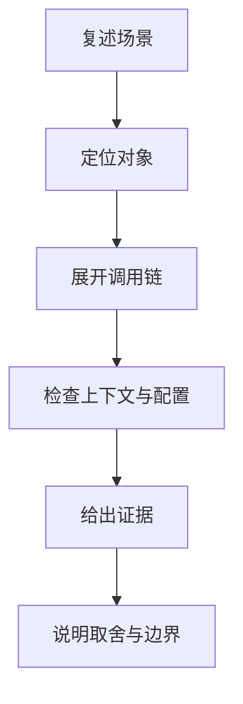
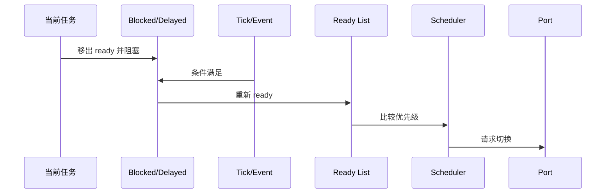
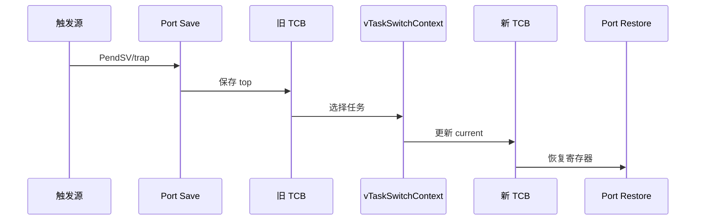
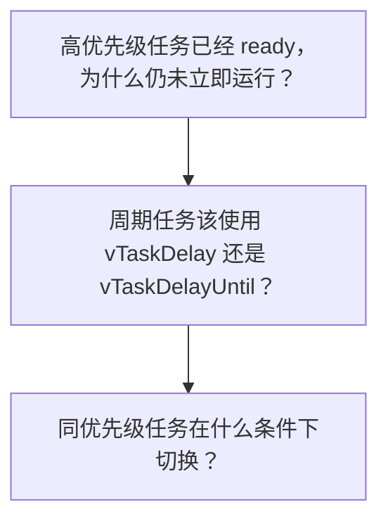
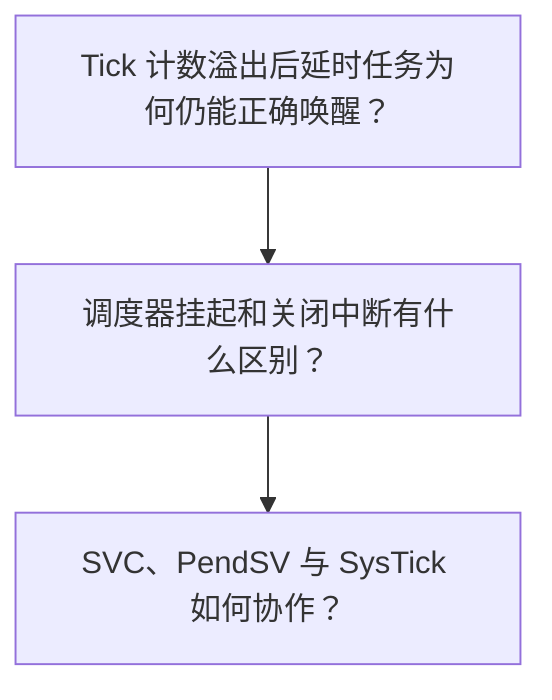
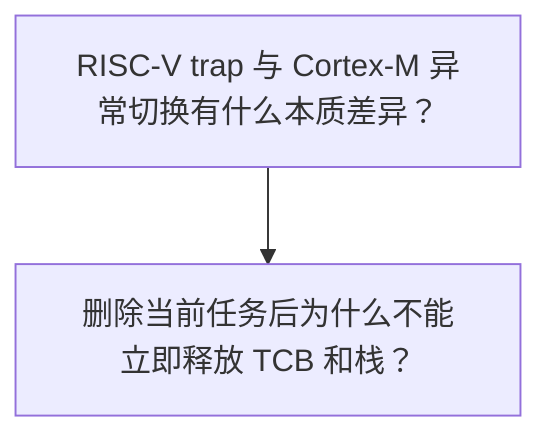
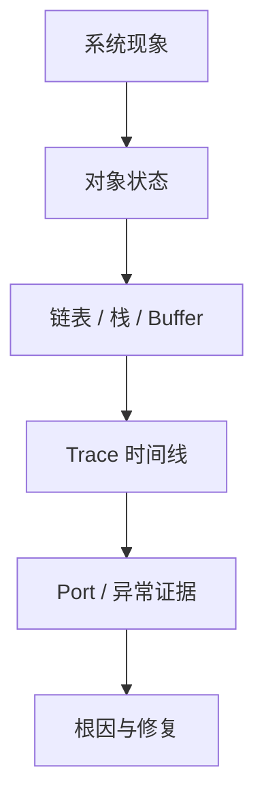

调度类面试题真正考察的是：能否从 ready/delayed lists、pxCurrentTCB、Tick 和 port handler 解释一个时序现象。

分析范围固定为 **FreeRTOS-Kernel V11.3.0**。问题必须从该 tag 的源码和明确配置条件推导。

## 1. 调度题要从状态证据开始回答

先复述场景中的任务优先级、状态和触发源，不在条件不完整时直接给结论。

再定位 TCB 状态节点、ready/delayed list、yield pending 和 port handler，说明谁修改它们。

最后给出调试器、trace、异常寄存器或栈帧证据，并说明配置变化会怎样改变答案。



| 回答层次 | 必须说明 | 不能停留在 |
|---|---|---|
| 对象层 | TCB、ListItem、ready/delayed/current | 任务在运行或等待的口头描述 |
| 控制流层 | 入口 API、内部 helper、yield/port hook | 只背函数返回值 |
| 架构层 | 异常/trap 保存恢复与中断屏蔽 | 把切换说成普通函数调用 |
| 工程层 | trace、断言、寄存器和修复顺序 | 建议加 delay 或提高优先级 |

面试表达的目标不是把函数名背得更多，而是能从对象不变量解释现象，并知道怎样在真实系统中证明。

## 2. 两条总调用链：从现象回到源码

### 调用链一：任务阻塞到高优先级抢占

回答任务为何切换时，要同时展开 state list、event/delayed list、Tick 或事件解除、ready priority 和 port yield。



1. 确认任务是否真的位于 ready list。
2. 确认 scheduler 是否运行、挂起或处于临界区。
3. 找到解除阻塞的 Tick 或对象事件。
4. 比较新 ready 任务与各 current TCB 优先级。
5. 确认公共内核设置 yield 请求。
6. 在 port 异常/trap 中验证实际切换。

### 源码片段：单核调度器只从最高 ready priority 选择

> 源码位置：`tasks.c` · `taskSELECT_HIGHEST_PRIORITY_TASK` · `V11.3.0`
> 配置条件：configNUMBER_OF_CORES == 1
> 固定链接：[查看上游源码](https://github.com/FreeRTOS/FreeRTOS-Kernel/blob/V11.3.0/tasks.c)

```c
while( listLIST_IS_EMPTY( &( pxReadyTasksLists[ uxTopPriority ] ) ) != pdFALSE )
{
    uxTopPriority--;
}
listGET_OWNER_OF_NEXT_ENTRY( pxCurrentTCB, &( pxReadyTasksLists[ uxTopPriority ] ) );
```

- ready 按优先级分桶。
- 同优先级用 list index 轮转。
- selected owner 成为 current。
- scheduler suspended 时不会立即执行该选择。
面试证据：记录 top priority、ready length 和 current owner。

### 源码片段：Tick 解阻塞后返回是否需要切换

> 源码位置：`tasks.c` · `xTaskIncrementTick()` · `V11.3.0`
> 配置条件：Tick handler 调用
> 固定链接：[查看上游源码](https://github.com/FreeRTOS/FreeRTOS-Kernel/blob/V11.3.0/tasks.c)

```c
xTickCount = xTickCount + 1U;
if( xTickCount == 0U )
{
    taskSWITCH_DELAYED_LISTS();
}

pxTCB = listGET_OWNER_OF_HEAD_ENTRY( pxDelayedTaskList );
if( pxTCB->uxPriority > pxCurrentTCB->uxPriority )
{
    xSwitchRequired = pdTRUE;
}
```

- 两条 delayed list 处理回绕。
- 只需从有序 list head 检查。
- 任务 ready 与实际 port 切换分离。
- 抢占配置仍决定最终行为。
面试证据：保存 Tick、list swap、unblocked priority 和返回标志。

### 调用链二：port 保存旧上下文到恢复新任务

Cortex-M4 与 RISC-V 的保存方式不同，但共同契约是旧 top 写回旧 TCB、公共调度器更新 current、新 top 恢复到 CPU。



1. 区分硬件自动保存和软件保存。
2. 确认旧 TCB 首字段收到新 top。
3. 在保护窗口调用公共调度器。
4. 证明新 current 来自合法 ready list。
5. 按对称布局恢复寄存器和 CSR。
6. 用异常返回或 trap return 进入新任务。

### 源码片段：Cortex-M4 PendSV 保存软件上下文

> 源码位置：`portable/GCC/ARM_CM4F/port.c` · `xPortPendSVHandler()` · `V11.3.0`
> 配置条件：GCC ARM_CM4F port
> 固定链接：[查看上游源码](https://github.com/FreeRTOS/FreeRTOS-Kernel/blob/V11.3.0/portable/GCC/ARM_CM4F/port.c)

```asm
mrs r0, psp
tst r14, #0x10
it eq
vstmdbeq r0!, {s16-s31}
stmdb r0!, {r4-r11, r14}
str r0, [r2]
bl vTaskSwitchContext
```

- 硬件异常帧已在 PSP。
- FPU 高寄存器按 EXC_RETURN 条件保存。
- 旧 top 先写回 TCB。
- 公共 scheduler 只负责选 TCB。
面试证据：切换前后保存 PSP、EXC_RETURN 和两个 TCB top。

### 源码片段：当前任务删除后进入等待回收链表

> 源码位置：`tasks.c` · `vTaskDelete() / prvCheckTasksWaitingTermination()` · `V11.3.0`
> 配置条件：INCLUDE_vTaskDelete == 1
> 固定链接：[查看上游源码](https://github.com/FreeRTOS/FreeRTOS-Kernel/blob/V11.3.0/tasks.c)

```c
vListInsertEnd( &xTasksWaitingTermination, &( pxTCB->xStateListItem ) );
uxDeletedTasksWaitingCleanUp++;

/* Idle context later. */
pxTCB = listGET_OWNER_OF_HEAD_ENTRY( &xTasksWaitingTermination );
prvDeleteTCB( pxTCB );
```

- 运行任务仍在自己的栈上。
- delete 只把对象移出可调度集合。
- Idle 在安全上下文回收 stack/TCB。
- Idle 饥饿会延迟内存回收。
面试证据：记录 termination length、deleted count、Idle trace 和 heap。

## 3. 基础机制场景题



### 问题 1：高优先级任务已经 ready，为什么仍未立即运行？

**场景**

一个高优先级任务被 ISR 解阻塞，ready list 中已经能看到它，但当前低优先级任务仍继续执行一段时间。

> **源码依据**：tasks.c：xTaskRemoveFromEventList、xTaskIncrementTick、vTaskSwitchContext；port 的 ISR exit yield。 关键对象包括 xStateListItem、pxReadyTasksLists、xYieldPendings、pxCurrentTCB；相关配置为 configUSE_PREEMPTION、scheduler suspend、ISR priority。

**详细回答**

ready 只表示可调度，不等于 CPU 已经恢复该任务上下文。如果抢占关闭，任务会等当前任务阻塞或主动 yield。如果 scheduler suspended，ISR 只能把事件节点放入 pending ready，恢复 scheduler 后才搬回真正 ready list。如果 ISR 解阻塞了更高优先级任务，FromISR API 必须通过 pxHigherPriorityTaskWoken 把切换请求传到 port。中断屏蔽或更高优先级异常仍在执行时，PendSV/trap 会延迟。最终还要验证 port handler 是否真正更新 pxCurrentTCB 并恢复新栈。

工程上应记录 ready list、pending ready、yield flag、ICSR/port trace 和 current TCB 时间线。即时抢占提高响应，但仍需尊重不可抢占临界区和架构异常优先级。

> **常见误区**：高优先级任务一 ready 就会立刻运行。 忽略了抢占配置、scheduler suspend、ISR 交接和 port 延迟切换。 更准确的表述是：高优先级 ready 后是否立即运行取决于调度状态、抢占配置和切换请求是否传到 port。

**追问：如何证明是 scheduler suspend 导致的延迟？**

同时记录 uxSchedulerSuspended、xPendingReadyList、xYieldPendings；恢复时应看到任务搬回 ready 并紧接一次切换。

### 问题 2：周期任务该使用 vTaskDelay 还是 vTaskDelayUntil？

**场景**

一个 10 ms 周期采样任务使用 vTaskDelay(10)，运行数小时后相位不断漂移。

> **源码依据**：tasks.c：vTaskDelay、xTaskDelayUntil、prvAddCurrentTaskToDelayedList。 关键对象包括 xTickCount、previous wake time、delayed list item value；相关配置为 INCLUDE_vTaskDelay、INCLUDE_xTaskDelayUntil。

**详细回答**

vTaskDelay 从调用时刻计算相对等待时间，因此本轮执行耗时会叠加到周期。xTaskDelayUntil 以保存的 previous wake time 计算绝对下一唤醒点，正常情况下不累计执行时间。如果任务已经错过目标时间，delay-until 不会把一个已过去的时间简单插入 delayed list。Tick 粒度限制可实现的周期精度。长时间关闭调度或中断仍可能产生实际启动抖动。源码证据是最终写入 state list item 的绝对 xTimeToWake。

工程上应记录 previous wake、xTickCount、delayed item value 与任务实际 switched-in 时间。固定相位适合 delay-until；相对退避或事件后等待适合 delay。

> **常见误区**：两个 API 都是阻塞 N 个 Tick，只是名字不同。 忽略了相对时间与绝对时间基准的区别。 更准确的表述是：vTaskDelay 会累计工作时间，xTaskDelayUntil 以历史唤醒点维持周期相位。

**追问：如果任务执行时间超过周期会发生什么？**

API 会检测目标时间已过，任务不再等待该过期点；应用需要记录 deadline miss 并决定丢帧、追赶或降级。

### 问题 3：同优先级任务在什么条件下切换？

**场景**

两个同优先级 CPU-bound 任务都不阻塞，有时轮转，有时一个任务长期运行。

> **源码依据**：tasks.c：taskSELECT_HIGHEST_PRIORITY_TASK、xTaskIncrementTick；taskYIELD。 关键对象包括 同优先级 ready list、list index、current TCB；相关配置为 configUSE_PREEMPTION、configUSE_TIME_SLICING。

**详细回答**

同优先级任务位于同一个 ready list。taskSELECT_HIGHEST_PRIORITY_TASK 使用 listGET_OWNER_OF_NEXT_ENTRY 推进 list index。抢占和 time slicing 都开启时，Tick 看到该 priority list 长度大于一会请求切换。time slicing 关闭后，同优先级任务不会仅因 Tick 自动轮转。当前任务主动 yield、阻塞或被 suspend 仍可触发选择下一 owner。协作式调度还要求任务主动让出处理器。

工程上应记录 ready list length、Tick event、yield source 和 current owner 序列。关闭 time slicing 可减少抖动，但 CPU-bound 同优先级任务必须有明确让出点。

> **常见误区**：FreeRTOS 总是按时间片轮转同优先级任务。 时间片由配置决定，且协作式或主动阻塞路径不同。 更准确的表述是：只有在配置允许或任务主动让出时，同优先级 list index 才推进到另一任务。

**追问：提高其中一个任务优先级能解决公平性吗？**

不能，它把公平问题变成永久优先级关系，可能让低优先级任务更难运行；应先修正阻塞点或调度配置。

## 4. 并发、边界与故障场景题



### 问题 4：Tick 计数溢出后延时任务为何仍能正确唤醒？

**场景**

使用较窄 TickType_t 的测试中，任务在 Tick 接近最大值时延时，唤醒值发生回绕。

> **源码依据**：tasks.c：xDelayedTaskList1/2、taskSWITCH_DELAYED_LISTS、prvAddCurrentTaskToDelayedList。 关键对象包括 xTickCount、pxDelayedTaskList、pxOverflowDelayedTaskList、xNextTaskUnblockTime；相关配置为 configUSE_16_BIT_TICKS 或 TickType_t 宽度。

**详细回答**

任务阻塞时计算绝对 xTimeToWake。如果 xTimeToWake 小于当前 xTickCount，说明目标跨回绕，节点进入 overflow delayed list。当前 delayed list 只保存本轮回绕前到期任务。xTickCount 自然回到零时，taskSWITCH_DELAYED_LISTS 交换两条 list。交换后原 overflow list 成为当前 delayed list，节点仍按绝对值有序。因此不需要对每个任务做复杂的环形时间比较。

工程上应记录两条 delayed list 的地址、节点 item value、Tick 回绕和 swap trace。双列表用额外内存换取简单有序比较和 O(1) 头部到期检查。

> **常见误区**：Tick 回绕时内核把所有延时任务的时间重新计算一遍。 源码实际上交换 list 指针，不遍历重算所有节点。 更准确的表述是：跨回绕任务预先进入 overflow list，Tick 归零时两条 list 交换角色。

**追问：portMAX_DELAY 的无限等待也放在 overflow delayed list 吗？**

在允许 indefinite block 的路径中，任务通常进入 suspended list，而不是依赖一个最终会到达的 Tick 值。

### 问题 5：调度器挂起和关闭中断有什么区别？

**场景**

代码想批量操作内核对象，开发者用 vTaskSuspendAll 代替 critical section，认为 ISR 也不会修改状态。

> **源码依据**：tasks.c：vTaskSuspendAll/xTaskResumeAll；port critical macros。 关键对象包括 uxSchedulerSuspended、xPendingReadyList、xPendedTicks、BASEPRI/interrupt mask；相关配置为 scheduler 与 port 配置。

**详细回答**

vTaskSuspendAll 不关闭中断。ISR 仍能运行并更新允许的对象状态。当 ISR 需要让任务 ready 时，它不能在 suspend 窗口修改 state list，而会使用 pending ready 机制。Tick 也可能累计到 xPendedTicks，resume 时统一结算。critical section 则通过 port mask 保护短原子更新。阻塞 API 不能在普通 critical section 内等待。

工程上应记录 ISR trace、pending ready、pended ticks、suspend depth 与 mask 寄存器。scheduler suspend 适合内核需要跨多步保持 task lists 稳定的路径；critical 适合短字段原子更新。

> **常见误区**：vTaskSuspendAll 会关闭所有中断。 源码明确允许 ISR 继续运行，并用 pending ready/pended ticks 延迟结算。 更准确的表述是：挂起 scheduler 只推迟任务调度，不等于屏蔽中断。

**追问：能在 scheduler suspended 时调用普通 queue send 吗？**

部分内核内部路径在受控协议下可以，但应用不能把它当通用锁；API 是否允许要看其实现是否自行处理 suspend/lock。

### 问题 6：SVC、PendSV 与 SysTick 如何协作？

**场景**

系统启动后首任务通过 SVC 进入；运行中 SysTick 到期高优先级任务，最终在 PendSV 中切换。

> **源码依据**：portable/GCC/ARM_CM4F/port.c。 关键对象包括 PSP、MSP、EXC_RETURN、BASEPRI、pxCurrentTCB；相关配置为 GCC ARM_CM4F port。

**详细回答**

pxPortInitialiseStack 先构造可由异常返回恢复的初始帧。xPortStartScheduler 配置异常优先级并通过 SVC 启动首任务。SVC handler 从 current TCB 恢复 R4-R11、EXC_RETURN 和 PSP，硬件再恢复低寄存器帧。SysTick 调 xTaskIncrementTick，只在需要时设置 PendSV pending。PendSV 处于最低优先级，保存旧 PSP 软件帧、调用 vTaskSwitchContext、恢复新帧。BASEPRI 保护公共 scheduler 选择窗口，高紧急度 ISR 仍可先运行。

工程上应记录 VTOR、SHPR、ICSR、PSP、EXC_RETURN、两个 TCB top 和 trace。用 PendSV 延迟切换减少中断嵌套复杂度，并让所有切换共享同一恢复路径。

> **常见误区**：SysTick 中断里直接保存旧任务并恢复新任务。 上游 port 只在 SysTick 中 pend PendSV，真正切换在 PendSV。 更准确的表述是：SysTick 只推进 Tick 和请求切换，PendSV 才保存/恢复上下文。

**追问：为什么 PendSV 要设置最低优先级？**

让所有更高优先级中断先完成，避免在仍有中断使用当前上下文时切走，并统一切换边界。

## 5. 架构与系统设计场景题



### 问题 7：RISC-V trap 与 Cortex-M 异常切换有什么本质差异？

**场景**

同样是 FreeRTOS 任务切换，RISC-V portASM.S 明确保存大量寄存器和 CSR，而 Cortex-M port 借助硬件异常帧。

> **源码依据**：portable/GCC/RISC-V/portASM.S、portContext.h；ARM_CM4F/port.c。 关键对象包括 mepc、mstatus、mcause、通用寄存器、PSP、EXC_RETURN；相关配置为 Machine mode RISC-V 与 Cortex-M4F port。

**详细回答**

Cortex-M 异常入口由硬件固定保存 R0-R3/R12/LR/PC/xPSR。ARM port 主要补充 R4-R11、EXC_RETURN 和可选 FPU 高寄存器。RISC-V 通用 port 通过 portContext 宏显式定义 context size、CSR 与通用寄存器槽位。RISC-V handler 读取 mcause/mepc 区分 timer、ecall 与应用 source。ecall 是同步异常，返回 PC 必须跳过触发指令；timer 是异步中断，保存原返回 PC。两者公共契约仍是旧 top 写回 TCB、切换 current、新 top 恢复。

工程上应记录两种 port 的栈 dump、CSR/EXC_RETURN、current TCB 与 switch trace。公共内核保持架构无关，port 用不同硬件机制满足同一上下文契约。

> **常见误区**：RISC-V 只是把 PendSV 换成另一个中断名字。 RISC-V 没有 Cortex-M 固定 PendSV 和自动异常帧，trap 分派和保存布局由 port 显式实现。 更准确的表述是：不能用异常名称类比代替上下文保存和返回语义比较。

**追问：所有 RISC-V 都使用 CLINT mtime 产生 Tick 吗？**

不是；上游 port 允许 configMTIME 地址为零并要求平台实现 vPortSetupTimerInterrupt。

### 问题 8：删除当前任务后为什么不能立即释放 TCB 和栈？

**场景**

任务执行 vTaskDelete(NULL)，希望立刻把内存归还 heap，但删除后代码仍处于该任务调用栈。

> **源码依据**：tasks.c：vTaskDelete、xTasksWaitingTermination、prvCheckTasksWaitingTermination。 关键对象包括 当前 TCB、state list、termination list、Idle task、heap；相关配置为 INCLUDE_vTaskDelete == 1。

**详细回答**

当前任务调用 delete 时 CPU 仍使用它的 PSP/SP 和栈帧。内核先把任务从 ready/event list 移除，使它不再被调度。对于当前任务，TCB 状态节点进入 xTasksWaitingTermination，并增加待清理计数。delete 请求一次切换，离开当前栈。Idle task 在另一个安全上下文检查 termination list，再调用 prvDeleteTCB 释放 stack/TCB。如果 Idle 长期得不到运行，删除内存的回收也会延迟。

工程上应记录 current TCB、PSP/SP、termination length、Idle trace、heap stats。延迟回收增加一条链表，但保证不会释放正在执行的内存。

> **常见误区**：vTaskDelete 返回后再调用 vPortFree 释放自己的栈。 该代码仍在被释放的栈上执行，会立即形成 use-after-free。 更准确的表述是：当前任务删除必须先切走，再由 Idle 在安全上下文回收。

**追问：删除很多任务后 heap 不回升，首先检查什么？**

检查 Idle 是否获得运行、termination list 是否增长，以及动态/static allocation ownership 是否正确。

## 6. 配置矩阵、现场证据与错误答案归类

### 配置矩阵

| 配置 | 取值一 | 取值二 | 对答案的影响 |
|---|---|---|---|
| configUSE_PREEMPTION | 0 | 1 | 决定高优先级 ready 后是否自动抢占。 |
| configUSE_TIME_SLICING | 0 | 1 | 决定同优先级 Tick 轮转。 |
| configUSE_16_BIT_TICKS | 0 | 1 | 改变 Tick 回绕周期。 |
| INCLUDE_vTaskDelete | 0 | 1 | 决定 termination/Idle cleanup 路径。 |
| INCLUDE_vTaskSuspend | 0 | 1 | 决定显式 suspend 与 indefinite block。 |
| configNUMBER_OF_CORES | 1 | >1 | 改变 current TCB 和 switch 签名。 |

### 现场证据优先级

1. **对象归属**：TCB 两个 ListItem 的 container 和 owner。
2. **调度状态**：ready buckets、current TCB、suspend depth、yield pending。
3. **时间线**：Tick/event、ready、switch、port handler 的统一时钟事件。
4. **架构现场**：PSP/EXC_RETURN 或 mcause/mepc/mstatus。
5. **资源回收**：termination list、Idle runtime 与 heap stats。



### 常见错误答案归类

| 错误类型 | 典型表现 | 修正方法 |
|---|---|---|
| 绝对化 | 高优先级任务一定立即运行 | 补齐配置、调度状态和 port 条件。 |
| API 复述 | delay 就是让任务等待 | 说明绝对唤醒时间和链表。 |
| 架构混同 | RISC-V 也有 PendSV | 比较实际 trap/保存返回机制。 |
| 经验绕过 | 加 delay 或增大栈即可 | 要求对象和 trace 证据。 |

## 7. 源码索引、阶段验收与面试表达

### 源码索引

| 文件 | 关键符号 | 面试用途 |
|---|---|---|
| [tasks.c](https://github.com/FreeRTOS/FreeRTOS-Kernel/blob/V11.3.0/tasks.c) | ready/delayed lists、Tick、switch、delete | 调度场景主证据 |
| [portable/GCC/ARM_CM4F/port.c](https://github.com/FreeRTOS/FreeRTOS-Kernel/blob/V11.3.0/portable/GCC/ARM_CM4F/port.c) | SVC、PendSV、SysTick | Cortex-M4 上下文证据 |
| [portable/GCC/RISC-V/portASM.S](https://github.com/FreeRTOS/FreeRTOS-Kernel/blob/V11.3.0/portable/GCC/RISC-V/portASM.S) | trap、initial stack、restore | RISC-V 上下文证据 |
| [include/task.h](https://github.com/FreeRTOS/FreeRTOS-Kernel/blob/V11.3.0/include/task.h) | delay/suspend/delete API guards | 公开契约 |

### 阶段验收

1. 能回答高优先级 ready 不立即运行的全部条件。
2. 能比较 delay 与 delay-until。
3. 能解释同优先级时间片。
4. 能推演 Tick 回绕。
5. 能区分 scheduler suspend 与关中断。
6. 能完整讲 SVC/PendSV/SysTick。
7. 能比较 RISC-V 与 Cortex-M port。
8. 能解释删除当前任务的延迟回收。

### 面试表达

面对调度问题，我先看任务状态节点属于哪条链表，再看 scheduler 状态和 yield 是否传到 port，最后才判断优先级。

上下文切换的公共契约是保存旧 top、选择 current、恢复新 top；Cortex-M4 与 RISC-V 只是用不同异常机制实现。

工程答案必须给出 trace、链表、栈帧或寄存器证据，不能用加 delay 和调优先级代替根因。

### 参考资料

- [FreeRTOS-Kernel V11.3.0](https://github.com/FreeRTOS/FreeRTOS-Kernel/tree/V11.3.0)
- [FreeRTOS Kernel Book](https://github.com/FreeRTOS/FreeRTOS-Kernel-Book)

> 🏷️ FreeRTOS / Interview / Scheduler / Task / Context Switch
