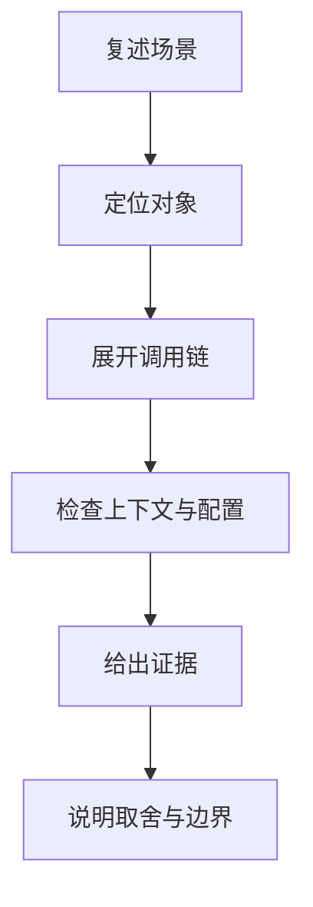
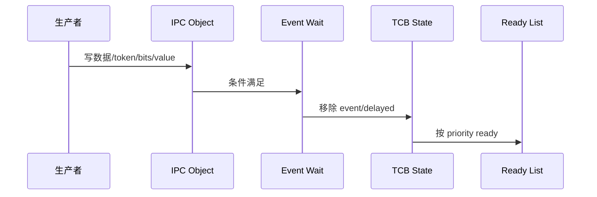
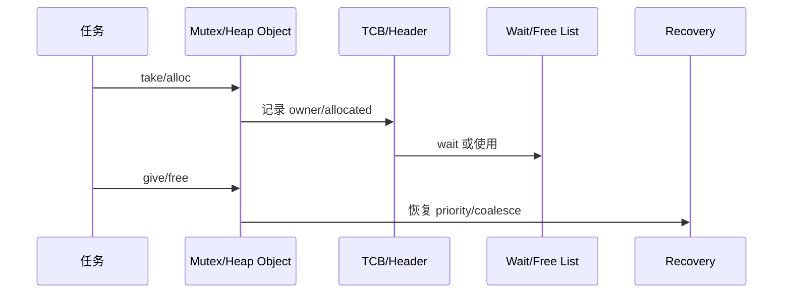
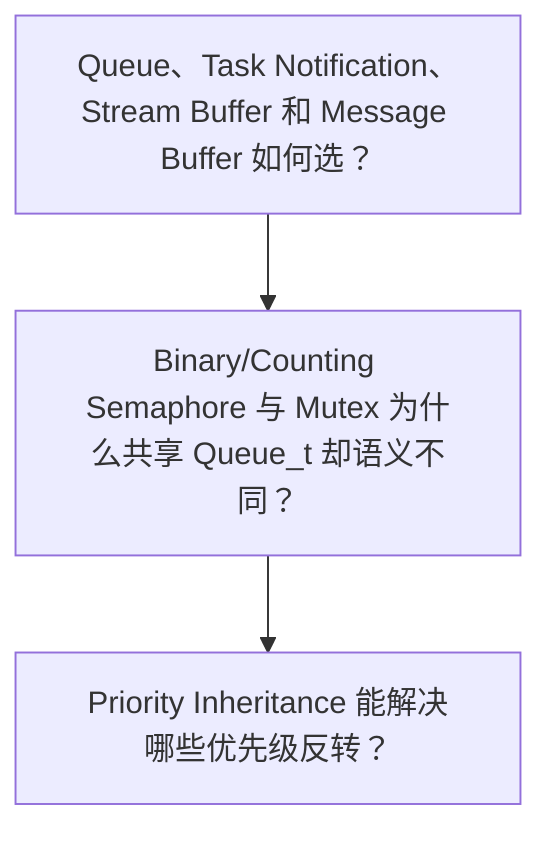
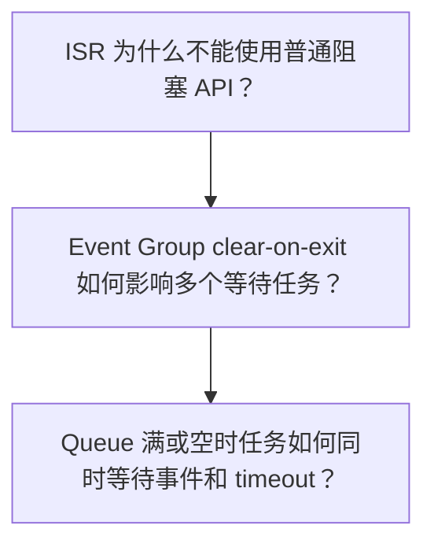
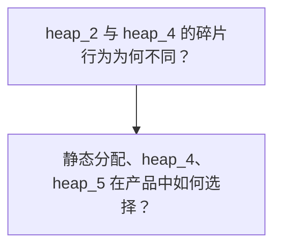
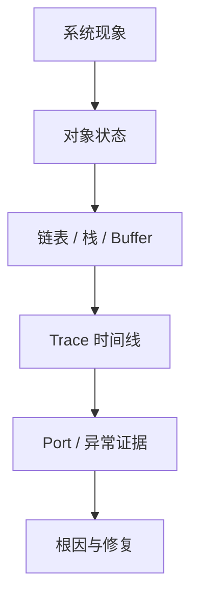

IPC 面试题不能只回答“哪个更快”，而要说明状态放在哪里、谁可以等待、如何唤醒、是否携带数据以及内存所有权。

分析范围固定为 **FreeRTOS-Kernel V11.3.0**。问题必须从该 tag 的源码和明确配置条件推导。

## 1. IPC 题先区分数据、等待与所有权

先把需求拆成数据语义、生产者/消费者数量、等待条件、ISR 来源和生命周期。

然后从 Queue_t、TCB notification、EventGroup_t、StreamBuffer_t 或 BlockLink_t 证明机制边界。

最后说明错误选型会怎样表现，以及现场要保存哪些对象状态和 trace。



| 回答层次 | 必须说明 | 不能停留在 |
|---|---|---|
| 语义层 | 数据、token、bits、字节流、member event | 只比较速度 |
| 对象层 | Queue_t/TCB/EventGroup/StreamBuffer/heap block | API 名称列表 |
| 并发层 | 等待链表、ISR、owner、lock 与 timeout | 假设单线程 |
| 资源层 | storage、fragmentation、lifetime 和 stats | 只看 total free |

面试表达的目标不是把函数名背得更多，而是能从对象不变量解释现象，并知道怎样在真实系统中证明。

## 2. 两条总调用链：从现象回到源码

### 调用链一：对象事件解除任务阻塞

queue/semaphore/event/notification 都要先更新对象状态，再把任务从 event/delayed 状态转回 ready。



1. 确认对象状态先于 wake 可见。
2. 定位任务 event item 和 state item。
3. 处理 timeout 与事件竞态。
4. 在 ISR 路径传递 wake flag。
5. 确认 consumer 清理语义。
6. 记录对象与调度 trace。

### 源码片段：Queue_t 同时拥有数据和等待任务

> 源码位置：`queue.c` · `Queue_t` · `V11.3.0`
> 配置条件：queue core
> 固定链接：[查看上游源码](https://github.com/FreeRTOS/FreeRTOS-Kernel/blob/V11.3.0/queue.c)

```c
UBaseType_t uxMessagesWaiting;
UBaseType_t uxLength;
UBaseType_t uxItemSize;
List_t xTasksWaitingToSend;
List_t xTasksWaitingToReceive;
volatile int8_t cRxLock;
volatile int8_t cTxLock;
```

- messages 是数据面状态。
- 两个 event list 表达阻塞原因。
- lock counter 保护 scheduler suspended 窗口。
- mutex/semaphore 在同一结构上增加语义。
面试证据：同时读取 messages、wait lists 和 lock。

### 源码片段：mutex inherit 修改 TCB priority 与 ready 归属

> 源码位置：`tasks.c` · `xTaskPriorityInherit()` · `V11.3.0`
> 配置条件：configUSE_MUTEXES == 1
> 固定链接：[查看上游源码](https://github.com/FreeRTOS/FreeRTOS-Kernel/blob/V11.3.0/tasks.c)

```c
if( pxMutexHolderTCB->uxPriority < pxCurrentTCB->uxPriority )
{
    uxListRemove( &( pxMutexHolderTCB->xStateListItem ) );
    pxMutexHolderTCB->uxPriority = pxCurrentTCB->uxPriority;
    prvAddTaskToReadyList( pxMutexHolderTCB );
}
```

- base priority 不被覆盖。
- 只改字段不足以改变 scheduler 视图。
- ready item 必须移到新桶。
- disinherit 还要看 mutexesHeld。
面试证据：保存 base/current、mutex count 与 ready list。

### 调用链二：mutex 与 heap 的所有权生命周期

mutex owner/priority 和 heap allocated/free bit 都依赖严格生命周期；绕过 owner 或 double free 会直接破坏内核不变量。



1. 建立 owner 或 allocated 状态。
2. 发生等待时记录 event/priority。
3. 释放前验证调用者和 header。
4. 更新计数与链表归属。
5. 执行 disinherit 或 coalesce。
6. 用 trace/stats 验证闭环。

### 源码片段：Event group 等待条件编码到无序事件节点

> 源码位置：`event_groups.c` · `xEventGroupWaitBits()` · `V11.3.0`
> 配置条件：configUSE_EVENT_GROUPS == 1
> 固定链接：[查看上游源码](https://github.com/FreeRTOS/FreeRTOS-Kernel/blob/V11.3.0/event_groups.c)

```c
uxControlBits = 0U;
if( xClearOnExit != pdFALSE ) uxControlBits |= eventCLEAR_EVENTS_ON_EXIT_BIT;
if( xWaitForAllBits != pdFALSE ) uxControlBits |= eventWAIT_FOR_ALL_BITS;
vTaskPlaceOnUnorderedEventList( &pxEventBits->xTasksWaitingForBits,
                               uxBitsToWaitFor | uxControlBits,
                               xTicksToWait );
```

- wait mask 与控制 flag 共存。
- set bits 扫描所有等待者。
- clear mask 在一致窗口应用。
- 用户 bits 不能占保留位。
面试证据：解码 item value、bits before/after 和 wake set。

### 源码片段：heap_4 地址有序 free list 合并相邻块

> 源码位置：`portable/MemMang/heap_4.c` · `prvInsertBlockIntoFreeList()` · `V11.3.0`
> 配置条件：选择 heap_4.c
> 固定链接：[查看上游源码](https://github.com/FreeRTOS/FreeRTOS-Kernel/blob/V11.3.0/portable/MemMang/heap_4.c)

```c
for( pxIterator = &xStart; pxIterator->pxNextFreeBlock < pxBlockToInsert;
     pxIterator = pxIterator->pxNextFreeBlock ) {}

if( ( ( uint8_t * ) pxIterator + pxIterator->xBlockSize ) ==
    ( uint8_t * ) pxBlockToInsert )
{
    pxIterator->xBlockSize += pxBlockToInsert->xBlockSize;
}
```

- 地址排序用于判断物理相邻。
- 前后块都可能合并。
- allocated bit 防 double free。
- largest block 比 total free 更能解释失败。
面试证据：记录 block addresses、sizes、count 和 largest。

## 3. 基础机制场景题



### 问题 1：Queue、Task Notification、Stream Buffer 和 Message Buffer 如何选？

**场景**

ISR 采集可变长度数据，后台任务处理；团队争论使用 queue、notification 还是 stream/message buffer。

> **源码依据**：queue.c、tasks.c notification、stream_buffer.c。 关键对象包括 数据语义、生产/消费数量、等待者、storage；相关配置为 对应模块配置。

**详细回答**

Queue 适合固定大小 item、多生产者/消费者和独立 storage。Task notification 绑定目标 TCB，适合值/bit/计数事件，不是任意消息队列。Stream Buffer 适合连续字节流，源码只保存单 waiting sender/receiver handle。Message Buffer 在 stream buffer 上增加长度字段，保证离散消息完整性。ISR 路径必须使用 FromISR，并考虑 wake flag。选择应先满足语义和所有权，再比较内存与延迟。

工程上应记录对象字段、buffer 内容、waiting handle/list、FromISR trace。轻量机制省内存但通常收紧拓扑和语义；扩展需求前要保留迁移空间。

> **常见误区**：Task notification 最快，所以所有 IPC 都用它。 忽略了多消费者、数据排队、消息边界和独立生命周期。 更准确的表述是：通知适合目标任务专属事件；固定 item 用 queue，字节流用 stream，离散变长消息用 message buffer。

**追问：多个 writer 能否直接共享 Stream Buffer？**

源码只有一个 xTaskWaitingToSend，多个 writer 需要外部串行化，否则等待句柄和写入原子性不受保证。

### 问题 2：Binary/Counting Semaphore 与 Mutex 为什么共享 Queue_t 却语义不同？

**场景**

代码把 binary semaphore 换成 mutex 后出现 non-owner give 失败和 priority 变化。

> **源码依据**：queue.c：prvInitialiseMutex、xQueueSemaphoreTake；tasks.c inherit。 关键对象包括 uxMessagesWaiting、uxQueueType、xMutexHolder、recursive count；相关配置为 configUSE_MUTEXES、configUSE_COUNTING_SEMAPHORES。

**详细回答**

三者都用 messages 表示 token/可用次数。binary/counting semaphore 不记录 owner，give 可以来自其他任务或合法 ISR API。mutex 初始化 queue type、holder 和 recursive count。take mutex 时 holder 指向 current，并增加 TCB mutexesHeld。高优先级等待者可触发 holder priority inheritance。只有 holder 能按 mutex 语义 give，recursive mutex 还需深度归零。

工程上应记录 Queue_t type/holder/messages、TCB base/current/mutexesHeld。同底层结构减少代码重复，但 type 分支必须保持严格语义。

> **常见误区**：Mutex 就是容量一的 binary semaphore。 忽略 owner、递归和优先级继承。 更准确的表述是：它们共享 token/等待链表实现，但 mutex 额外维护 owner 与 TCB priority 语义。

**追问：ISR 能 give mutex 吗？**

不能；ISR 不是任务 owner，也不能参与 priority inheritance。ISR 应使用 semaphore/notification 等机制。

### 问题 3：Priority Inheritance 能解决哪些优先级反转？

**场景**

低任务持 mutex，中任务 CPU-bound，高任务等待该 mutex。提高低任务后问题缓解，但复杂锁场景仍卡住。

> **源码依据**：tasks.c：xTaskPriorityInherit/Disinherit；queue.c mutex take/give。 关键对象包括 uxBasePriority、uxPriority、uxMutexesHeld、wait list；相关配置为 configUSE_MUTEXES。

**详细回答**

高任务阻塞时，holder current priority 可提升到高任务优先级。ready holder 需要移动优先级桶。base priority 保留用于恢复。give 后 mutexesHeld 递减，满足条件才恢复。timeout 路径还考虑剩余最高等待者。它不解决循环等待、锁顺序、长临界段或非 mutex 资源竞争。

工程上应记录 holder/waiter priority、ready lists、mutex owner/count 和 switch trace。inherit 自动降低单 mutex 反转时间，但增加调度状态变化和分析复杂度。

> **常见误区**：启用 mutex 后所有优先级反转和死锁都会消失。 priority inheritance 不打破循环等待，也不缩短 holder 自身过长工作。 更准确的表述是：inherit 只处理特定 mutex holder 被中优先级抢占的问题。

**追问：为什么用 binary semaphore 不触发 inheritance？**

binary semaphore 不记录 holder，内核不知道应提升哪个任务。

## 4. 并发、边界与故障场景题



### 问题 4：ISR 为什么不能使用普通阻塞 API？

**场景**

ISR 调 xQueueSend 并传非零 timeout，系统偶发 assert 或链表损坏。

> **源码依据**：queue.c FromISR APIs；port interrupt priority validation。 关键对象包括 ISR mask、event lists、pxHigherPriorityTaskWoken；相关配置为 port syscall priority、configASSERT。

**详细回答**

ISR 没有可被放入 delayed list 的普通任务执行语义。阻塞 API 可能 suspend scheduler、操作当前任务 TCB 并触发任务级切换。FromISR API 只执行有界短临界区，不允许等待。它在对象状态更新后决定是否解除高优先级任务。结果通过 pxHigherPriorityTaskWoken 传给 port ISR exit。此外，port 可能按照自身的中断模型限制哪些中断上下文可以访问内核对象，具体规则必须以当前 port 的验证接口为准。

工程上应记录 IRQ number/priority、mask、API return、wake flag、ready/current trace。ISR 快速交接给任务可缩短中断时间，但需要设计 buffer 和丢包策略。

> **常见误区**：普通 API 只要 timeout=0 就能在所有 ISR 调用。 部分实现即使不阻塞也可能依赖任务上下文；官方契约要求使用 FromISR 版本。 更准确的表述是：ISR 使用专用 API，并在退出时按 wake flag 请求切换。

**追问：最高紧急度 ISR 能调用 FromISR API 吗？**

不一定；如果该中断处于 port 不允许调用内核 API 的优先级或嵌套范围，就不能访问受内核临界区保护的对象。

### 问题 5：Event Group clear-on-exit 如何影响多个等待任务？

**场景**

两个任务等待重叠 bits，一个设置 clear-on-exit，担心先唤醒任务会清掉后一个任务需要的 bit。

> **源码依据**：event_groups.c：wait/set bits、unordered event list。 关键对象包括 uxEventBits、wait mask、control bits、uxBitsToClear；相关配置为 configUSE_EVENT_GROUPS。

**详细回答**

等待任务把 mask 和 clear/all 控制位编码进 event list item value。set bits 先 OR 更新 uxEventBits。内核在 scheduler suspended 的一致窗口扫描等待者。每个满足条件的任务被解除，并累积需要清除的 mask。扫描完成后统一把 uxBitsToClear 从 event bits 清掉。因此同一次 set 的满足判断基于一致触发快照，而不是每唤醒一个任务立即清。

工程上应记录 bits before/after、每个 waiter mask/flags、wake list 与返回 bits。共享 bits 能广播条件，但清理语义复杂；独立事件可考虑 notification 或 queue。

> **常见误区**：clear-on-exit 的任务一醒就立刻清 bit，后续任务看不到。 源码在扫描期间累积 clear mask，扫描后统一清除。 更准确的表述是：同一次 set 扫描使用一致 bits，再统一应用 clear mask。

**追问：Event bits 能用作可靠事件计数吗？**

不能；重复 set 同一 bit 会合并，不保留次数。需要计数时用 counting semaphore/notification increment/queue。

### 问题 6：Queue 满或空时任务如何同时等待事件和 timeout？

**场景**

发送任务在满 queue 上等待 20 Tick，期间接收者可能释放空间，或者 timeout 先到。

> **源码依据**：queue.c、tasks.c event list/delayed list helpers。 关键对象包括 TCB xStateListItem、xEventListItem、queue waiting list、delayed list；相关配置为 queue API timeout 与 scheduler。

**详细回答**

任务的 event item 进入 queue 的 waiting-to-send/receive list。同一任务的 state item 进入 delayed list，item value 保存绝对 timeout。对象事件先到时，内核从 event list 取最高优先级等待者，并移除/处理 delayed 状态。Tick timeout 先到时，Tick 路径从 delayed list 移出任务，并清理 event list item。queue lock 窗口可能先把 wake 记入 lock counter/pending ready。API 恢复后必须重新检查条件，处理事件与 timeout 的竞态。

工程上应记录两个 list container、Tick、queue messages/space、lock counter 和 API return。双链表增加状态复杂度，但允许同一等待同时响应对象和时间。

> **常见误区**：阻塞任务只会放在 queue 的 waiting list。 没有 delayed list 就无法由 Tick 处理 timeout。 更准确的表述是：event item 表示等待对象，state item 表示时间/调度状态。

**追问：为什么恢复后还要重新检查 queue 条件？**

事件与 timeout、其他消费者可能竞态；wake 只表示应再次尝试，不保证资源仍属于该任务。

## 5. 架构与系统设计场景题



### 问题 7：heap_2 与 heap_4 的碎片行为为何不同？

**场景**

长期创建删除不同大小对象，heap total free 看起来不少，但大对象申请失败。

> **源码依据**：portable/MemMang/heap_2.c、heap_4.c。 关键对象包括 BlockLink_t、free list ordering、coalescing、largest block；相关配置为 选择的 heap 源文件。

**详细回答**

heap_2 支持 free 和分裂，但释放后不合并物理相邻块。heap_4 free list 按地址排序。释放时可用 previous address+size 和 next address 判断连续。连续 free blocks 会合并，减少外部碎片。两者都不能把非相邻空闲空间拼成一个申请。诊断应看 largest free block 和 free block count，而不只 total free。

工程上应记录 block address/size/next、largest、count、total 和申请结果。heap_4 合并降低外部碎片，但搜索和 free 路径比 bump allocator 更复杂。

> **常见误区**：heap_4 不会产生内存碎片。 它只能合并相邻 free blocks，活跃块隔开的碎片仍存在。 更准确的表述是：heap_4 能合并相邻块，但仍需合理生命周期和大小策略。

**追问：固定大小高频对象更适合什么？**

可考虑静态对象或专用固定块池，避免通用 heap 搜索和碎片。

### 问题 8：静态分配、heap_4、heap_5 在产品中如何选择？

**场景**

产品有内部 RAM、外部 RAM 和安全关键任务，要求启动后不出现不可预测分配失败。

> **源码依据**：task/queue static APIs、heap_4.c、heap_5.c。 关键对象包括 storage ownership、HeapRegion_t、BlockLink_t、hooks/stats；相关配置为 static/dynamic allocation configs。

**详细回答**

安全关键且生命周期固定的内核对象优先静态分配，调用者明确拥有 TCB/stack/storage。需要运行期可变对象且只有一个连续 region，可使用 heap_4，并监控 largest/minimum ever。存在多个非连续可用 region 时，heap_5 在首次分配前用 HeapRegion_t 定义。heap_5 regions 必须按地址升序、不重叠并以零项结束。静态和动态可以混用，但每个对象的创建/删除所有权必须明确。产品策略还应定义 malloc failure、长期碎片测试和重启/降级行为。

工程上应记录 map、object addresses、regions、heap stats、failure hook 与长期 soak。静态提高可预测性但降低弹性；多 region 增加容量但不等于跨 region 连续分配。

> **常见误区**：heap_5 会把多个 RAM 区域合并成一块连续内存。 它只把 region 接入同一 free list，单次分配仍来自一个连续 region/block。 更准确的表述是：heap_5 统一管理多个 region，但不会创造物理连续性。

**追问：全部使用静态分配是否就不需要内存监控？**

仍需监控任务栈、静态 buffer 边界和生命周期；静态只消除 heap 分配失败。

## 6. 配置矩阵、现场证据与错误答案归类

### 配置矩阵

| 配置 | 取值一 | 取值二 | 对答案的影响 |
|---|---|---|---|
| configUSE_MUTEXES | 0 | 1 | 决定 owner 和 priority inheritance。 |
| configUSE_TASK_NOTIFICATIONS | 0 | 1 | 决定 TCB 通知字段。 |
| configUSE_EVENT_GROUPS | 0 | 1 | 决定事件组模块。 |
| configUSE_STREAM_BUFFERS | 0 | 1 | 决定流/消息 buffer。 |
| configSUPPORT_STATIC_ALLOCATION | 0 | 1 | 决定静态对象 API。 |
| heap implementation | heap_2 | heap_4/5 | 改变 free/coalesce/region 行为。 |

### 现场证据优先级

1. **对象字段**：messages、holder、value/state、bits、head/tail。
2. **等待归属**：TCB state/event item container 和 owner。
3. **ISR 交接**：priority、mask、wake flag 和 exit yield。
4. **内存块**：header、address-order free list、largest/count。
5. **时间线**：生产、状态更新、wake、消费、clear/free。



### 常见错误答案归类

| 错误类型 | 典型表现 | 修正方法 |
|---|---|---|
| 性能优先 | notification 最快所以通用 | 先匹配语义与拓扑。 |
| 对象混同 | mutex 等于 binary semaphore | 说明 owner/inheritance。 |
| ISR 混用 | timeout=0 可用普通 API | 使用 FromISR 契约。 |
| 内存单指标 | total free 足够就能分配 | 检查 largest 和 block count。 |

## 7. 源码索引、阶段验收与面试表达

### 源码索引

| 文件 | 关键符号 | 面试用途 |
|---|---|---|
| [queue.c](https://github.com/FreeRTOS/FreeRTOS-Kernel/blob/V11.3.0/queue.c) | Queue_t、send/receive、mutex/semaphore、queue set | IPC 共用底层 |
| [tasks.c](https://github.com/FreeRTOS/FreeRTOS-Kernel/blob/V11.3.0/tasks.c) | notification、event list、priority inherit | TCB 与调度证据 |
| [event_groups.c](https://github.com/FreeRTOS/FreeRTOS-Kernel/blob/V11.3.0/event_groups.c) | wait/set bits | 位条件同步 |
| [stream_buffer.c](https://github.com/FreeRTOS/FreeRTOS-Kernel/blob/V11.3.0/stream_buffer.c) | stream/message buffer | 字节流与消息 |
| [portable/MemMang/heap_4.c](https://github.com/FreeRTOS/FreeRTOS-Kernel/blob/V11.3.0/portable/MemMang/heap_4.c) | BlockLink_t、split/coalesce | 内存碎片证据 |

### 阶段验收

1. 能按语义选择四种 IPC。
2. 能解释 semaphore 与 mutex 区别。
3. 能说明 priority inheritance 边界。
4. 能解释 ISR API 和 wake flag。
5. 能推演 event clear-on-exit。
6. 能解释 queue 双链表等待。
7. 能比较 heap_2/heap_4。
8. 能设计 static/heap_4/heap_5 策略。

### 面试表达

同步机制的选择从数据语义、拓扑和上下文开始，不从“哪个最快”开始。

mutex 的 owner、base/current priority 和 mutexesHeld 是 priority inheritance 的源码证据，binary semaphore 没有这些语义。

内存问题要同时看对象所有权、largest free block、free block count 和长期最小余量。

### 参考资料

- [FreeRTOS-Kernel V11.3.0](https://github.com/FreeRTOS/FreeRTOS-Kernel/tree/V11.3.0)
- [FreeRTOS Kernel Book](https://github.com/FreeRTOS/FreeRTOS-Kernel-Book)

> 🏷️ FreeRTOS / Interview / IPC / Mutex / Memory Management
