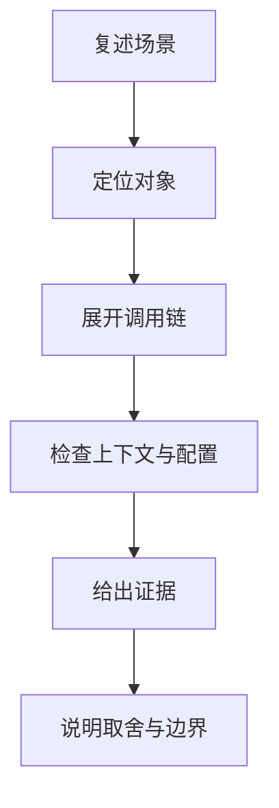
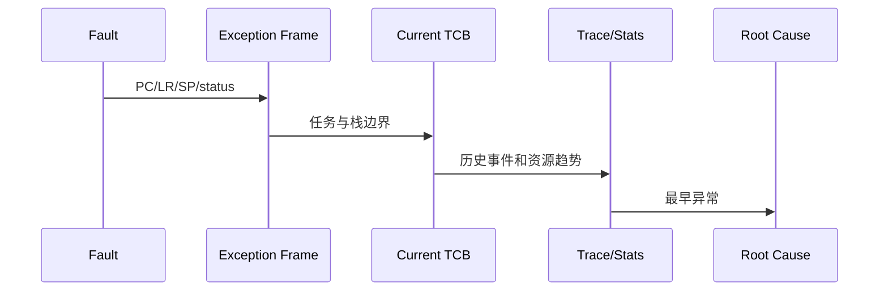
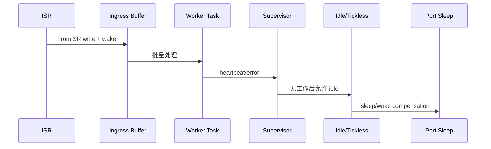
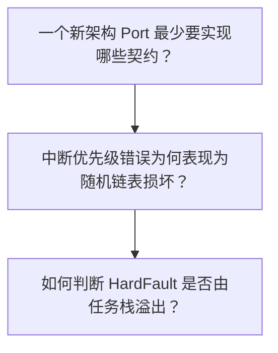
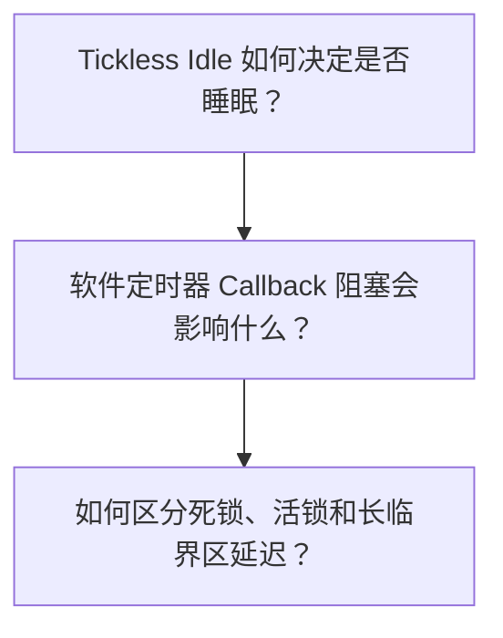
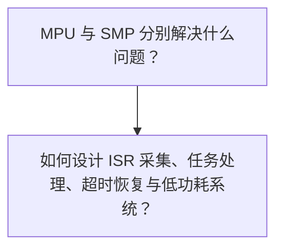
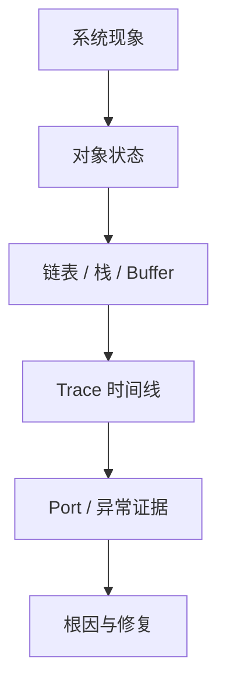

高级面试题通常不给函数名，只给随机崩溃、低功耗失败或系统延迟；回答必须把现场证据映射回 port 和公共内核契约。

分析范围固定为 **FreeRTOS-Kernel V11.3.0**。问题必须从该 tag 的源码和明确配置条件推导。

## 1. 移植与可靠性题要闭合证据链

先判断问题属于公共内核、portable、应用 hook 还是系统设计层。

再列出最小状态、调用链和配置，明确不能凭经验补值。

最后给出可执行排查顺序、修复原则和回归标准。



| 回答层次 | 必须说明 | 不能停留在 |
|---|---|---|
| Port 契约 | stack、Tick、critical、yield、handler | 复制相似架构文件 |
| 可靠性 | assert、stack/heap/trace 原始证据 | 只看最后 PC |
| 低功耗 | expected idle、abort、port compensation | 只看电流 |
| 系统设计 | 任务/优先级/IPC/内存/恢复 | 堆 API 名称 |

面试表达的目标不是把函数名背得更多，而是能从对象不变量解释现象，并知道怎样在真实系统中证明。

## 2. 两条总调用链：从现象回到源码

### 调用链一：故障现场到最早不变量破坏

随机崩溃要从异常现场向前关联 stack/heap/trace，而不是只修复 HardFault 最后一条指令。



1. 冻结异常 frame 和 current task。
2. 验证 SP、stack bounds 和 EXC_RETURN/CSR。
3. 检查 assert、high-water、heap header。
4. 对齐最近 switch/ISR/IPC trace。
5. 定位第一次不变量破坏。
6. 修复后用相同负载回归。

### 源码片段：Port 启动前验证异常与优先级契约

> 源码位置：`portable/GCC/ARM_CM4F/port.c` · `xPortStartScheduler()` · `V11.3.0`
> 配置条件：GCC ARM_CM4F port
> 固定链接：[查看上游源码](https://github.com/FreeRTOS/FreeRTOS-Kernel/blob/V11.3.0/portable/GCC/ARM_CM4F/port.c)

```c
configASSERT( pxVectorTable[ portVECTOR_INDEX_SVC ] == vPortSVCHandler );
configASSERT( pxVectorTable[ portVECTOR_INDEX_PENDSV ] == xPortPendSVHandler );
configASSERT( ucMaxSysCallPriority );
configASSERT( ( configMAX_SYSCALL_INTERRUPT_PRIORITY &
                ( ~ucMaxPriorityValue ) ) == 0U );
```

- vector handler 必须唯一。
- 实现的 priority bits 通过探测获得。
- syscall threshold 不能落在未实现低位。
- 断言应在产品 port bring-up 阶段保留。
面试证据：VTOR、SHPR、priority bits 与 assert 现场。

### 源码片段：Tickless 在稳定窗口再次确认 expected idle

> 源码位置：`tasks.c` · `Idle tickless block` · `V11.3.0`
> 配置条件：configUSE_TICKLESS_IDLE != 0
> 固定链接：[查看上游源码](https://github.com/FreeRTOS/FreeRTOS-Kernel/blob/V11.3.0/tasks.c)

```c
xExpectedIdleTime = prvGetExpectedIdleTime();
if( xExpectedIdleTime >= configEXPECTED_IDLE_TIME_BEFORE_SLEEP )
{
    vTaskSuspendAll();
    xExpectedIdleTime = prvGetExpectedIdleTime();
    configPRE_SUPPRESS_TICKS_AND_SLEEP_PROCESSING( xExpectedIdleTime );
    portSUPPRESS_TICKS_AND_SLEEP( xExpectedIdleTime );
    ( void ) xTaskResumeAll();
}
```

- 第一次只是粗筛。
- 第二次在 scheduler suspended 窗口。
- 应用可 veto。
- port 负责 timer 和 Tick 补偿。
面试证据：两次 expected、sleep status、wake timer 和补偿 Tick。

### 调用链二：ISR 数据管线到低功耗恢复

综合设计要让 ISR 有界交接，任务化处理和 timeout 恢复，同时让 Idle 能计算真实 expected idle。



1. 定义 ISR 最大工作和丢包策略。
2. 选择 buffer 与 wake 机制。
3. 按 deadline 分配任务优先级。
4. 用 supervisor timeout 检测停滞。
5. 静态/动态内存策略可取证。
6. tickless 前确认无 pending 工作。

### 源码片段：Timer callback 在 daemon task 中串行执行

> 源码位置：`timers.c` · `prvTimerTask / callback processing` · `V11.3.0`
> 配置条件：configUSE_TIMERS == 1
> 固定链接：[查看上游源码](https://github.com/FreeRTOS/FreeRTOS-Kernel/blob/V11.3.0/timers.c)

```c
pxTimer = listGET_OWNER_OF_HEAD_ENTRY( pxCurrentTimerList );
uxListRemove( &( pxTimer->xTimerListItem ) );

traceTIMER_EXPIRED( pxTimer );
pxTimer->pxCallbackFunction( ( TimerHandle_t ) pxTimer );
```

- 到期 timer 从 active list 头取出。
- callback 由 daemon task 直接调用。
- 同一 daemon 串行执行 callbacks 和 commands。
- 阻塞 callback 会延迟其他 timers。
面试证据：current task、callback duration、timer queue depth 与 next expiry。

### 源码片段：SMP 每核 current 和 yield pending

> 源码位置：`tasks.c` · `pxCurrentTCBs / xYieldPendings` · `V11.3.0`
> 配置条件：configNUMBER_OF_CORES > 1
> 固定链接：[查看上游源码](https://github.com/FreeRTOS/FreeRTOS-Kernel/blob/V11.3.0/tasks.c)

```c
TCB_t * volatile pxCurrentTCBs[ configNUMBER_OF_CORES ];
static volatile BaseType_t xYieldPendings[ configNUMBER_OF_CORES ];
static TaskHandle_t xIdleTaskHandles[ configNUMBER_OF_CORES ];

#define pxCurrentTCB    xTaskGetCurrentTaskHandle()
```

- current 从单指针变为每核数组。
- yield request 也按 core 保存。
- 每核有 Idle task。
- portYIELD_CORE 提供跨核触发。
面试证据：core->TCB、run state、yield pending 与 IPI trace。

## 3. 基础机制场景题



### 问题 1：一个新架构 Port 最少要实现哪些契约？

**场景**

将 FreeRTOS 移植到新 CPU，只复制了相似 port.c，首任务无法启动。

> **源码依据**：portable/template、目标 portmacro/port.c/assembly、tasks.c hooks。 关键对象包括 BaseType/StackType、initial stack、critical、yield、Tick、start scheduler；相关配置为 目标架构与 compiler ABI。

**详细回答**

portmacro 要定义基础类型、栈增长、对齐和临界区/yield 宏。pxPortInitialiseStack 要构造与 restore 完全一致的初始上下文。xPortStartScheduler 要配置 Tick/异常并启动首任务。port 要提供保存旧 top、调用 vTaskSwitchContext、恢复新 top 的路径。ISR mask 必须实现内核临界区和 syscall priority 契约。还要处理任务 return、FPU/扩展寄存器和 stack alignment。

工程上应记录 map、反汇编、初始栈、两 TCB top、Tick 与异常 trace。复用公共内核降低工作量，但 port 是架构正确性的可信根，不能靠“相似”验证。

> **常见误区**：只要能编译并实现 SysTick 就完成移植。 缺少上下文、临界区、首任务和 ISR 契约，编译成功不代表可调度。 更准确的表述是：最小 port 必须闭合类型、栈、critical、Tick、start、save/switch/restore。

**追问：如何验证 save/restore 对称？**

给每个寄存器写独特模式，强制高频切换和嵌套 ISR，逐槽对比 frame 与恢复值。

### 问题 2：中断优先级错误为何表现为随机链表损坏？

**场景**

高频外设 ISR 偶发触发 queue 后，数小时出现 ready/event list 断链。

> **源码依据**：port priority validation、FromISR API、tasks/queue critical sections。 关键对象包括 BASEPRI/interrupt mask、IRQ priority、ListItem container；相关配置为 port syscall threshold 与 priority bits。

**详细回答**

内核临界区只屏蔽允许调用 API 的 ISR 优先级范围。高于 syscall threshold 的高紧急度 ISR 不受 BASEPRI 屏蔽。如果它仍调用 FromISR API，就可能在 task/较低 ISR 正在修改同一链表时重入。损坏通常延迟到后续遍历才崩溃，所以 PC 不在根因位置。configASSERT priority validator 可在第一次非法调用处停止。修复是降低该 IRQ 的内核调用优先级，或让高紧急度 ISR 只记录硬件状态并延迟处理。

工程上应记录 IRQ priority、BASEPRI、assert PC、首次 API trace 和损坏节点 owner/container。高紧急度 ISR 获得低延迟，但必须放弃直接访问内核对象。

> **常见误区**：随机链表损坏通常是任务栈太小。 栈只是可能性；该场景有非法 ISR 重入内核的直接并发证据。 更准确的表述是：先用 priority validator 捕获第一次非法内核调用，再检查链表。

**追问：为什么关闭中断能暂时消除问题？**

它粗暴阻止重入，但破坏实时性；正确修复是遵守 syscall priority 和 ISR 分层。

### 问题 3：如何判断 HardFault 是否由任务栈溢出？

**场景**

系统 HardFault，PC 位于普通函数，重启后位置变化。

> **源码依据**：tasks.c stack check/high-water、port exception frame、StackMacros。 关键对象包括 current TCB、pxStack/pxEndOfStack/pxTopOfStack、SP、fill pattern；相关配置为 configCHECK_FOR_STACK_OVERFLOW、high-water API。

**详细回答**

先保存异常 frame、SP、current TCB 和异常状态寄存器。判断 SP 是否位于当前任务合法 stack bounds。检查栈边界填充值和 high-water 历史趋势。检查 EXC_RETURN/CSR 以确定使用哪个栈和是否有扩展 frame。关联最近的函数调用、ISR 嵌套、FPU 和大局部变量。栈检查模式可能只在切换时发现，不能替代 MPU guard 或静态 worst-case 分析。

工程上应记录 fault registers、SP、stack boundaries、watermark、map/addr2line、trace。更大栈能降低风险但会增加 RAM；根因可能是递归、越界或错误任务划分。

> **常见误区**：把任务栈翻倍，如果不崩就说明修好了。 只能说明现象变难触发，不能证明根因或边界。 更准确的表述是：用 stack bounds、fill pattern、call stack 和长期 trace 共同证明。

**追问：high-water 还有 100 words 是否安全？**

不一定，单位、未执行路径、ISR/FPU frame 和 safety margin 都要纳入。

## 4. 并发、边界与故障场景题



### 问题 4：Tickless Idle 如何决定是否睡眠？

**场景**

系统 Idle 比例高但始终不进入深睡，或者睡后 Tick 漂移。

> **源码依据**：tasks.c Idle/tickless、eTaskConfirmSleepModeStatus、portSUPPRESS_TICKS_AND_SLEEP。 关键对象包括 xNextTaskUnblockTime、xTickCount、pending ready/yield/ticks；相关配置为 configUSE_TICKLESS_IDLE、expected threshold。

**详细回答**

Idle 先无锁粗算 expected idle，避免每轮 suspend scheduler。达到门槛后挂起 scheduler，再精确重算。pending ready、yield pending 或 pended Tick 会使 sleep status abort。应用 pre hook 可 veto 或缩短 expected。port sleep 配置低功耗 timer、进入睡眠，并按实际 elapsed time 补偿 Tick。睡后漂移通常应检查 timer 频率、唤醒延迟、补偿取整和早醒路径。

工程上应记录 sleep begin/end、expected、status、pending lists、timer count、Tick before/after。更深睡眠省电更多，但唤醒延迟、timer 精度和可用 wake source 更苛刻。

> **常见误区**：Idle 任务运行就一定会进入 tickless。 还需要未来无近期限时任务、无 pending 工作、达到阈值且 port 允许。 更准确的表述是：tickless 是 Idle、scheduler、应用 hook 和 port 的共同决策。

**追问：为什么先算两次 expected idle？**

第一次低成本筛选，第二次在 scheduler suspended 的稳定窗口给 port 使用。

### 问题 5：软件定时器 Callback 阻塞会影响什么？

**场景**

一个 timer callback 等待 queue 100 ms，其他软件 timer 全部延迟。

> **源码依据**：timers.c：prvTimerTask、active lists、callback。 关键对象包括 Timer_t、xTimerQueue、daemon current、next expiry；相关配置为 configUSE_TIMERS、timer task priority。

**详细回答**

所有软件 timer 命令和 callback 由同一个 daemon task 串行处理。到期时 daemon 从 active list 取 Timer_t 并直接调用 callback。callback 阻塞会阻塞 daemon，自然延迟其他到期 timer 和 command queue。提高 timer task priority 不能消除 callback 自身阻塞。callback 应只做有界短操作，把工作通过 notification/queue 投递给业务任务。还要监控 xTimerQueue depth，防止命令在 daemon 卡住时溢出。

工程上应记录 daemon switched-in/out、callback begin/end、active head、queue messages。短 callback 增加一个业务任务/消息开销，但隔离 timer 基础设施。

> **常见误区**：每个 software timer 都有独立线程执行 callback。 源码只有一个 timer daemon，callbacks 串行。 更准确的表述是：callback 必须短且不阻塞，复杂工作投递给独立任务。

**追问：能在 callback 中调用会阻塞的 queue API 吗？**

技术上处于任务上下文，但阻塞会冻结整个 timer service，设计上应避免。

### 问题 6：如何区分死锁、活锁和长临界区延迟？

**场景**

任务没有进展但 CPU 使用率有时高、有时低，watchdog 即将超时。

> **源码依据**：tasks/queue mutex、trace hooks、critical/scheduler state。 关键对象包括 mutex holder/waiters、task states、switch frequency、interrupt mask；相关配置为 trace、mutex、watchdog 配置。

**详细回答**

死锁表现为任务互相等待不可满足的资源，wait-for graph 有环，CPU 可能落到 Idle。活锁表现为任务持续运行/切换但状态无进展，CPU 使用率高且 trace 事件重复。长临界区表现为中断/调度延迟尖峰，但退出后系统可能恢复。需要同时记录 owner、wait object、task state、switch 和 mask duration。priority inheritance 不解决环形锁顺序。修复分别是统一锁顺序/timeout、增加退避或状态机进展条件、缩短临界区并拆分工作。

工程上应记录 task states、mutex owners、event lists、progress counter、trace 和 interrupt latency。timeout 能恢复服务但也可能隐藏设计缺陷；必须记录触发和回收。

> **常见误区**：提高 watchdog timeout 就能解决。 只延后复位，不恢复进展或缩短延迟。 更准确的表述是：先分类无进展机制，再针对 owner graph、progress 或 critical duration 修复。

**追问：优先级继承为何不能解决死锁？**

它只调整可运行 holder 的优先级，不打破资源等待环。

## 5. 架构与系统设计场景题



### 问题 7：MPU 与 SMP 分别解决什么问题？

**场景**

方案评审把 MPU 和双核都称为“提升系统安全与性能”的内核高级选项。

> **源码依据**：mpu_wrappers、TaskParameters；tasks.c SMP branches。 关键对象包括 privilege/regions、pxCurrentTCBs、run state、affinity、yield core；相关配置为 configENABLE_MPU、configNUMBER_OF_CORES。

**详细回答**

MPU 解决任务权限和内存访问隔离，改变 API 进入内核的信任边界。非特权 API 经 wrapper/syscall 验证，任务切换时装载对应 region。SMP 解决多个 core 并行调度，改变 current task、运行状态和锁模型。SMP 必须避免同一 TCB 在两核同时运行，并处理 affinity 与跨核 yield。MPU 不自动提高吞吐，SMP 不自动提供隔离。二者都会扩大 port、测试和调试复杂度，应由明确需求驱动。

工程上应记录 wrapper symbols/regions/fault 与 core-current/run/affinity/IPI 两套证据。MPU 增加 syscall/region 开销，SMP 增加锁和跨核协调；收益必须覆盖复杂度。

> **常见误区**：MPU 用于多核内存同步，SMP 用于任务权限。 两者目标和实现完全颠倒。 更准确的表述是：MPU 管权限隔离，SMP 管多核并行调度。

**追问：能先在单核文章里一直带着 SMP 分支讲吗？**

不建议；先建立单核不变量，再独立分析每核 current、run state 和 locks，更清晰。

### 问题 8：如何设计 ISR 采集、任务处理、超时恢复与低功耗系统？

**场景**

传感器 ISR 每 1 ms 到数据，处理约 3 ms 可批量，通信可能超时，空闲时要求低功耗。

> **源码依据**：queue/stream notification、tasks scheduler、tickless、trace/hook。 关键对象包括 ingress buffer、worker、supervisor、Idle、timeout、static memory；相关配置为 实际吞吐/延迟预算和各内核配置。

**详细回答**

ISR 只读取必要硬件状态并用 FromISR 写入预分配 ingress buffer。如果是连续字节流且单生产/消费，可用 stream buffer；固定 item 多源可用 queue。worker 优先级由数据 deadline 决定，批量处理降低 wake 次数但增加单批延迟。supervisor 通过 notification/queue heartbeat 和 timeout 检测 worker/通信停滞，执行有界恢复。关键任务、buffer 和控制对象优先静态分配，动态区域要有 stats/failure 策略。所有任务无工作且无近期限时事件后，Idle/tickless 才能进入睡眠；trace 记录 ISR、buffer、worker、timeout、sleep 全链。

工程上应记录 ISR duration、buffer high-water、worker latency、timeout/recovery、Idle ratio、sleep decision。批量大小在吞吐、延迟、RAM 和睡眠机会之间取舍；优先级不能弥补处理能力不足。

> **常见误区**：ISR 里直接处理全部数据最实时。 3 ms 处理超过 ISR 周期，会阻塞其他中断并破坏系统调度。 更准确的表述是：ISR 有界搬运，任务处理，supervisor 监控，Idle 负责低功耗。

**追问：如果生产速度长期高于处理速度怎么办？**

任何 RTOS 对此都无能为力；必须提升处理能力、降低采样、丢弃/覆盖并报警，不能靠增大 queue 无限吸收。

## 6. 配置矩阵、现场证据与错误答案归类

### 配置矩阵

| 配置 | 取值一 | 取值二 | 对答案的影响 |
|---|---|---|---|
| configASSERT | 关闭 | 启用现场记录 | 决定 port/config 违规是否早停。 |
| configCHECK_FOR_STACK_OVERFLOW | 0 | 1/2/port | 决定切换边界栈检查。 |
| configUSE_TICKLESS_IDLE | 0 | 非零 | 决定 Idle 低功耗路径。 |
| configUSE_TIMERS | 0 | 1 | 决定 daemon 与 command queue。 |
| configENABLE_MPU | 0 | 1 | 决定 wrapper/region 隔离。 |
| configNUMBER_OF_CORES | 1 | >1 | 决定 per-core current 与锁。 |

### 现场证据优先级

1. **异常现场**：PC/LR/SP/status/current task。
2. **资源边界**：stack/heap/buffer high-water 与 ownership。
3. **调度 trace**：ISR、ready、switch、timeout、daemon。
4. **Port 状态**：vector/priority/mask/CSR/IPI。
5. **系统进展**：progress counter、deadline、recovery 和 sleep。



### 常见错误答案归类

| 错误类型 | 典型表现 | 修正方法 |
|---|---|---|
| 复制移植 | 相似 CPU port 能编译即可 | 验证完整 port 契约。 |
| 扩大资源 | 增栈/增 timeout | 先证明根因和 worst-case。 |
| 提高优先级 | timer/worker 越高越好 | 修复阻塞和处理能力。 |
| 高级功能混同 | MPU 等于 SMP | 分开权限与多核目标。 |

## 7. 源码索引、阶段验收与面试表达

### 源码索引

| 文件 | 关键符号 | 面试用途 |
|---|---|---|
| [portable/GCC/ARM_CM4F/port.c](https://github.com/FreeRTOS/FreeRTOS-Kernel/blob/V11.3.0/portable/GCC/ARM_CM4F/port.c) | scheduler start、priority validation、context switch | port bring-up 与 ISR 规则 |
| [tasks.c](https://github.com/FreeRTOS/FreeRTOS-Kernel/blob/V11.3.0/tasks.c) | tickless、trace、SMP current/affinity | 可靠性和高级调度 |
| [timers.c](https://github.com/FreeRTOS/FreeRTOS-Kernel/blob/V11.3.0/timers.c) | timer daemon、callback、command queue | callback 阻塞场景 |
| [include/mpu_wrappers.h](https://github.com/FreeRTOS/FreeRTOS-Kernel/blob/V11.3.0/include/mpu_wrappers.h) | MPU API mapping | 权限边界 |
| [stream_buffer.c](https://github.com/FreeRTOS/FreeRTOS-Kernel/blob/V11.3.0/stream_buffer.c) | ISR ingress buffer | 综合系统设计 |

### 阶段验收

1. 能列出新 port 最小契约。
2. 能定位非法 ISR priority。
3. 能用证据判断栈溢出。
4. 能推演 tickless sleep/abort。
5. 能解释 timer callback 串行。
6. 能区分死锁/活锁/长临界区。
7. 能区分 MPU 与 SMP。
8. 能完成端到端 RTOS 系统设计。

### 面试表达

高级 FreeRTOS 问题要先分层：公共内核、portable、应用 hook 和系统设计的证据不同。

可靠性修复必须捕获第一次不变量破坏，不能只扩大栈、timeout 或 watchdog。

系统设计从吞吐和 deadline 预算出发，ISR 有界交接、任务化处理、supervisor 恢复、内存所有权和 tickless 需要形成闭环。

### 参考资料

- [FreeRTOS-Kernel V11.3.0](https://github.com/FreeRTOS/FreeRTOS-Kernel/tree/V11.3.0)
- [FreeRTOS Kernel Book](https://github.com/FreeRTOS/FreeRTOS-Kernel-Book)

> 🏷️ FreeRTOS / Interview / Porting / Reliability / System Design
