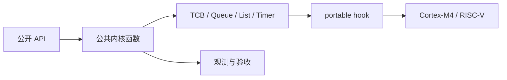

# FreeRTOS 内核源码解读：从任务创建到上下文切换

## 系列定位

本系列面向具备 C 语言、裸机或基础 RTOS 使用经验，希望系统理解 FreeRTOS 内部实现的嵌入式工程师。

主线不是罗列 API，也不绑定某个 MCU、开发板、HAL 或 IDE，而是沿真实执行链回答以下问题：

- 任务如何创建并进入就绪队列；
- 调度器如何启动、处理 Tick、阻塞、唤醒和销毁；
- 队列、信号量、互斥锁、通知和事件组如何组织等待任务；
- Stream Buffer、Message Buffer 和软件定时器如何运行；
- heap_1 到 heap_5 如何实现不同的内存策略；
- 公共内核如何通过 portable 层落到 Cortex-M4 与 RISC-V；
- MPU、SMP、低功耗和 trace 如何扩展经典单核内核。

## 源码版本

所有文章固定使用：

```text
FreeRTOS-Kernel V11.3.0
commit 9b777ae5c5b8e9e456065a00294d1e5f5f9facf5
FreeRTOS 202604-LTS
```

权威来源：

- [FreeRTOS-Kernel V11.3.0](https://github.com/FreeRTOS/FreeRTOS-Kernel/tree/V11.3.0)
- [FreeRTOS Kernel Book](https://github.com/FreeRTOS/FreeRTOS-Kernel-Book)
- [GCC ARM_CM4F port](https://github.com/FreeRTOS/FreeRTOS-Kernel/tree/V11.3.0/portable/GCC/ARM_CM4F)
- [GCC RISC-V port](https://github.com/FreeRTOS/FreeRTOS-Kernel/tree/V11.3.0/portable/GCC/RISC-V)

不能引用漂移的 `main` 行号，也不能把 vendor fork 写成上游 FreeRTOS 行为。

## 组织方式

采用“执行链驱动主线 + 源码索引辅助”：



基础文章以单核调度器为主线。MPU 与 SMP 不穿插到每个基础函数，而是在进阶文章中独立解释。

## 八个技术阶段与十五篇文章

### 源码地图与基础设施

1. `freertos-01-kernel-source-map-config.md`
   - 源码目录、配置宏、命名、条件编译和阅读方法。

### 任务生命周期与调度器

2. `freertos-02-list-tcb-task-creation.md`
   - `list.c/list.h`、TCB、静态/动态创建、初始栈和 ready list。
3. `freertos-03-scheduler-tick-task-lifecycle.md`
   - 调度器启动、任务状态、Tick、延时链表、切换、删除和 Idle 回收。

### 移植层与上下文切换

4. `freertos-04-cortex-m4-port-context-switch.md`
   - portable 契约、SVC、PendSV、SysTick、BASEPRI、EXC_RETURN 和 FPU。
5. `freertos-05-riscv-port-trap-context-switch.md`
   - `port.c/portASM.S`、trap、CSR、Tick 与上下文保存。

### 线程通信与同步

6. `freertos-06-queue-send-receive-isr.md`
   - Queue_t、发送/接收、阻塞/唤醒、ISR 与 queue lock。
7. `freertos-07-semaphore-mutex-priority-inheritance.md`
   - 信号量、互斥锁、递归、优先级继承与恢复。
8. `freertos-08-task-notification-event-group-queue-set.md`
   - 任务通知、事件组、Queue Set 与机制选型。

### 流式通信与软件定时器

9. `freertos-09-stream-message-buffer-software-timer.md`
   - 环形缓冲、消息边界、timer command queue 和 daemon task。

### 内存管理

10. `freertos-10-memory-management-heap-one-to-five.md`
    - 静态分配、heap_1～heap_5，重点分析 heap_4 与 heap_5。

### 可靠性、低功耗与调试

11. `freertos-11-reliability-tickless-trace-debug.md`
    - assert、栈检查、tickless、trace、runtime stats 和故障取证。

### MPU、SMP 与综合源码实验

12. `freertos-12-mpu-smp-kernel-observability.md`
    - MPU wrappers、SMP 分支、affinity、跨核调度和综合 trace。

### 面试专题

13. `freertos-13-interview-task-scheduler-context-switch.md`
    - 任务、Tick、调度、删除和两种架构上下文切换。
14. `freertos-14-interview-ipc-synchronization-memory.md`
    - IPC 选型、优先级反转、ISR API、事件组与 heap。
15. `freertos-15-interview-porting-reliability-system-design.md`
    - port、异常、低功耗、可靠性、MPU/SMP 与综合设计题。

## 单篇写作标准

- 不设置行数目标，以机制完整、叙事连续和源码证据充分为准；
- 6～9 个二级标题，围绕一个机制持续推进；
- 至少两条完整调用链；
- 4～8 组关键源码片段；
- 每个片段注明版本、文件、函数、配置条件和 fixed-tag permalink；
- 至少 3 个 Mermaid，Mermaid 与隐藏图片 prompt 合计至少 5 个视觉点；
- 包含配置矩阵、源码索引、观测实验、排错、阶段验收和面试表达。

## 源码截取规范

只截解释当前机制所需的关键分支，不复制整个大型函数。

统一标记：

```markdown
> 源码位置：`tasks.c` · `vTaskSwitchContext()` · `V11.3.0`
> 配置条件：`configUSE_PREEMPTION == 1`
> 固定链接：GitHub V11.3.0 permalink
```

源码内新增注释必须使用清晰的“解读”前缀，不能让读者误以为注释来自上游仓库。大段样板代码使用等价伪代码和调用链替代。

## 图示规范

调用链、状态机、链表关系、阻塞唤醒、Tick、timer 和内存块变化直接使用 Mermaid。

CPU 栈帧、异常自动压栈、trap 上下文、MPU region 和 SMP 多核关系可以使用隐藏注释：

```html
<!-- IMAGE_PROMPT: 主体、布局、标签、比例、配色和禁止项 -->
```

不使用 ASCII 图，隐藏 prompt 不作为网页可见正文。

## 面试专题回答结构

每篇至少八个场景问题。每道题应形成完整论证闭环，能够明确辨认出以下内容，但不使用空表或检查清单堆叠版面：

1. **场景**：真实故障或设计约束；
2. **源码依据**：文件、函数、结构体和配置；
3. **详细回答**：从运行机制推导结论；
4. **常见误区**：解释错误结论为何不成立；
5. **追问**：把问题推进到边界、调试或取舍。

## 写作红线

- 禁止草稿、自我怀疑和思考过程；
- 禁止逐篇预告；
- 禁止正文用文章编号交叉引用；
- 禁止声称未执行的硬件结果或性能数据；
- 公共内核文章禁止绑定 STM32F 型号、CubeMX 或 HAL API；
- port 文章只讨论 Cortex-M4 和 RISC-V 架构机制，不写开发板教程。
