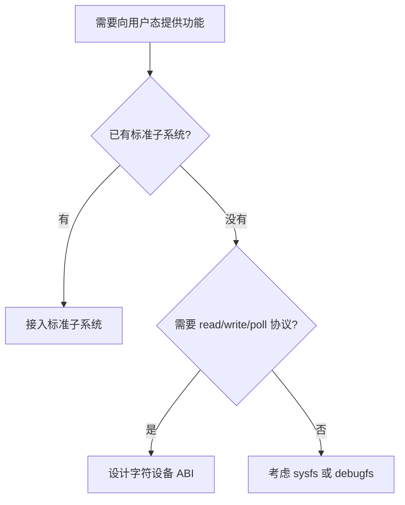
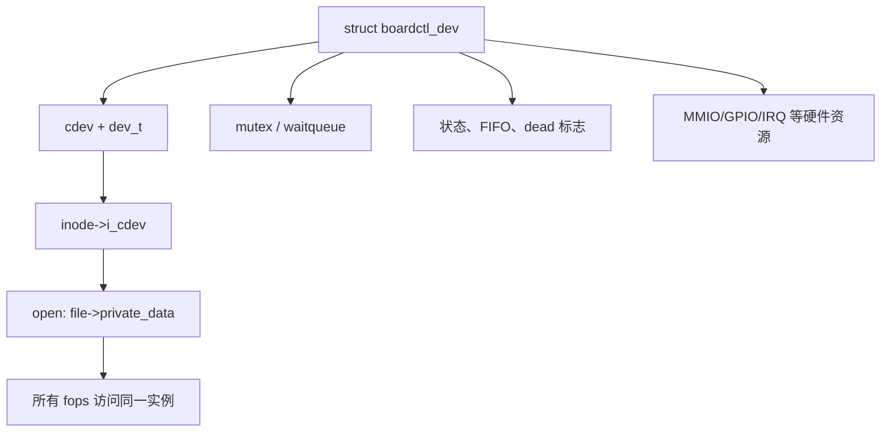
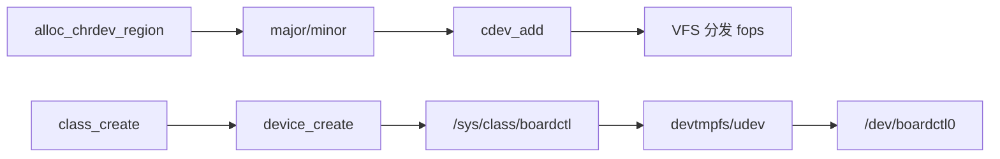
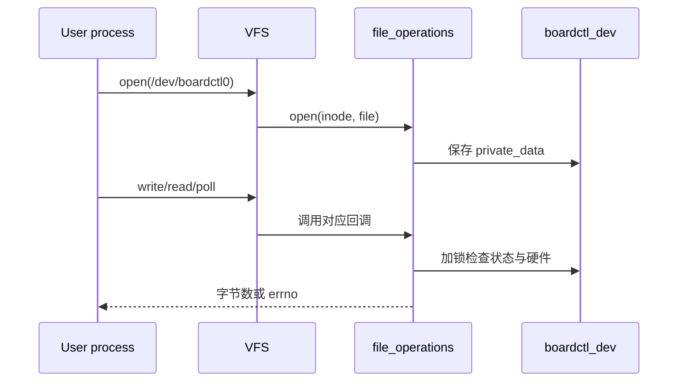
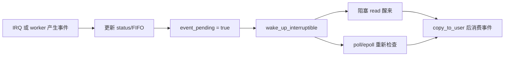
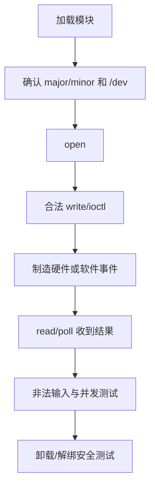
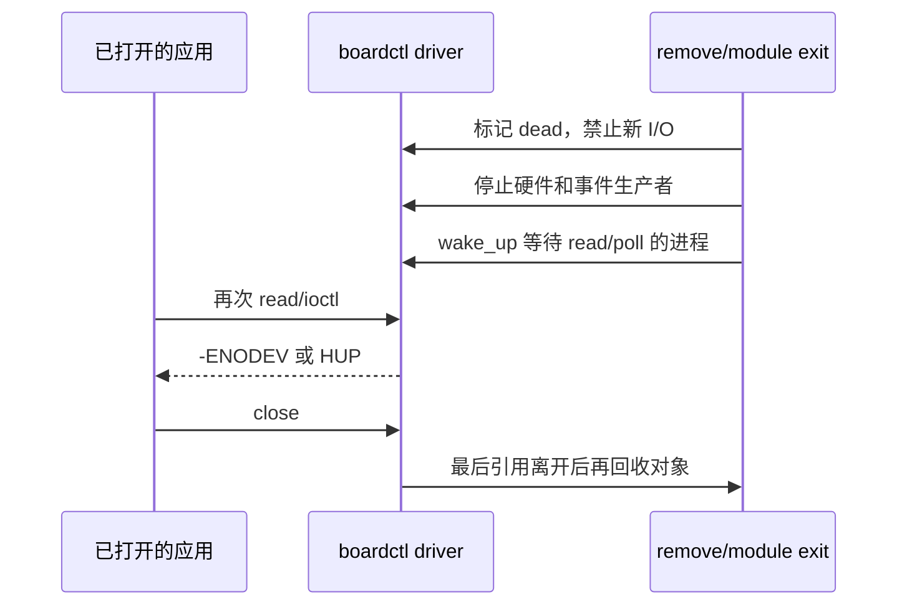

应用程序运行在用户空间，通过系统调用请求内核服务；驱动运行在内核空间，拥有更高权限，也必须承担越界、并发和资源泄漏的系统级后果。学习驱动的第一步应先理解一个可加载模块如何进入/离开内核，再建立 Kbuild 编译关系，随后才把字符设备注册到 VFS，并用 `file_operations` 定义用户 ABI。

本篇完成一个不依赖真实 SoC 寄存器的 `boardctl` 示例。它用于验证模块、设备号、cdev、用户数据复制、poll 和卸载语义。下一篇建立 Device Model，第三篇再把这个实例放进 platform probe。

## 一、从内核空间、模块到 Kbuild

内核模块是可在运行时装入内核的目标文件。它与用户程序共享 C 语言语法，但不能链接 libc，使用内核导出的符号和内核执行上下文。模块错误可能直接导致 kernel oops，因此所有输入、引用和退出路径都必须显式管理。

```c
#include <linux/init.h>
#include <linux/module.h>

static int __init boardctl_init(void)
{
    pr_info("boardctl: init\n");
    return 0;
}

static void __exit boardctl_exit(void)
{
    pr_info("boardctl: exit\n");
}

module_init(boardctl_init);
module_exit(boardctl_exit);
MODULE_LICENSE("GPL");
MODULE_DESCRIPTION("boardctl learning driver");
```

`module_init()`/`module_exit()` 注册加载与卸载入口；`__init` 允许内核在初始化完成后回收只用于 init 的代码；模块 init 返回非零表示加载失败，已经取得的资源必须在返回前撤销。

外部模块由 Kbuild 使用目标内核的配置、编译器参数和生成头文件编译：

```make
obj-m += boardctl.o

KDIR ?= /lib/modules/$(shell uname -r)/build

all:
	$(MAKE) -C $(KDIR) M=$(CURDIR) modules

clean:
	$(MAKE) -C $(KDIR) M=$(CURDIR) clean
```

板端内核与模块的 `vermagic`、架构和配置必须一致。`modinfo boardctl.ko` 查看元数据，`insmod` 直接加载文件，`modprobe` 通过 modules.dep/alias 解析依赖。第一个实验只验证 init/exit 与日志，确认工具链和目标内核一致后再增加字符设备资源。


## 二、先写出 ABI，而不是先注册字符设备

字符设备是用户态与内核之间的长期边界。先判断字符设备是否合适：若是按键、LED、传感器或网络功能，优先使用 input、LED、IIO、netdev 等标准子系统；若确实需要专有命令、数据读取或事件等待，才设计自己的字符设备。



本例先把 ABI 约束写清：

| 项目 | 本例约定 | 这样设计的原因 |
|---|---|---|
| 设备节点 | `/dev/boardctl0` | 多实例时可以扩展为 `boardctlN` |
| `read()` | 读取一份状态快照 | 不让读取意外改变硬件状态 |
| `write()` | 接受定长、版本化控制请求 | 易校验长度与兼容性 |
| `poll()` | 有新事件时返回可读 | 用户态不需要忙等 |
| `ioctl()` | 少量固定控制命令 | 不把命令字符串塞进 sysfs |
| 设备离线 | 新 I/O 返回 `-ENODEV` | 用户态可明确恢复 |

一个请求结构应避免 native `long`、裸指针和未定义字节序；这类字段会让 32/64 位兼容和跨版本维护变得困难。

```c
struct boardctl_request {
    __u32 version;
    __u32 command;
    __u32 value;
    __u32 reserved;
};

enum boardctl_command {
    BOARDCTL_CMD_SET_MODE = 1,
    BOARDCTL_CMD_CLEAR_ERROR = 2,
};
```

对每个 command 写出可接受的值、执行前提和 errno。比如设备正在采集时禁止改 mode，应返回 `-EBUSY`；未知 command 返回 `-EINVAL`；版本错误返回 `-EPROTO` 或工程约定的错误。没有这些边界的 ABI，会迫使上层靠猜测重试。


## 三、建立每个设备实例的内核对象

不要把状态写成一组全局变量。一个字符设备需要把 cdev、同步对象、等待队列、硬件状态和在线状态绑定到同一个实例。这样后续支持两个外设、driver unbind 或多个打开者时，数据不会串在一起。



```c
struct boardctl_dev {
    struct cdev cdev;
    dev_t devt;
    struct device *devnode;
    struct mutex lock;
    wait_queue_head_t read_wq;
    bool dead;
    bool event_pending;
    u32 status;
};

static int boardctl_open(struct inode *inode, struct file *file)
{
    struct boardctl_dev *bdev;

    bdev = container_of(inode->i_cdev, struct boardctl_dev, cdev);
    if (READ_ONCE(bdev->dead))
        return -ENODEV;
    file->private_data = bdev;
    return 0;
}
```

`open()` 获得实例只是开始。真实驱动还需要决定谁在设备 remove 时持有对象引用。第一个学习版本可以用模块引用和明确 `dead` 标志建立语义；进入可热解绑或多实例环境后，应采用工程已有的 `kref`、device reference 或锁方案，保证最后一个 `release()` 前私有对象不会被释放。

现在注册设备号和 cdev。动态分配 major 避免与系统现有设备冲突；主次设备号用于让 VFS 找到正确 cdev。

```c
static int boardctl_register_cdev(struct boardctl_dev *bdev)
{
    int ret;

    ret = alloc_chrdev_region(&bdev->devt, 0, 1, "boardctl");
    if (ret)
        return ret;

    cdev_init(&bdev->cdev, &boardctl_fops);
    bdev->cdev.owner = THIS_MODULE;
    ret = cdev_add(&bdev->cdev, bdev->devt, 1);
    if (ret) {
        unregister_chrdev_region(bdev->devt, 1);
        return ret;
    }
    return 0;
}
```

接着使用 class 与 `device_create()` 建立可观察节点。不同内核版本的 `class_create()` 参数可能不同，必须参照当前内核树中同类调用。



```c
static int boardctl_create_node(struct boardctl_dev *bdev,
                                struct class *boardctl_class)
{
    bdev->devnode = device_create(boardctl_class, NULL, bdev->devt,
                                  bdev, "boardctl0");
    if (IS_ERR(bdev->devnode))
        return PTR_ERR(bdev->devnode);
    return 0;
}
```

失败路径的顺序必须反过来：`device_destroy()`、`class_destroy()`、`cdev_del()`、`unregister_chrdev_region()`。每完成一个注册动作就考虑它如何撤销，避免加载失败时留下节点或号码。

## 四、实现 file_operations，并统一事件模型

用户态的 `open/read/write/ioctl/poll` 经 VFS 分发到 fops。它们运行于进程上下文，可以睡眠，但必须验证用户指针、保护共享状态，并在设备离线时返回可理解的错误。



先实现 `write()`。`buf` 指向用户地址，不能直接解引用。长度不对、复制失败、版本不对或命令非法，都必须返回相应错误而不是悄悄吞掉。

```c
static ssize_t boardctl_write(struct file *file, const char __user *buf,
                              size_t count, loff_t *ppos)
{
    struct boardctl_dev *bdev = file->private_data;
    struct boardctl_request req;
    int ret;

    if (count != sizeof(req))
        return -EMSGSIZE;
    if (copy_from_user(&req, buf, sizeof(req)))
        return -EFAULT;
    if (req.version != 1 || req.reserved)
        return -EPROTO;

    mutex_lock(&bdev->lock);
    if (bdev->dead) {
        ret = -ENODEV;
    } else {
        ret = boardctl_apply_request(bdev, &req);
    }
    mutex_unlock(&bdev->lock);
    return ret ? ret : sizeof(req);
}
```

不要把用户传入的 value 当寄存器地址、DMA 地址或内核指针。即使节点权限设为 root，也必须做 command/value 白名单；权限是额外防线，不能替代输入校验。

`read()`、IRQ/worker 和 `poll()` 要使用同一份“是否有事件”的状态。这样应用既可阻塞读，也可使用 epoll，不会出现 poll 报可读而 read 返回 EOF 的矛盾。



```c
static __poll_t boardctl_poll(struct file *file, poll_table *wait)
{
    struct boardctl_dev *bdev = file->private_data;
    __poll_t mask = 0;

    poll_wait(file, &bdev->read_wq, wait);
    if (READ_ONCE(bdev->dead))
        return EPOLLHUP | EPOLLERR;
    if (READ_ONCE(bdev->event_pending))
        mask |= EPOLLIN | EPOLLRDNORM;
    return mask;
}
```

如果没有数据，阻塞 `read()` 应等待同一个条件；带 `O_NONBLOCK` 的 fd 则返回 `-EAGAIN`。对 FIFO 还要定义多个读者是否竞争、满时丢弃还是阻塞、溢出如何计数。不要让每个 fops 自己维护一套互不相容的状态。

`ioctl` 只保留少量固定控制项。连续数据用 read/write，单个稳定属性用 sysfs，复杂配置需要先重新评估接口。命令号使用统一 magic、方向和大小，并在独立 UAPI 头文件中保存。

```c
#define BOARDCTL_IOC_MAGIC       'B'
#define BOARDCTL_IOC_GET_STATUS  _IOR(BOARDCTL_IOC_MAGIC, 0x00, __u32)

static long boardctl_ioctl(struct file *file, unsigned int cmd,
                           unsigned long arg)
{
    struct boardctl_dev *bdev = file->private_data;
    __u32 status;

    if (_IOC_TYPE(cmd) != BOARDCTL_IOC_MAGIC)
        return -ENOTTY;
    if (cmd != BOARDCTL_IOC_GET_STATUS)
        return -ENOTTY;
    status = READ_ONCE(bdev->status);
    return copy_to_user((void __user *)arg, &status, sizeof(status)) ?
           -EFAULT : 0;
}
```

## 五、编译、加载并从用户态验证 ABI

外部模块必须针对目标内核的构建输出编译，而不是使用开发主机正在运行的内核头文件。路径、架构和交叉编译器按当前 SDK 修改。

```bash
make -C <kernel-build-dir> M="$PWD" ARCH=<target-arch> \
  CROSS_COMPILE=<toolchain-prefix> modules

insmod boardctl.ko
dmesg -T | tail -100
cat /proc/devices | rg 'boardctl'
ls -l /dev/boardctl*
readlink -f /sys/class/boardctl/boardctl0 2>/dev/null
```

设备节点出现后，不要立刻认为 ABI 正确。按下图逐项验证每条路径：



最小测试程序应至少包含四个 case：

1. 打开节点并发送一个合法、版本正确的 request，检查返回字节数与硬件状态。
2. 分别发送错误长度、错误版本、未知 command，检查是否得到设计中的 errno。
3. 以 `O_NONBLOCK` 打开并在无事件时读，确认得到 `-EAGAIN`；再用 poll 等待一次真实事件。
4. 同时启动两个进程读写，验证锁和事件消费语义符合 ABI。

```bash
# 用 strace 保留系统调用真实返回值；应用打印并不能替代它
strace -f -e openat,read,write,ioctl,poll <test-program>

# 调试期间同时记录节点和驱动日志
ls -l /dev/boardctl0
dmesg -wT
```

把用户态测试输出与内核日志配对保存。例如 write 返回 16 字节但硬件未动作，应回到 `boardctl_apply_request()`、锁、PM/clock 与寄存器写入结果，而不是先怀疑 `/dev` 节点。

## 六、处理离线、卸载和常见失败

设备节点删除后，已经打开它的进程仍可能调用 read/write/ioctl。remove 或 module exit 必须先阻止新事务，唤醒所有等待者，再同步停止 IRQ、timer 和 workqueue，最后注销节点和释放私有数据。



模块实验中可先确认所有测试程序已退出，再执行 `rmmod`。这不等于生产级生命周期已经正确，只是避免用一个未经实现引用计数的 demo 制造内核崩溃。

```bash
fuser -v /dev/boardctl0 2>/dev/null
lsmod | rg 'boardctl'
rmmod boardctl
dmesg -T | tail -120
```

出现问题时，按下面顺序查证：

| 表现 | 先查证据 | 常见根因 |
|---|---|---|
| 没有 `/dev/boardctl0` | `dmesg`、`/proc/devices`、`/sys/class` | 注册顺序、class/devtmpfs、错误回滚 |
| open 失败 | major/minor、权限、`dead` | 节点指向错误实例或 remove 中 |
| write 返回成功但无动作 | request 校验、硬件动作返回值 | 只返回 count，未检查真实执行 |
| read 卡住或 poll 占 CPU | 等待条件和 wakeup | 事件状态不一致或忙轮询 |
| rmmod busy/崩溃 | 打开 fd、异步工作、对象引用 | remove 与 release 没有闭合 |

完成本篇后，把 `boardctl` 接进新顺序第 3 篇的 platform driver：在 `probe()` 中分配实例、获取硬件资源并创建设备节点；在 `remove()` 中按本节顺序撤销。这样字符设备就不再是孤立的模块演示，而是板级外设的完整用户接口。

**参考资料**

- [Linux Kernel Module Programming - Building External Modules](https://docs.kernel.org/kbuild/modules.html)
- [Linux Device Drivers Infrastructure](https://docs.kernel.org/driver-api/infrastructure.html)
- [Character devices in the Linux kernel](https://docs.kernel.org/core-api/kernel-api.html)

## 七、小结

第一个驱动实验应先证明模块能被目标内核正确加载和卸载，再通过 Kbuild、设备号、cdev 和 `file_operations` 建立稳定用户 ABI。内核对象、用户输入和异步事件必须在卸载前收敛；下一篇将用 Driver Core 解决“设备实例和驱动如何匹配并管理生命周期”。

> 🏷️ 标签：Linux BSP、kernel module、character device、cdev、file_operations、ioctl、poll、UAPI
