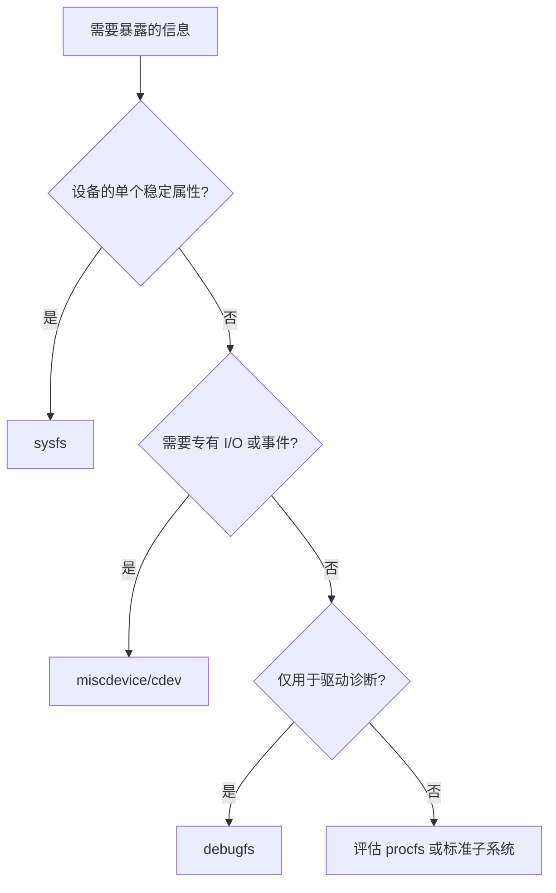
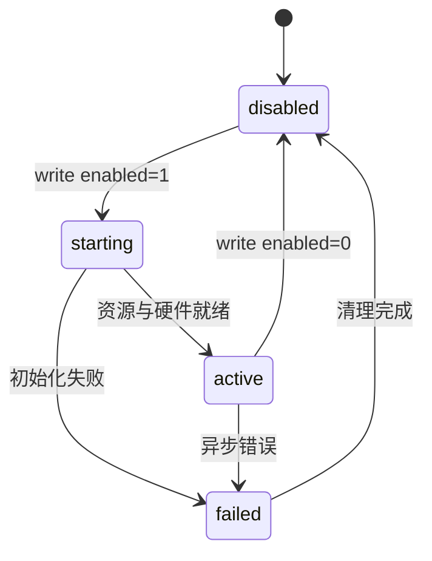
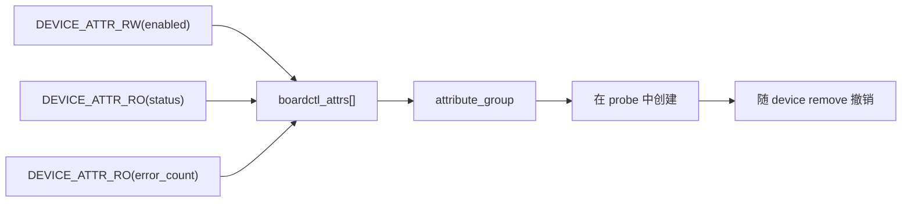
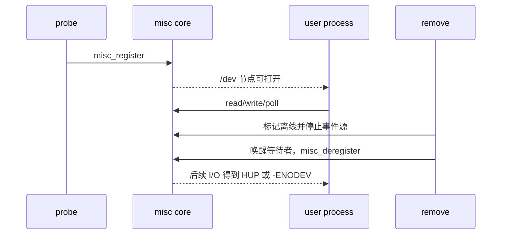
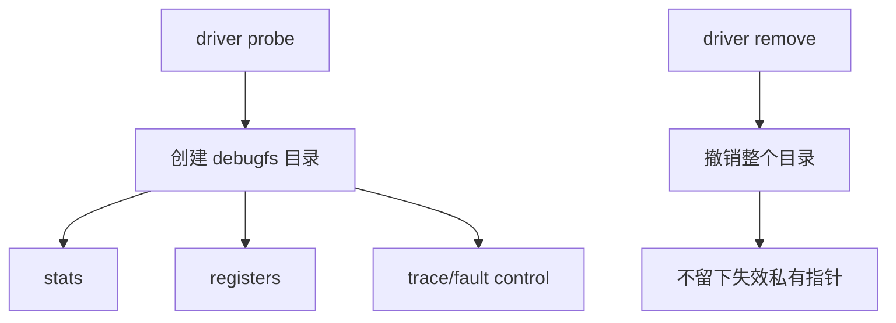

这一篇继续使用前两篇的板级设备，但任务从“让驱动工作”变为“让人能正确观察和控制它”。目标是给 `boardctl` 建立两层用户接口：量产服务只依赖稳定的控制/状态 ABI；开发人员在 debugfs 中查看详细统计和寄存器快照。

把所有内容都塞进 `/proc`、sysfs 或 debugfs 是常见的早期做法。它通常能短期解决问题，却会混淆稳定性、权限和生命周期。本篇会先确定每种信息的去向，再逐步实现和验证。

## 1. 先把每一类信息放到正确的位置

开始写文件前，列出用户态真正需要的内容。下面的表是本例的接口清单，后续代码都围绕它实现。

| 信息或动作 | 消费者 | 选择的接口 | 是否承诺稳定 |
|---|---|---|---|
| 启用/停止设备 | 量产服务 | sysfs `enabled` | 是 |
| 当前状态和错误计数 | 服务与运维脚本 | sysfs 只读属性 | 是 |
| 专有命令或阻塞事件 | 应用程序 | 第 16 篇字符设备/miscdevice | 是，需维护 UAPI |
| 详细寄存器、队列、调试统计 | BSP 开发者 | debugfs | 否 |
| 系统级摘要或历史兼容入口 | 系统工具 | procfs + seq_file | 谨慎维护 |



这个分类带来三条规则：

1. sysfs 每个文件只表达一个属性，用 ASCII 文本输入输出，不承载隐式多命令协议。
2. debugfs 允许输出详细结构，但不让量产服务依赖路径、格式或存在性。
3. 任何引用设备私有数据的虚拟文件，都必须随 device 生命周期创建和撤销。

先在目标板观察已有设备如何组织接口，优先复用本 SDK 的命名和权限风格：

```bash
find /sys/class -maxdepth 2 -type d | head -100
find /sys/bus/platform/devices -maxdepth 2 -type f -name uevent | head -40
mount | rg 'sysfs|proc|debugfs'
find /sys/kernel/debug -maxdepth 2 -type d | head -100 2>/dev/null
```

## 2. 第一步：实现量产可用的 sysfs 控制面

本例为 `boardctl` 提供 `enabled`、`status`、`error_count` 三个属性。读者应把它们视为一组状态机接口，而不是几个独立文本文件：`enabled=1` 必须在资源、互斥关系和硬件允许时才成功；`status` 只报告当前快照；`error_count` 只报告累计结果。



每个属性先定义可读写范围和 errno：

| 属性 | 输入或输出 | 成功含义 | 典型失败 |
|---|---|---|---|
| `enabled` | `0`/`1` 或 bool 文本 | 设备已停用或已可用 | `-EBUSY`、`-EIO`、`-ENODEV` |
| `status` | 单行状态枚举/位图 | 无副作用的状态快照 | 设备离线时 `-ENODEV` |
| `error_count` | 单个十进制计数 | 自启动以来累计错误 | 只读，不接受 write |

使用 `sysfs_emit()` 输出，用 `kstrtobool()` 等内核解析函数处理输入；不要用手写字符串比较接受模糊格式。

```c
static ssize_t enabled_show(struct device *dev,
                            struct device_attribute *attr, char *buf)
{
    struct boardctl_dev *bdev = dev_get_drvdata(dev);

    return sysfs_emit(buf, "%u\n", READ_ONCE(bdev->enabled));
}

static ssize_t enabled_store(struct device *dev,
                             struct device_attribute *attr,
                             const char *buf, size_t count)
{
    struct boardctl_dev *bdev = dev_get_drvdata(dev);
    bool enable;
    int ret;

    ret = kstrtobool(buf, &enable);
    if (ret)
        return ret;

    mutex_lock(&bdev->lock);
    if (bdev->dead)
        ret = -ENODEV;
    else
        ret = boardctl_set_enabled(bdev, enable);
    mutex_unlock(&bdev->lock);
    return ret ? ret : count;
}

static DEVICE_ATTR_RW(enabled);
```

这里的关键不是语法，而是 `boardctl_set_enabled()` 必须执行真实状态转换并返回真实失败。例如开启时先请求 runtime PM、打开时钟、检查硬件 ready，任一步失败就回滚并保持 disabled；关闭时先禁止新事务、停止采集或 IRQ，再关闭资源。`cat enabled` 不应触发复位或清错误等副作用。

将相关属性放进同一个 group，让创建和失败回滚保持对称：



```c
static struct attribute *boardctl_attrs[] = {
    &dev_attr_enabled.attr,
    &dev_attr_status.attr,
    &dev_attr_error_count.attr,
    NULL,
};

static const struct attribute_group boardctl_group = {
    .attrs = boardctl_attrs,
};

/* probe: devm_device_add_group(dev, &boardctl_group); */
```

当前内核若未提供 `devm_device_add_group()`，使用工程已有的 `sysfs_create_group()`/`sysfs_remove_group()` 配对方式。无论哪种 API，属性回调与 remove 并发时都必须能识别 `dead` 状态，不能访问已经关闭的硬件。

## 3. 第二步：为需要文件操作的场景选择 miscdevice 或 cdev

第 16 篇已用 cdev 展示完整设备号路径。若一个驱动只需要单个小型字符设备，`miscdevice` 能省去 major/minor 和 class 的注册样板；它不会替你设计 read/write/poll、用户指针和离线语义。


把 cdev 和 miscdevice 的选择写进设计，而不是两个都注册：

| 情况 | 推荐 |
|---|---|
| 单一诊断/控制节点，不关心自定义编号 | `miscdevice` |
| 多实例、多个 minor、需要明确 parent/class 关系 | `cdev` + class |
| 已有标准子系统节点 | 不额外注册私有字符设备 |

```c
struct board_diag {
    struct miscdevice miscdev;
    struct boardctl_dev *owner;
};

static int board_diag_register(struct board_diag *diag)
{
    diag->miscdev.minor = MISC_DYNAMIC_MINOR;
    diag->miscdev.name = "board-diag";
    diag->miscdev.fops = &board_diag_fops;
    return misc_register(&diag->miscdev);
}
```

注册成功后，`struct miscdevice` 与它关联的私有对象必须一直有效到 `misc_deregister()` 完成。若诊断节点有阻塞 read 或 poll，还要在 remove 时标记离线、停止事件源并唤醒等待者，不能只调用一次 deregister。



## 4. 第三步：只把诊断信息放进 debugfs/procfs

稳定控制面完成后，才添加调试面。debugfs 特意不承诺稳定 ABI，适合寄存器命名转储、队列深度、统计计数和受限故障注入；它不适合作为量产服务的依赖。



```c
static void boardctl_debugfs_init(struct boardctl_dev *bdev)
{
    bdev->debug_dir = debugfs_create_dir(dev_name(bdev->dev), NULL);
    debugfs_create_atomic64_t("events", 0444, bdev->debug_dir,
                              &bdev->events);
    debugfs_create_atomic64_t("errors", 0444, bdev->debug_dir,
                              &bdev->errors);
}

static void boardctl_debugfs_exit(struct boardctl_dev *bdev)
{
    debugfs_remove(bdev->debug_dir);
}
```

debugfs 可被内核配置关闭，创建失败不能让真实外设 probe 失败。模块或可解绑驱动必须在 remove 中调用 `debugfs_remove()`；它会递归移除目录内容。不要保留打开文件可继续解引用已释放 `bdev` 的路径。

寄存器转储建议使用 `seq_file`。这样用户多次 read、seek 或输出超过一次读取大小时，内核能正确处理 offset 和缓冲；驱动只负责在锁和 runtime PM 约束下输出一份一致快照。

```c
static int boardctl_regs_show(struct seq_file *s, void *unused)
{
    struct boardctl_dev *bdev = s->private;
    int ret;

    ret = boardctl_runtime_get(bdev);
    if (ret)
        return ret;
    mutex_lock(&bdev->lock);
    seq_printf(s, "status: 0x%08x\n", boardctl_read_status(bdev));
    seq_printf(s, "errors: %lld\n", atomic64_read(&bdev->errors));
    mutex_unlock(&bdev->lock);
    boardctl_runtime_put(bdev);
    return 0;
}
```

不要用 debugfs 提供“任意地址、任意值”寄存器写入。若确实需要故障注入或 reset，单独建立权限受限、命令白名单明确的入口，并记录执行前后状态。读取某些寄存器本身会清状态或需要时钟，因此 debugfs read 也必须遵守硬件访问约束。

procfs 只在确实需要系统级或历史兼容输出时使用。长输出同样使用 `seq_file`，并让入口名、格式和生命周期被清楚记录；不要因为“/proc 很方便”就为每个设备复制一个私有目录。

## 5. 第四步：在板端验证稳定性和生命周期

现在按照控制面、诊断面、离线三层完成测试，而不是只检查文件是否出现。


```bash
# 找到真实设备路径后再执行；不要把占位路径直接复制到板端
find /sys -path '*<actual-device-name>*' -type f 2>/dev/null | head -100
mount | rg debugfs
find /sys/kernel/debug -path '*<driver-name>*' -print 2>/dev/null

# 对 sysfs 保留成功和失败 errno
printf 'invalid\n' > /sys/<device-path>/enabled
printf '1\n' > /sys/<device-path>/enabled
cat /sys/<device-path>/status
cat /sys/<device-path>/error_count
```

验证过程至少覆盖：

1. 读取全部稳定属性，确认输出单位、换行和含义与文档一致。
2. 写入合法值、非法文本、越界值和当前状态不允许的值，检查 errno 和硬件结果。
3. 在运行、空闲和 runtime suspend 条件下读取 debugfs，确认不会访问失效硬件。
4. 打开 misc/cdev 节点后触发 driver unbind 或受控模块卸载，确认阻塞读者被唤醒而不会崩溃。
5. 重启后再次检查路径、权限和默认状态，防止 init 脚本依赖了临时 debugfs。

| 表现 | 优先检查 | 常见根因 |
|---|---|---|
| sysfs 文件没有出现 | device 是否成功 probe、group 返回值 | 属性创建在错误阶段或失败未记录 |
| `echo` 成功但硬件未改变 | store 的执行结果与锁 | 只返回 count，没有检查真实动作 |
| 多次 `cat` 输出截断/乱序 | 自写 proc/debugfs read | 没用 seq_file 处理 offset |
| 设备移除后读取崩溃 | dentry、private data、同步 | debugfs/proc 未撤销或无引用保护 |
| 量产服务读 debugfs | 接口分层不清 | 将调试面迁移到稳定 ABI |

在接口进入量产镜像前，整理一份验收记录。它不需要复杂，但必须让未来维护者知道每个入口为何存在，以及改动格式时哪些用户态会受影响。


建议最少记录以下内容：

| 记录项 | 示例问题 |
|---|---|
| 节点路径与权限 | 非 root 服务是否应该可写 `enabled`？ |
| 输入格式 | 接受 `0/1`、`on/off` 还是完整枚举？是否允许空白？ |
| 输出格式和单位 | `status` 是枚举文本、位图还是十进制？是否带换行？ |
| 默认值 | 冷启动、驱动 probe、异常恢复后的状态是什么？ |
| 并发规则 | 两个服务同时写入时，谁得到 `-EBUSY`？ |
| 生命周期 | suspend、unbind、设备故障时读写返回什么？ |
| 消费者 | 哪些脚本、服务或测试程序依赖该入口？ |

把稳定属性纳入自动化测试时，不要依赖 `ls` 的目录排序或 debugfs 是否挂载。测试应使用确切路径、显式比较返回码，并在失败日志中同时保存内核版本、DTB 标识和设备的 `uevent`。

```bash
# 记录稳定接口身份。这里的路径必须由当前板端实际 sysfs 结果替换。
DEV=/sys/<actual-device-path>
cat "$DEV/uevent"
stat -c '%a %U %G %n' "$DEV/enabled" "$DEV/status" "$DEV/error_count"

# 检查异常输入不会被静默接收。
printf 'nonsense\n' > "$DEV/enabled"
printf '1\n' > "$DEV/enabled"
printf '0\n' > "$DEV/enabled"
```

若接口格式必须升级，优先新增清晰版本化属性或 ioctl command，而不是悄悄改变现有文件输出。已部署的服务常会用简单 shell 解析，格式中的一个空格、单位或字段顺序变化都可能造成难以发现的产品回归。

对调试入口则相反：明确它只随当前内核版本有效，避免为了兼容临时文件而把诊断代码永久固化。

这份区分会显著降低后续维护成本。

也是驱动接口能长期保持可读的重要前提。

完成这篇后，驱动的用户出口就有了清晰边界：sysfs 负责少量、稳定、可脚本化的设备属性；字符设备负责专有 I/O；debugfs/procfs 提供诊断而不污染产品协议。以后增加接口时，先回到开头的表格判断归属，再动手写代码。

提交前再次检查稳定接口的权限、默认值和错误码，确保用户态服务不依赖调试入口。

> 🏷️ 标签：Linux BSP、miscdevice、sysfs、procfs、debugfs、seq_file、驱动 ABI、设备生命周期
