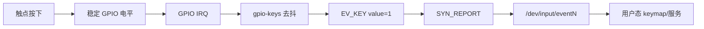
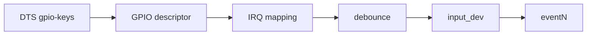
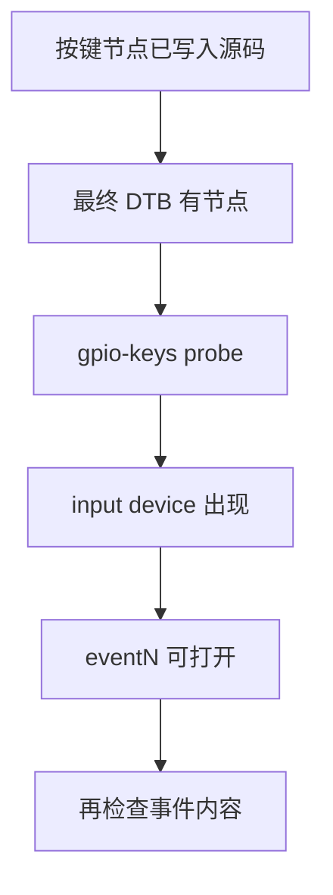
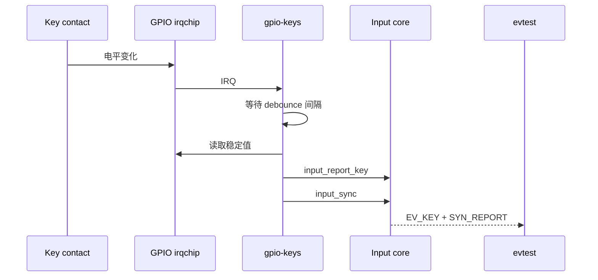
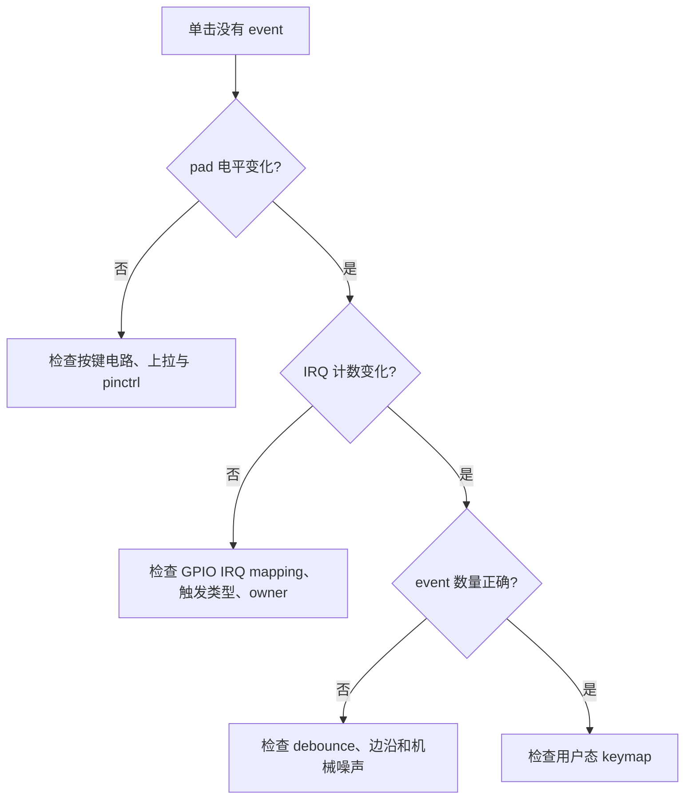
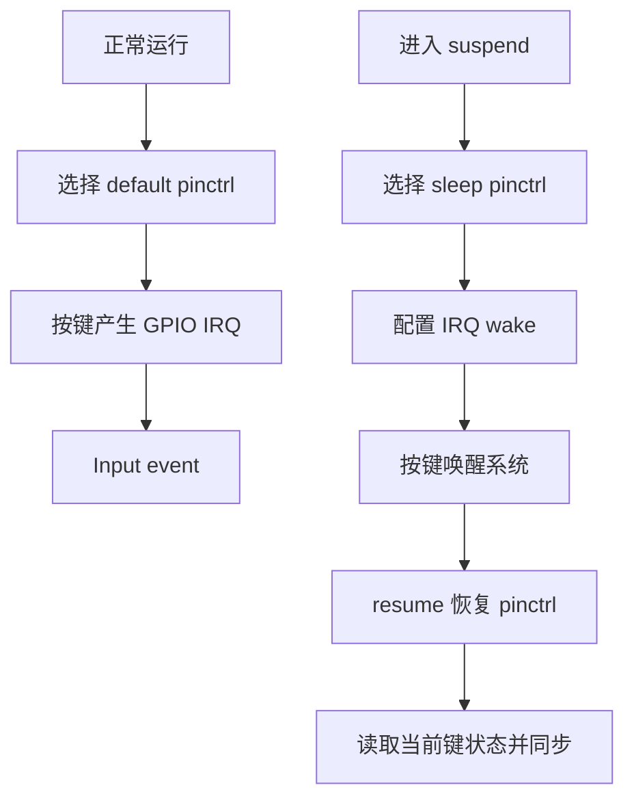
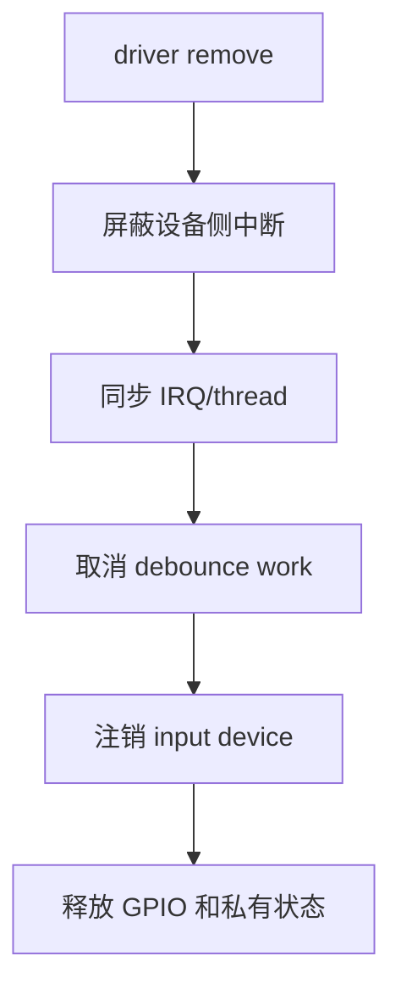
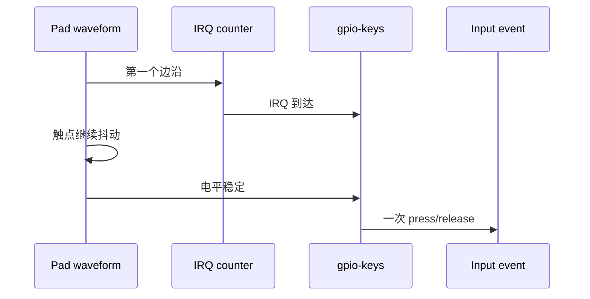
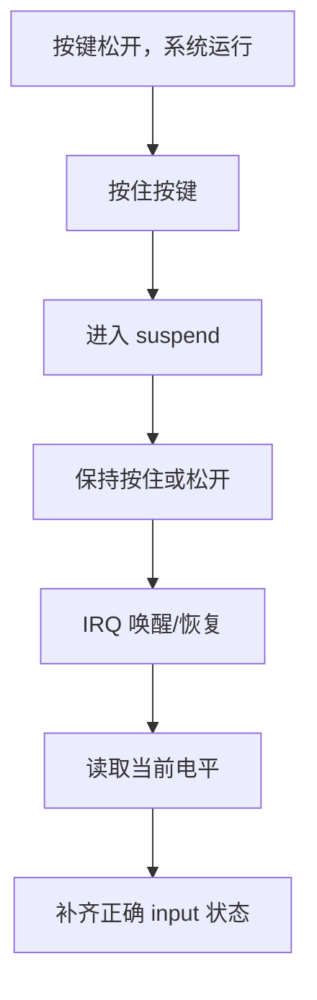

本篇只完成一个目标：按下板上的 GPIO 按键时，Linux 产生一次正确的 input event；松开时产生对应释放事件；系统 suspend 后按键能够按产品要求唤醒。

按键问题不能从 `input_report_key()` 开始。机械触点会抖动，GPIO 有物理极性，IRQ 有触发类型，低功耗还有 pinctrl 和 wake 配置。本文沿着一条事件路径逐步验证这些条件，并优先使用内核已有的 `gpio-keys` 驱动。

## 1. 先定义按键的电气事实和用户态结果

准备原理图、按键测试点、目标 DTB 和一个可读取 input event 的工具。先写事实表，再写节点；否则“按下是高还是低”会在 DTS、驱动和用户态之间反复猜。

| 项目 | 要确认的事实 | 证据 |
|---|---|---|
| 接法 | 按下接地还是接电源 | 原理图 |
| 松开电平 | 外部/内部上拉或下拉 | 原理图、万用表 |
| 抖动时间 | 按下和释放的最差持续时间 | 示波器 |
| GPIO 复用 | 是否与 UART、SPI、JTAG 共享 | pinmux 表、DTS |
| 输入键值 | 使用哪个 `KEY_*` code | 产品 keymap |
| 唤醒需求 | 哪些 suspend 状态可以唤醒 | PM 设计 |

验收结果应明确到事件序列，而不是“应用有反应”：



短按一次，预期得到一个按下和一个释放；不应因为机械抖动得到一串重复按下。长按是否自动重复属于 input 配置和产品行为，要单独定义，不能把重复事件误认为 IRQ 抖动。

```bash
cat /proc/bus/input/devices
ls -l /dev/input
evtest /dev/input/event<N>
```

工具名称按当前 rootfs 实际情况替换。先找到设备名称、物理路径和支持的 key code，再进行 DTS 修改。

## 2. 第一步：用 gpio-keys 描述按键并设置去抖

普通 GPIO 按键不需要自定义字符设备。`gpio-keys` 已经把 GPIO descriptor、IRQ、去抖和 Input 设备注册组织起来，并为用户态提供标准 event 接口。



节点结构如下，GPIO line、极性、键值和去抖时间要由前一节事实替换：

```dts
keys {
    compatible = "gpio-keys";

    user_button {
        label = "user-button";
        gpios = <&<gpio-controller> <line-offset> GPIO_ACTIVE_LOW>;
        linux,code = <KEY_<FUNCTION>>;
        debounce-interval = <20>;
        wakeup-source;
    };
};
```

`GPIO_ACTIVE_LOW` 表示 GPIO descriptor 的逻辑 active 状态对应物理低电平。按键 press/release 的逻辑解释应与此一致。`linux,code` 不能随便选一个数字；它必须是 Linux 已定义且用户态 keymap 知道的 `KEY_*`。

`debounce-interval` 不是越大越好。先测量最差触点抖动，再在“抑制重复事件”和“用户感知延迟”之间选择。硬件已有 RC 或控制器硬件去抖时，还要确认软件间隔不会造成不必要的额外延迟。

编译 DTB 并部署后，先证明运行时节点存在：

```bash
dtc -I dtb -O dts <built-board.dtb> | rg -n -C 5 'gpio-keys|user_button|linux,code'
find /sys/firmware/devicetree/base -type f -name compatible -print 2>/dev/null | rg 'gpio-keys'
dmesg -T | rg -i -C 3 'gpio-keys|input|gpio|irq'
cat /proc/bus/input/devices
```

若没有目标 input 设备，先检查最终 DTB、Kconfig、GPIO provider 和 probe 日志；不要直接进入用户态 keymap 调试。



## 3. 第二步：用 IRQ 和原始事件证明一次按键只走一次

输入设备出现后，按一次按键，同时观察 input event、IRQ 计数和 pad 波形。三者要在同一个时间线上对应：有电平变化才有 IRQ，有稳定状态才有 event。

```bash
cat /proc/interrupts
evtest /dev/input/event<N>
# 另一个终端同步采集 dmesg 或 IRQ 计数
dmesg -wT
```

预期的单击大致是：按下后一个 `EV_KEY` value 1，一个 `SYN_REPORT`；释放后一个 value 0，一个 `SYN_REPORT`。时间戳会因工具和内核实现不同而变化，但事件数量和顺序应稳定。



按键反复触发时，先看示波器上实际抖动持续多久，再看 `debounce-interval` 是否覆盖它。若 IRQ 计数增加很多但 event 只有一对，说明去抖正在发挥作用；若 event 也很多，调整前先保存波形，避免用盲目加大延时掩盖极性或线路噪声。

若 IRQ 计数完全不增加，按以下顺序检查：

1. GPIO pad 是否切到 GPIO 输入功能。
2. 按键按下/释放时测试点电平是否真实变化。
3. DTS GPIO IRQ mapping 是否由当前 controller 支持。
4. 触发极性是否与 active-low 和电气波形一致。
5. 是否有其他 consumer 占用该 GPIO。



只有在按键事件稳定之后，才处理长按、连击或重复键。这样每一次失败都有明确层次，不会把用户态功能问题倒推成 GPIO 中断问题。

## 4. 第三步：处理 wakeup、suspend 和必要的自定义驱动

`wakeup-source` 不是单独打开一个开关就结束。低功耗时 pad 仍需保持正确输入电平，GPIO irqchip 和中断控制器需要支持 wake，驱动和 PM 核心要正确启用/禁用 wake。resume 后还要重新同步实际键状态。



测试至少包括：未按下进入 suspend 后按下唤醒；按住按键进入 suspend 后松开；唤醒后立即再按一次；不允许唤醒的其他 GPIO 不应唤醒。记录 wakeup 属性和中断计数：

```bash
find /sys/devices -name wakeup -type f -print 2>/dev/null | head -80
cat /sys/power/wakeup_count
cat /proc/interrupts
echo mem > /sys/power/state
cat /proc/interrupts
```

若普通 GPIO 按键不满足 `gpio-keys` 的能力，例如使用矩阵扫描、需要特殊硬件握手、同一 IRQ 携带多个状态或要求自定义长按协议，再写自定义 driver。即使自定义，也应继续使用 descriptor API 和 Input core，不要重新创建私有 `/dev` 按键协议。

自定义 threaded IRQ 的职责应清晰：硬 IRQ 只确认来源和唤醒线程；线程上下文完成可能睡眠的 GPIO 读取、去抖和 input 上报。

```c
static irqreturn_t key_irq_thread(int irq, void *data)
{
    struct key_dev *key = data;
    int pressed;

    pressed = gpiod_get_value_cansleep(key->gpiod);
    if (pressed < 0)
        return IRQ_HANDLED;
    input_report_key(key->input, key->code, pressed);
    input_sync(key->input);
    return IRQ_HANDLED;
}
```

如果 GPIO 来自 I2C/SPI 扩展器，读取可能睡眠，不能在硬 IRQ 里调用。使用 threaded IRQ 或 workqueue 时，还要在 remove 中关闭设备侧 IRQ source，取消 debounce work，等待 threaded handler 完成，再注销 input device。



## 5. 第四步：完成回归并形成故障判断表

执行一套固定的按键回归，不要只验证一次单击：

| 场景 | 预期结果 | 主要证据 |
|---|---|---|
| 单击 | 一次 press 和一次 release | `evtest` 原始输出 |
| 快速连击 | 每个物理动作成对出现 | event 时间戳与波形 |
| 长按 | 重复行为符合产品定义 | key value 1/2/0 |
| 按住上电 | 初始状态可解释，无假事件 | 启动日志、pad 电平 |
| 进入 suspend 后按下 | 仅允许的键唤醒 | wake 属性、PM 日志 |
| 唤醒后松开 | release 不丢失、不重复 | resume 后 event |
| driver unbind | 无已注销设备上的回调 | dmesg、KASAN/lockdep |


故障时使用固定顺序：

| 表现 | 第一证据 | 常见原因 |
|---|---|---|
| 完全无 event | 原理图、pad 波形、DTB | 开路、错误 pinmux、旧 DTB |
| IRQ 有很多但 event 很多 | 示波器、去抖参数 | 机械抖动、噪声、间隔太短 |
| 只有 press 没有 release | 边沿、active-low、当前电平 | 单边触发或极性错误 |
| event 正确但应用无反应 | `evtest` 与 keymap | 用户态不认识 `KEY_*` |
| 不能唤醒 | sleep pinctrl、IRQ wake | 控制器或 PM 配置不完整 |
| 卸载后崩溃 | IRQ/work/input 生命周期 | 异步回调仍引用私有数据 |

```bash
# 保存一次原始事件与环境，避免只保留应用层的“按键成功”日志
evtest /dev/input/event<N> | tee /tmp/key-events.log
cat /proc/interrupts > /tmp/key-irqs-before.txt
dmesg -T | rg -i -C 3 'gpio|key|input|irq|wakeup' > /tmp/key-dmesg.log
```

把一次按键的波形、IRQ 计数和 event 原始输出放在同一份记录中。修改去抖、极性或 keymap 时只改变一个变量，再重复同一测试矩阵。这样才能判断修复来自正确的层，而不是偶然绕过了问题。

### 用时间线判断去抖是否正确

一次真实按键至少涉及三个时间：第一个电平边沿、物理电平稳定、内核接受并上报事件。把它们分开记录，才能判断延迟来自硬件抖动、软件去抖还是用户态处理。



建议分别测量短按、长按、快速连击和释放抖动。若 `debounce-interval` 取 5 ms、10 ms、20 ms 时 event 数量不同，应将三组原始波形与事件日志并列保存，再选择满足最差抖动和交互延迟的值。

| 实验 | 需要记录 | 结论 |
|---|---|---|
| 短按 | press/release 时间差 | 是否存在可感知延迟 |
| 快速连击 | 相邻 press 间隔 | 是否吞掉合法动作 |
| 长按 | value 1/2/0 序列 | 重复策略是否符合需求 |
| 释放抖动 | release 后 IRQ/event 数量 | 去抖是否覆盖松开方向 |

### 低功耗回归要覆盖按住进入 suspend

很多按键驱动只测试“系统睡着后按下”，却没有测试按住按键进入 suspend。按住进入时，系统可能在已经有效的电平上睡眠；resume 后如果没有状态重同步，用户态会收到缺失的 press 或 release。



测试前保存 event 设备名称、wakeup 属性和 IRQ 行；测试后比较 event 顺序，而不是只观察屏幕是否亮起：

```bash
EVENT=/dev/input/event<N>
cat /proc/bus/input/devices > /tmp/input-before.txt
cat /proc/interrupts > /tmp/irq-before.txt
evtest "$EVENT" > /tmp/input-suspend-events.txt
# 另一个终端按产品允许的方式进入 suspend
echo mem > /sys/power/state
cat /proc/interrupts > /tmp/irq-after.txt
```

### 自定义驱动的释放顺序

如果 `gpio-keys` 已能满足需求，不应为了学习 IRQ 而替换它。只有自定义协议确实必要时，才按下面顺序实现 remove：

1. 设置设备离线，阻止新的状态转换。
2. 关闭设备侧中断源，避免继续产生 pending。
3. 禁用并同步 Linux IRQ，等待硬 IRQ 与 threaded handler 退出。
4. `cancel_delayed_work_sync()` 或等待其他去抖工作完成。
5. 停止长按/重复键 timer，注销 input device。
6. 释放 GPIO、pinctrl、wake 配置和私有对象。


用 `unbind` 验证时必须先停止依赖该按键的用户服务。unbind/bind 是开发调试工具，不是量产恢复方案；如果按键共享电源域或唤醒线路，手工解绑可能影响其他设备。

```bash
# 设备和驱动名称从实际 sysfs 复制
DRV=<driver-name>
DEV=<device-name>
DIR=/sys/bus/platform/drivers/$DRV
echo "$DEV" > "$DIR/unbind"
dmesg -T | tail -100
echo "$DEV" > "$DIR/bind"
dmesg -T | tail -100
```

最后把以下内容作为学习手册的完成记录：原理图极性、最终 DTB 片段、`/proc/interrupts` 前后、`evtest` 单击日志、去抖参数、suspend/resume 事件序列和任何自定义驱动的 remove 日志。以后遇到“偶发多按一次”，可以直接从这份记录的第一处不一致开始排查。

最终判断标准是：硬件波形、IRQ 计数、Input event 和用户态行为能够互相解释。若四者不一致，先定位断点，再修改一个变量并重复实验；不要同时改变极性、去抖和 keymap。

> 🏷️ 标签：Linux BSP、gpio-keys、interrupt、threaded IRQ、input subsystem、debounce、wakeup-source
