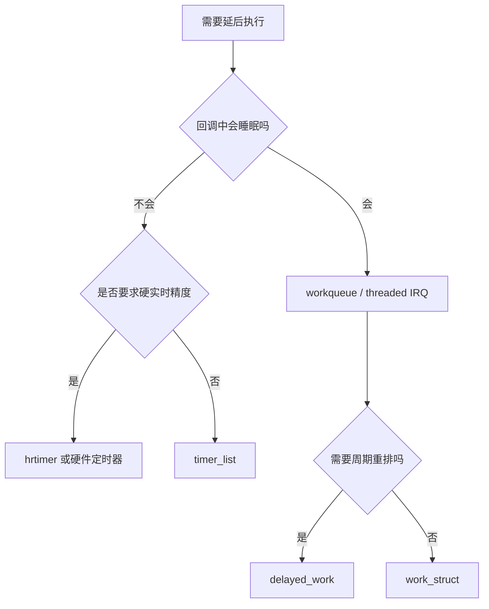
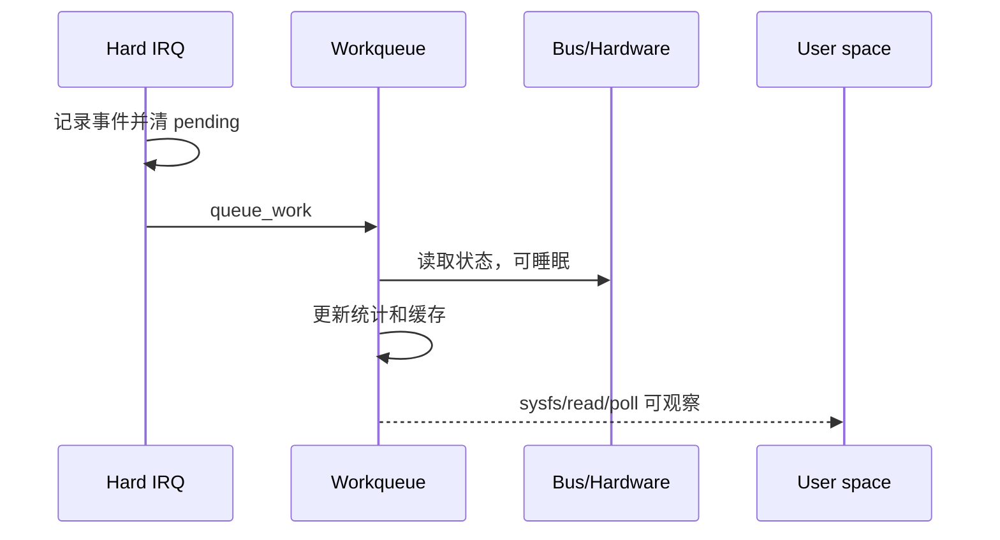
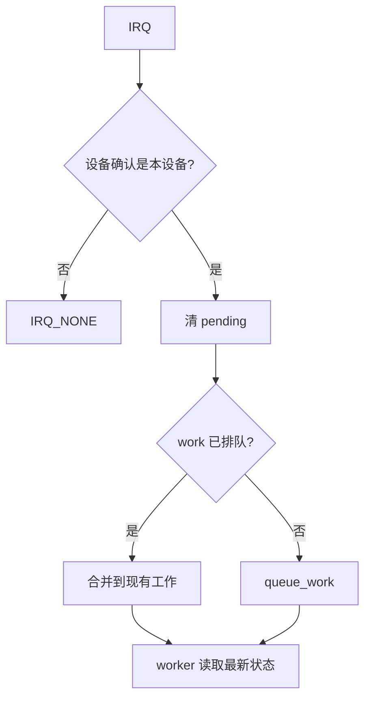
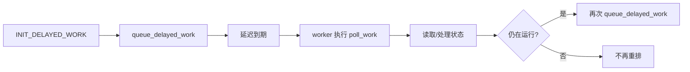
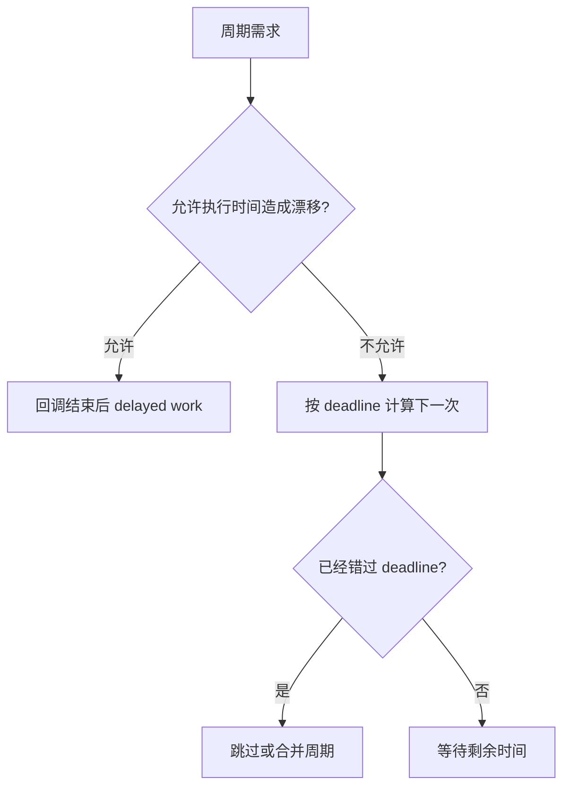
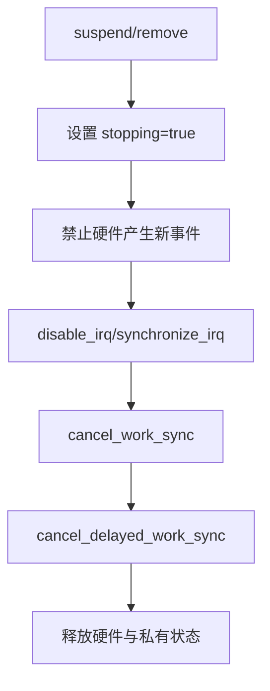
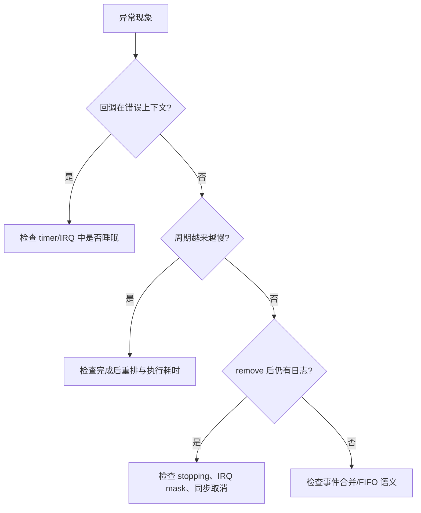
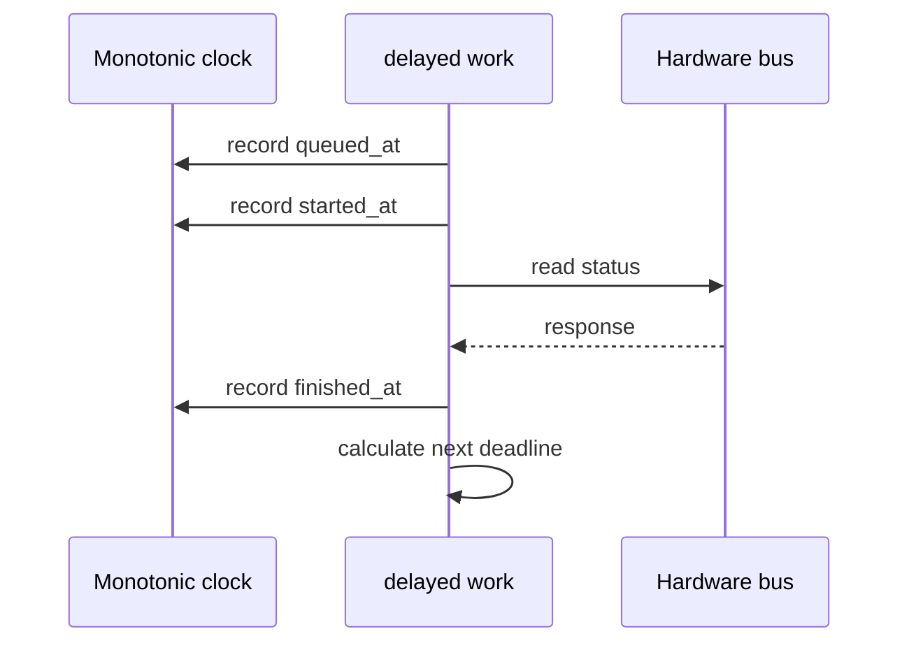
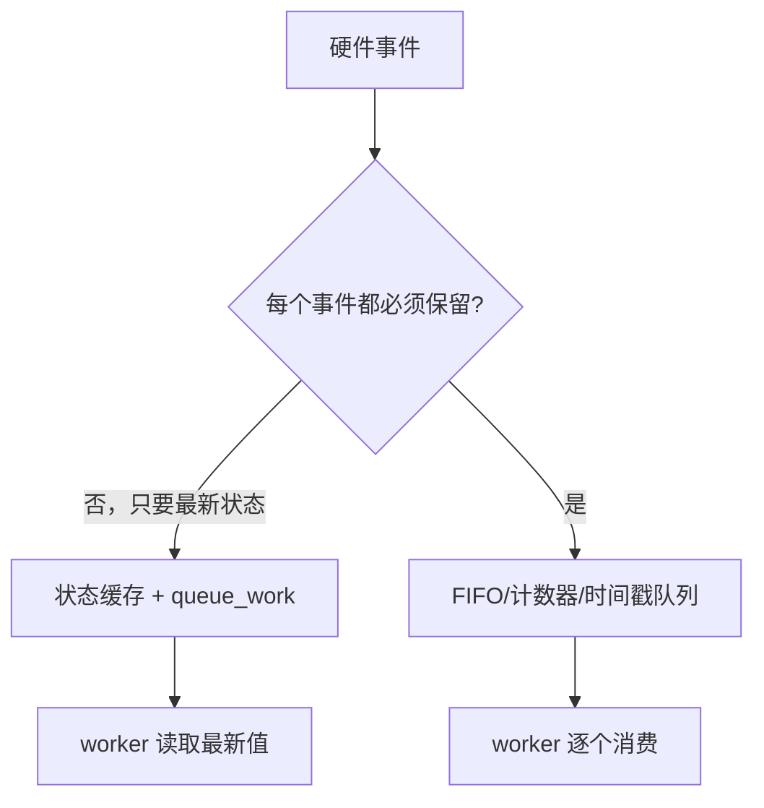

定时器和 workqueue 不是“延时函数的不同写法”。它们解决的是两个先后问题：什么时候再次执行，以及在哪种执行上下文执行。一个中断处理函数需要读取可能睡眠的 I2C 传感器，一个驱动需要每秒刷新状态，一个设备 remove 时必须停止尚未执行的任务，这些场景都要求先回答上下文和生命周期问题。

本篇完成一个小实验：收到硬件事件后只在 IRQ 中记录事实，把耗时处理交给 workqueue；同时用 delayed work 周期性读取状态；最后在 suspend/remove 时安全取消全部任务。

## 1. 先确定任务发生在哪个上下文

先把动作按“能否睡眠、是否要求精确时间、是否需要周期执行”分类。不要看到延迟需求就直接创建 timer。

| 任务 | 推荐机制 | 原因 |
|---|---|---|
| 硬 IRQ 中只记录时间/置位 | hard IRQ handler | 最短路径，不睡眠 |
| IRQ 后读取 I2C/SPI/GPIO 扩展器 | threaded IRQ 或 workqueue | 需要睡眠的总线访问 |
| 延后一次执行且允许睡眠 | `work_struct` | 由 worker 在线程上下文执行 |
| 延后一次执行并可再次安排 | `delayed_work` | timer 到期后进入 workqueue |
| 很短、必须在原子上下文运行的时间动作 | `timer_list` | 回调仍不能睡眠 |
| 纳秒级硬件时间戳或波形 | hrtimer/硬件定时器 | 需要更高时间精度 |



先在驱动设计里写出每个回调的上下文约束。`timer_list` 回调属于原子上下文，不能调用会睡眠的 API、不能拿 mutex，也不能访问需要总线传输的 GPIO 扩展器。普通 workqueue worker 在线程上下文执行，可以睡眠，但不能假设它永远只在某一个 CPU 上运行。

```c
struct demo_task {
    struct work_struct event_work;
    struct delayed_work poll_work;
    struct timer_list raw_timer;
    struct mutex lock;
    bool stopping;
    u32 sample;
};
```

同一个状态可能同时被 IRQ、timer、worker 和用户态 sysfs 访问。先列出写者，再选择锁和原子变量；不要把 `volatile` 当并发保护。

## 2. 第一步：把中断事件移到可睡眠的 workqueue

假设设备 IRQ 到来后需要读取一个可能睡眠的状态寄存器，并更新用户态可读的计数。硬 IRQ 只确认事件、清除设备侧 pending 并排队工作。



```c
static irqreturn_t demo_irq(int irq, void *data)
{
    struct demo_task *task = data;

    if (!demo_irq_pending(task))
        return IRQ_NONE;
    demo_ack_irq(task);
    queue_work(system_wq, &task->event_work);
    return IRQ_HANDLED;
}

static void demo_event_work(struct work_struct *work)
{
    struct demo_task *task = container_of(work, struct demo_task,
                                          event_work);
    u32 sample;

    sample = demo_read_status(task);
    mutex_lock(&task->lock);
    task->sample = sample;
    mutex_unlock(&task->lock);
    wake_up_interruptible(&task->read_wq);
}
```

`queue_work()` 返回 false 时表示该 work 已经在队列中，不能因此假设事件丢失或重复。若多个硬件事件只需要“至少处理一次最新状态”，合并执行是合适的；若每个事件都不能丢失，就必须设计 FIFO 或计数器，不能只靠 work item 的 pending 位。



选择专用 workqueue 还是 `system_wq` 也要有理由：普通、短小、不需要隔离的任务可使用系统队列；可能长时间占用 worker、需要顺序保证或需要限制并发的设备，创建专用队列并说明 `max_active`、是否 unbound。

## 3. 第二步：用 delayed work 做周期任务，而不是在回调里忙等

周期读取适合 `delayed_work`：到期后由 timer 触发排队，真正的 work callback 在线程上下文运行。回调结束后根据设备状态重新安排下一次执行。



```c
static void demo_poll_work(struct work_struct *work)
{
    struct demo_task *task = container_of(to_delayed_work(work),
                                          struct demo_task, poll_work);
    u32 sample;

    if (READ_ONCE(task->stopping))
        return;

    sample = demo_read_status(task);
    mutex_lock(&task->lock);
    task->sample = sample;
    mutex_unlock(&task->lock);

    if (!READ_ONCE(task->stopping))
        queue_delayed_work(system_wq, &task->poll_work,
                           msecs_to_jiffies(1000));
}
```

周期任务有两个时间语义：固定间隔和完成后间隔。完成后重排会把总线读取耗时计入周期，适合“每次间隔至少 1 秒”；按绝对时间点重排可减少漂移，但要处理执行变慢、跳过周期和系统时间变化。先写清需求，再选实现。



不要在 timer 回调中 `msleep()`、不要用 `while` 轮询等待硬件 ready，也不要用 workqueue 递归立即重排制造忙循环。每次重排都应有有限的延迟、停止条件和异常计数。

## 4. 第三步：建立取消、suspend 和 remove 的退出协议

异步任务最容易出错的地方是退出。调用 `cancel_delayed_work()` 只保证尚未开始的任务被取消，已经在 worker 中运行的回调可能仍未结束；需要等待回调退出时使用同步版本。



```c
static void demo_stop(struct demo_task *task)
{
    WRITE_ONCE(task->stopping, true);
    demo_mask_device_irq(task);
    disable_irq(task->irq);
    synchronize_irq(task->irq);
    cancel_work_sync(&task->event_work);
    cancel_delayed_work_sync(&task->poll_work);
    del_timer_sync(&task->raw_timer);
}
```

调用顺序需要结合项目的 IRQ 和锁设计调整。尤其不要在持有某个 worker 必须获取的 mutex 时调用 `cancel_work_sync()`，否则可能形成自等待死锁；也不要让回调在 `stopping` 检查之后又重新排队一个新的 delayed work。

如果 timer/work 回调会重新排队，`stopping` 需要在每个重排点检查。硬件侧中断源也必须先关闭，否则 remove 在等待旧任务时仍会不断制造新任务。对共享 IRQ，先让设备停止产生中断，再同步 Linux handler，不能只依靠 `free_irq()`。

## 5. 第四步：板端实验、并发观察与故障定位

编写一个最小实验，让同一设备同时具备 IRQ work 和周期 delayed work。给每条路径打印单调递增计数、时间戳和当前停止状态，便于判断是事件丢失、周期漂移还是退出竞态。


```bash
# 从当前驱动实际日志或 debugfs 入口获取计数
dmesg -wT
cat /sys/<device-path>/event_count 2>/dev/null
cat /sys/<device-path>/poll_count 2>/dev/null

# 检查 workqueue 线程和计时状态；路径按内核配置调整
ps -ef | rg 'kworker'
cat /proc/interrupts
```

测试矩阵：

| 场景 | 预期 | 先看什么 |
|---|---|---|
| 单次 IRQ | 至少一次处理，计数语义明确 | IRQ 与 work 日志 |
| 连续 IRQ | 不丢或按文档合并 | FIFO/计数器而非 work 次数 |
| 周期读取 | 间隔符合定义，误差可解释 | 单调时间戳 |
| 设备响应慢 | worker 可睡眠但不忙等 | work 执行时长 |
| suspend | 不再产生用户态更新 | stopping、取消结果 |
| remove | 无回调访问释放对象 | `cancel_*_sync`、KASAN |



不要通过增加 worker 数量来掩盖设计问题。先确定任务是否真的可以并发；同一个硬件寄存器状态通常需要串行访问，而独立的统计任务才可能并行。锁、workqueue 属性和事件队列都应由硬件协议决定。

### 让时间基准可解释

周期任务的日志应使用单调时间，而不是用户可调整的墙上时间。记录开始执行、读取完成、下一次排队和回调返回四个时刻，就能区分调度延迟、总线访问耗时和重排策略造成的漂移。



建议在 debugfs 或临时日志中输出：

| 字段 | 含义 |
|---|---|
| `queued_at` | work 被安排的时间 |
| `started_at` | worker 真正开始执行的时间 |
| `finished_at` | 读取和状态更新完成的时间 |
| `next_at` | 下一次计划时间 |
| `overrun` | 本次是否已经错过目标周期 |

例如设置 1000 ms 周期时，如果总线访问耗时 30 ms，完成后重排通常意味着相邻 `started_at` 约相隔 1030 ms；按 deadline 重排则可能维持约 1000 ms，但任务变慢时必须明确跳过、合并还是报警。没有日志时，开发者很容易把两种策略误认为同一种行为。

### 区分事件合并和事件不丢失

`queue_work()` 的 pending 语义适合“只关心最新状态”的设备。比如 IRQ 只表示“状态可能变了”，worker 读取一次最新寄存器即可。它不适合“每次事件都必须被消费”的计数器、按键或数据接收路径。



做实验时同时打印 IRQ 次数和 worker 次数。如果 IRQ 100 次、worker 20 次，不能直接判定丢中断；这可能是 20 次 work 执行各自合并了多次状态变化。要根据硬件语义检查状态缓存、计数器或 FIFO，而不是盲目把一个 work 改成多个 work。

如果延迟任务由用户态 `enabled` 属性控制，写 `0` 时必须先设置停止标志，再同步取消；写 `1` 时初始化状态后再排队。重复写 `1` 不应创建多个相同的周期链，重复写 `0` 也不应等待一个永远不存在的任务。

```c
static int demo_set_polling(struct demo_task *task, bool enable)
{
    mutex_lock(&task->lock);
    if (enable && !task->stopping) {
        queue_delayed_work(system_wq, &task->poll_work, 0);
    } else if (!enable) {
        task->stopping = true;
    }
    mutex_unlock(&task->lock);

    if (!enable)
        cancel_delayed_work_sync(&task->poll_work);
    return 0;
}

```

具体锁顺序要结合回调实现调整，尤其不要在回调等待该 mutex 时持锁调用同步取消。用 lockdep、KASAN 和重复 enable/disable 测试验证这条路径。

最终记录应包括内核配置、workqueue 类型、周期定义、事件计数语义、停止顺序和退出日志。后续换 CPU 数量、调整电源管理或增加用户态控制时，先对照这份记录，避免把调度变化误认为硬件故障。

在这个实验中，最重要的学习结果是能够回答三句话：回调能不能睡眠，任务会不会合并，设备退出时谁负责等待它结束。

若这三句话还不能从代码和日志中直接回答，就不要急着增加更多异步机制，先把当前任务的上下文和生命周期画清楚。

把每次实验的时间戳、计数和停止结果保存下来，才能比较不同调度策略的真实差异。

一次合格的记录至少包含：

- 任务初始化和第一次排队时间。
- 每个回调的开始、结束和下一次排队时间。
- IRQ 总数、work 执行次数以及 FIFO/状态合并次数。
- suspend、remove、取消同步和最后一条回调日志。

缺少其中任意一项，都可能让“任务没有执行”和“任务被合并”无法区分。

完成本篇后，把实验中的 `event_work` 和 `poll_work` 接到前面 platform driver 的 `probe/remove`。验收标准是：每个回调都能说清运行上下文；每次重排都有停止条件；退出后 IRQ、timer 和 workqueue 都不再访问私有数据。

把上下文约束、重排策略和停止顺序写进驱动评审记录，后续新增异步任务时继续沿用这三项检查。

验收时至少保留一次正常周期、一次高负载周期和一次 remove 过程日志。

记录回调开始、完成、重排和取消的单调时间戳。

这样才能区分调度延迟、总线耗时与退出等待。

若出现周期漂移，先比较 queued_at、started_at 与 finished_at。

若退出超时，先检查是否有回调再次重排。

测试记录还应说明使用的是 system workqueue 还是专用 workqueue。

若创建专用队列，应记录并发上限和是否允许跨 CPU 执行。

这些参数会影响高负载下的排队延迟。

不要用提高并发上限掩盖慢速硬件访问。

先测量单次回调的最长执行时间。

再用实测结果确定周期预算。

再决定周期是否需要调整。

> 🏷️ 标签：Linux BSP、timer、workqueue、delayed work、IRQ、异步任务、生命周期
