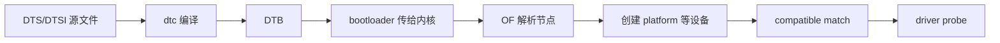

第 6 篇手工注册了一个 `platform_device`，并把名为 `demo-registers` 的资源交给 `probe()`。真实 RV1126 板上的外设不应在每个模块里重复这样写：寄存器地址、IRQ、引脚复用和板级连线属于硬件描述，驱动只是消费描述并实现行为。设备树正是把这份描述交给内核的格式。

设备树不是 C 头文件，也不是内核启动后任意修改的配置字典。DTS 是人可读的源文件，DTSI 是供多个 DTS 包含的片段，DTB 是编译后由 bootloader 传给内核的二进制树。Linux 在早期启动时解析 DTB，依照节点创建设备；platform driver 随后用 `compatible` 找到应当处理它的节点。本篇先把语言、构建和观察方法建立起来，不在尚未确认的 RV1126 DTB 上添加 LED 节点或 Overlay。

## 1. 从一棵 RV1126 DTS 看基本语法

仓库中已有 `docs/articles/video-audio/src/rv1126-alientek-800p.dts`。它的开头包含两个 DTSI，并在根节点声明板型和兼容字符串：

```dts
/dts-v1/;
#include "rv1126.dtsi"
#include "rv1126-alientek.dtsi"

/ {
    model = "Rockchip RV1126 EVB DDR3 V13 Board";
    compatible = "rockchip,rv1126-evb-ddr3-v13", "rockchip,rv1126";

    chosen {
        bootargs = "...";
    };
};
```

`/dts-v1/;` 声明语法版本。`/` 是根节点；大括号中的 `model`、`compatible`、`bootargs` 是属性，属性以分号结束。一个节点的名字可带 `@unit-address`，例如 `camera@3c`；`@` 后的单元地址通常与该节点的 `reg` 属性相对应。DTSI 不是特殊的运行时对象，只是预处理包含的源文件习惯：SoC 共用节点往往放在 `rv1126.dtsi`，某块板的电源、外设启用和连线放在板级 DTS/DTSI。

根节点里的两个 `compatible` 字符串由具体到通用排列。内核可先寻找最具体的板级支持，找不到再退到 `rockchip,rv1126` 这一较通用的兼容项。名称只是阅读线索，真正供驱动匹配的稳定契约通常是 binding 规定的 `compatible` 字符串，不能为了让它“看起来像自己的项目”随意改名。

### 1.1 标签和 phandle 让节点能相互引用

设备树不是平铺的键值表。一条设备通常要引用 GPIO 控制器、时钟控制器、调压器或 pinctrl 状态。DTS 用标签给节点一个可引用名字，尖括号中的 `&label` 是编译后 phandle 的源级写法。样本中的片段很典型：

```dts
&i2c1 {
    status = "okay";

    ov5640: camera@3c {
        compatible = "ovti,ov5640";
        reg = <0x3c>;
        pwdn-gpios = <&gpio2 RK_PA6 GPIO_ACTIVE_HIGH>;
        pinctrl-names = "default";
        pinctrl-0 = <&cifm0_dvp_ctl>;
    };
};
```

`&i2c1` 不是创建第二个 I2C 控制器，而是打开 DTSI 中已有的 `i2c1` 节点并补充属性。`ov5640:` 是给相机节点定义标签；同一节点的 `camera@3c` 是节点名和单元地址。`pwdn-gpios` 的三个 cell 表达 GPIO controller、该 controller 定义的引脚标识和逻辑有效电平；`pinctrl-0` 则引用一个 pinctrl 状态。它们的 cell 数、参数含义以及属性名都由相应 binding 定义，不能只凭其他属性的外观照抄。

本例的 `RK_PA6`、`cifm0_dvp_ctl` 和相机地址来自该 RV1126 样本，不能移用为 LED 值。第 4 篇的 LED 实验正是先要求原理图与实际 DTS 同时证明网络和复用状态；第 8 篇才会在确认 binding 后把 LED 交给 DT platform 驱动。

## 2. 五个经常同时出现的属性

初读 DTS 时，可以先问“这条属性向内核说明什么”，而不是背诵所有名字。

`compatible` 说明设备型号或协议族，是驱动 OF 匹配的首要线索。`reg` 描述设备在父总线上的地址：在 I2C 节点下它是从设备地址 `0x3c`，在有 `#address-cells`、`#size-cells` 的 MMIO 总线下通常是一组起始地址和长度。相同的拼写并不承诺相同单位，父节点决定 cell 的解释方式。

`interrupts` 描述设备产生中断的方式和参数，具体格式由 interrupt parent 或 binding 决定。`status = "okay"` 通常启用节点，`"disabled"` 则让内核忽略它；未写 status 时的默认行为应以 binding 和节点来源为准。`pinctrl-names` 与 `pinctrl-0` 把设备在 `default`、`sleep` 等状态下需要的引脚复用、电气配置关联起来。GPIO 属性、时钟属性和供电属性也遵循同一原则：属性名相似不等于参数可互换。



这张图和第 6 篇的手工注册实验是同一条路径的两个入口。DTB 负责提供 device 与资源，driver 的 `probe()` 仍是开始访问设备的地方。

## 3. 从 DTS 构建到 DTB

内核树中的 DTS 通常在 `arch/arm/boot/dts/` 或 `arch/arm64/boot/dts/` 下。RV1126 厂商 SDK 的常见场景是 ARM 32 位，但目录、目标名和顶层构建脚本以实际 SDK 为准。先确认正在运行镜像对应的源树和输出目录，然后在内核源码根执行与当前板 DTS 文件名一致的目标，例如：

```sh
make O="$KERNEL_BUILD" ARCH=arm CROSS_COMPILE="$CROSS_COMPILE" \
  rockchip/rv1126-alientek-800p.dtb
```

这个命令只有在当前内核树确实包含 `arch/arm/boot/dts/rockchip/rv1126-alientek-800p.dts` 及其被包含文件时才成立。仓库保存的 DTS 样本用于阅读，并不证明你的 SDK 使用同名文件。可先在 SDK 内核树中定位实际文件，再把目标替换为相应的相对路径：

```sh
rg --files arch/arm/boot/dts | rg 'rv1126.*\.dts$'
```

成功后，DTB 位于输出树对应的 `arch/arm/boot/dts/` 子目录。`dtc` 是编译器，Kbuild 在构建中负责调用它和准备 include 路径；直接运行 `dtc -I dts -O dtb` 只适合已经完整提供 DTSI 搜索路径和宏定义的独立实验。对内核 DTS，优先用内核 make 目标，得到的依赖和预处理条件才与内核构建一致。

如果想把 DTB 展开成便于阅读的 DTS，可用：

```sh
dtc -I dtb -O dts -o decoded.dts \
  "$KERNEL_BUILD/arch/arm/boot/dts/rockchip/<actual-board>.dtb"
```

反编译结果适合检查编译后实际包含的节点和属性，但标签通常已经变成 phandle 数值，注释和源文件层次也不再存在。因此修改仍应回到原 DTS/DTSI，而不是把反编译文本当作权威源。

## 4. 部署前先找到启动者实际使用的 DTB

把新 DTB 复制到任意 `/boot` 目录并不一定影响启动。RV1126 SDK 可能由 U-Boot、Android/AVB 流程、Rockchip 打包镜像或其他板级机制装载 DTB；分区名、镜像名称和签名要求是 SDK 特定事项。先从当前系统和启动日志取得证据：

```sh
cat /proc/cmdline
dmesg | grep -i -E 'device tree|fdt|dtb|Machine model'
cat /sys/firmware/devicetree/base/model 2>/dev/null; echo
tr '\0' '\n' < /sys/firmware/devicetree/base/compatible
```

`/sys/firmware/devicetree/base` 是内核导出的运行中设备树。`model` 与 `compatible` 能确认内核收到的是哪一类树，却不总会告诉你磁盘上原始 DTB 文件的路径。应把它与 SDK 的打包脚本、U-Boot 环境或烧录记录对应起来，再部署重新构建的 DTB。没有板端和 SDK 证据时，不应宣称某个 `dd`、`rkdeveloptool` 或文件复制命令可用于所有 RV1126 镜像。

部署并重启后，先检查运行树而不是只相信主机端的构建时间：

```sh
dtc -I fs -O dts -o running-tree.dts /sys/firmware/devicetree/base
grep -n -A8 -B2 '<chosen-node-or-compatible>' running-tree.dts
```

`dtc -I fs` 从 sysfs 的目录和二进制属性读取 live tree。属性值可能含 NUL 或二进制 cell，不能一概用 `cat` 解释；文本字符串可用 `tr '\0' '\n'` 查看，数值属性则应由 `dtc` 反编译或用理解 cell 宽度的工具检查。这个对照避免了一类常见误判：主机上改对了 DTS，却烧录了另一份 DTB，或 bootloader 实际加载了另一分区中的树。

## 5. 让设备树为下一篇准备资源

现在已经可以把第 6 篇的概念换成清楚的来源关系：DTS 节点的 `compatible` 对应 driver 的 `of_match_table`，`reg`、`interrupts`、GPIO 和 pinctrl 属性属于 device 的硬件描述，内核解析 DTB 后为需要的总线设备组织这些信息。不是每个节点都自动生成同一种 platform device，具体由内核的 OF 规则和父总线决定；对片上 MMIO 外设，platform 是最常见的结果。

下一篇会选择一只已经由原理图和 DTS 核实的 LED，写出它的 binding 风格节点并让 platform driver 在 `probe()` 中取得资源。那时再讨论 Overlay 是否受当前 bootloader、内核配置和 base DTB 支持；本篇只建立静态 DTS/DTSI、DTB 构建和 live-tree 检查这条可靠路径。

## 6. 参考资料

- Devicetree Specification, [Release v0.4](https://devicetree-specification.readthedocs.io/en/v0.4/)，尤其是节点、属性、phandle 与标准属性的定义。
- Linux Kernel Documentation, [DeviceTree usage model](https://docs.kernel.org/6.12/devicetree/usage-model.html) 与 [Writing Devicetree Bindings](https://docs.kernel.org/6.12/devicetree/bindings/writing-bindings.html)。
- Linux kernel stable source, [scripts/dtc/ (v6.12)](https://git.kernel.org/pub/scm/linux/kernel/git/stable/linux.git/tree/scripts/dtc?h=v6.12) 与 [arch/arm/boot/dts/ (v6.12)](https://git.kernel.org/pub/scm/linux/kernel/git/stable/linux.git/tree/arch/arm/boot/dts?h=v6.12)。
- 本项目 RV1126 DTS 样本，[rv1126-alientek-800p.dts](/D:/EEandEdgeAI/.worktrees/linux-driver-learning-path/docs/articles/video-audio/src/rv1126-alientek-800p.dts)，其中的 camera GPIO/pinctrl 属性仅用于语法解读。
- EmbedFire, [Linux 设备树](https://doc.embedfire.com/linux/rk356x/driver/zh/latest/linux_driver/base_device_tree.html)，用于课程编排参考。
