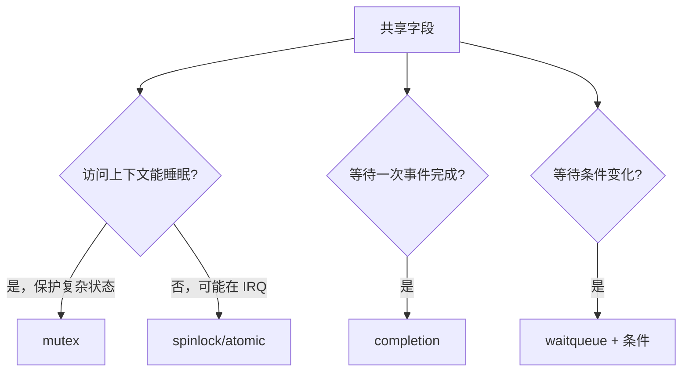
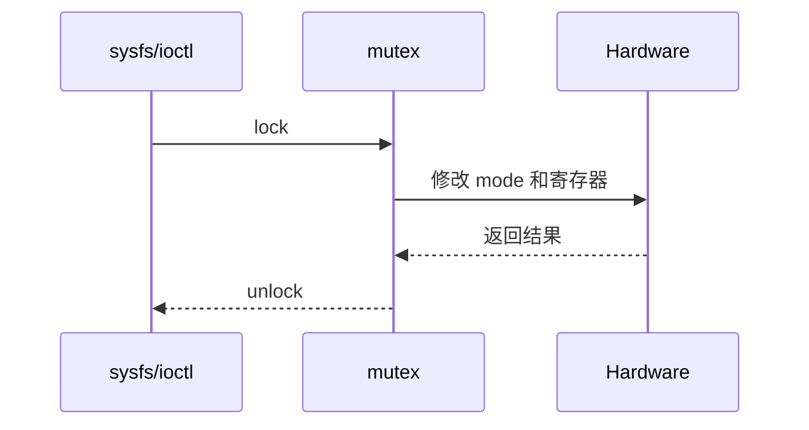
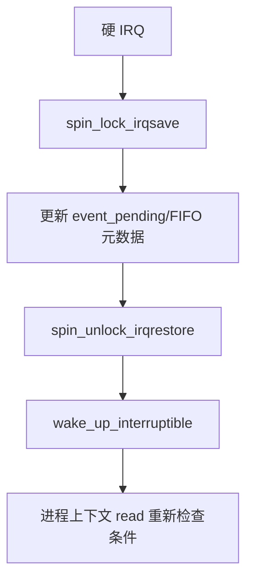
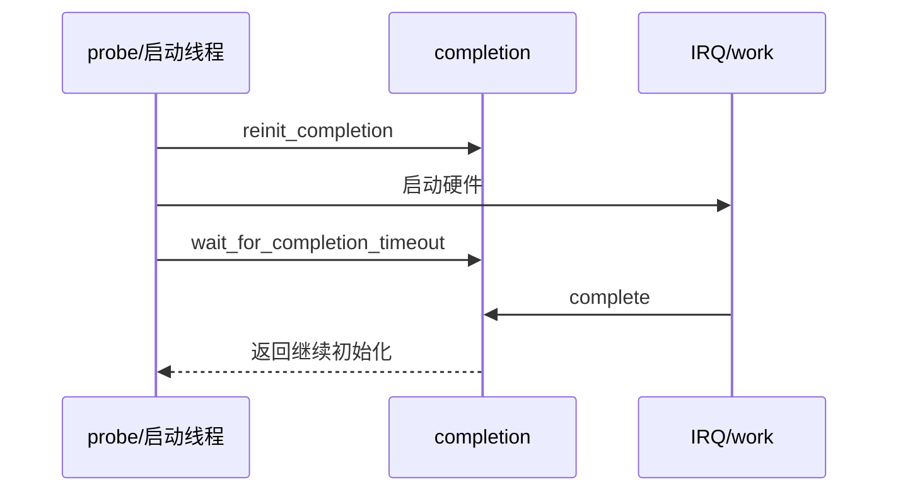
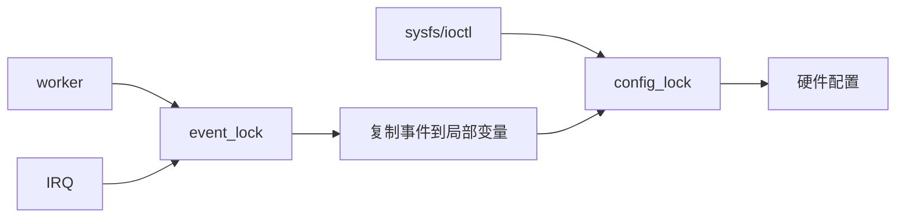
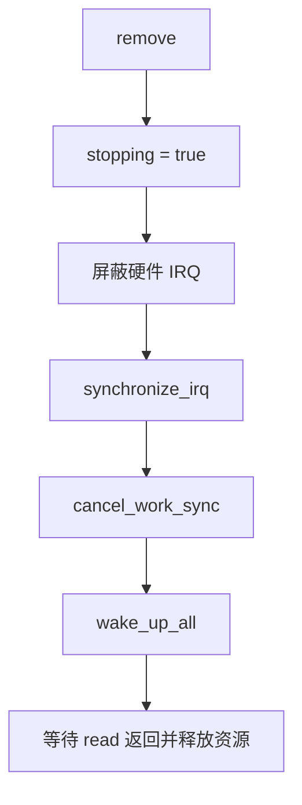
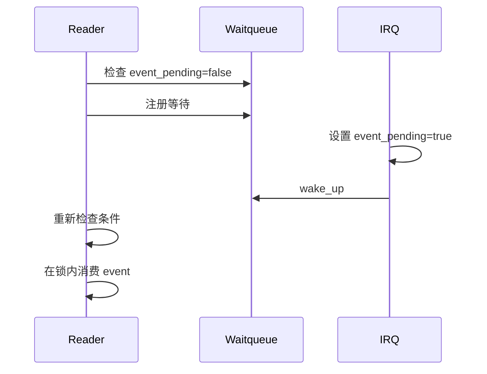
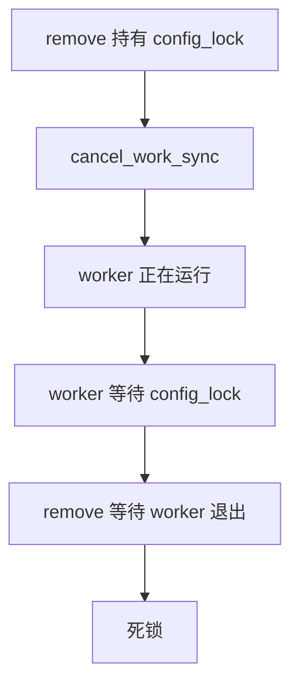

同步设计先定义共享数据及其不变量，再选择原语。进程上下文中的长临界区通常使用 mutex；与硬中断共享的短状态使用 spinlock；独立计数/标志可使用 atomic，但 atomic 不会自动保护复合状态；一次性硬件就绪适合 completion；等待持续条件和事件队列使用 waitqueue。

本篇用“用户配置 + IRQ 事件 + workqueue 状态 + 启动 ready”一个对象贯穿。每把锁都必须说明保护字段、可用上下文、锁顺序和 remove 时如何让等待者退出。

## 一、从共享状态和执行上下文定义不变量

在写锁之前先列出对象。假设设备私有结构如下：

```c
struct sync_demo {
    struct mutex config_lock;
    spinlock_t event_lock;
    wait_queue_head_t read_wq;
    struct completion hw_ready;
    atomic_t irq_count;
    bool stopping;
    bool event_pending;
    u32 mode;
    u32 status;
};
```

每个字段的访问者和上下文不同：

| 数据 | 访问者 | 典型上下文 | 需要的保护 |
|---|---|---|---|
| `mode` | sysfs、ioctl、worker | 进程/worker，可睡眠 | mutex |
| `event_pending` | IRQ、read、poll | IRQ 与进程 | spinlock 或原子状态 |
| `status` | worker、read | 可睡眠进程 | mutex 或序列化快照 |
| `irq_count` | IRQ、诊断 | IRQ/进程 | atomic 或统计专用 API |
| `hw_ready` | probe、IRQ/worker | 等待者可睡眠 | completion |
| `stopping` | remove、所有回调 | 多种上下文 | 规则清楚的 READ_ONCE/锁 |



不要用一个“大锁”把所有字段都包住。大锁可能让硬 IRQ 等待可睡眠锁，也会把不相关的快速统计和慢速总线访问串行化。先按上下文划分，再决定锁的粒度。

## 二、用 mutex 保护可睡眠配置事务

`mutex` 适合保护会睡眠、执行时间不可预测或需要保持一致性的配置事务。sysfs store、ioctl 和 worker 都可在进程上下文执行，可以用同一把 mutex 保护 `mode` 与相关硬件动作。



```c
static int sync_demo_set_mode(struct sync_demo *demo, u32 mode)
{
    int ret;

    if (!sync_mode_valid(mode))
        return -EINVAL;

    mutex_lock(&demo->config_lock);
    if (demo->stopping) {
        ret = -ENODEV;
    } else {
        ret = sync_hw_set_mode(demo, mode);
        if (!ret)
            demo->mode = mode;
    }
    mutex_unlock(&demo->config_lock);
    return ret;
}
```

锁住后调用可能睡眠的 I2C/SPI 访问是允许的，但要确认不会在同一调用链中再次请求同一把不可重入 mutex。sysfs `show()` 也要读取一致快照，不能一半在锁内、一半在锁外造成字段组合不可能出现。

常见错误是使用 spinlock 保护整个寄存器访问，因为“驱动需要快”。如果寄存器访问可能睡眠，spinlock 会导致警告甚至死锁；如果只是保护一个已经读到内核内存的短状态，才考虑把硬件访问移出自旋锁。

## 三、用 spinlock、atomic 与 waitqueue 连接 IRQ 和进程

硬 IRQ 需要在不睡眠的前提下更新事件状态。自旋锁只保护短临界区，拿锁后不能调用 mutex、`copy_to_user()`、`msleep()` 或可能访问慢速总线的函数。



```c
static irqreturn_t sync_demo_irq(int irq, void *data)
{
    struct sync_demo *demo = data;
    unsigned long flags;

    atomic_inc(&demo->irq_count);
    spin_lock_irqsave(&demo->event_lock, flags);
    demo->event_pending = true;
    spin_unlock_irqrestore(&demo->event_lock, flags);
    wake_up_interruptible(&demo->read_wq);
    return IRQ_HANDLED;
}
```

`atomic_t` 只保证单个计数或状态操作的原子性，不会自动保护多个字段之间的关系。如果需要同时更新 `event_pending` 和 FIFO head/tail，使用合适的锁或无锁队列算法，不能把每个字段分别改成 atomic 就认为整体一致。

阻塞 read 的正确写法是等待条件，而不是等待一个通知次数：

```c
static ssize_t sync_demo_read(struct file *file, char __user *buf,
                              size_t count, loff_t *ppos)
{
    struct sync_demo *demo = file->private_data;
    int ret;

    ret = wait_event_interruptible(demo->read_wq,
                                   READ_ONCE(demo->event_pending) ||
                                   READ_ONCE(demo->stopping));
    if (ret)
        return ret;
    if (READ_ONCE(demo->stopping))
        return -ENODEV;
    return sync_demo_copy_event(demo, buf, count);
}
```

waitqueue 可能被虚假唤醒，因此条件必须在返回后重新检查；事件标志的清除要与事件消费在同一个同步保护下完成。若用 poll/epoll，也应返回同一条件，不能另写一套“看起来可读”的判断。

## 四、用 completion 表达一次性完成而非持续状态

设备上电后等待 firmware、PLL 或外设发送一次 ready 信号，适合 `completion`。它表达的是“某件一次性事件完成”，不是通用互斥锁，也不适合代替持续状态条件。



```c
static int sync_demo_wait_ready(struct sync_demo *demo)
{
    unsigned long timeout;

    reinit_completion(&demo->hw_ready);
    sync_hw_start(demo);
    timeout = wait_for_completion_timeout(&demo->hw_ready,
                                          msecs_to_jiffies(500));
    if (!timeout)
        return -ETIMEDOUT;
    return 0;
}

static void sync_demo_ready_event(struct sync_demo *demo)
{
    complete(&demo->hw_ready);
}
```

必须在启动硬件前重置 completion，避免上一次使用留下的完成状态；等待必须有超时和退出错误。若同一设备可能多轮启动，要定义一轮 completion 对应哪个 generation，不能让旧 IRQ 完成新一轮等待。

## 五、验证锁顺序、内存可见性和退出路径

先画锁顺序图。假设配置路径持有 `config_lock` 后访问硬件，IRQ 只持有 `event_lock`；worker 可能先取得 event 状态再进入 config。必须统一顺序，避免 A 等 B、B 等 A。



不要在持有 `event_lock` 时等待 `config_lock`，也不要把 worker 的慢速总线访问放进 `event_lock`。可以在自旋锁内复制必要字段到局部变量，释放后再用 mutex 完成慢操作。

退出时先禁止新事件，再同步所有生产者和消费者：



```bash
# 开发板上开启内核并发检查能力时使用，配置按当前内核确认
cat /proc/lockdep_stats 2>/dev/null
dmesg -T | rg -i 'lockdep|deadlock|sleeping function|held lock'

# 同时制造多个读写者和硬件事件
for i in 1 2 3 4; do <test-program> --loop 1000 & done
wait
```

回归矩阵应包含单线程、多个进程、IRQ 与 worker 同时运行、超时、信号中断等待、suspend 和 driver unbind。观察不仅是“没有崩溃”，还包括 event 次数、配置最终值、错误码和退出时是否还有回调。

| 表现 | 先检查 | 常见错误 |
|---|---|---|
| lockdep 报 sleeping in atomic | 调用上下文与锁类型 | IRQ 中拿 mutex 或访问慢速总线 |
| 偶发状态不一致 | 字段访问者、锁覆盖范围 | 只给单字段加 atomic |
| read 永久阻塞 | wait 条件、wakeup、stopping | 只唤醒不设置条件 |
| ready 等待超时 | completion generation、IRQ | 未 clear pending 或先后顺序错误 |
| remove 偶发崩溃 | IRQ/work/read 引用 | 释放对象早于同步退出 |
| 高负载下丢事件 | FIFO/计数器语义 | 用一个 bool 代替事件队列 |

### 先复现“通知到了但条件不成立”

waitqueue 的通知不是消息队列。一个进程可能在检查条件后、真正睡下前被唤醒；多个读者也可能同时被唤醒但只有一个能够消费事件。因此 `wait_event_interruptible()` 必须包含真实条件，醒来后还必须重新检查。



错误模式是：IRQ 只调用 `wake_up()`，read 被唤醒后无条件清 `event_pending`；这会导致另一个读者或后续事件被误消费。测试时启动两个读者，让 IRQ 快速产生一批事件，分别统计每个 reader 的消费数和总事件数。

### 再复现“同步取消造成锁等待”

假设 worker 回调需要 `config_lock`，remove 路径先持有 `config_lock` 再调用 `cancel_work_sync()`。如果 worker 已经运行并等待这把锁，remove 会等 worker，worker 又等 remove 释放锁，形成死锁。



安全做法通常是先设置 stopping、禁止新硬件事件、释放业务锁，再同步取消 worker；具体顺序必须结合回调能否自我重排和设备寄存器访问设计。若不能证明锁顺序，就用 lockdep 和一个可控的延时注入让竞态更容易发生。

```c
static void sync_demo_remove(struct platform_device *pdev)
{
    struct sync_demo *demo = platform_get_drvdata(pdev);

    WRITE_ONCE(demo->stopping, true);
    sync_hw_mask_irqs(demo);
    disable_irq(demo->irq);
    synchronize_irq(demo->irq);
    cancel_work_sync(&demo->event_work);
    wake_up_all(&demo->read_wq);
    /* 此处再注销用户接口和释放硬件资源。 */
}
```

### 通过压力测试而不是一次成功判断

准备一个测试程序同时执行以下动作：

1. 多线程读写 mode，随机插入合法和非法值。
2. 让硬件或模拟 IRQ 高频产生事件。
3. 让 worker 执行带延时的状态读取。
4. 在随机时刻停止事件源并执行 unbind。
5. 记录每次系统调用的 errno、事件序列和退出时间。

```bash
# 工具和参数按 rootfs 实际情况替换
taskset -c 0 <test-program> --writers 4 --readers 4 --events 10000
dmesg -T | rg -i 'lockdep|warning|BUG|Oops|timeout|deadlock'
cat /proc/interrupts
```

如果测试出现偶发错误，先判断是数据丢失、顺序不一致、退出超时还是内核告警。不同类别对应不同修复：丢失事件看 FIFO/计数器，顺序看锁和状态机，退出超时看同步取消，内核告警看上下文和锁类型。

### 把同步选择写成评审表

| 问题 | 本实验的答案 |
|---|---|
| 哪些代码可以睡眠 | sysfs/ioctl、worker、completion 等待 |
| 哪些代码不能睡眠 | 硬 IRQ、timer 回调、自旋锁临界区 |
| 哪些字段必须整体一致 | mode/status、FIFO head/tail、停止状态 |
| 哪些只是计数 | IRQ 次数、错误次数，可用 atomic |
| 谁唤醒等待者 | 事件生产者设置条件后调用 wakeup |
| 谁负责最后退出 | remove 关闭源并同步 IRQ/work/read |

把这张表与代码一起保存，后续增加 DMA、I2C 或字符设备接口时先更新访问者，再决定是否需要新锁。这样可以避免每加一个回调就随手再放一把 mutex。

一次完整验收还应保存：

- 并发测试的进程数、线程数和事件总量。
- lockdep、KASAN 或其他内核检查配置。
- 事件生产计数与消费计数的差异解释。
- 最长等待时间、超时 errno 和停止耗时。
- unbind 前后 IRQ、work 和用户接口的状态。

若某个数字无法解释，先修正实验记录，再修改同步原语。没有可比较的证据时，偶发问题很容易被一次“重启后正常”掩盖。

完成本篇的判断标准是：面对任意共享字段，你能指出所有读写者、每个读写者的上下文、保护它的原语、锁顺序和退出时的等待动作。把这五项写进驱动注释和测试记录，比再记住十个 API 名称更有价值。

提交前保留一次并发压力测试和 lockdep 输出，避免只凭单线程运行结果判断同步设计正确。

并发测试的事件总量、消费者总量和停止耗时都应能从日志中解释。

若计数不一致，先判断事件是否允许合并，再调整锁。

不要通过增加锁数量掩盖未定义的事件语义。

每次变更锁顺序后都重新运行并发和解绑测试。

压力测试应覆盖正常退出和信号中断。

还应覆盖两个读者同时消费一个事件。

若事件允许合并，记录合并规则。

若事件不能丢失，记录 FIFO 容量。

把超时和错误码纳入用户态回归。

这样并发问题才有可比较的边界。

所有结论都应关联到一次可重放的测试。

**参考资料**

- [Locking lessons](https://docs.kernel.org/locking/locktypes.html)
- [Atomic types](https://docs.kernel.org/core-api/wrappers/atomic_t.html)
- [Completions](https://docs.kernel.org/scheduler/completion.html)

## 六、小结

同步原语不是性能偏好，而是共享状态、执行上下文和等待语义的结果。Mutex、spinlock、atomic、completion 与 waitqueue 不能互相机械替换；可靠性来自明确的不变量、统一锁顺序、正确内存可见性，以及 remove 时所有持锁者和等待者最终收敛。

> 🏷️ 标签：Linux BSP、mutex、spinlock、atomic、completion、waitqueue、lockdep、并发
