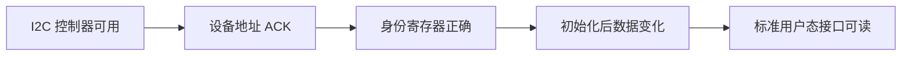
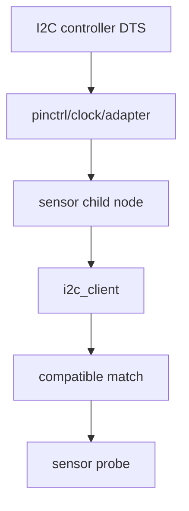
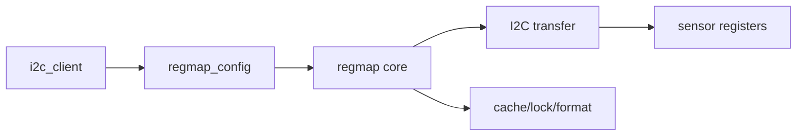
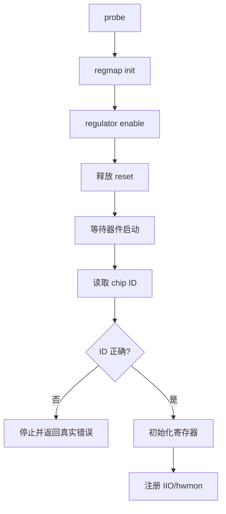
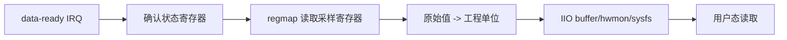
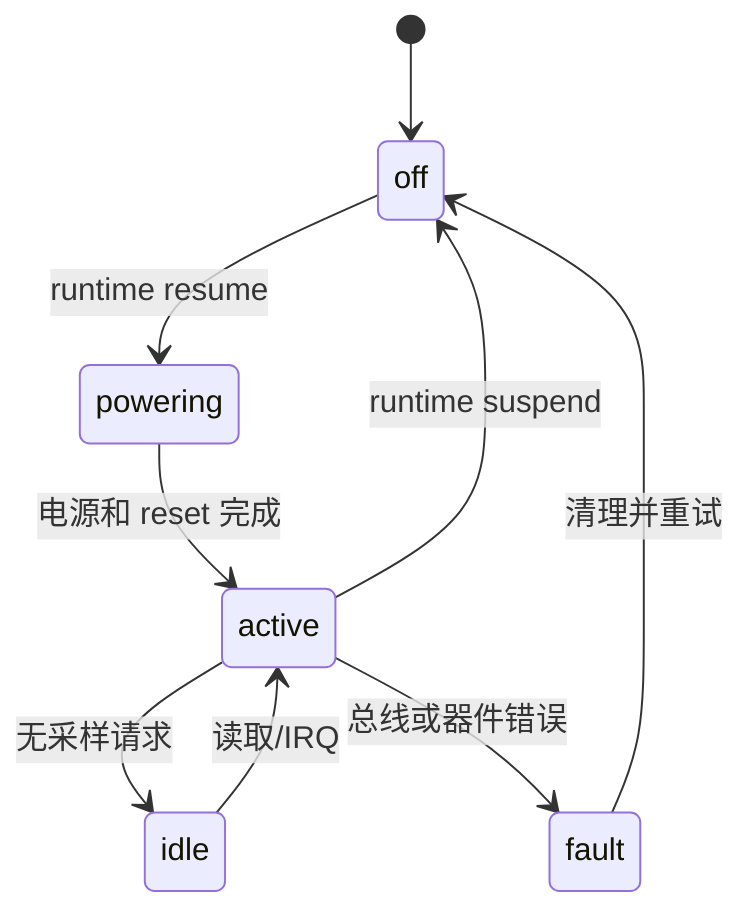
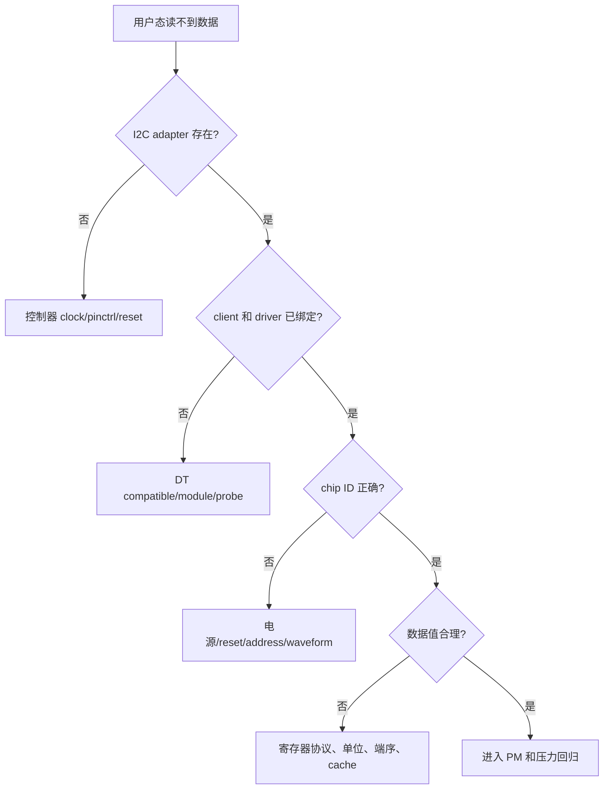
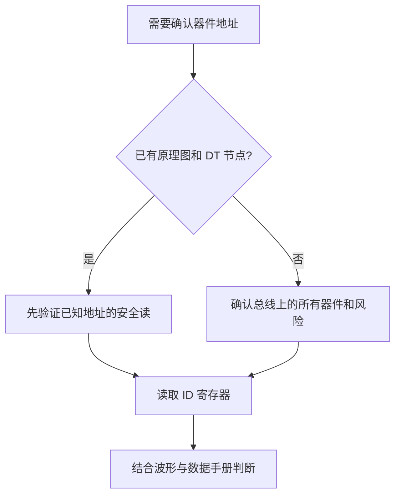
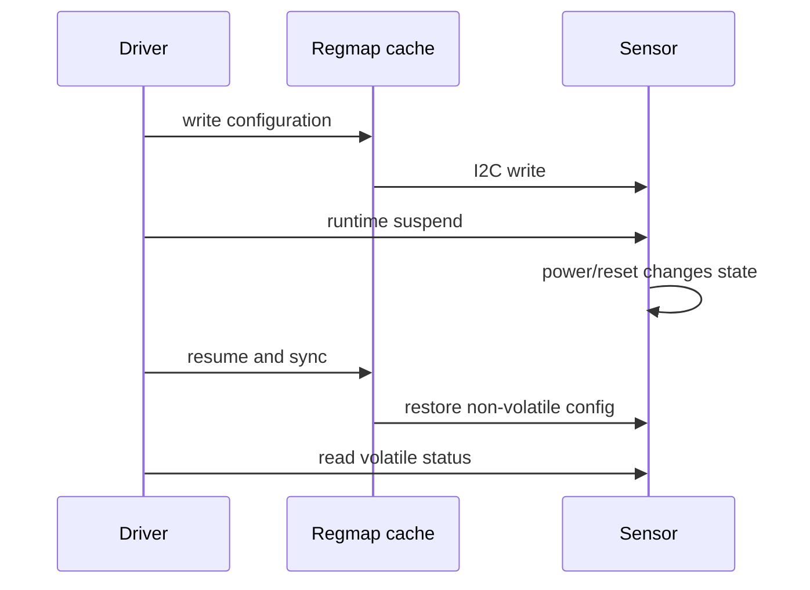

本篇完成一个明确任务：让板载 I2C 传感器被 Linux 发现，驱动能读到身份寄存器和一份有效数据，并能解释失败发生在电源、I2C 总线、地址、寄存器协议还是用户态接口哪一层。

传感器驱动不能从 `i2c_smbus_read_byte_data()` 开始。先确认原理图、电源、上拉、地址脚和复位时序，再确定 Device Tree 节点；regmap 只是把寄存器访问和缓存、锁、格式化能力组织起来，不会替代硬件验证。

## 1. 先确认器件连接和最小验收结果

准备传感器数据手册、原理图、当前 DTB、示波器或 I2C 分析仪。建立这张表：

| 项目 | 必须确认 | 证据 |
|---|---|---|
| I2C 控制器 | 节点、时钟、pinctrl、速率 | SoC binding、DTS |
| 7-bit 地址 | 地址脚/电阻决定的实际地址 | 数据手册、原理图、波形 |
| 供电 | I/O 电源、模拟电源、上电顺序 | 电源树、测试点 |
| 总线电气 | SDA/SCL 上拉、电压域、是否被拉住 | 原理图、示波器 |
| ID 寄存器 | 地址、宽度、期望值、端序 | 数据手册 |
| 数据路径 | 标准 IIO/hwmon 还是专有接口 | 产品需求 |

验收至少包含三层：



先保存基线：

```bash
dmesg -T | rg -i 'i2c|sensor|regmap|pinctrl|regulator' | tail -120
find /sys/bus/i2c/devices -maxdepth 1 -type l -printf '%f\n' | sort
find /sys/bus/iio/devices /sys/class/hwmon -maxdepth 2 -type f 2>/dev/null | head -80
```

不要直接对未知地址执行写入扫描。I2C 总线上有些地址对应 EEPROM、PMIC 或会对探测命令产生副作用的设备，先从原理图和已有 DTS 确认安全的观察方式。

## 2. 第一步：写 I2C 节点并证明总线已经连通

I2C 设备由控制器节点和子设备节点共同描述。设备节点的 `reg` 是 7-bit 从地址，不是传感器内部寄存器地址；这是初学者最容易混淆的两层地址。

```dts
&<i2c-controller> {
    status = "okay";
    clock-frequency = <400000>;
    pinctrl-names = "default", "sleep";
    pinctrl-0 = <&<i2c-default-pins>>;
    pinctrl-1 = <&<i2c-sleep-pins>>;

    sensor@<7bit-address> {
        compatible = "example,board-sensor";
        reg = <<7bit-address>>;
        vdd-supply = <&<sensor-vdd>>;
        reset-gpios = <&<gpio-controller> <line> GPIO_ACTIVE_LOW>;
        interrupt-parent = <&<interrupt-controller>>;
        interrupts = <<irq-specifier>>;
    };
};
```

`clock-frequency` 只能在控制器 binding 允许且硬件上拉满足时使用。传感器的 `vdd-supply`、reset GPIO 和 interrupt 属性名必须和驱动的 property API 以及 binding 一致。



部署后先证明控制器 adapter 存在，再看 child device 是否出现：

```bash
find /sys/class/i2c-adapter -maxdepth 1 -type l -printf '%f\n' 2>/dev/null
find /sys/bus/i2c/devices -maxdepth 1 -type l -printf '%f\n' | sort

DEV=<bus>-<7bit-address>
readlink -f /sys/bus/i2c/devices/$DEV/of_node 2>/dev/null
cat /sys/bus/i2c/devices/$DEV/modalias 2>/dev/null
readlink -f /sys/bus/i2c/devices/$DEV/driver 2>/dev/null
```

若 adapter 不存在，先修控制器 clock、pinctrl、reset 和 Kconfig；若 adapter 存在但 child 不存在，检查运行时 DTB 与 `status`；若 child 存在但 driver 不绑定，检查 `compatible`、模块和 match table。

总线“能看到设备”还不等于“寄存器协议正确”。在允许的开发环境中，可用分析仪观察地址、读写方向、ACK、重复起始和 NACK 位置；不要把没有 ACK 简化成“驱动代码错了”。

## 3. 第二步：用 regmap 实现寄存器协议和 probe

先根据数据手册确定寄存器地址宽度、值宽度、是否支持 auto-increment、哪些寄存器可缓存、哪些读取有副作用。随后配置 `regmap_config`，再通过 `devm_regmap_init_i2c()` 建立访问层。



```c
static const struct regmap_config sensor_regmap_config = {
    .reg_bits = 8,
    .val_bits = 8,
    .max_register = <max-register>,
    .cache_type = REGCACHE_RBTREE,
};

struct sensor_data {
    struct regmap *regmap;
    struct regulator *vdd;
    struct gpio_desc *reset;
    struct mutex lock;
    bool powered;
};
```

`reg_bits`、`val_bits`、端序和 cache 策略不能从传感器名称猜。身份寄存器、状态寄存器、FIFO、实时采样寄存器和清除状态寄存器通常不能用同一套 cache 规则；需要结合 volatile table、writeable table 和数据手册定义。

```c
static int sensor_probe(struct i2c_client *client)
{
    struct device *dev = &client->dev;
    struct sensor_data *data;
    unsigned int chip_id;
    int ret;

    data = devm_kzalloc(dev, sizeof(*data), GFP_KERNEL);
    if (!data)
        return -ENOMEM;

    data->regmap = devm_regmap_init_i2c(client, &sensor_regmap_config);
    if (IS_ERR(data->regmap))
        return dev_err_probe(dev, PTR_ERR(data->regmap), "init regmap\n");

    data->vdd = devm_regulator_get(dev, "vdd");
    if (IS_ERR(data->vdd))
        return dev_err_probe(dev, PTR_ERR(data->vdd), "get vdd\n");

    data->reset = devm_gpiod_get_optional(dev, "reset", GPIOD_OUT_HIGH);
    if (IS_ERR(data->reset))
        return dev_err_probe(dev, PTR_ERR(data->reset), "get reset\n");

    ret = sensor_power_on(data);
    if (ret)
        return ret;
    ret = regmap_read(data->regmap, SENSOR_REG_CHIP_ID, &chip_id);
    if (ret)
        return dev_err_probe(dev, ret, "read chip id\n");
    if (chip_id != SENSOR_EXPECTED_ID)
        return dev_err_probe(dev, -ENODEV, "unexpected chip id\n");
    return sensor_register_iio_or_hwmon(data);
}
```

probe 顺序体现了真实依赖：先建立 regmap，再开电源/复位，最后读身份寄存器和注册子系统。若 ID 读成 `0xff`、`0x00` 或返回 NACK，不要马上修改寄存器地址，先检查供电、reset、I2C 波形、地址和总线电压。



## 4. 第三步：读取数据、处理中断和电源管理

身份寄存器正确后，再读一个会随环境变化的测量寄存器。先用手册换算原始值，不要先接入复杂用户接口。若传感器支持 data-ready IRQ，可在 handler 中记录事件，在线程或 workqueue 中通过 regmap 读数据。

```c
static irqreturn_t sensor_irq_thread(int irq, void *data)
{
    struct sensor_data *sensor = data;
    unsigned int status;

    if (regmap_read(sensor->regmap, SENSOR_REG_STATUS, &status))
        return IRQ_HANDLED;
    if (!(status & SENSOR_STATUS_DATA_READY))
        return IRQ_HANDLED;
    return sensor_push_sample(sensor);
}
```



将数据寄存器标为 volatile 的理由是：读到的值来自外部硬件，不能让 cache 返回旧数据。反过来，稳定配置寄存器可以使用 cache 减少总线访问，但 suspend/resume 后要根据硬件是否丢失配置决定是否 `regcache_sync()`。



电源管理至少验证：

1. runtime suspend 时不会访问已关闭的 I2C 器件。
2. resume 后电源稳定、reset 已释放、必要配置已恢复。
3. IRQ wake 与传感器 data-ready 需求不会互相冲突。
4. 关闭 regulator 前，采样 work、buffer 和 IRQ 已停止。

## 5. 第四步：用总线波形和用户接口完成回归

先在内核侧保存身份读取和初始化日志，再验证标准接口：

```bash
dmesg -T | rg -i -C 4 'sensor|i2c|regmap|chip id|probe'
find /sys/bus/iio/devices -maxdepth 2 -type f -print 2>/dev/null | head -100
find /sys/class/hwmon -maxdepth 2 -type f -print 2>/dev/null | head -100

# 按实际接口选择读取命令
cat /sys/bus/iio/devices/iio:device<N>/name 2>/dev/null
cat /sys/class/hwmon/hwmon<N>/name 2>/dev/null
```



用示波器或 I2C 分析仪把以下事实对齐：启动时是否有器件 ACK，读 ID 的寄存器地址和返回值是否正确，初始化写入是否得到 ACK，数据读取时是否出现 NACK 或总线被拉低。软件日志应包含总线号、地址和寄存器，不要只打印“read failed”。

| 表现 | 优先检查 | 常见根因 |
|---|---|---|
| adapter 不存在 | 控制器 DT、clock、pinctrl、Kconfig | 控制器没有 probe |
| client 不存在 | 运行 DTB、7-bit `reg` | 节点未加载或地址写错 |
| 读 ID NACK | 地址、供电、reset、上拉 | 器件未上电或 bus 电平不对 |
| ID 返回固定全零/全一 | 电源、复位、端序、寄存器地址 | 设备未运行或协议理解错 |
| ID 正确但数据不变 | 初始化位、采样触发、cache | 数据寄存器不是 volatile/未启动 |
| suspend 后异常 | PM、regcache、IRQ | 配置丢失或访问已断电设备 |

完成本篇的学习验收：

1. 能区分 I2C 从地址和传感器内部寄存器地址。
2. 能从运行时 sysfs 证明 adapter、client 和 driver 的关系。
3. 能解释 regmap 的寄存器宽度、cache 和 volatile 选择。
4. 能用 chip ID、总线波形和标准用户接口证明数据路径。
5. 能在 runtime suspend/resume 后重复同一验证。

### 不把扫描工具当成第一步

开发板上常见的 `i2cdetect` 只能说明某个地址对特定探测操作作出响应，不能证明器件身份、寄存器协议或电源时序正确。对会在探测时改变状态的器件，不应直接使用通用扫描。



地址探测之前先确认总线上没有 EEPROM 写周期、PMIC 控制命令或需要特殊唤醒序列的器件。一个 ACK 只说明从设备在当前时刻响应了事务；它不等于地址配置、供电和寄存器读取全部正确。

### 验证 regmap cache 是否与硬件状态一致

先选择一个明确会因硬件复位丢失的配置寄存器和一个实时状态寄存器。修改配置后读回，执行 runtime suspend/resume，再读回并比较。若 cache 返回旧值而硬件已经复位，说明需要重新评估 cache 策略和 `regcache_sync()` 时机。



记录配置寄存器、实时寄存器和 ID 的类别，不要把所有寄存器都标成可缓存或不可缓存。读到实时数据不变时，先确认采样是否启动、数据寄存器是否 volatile，再判断是否是用户态读取路径问题。

### 用一次故障注入学习错误边界

在安全开发环境中逐个制造以下条件，每次只改变一个因素：

| 变化 | 预期观察 |
|---|---|
| 禁止 sensor regulator | probe 返回 defer 或电源错误 |
| 保持 reset | chip ID 读取失败或为默认值 |
| 改错 7-bit 地址 | client 不响应/无绑定 |
| 改错 ID 寄存器 | 总线成功但驱动拒绝设备 |
| 让数据寄存器保持 standby | ID 正确但数据不变化 |
| suspend 期间读数据 | 驱动阻止访问或恢复电源后读取 |

```bash
# 保存每次实验的环境与原始日志，路径按板端替换
cat /proc/cmdline
cat /sys/bus/i2c/devices/$DEV/uevent 2>/dev/null
dmesg -T | rg -i -C 5 'i2c|regmap|sensor|regulator|reset'
```

这组实验的目的不是让驱动“尽量容错”，而是让每种错误都能返回清晰的类别，帮助后续 platform、regulator 和 IIO 问题沿相同证据链定位。

保留原理图、最终 DTB、I2C 波形和驱动日志的对应关系，下一次换传感器或调整电源时仍可复用这份基线。

> 🏷️ 标签：Linux BSP、I2C、regmap、sensor driver、IIO、hwmon、runtime PM、chip ID

把 chip ID 读取、总线波形、regmap 配置和 PM 回归记录放在同一份传感器 bring-up 资料中。

这样下一次更换地址、供电或寄存器 cache 策略时可以直接比较。

日志中还应保存总线号、7-bit 地址、寄存器和 errno。

同时保存电源、reset 和 SDA/SCL 波形的状态。

传感器数据还要注明原始值到工程单位的换算。
