UART 是硬件控制器；Linux `serial_core` 把控制器驱动统一成 uart_port/uart_driver；TTY 提供用户可见字符终端语义；console 从串口端口中选择启动/内核日志通道；termios 配置波特率、数据位和流控；高吞吐收发还可能使用 DMA。

本篇先建立 earlycon 到正式 console 的接管证据，再用独立 UART 完成 TTY 收发、IRQ/DMA、termios 和协议验证。产品二进制协议不得与异步 kernel console 日志共用同一端口。

## 一、从 UART hardware 到 serial_core、TTY 与 console

开始改设备树或驱动前，先把“健康状态”保存下来。

准备 USB 转串口工具、已知正常的板卡和一个能保存原始日志的终端程序。

确认转换器的 I/O 电平与开发板 UART 电平兼容。

TTL UART、RS-232 和 RS-485 的电气层不同，不能因为接口外形相似就直接相连。

三根最小连线是板端 TX 到转换器 RX、板端 RX 到转换器 TX，以及两端 GND。

只观察启动日志时可以暂时不连板端 RX。

要做交互和回环收发时，RX、TX 与 GND 都必须正确。

先把终端设置为当前健康系统使用的波特率、8 数据位、无校验和 1 停止位。

波特率不要凭印象填写。

从 U-Boot 环境、现有启动日志、/proc/cmdline 和同一套 SDK 的板级配置交叉确认。

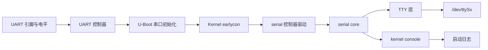

启动日志应被划分为几个可观察阶段，而不是混成一段“串口输出”。

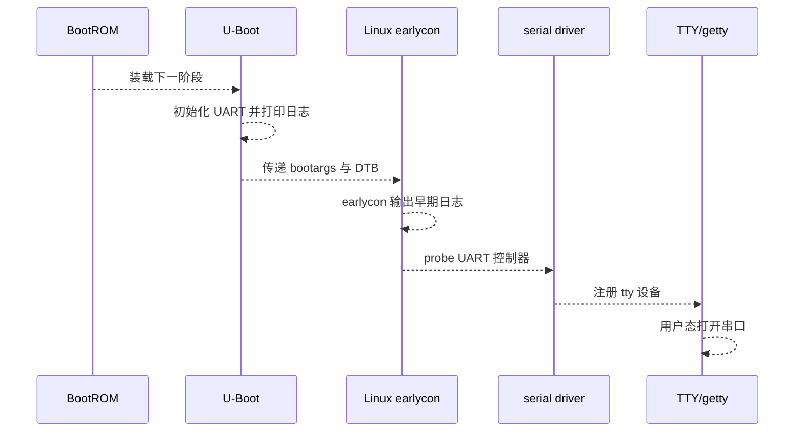

将一次完整冷启动日志保存为文件。

日志必须从上电前开始，到登录提示符或目标应用已启动为止。

以后改 DTS、U-Boot 环境变量、内核配置和驱动时，都用它作为对照基线。

在健康系统上执行以下命令并一并保存输出：

```bash
cat /proc/cmdline
cat /proc/consoles
dmesg -T | grep -Ei 'console|earlycon|serial|tty'
cat /proc/tty/driver/serial 2>/dev/null
ls -l /dev/ttyS* /dev/ttyFIQ* /dev/ttyAMA* 2>/dev/null
```

/proc/cmdline 表示 U-Boot 传给内核的命令行，而不是设备树的完整内容。

/proc/consoles 表示内核当前已登记的 console。

/proc/tty/driver/serial 在相应 serial driver 支持时可显示端口、IRQ 和收发计数，是验证“端口确实被驱动接管”的重要线索。

/dev/ttyS* 的编号来自 serial core 注册顺序和设备树 alias 等因素。

因此不要把“DTS 里叫 uart2”直接等同于“Linux 一定是 ttyS2”。

应该从健康系统的实际输出反向记录映射关系。

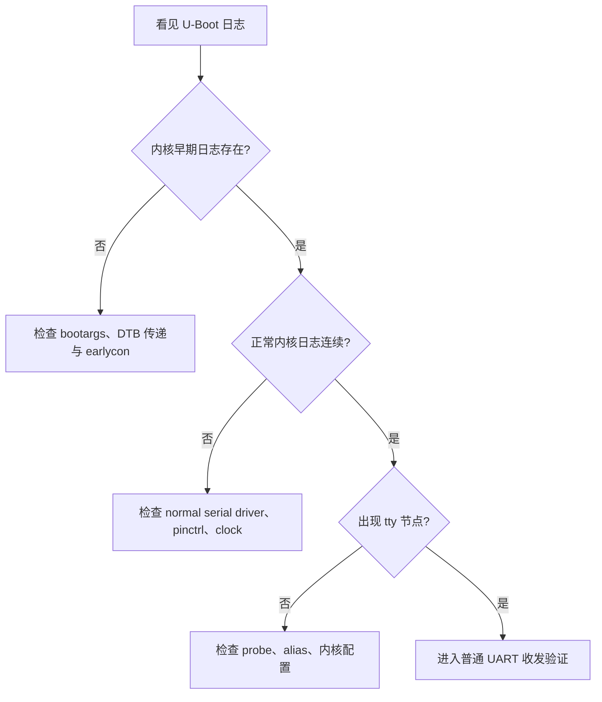

earlycon 的职责只是让正常 serial driver 注册前的一小段内核日志可见。

它使用的类型、MMIO 地址和参数必须来自当前 SoC 的内核实现与实际启动配置。

不要从其他芯片的资料中复制一个地址。

早期日志存在但 normal console 在稍后消失，通常仍然是驱动、时钟、复位或引脚复用问题。

console 参数的一般形式是 console=设备名,串口参数。

串口参数通常写成类似 1500000n8 的波特率、校验和数据位组合。

流控、电平和具体控制器能力仍需与硬件设计一致。

如果命令行里有多个 console 参数，先记录全部内容，不要急于删掉其中某一个。

不同内核版本对输出设备与 /dev/console 的选择细节可能不同，先用 /proc/consoles 观察当前行为。

### 先做一次物理层排除

串口乱码最常见的原因不是 TTY 子系统。

先依次检查 TX/RX 是否交叉、GND 是否共地、电平是否匹配、波特率是否一致。

接着检查引脚是否被 pinctrl 切为 UART 功能，而不是 GPIO、JTAG 或其他复用功能。

最后才检查字符格式、硬件流控和应用协议。

当日志完全没有字符时，可以用示波器观察板端 TX 是否有跳变。

当日志有跳变而终端没有显示时，重点检查转换器、电平、连线和终端配置。

当字符稳定但全部乱码时，优先怀疑波特率和时钟源。

当开始正常、运行一段时间后丢字，再进入 IRQ、FIFO、流控或 DMA 的排查。

## 二、用 Device Tree 描述 UART 并验证 probe

UART 控制器能否被 Linux 驱动使用，首先取决于设备树是否正确描述了控制器资源。

板级 DTS 通常不重新定义 SoC UART 的寄存器地址。

它更常见的任务是选择一个 SoC 已定义的 UART 节点，补齐 pinctrl、alias、状态和板级连接关系。

下例只展示结构。

节点名称、pinctrl 标签和控制器编号必须从当前 SDK 的 dtsi 文件确认。

```dts
&uartX {
    pinctrl-names = "default";
    pinctrl-0 = <&uartX_xfer>;
    status = "okay";
};

/ {
    aliases {
        serialN = &uartX;
    };
};
```

pinctrl-0 决定相关引脚被切换到 UART 收发功能。

status = okay 允许该节点参与设备匹配。

aliases 为设备树中的 serial 编号提供稳定线索，但最终 Linux 节点名仍应在运行系统上确认。

不要为了得到某个熟悉的 ttyS 编号而随意修改多个 alias。

这会影响 bootargs、getty 服务和既有应用的设备路径。

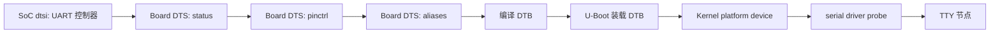

先在源码中找到目标 UART 的父定义和 pinctrl 定义。

可以使用下列命令定位候选节点。

```bash
rg -n "uartX|serialN|uartX_xfer" arch/arm*/boot/dts
rg -n "aliases[[:space:]]*\{" arch/arm*/boot/dts
rg -n "chosen[[:space:]]*\{" arch/arm*/boot/dts
```

将 uartX、serialN 替换成实际名称。

如果内核源码目录不是当前路径，也应在 SDK 中完成同样的搜索。

不要只改一个编译目录中生成的 DTS 或 DTB。

那类修改在下一次构建时会被覆盖，且很难被 Git 追踪。

完成板级 DTS 修改后，按 SDK 的正式入口重新构建设备树和镜像。

烧录或替换 DTB 后，先做冷启动，再确认实际运行的设备树中确有目标节点。

若系统带有 dtc，可以导出运行时设备树：

```bash
mkdir -p /tmp/live-dt
dtc -I fs -O dts /sys/firmware/devicetree/base > /tmp/live-dt/board-live.dts
grep -n -A12 -B3 "uart" /tmp/live-dt/board-live.dts | head -120
```

没有 dtc 时，仍可以从 /sys/firmware/devicetree/base 逐项读取。

设备树属性是二进制格式，显示时可能需要 hexdump -C 或 strings 辅助判断。

验证不应停在“DTB 已重新编译”。

真正的通过条件是内核启动时对该 UART 执行了 probe，并出现对应端口的日志或 TTY 节点。

```bash
dmesg -T | grep -Ei 'serial|ttyS|uart'
find /sys/bus/platform/devices -maxdepth 1 -type l | grep -i uart
find /sys/class/tty -maxdepth 1 -type l | grep -E '/tty(S|FIQ|AMA)'
cat /proc/tty/driver/serial 2>/dev/null
```

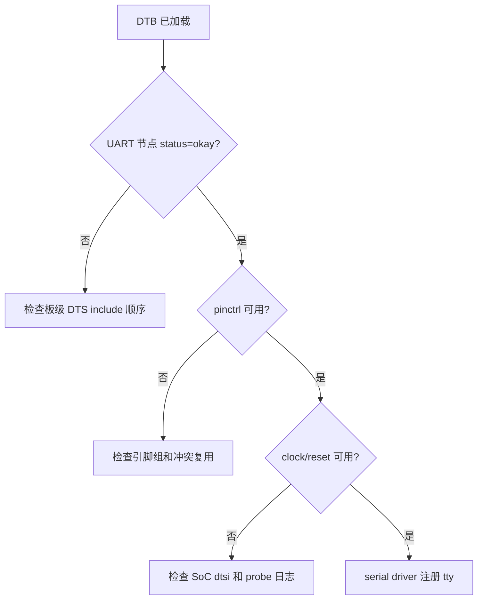

若节点存在但没有 TTY，先看 dmesg 中的错误返回。

常见原因包括时钟 provider 尚未就绪、复位没有释放、pinctrl 标签拼错、同一引脚被其他节点占用，或内核没有启用匹配该 compatible 的 serial driver。

不要在不理解错误来源时通过删除 pinctrl 或强行改 status 来“让日志消失”。

那样可能让端口看似注册成功，但引脚并未输出有效信号。

### 用 alias 和 bootargs 建立一张映射表

为当前板卡维护一张实际映射表。

表中至少包含 SoC UART 名称、DTS 节点路径、alias、Linux TTY 名称、连接器丝印、用途和波特率。

| 项目 | 需要记录的事实 |
| --- | --- |
| 控制器 | DTS 中的节点名和寄存器节点路径 |
| 引脚 | TX/RX 对应的 pinctrl 组和原理图网络名 |
| 编号 | aliases 中的 serialN 与运行时 TTY 名称 |
| 用途 | 启动 console、调试口、外设协议口或蓝牙模块口 |
| 参数 | 波特率、校验、停止位、硬件流控 |
| 验收 | 冷启动日志、回环、长时间收发和复位后行为 |

这张表是后续 getty、应用配置、产线治具和故障定位的共同输入。

## 三、实现 serial_core 操作并完成 console 接管

多数 SoC UART 不需要从零实现一个通用 TTY 驱动。

Linux 已经提供 serial core 处理 uart_driver、端口注册、TTY 对接和 console 辅助逻辑。

低层控制器驱动的职责是把硬件资源和操作交给 serial core。

TTY 层再向用户态呈现字符设备、termios 和 line discipline。

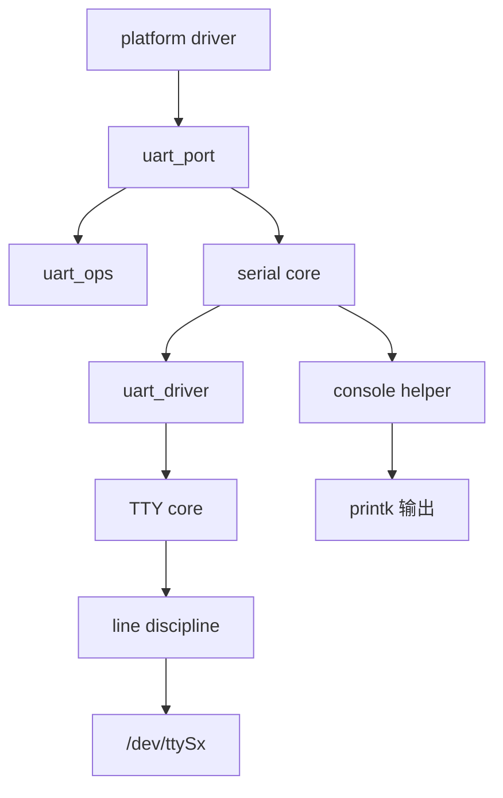

从控制器硬件看，发送和接收是两条不同的数据路径。

它们共享时钟、FIFO、状态寄存器和中断资源，却各自需要独立的完成条件。

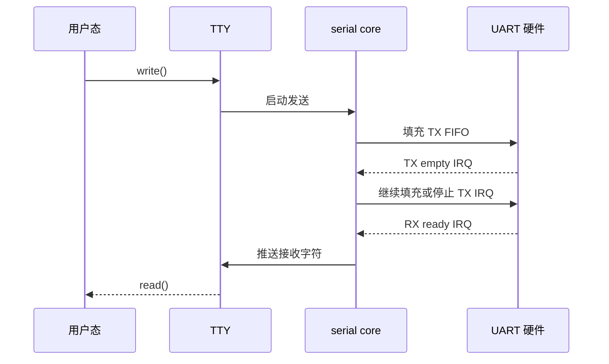

如果你在维护的是厂商已有 serial driver，优先阅读它如何完成下列四件事：

- 在 platform probe 中取得 MMIO、时钟、IRQ、复位和 pinctrl 资源；
- 初始化 struct uart_port 的地址、IRQ、FIFO 和 flags；
- 实现硬件相关的 struct uart_ops，例如启动发送、停止发送、设置 termios 和处理中断；
- 将端口通过 serial core 注册，并在 remove 中按反向顺序注销。

uart_ops 不是普通应用接口。

其中很多回调运行在锁和中断语境下，不能直接复制到任意驱动模块。

阅读现有驱动时，把控制器相关逻辑和框架相关逻辑分别标注出来。

```c
/* 结构示意：字段与辅助函数以当前内核版本的 serial driver 为准。 */
static const struct uart_ops board_uart_ops = {
    .tx_empty      = board_uart_tx_empty,
    .set_mctrl     = board_uart_set_mctrl,
    .get_mctrl     = board_uart_get_mctrl,
    .stop_tx       = board_uart_stop_tx,
    .start_tx      = board_uart_start_tx,
    .stop_rx       = board_uart_stop_rx,
    .startup       = board_uart_startup,
    .shutdown      = board_uart_shutdown,
    .set_termios   = board_uart_set_termios,
};
```

真正的控制器驱动还必须正确处理 IRQ 中的 RX、TX、错误状态和共享锁。

本章此处的目标不是替换厂商 serial driver。

目标是知道当普通 UART 不工作时，应该在 platform probe、serial core 端口注册、TTY 节点和电气波形中的哪一层找证据。

console 与普通 TTY 的用途不同。

console 是内核 printk 的输出目标之一，可能在启动早期、异常处理或系统压力下工作。

普通 TTY 面向用户态的 open、read、write、termios 和协议程序。

同一个底层 UART 可以被配置成 console，但这会让它不适合作为干净的业务字节流。

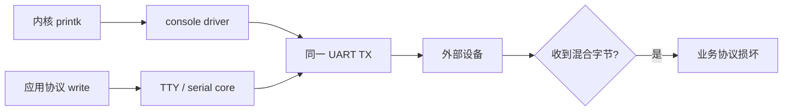

若产品硬件只有一条可用 UART，应在设计阶段明确复用协议和调试状态机。

开发阶段则优先用另一条 UART、USB gadget、网络或 trace 设施承载调试输出。

### 不要直接从 TTY 层重写已有 UART

只要 SoC UART 已有 serial core 驱动，板级适配应该从 DTS、内核配置和驱动 probe 开始。

直接新建一个 TTY driver 会绕过成熟的串口路径，并带来 line discipline、termios、console、DMA 和电源管理的额外维护成本。

只有硬件并非普通 UART，且现有 serial 或 USB serial 层无法表达它的行为时，才考虑直接实现 TTY 层。

这个判断应在阅读内核同类驱动、确认协议与硬件能力后再做。

## 四、验证 TTY、termios、流控与 IRQ/DMA 收发

选择一条不承担 kernel console 的 UART 作为实验端口。

连接方式可以是板内 TX/RX 回环，也可以是连接到 USB 转串口或另一块开发板。

回环只能证明本端发送器、接收器和驱动基本能协同工作。

与外部设备通信仍需验证两端电平、字符格式和流控是否一致。

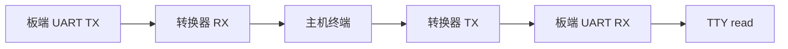

先读取当前端口的设置。

```bash
TTY=/dev/ttySx
stty -F "$TTY" -a
```

把 ttySx 替换成前一步已经确认的真实节点。

不要在 console 端口上执行会改变 termios 的实验命令。

在已知不被 console 使用的端口上，设置一组明确的 8N1、无软件流控、无硬件流控参数：

```bash
TTY=/dev/ttySx
stty -F "$TTY" 115200 cs8 -cstopb -parenb -ixon -ixoff -crtscts raw -echo
stty -F "$TTY" -a
```

这里的 115200 只是示例值。

应替换为原理图、外设手册和实际协议要求的值。

对端若使用 RTS/CTS 硬件流控，必须同时确认四根信号线和两端配置。

仅在软件中打开 crtscts 而硬件没有连接 RTS/CTS，常见结果是发送永久被阻塞。

为避免终端回显干扰，先用方向清晰的两个窗口或两个设备完成测试。

接收端：

```bash
TTY=/dev/ttySx
timeout 10 cat "$TTY" | hexdump -C
```

发送端：

```bash
TTY=/dev/ttySx
printf 'UART-LAB-0001\r\n' > "$TTY"
```

收到的内容应逐字节正确，换行符也应符合预期。

若协议要求原始二进制，验证时不要只用文本终端目视判断。

应使用 hexdump -C、od -An -tx1 或保存原始文件比较 CRC。

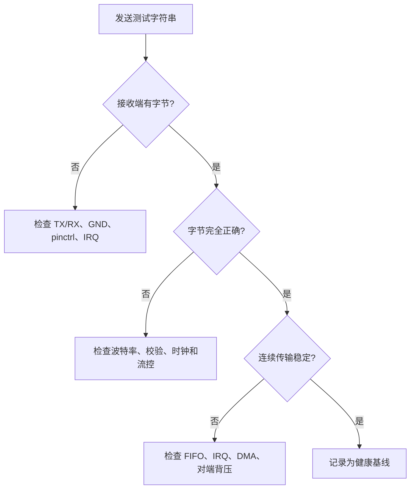

接下来做一个足以暴露偶发错误的长度测试。

使用文件而不是手工输入，避免人眼掩盖丢字和重复字节。

在发送端生成固定模式：

```bash
dd if=/dev/zero bs=1024 count=64 2>/dev/null | tr '\000' 'A' > /tmp/uart-pattern.bin
sha256sum /tmp/uart-pattern.bin
cat /tmp/uart-pattern.bin > /dev/ttySx
```

接收端将原始数据保存到文件后，使用相同长度和校验和进行比较。

实际接收命令必须按你的传输边界设计退出。

单纯 cat 不知道一帧何时结束，所以建议协议含长度字段、结束标记或由上层工具控制超时。

### 将流控作为独立实验

软件流控使用 XON/XOFF 字节，会影响包含控制字符的二进制协议。

硬件流控使用 RTS/CTS，需要芯片、设备树、引脚和外部连线共同支持。

不要在不知情时把任何一类流控打开。

对端设备支持硬件流控的情况下，按下面顺序验证：

1. 先关闭流控，确认短报文收发正确；
2. 接好 RTS/CTS 并用原理图核对方向；
3. 两端同时启用相同的硬件流控设置；
4. 发送超出对端处理能力的长数据，观察 CTS 是否真的产生背压；
5. 断开一根流控线，确认故障表现与预期一致。

最后一步不是破坏性测试。

它能区分“流控确实工作”和“软件设置看起来已经打开”。

## 五、完成冷启动、协议、PM 与恢复回归

UART 通过一次回环并不等于板级适配完成。

至少应覆盖冷启动、重复重启、普通收发、压力收发和故障恢复。

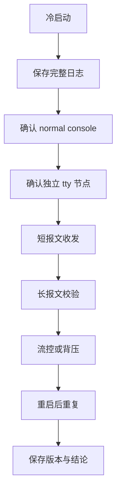

每次验证前记录版本，避免把不同 DTB、内核或 rootfs 的现象混在一起。

```bash
git rev-parse HEAD
uname -a
cat /proc/cmdline
cat /proc/consoles
dmesg -T | grep -Ei 'console|serial|tty'
```

建议维护如下验收表。

| 场景 | 操作 | 通过条件 | 失败时首先检查 |
| --- | --- | --- | --- |
| 冷启动 console | 断电后重新上电 | 从 U-Boot 到用户态日志连续 | bootargs、DTB、pinctrl |
| 内核接管 | 比较 earlycon 前后日志 | normal serial 注册后无断流 | clock、reset、driver probe |
| 普通收发 | 固定短报文往返 | 十六进制内容一致 | 端口名、波特率、TX/RX |
| 长数据 | 文件传输和校验 | 长度、CRC 或 sha256 一致 | FIFO、IRQ、流控、对端 |
| 复位恢复 | 连续重启多次 | 端口和应用均恢复 | 电源时序、getty、应用重连 |
| 产品并存 | console 与业务口分离 | 业务帧不含日志字节 | 端口规划、服务配置 |

当问题表现为“U-Boot 有日志，内核没有日志”，优先确认 kernel 的 console 参数是否指向能被当前内核识别的设备。

随后确认 DTB 中对应 UART 的 status、pinctrl、时钟和驱动配置。

当问题表现为“有 earlycon，普通日志中断”，重点查看 normal serial driver 的 probe 日志。

当问题表现为“有 /dev/ttySx，但收不到数据”，先用示波器或逻辑分析仪查看板端 TX、RX 的真实波形，再检查传输参数。

当问题表现为“短报文正确，长报文丢字”，收集 /proc/tty/driver/serial 的计数、CPU 负载、对端背压和流控状态。

不要通过无止境增大 delay 掩盖问题。

延时可能偶然降低错误概率，却没有解释 FIFO 溢出、中断丢失或对端处理不足。

### 本章练习

在自己的板卡上选择一条非 console UART，建立并提交一份映射表。

完成一次短报文收发和一次至少 64 KiB 的模式数据传输。

保存发送端与接收端的校验和、完整 dmesg 和 /proc/cmdline。

随后故意将一端波特率改错，再恢复正确配置。

记录乱码的波形或十六进制现象，并说明为何该证据支持“波特率不匹配”而不是“TTY 节点不存在”。

### 本章验收

完成本章后，应能独立回答以下问题：

- 启动日志出现到哪里，才能证明 normal serial driver 已经接管端口；
- 为什么 DTS 中的 UART 名称不能直接当作 Linux 的 TTY 编号；
- serial core、TTY 与 console 各自负责什么；
- 为什么业务协议口不应与 kernel console 共用；
- 当收发失败时，如何按物理链路、设备树、probe、TTY 设置和协议边界依次排查。

这些答案应来自你的板端日志、设备树和真实波形，而不是来自一段能偶尔打印字符的示例程序。

**参考资料**

- [The Serial Driver Layer](https://docs.kernel.org/driver-api/serial/driver.html)
- [TTY Internals](https://docs.kernel.org/driver-api/tty/tty_internals.html)
- [Linux serial console](https://docs.kernel.org/admin-guide/serial-console.html)

## 六、小结

UART 是硬件，serial_core 管理端口驱动，TTY 提供终端 ABI，console 负责内核日志。可靠验证必须区分 bootloader/earlycon/正式 driver，检查 termios 与物理波形，并让 IRQ/DMA、PM 和错误恢复在独立业务口上闭环。

> 🏷️ Linux BSP · UART · TTY · serial core · console · earlycon · 设备树 · 串口调试
