PWM framework 管理周期/占空比输出；IIO（Industrial I/O）为 ADC 提供 channel、raw/scale 和 buffer/event；ADC 把模拟电压转换为原始码；watchdog framework 管理 timeout、ping 和复位；runtime PM 则控制这些 controller 的空闲时钟/电源。

三者不是同一数据路径，本篇用“板级健康监测”把它们放进一个实验，但分别解释框架边界：PWM 用波形验收，IIO ADC 用标定验收，watchdog 用受控停止喂狗和重启原因验收。

## 一、定义三个框架的硬件边界与安全基线

实验开始前，画出实际信号路径。

PWM 输出最终接到了什么器件，决定了允许的周期、占空比、极性和上电默认状态。

ADC 输入来自哪个分压网络和参考源，决定了允许的电压范围与换算方式。

watchdog 的复位输出是否连到 SoC 复位、PMIC 或外部看门狗，决定了超时后会发生什么。

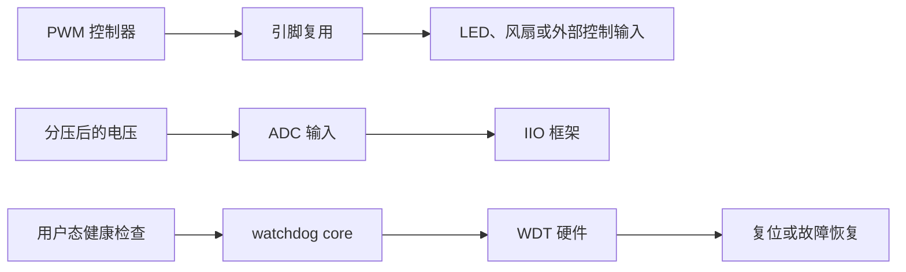

先建立一个最小实验台。

PWM 可以接到允许测量的测试点或普通 LED 驱动输入。

不要第一次就把占空比输出到电机、功率 MOS 或其他可能造成危险动作的控制线。

ADC 可以选择一个稳定、低风险的参考点，例如经确认允许接入的 1.8 V、3.3 V 分压网络。

不能把未知电压直接接入 ADC 引脚。

watchdog 受控超时只能在可恢复的开发板上执行。

先确认板卡的烧录、串口日志和复位后的自动启动均正常。

还要确保复位不会对外部设备造成不可接受的动作。

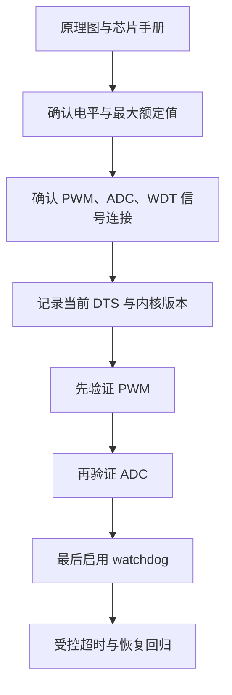

为每个信号填写一张实验记录。

| 信号 | 需要确认的硬件事实 | 需要确认的软件事实 | 物理验收方式 |
| --- | --- | --- | --- |
| PWM_OUT | 引脚、电平、负载、默认安全态 | pinctrl、控制器、通道与极性 | 示波器 |
| ADC_IN | 分压比、量程、参考电压、输入阻抗 | IIO 设备、通道、scale 与 offset | 万用表加采样记录 |
| WDT_RST | 超时后的复位对象和电源行为 | watchdog 驱动、timeout、nowayout | 串口日志和复位计数 |

此表要写实际网络名，不要只写“PWM0”或“ADC0”。

例如，PWM 所在 pinctrl 组可能被显示接口、摄像头或调试功能复用。

ADC 输入的芯片通道号也可能与板端连接器丝印不同。

watchdog 节点存在并不保证硬件复位线接到了期望的位置。

如果任一项无法确认，先停在资料核实阶段。

不要通过反复写 sysfs 来猜测硬件关系。

在健康系统上保存以下基础信息：

```bash
uname -a
cat /proc/cmdline
dmesg -T | grep -Ei 'pwm|iio|adc|watchdog|wdt'
find /sys/class/pwm -maxdepth 2 -type f 2>/dev/null | sort
find /sys/bus/iio/devices -maxdepth 2 -type f 2>/dev/null | sort
find /sys/class/watchdog -maxdepth 2 -type f 2>/dev/null | sort
```

这些命令只建立观察入口。

路径存在不等于控制器已经被正确配置，也不代表外部引脚上有正确电平。

后续每一步都必须补上物理测量或可重复的行为验证。

### 将三项验收拆成独立条件

PWM 的通过条件是频率、占空比、极性和 enable 行为与配置一致。

ADC 的通过条件是换算后的读数在已知误差范围内跟随万用表读数变化。

watchdog 的通过条件是健康时持续运行，故意停止健康确认后在预期时间内复位，并能从日志看出本次复位发生过。

它们不能互相替代。

PWM 正常不说明 ADC 参考源正确。

ADC 有数值不说明 watchdog 真的能复位。

watchdog 能重启也不说明喂狗策略真的代表业务健康。

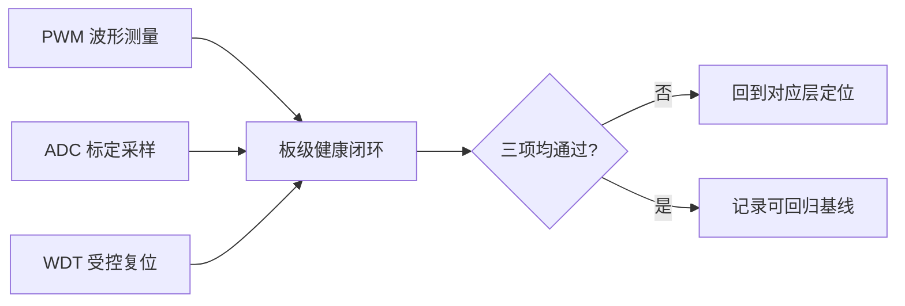

## 二、从 PWM framework 到示波器验证输出

PWM 不是“百分比输出”。

Linux PWM 框架用周期和高电平时间表达波形。

若周期为 20 ms、高电平时间为 1.5 ms，占空比就是 7.5%。

同一个占空比在不同周期下对应的频率完全不同。

先根据被控器件的手册确定期望频率和允许误差。

再计算周期和占空比，而不是先在 sysfs 中随意试数字。


先确认控制器节点本身已经启用。

下例只表示板级 DTS 的常见结构。

真正的节点名、pinctrl 标签和时钟依赖必须从 SoC dtsi 与当前板级 DTS 查找。

```dts
&pwmX {
    pinctrl-names = "default";
    pinctrl-0 = <&pwmX_pin>;
    status = "okay";
};
```

如果 PWM 由某个内核 consumer 驱动使用，consumer 节点还需要用 pwms 属性引用它。

```dts
board_pwm_lab {
    compatible = "longway,pwm-lab";
    pwms = <&pwmX 0 20000000 0>;
    status = "okay";
};
```

上例中 20,000,000 的含义是 20 ms 周期。

cell 的数量、通道编号与 flags 含义必须匹配当前 PWM provider 的 binding。

不要把另一颗 SoC 的 pwms 写法直接拷贝到此处。

完成修改后，以 SDK 的标准构建入口生成 DTB 并重新启动。

先确认控制器和 pinctrl 没有 probe 错误：

```bash
dmesg -T | grep -Ei 'pwm|pinctrl'
find /sys/kernel/debug/pinctrl -maxdepth 2 -type f 2>/dev/null | sort
find /sys/class/pwm -maxdepth 2 -type f 2>/dev/null | sort
```

如果系统启用了 PWM sysfs 接口，先只将它用于实验观察。

产品驱动不应依赖手工 export 的 sysfs 路径作为长期控制接口。

不同内核配置中，sysfs 是否暴露以及路径细节可能不同。

下面以 pwmchipX 的通道 0 为例。

```bash
CHIP=/sys/class/pwm/pwmchipX
echo 0 > "$CHIP/export"
PWM="$CHIP/pwm0"
echo 20000000 > "$PWM/period"
echo 1500000 > "$PWM/duty_cycle"
echo normal > "$PWM/polarity" 2>/dev/null || true
echo 1 > "$PWM/enable"
cat "$PWM/period" "$PWM/duty_cycle" "$PWM/enable"
```

先设 period，再设 duty_cycle，最后 enable。

某些控制器在更改 period 时会暂时要求 duty_cycle 不超过新周期。

若从长周期切换为短周期，先降低 duty_cycle 或先 disable，再按安全顺序重新配置。

不要在运行中的功率负载上盲目改变极性。

极性错误可能让“关闭”变成全开。

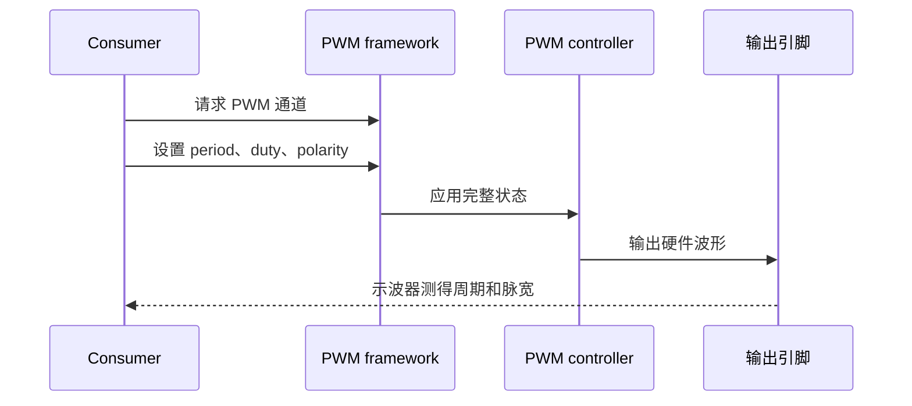

内核 consumer 不应把 pwm_config、pwm_enable 等旧式分散调用混在一个状态切换中。

优先先读取状态、修改完整的 pwm_state，再用 pwm_apply_might_sleep 一次应用。

这也让 period、duty_cycle、polarity 和 enabled 的关系保持可读。

```c
struct pwm_state state;

pwm = devm_pwm_get(dev, NULL);
if (IS_ERR(pwm))
    return PTR_ERR(pwm);

pwm_init_state(pwm, &state);
state.period = 20000000;
state.duty_cycle = 1500000;
state.enabled = true;

ret = pwm_apply_might_sleep(pwm, &state);
if (ret)
    return ret;
```

该调用可能睡眠，不能从硬中断或持有 spinlock 的路径直接调用。

若硬件和驱动支持原子更新，仍要先确认 pwm_might_sleep 的返回与当前内核 API。

对 BSP 初学者，更安全的起点是把状态变更放在进程上下文或 workqueue。

### 用示波器完成真正的 PWM 验收

示波器地线接到与信号同一参考地。

探头带宽、衰减倍率和触发条件先设置正确。

观测时至少记录周期、正脉宽、频率、幅度和极性。

还要观察 enable 前后的静止电平。

有些 PWM 控制器在 disabled 状态下无法保证输出低电平。

若外设要求明确的非活动电平，应使用 duty_cycle 为零且 enabled 为真，或采用外部使能控制，具体选择由硬件要求决定。

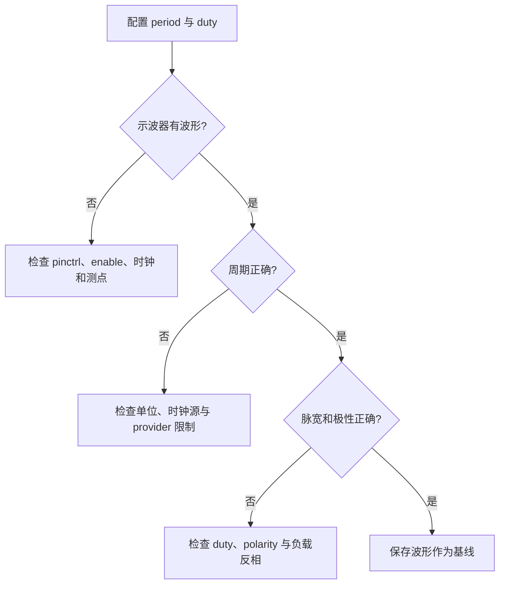

当 sysfs 显示的 period 正确而示波器频率不正确，不要假设示波器坏了。

先确认所观察的引脚确实是该 PWM 的 pinctrl 复用输出。

再检查引脚是否被其他模块重新申请，或板端是否存在反相器、分频器和电平转换器。

当波形存在但幅度异常，优先检查电源域和外部负载。

软件框架只能配置控制器，不能替代原理图中的供电和电平设计。

## 三、用 IIO 建立 ADC raw、scale 与真实电压

ADC 的第一个读数不是电压，而是转换器输出的原始码。

它是否能代表板端电压，取决于参考源、分压网络、通道增益、offset、采样频率和输入阻抗。

因此不能看到 in_voltage0_raw 有数字就把它写进业务阈值判断。

应先选一个可用万用表直接测量、且电压在 ADC 安全范围内的稳定点完成标定。

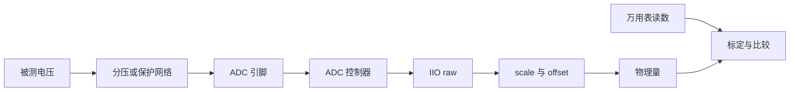

先让 ADC 控制器在设备树中进入可用状态。

节点名、参考电源属性和通道描述取决于当前 SoC binding。

下面仅表示常见方向。

```dts
&adcX {
    status = "okay";
    vref-supply = <&adc_ref>;
};
```

若该 ADC 被自定义 consumer 驱动使用，consumer 还需要引用 io-channels。

```dts
board_voltage_monitor {
    compatible = "longway,voltage-monitor";
    io-channels = <&adcX channelN>;
    io-channel-names = "vmon";
    status = "okay";
};
```

channelN 必须与当前 ADC provider 的 binding 对应。

不要用连接器上的“ADC0”丝印猜测该数字。

真正的映射应来自 SoC 手册、原理图网络名和运行时 IIO 设备描述。

重新启动后，先查找 IIO 设备。

```bash
find /sys/bus/iio/devices -maxdepth 1 -type l -printf '%f\n' 2>/dev/null
for dev in /sys/bus/iio/devices/iio:device*; do
    test -e "$dev" || continue
    printf '%s: ' "$dev"
    cat "$dev/name" 2>/dev/null
done
```

iio:deviceX 中的 X 是注册顺序，不是稳定的板级编号。

应通过 name、of_node 或 consumer 的 io-channel-names 找到真实设备。

查看目标目录的可用属性：

```bash
DEV=/sys/bus/iio/devices/iio:deviceX
find "$DEV" -maxdepth 1 -type f -printf '%f\n' | sort | grep -E 'voltage|scale|offset|sampling'
cat "$DEV/in_voltage0_raw"
cat "$DEV/in_voltage0_scale" 2>/dev/null
cat "$DEV/in_voltage0_offset" 2>/dev/null
```

属性命名按驱动和通道而变化。

可能是 in_voltage0_raw，也可能是带修饰符或不同编号的属性。

没有 scale 或 offset 不代表换算可以忽略。

应阅读对应 IIO 驱动的 ABI 文档，确认该属性的单位和解释。

一般形式可写为：

```text
physical_value = (raw + offset) x scale
```

但 scale 的单位可能是伏、毫伏或其他驱动定义的单位。

这就是为什么不能把一条通用公式直接写进产品逻辑。

先在实验记录中写清实际驱动的 raw、offset、scale、换算单位与外部电路分压比。

若板端有分压网络，还要把 ADC 引脚电压换回被测节点电压。

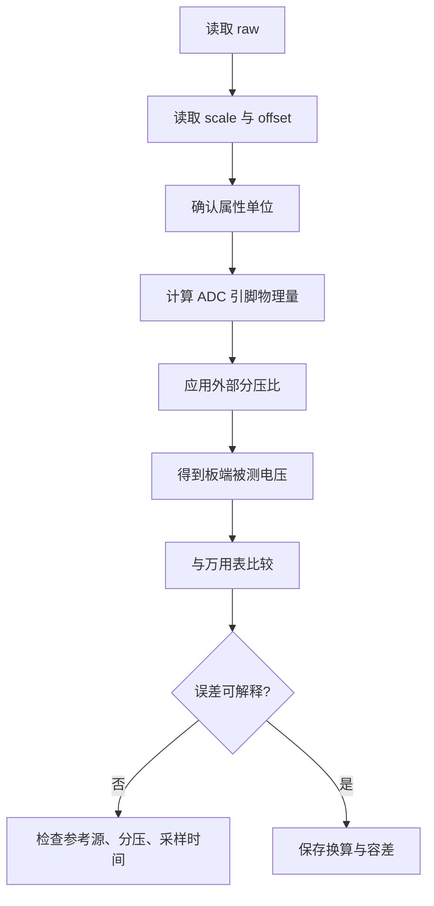

以一个分压网络为例。

如果被测电压通过 Rtop 与 Rbottom 分压到 ADC，理想分压比为：

```text
V_adc = V_input x Rbottom / (Rtop + Rbottom)
V_input = V_adc x (Rtop + Rbottom) / Rbottom
```

真实电路还可能包含串联电阻、保护二极管、滤波电容和输入漏电。

它们会影响高阻源或快速变化信号的采样结果。

因此第一轮实验优先使用稳定直流电压，不要直接用高速 PWM 波形验证 ADC。

当直流读数可靠后，再讨论采样频率、缓冲区和触发器。

在用户态连续采样时，先用一个低频、可记录的脚本观察原始数据波动。

```bash
DEV=/sys/bus/iio/devices/iio:deviceX
while true; do
    raw=$(cat "$DEV/in_voltage0_raw") || break
    scale=$(cat "$DEV/in_voltage0_scale" 2>/dev/null || echo "no-scale")
    printf '%s raw=%s scale=%s\n' "$(date +%T)" "$raw" "$scale"
    sleep 1
done
```

读取间隔只是实验观察，不是正式采样架构。

需要固定频率、多通道同步或高吞吐数据时，应使用当前 IIO 驱动支持的 buffer 和 trigger 机制。

不要用 shell 循环假装完成了实时数据采集。

若驱动提供 in_voltage_sampling_frequency 或对应 available 属性，记录当前值和可选值。

采样频率提高不一定提高测量可信度。

输入源阻抗过高时，采样电容可能来不及充电，读数会系统性偏低或随前一通道变化。

这类问题需要原理图、模拟前端和示波器共同排查。

### 在内核 consumer 中保留单位边界

若电压监测逻辑属于内核驱动，应通过 IIO consumer API 获取通道，而不是硬编码 sysfs 路径。

```c
priv->vmon = devm_iio_channel_get(dev, "vmon");
if (IS_ERR(priv->vmon))
    return PTR_ERR(priv->vmon);

ret = iio_read_channel_raw(priv->vmon, &raw);
if (ret)
    return ret;
```

原始值读到以后，仍要在驱动中明确换算、校准和单位。

若使用 iio_read_channel_processed，先查当前 provider 对 processed 值的单位定义。

不要把一个“数值看起来合理”的返回值直接与毫伏阈值比较。

更可维护的写法是定义清楚的变量名，例如 adc_uv、rail_mv 或 battery_mv。

每次跨越单位边界都显式换算并检查溢出。

### 用两点而不是一点验证 ADC

万用表只在一个电压点对得上，可能是偶然的。

至少选择两个安全、相差明显的稳定电压点。

例如正常输入与经确认允许的较低输入，或者使用精密可调电源。

对每个点记录万用表读数、raw、scale、换算结果和误差百分比。

如果误差随电压成比例变化，优先检查参考电压或分压比。

如果误差接近固定偏移，优先检查 offset、地电位差和输入偏置。

如果读数随机跳变，优先检查接触、参考源噪声、输入阻抗和采样时序。

## 四、让 watchdog 只对真实健康状态负责

watchdog 的目的是在系统失去自恢复能力时促成恢复。

它不是一个普通定时器，也不是只要周期写入设备文件就算完成。

无条件喂狗只能证明负责喂狗的线程还活着。

它无法证明关键传感器、存储、网络、视频管线或业务状态机仍正常。

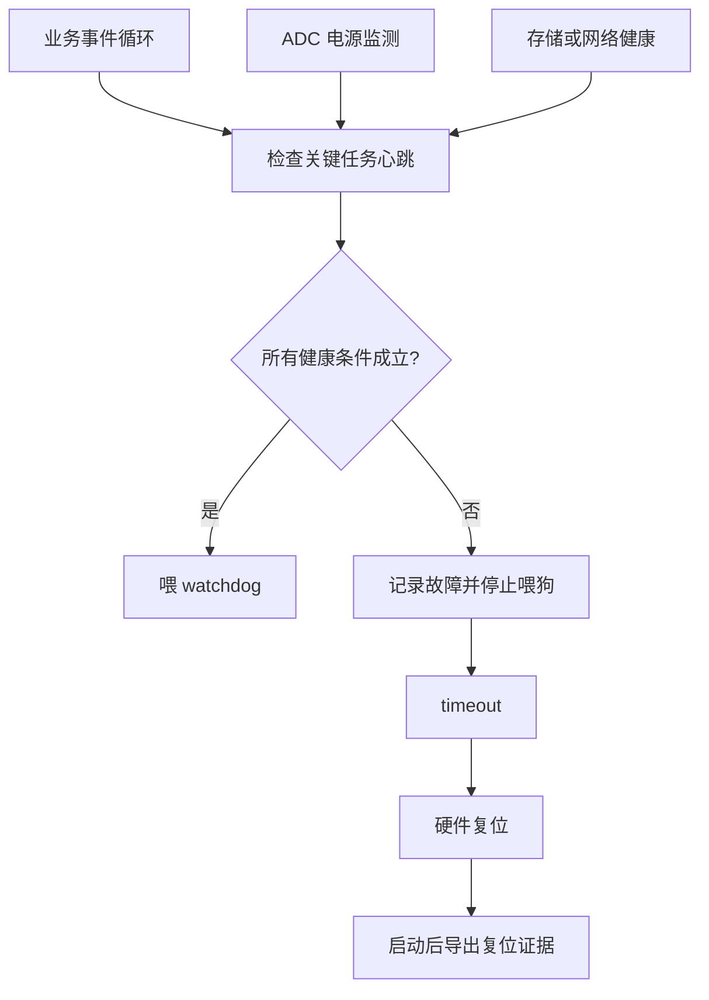

首先确认 watchdog 控制器已经由内核驱动注册。

```bash
dmesg -T | grep -Ei 'watchdog|wdt'
ls -l /dev/watchdog* 2>/dev/null
for dev in /sys/class/watchdog/watchdog*; do
    test -e "$dev" || continue
    echo "== $dev =="
    cat "$dev/identity" 2>/dev/null
    cat "$dev/timeout" 2>/dev/null
    cat "$dev/status" 2>/dev/null
done
```

设备节点可能是 /dev/watchdog 或 /dev/watchdog0。

实际 timeout 的可选范围和关闭行为取决于控制器驱动。

不要假设所有平台都支持相同 ioctl，也不要假设 close 会停止 watchdog。

若启用 nowayout，watchdog 一旦启动就不能由软件停掉。

这是产品可靠性中常见的选择，但会使开发实验更严格。

先在可恢复开发环境中确认策略，再移植到产品配置。

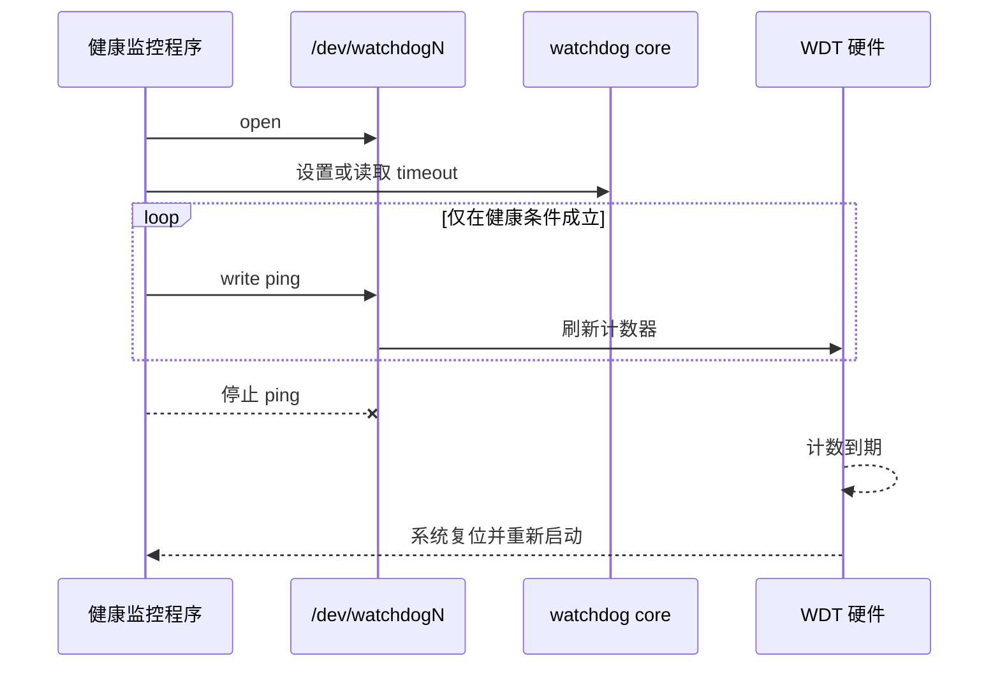

下面的用户态代码片段只演示喂狗的健康门控。

timeout、错误处理、日志持久化和退出策略必须按当前平台补齐。

```c
int fd = open("/dev/watchdog0", O_WRONLY | O_CLOEXEC);
if (fd < 0)
    return -1;

for (;;) {
    bool healthy = service_loop_alive() &&
                   voltage_in_range() &&
                   storage_path_writable();

    if (!healthy) {
        log_fault_state();
        break;
    }

    if (write(fd, "\0", 1) != 1)
        break;

    sleep(1);
}
```

这里的 service_loop_alive、voltage_in_range 和 storage_path_writable 必须代表真正的业务条件。

它们不能只返回常量真值。

例如，ADC 读数要使用上一节已验证的单位与容差。

存储检查要避免频繁写入造成额外磨损。

视频或网络业务则应以帧率、连接状态或超时计数等可观测指标定义健康。

停止喂狗前必须把故障原因写到尽可能可靠的日志位置。

否则复位后只能知道“系统重启过”，却不知道为什么放弃了喂狗。

### 受控超时测试的安全步骤

第一次测试建议使用较长 timeout，并确保串口日志正在保存。

先验证健康情况下持续运行超过两倍 timeout 仍不复位。

然后有意让一个必要健康条件失败，例如停止被监控服务或用测试开关模拟 ADC 读数越界。

确认程序记录故障后停止喂狗。

测量从最后一次 ping 到复位的时间。

重启后检查启动日志、复位计数或平台特有 reset reason。

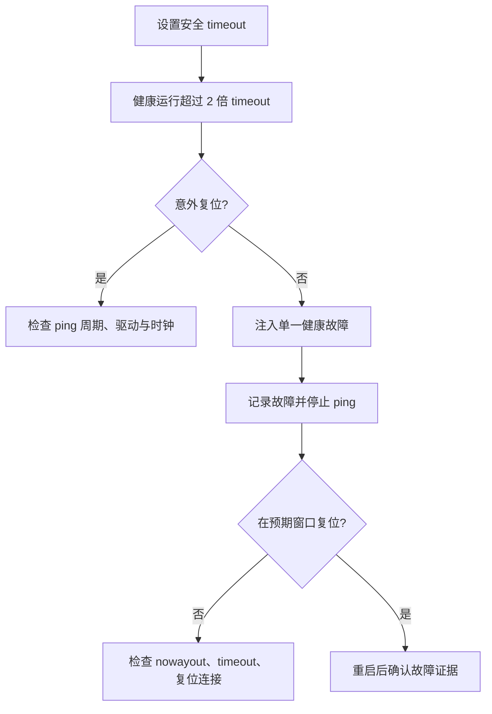

不要在一次实验中同时改 timeout、喂狗周期和健康判定。

每次只改一个变量，才能解释复位提前、延后或根本未发生的原因。

若 watchdog 到期但系统没有复位，需要区分三件事：硬件没有真正启动、复位输出没有接到预期对象，或平台将超时配置为中断、panic 等其他动作。

这一步必须回到芯片手册、设备树和原理图核对。

## 五、把 runtime PM、异常复位与三项实验纳入回归

此时已经分别证明了 PWM、ADC 和 watchdog 的最小行为。

最后要验证它们在同一系统中不会因为资源冲突、单位错误或错误的恢复策略而相互掩盖问题。

先以读写方式明确每项观测的责任边界。

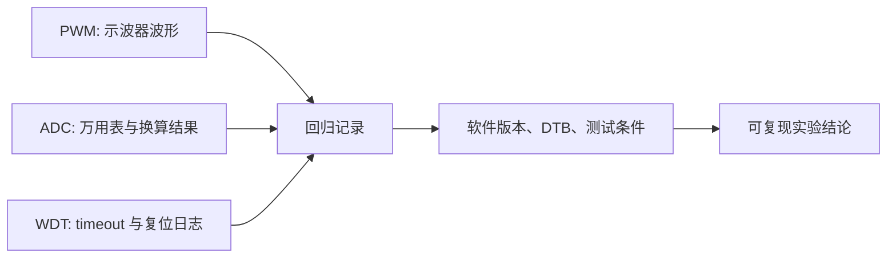

一次完整回归可以按下面顺序执行。

1. 冷启动并保存启动日志，确认 PWM、IIO 和 watchdog driver 均完成 probe。
2. 让 PWM 输出低风险测试波形，并保存一次示波器截图或频率、脉宽读数。
3. 读取两个稳定 ADC 电压点，保存 raw、scale、换算值与万用表值。
4. 启动健康监控程序，在健康状态下运行超过两倍 watchdog timeout。
5. 仅注入一个健康条件失败，确认记录故障、停止喂狗和预期复位。
6. 重启后再次读 ADC、测 PWM，确认没有因复位或 pinctrl 状态变化留下异常。

这套顺序避免刚上电就启用 watchdog，导致 PWM 或 ADC 的问题尚未观测完成就不断重启。

它也避免先看一个 ADC 数字就把它直接作为复位阈值。

在产品中，PWM 有时会承担风扇、背光或使能控制。

这类输出在 watchdog 复位前后必须定义安全态。

需要分别验证 bootloader、内核 pinctrl 和驱动 probe 前后的引脚状态。

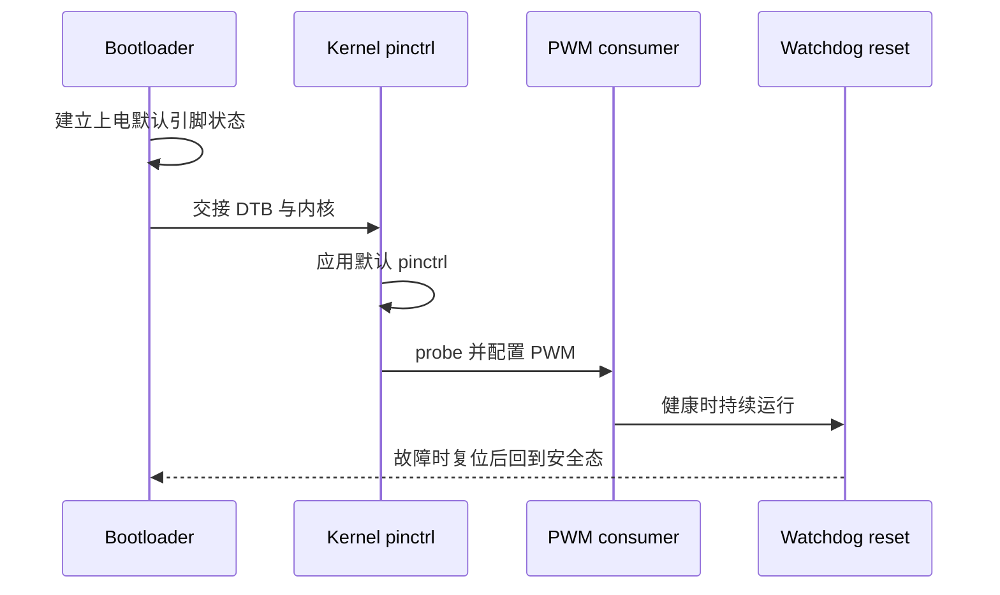

若复位后外设短暂误动作，不能只在应用层增加延时。

应找出哪个启动阶段首先改变了引脚状态。

可能是 BootROM、U-Boot、GPIO 默认上下拉、pinctrl default state 或 PWM consumer 的 probe。

对每个阶段保存日志和可测波形，才能确定应修改哪个层。

### 常见现象与排查顺序

| 现象 | 首先验证 | 再检查 | 不要先做 |
| --- | --- | --- | --- |
| PWM sysfs 有值但引脚无波形 | pinctrl 与测点 | enable、时钟、通道复用 | 反复改 duty |
| PWM 周期偏差很大 | 单位和示波器设置 | provider 时钟与分频限制 | 只相信 sysfs 回显 |
| ADC 数值恒为零或满量程 | 输入网络与量程 | 通道号、参考源、IIO 驱动 | 直接加入软件滤波 |
| ADC 与万用表差很多 | 分压比与 scale 单位 | offset、输入阻抗、参考源 | 修改业务阈值迁就错误 |
| watchdog 未复位 | timeout 与是否真正启动 | reset 连接、超时动作、nowayout | 一味缩短 timeout |
| watchdog 偶发误复位 | 健康门控与 ping 周期 | 任务阻塞、日志和 CPU 负载 | 无条件加快 ping |

每次异常都先回到本章最初建立的信号表。

确认当前运行的内核、DTB 与应用版本，再查看哪项客观测量偏离了健康基线。

不要同时更换 DTS、修改用户态阈值并调整测试仪器。

一次只改变一个条件，实验日志才有解释力。

### 本章练习

选择一条安全 PWM 输出，计算并测量两个不同周期与占空比的波形。

为一个 ADC 通道建立至少两点的测量表，并写出从 raw 到板端电压的完整换算。

实现一个最小健康门控：只有服务循环、ADC 电压范围和一个业务检查均成立时才喂 watchdog。

在开发板上模拟一个条件失败，记录最后一次 ping、预期 timeout、实际复位时间和重启后的证据。

### 本章验收

完成本章后，应能独立说明：

- 为什么 PWM 必须以 period、duty_cycle 和实际波形共同验收；
- 为什么 ADC raw 不能直接当作电压阈值；
- 为什么 IIO 的设备编号不能作为长期业务配置；
- 为什么 watchdog 的喂狗动作必须受真实健康条件约束；
- 当系统异常重启或不重启时，如何在设备树、内核框架、原理图和物理测量之间建立证据链。

将这四类证据与版本号一起保存，才得到可交接、可复现的 BSP 结论。

**参考资料**

- [Pulse Width Modulation interface](https://docs.kernel.org/driver-api/pwm.html)
- [Industrial I/O](https://docs.kernel.org/driver-api/iio/index.html)
- [WatchDog Module Parameters](https://docs.kernel.org/watchdog/watchdog-parameters.html)

## 六、小结

PWM、IIO ADC 和 watchdog 是三个独立框架：分别用实际波形、标定数据和受控复位证明正确性。把它们组合成健康监测时，喂狗条件必须来自真实业务状态，runtime PM 和异常路径也要进入回归，不能只检查 sysfs 节点存在。

> 🏷️ Linux BSP · PWM · IIO · ADC · watchdog · 设备树 · 板级健康监测
