驱动调试的目标不是收集更多日志。

目标是让一个具体假设被最小实验支持或否定，并据此缩小问题范围。

当 UART 没有输出、I2C 没有 ACK、DMA 偶发错帧或 probe 停在某个阶段时，开发者往往会同时改 DTS、延时、时钟和驱动打印。

这样即使问题暂时消失，也无法知道真正生效的是哪一项。

更糟的是，下一次 SDK 更新或板卡改版后，问题会以另一种形式回来。

本章给出一套固定的调试闭环。

它适用于前面已经完成的 UART、GPIO、I2C、SPI、PWM、ADC、watchdog 和 DMA 实验，也适用于后续摄像头、音频和网络驱动。

这套方法的核心是先找出第一处偏离健康基线的位置。

然后只为那个位置增加足够的观察。

## 1. 先把“现象”改写成可验证的问题

“驱动不工作”不是可调试的问题。

“上电后在 4.2 秒打印了 probe start，但从未注册 IIO 设备”才是可验证的问题。

“视频花屏”也不够具体。

“第 30 分钟开始，帧序号仍递增但 CRC 每隔数百帧失败一次”才给出了时间边界和可观测指标。

先把现象写成以下五个字段：

| 字段 | 应写内容 |
| --- | --- |
| 对象 | 哪块板、哪个外设、哪个驱动或用户接口 |
| 触发 | 冷启动、热重启、持续运行、特定负载还是特定命令 |
| 期望 | 健康系统本应出现的日志、节点、波形或数值 |
| 实际 | 首次偏离的位置、错误码、时间和计数 |
| 版本 | Git 提交、内核、DTB、rootfs、bootargs 与测试硬件 |

这张表应该在修改代码前建立。

它防止不同实验的日志和不同镜像的现象被混在一起。

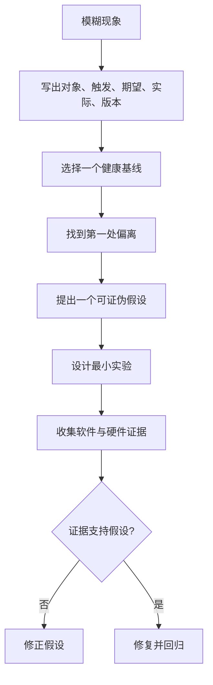

健康基线可以是同一块板修改前的一次成功启动。

也可以是同版本 SDK 下另一块已验证板卡。

它必须在硬件版本、供电、镜像和启动参数上尽量接近故障对象。

不要把互联网教程的输出当作唯一基线。

厂商内核版本、设备树命名和日志顺序都可能不同。

在目标板上先保存一份环境快照：

```bash
mkdir -p /tmp/bsp-debug
git rev-parse HEAD 2>/dev/null || true
uname -a | tee /tmp/bsp-debug/uname.txt
cat /proc/cmdline | tee /tmp/bsp-debug/cmdline.txt
cat /proc/consoles 2>/dev/null | tee /tmp/bsp-debug/consoles.txt
dmesg -T | tee /tmp/bsp-debug/dmesg-before.txt
```

目标机上通常没有 Git 仓库。

因此 Git 提交号可以从构建机记录后写入测试记录，而不是强行在板端执行。

重要的是每份日志都能关联到唯一的镜像、DTB 和测试时间。

若问题只在冷启动出现，日志必须从上电前开始保存。

如果从登录后才开始 dmesg -w，常常已经错过时钟、pinctrl、deferred probe 或 bootargs 的关键证据。

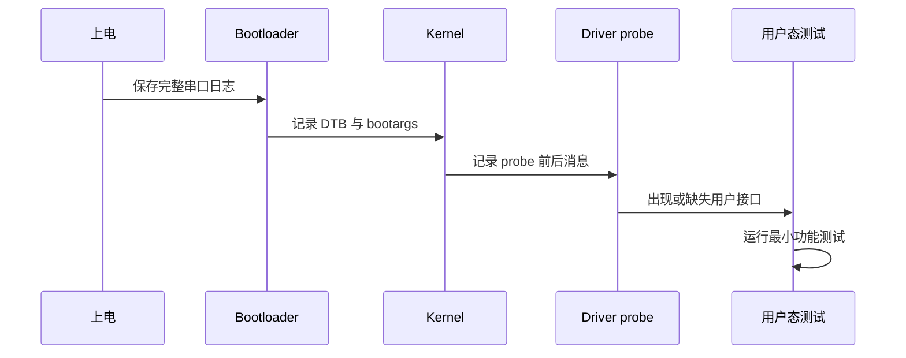

### 将症状放进启动、资源、数据和恢复四个层面

很多 BSP 问题跨越多个层。

但在一次实验中，应只判断问题首先属于哪一个层面。

启动层关注设备树是否被加载、driver 是否匹配和 probe 在哪里停止。

资源层关注 pinctrl、clock、reset、regulator、IRQ、DMA 和总线资源是否可用。

数据层关注寄存器、字节流、波形、帧内容和完成事件是否正确。

恢复层关注 timeout、error path、remove、suspend、reset 和重启后状态是否正确。

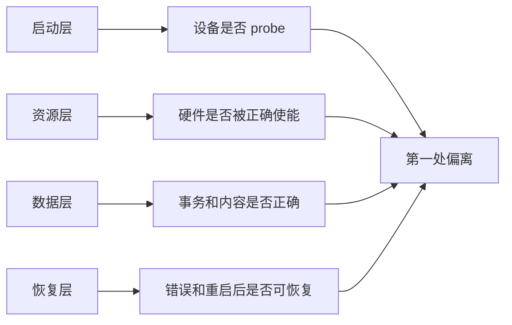

例如，I2C 设备没有出现时，先问 probe 是否执行。

若 probe 根本没有执行，就不应马上用逻辑分析仪看 I2C 时钟。

先检查 compatible、status、DTB 是否真的被加载和 driver 是否编进当前内核。

若 probe 已执行且在读芯片 ID 时返回超时，才进入 pinctrl、电源、reset 和总线波形。

这个顺序会显著减少无效测量。

### 给每次实验定义一个通过和失败条件

一个好实验在开始前就知道两种结果分别意味着什么。

例如：

| 假设 | 最小实验 | 支持条件 | 否定条件 |
| --- | --- | --- | --- |
| DTS 没被加载 | 导出运行时设备树 | 节点或属性缺失 | 节点与属性正确存在 |
| 驱动未匹配 | 查 driver link 和 dmesg | 没有 probe 记录 | probe 已到达硬件访问 |
| 时钟未开 | 读 clock 状态和 probe 错误 | provider 或 enable 失败 | clock 已准备且仍失败 |
| 总线无响应 | 单次读 ID 加波形 | 无起始条件或无 ACK | ACK 正常但寄存器值异常 |
| DMA 过早复用 | 帧序号与完成时间记录 | 完成前 buffer 被复用 | 所有权时序正确 |

这样写之后，不要在实验过程中临时把失败条件改成另一个解释。

如果结论不清楚，就承认该实验无法区分两个假设，再设计一个更小、更有区分力的实验。

## 2. 第一步：从运行时事实找到第一处偏离

驱动问题的第一观察点不是源代码，而是当前系统实际运行的配置。

确认当前 DTB、bootargs、内核与模块版本，才能避免在错误镜像上调试。

先检查内核是否看见目标设备。

平台设备、I2C 设备、SPI 设备和 USB 设备各有不同的 sysfs 层级，但都遵循“设备先出现，再绑定驱动”的原则。

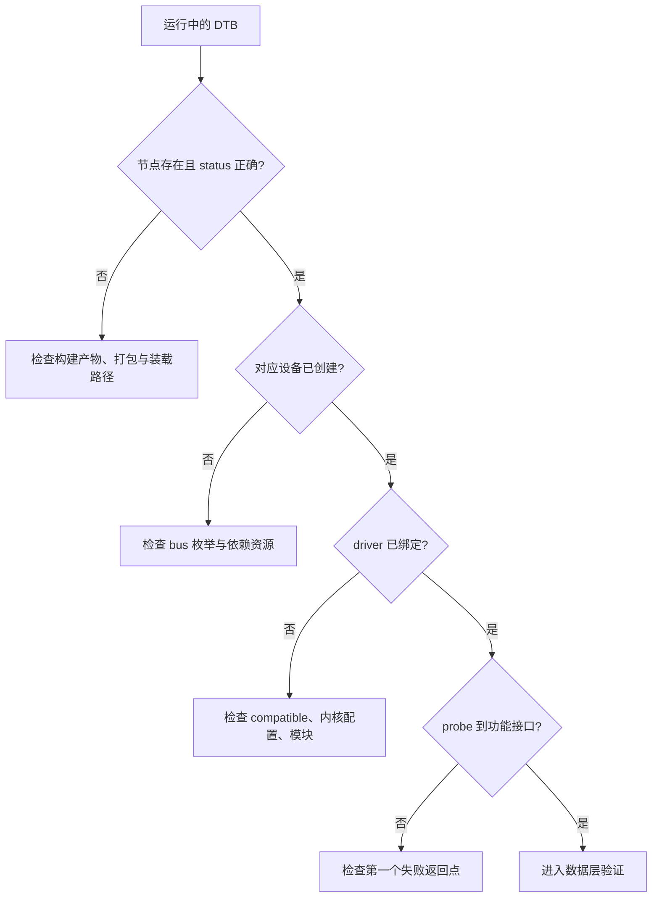

先从 dmesg 中按时间而不是关键字随意搜索。

```bash
dmesg -T | tail -400
dmesg -T | grep -Ei 'probe|defer|fail|error|timeout|pinctrl|clock|reset|regulator'
```

注意 deferred probe 并不等于永久失败。

它表示某个依赖资源尚未准备好，driver core 将在适当时机尝试再次 probe。

应同时记录首次 defer 和最终结果。

若只截取第一条 defer 日志，可能误判设备始终没有工作。

若系统支持导出运行时设备树，直接观察当前节点。

```bash
mkdir -p /tmp/live-dt
dtc -I fs -O dts /sys/firmware/devicetree/base > /tmp/live-dt/board-live.dts
grep -n -A16 -B4 "target-compatible-or-label" /tmp/live-dt/board-live.dts
```

没有 dtc 时，可以从 /sys/firmware/devicetree/base 读取节点目录和二进制属性。

不要用源码 DTS 代替运行时 DTS。

源码正确而打包的 DTB 没被 U-Boot 装载，是板级调试里很常见的情况。

随后从对应 bus 的 sysfs 观察设备和 driver link。

```bash
find /sys/bus/platform/devices -maxdepth 1 -type l | sort | head -80
find /sys/bus/i2c/devices -maxdepth 1 -type l 2>/dev/null | sort
find /sys/bus/spi/devices -maxdepth 1 -type l 2>/dev/null | sort
find /sys/bus/platform/drivers -maxdepth 2 -type l 2>/dev/null | head -120
```

对于已经绑定的设备，可以查看 device 与 driver 的符号链接。

```bash
DEV=/sys/bus/platform/devices/actual-device-name
readlink "$DEV/driver" 2>/dev/null
readlink "$DEV/of_node" 2>/dev/null
cat "$DEV/modalias" 2>/dev/null
```

路径必须用实际设备名替换。

若目标是 I2C 或 SPI 外设，应从对应 bus 目录选择设备。

modalias、compatible 与 of_match_table 的匹配关系必须能解释为什么这个 driver 被选择。

“模块已经加载”不能证明它绑定到了正确设备。

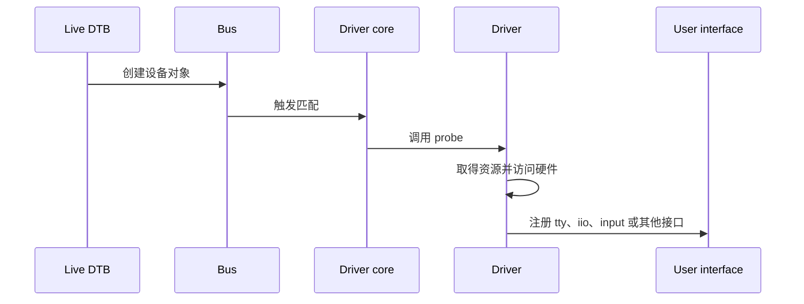

### 资源检查必须跟在 probe 边界后面

设备已进入 probe 后，才检查资源获取和使能顺序。

常见资源包括 regulator、clock、reset、pinctrl、GPIO、IRQ、DMA channel 和总线适配器。

驱动应把每次关键资源失败转换成带上下文的错误日志。

例如不要只返回 -EPROBE_DEFER。

应记录是哪个 regulator、clock 或 GPIO 尚不可用。

```c
priv->vdd = devm_regulator_get(dev, "vdd");
if (IS_ERR(priv->vdd))
    return dev_err_probe(dev, PTR_ERR(priv->vdd), "get vdd failed\n");

ret = regulator_enable(priv->vdd);
if (ret)
    return dev_err_probe(dev, ret, "enable vdd failed\n");
```

示例重点是保留资源名称和失败上下文。

具体供电名称必须与 DTS 的 supply 属性一致。

资源成功获取不代表硬件已产生正确电平。

获得 regulator 之后，仍要按电源时序、enable GPIO、reset 和时钟的要求验证硬件侧状态。

当 probe 失败时，记录第一个失败的函数与错误码。

后续由清理路径产生的错误常是连锁结果，不应被当作根因。

## 3. 第二步：用最小软件观测验证一个假设

找到第一处偏离后，不要立刻在每个函数加入 printk。

先写出一个假设。

例如“设备已经绑定，但 reset 释放后等待时间不足，导致第一次读 ID 超时”。

这句话同时限定了阶段、资源、预期事务和可观察结果。

随后只增加能证伪它的最小观测。

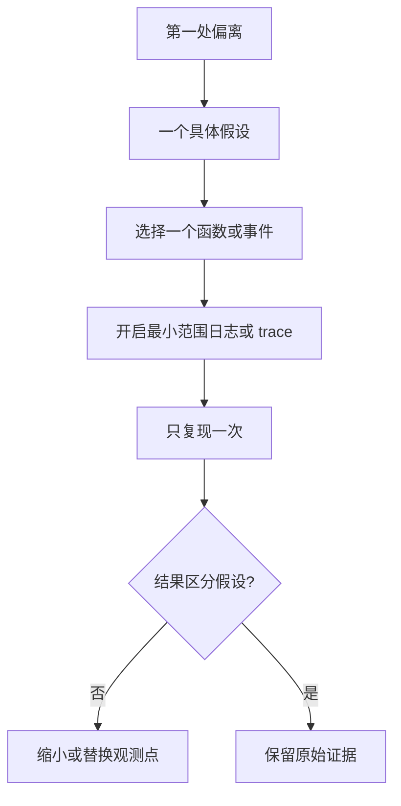

动态调试适合观察已经由 dev_dbg 或 pr_debug 标记的驱动路径。

先确认内核是否提供 control 文件。

```bash
test -e /proc/dynamic_debug/control || exit 0
head -5 /proc/dynamic_debug/control
grep -n "driver_file_or_module" /proc/dynamic_debug/control | head -30
```

实际使用时，按模块、文件或函数精确开启。

```bash
echo 'module driver_file_or_module +p' > /proc/dynamic_debug/control
dmesg -wH | tee /tmp/bsp-debug/dmesg-reproduce.log
```

先在另一个终端启动 dmesg -wH，再执行一次触发操作。

当实验结束，立即关闭不再需要的动态日志。

```bash
echo 'module driver_file_or_module -p' > /proc/dynamic_debug/control
```

动态调试输出通常需要合适的 kernel loglevel 才能在 console 上可见。

若日志没有出现，先确认 callsite 是否真的存在、筛选条件是否匹配，以及日志是被 console 过滤还是根本未执行。

不要把“没有看到打印”直接当作函数没有进入。

可以在 control 文件中检查目标 callsite 的 enable 标志。

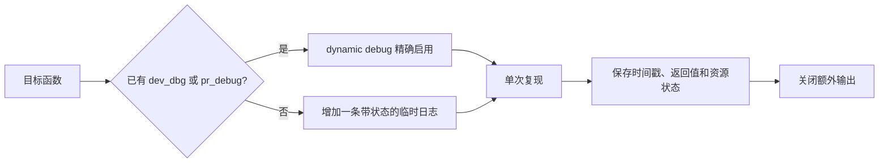

临时日志应回答具体问题。

好的日志包括资源名、关键配置值、返回值、状态转换和事务序号。

不好的日志只有“here”“ok”或“failed”。

```c
dev_dbg(dev, "id read: addr=0x%02x ret=%d value=0x%02x\n",
        reg, ret, value);
```

这类日志能告诉读者访问了哪个寄存器、调用是否失败，以及得到什么值。

它仍然需要被限制在低频、单次或可控条件下。

I2C、SPI、IRQ 和高帧率 DMA 路径中无限打印，会显著改变时序。

若打印一开问题就消失，不应得出“问题已经修复”的结论。

这恰恰说明问题可能对时序、缓存、锁竞争或 FIFO 深度敏感。

### 用 ftrace 观察调用顺序和延迟

当问题是“哪个函数根本没被调用”“哪个调用耗时异常”或“中断到 workqueue 的时序异常”时，ftrace 比增加更多日志更合适。

先确认 tracefs 或 debugfs 中的 tracing 目录。

```bash
TR=/sys/kernel/tracing
test -d "$TR" || TR=/sys/kernel/debug/tracing
test -d "$TR" || exit 0
cat "$TR/available_tracers"
cat "$TR/available_events" | grep -E 'irq|sched|i2c|spi' | head -80
```

函数 tracer 要先限制过滤范围。

```bash
TR=/sys/kernel/tracing
test -d "$TR" || TR=/sys/kernel/debug/tracing
echo 0 > "$TR/tracing_on"
echo nop > "$TR/current_tracer"
echo > "$TR/set_ftrace_filter"
echo 'actual_driver_function' > "$TR/set_ftrace_filter"
echo function > "$TR/current_tracer"
echo 1 > "$TR/tracing_on"
# 只复现一次目标操作
echo 0 > "$TR/tracing_on"
tail -200 "$TR/trace"
```

在使用前把 actual_driver_function 替换为真实函数名。

不要对整个内核开启 function tracer。

全局函数跟踪的数据量和扰动都很大，常会掩盖竞态和实时问题。

若需要观察事件而非函数调用，应优先选择已定义的 tracepoint。

例如 IRQ、调度、workqueue 或 block 层事件可更准确反映系统时间线。

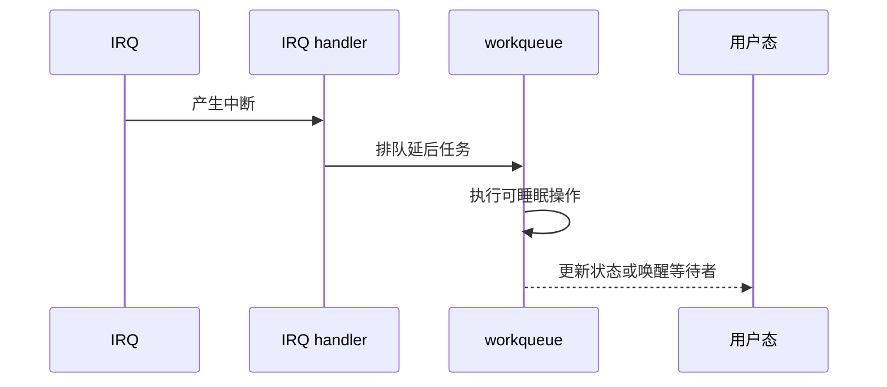

对上图中的每条箭头，都可以设计一个对应观察点。

中断计数可从 /proc/interrupts 观察。

handler 和 work 函数可用函数跟踪观察。

调度延迟可用 sched 事件观察。

用户态接口则用 read、poll、sysfs 或应用日志验证。

这样得到的是一条可对齐的时间线，不是一堆互相没有关系的文本。

### 避免调试改变待测对象

日志、trace、串口输出和频繁读取寄存器都可能改变系统。

因此对时序敏感问题应使用分层策略。

先用低扰动计数器确认问题是否发生。

再用短时间、窄范围 trace 捕捉一次。

最后在实验结束后关闭 tracer 和动态日志，重新验证问题是否仍可复现。

若只在插入日志后问题消失，应记录“观测改变行为”这个事实。

随后转向锁、内存屏障、delay、FIFO 和调度时序的假设，而不是把日志保留为所谓修复。

## 4. 第三步：让硬件波形与软件事件互相校验

当软件证据表明已经访问硬件，但外设仍无响应时，需要测量真实电平、时钟、复位和总线事务。

示波器适合观察幅度、上电顺序、周期、边沿和模拟质量。

逻辑分析仪适合解码 UART、I2C、SPI、GPIO 中断等数字协议。

二者都不能替代软件日志。

它们应回答软件无法直接回答的问题。

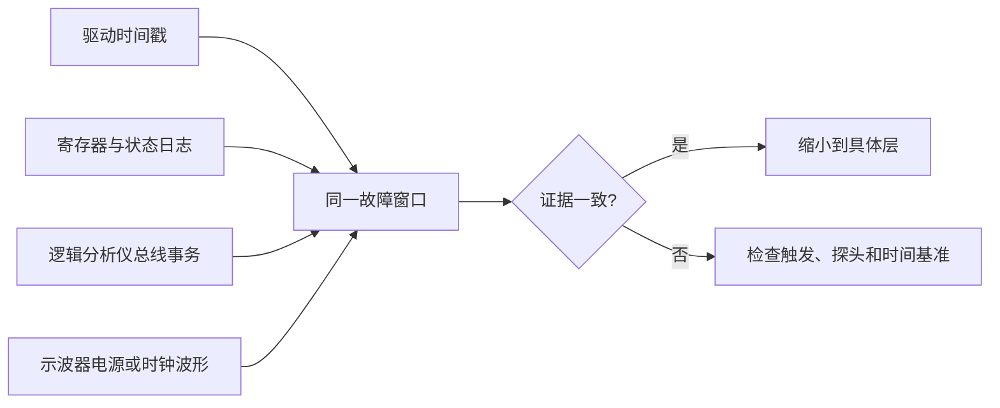

在接探头前先明确要验证的假设。

例如“驱动已经拉高 reset GPIO，但外部器件仍保持复位”。

此时示波器要观察 reset 引脚、对应电源和时钟，而不是随意测一根 I2C 线。

例如“内核 I2C 读 ID 超时”。

此时逻辑分析仪应抓取一次单独的读 ID 事务，并检查地址、起始条件、ACK、寄存器地址、数据和停止条件。

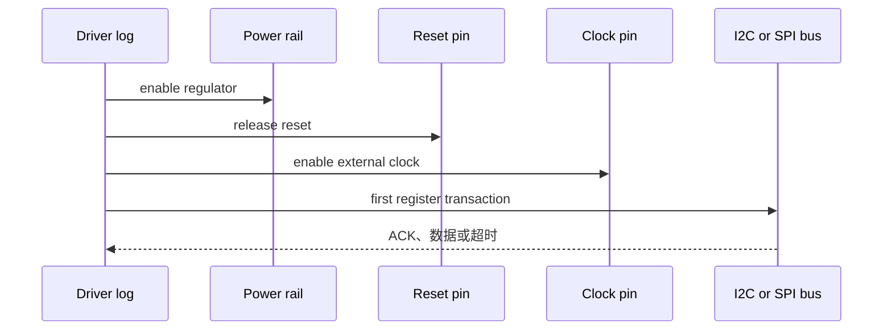

软件日志和仪器捕获应使用可关联的触发方式。

最简单方法是在发起一次事务前打印带单调递增序号的日志，同时只触发一次操作。

若硬件允许，也可以输出一根调试 GPIO，在关键代码前后翻转。

调试 GPIO 的引脚、电平与时序必须单独确认，不能抢占被测外设的 pinctrl。

```c
gpiod_set_value_cansleep(priv->debug_gpio, 1);
ret = read_chip_id(priv);
gpiod_set_value_cansleep(priv->debug_gpio, 0);
```

这段代码仅适用于能够睡眠的 GPIO 路径。

若在硬中断或原子上下文中使用调试 GPIO，必须选择符合上下文要求的 API 并遵循当前 GPIO 驱动约束。

调试信号的价值是标出“软件认为事务发生”的时间窗口。

它不能证明总线物理上确实产生了正确事务。

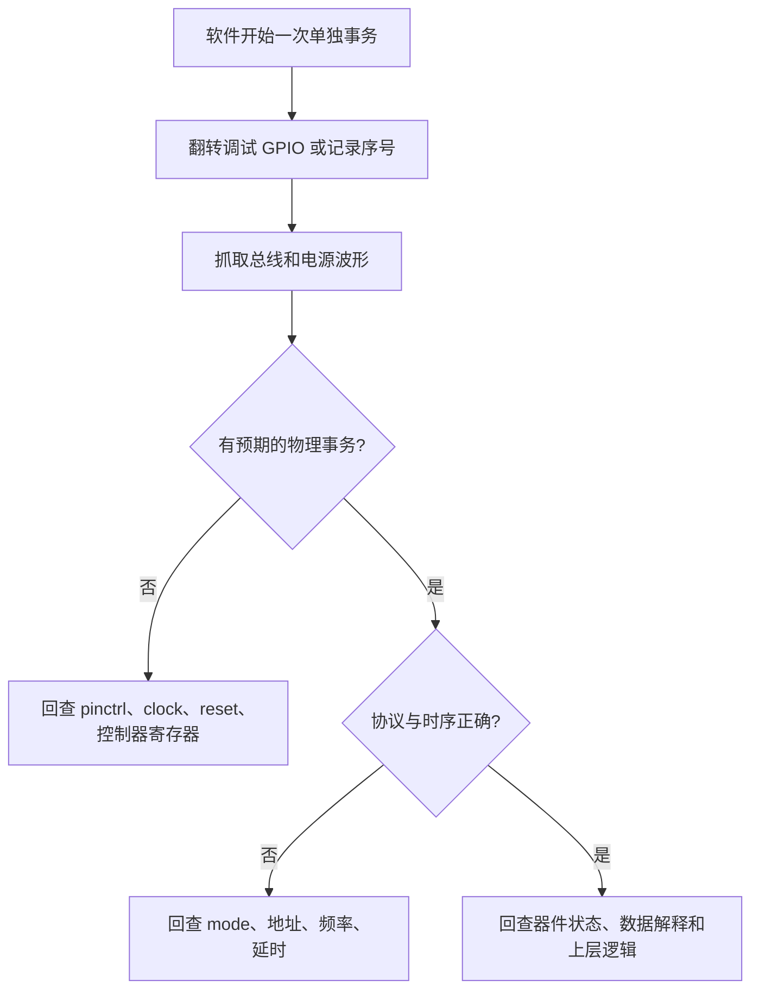

### 各类外设的最小硬件证据

| 外设类型 | 软件侧最小证据 | 硬件侧最小证据 |
| --- | --- | --- |
| UART | TTY 节点、收发计数、单次 write | TX/RX 电平、波特率和字节序列 |
| GPIO/IRQ | GPIO 状态、/proc/interrupts 计数 | 引脚电平、边沿与触发极性 |
| I2C | adapter、client、单次寄存器访问返回值 | START、地址、ACK、数据与 STOP |
| SPI | mode、bits_per_word、transfer 返回值 | CS、SCLK、MOSI/MISO 和 mode |
| PWM | period、duty、enable 状态 | 周期、脉宽、极性和幅度 |
| ADC | raw、scale、计算结果 | 输入电压、参考源和分压网络 |
| DMA | 提交、完成 IRQ、CRC | 必要时看握手或外设输出，不直接猜缓存 |

先让每种外设的事务缩小到一次。

例如只读一个固定芯片 ID，只发送一个 UART 字符串，只产生一段 PWM，或只提交一个 DMA buffer。

一次事务正确后，再讨论连续传输、性能和并发。

如果单次事务已经错误，增加负载只会让证据更混乱。

### 硬件测量也需要健康基线

逻辑分析仪上“有波形”不代表波形正确。

同一总线的健康事务应作为参考，比较地址、时钟频率、片选、ACK 和空闲状态。

示波器上“电压大约是 3.3 V”也不代表电源时序满足器件要求。

应比较上电斜率、稳定时间、reset 释放位置和时钟出现顺序。

将健康波形与故障波形用同一探头、同一量程和同一时间基准保存，结论才可靠。

## 5. 第四步：修复后用回归证明问题没有转移

修复不等于某次启动成功。

修复应解释原来的第一处偏离为什么发生，说明修改了哪个层，并在相同触发条件下稳定通过。

若问题是性能、偶发超时或并发异常，还必须定义一个可量化指标。

例如 probe 耗时、IRQ 到 workqueue 的延迟、单次 I2C 事务耗时、连续帧 CRC 错误率或 watchdog 误复位次数。

没有指标的“快一点”“稳定了”无法被回归验证。

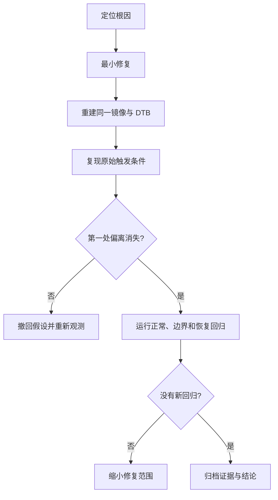

性能问题先定义时间边界，再选择工具。

若怀疑 CPU 热点，用 perf 观察采样热点。

若怀疑函数调用顺序或中断延迟，用 ftrace 或 trace-cmd 观察事件时间线。

若怀疑锁竞争，用 lock 相关 tracepoint 和线程状态补充证据。

不要把 perf top 的一个函数名当作根因。

它只说明 CPU 在样本中常落在该函数，仍要解释它为什么被频繁调用或为什么耗时异常。

```bash
perf top
perf record -a -g -- sleep 10
perf report
```

上述命令依赖内核 perf 支持和 rootfs 工具。

在资源受限的板端，可能需要在主机端用 trace-cmd、perf 数据导出或厂商工具分析。

工具不可用时，不应伪造性能结论。

先用时间戳、计数器和有限 tracepoint 获得足够的基础证据。

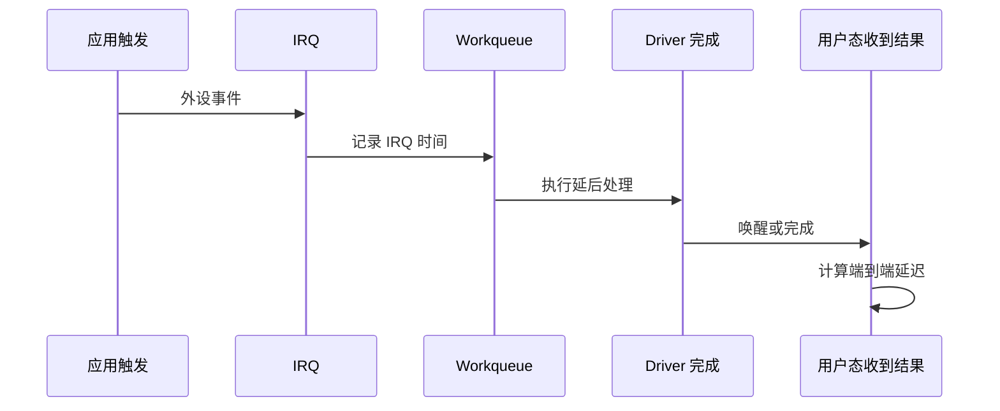

对上述链路，至少记录事件序号和四个时间点。

这样可以区分外设未产生 IRQ、IRQ 到 workqueue 调度慢、work 函数本身慢，还是用户态迟迟没有消费。

不要只观察总延迟。

总延迟无法告诉你应修改硬件中断、驱动锁、线程优先级还是应用读取逻辑。

### 修复必须经过三类回归

第一类是正常路径回归。

它验证原始功能、数据内容和用户接口均恢复。

第二类是边界路径回归。

它验证错误输入、总线无响应、极限长度、重复操作和资源暂时不可用时，驱动不会泄漏、死锁或错误报告成功。

第三类是恢复路径回归。

它验证 reset、remove、suspend/resume 或 watchdog 重启后，设备能回到定义的初始状态。

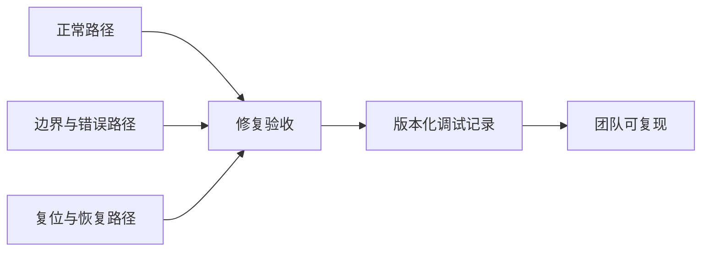

为每次修复写一条简短但完整的结论记录。

| 项目 | 记录内容 |
| --- | --- |
| 现象 | 首次偏离是什么，如何稳定触发 |
| 根因 | 哪个配置、资源、时序或所有权边界错误 |
| 修复 | 修改的 DTS、驱动、配置或硬件项 |
| 证据 | 原始日志、trace、波形、CRC 或计数 |
| 回归 | 正常、边界、恢复三类测试结果 |
| 版本 | Git 提交、镜像、DTB、板卡 revision |

记录中应区分“观察到的事实”和“由事实推导出的结论”。

例如，“I2C 第一个地址字节后没有 ACK”是事实。

“外设未上电”是待验证假设，直到电源和 reset 波形支持它。

这种区分能让后来接手的人知道哪些步骤需要重复，哪些结论已经被证据支持。

### 一个完整的故障处理示例

假设出现“某传感器在冷启动时偶发 probe timeout，热重启后恢复”。

先保存失败与成功两次的完整串口日志、DTB、bootargs 和板卡供电条件。

比较两份日志，确定第一处偏离是否位于 regulator enable、reset、clock、总线第一笔事务或 driver 超时。

只对该阶段打开动态调试，并把一次读 ID 事务与调试 GPIO 对齐。

用示波器同时观察供电、reset 和外部时钟，用逻辑分析仪观察 I2C 事务。

若第一次 I2C 事务发生在电源稳定前，修复应落在正确的上电时序或驱动等待条件上。

若波形已满足时序但没有 ACK，继续检查地址、引脚复用、器件 strap 和硬件连接。

若 ACK 正常但返回 ID 异常，检查寄存器协议、字节序和设备状态。

每次只修改一个候选因素，再回到相同的冷启动触发条件验证。

这样得到的修复能解释“为什么冷启动失败、热重启恢复”，而不是只增加一个任意的 sleep。

### 本章练习

从已经完成的一个 BSP 实验中选取真实现象。

先用对象、触发、期望、实际和版本五字段写成问题。

选择一个健康基线，指出第一处偏离。

提出三个互斥假设，并为每个假设设计一个能支持或否定它的最小实验。

至少收集一份软件证据和一份硬件或系统状态证据。

最后写出正常、边界和恢复三类回归结果。

### 本章验收

完成本章后，应能按固定顺序处理驱动问题：

1. 先冻结版本与环境，保存健康和故障基线；
2. 将模糊现象改写成有触发条件和可观测结果的问题；
3. 在运行时 DTB、设备创建、driver 绑定、probe 与用户接口之间找到第一处偏离；
4. 为一个假设开启最小范围的日志或 trace；
5. 让总线、电源、时钟或 GPIO 的硬件证据与软件时间线对齐；
6. 用正常、边界和恢复回归确认修复有效。

掌握这条流程后，工具不再是零散命令，而是为某个具体假设服务的观测手段。

> 🏷️ Linux BSP · 驱动调试 · dynamic debug · ftrace · tracepoint · 示波器 · 逻辑分析仪 · 证据链
