前面的驱动实验已经使用过 platform_driver、probe、设备树和 sysfs。

但如果只把这些 API 当作固定模板，遇到“节点存在却没有 driver link”“解绑后资源仍被占用”或“用户接口出现在意外目录”时，仍然无法判断问题属于哪一层。

Linux 设备模型的价值，是让硬件、驱动、用户接口和资源释放都拥有可观察的对象关系。

本章不从抽象定义开始堆概念。

而是选择一个设备树描述的 platform 外设，沿着它从启动到解绑的完整生命周期观察 bus、device、driver、class、kobject 和 sysfs。

最终目标是建立一张能用于真实 BSP 排查的对象地图。

## 1. 先为一个硬件节点定义可观察的生命周期

选择一个不会影响启动 console、根文件系统、摄像头主链路或量产功能的实验节点。

最适合的对象是一个自定义的 board-lab platform 节点，或者已经确认可安全解绑的测试外设。

不要在运行中的关键存储、网卡或 console 驱动上练习 bind 和 unbind。

为该对象记录设备树路径、compatible、父 bus、预期 driver 名称、资源和用户接口。

```dts
board_lab {
    compatible = "longway,board-lab";
    status = "okay";
};
```

这个最小节点没有寄存器和 IRQ。

它只用于观察设备模型如何把一个设备树对象变成 platform device，再由 platform driver 接管。

真正外设的 reg、interrupts、clocks、resets、supplies 和 pinctrl 属性会在同一条路径上被加入。

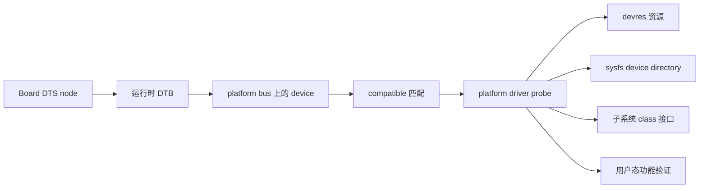

开始前，先确认当前系统使用了你构建的 DTB。

源码树中的节点正确，不代表 bootloader 当前加载的 DTB 包含该节点。

在健康系统上保存启动参数、设备树和平台设备目录：

```bash
mkdir -p /tmp/device-model-lab
cat /proc/cmdline | tee /tmp/device-model-lab/cmdline.txt
dmesg -T | tee /tmp/device-model-lab/dmesg-before.txt
find /sys/bus/platform/devices -maxdepth 1 -type l -printf '%f\n' | +    sort | tee /tmp/device-model-lab/platform-devices-before.txt
```

若 rootfs 带有 dtc，可导出运行时设备树。

```bash
dtc -I fs -O dts /sys/firmware/devicetree/base +    > /tmp/device-model-lab/live.dts
grep -n -A12 -B3 "board-lab" /tmp/device-model-lab/live.dts
```

若目标机没有 dtc，就从 /sys/firmware/devicetree/base 查找对应节点。

设备树属性是二进制格式，必要时用 strings 或 hexdump 观察。

此时的验收标准只有两个。

运行时 DTB 中确有目标节点。

内核在 /sys/bus/platform/devices 下创建了与它对应的设备对象。

还不要急于写复杂的驱动逻辑。

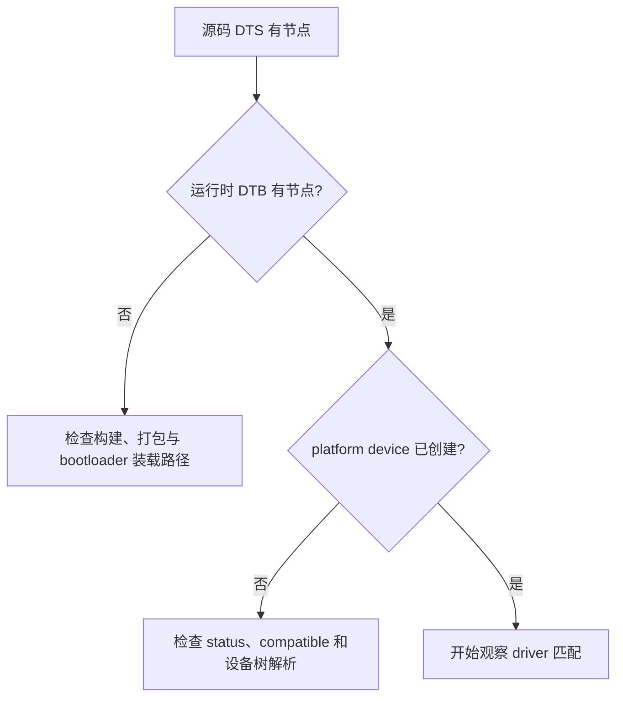

### 先区分五种对象各自负责什么

device 表示一个被内核识别、可拥有资源和生命周期的设备实例。

driver 表示一类设备的实现，包含匹配规则和 probe、remove 等回调。

bus 负责枚举 device、保存 driver，并在二者之间执行匹配。

class 按功能语义组织设备，而不是按物理连接组织设备。

kobject 是这些对象获得引用计数、层级、uevent 和 sysfs 表示的基础设施。

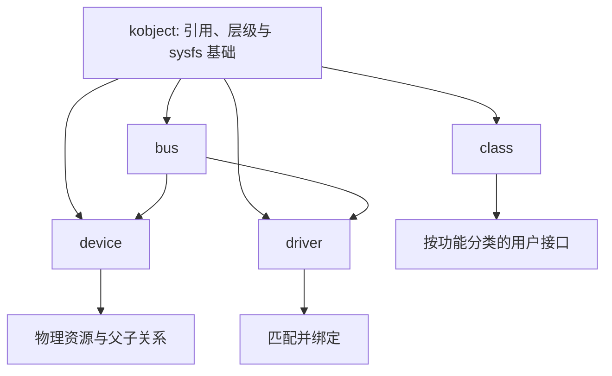

这五个词不是同一层级的同义词。

一个 I2C 传感器在物理层属于 I2C bus。

它可能在功能层通过 IIO class 向用户态呈现采样接口。

其 driver 绑定在 I2C device 上，而不是绑定在 IIO class 上。

同样，一个 platform 控制器可以创建子设备或注册到多个子系统，但最初的资源归属仍从它的 struct device 开始。

理解这点后，sysfs 中看似重复的目录和符号链接就有了明确含义。

## 2. 第一步：从运行时 DTB 跟踪到 device 与 driver 的绑定

设备树的 compatible 不是直接调用某个 C 函数的命令。

内核先根据运行时 DTB 创建 device。

随后 bus 上已经注册的 driver 根据匹配表判断能否处理该 device。

只有匹配成功，driver core 才调用该 driver 的 probe。

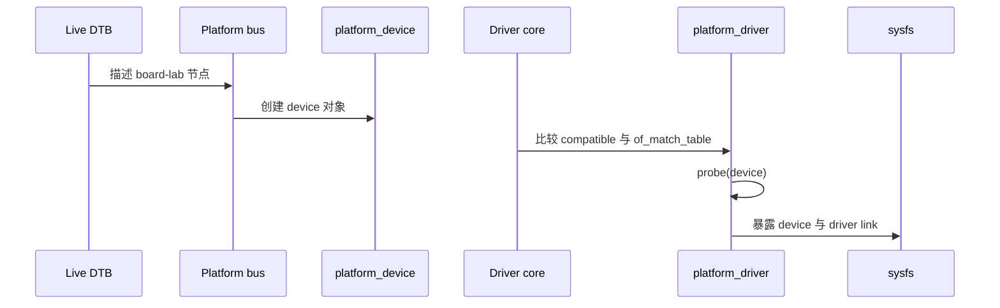

先从 platform devices 目录找到真实的设备名。

设备名常包含 SoC 地址、节点名称或平台命名规则。

不要把 DTS label 当作唯一的 sysfs 目录名。

```bash
find /sys/bus/platform/devices -maxdepth 1 -type l -printf '%f\n' | sort
find /sys/bus/platform/drivers -maxdepth 1 -type d -printf '%f\n' | sort
```

找到目标设备后，检查它的 driver、of_node、modalias 和 uevent。

```bash
DEV=/sys/bus/platform/devices/actual-device-name
readlink "$DEV/driver" 2>/dev/null
readlink "$DEV/of_node" 2>/dev/null
cat "$DEV/modalias" 2>/dev/null
cat "$DEV/uevent" 2>/dev/null
```

driver 符号链接存在，说明该 device 当前已经绑定某个 driver。

of_node 符号链接可帮助确认它关联的是哪一个设备树节点。

modalias 反映该 device 用于匹配的标识。

uevent 显示设备对象导出的环境信息，是排查用户态热插拔规则或设备命名时的有效证据。

```mermaid
flowchart TD
    A[device 目录存在] --> B{driver 符号链接存在?}
    B -- 否 --> C[检查 compatible、模块和内核配置]
    B -- 是 --> D{probe 有成功日志?}
    D -- 否 --> E[检查首个错误返回与 deferred probe]
    D -- 是 --> F{预期功能接口存在?}
    F -- 否 --> G[检查子系统注册和 class 目录]
    F -- 是 --> H[执行功能测试]
```

driver 端应通过 of_match_table 声明可以处理的 compatible。

```c
static const struct of_device_id board_lab_of_match[] = {
    { .compatible = "longway,board-lab" },
    { }
};
MODULE_DEVICE_TABLE(of, board_lab_of_match);

static struct platform_driver board_lab_driver = {
    .probe = board_lab_probe,
    .driver = {
        .name = "longway-board-lab",
        .of_match_table = board_lab_of_match,
    },
};
module_platform_driver(board_lab_driver);
```

name 是 driver 自身的名称。

compatible 是设备树对硬件或板级对象的描述。

二者可以相同，也可以不同。

在设备树 platform driver 中，优先通过 of_match_table 明确匹配关系，不要依赖名称碰巧相同。

probe 被调用后，还应验证实际 driver link，而不是只观察模块是否已经加载。

### sysfs 是对象关系的观察窗，不是任意控制台

sysfs 的目录和符号链接反映 device model 的关系。

/sys/bus/platform/devices 中从 bus 角度列出 platform device。

/sys/bus/platform/drivers 中从 driver 角度列出已注册 driver。

/sys/class 中按用户可理解的功能类型组织设备，例如 tty、leds、watchdog 和 iio。

/sys/devices 更接近设备的物理父子层级。

```mermaid
flowchart LR
    A[/sys/devices: 物理父子层级] --> D[同一个 device 对象]
    B[/sys/bus/platform/devices: bus 视图] --> D
    C[/sys/bus/platform/drivers: driver 视图] --> D
    E[/sys/class: 功能接口视图] --> D
```

许多路径是同一对象的符号链接，而不是复制出的多个设备。

调试时先用 readlink -f 展开路径，再判断自己看的究竟是 bus、driver、class 还是物理层级。

```bash
readlink -f "$DEV"
readlink -f "$DEV/driver" 2>/dev/null
find /sys/class -maxdepth 2 -type l -lname "*actual-device-name*" -print
```

不要把 class 目录当成驱动绑定目录。

例如 tty class 中出现一个端口，说明该端口已经由 serial 子系统注册为用户接口。

它不取代 platform bus 上的 controller device 和 driver link。

同一个外设从不同视角出现，正是设备模型使用户态、总线和驱动能共享同一生命周期的结果。

## 3. 第二步：在 probe 中把资源绑定到 struct device 的生命周期

device model 的实际价值，在 probe 取得资源时最容易看见。

驱动不应把 MMIO、IRQ、时钟、GPIO、regulator 或私有数据当作无主的全局对象。

它们应明确归属于正在 probe 的 struct device。

这样错误路径、解绑和电源管理才有统一的回收边界。

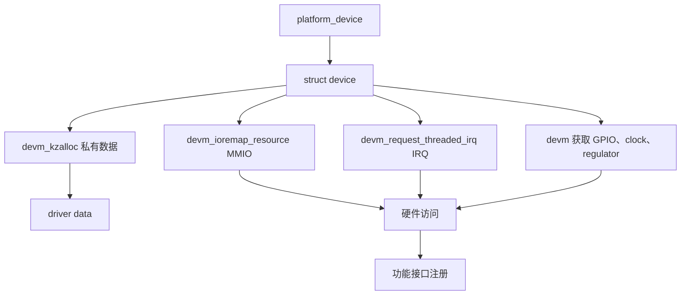

私有数据应围绕一个实际 device 实例定义。

```c
struct board_lab {
    struct device *dev;
    void __iomem *base;
    int irq;
    struct clk *clk;
    struct gpio_desc *enable_gpio;
    struct mutex lock;
    struct work_struct event_work;
    bool running;
};
```

dev 指针用于带设备名的日志、devres 管理和与其他框架交互。

base 是映射后的 I/O memory 指针，只能使用适当的 I/O accessor 访问。

irq、clk 与 enable_gpio 都表示已经从该 device 的资源描述中取得的对象。

running 只是驱动的软件状态，不能单独代表硬件真的工作。

probe 先取得和验证资源，再初始化硬件，最后注册用户可见接口。

不要在资源尚未齐备时创建字符设备、sysfs 属性或启动工作队列。

否则 probe 后半段失败时会留下半初始化接口。

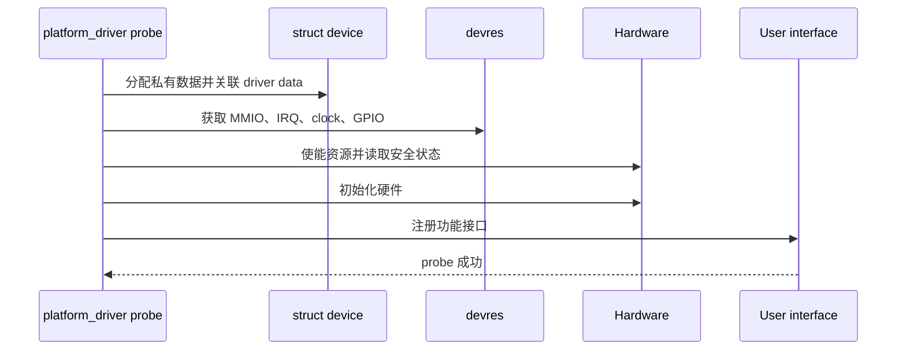

下面是一个设备树 platform driver 的骨架。

```c
static int board_lab_probe(struct platform_device *pdev)
{
    struct device *dev = &pdev->dev;
    struct board_lab *priv;
    int ret;

    priv = devm_kzalloc(dev, sizeof(*priv), GFP_KERNEL);
    if (!priv)
        return -ENOMEM;

    priv->dev = dev;
    mutex_init(&priv->lock);
    platform_set_drvdata(pdev, priv);

    priv->base = devm_platform_ioremap_resource(pdev, 0);
    if (IS_ERR(priv->base))
        return PTR_ERR(priv->base);

    priv->irq = platform_get_irq(pdev, 0);
    if (priv->irq < 0)
        return priv->irq;

    priv->enable_gpio = devm_gpiod_get_optional(dev, "enable",
                                                 GPIOD_OUT_LOW);
    if (IS_ERR(priv->enable_gpio))
        return PTR_ERR(priv->enable_gpio);

    ret = board_lab_hw_init(priv);
    if (ret)
        return ret;

    return 0;
}
```

示例刻意没有假设你的硬件一定有 MMIO、IRQ 或 enable GPIO。

真正驱动只应获取它实际拥有的资源。

例如单纯的 board-lab 节点可先只用 devm_kzalloc 和 platform_set_drvdata 来观察绑定。

待设备树补齐 reg、interrupts 或 GPIO 属性后，再按资源逐项加入。

platform_set_drvdata 把私有数据关联到该 platform device。

在回调中可用 platform_get_drvdata 找回同一实例的数据。

不要用单个全局 static 指针存放所有板级设备的状态。

一旦同类设备有两个实例、发生解绑重绑或并发回调，全局状态会迅速失去归属。

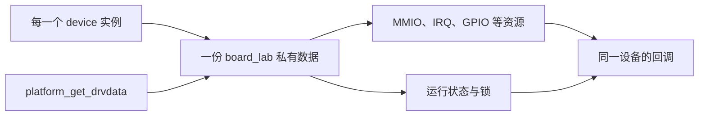

### devm 解决什么，不能解决什么

devm 前缀的 API 将资源登记到当前 struct device 的 devres 列表。

当 probe 失败或 driver 从 device 解绑时，driver core 会按相应生命周期释放这些已登记资源。

这使大量常见错误路径不再需要手写成多层 goto 标签。

但 devm 不是“所有清理都可以忽略”的许可证。

它管理的是已经成功登记的资源。

硬件停止顺序、未完成 DMA、workqueue、定时器、外部设备安全态和跨设备引用仍需要驱动自己定义。

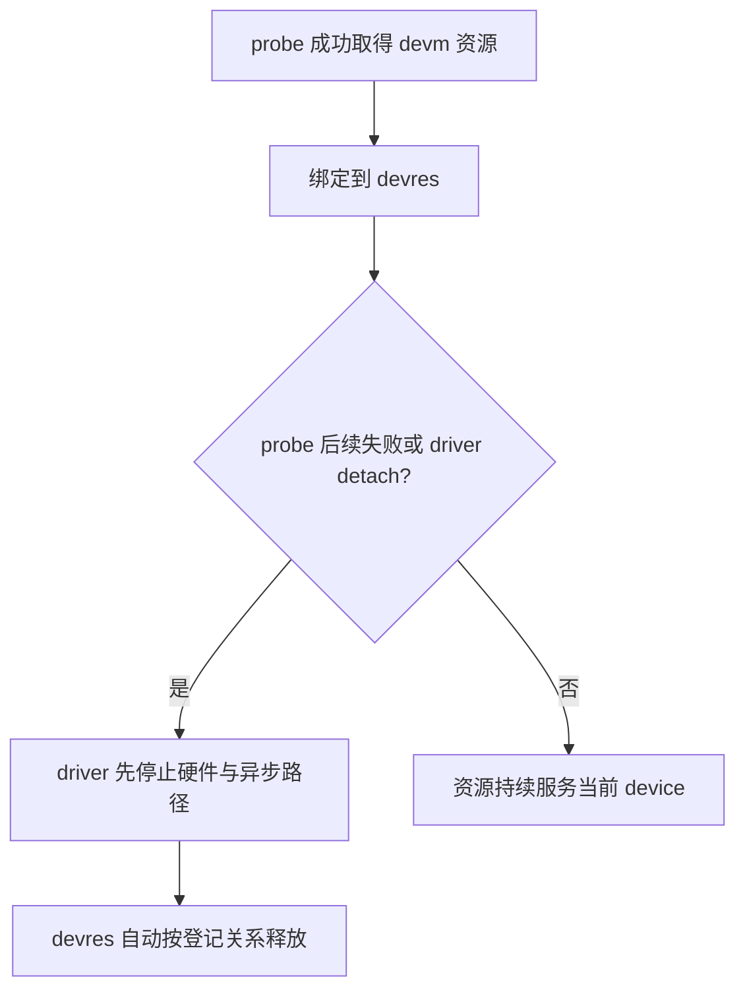

例如，MMIO 映射应使用能理解 platform resource 的高层 helper。

```c
priv->base = devm_platform_ioremap_resource(pdev, 0);
if (IS_ERR(priv->base))
    return PTR_ERR(priv->base);
```

这种写法同时从平台资源中取得寄存器范围，并在失败或解绑时交给 devres 管理映射释放。

不要先手写物理地址，再调用通用 ioremap。

那会绕过设备树 resource 转换、范围检查和平台特定 I/O 映射要求。

中断资源也应绑定到 device：

```c
ret = devm_request_threaded_irq(dev, priv->irq,
                                board_lab_irq,
                                board_lab_irq_thread,
                                IRQF_ONESHOT,
                                dev_name(dev), priv);
if (ret)
    return dev_err_probe(dev, ret, "request IRQ failed\n");
```

threaded IRQ 的具体必要性取决于处理函数是否需要睡眠。

示例重点是最后一个参数 priv 只属于这一份 device 实例。

所有日志使用 dev_err、dev_warn 或 dev_dbg，让日志自动带上设备名。

这比裸 printk 更容易在有多个相似外设时关联对象。

```c
dev_dbg(dev, "resource ready: irq=%d\n", priv->irq);
```

### 把错误路径设计成实验对象

不要等硬件异常时才第一次走 probe 错误路径。

在开发版本中，可以让一个非关键资源暂时缺失，观察 dmesg、sysfs 和解绑后的状态。

例如暂时从测试节点移除一个可选 GPIO 属性。

或者在 board_lab_hw_init 的特定检查后返回一个明确错误。

验收点是没有用户接口残留、没有重复 probe 资源占用、没有后续 IRQ 访问已释放私有数据。

这种测试比只看一次正常 probe 更能验证 device 与资源真正绑定在同一生命周期上。

## 4. 第三步：明确 remove、shutdown 与 PM 回调的责任边界

probe 成功只是生命周期的开始。

driver 还必须面对解绑、系统关机、重启、suspend/resume 和错误恢复。

这些路径不能简单理解为“devm 会自动释放”。

应先停止让硬件继续产生新事件的来源，再同步异步执行单元，最后让 devres 回收资源。

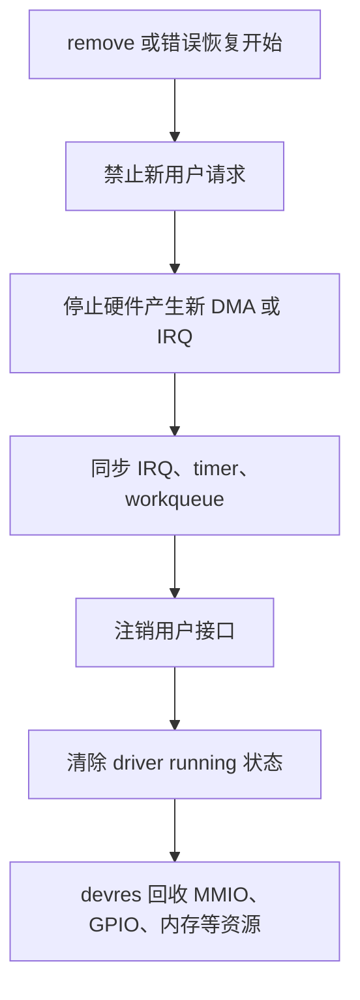

对于简单、不可热插拔的 platform 驱动，remove 仍然不能被视为永远不会发生。

模块卸载、手工 unbind、设备热重建和测试代码都可能触发它。

若 remove 不安全，驱动的错误恢复和长期维护同样不安全。

一个最小 remove 应先取消所有异步活动。

```c
static int board_lab_remove(struct platform_device *pdev)
{
    struct board_lab *priv = platform_get_drvdata(pdev);

    mutex_lock(&priv->lock);
    priv->running = false;
    board_lab_stop_hw(priv);
    mutex_unlock(&priv->lock);

    cancel_work_sync(&priv->event_work);
    return 0;
}
```

上例假定结构中存在 event_work。

若你的驱动没有 workqueue，就不应复制这行代码。

真正要掌握的是顺序：先让新任务无法进入，再停止硬件，再等待旧任务退出。

在这一顺序完成前，不能允许 devm 管理的私有数据和寄存器映射被回收。

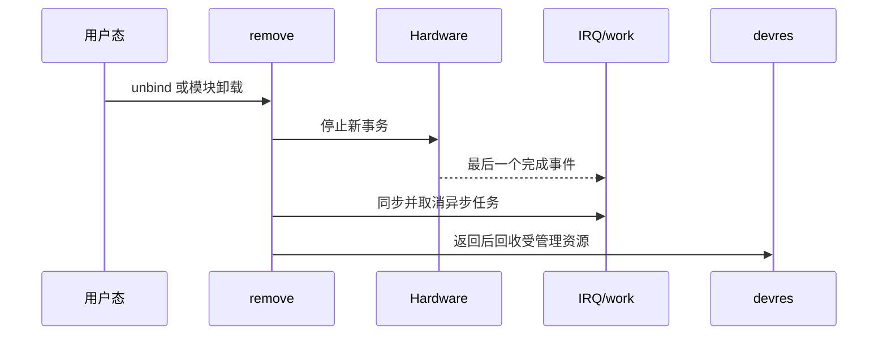

shutdown 回调用于系统关机或重启前将硬件放到安全状态。

它应聚焦于硬件停止、输出安全电平和防止异常总线访问。

不要在 shutdown 中依赖用户态守护进程仍然可用。

suspend/resume 则需要保存和恢复运行状态。

是否允许该设备在 suspend 时作为唤醒源、是否需要保持 regulator、是否需要重新下载配置，都要按硬件需求定义。

不能用一个空的 PM 回调假装已经支持低功耗。

### 使用 devm_add_action 处理需要顺序的受管理动作

某些资源可以获取后自动释放，但其启用和关闭还需要成对处理。

时钟是常见例子。

```c
static void board_lab_clk_disable(void *data)
{
    clk_disable_unprepare(data);
}

priv->clk = devm_clk_get(dev, NULL);
if (IS_ERR(priv->clk))
    return PTR_ERR(priv->clk);

ret = clk_prepare_enable(priv->clk);
if (ret)
    return ret;

ret = devm_add_action_or_reset(dev, board_lab_clk_disable, priv->clk);
if (ret)
    return ret;
```

这里先成功使能时钟，再把关闭操作登记为 device 的受管理 action。

若登记失败，or_reset 形式会立即执行关闭动作。

当 device detach 时，该 action 也会被调用。

这比“时钟获取由 devm 管理，所以启用状态也一定自动关闭”的假设更明确。

对于 regulator、DMA、固件或跨子系统对象，也应逐项确认获取、启用、停止和释放分别属于谁。

## 5. 第四步：用 sysfs、class 与解绑回归验证对象没有泄漏

kobject 是 device、driver、bus 和 class 能出现在 sysfs 中的共同基础。

普通外设驱动通常不需要手工创建裸 kobject。

应该优先使用所属框架提供的 struct device、attribute group、class 或子系统注册接口。

直接操作 kobject 容易绕过引用计数、release 回调和命名层级，适合内核框架实现，不适合普通 board driver 的日常路径。

```mermaid
flowchart TB
    A[kobject 基础] --> B[struct device]
    A --> C[struct device_driver]
    A --> D[struct bus_type]
    A --> E[struct class]
    B --> F[设备 sysfs 目录]
    C --> G[driver sysfs 目录]
    D --> H[/sys/bus 视图]
    E --> I[/sys/class 功能视图]
```

用户态属性应放在语义正确的位置。

硬件实例自身的只读状态，例如 ready、revision 或错误计数，适合作为该 device 的 attribute group。

一个 subsystem 中所有设备共享的全局策略，才应考虑 driver 或 class 属性。

创建 /dev 节点、输入设备、IIO 通道或 LED 通常应交给相应内核子系统。

不要为了导出一个调试数值额外创建一套 class 和 device node。

```c
static ssize_t ready_show(struct device *dev,
                          struct device_attribute *attr, char *buf)
{
    struct board_lab *priv = dev_get_drvdata(dev);

    return sysfs_emit(buf, "%u\n", priv->running);
}
static DEVICE_ATTR_RO(ready);

static struct attribute *board_lab_attrs[] = {
    &dev_attr_ready.attr,
    NULL,
};
ATTRIBUTE_GROUPS(board_lab);
```

该属性只应反映稳定、易理解且无副作用的状态。

读取 sysfs 属性不应触发硬件复位、长时间 I2C 事务或会改变设备模式的操作。

若要写入属性，必须定义合法值、权限、并发规则和失败行为。

不要把所有内部寄存器都暴露给用户态。

这既会破坏驱动状态机，也会使产品接口无法长期维护。

```mermaid
flowchart LR
    A[device 实例状态] --> B[device attribute group]
    B --> C[/sys/devices 中的属性]
    C --> D[按 bus 视图的符号链接]
    D --> E[用户态只读观察]
    F[子系统接口] --> G[/sys/class 或 /dev]
    G --> H[稳定功能 ABI]
```

若异步工作、open 文件或其他对象要在 probe/remove 之外保存 struct device 指针，必须显式处理对象引用。

devm 分配的私有数据不能因为某个后台线程还持有裸指针就延长生命周期。

需要保留 device 时使用 get_device，完成后使用 put_device。

同时还要让 remove 停止相关异步工作，避免新的操作在解绑过程中继续取用私有数据。

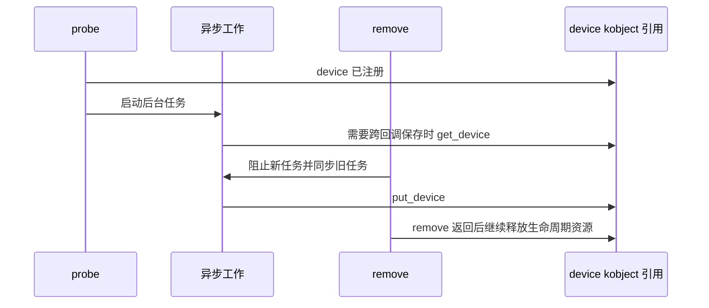

这不是要求每个驱动都手工 get_device。

而是要求在持有对象跨越普通回调边界时，明确知道引用由谁持有、何时释放。

不清楚时，优先把异步任务收敛到 driver 自己的私有数据和 remove 同步逻辑中，再阅读同类内核驱动的引用方案。

### 用安全的 bind 与 unbind 完成生命周期回归

只对本章创建的 board-lab 测试节点，或确认不会影响系统功能的实验驱动，执行 bind/unbind。

操作前保存 dmesg、目标 sysfs 路径和用户接口状态。

```bash
DRV=/sys/bus/platform/drivers/longway-board-lab
DEV=actual-device-name

echo "$DEV" > "$DRV/unbind"
dmesg -T | tail -100
test -L "/sys/bus/platform/devices/$DEV/driver" && echo bound || echo unbound

echo "$DEV" > "$DRV/bind"
dmesg -T | tail -100
readlink "/sys/bus/platform/devices/$DEV/driver"
```

实际 driver 目录名和 device 名必须由前文 sysfs 观察得到。

禁止把变量直接替换为存储、网络、console、显示或正在使用的摄像头设备。

解绑后，driver link 应消失，受该 driver 创建的功能接口也应按设计撤销。

重新绑定后，probe 应完整执行一次，资源不应因为上次绑定残留而失败。

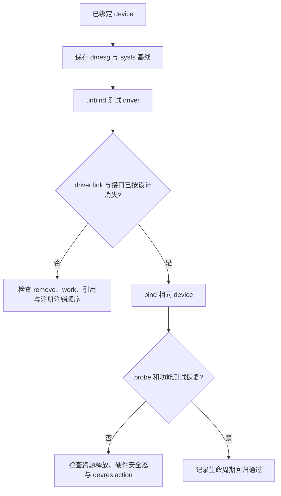

验收时特别关注以下反常现象。

解绑后仍有 IRQ 打印，说明硬件或异步路径没有在资源释放前停止。

重绑后提示资源 busy，说明 clock、GPIO、DMA、regulator 或用户接口没有被正确释放。

重绑后 device 存在但用户接口缺失，说明 probe 的子系统注册或错误路径不完整。

重复 bind/unbind 后内存增长，说明 devm 之外仍有未回收对象，或引用计数没有归还。

### 设备模型回归矩阵

| 场景 | 操作 | 通过条件 | 首先检查 |
| --- | --- | --- | --- |
| DTB 枚举 | 冷启动并导出 live DT | 节点、status、compatible 正确 | 构建与 DTB 装载 |
| driver 匹配 | 检查 driver link 与 dmesg | probe 只对目标设备执行 | of_match_table 与模块 |
| 资源获取 | 记录 MMIO、IRQ、GPIO、clock | 资源名与 DTS 对应 | devm helper 与错误返回 |
| 功能接口 | 读取 device 属性或子系统节点 | 语义、权限与值正确 | class、attribute group、注册顺序 |
| unbind | 对实验对象解绑 | 无残留 IRQ、接口和引用 | remove 与异步路径 |
| rebind | 对同一对象重新绑定 | probe 成功且功能恢复 | devres action、硬件初始化 |
| shutdown/PM | 按板卡能力执行 | 输出安全且恢复可解释 | stop 顺序与状态保存 |

### 本章练习

为自己的一个非关键 platform 外设画出 device model 对象图。

图中必须包含设备树节点、parent、bus、device、driver、sysfs 路径和用户接口。

在 probe 中列出每项资源的获取、启用、停止和释放责任。

为一个可安全测试的驱动完成一次 unbind/rebind，保存前后 driver link、dmesg 和功能接口结果。

说明哪几项资源由 devm 自动管理，哪几项仍需要在 remove 或受管理 action 中显式停止。

### 本章验收

完成本章后，应能独立解释：

- 从设备树节点到 platform device、driver 匹配和 probe 的完整链路；
- /sys/devices、/sys/bus 和 /sys/class 为何会从不同视角出现同一个设备；
- kobject、device、driver、bus 和 class 各自承担的生命周期职责；
- devm 能自动回收哪些资源，不能替代哪些硬件停止与并发同步操作；
- 为什么 remove、shutdown 和 PM 回调必须与 probe 一起设计；
- 如何通过一次安全的 unbind/rebind 验证资源、sysfs 接口和对象引用没有泄漏。

当这些对象关系能在运行时 sysfs、日志和回归实验中被验证，设备模型就不再是抽象名词，而是驱动开发最可靠的定位地图。

> 🏷️ Linux BSP · device model · platform bus · sysfs · kobject · class · devm · 驱动生命周期
