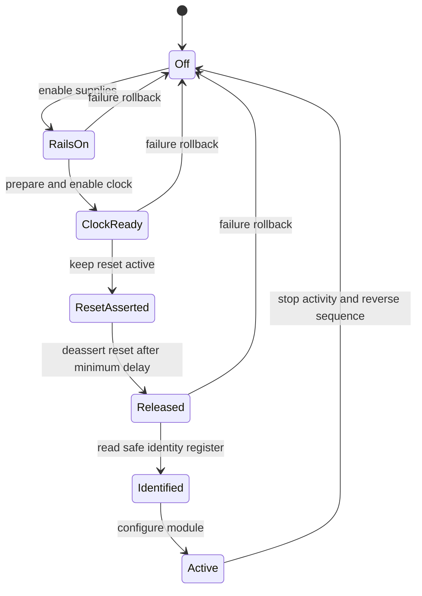
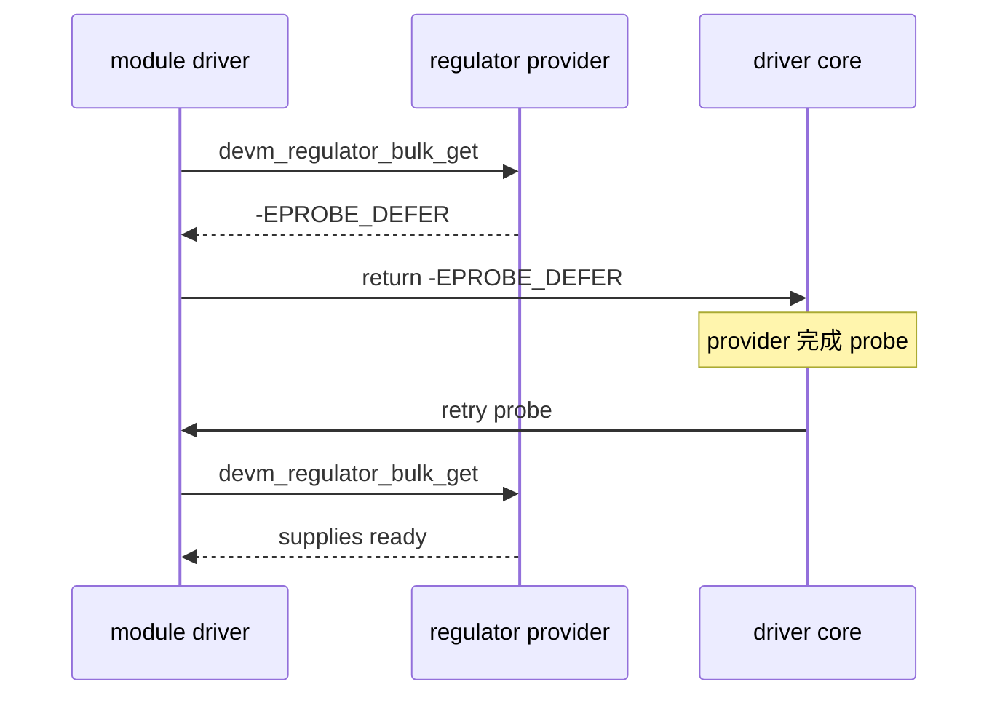
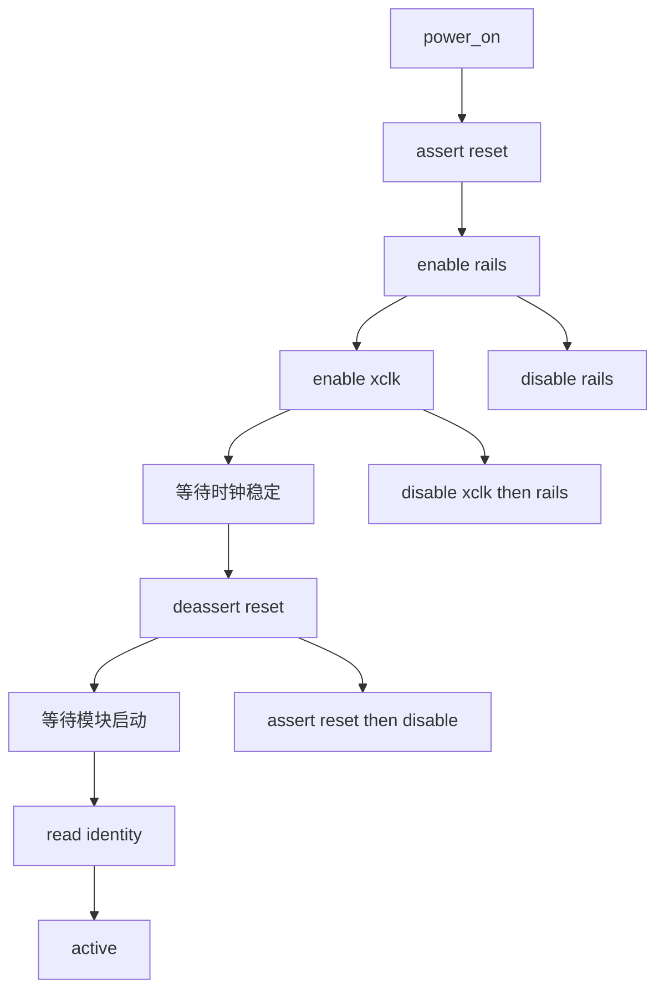
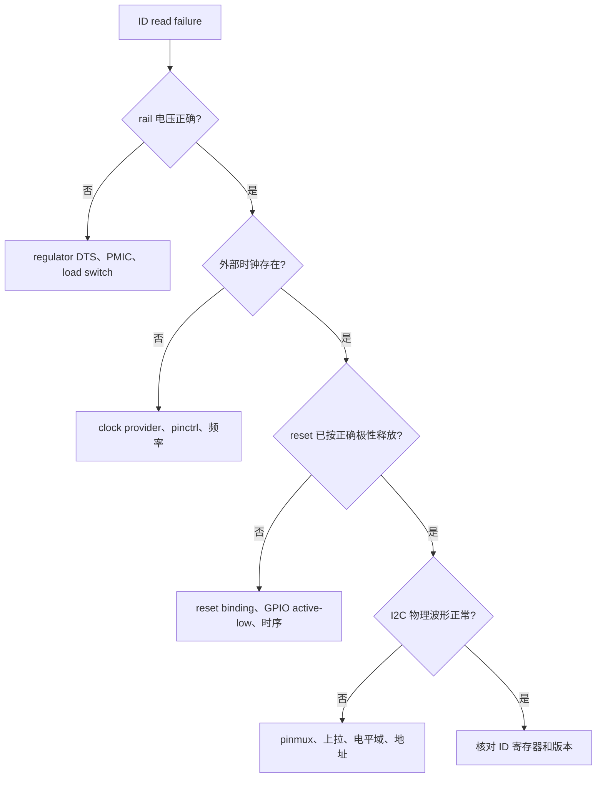
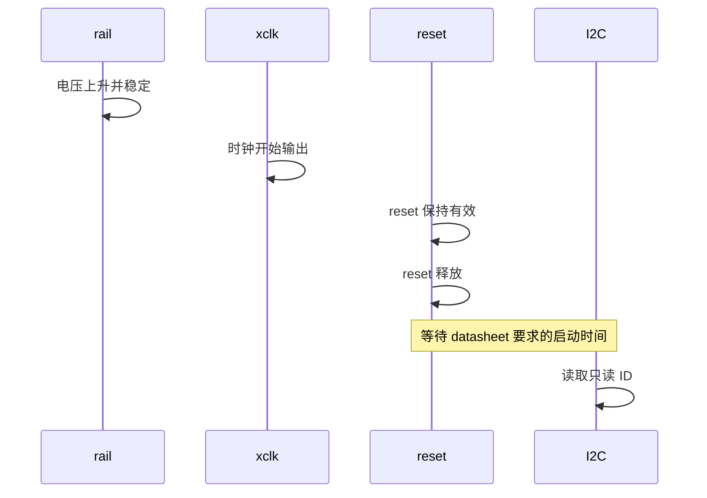

设备树中有 compatible，不代表外设已经具备工作条件。

一个摄像头、无线模块或传感器通常需要多路电源达到稳定值，需要外部参考时钟输出，需要复位脚按规定保持和释放，最后才能通过 I2C 或其他控制总线回应识别命令。

任何一步缺失，probe 的表面现象都可能只是“读 ID 失败”。

本章以一个由 platform 驱动管理、最终通过 I2C 读取身份寄存器的板级模块为例，建立完整的资源顺序和失败回滚方法。

示例只描述通用 Linux 驱动结构。具体电压、延时、引脚和时钟频率必须以实际模块 datasheet、原理图和 RV1126 SDK 的设备树为准。

## 1. 先把“能回应总线”拆成可验证的前置条件

总线读写是上电时序的最后一步，不是第一步。

当 I2C address NACK、读回全 0、全 1 或偶发识别失败时，先不要修改寄存器地址或重复发送命令。

先确认模块是否已经处于可以接收该命令的供电和复位状态。

| 资源 | 常见来源 | 在实验中的职责 | 应如何观察 |
| --- | --- | --- | --- |
| 供电 rail | PMIC、固定 regulator、load switch | 给模拟、数字、I/O 域供电 | regulator 状态、电压测试点 |
| 参考时钟 | CRU/PLL、外部 oscillator | 提供工作或输入时钟 | clk summary、示波器 |
| 硬件复位 | reset controller 或 GPIO | 让模块从已知状态开始 | 管脚波形、寄存器状态 |
| pinctrl | SoC 管脚复用和 bias | 选择 reset、clock、I2C 等功能 | pinctrl debug 信息 |
| 控制总线 | I2C/SPI | 读取 ID、加载配置 | i2cdetect 仅限安全场景、驱动日志 |

把这些资源按依赖顺序写成状态机。



这里的 ResetAsserted 放在时钟已准备之后只是一个常见模型，不是普遍真理。

有些器件要求上电前先把 reset 拉低；有些要求先有特定 rail，再开始输入时钟；还有些没有独立 reset。

正确顺序必须来自 datasheet 的 power-up timing 图，而不是从其他 sensor 或网络驱动复制。

### 写出本次实验的验收口径

本章不以“probe 返回 0”作为完成标志。

至少要同时满足以下结果：

1. 每一路必需 rail 的 enable 状态与实测电压一致；
2. 模块时钟在 release reset 前已经出现并稳定；
3. reset 释放的时间与电平符合电路极性；
4. 驱动只在资源都就绪后读取一个无副作用的 ID 寄存器；
5. 任意一步失败后，已经取得的资源会按安全顺序关闭；
6. 连续 bind、unbind、再 bind 不会留下 regulator、clock 或 reset 的占用。


如果某项没有可观察方法，它就还只是“感觉已配置”，不是可验证条件。

## 2. 第一步：在 DTS 中描述资源连接，而不是硬编码编号

设备树表达的是板子连接关系：这个模块由哪些 regulator 供电、引用哪一路 clock、被哪个 reset controller 或 GPIO 控制。

驱动通过标准 framework 根据名字取得资源，而不应写入固定寄存器地址、全局 GPIO 编号或某颗 PMIC 的私有编号。

下面片段仅展示关系和命名方式。

```dts
board_module: board-module {
    compatible = "longway,board-module";
    status = "okay";

    pinctrl-names = "default", "sleep";
    pinctrl-0 = <&board_module_default>;
    pinctrl-1 = <&board_module_sleep>;

    avdd-supply = <&vcc_module_2v8>;
    dvdd-supply = <&vcc_module_1v2>;
    dovdd-supply = <&vcc_module_1v8>;

    clocks = <&cru MODULE_MCLK>;
    clock-names = "xclk";

    resets = <&reset_controller MODULE_RESET>;
    reset-names = "core";

    reset-gpios = <&gpioX SOC_GPIO_PIN GPIO_ACTIVE_LOW>;
};
```

某些模块使用 reset controller，某些模块只使用一个外部 reset GPIO，也有模块同时具备两个层次。

不要因为设备树能同时写 resets 和 reset-gpios 就盲目两个都控制。

先从原理图和模块资料确认它们分别控制谁：可能一个是 SoC 内部接口复位，另一个才是芯片硬件复位。

### regulator 名称是驱动和 DTS 的契约

属性 avdd-supply 对应驱动中的 avdd，dvdd-supply 对应 dvdd。

命名不匹配时，devm_regulator_bulk_get 会失败；把错误改成忽略并继续，会让硬件在未供电状态下访问总线。

```c
static const char * const board_module_supply_names[] = {
    "avdd",
    "dvdd",
    "dovdd",
};

struct board_module {
    struct device *dev;
    struct regulator_bulk_data supplies[
        ARRAY_SIZE(board_module_supply_names)];
    struct clk *xclk;
    struct reset_control *core_reset;
    struct gpio_desc *reset_gpio;
    struct regmap *regmap;
    bool powered;
};
```

bulk data 的 supply 字段应在 probe 中显式填入，这能让报错日志准确指向缺失的 rail。

```c
static int board_module_get_resources(struct board_module *priv)
{
    struct device *dev = priv->dev;
    size_t i;
    int ret;

    for (i = 0; i < ARRAY_SIZE(priv->supplies); i++)
        priv->supplies[i].supply = board_module_supply_names[i];

    ret = devm_regulator_bulk_get(dev, ARRAY_SIZE(priv->supplies),
                                  priv->supplies);
    if (ret)
        return dev_err_probe(dev, ret, "failed to get supplies\n");

    priv->xclk = devm_clk_get(dev, "xclk");
    if (IS_ERR(priv->xclk))
        return dev_err_probe(dev, PTR_ERR(priv->xclk),
                             "failed to get xclk\n");

    priv->core_reset =
        devm_reset_control_get_optional_exclusive(dev, "core");
    if (IS_ERR(priv->core_reset))
        return dev_err_probe(dev, PTR_ERR(priv->core_reset),
                             "failed to get core reset\n");

    priv->reset_gpio = devm_gpiod_get_optional(dev, "reset",
                                                GPIOD_OUT_HIGH);
    if (IS_ERR(priv->reset_gpio))
        return dev_err_probe(dev, PTR_ERR(priv->reset_gpio),
                             "failed to get reset GPIO\n");

    return 0;
}
```

可选资源只应在硬件确实允许缺失时使用 optional helper。

若某块板必须依赖某一路电源，却把它标为 optional，DTS 缺失会在后续 I2C 失败时才暴露，定位成本更高。

### 让 deferred probe 表达真实依赖

PMIC、clock provider、reset controller 可能尚未注册。

resource helper 返回 -EPROBE_DEFER 时，驱动应将该返回值交还 driver core，等待提供方就绪后重试。



不要写一个固定重试循环或 sleep 后再次 devm_clk_get。

资源的注册顺序属于内核设备模型，延迟 probe 才能把依赖关系交给正确的机制处理。

## 3. 第二步：把上电、复位和身份识别写成可回滚的单一路径

真正容易出错的是失败路径。

例如 avdd 已打开、dvdd 打开失败，或者时钟已使能但 I2C ID 读取失败，驱动必须让系统回到可再次尝试的安全状态。

不要把 enable 分散到多个函数，再在每个失败分支中临时拼凑关闭逻辑。

将资源的正常顺序和回滚顺序收拢在 power_on、power_off 两个函数中。



以下代码中的延迟数值只是结构示例，不能当作模块参数。

实际值应替换为该模块数据手册要求的最小值，并在注释中写明来源。

```c
static int board_module_power_on(struct board_module *priv)
{
    int ret;

    if (priv->core_reset) {
        ret = reset_control_assert(priv->core_reset);
        if (ret)
            return ret;
    }

    if (priv->reset_gpio)
        gpiod_set_value_cansleep(priv->reset_gpio, 1);

    ret = regulator_bulk_enable(ARRAY_SIZE(priv->supplies), priv->supplies);
    if (ret)
        return ret;

    ret = clk_prepare_enable(priv->xclk);
    if (ret)
        goto disable_supplies;

    usleep_range(1000, 1500);

    if (priv->core_reset) {
        ret = reset_control_deassert(priv->core_reset);
        if (ret)
            goto disable_clock;
    }

    if (priv->reset_gpio)
        gpiod_set_value_cansleep(priv->reset_gpio, 0);

    usleep_range(5000, 7000);
    priv->powered = true;
    return 0;

disable_clock:
    clk_disable_unprepare(priv->xclk);
disable_supplies:
    regulator_bulk_disable(ARRAY_SIZE(priv->supplies), priv->supplies);
    return ret;
}
```

reset GPIO 使用 GPIOD_OUT_HIGH 后读写的是逻辑值。

若 DTS 声明 GPIO_ACTIVE_LOW，gpiod_set_value_cansleep 的 1 表示“让 reset 处于有效状态”，不需要在代码里再按物理电平取反。

这与前一章的按键极性原则完全相同：极性只在 DTS 层描述一次，驱动使用 logical value。

### 把关闭动作设计成可重复调用

remove、probe 失败、runtime PM 关闭和系统 suspend 都可能要求停止模块。

power_off 应当即使在模块只完成一半上电时也不产生副作用。

```c
static void board_module_power_off(struct board_module *priv)
{
    if (priv->reset_gpio)
        gpiod_set_value_cansleep(priv->reset_gpio, 1);

    if (priv->core_reset)
        reset_control_assert(priv->core_reset);

    if (!priv->powered)
        return;

    clk_disable_unprepare(priv->xclk);
    regulator_bulk_disable(ARRAY_SIZE(priv->supplies), priv->supplies);
    priv->powered = false;
}
```

具体硬件有时要求先停止数据传输、等待帧结束、再关时钟和电源。

因此 power_off 不应在仍有 I2C 事务、DMA、streaming 或 workqueue 运行时被直接调用。

先停上层活动，再执行资源关闭，最后才让 devm 释放 descriptor 和私有内存。

### 身份寄存器只在时序完成后读取

模块的 ID 读取应放在 power_on 成功之后。

选择一个只读、无副作用的寄存器，读取预期值并将失败视为上电或连接问题的一部分。

```c
static int board_module_identify(struct board_module *priv)
{
    unsigned int id;
    int ret;

    ret = regmap_read(priv->regmap, MODULE_CHIP_ID_REG, &id);
    if (ret)
        return dev_err_probe(priv->dev, ret, "failed to read module ID\n");

    if (id != MODULE_CHIP_ID_VALUE)
        return dev_err_probe(priv->dev, -ENODEV,
                             "unexpected module ID: 0x%x\n", id);

    return 0;
}
```

MODULE_CHIP_ID_REG 和 MODULE_CHIP_ID_VALUE 必须由实际模块数据手册确定。

在未确认寄存器安全性的情况下，不要用 i2cset 等工具向生产硬件随意写寄存器。

## 4. 第三步：用各层观测点定位“ID 读失败”

同样是 I2C 读失败，故障位置可能完全不同。

需要按照资源层次收集证据，而不是直接在驱动中增加延时。



先用 regulator 和 clock 的 debug 信息验证 framework 的软件状态。

这些信息证明 Linux 是否请求了资源，但不能替代电压和时钟的实际测量。

```sh
mount -t debugfs none /sys/kernel/debug
find /sys/kernel/debug -maxdepth 3 -type f | grep -E 'regulator|clk'
cat /sys/kernel/debug/regulator/regulator_summary
cat /sys/kernel/debug/clk/clk_summary | grep -i 'xclk\|module'
```

不同内核可能没有相同的 debugfs 路径或开启选项。

若文件不存在，检查内核配置，而不是假设资源没有工作。

对真正的板端时序，示波器至少应同时观察 rail、xclk 和 reset。



如果 rail、xclk、reset 波形都正确而 I2C 仍无 ACK，才重点检查 SDA/SCL 上拉、电平转换器、总线地址和 pinctrl 复用。

如果 ACK 正常但 ID 不符，检查模块型号、寄存器位宽、读写序列和是否仍处于 boot/standby 状态。

### clock、reset 与 regulator 错误的典型区分

| 现象 | 更接近的资源层 | 优先验证 |
| --- | --- | --- |
| regulator_get 返回 defer | PMIC/provider 尚未就绪 | dmesg deferred probe 与 DTS phandle |
| enable 后电压仍为 0 | load switch、PMIC 配置或电路 | enable state 与测试点 |
| clk summary 有名称但 rate 为 0 | parent、clock-names 或 provider 配置 | 时钟树和实际管脚波形 |
| reset 释放后仍像被按住 | active-low 语义或外部拉电阻错误 | reset 管脚电平与原理图 |
| 首次 bind 成功、第二次失败 | power_off 不完整或资源未停止 | unbind 日志与各资源计数 |
| 冷启动失败、热重启成功 | 上电斜率、最小延迟或 bootloader 残留状态 | 示波器与冷启动复现 |

在日志中为每个状态变化记录资源名和阶段，而不是只打印“init failed”。

日志应帮助人判断失败发生在 get resource、enable、deassert 还是 identity read。

## 5. 第四步：通过错误注入、解绑和重复冷启动验证生命周期

资源顺序正确的驱动，必须也能安全地失败和再次运行。

先在不影响关键启动资源的开发板上，逐一制造可控的失败条件。

例如临时禁用一个非关键模块 rail 的 DTS phandle、给错误的 clock-names、保持 reset 不释放，观察驱动是否返回明确错误并回滚已经打开的资源。

不要在正在运行根文件系统、DDR、console 或 PMIC 核心供电上做这类实验。


为模块驱动准备最小 remove 路径。

它应先停止数据流和异步任务，再调用 power_off。devm 会在 device 销毁时释放 regulator、clock、reset 和 GPIO descriptor，但不会替业务代码停止正在运行的工作。

```c
static int board_module_remove(struct platform_device *pdev)
{
    struct board_module *priv = platform_get_drvdata(pdev);

    /* Stop and synchronize any I2C, DMA or workqueue activity here. */
    board_module_power_off(priv);

    return 0;
}
```

如果本驱动没有 workqueue、streaming 或 recovery path，不要为示例硬加这些成员。

重点是任何会在资源关闭后继续访问 I2C、MMIO 或 GPIO 的执行单元，都必须先停止并同步。

### 一次完整的板端验收

| 步骤 | 操作 | 需要保留的证据 |
| --- | --- | --- |
| 1 | 冷启动后加载驱动 | resource get、power_on、identity 成功日志 |
| 2 | 测 rail、xclk、reset | 三条波形与数据手册时序对比 |
| 3 | 执行上层最小功能 | I2C 访问或模块状态稳定 |
| 4 | unbind | 无 I2C 超时、无 resource busy、资源状态回落 |
| 5 | rebind | 再次识别成功，状态没有依赖旧实例 |
| 6 | 连续循环 | 多轮无偶发 probe fail 和电压残留 |

可以先用 sysfs 找到实际 platform device 和 driver 名称，再进行解绑。

```sh
ls -l /sys/bus/platform/drivers/longway-board-module
readlink /sys/bus/platform/devices/board-module/driver

echo board-module > /sys/bus/platform/drivers/longway-board-module/unbind
dmesg | tail -n 100

echo board-module > /sys/bus/platform/drivers/longway-board-module/bind
dmesg | tail -n 100
```

这只是命名格式示例。执行前必须以当前 sysfs 的真实节点替换，避免解绑无关设备。

在有图像采集或网络数据流的模块上，先用上层接口停止 stream，再执行 unbind。

### 本章练习

选择一个带独立 reset 和至少一条供电 rail 的非关键模块，整理其数据手册的上电、时钟、复位和首个 I2C 访问约束。

在 DTS 中为每条必需 rail、时钟和 reset 建立带名字的 phandle。

为 driver 实现一对可重复调用的 power_on 和 power_off，并在身份寄存器读取失败时验证回滚路径。

最后完成冷启动、十轮 bind/unbind、示波器时序和软件资源状态的联合记录。

### 本章验收

完成本章后，应能独立回答：

- 为什么 I2C 识别失败不能只从总线地址开始排查；
- regulator、clock、reset 和 pinctrl 各自表达什么硬件关系；
- 为什么 DTS 的 supply、clock-names、reset-names 必须和驱动请求名一一对应；
- 为什么 -EPROBE_DEFER 应交给 driver core 重新调度；
- 为什么 clk_prepare_enable 必须与 clk_disable_unprepare 成对出现；
- 为什么 reset 的物理电平极性应由 GPIO descriptor 统一处理；
- 为什么上电函数必须从一开始就设计失败回滚；
- 如何用冷启动、波形、解绑和重绑证明电源时序具备工程可靠性。

当模块的每一路电源、每个时钟、每次复位和每个首读总线事务都有来源、顺序与测量证据时，“偶发识别失败”才会被收敛为可定位的工程问题。

> 🏷️ Linux BSP · regulator · clock framework · reset controller · power sequence · deferred probe
