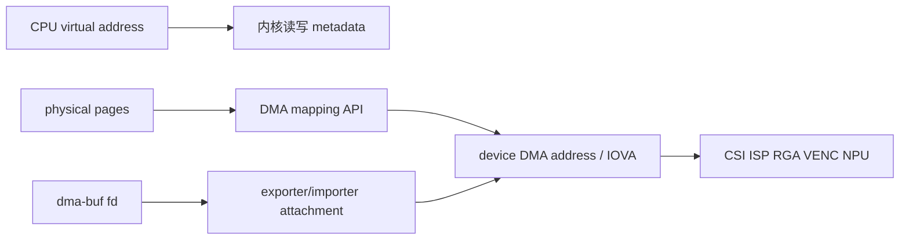
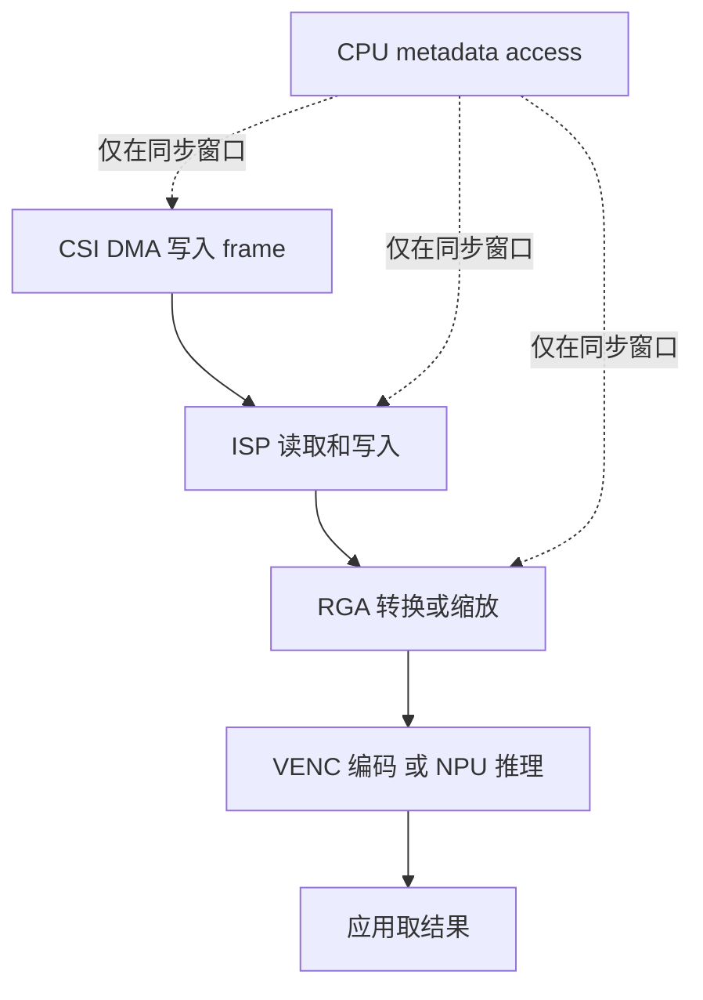
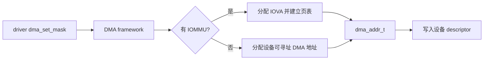
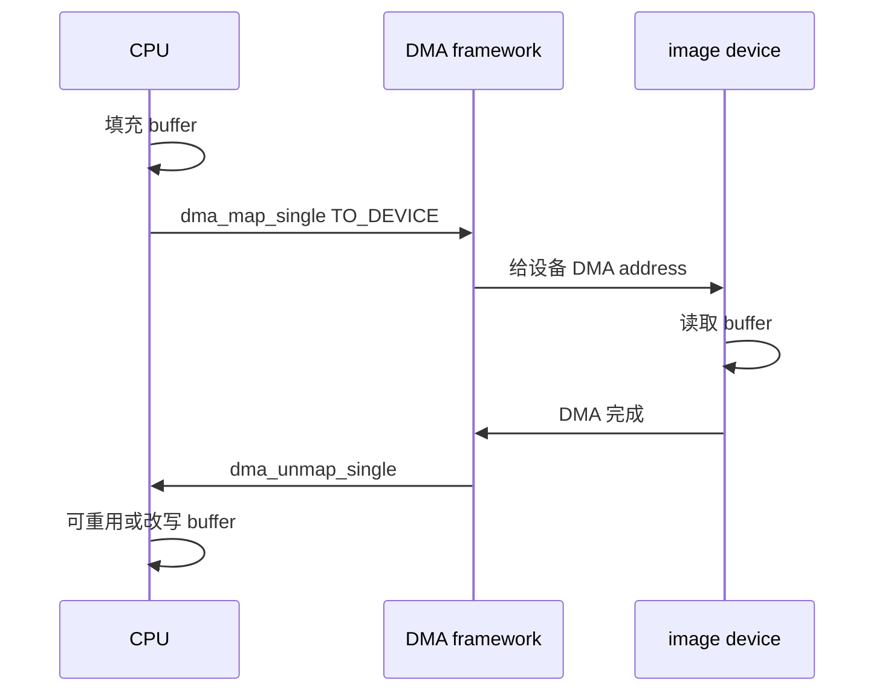
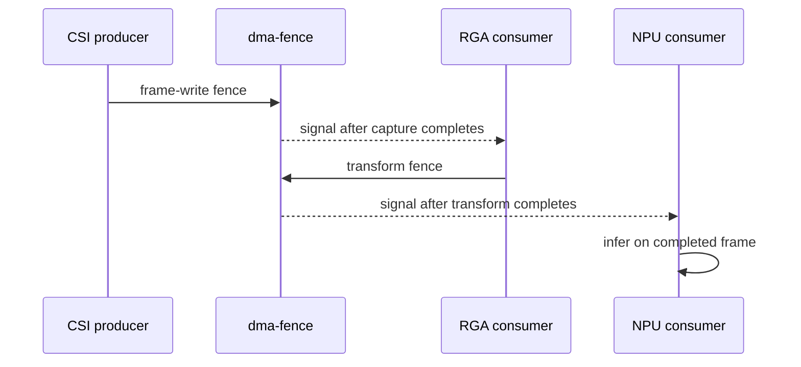
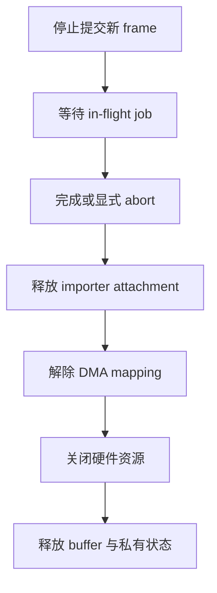

图像采集驱动拿到一块 buffer 后，CPU 能访问它，不代表 ISP、RGA、编码器和 NPU 都能访问同一个地址。

同一段存储在 CPU 虚拟地址、物理地址、设备 DMA 地址和 IOMMU 虚拟地址空间中可能有不同表示。

驱动若把 phys_addr、virt_to_phys 结果或内核指针直接写进设备描述符，简单平台上或许偶然可用，启用 IOMMU、memory encryption、DMA window 或外部设备后就会出现错帧、IOMMU fault 或随机覆写。

本章用一帧图像从 CSI 采集、经过处理模块、最终交给应用的路径，建立“地址由 DMA API 产生，所有权由同步机制保护”的工作方法。

## 1. 先将一帧图像的四种地址分开记录

假设采集端为一帧 YUV 图像准备了若干离散页面。

CPU 需要一个可访问映射来填写元数据。

DMA 设备则需要一个由其 bus 视角可用的地址，可能是直接物理地址，也可能是 IOMMU 映射后得到的 IOVA。

用户态最终拿到的 dma-buf file descriptor 只是共享对象的句柄，不是地址。



| 名称 | 谁使用 | 是否能直接互换 | 正确来源 |
| --- | --- | --- | --- |
| CPU virtual address | 内核 CPU 代码 | 否 | kmalloc、vmap、page mapping |
| physical address | MMU/内存控制器语义 | 否 | 页面管理信息，仅在允许场景查询 |
| DMA address | 某一具体 device | 否 | dma_map_* 或 dma_alloc_* |
| IOVA | 被 IOMMU 翻译的 device | 否 | IOMMU/DMA mapping 自动分配 |
| dma-buf fd | 用户态与子系统间传递 | 否 | dma_buf_fd 或已有 exporter |

地址的关键不在数值大小，而在“谁拥有这段地址空间、由谁建立映射、何时撤销映射”。

一个设备 DMA 地址只对产生它的 struct device 有意义。

把 CSI 的 dma_addr_t 交给 NPU，不等于 NPU 一定能使用；正确做法是让 NPU 作为 dma-buf importer 为自身 device 建立 attachment 和 mapping。

### 从硬件数据路径开始，而不是从 API 名称开始

先画出当前产品的 producer、consumer 和 CPU 访问窗口。



若某一步需要 CPU 改写图像内容，就需要界定设备何时停止访问、CPU 何时 begin/end access，以及下一个设备何时开始读取。

零拷贝不等于“没有同步”；它只是避免把像素复制到另一块存储。

## 2. 第一步：让 DTS 和 DMA framework 表达设备的寻址能力

IOMMU 通常以一个 provider 和若干 client 的关系出现在设备树中。

client 节点通过 iommus 属性关联到对应 IOMMU domain；具体 cell 数量、stream ID 和 binding 由 SoC 内核 dt-bindings 定义。

以下片段只展示关系，不能替换当前 SDK 中的 IOMMU ID。

```dts
camera_dma: camera-dma@SOC_ADDR {
    compatible = "vendor,camera-dma";
    reg = <SOC_ADDR SOC_SIZE>;
    interrupts = <SOC_IRQ IRQ_TYPE_LEVEL_HIGH>;
    iommus = <&iommu CAMERA_STREAM_ID>;
    status = "okay";
};

image_engine: image-engine@SOC_ADDR {
    compatible = "vendor,image-engine";
    reg = <SOC_ADDR SOC_SIZE>;
    iommus = <&iommu IMAGE_STREAM_ID>;
    status = "okay";
};
```

设备树不应为 driver 写入“一个固定 IOVA 基地址”。

IOVA 的分配、页表建立、TLB 维护和撤销应由 IOMMU/DMA framework 处理。

driver 只把正确的 struct device 交给 DMA API。

如果硬件明确具备硬件一致性，平台也可能通过 dma-coherent 等属性告诉内核使用对应一致性策略。是否可写、属性位于哪个节点，必须以 SoC binding 和硬件手册为准。

### DMA mask 是设备能力声明

一个只能发出 32 位 DMA 地址的旧外设，不能被分配到它无法寻址的内存。

probe 中应在任何 DMA 分配、descriptor 设置前声明设备地址位宽。

```c
static int image_engine_probe(struct platform_device *pdev)
{
    struct device *dev = &pdev->dev;
    int ret;

    ret = dma_set_mask_and_coherent(dev, DMA_BIT_MASK(32));
    if (ret)
        return dev_err_probe(dev, ret, "no usable 32-bit DMA mask\n");

    return 0;
}
```

DMA_BIT_MASK(32) 只是示例。

应先确认设备的 DMA address width、IOMMU 可以提供的 address range，以及当前系统是否要支持大于 4 GiB 的内存。

把 mask 设置得比硬件能力更宽会导致设备截断地址；设置得过窄会无谓限制分配。



### 连续内存、CMA 和 SG 不是同一种要求

硬件若只支持一个连续地址加长度，必须确认它要求的是物理连续、DMA 地址连续，还是经 IOMMU 映射后 IOVA 连续。

很多多媒体硬件可接受 scatter-gather descriptor；此时页面物理上可离散，DMA API 会按该设备的约束生成 sg_table。

CMA 通常用于需要物理连续 buffer 的场景，但不是解决所有 DMA 问题的万能开关。

| 设备约束 | 应优先考虑 | 不能省略的检查 |
| --- | --- | --- |
| 单一连续 buffer | CMA 或 coherent allocation | DMA mask、大小、碎片和 cache 策略 |
| 多段 descriptor | dma_map_sg | 映射后返回的 segment 数 |
| 多设备共享图像 | dma-buf | 每个 importer 的 attachment 与 fence |
| 用户态分配共享 buffer | dma-buf heap 或子系统 allocator | format、stride、对齐与同步 |

## 3. 第二步：用 DMA API 管理 mapping，而不是手工换算地址

coherent allocation 适合小型、频繁被 CPU 和设备共同访问的控制结构，例如 DMA ring descriptor。

streaming mapping 适合大块数据 buffer，驱动必须明确 CPU 与设备的所有权切换。

两种 API 不能混用。

```c
struct image_ring {
    struct image_desc *cpu;
    dma_addr_t dma;
    size_t bytes;
};

static int image_alloc_ring(struct device *dev, struct image_ring *ring)
{
    ring->bytes = PAGE_ALIGN(64 * sizeof(*ring->cpu));
    ring->cpu = dma_alloc_coherent(dev, ring->bytes, &ring->dma,
                                   GFP_KERNEL);
    if (!ring->cpu)
        return -ENOMEM;

    memset(ring->cpu, 0, ring->bytes);
    return 0;
}

static void image_free_ring(struct device *dev, struct image_ring *ring)
{
    if (!ring->cpu)
        return;

    dma_free_coherent(dev, ring->bytes, ring->cpu, ring->dma);
    ring->cpu = NULL;
}
```

ring->dma 是设备描述符中应填的地址。

ring->cpu 仅用于 CPU 访问 descriptor，不能转换为整数后写到硬件。

对大帧 buffer，驱动可以从 page allocator、vb2 或其他子系统取得页面，再映射为 DMA segments。

```c
static int image_map_sg(struct device *dev, struct sg_table *sgt,
                        enum dma_data_direction dir)
{
    int segments;

    segments = dma_map_sg(dev, sgt->sgl, sgt->nents, dir);
    if (!segments)
        return -EIO;

    return segments;
}

static void image_unmap_sg(struct device *dev, struct sg_table *sgt,
                           enum dma_data_direction dir)
{
    dma_unmap_sg(dev, sgt->sgl, sgt->nents, dir);
}
```

dma_map_sg 的返回值是 mapping 后的 DMA segment 数，不一定等于输入的 sgt->nents。

硬件 descriptor 应遍历 API 返回的 segment 数，并使用映射后的 DMA address 和 length，而不是原始 scatterlist 的物理页字段。

### 为 streaming buffer 写出所有权时间线

DMA_TO_DEVICE 表示设备读取 CPU 写入的数据。

DMA_FROM_DEVICE 表示设备写入、CPU 之后读取的数据。

DMA_BIDIRECTIONAL 不是“为了保险都选它”，而是只在设备确实双向访问时使用。



在非一致性系统上，map、unmap 或 dma_sync_* 调用负责必要的 cache maintenance。

不要用 cache flush 寄存器、裸汇编或固定延时代替 DMA API。

同一 buffer 被设备多次分段访问时，可保持 mapping 并在 CPU/设备交接处使用与方向一致的 dma_sync_single_for_cpu 和 dma_sync_single_for_device。

## 4. 第三步：多设备共享时使用 dma-buf 和 fence，而不是复制地址

当 CSI、ISP、RGA、VENC、NPU 或显示设备要处理同一帧，dma-buf 提供跨驱动共享 buffer 的框架。

exporter 管理底层 storage；importer 不假定页面如何分配，而是将 dma-buf attach 到自己的 device，再取得该 device 可用的 DMA mapping。


importer 的最小生命周期应保持成对。

```c
static int engine_import_buffer(struct device *dev, int fd,
                                struct imported_buffer *buf)
{
    buf->dmabuf = dma_buf_get(fd);
    if (IS_ERR(buf->dmabuf))
        return PTR_ERR(buf->dmabuf);

    buf->attach = dma_buf_attach(buf->dmabuf, dev);
    if (IS_ERR(buf->attach))
        goto put_dmabuf;

    buf->sgt = dma_buf_map_attachment(buf->attach, DMA_TO_DEVICE);
    if (IS_ERR(buf->sgt))
        goto detach;

    return 0;

detach:
    dma_buf_detach(buf->dmabuf, buf->attach);
put_dmabuf:
    dma_buf_put(buf->dmabuf);
    return PTR_ERR(buf->sgt);
}

static void engine_release_buffer(struct imported_buffer *buf)
{
    dma_buf_unmap_attachment(buf->attach, buf->sgt, DMA_TO_DEVICE);
    dma_buf_detach(buf->dmabuf, buf->attach);
    dma_buf_put(buf->dmabuf);
}
```

示例省略了错误对象初始化和 job 生命周期，只突出 attach、map、unmap、detach、put 的反向关系。

具体方向应根据 importer 对该帧是读、写还是双向使用选择。

### 数据共享还需要完成同步

一个 dma-buf fd 只能说明多方指向同一个 buffer，不能说明 producer 已写完或 consumer 已读完。

dma-fence 代表异步硬件任务完成；dma-resv 汇集共享和独占 fence，帮助框架维护正确排序。

V4L2、DRM 等子系统的 queue API 会在其支持的路径中处理部分同步。驱动自己绕过这些机制时，必须明确谁等待 producer、谁在 consumer 完成后释放 buffer。



CPU 要访问由设备异步处理的 dma-buf 时，也应使用 dma_buf_begin_cpu_access 和 dma_buf_end_cpu_access 包围访问窗口。

这既处理必要的 cache 同步，也让 exporter 有机会协调迁移或等待。

## 5. 第四步：用地址日志、IOMMU fault 和压力测试验证路径

调试 DMA 问题时，不要打印一个十六进制数字就宣布“地址正确”。

至少在每个 buffer 生命周期记录 buffer id、所属 device、CPU mapping 是否存在、DMA direction、segment 数和提交/完成 fence。

日志中可通过 %pad 打印 dma_addr_t，避免因为平台地址宽度不同而截断。

```c
dev_dbg(dev, "frame %u: dma=%pad bytes=%zu segments=%d\n",
        frame->index, &frame->dma_addr, frame->bytes, frame->segments);
```

| 现象 | 首先怀疑 | 先收集的证据 |
| --- | --- | --- |
| IOMMU page fault | client stream ID、IOMMU domain 或已解除 mapping | fault 日志、设备名、DMA address |
| 首帧正确后随机花屏 | ownership/cache sync 错误 | map/unmap、sync、fence 时间线 |
| 无 IOMMU 时可用、有 IOMMU 时失败 | 直接使用 physical address 或错误 device | 所有 descriptor 地址来源 |
| 高分辨率才失败 | DMA mask、CMA 容量、sg 限制 | allocation size、segment 数、mask |
| importer 偶发读旧帧 | 没有等待 producer fence | queue/fence 顺序和 job complete |
| unbind 后 fault | 异步硬件尚未停止却释放 mapping | stop、wait completion、release 顺序 |

可从内核日志、debugfs 或 SoC vendor 提供的 IOMMU 状态节点查看 translation fault。路径和开关依赖内核版本，不要为不同 SDK 硬编码一个调试文件。

在真正提交硬件 job 前后，增加 frame sequence number 并让 producer、consumer、completion 都记录它，可以判断是地址错、帧顺序错还是同步漏失。

### 以解绑和长时间流转收尾

先停止新 job 提交，再等待已经在飞行中的 DMA 完成或超时回收，随后解除 dma-buf attachment、unmap DMA、关闭 IOMMU client 和相关时钟。最后才释放 queue 与私有状态。



连续执行采集、处理、释放和重新申请的压力测试，比单帧截图更能暴露 IOVA 泄漏、fence 漏等和错误的 cache 边界。

同时测试无 IOMMU 与有 IOMMU 的配置时，应把两种模式都视为不同的寻址环境，不应以其中一种偶然成功为结论。

### 本章练习

选择一条实际图像或数据 DMA 路径，为每个 producer 和 consumer 列出它使用的 struct device、DMA direction 和 buffer 所有权。

在驱动中找到所有填入硬件 descriptor 的地址，逐项追溯它是否来自 DMA API。

对一个可安全停用的 client，采集 IOMMU fault 的完整日志并确认 fault 地址对应哪一个 frame/job。

最后完成连续 buffer 流转、停止流、unbind/rebind 和内存压力下的回归，确认没有 IOMMU fault、残留 mapping 或错帧。

### 本章验收

完成本章后，应能独立回答：

- CPU virtual address、physical address、DMA address、IOVA 和 dma-buf fd 分别服务谁；
- 为什么 dma_addr_t 必须由 DMA API 针对具体 device 产生；
- 为什么 dma_map_sg 的返回 segment 数不能被忽略；
- coherent allocation 与 streaming mapping 的生命周期有何差异；
- 为什么启用 IOMMU 后直接写入物理地址会失败；
- dma-buf exporter 和 importer 分别管理什么；
- 为什么零拷贝数据路径仍必须有 fence 与 CPU access 同步；
- 如何根据 IOMMU fault、frame id 和解绑路径定位地址生命周期错误。

把每一个地址都看成受 device、mapping 和所有权限制的能力，IOMMU 才会从“神秘的故障来源”变成保护 DMA 数据路径的可验证边界。

> 🏷️ Linux BSP · IOMMU · IOVA · DMA API · scatter-gather · dma-buf · dma-fence
