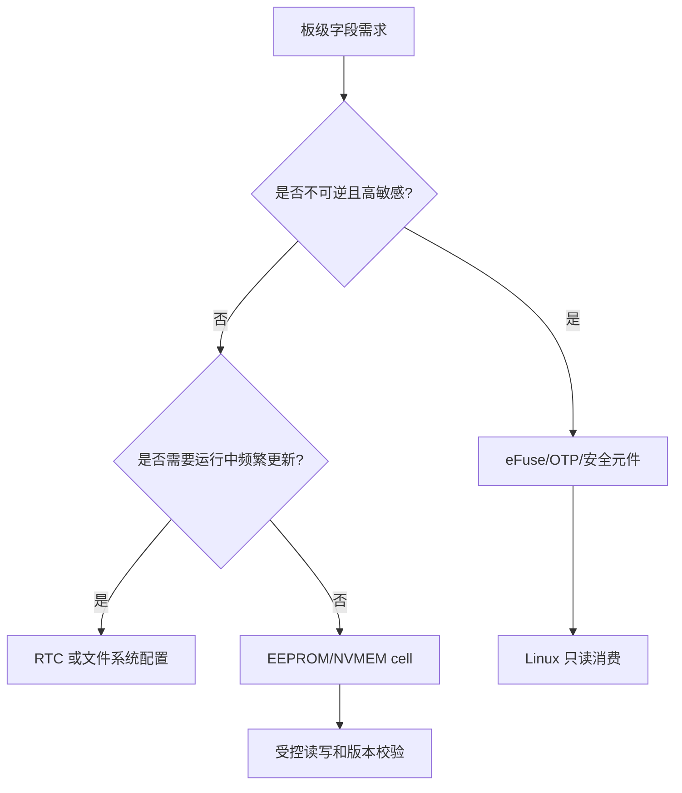
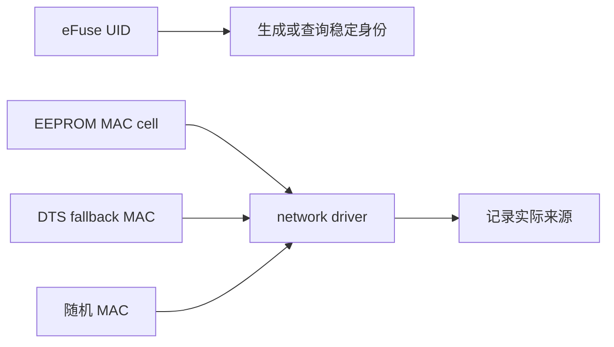
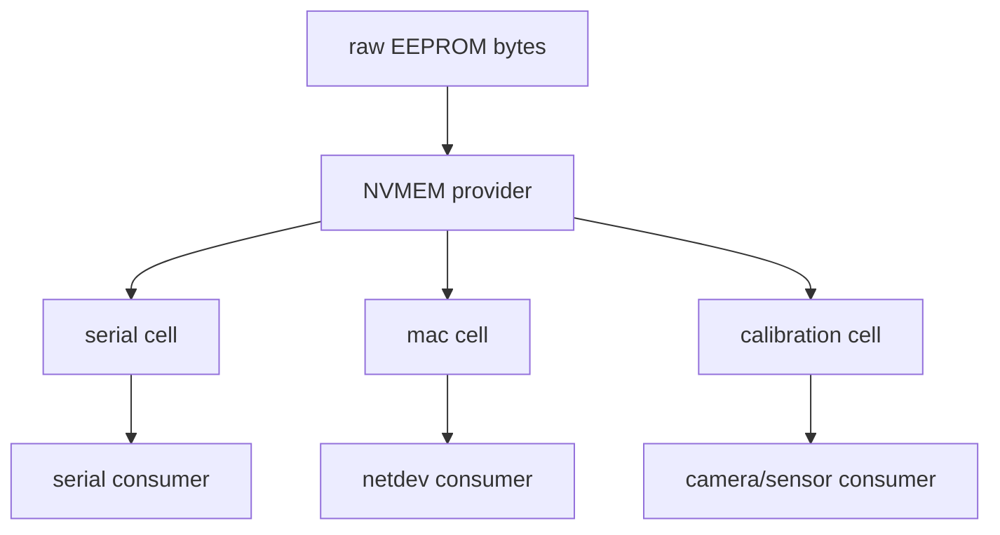
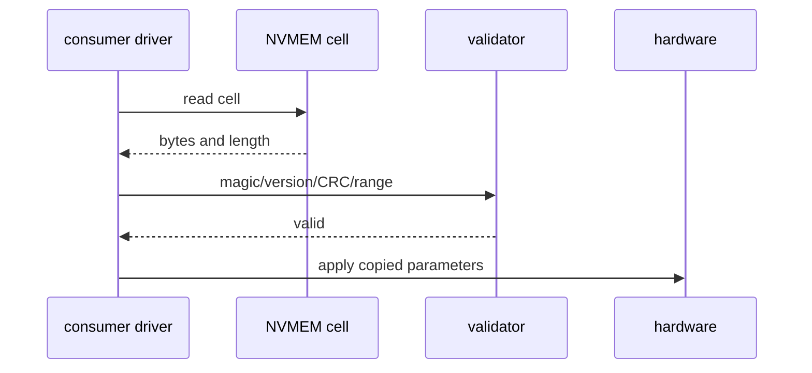
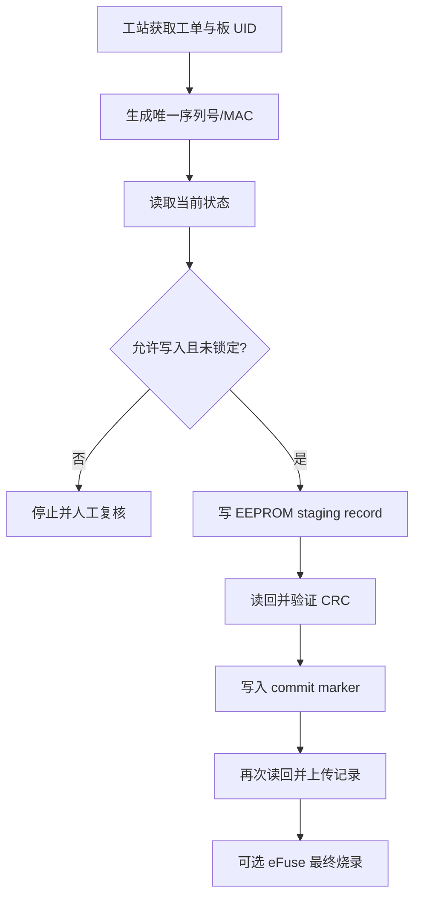
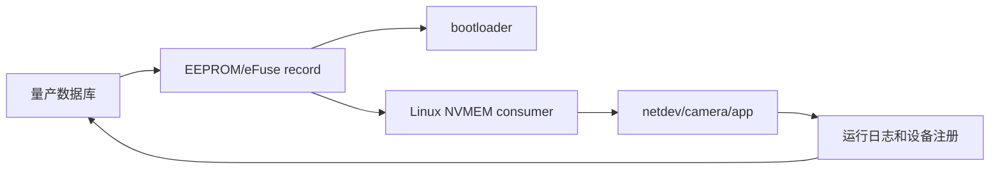

板级长期数据并不都是同一种“掉电不丢的字节”。RTC 维护会变化的时间状态；Linux 通过 NVMEM provider 抽象底层非易失存储，再由 NVMEM cell 把一段原始布局命名为序列号、MAC 或标定参数；EEPROM 适合受控更新但存在写入寿命；eFuse/OTP 适合不可逆身份与安全位；这些数据最终都必须经过长度、格式、版本和完整性校验才能交给消费者。

这组边界决定了谁能写、何时写以及写坏后能否恢复。一块板子的 MAC 地址、序列号、传感器标定参数和生产批次需要跨越 bootloader、Linux、应用、升级和量产工站，不能由各层分别硬编码或猜测偏移。

本章以“Linux 启动后可靠取得该板身份、时间与标定数据”为目标，先建立数据来源和字段协议，再讲设备树 cell、consumer API、量产写入及长期回读。重点不是展示一个能读取 sysfs 的命令，而是让同一份数据在整个产品生命周期中保持唯一、可验证和可追溯。

## 一、先定义每类板级数据的权威来源

先列出产品真正需要的字段，再选择存储位置。

不要因为 eFuse 可读就把所有数据都烧进去，也不要因为 EEPROM 容易写就把唯一身份留给可被普通应用改写的位置。

| 字段 | 典型性质 | 合适来源 | 写入时机 |
| --- | --- | --- | --- |
| SoC 唯一 ID | 芯片固有、不可变 | eFuse/OTP | 芯片制造时已存在 |
| 产品序列号 | 唯一、只写一次 | 受控 EEPROM 或安全存储 | 量产工站 |
| 网卡 MAC | 唯一、应稳定 | EEPROM/NVMEM 或受控 provisioning | 量产工站 |
| sensor 校准 | 可更新、有版本 | EEPROM/NVMEM cell | 标定工站或受控维护 |
| RTC 时间 | 持续变化 | RTC backup domain | 首次校时和运行时 |
| 安全密钥/lock bit | 高敏感、不可逆 | eFuse/安全元件 | 严格审核的烧录阶段 |



每个字段都应有一份数据字典，至少记录名称、长度、字节序、允许字符、默认值、版本、CRC/签名策略与责任方。

一个没有长度与版本的“序列号字符串”最终会变成 bootloader、Linux 和产测工具各自猜测格式的隐患。

### 建立板级身份的优先级

硬件可能同时提供 eFuse UID、EEPROM MAC、设备树 local-mac-address 和 bootloader 临时环境变量。

需要提前规定谁是权威来源，谁仅作 fallback。



随机 MAC 只适合开发板临时启动或明确允许不稳定身份的模式。

一旦产品需要网络注册、授权或远程运维，随机 fallback 必须显式打警告并让生产验证失败，而不是静默进入量产。

## 二、用 NVMEM cell 将存储布局变成具名字段

NVMEM provider 可以来自 eFuse 控制器、EEPROM、SPI flash 分区或其他非易失存储驱动。

consumer 不应反复写 offset 和长度，而应引用具名 cell。

下面展示一个 I2C EEPROM provider 与多个 cell 的结构；binding 细节应以当前内核的 EEPROM/NVMEM 文档和 driver 支持为准。

```dts
&i2cX {
    board_eeprom: eeprom@50 {
        compatible = "atmel,24c02";
        reg = <0x50>;
        pagesize = <8>;
        read-only;

        #address-cells = <1>;
        #size-cells = <1>;

        board_serial: serial@00 {
            reg = <0x00 0x10>;
        };

        eth0_mac: mac@10 {
            reg = <0x10 0x06>;
        };

        camera_calibration: calibration@20 {
            reg = <0x20 0x40>;
        };
    };
};

&ethernet0 {
    nvmem-cells = <&eth0_mac>;
    nvmem-cell-names = "mac-address";
};
```

read-only 是安全策略，不是硬件能力判断。

它适合运行时 Linux 绝不应改写的 production EEPROM；量产工站若要写入，应使用受控的工装、单独镜像或经审核的 provisioning 模式，而不是在正常 rootfs 中删除 read-only 后直接写 sysfs。

### cell 边界是协议的一部分

serial@00 的 16 字节不等于“最多写十六个任意字符”。

应定义是否 NUL 结尾、是否 ASCII、空余位置填什么、是否有 CRC。

MAC 必须严格为六字节二进制值，不应以包含冒号的字符串形式存入同一 cell，除非数据字典明确规定如此。



把一个大 EEPROM 只暴露为 raw sysfs blob，会诱导每个 consumer 使用私有 offset。

具名 cell 让设备树成为布局的可审查接口，也让驱动在字段移动时只需跟随 binding，而不必散布魔数。

## 三、在驱动中读取、校验并复制 NVMEM 数据

consumer 通过 cell 名称取得数据，读取后先校验长度和格式，再复制到自身拥有的内存。

不要保存由一次 helper 返回的临时数据指针，也不要把未验证的校准字节直接写入硬件寄存器。

```c
static int board_read_serial(struct device *dev, char *serial,
                             size_t serial_size)
{
    struct nvmem_cell *cell;
    void *buf;
    size_t len;
    int ret = 0;

    cell = devm_nvmem_cell_get(dev, "serial");
    if (IS_ERR(cell))
        return dev_err_probe(dev, PTR_ERR(cell),
                             "failed to get serial cell\n");

    buf = nvmem_cell_read(cell, &len);
    if (IS_ERR(buf))
        return PTR_ERR(buf);

    if (len == 0 || len >= serial_size) {
        ret = -EINVAL;
        goto out_free;
    }

    memcpy(serial, buf, len);
    serial[len] = '\0';
    if (!board_serial_is_valid(serial))
        ret = -EINVAL;

out_free:
    kfree(buf);
    return ret;
}
```

这里的校验函数应拒绝不可打印字符、全 0、全 0xff、未终止或不符合产品格式的序列号。

如果长度固定而不带 NUL，consumer 必须自己在已分配的目标缓冲区末尾补终止符；不能对原始 EEPROM 内容直接使用 strlen。

### MAC 和校准数据必须按各自格式校验

```c
static int board_read_mac(struct device *dev, u8 mac[ETH_ALEN])
{
    struct nvmem_cell *cell;
    void *buf;
    size_t len;

    cell = devm_nvmem_cell_get(dev, "mac-address");
    if (IS_ERR(cell))
        return PTR_ERR(cell);

    buf = nvmem_cell_read(cell, &len);
    if (IS_ERR(buf))
        return PTR_ERR(buf);

    if (len != ETH_ALEN || !is_valid_ether_addr(buf)) {
        kfree(buf);
        return -EINVAL;
    }

    ether_addr_copy(mac, buf);
    kfree(buf);
    return 0;
}
```

校准 block 则常有 magic、layout version、payload length 和 CRC。

只有 CRC、版本和与当前 sensor module 的匹配条件都通过，才允许将参数交给 ISP 或 sensor driver。失败时必须选择明确的受控默认值或阻止关键功能，而不是继续使用未初始化数据。



### RTC 是时间源，不是身份存储

RTC driver 通过 RTC class 维护当前时间、alarm 和 backup domain 状态。

系统启动时可能从 RTC 读取粗略时间，再在网络可用后由可信时间源校正。

RTC 电池掉电、首次生产和时区设置都会影响它的值，所以日志、证书和 OTA 策略不能把“RTC 非零”当成可信时间证明。

对 RTC 的验收应包括断主电、保留电池、重启后读时、alarm 唤醒和时间校正流程；不要把它与 EEPROM 序列号写入混成同一个工具。

## 四、将 EEPROM 写入与 eFuse 烧录隔离成量产动作

eFuse/OTP 的写入不可逆，错误 bit、错误电压或错误批次都会造成永久损失。

普通 Linux 应用不应拥有烧录权限，量产工站也不应在没有身份验证、双重确认和读取回验的情况下执行。

EEPROM 虽可重写，但有页写大小、写周期和寿命限制；一次掉电可能留下半页数据。



量产数据应有 staging 与 commit 语义。

例如先写完整的序列号、MAC、校准 payload 和 CRC，读回一致后再写一个单独的 valid marker。启动时只接受 marker、版本和 CRC 都正确的记录。

这样掉电会留下“无效记录”，而不是一份看似合法但部分损坏的身份。

### 写入 API 的使用必须带产品级保护

NVMEM 可为可写 provider 提供写入接口，但 API 成功不等于量产流程合格。

写入前需要检查当前内容是否为空、是否属于当前工单、是否已经 locked；写入后需要重新读取并逐字节验证。

```c
static int manufacturing_write_calibration(struct nvmem_cell *cell,
                                           const void *record, size_t bytes)
{
    int ret;

    ret = board_validate_calibration_record(record, bytes);
    if (ret)
        return ret;

    ret = nvmem_cell_write(cell, record, bytes);
    if (ret)
        return ret;

    return board_readback_matches(cell, record, bytes);
}
```

这段代码只表达“校验、写入、回读”三件事，不能单独成为产测工具。

真实工具还要鉴权、绑定工单、记录操作员/治具/时间、限制目标 board、拒绝重复写入，并把结果上传到可审计数据库。

### eFuse 写入前的最小检查单

| 检查 | 原因 |
| --- | --- |
| 读取当前 eFuse word 并保存证据 | 防止对已编程芯片重复写 |
| 比对芯片 UID 与工单 | 防止把数据烧到另一块板 |
| 比对目标 bit mask 与审批单 | 防止错误 lock/security bit |
| 验证编程电压和环境状态 | 防止烧录失败或永久损坏 |
| 执行后回读 | 确认 bit 已按预期置位 |
| 锁定后再读业务路径 | 确认 Linux 消费的数据正确 |

任何一个检查失败都应停止，不要提供“忽略失败继续烧录”的快捷选项。

## 五、用启动、升级和生产回读证明数据能长期使用

板级信息的真正验收不是在工站读到一次正确字节，而是经过 bootloader、Linux、网络、升级和断电后仍保持一致。

先为每个字段指定读取责任者：bootloader 是否读取 MAC，Linux netdev 是否从 NVMEM cell 获取，应用是否只读取 sysfs 暴露的序列号。

多方同时拥有写权限是长期维护中最危险的设计。



| 验收场景 | 预期结果 |
| --- | --- |
| 首次烧录后冷启动 | serial、MAC、校准均通过格式校验 |
| bootloader 到 Linux | 两侧读取的 MAC 一致且非随机 |
| 断主电和 RTC backup 保持 | 时间按硬件能力保持，身份不变 |
| rootfs 升级 | NVMEM 来源与字段版本不被覆盖 |
| 重复量产扫描 | 已 commit 的板拒绝非授权重写 |
| 校准格式升级 | 新驱动可识别版本，旧记录有明确兼容或拒绝路径 |

日志中应记录字段来源和版本，但不要打印密钥、完整安全 token 或可用于克隆设备的敏感材料。

对于 MAC 和 serial，可记录受控的哈希或掩码形式，满足追溯同时减少泄露。

## 官方资料

- [Non-Volatile Memory (NVMEM) subsystem](https://docs.kernel.org/driver-api/nvmem.html)
- [Real Time Clock (RTC) Drivers for Linux](https://docs.kernel.org/admin-guide/rtc.html)
- [NVMEM device tree bindings](https://github.com/torvalds/linux/tree/master/Documentation/devicetree/bindings/nvmem)

### 本章练习

为一个真实板卡编写数据字典，至少包含 serial、MAC、一个校准 block 和 RTC 时间来源。

在 DTS 中将 EEPROM 或 eFuse provider 划分成具名 NVMEM cell，并让一个 consumer 通过 cell name 读取数据。

实现长度、magic、版本、CRC 与范围校验，分别测试全 0、全 0xff、截断、旧版本和 CRC 错误。

设计一个只写一次的 EEPROM staging/commit 记录，完成写入、断电恢复、回读和 Linux 启动验证。

## 六、小结与验收

NVMEM 的价值不是把所有存储都变成一个裸字节文件，而是将 provider、cell 和 consumer 的责任拆开。provider 处理具体介质，cell 固化字段边界，consumer 只按名字取得数据并执行自身格式检查。RTC、可改写记录与不可逆配置则必须保持不同权限和验收流程。

量产数据真正完成的标志也不是写接口返回成功，而是写前身份匹配、写后回读、异常掉电可识别、系统升级不覆盖、业务驱动能够按同一协议消费，并且敏感字段不会出现在普通日志中。

### 本章验收

完成本章后，应能独立回答：

- RTC、EEPROM、NVMEM 与 eFuse 各自适合保存什么；
- 为什么板级字段必须有唯一权威来源和数据字典；
- 为什么 consumer 应请求具名 NVMEM cell 而不是硬编码 offset；
- 为什么序列号、MAC 和校准数据需要不同的格式校验；
- 为什么 RTC 时间不能自动成为可信时间；
- 为什么正常产品系统不应暴露 eFuse 烧录权限；
- 如何用 staging、CRC、commit marker 处理 EEPROM 写入中断；
- 如何通过冷启动、升级和生产回读验证板级身份长期一致。

当板级信息拥有清晰来源、格式、写权限和回读证据时，设备身份与校准数据才真正能支撑量产和长期维护。

> 🏷️ Linux BSP · RTC · NVMEM · EEPROM · eFuse · MAC address · calibration · manufacturing
