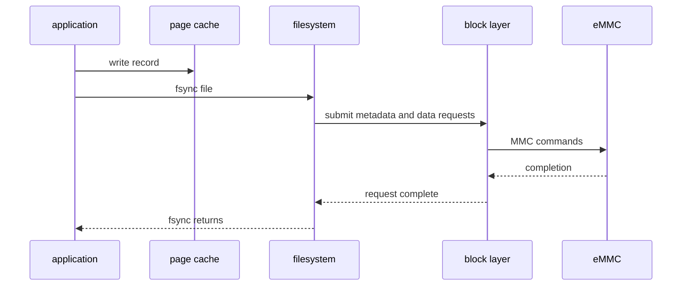
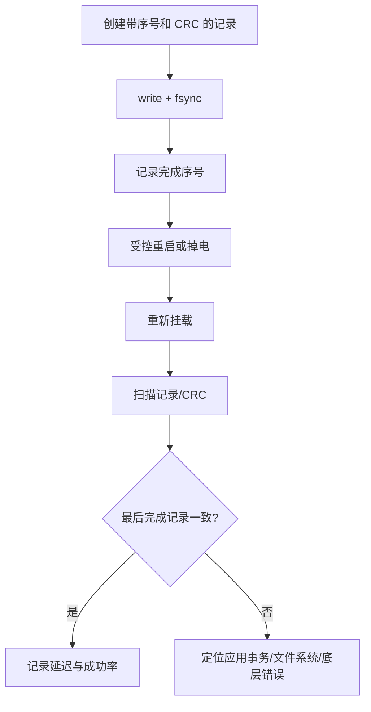

看到 /dev/mmcblk0，并不意味着存储链路已经可靠。

它只说明 MMC host、卡识别和块层注册走到了能暴露设备节点的阶段。

真正的产品路径还包括分区表、文件系统、挂载时机、写缓存、断电行为、坏块/寿命告警和升级过程中的数据保护。

本章以“向数据分区写入一条记录，断电重启后仍可验证”为主线，从文件系统一路追到 eMMC/SD 控制器。

根文件系统通常也在块设备上，任何分区或格式化实验都必须避开当前 rootfs 和 boot 分区。

## 1. 先画出一次文件写入经过的层次

用户态 write 不会直接变成一条 eMMC command。

数据先经过页缓存和文件系统，再被转换为块层 request，经 MMC block driver 交给 host controller，最终由控制器和卡完成传输。


不同层能够观察到不同事实。

文件系统能告诉你文件是否 fsync；块层能看到 request 延迟；MMC host 能报告调谐、超时和 CRC 错；eMMC 内部 FTL 则决定真实的擦写、磨损均衡和掉电恢复。

| 层 | 主要责任 | 典型错误 |
| --- | --- | --- |
| 文件系统 | 名称、目录、元数据一致性 | 只写页缓存就断电 |
| 分区表 | 划分启动、root、数据区域 | 分区号在升级后漂移 |
| 块层 | 合并、调度、请求下发 | 队列参数与设备能力不匹配 |
| MMC core/driver | 卡识别、命令、数据传输 | 电压、时钟、tuning、bus width 错 |
| host controller | DMA、时序、IRQ | pinctrl、clock、reset、IOMMU 错 |
| eMMC/SD | flash translation 和介质 | 寿命耗尽、坏块、突然掉电 |

### 先定义本章的安全实验分区

选择一个明确标注为 data-test 的非关键分区。

用 PARTUUID 或标签识别它，而不是假定 mmcblk0p3 永远是数据区。启动介质、分区顺序和 USB/SD 插入都会改变设备编号。

```sh
lsblk -o NAME,SIZE,FSTYPE,LABEL,PARTUUID,MOUNTPOINTS
blkid
findmnt /
```

确认当前根文件系统和启动分区后，再执行后续写入、挂载或 fsck 操作。

不要在不确定设备来源时运行 mkfs、dd、wipefs、fsck -y 或 block discard。

## 2. 第一步：从设备树到 /dev/mmcblkX 确认 host 已正确工作

MMC host 节点通常描述 bus-width、供电、cd/wp GPIO、pinctrl、clock、reset 和高速模式能力。

具体 Rockchip binding、SDHCI/DW-MMC compatible 与属性必须以当前 SDK 的 DTS 和 host driver 支持为准。

```dts
&mmc_host {
    bus-width = <8>;
    non-removable;
    vmmc-supply = <&vcc_emmc>;
    vqmmc-supply = <&vcc_emmc_io>;
    pinctrl-names = "default";
    pinctrl-0 = <&emmc_clk &emmc_cmd &emmc_bus>;
    status = "okay";
};
```

bus-width、non-removable 和 regulator 不是装饰性属性。

错误的 bus width 可能导致初始化失败或高速模式下 CRC 错；漏掉 IO 电压供电描述会让时序切换不稳定；把板载 eMMC 写成可热插拔会干扰 card detect 逻辑。

```mermaid
flowchart TD
    A[DTS host resources] --> B[pinctrl/clock/reset/regulator ready]
    B --> C[MMC core initializes card]
    C --> D[mmcblk block device registered]
    D --> E[partition table scanned]
    E --> F[/dev/mmcblkXpY and by-partuuid links]
```

启动后先收集识别信息，而不是立刻跑性能测试。

```sh
dmesg | grep -i -E 'mmc|sdhci|dw-mmc|timeout|crc'
cat /sys/block/mmcblk0/size
cat /sys/block/mmcblk0/queue/logical_block_size
cat /sys/block/mmcblk0/queue/physical_block_size
ls -l /dev/disk/by-partuuid
```

若 dmesg 中出现反复重新识别、调谐失败、CRC error 或 data timeout，先回到电源、时钟、pinctrl 和硬件走线，不能通过降低文件系统日志级别掩盖底层传输错误。

### eMMC 与 SD 的板级差异

eMMC 通常板载、不可移除，可使用 8-bit 总线和更高速度模式。

SD 卡通常可插拔，需要 card detect、写保护和更复杂的机械可靠性考虑。

它们都通过 MMC core 暴露块设备，但产品策略不能简单复制。

| 项目 | eMMC | SD |
| --- | --- | --- |
| 连接 | 板载 BGA | 插槽可插拔 |
| 常见总线 | 4/8-bit | 常见 4-bit |
| 供电控制 | 固定或受 PMIC 控制 | 需要插拔和电压切换考虑 |
| 产品用途 | boot/rootfs/长期数据 | 扩展存储、导入导出 |
| 主要风险 | 寿命、掉电、焊接和时序 | 接触不良、拔卡、伪卡和文件损坏 |

## 3. 第二步：理解块层 request 与文件系统提交的边界

块层面对的是扇区和 request，不知道“配置文件”或“数据库记录”的业务含义。

文件系统负责把文件内容、inode、目录项和 journal/metadata 按其一致性规则提交。

因此测试“write 返回成功”只能说明数据进入了某一级缓冲，不等于数据已到达非易失介质。



对需要跨断电保存的单个文件，应用应在合适时机调用 fsync 或 fdatasync，并正确处理错误。

对多文件事务，应用还需要设计顺序、临时文件、rename 和目录 fsync，不能期待块层了解业务原子性。

```c
static int write_record_durably(int fd, const void *buf, size_t bytes)
{
    ssize_t written;

    written = write(fd, buf, bytes);
    if (written != bytes)
        return -EIO;

    if (fsync(fd) < 0)
        return -errno;

    return 0;
}
```

这段代码没有解决 rename、目录同步、partial write 重试和电源失效保护，它只说明持久化边界需要由上层明确触发。

### request queue 的参数不是性能开关集合

可从 sysfs 查看 queue 的 logical block size、max sectors、rotational、scheduler 等信息。

在 eMMC 上，任意修改 readahead、scheduler 或 writeback 参数可能改变吞吐和延迟，但不能修复 timing、电源或 FTL 寿命问题。

```sh
for f in logical_block_size physical_block_size max_sectors_kb +         read_ahead_kb rotational scheduler; do
    printf '%s: ' "$f"
    cat "/sys/block/mmcblk0/queue/$f" 2>/dev/null
done
```

先建立基线：顺序读写、随机读写、fsync 延迟、CPU 占用和温度。

只有确认业务瓶颈在队列层，才讨论参数调整；否则“调优”会破坏可复现性。

## 4. 第三步：以 PARTUUID、挂载策略和文件系统保护数据分区

启动参数和 fstab 应使用 PARTUUID、UUID 或标签，而不是 /dev/mmcblk0pN。

这样能避免设备枚举变化把数据分区挂错位置。

```sh
blkid /dev/mmcblk0pX
mkdir -p /data
mount -o noatime /dev/disk/by-partuuid/ACTUAL-PARTUUID /data
findmnt /data
```

noatime 只是一个可能的减少额外写入的挂载选项，不应未经评估地套到所有分区。

文件系统类型、journal 模式、commit interval、discard、加密和 quota 都需要匹配数据特征与掉电风险。


### 把格式化权限从正常系统剥离

量产、恢复出厂和开发调试可能都需要创建文件系统，但它们必须是不同路径。

正常运行的服务不应拥有可随意格式化数据盘的权限。

恢复出厂应该验证目标 PARTUUID、停止使用该分区的进程、卸载成功、记录操作原因，并在重新格式化后创建版本化的初始目录。

| 动作 | 正常运行服务 | 维护模式/工站 |
| --- | --- | --- |
| 挂载和读写业务数据 | 允许 | 允许 |
| fsck 只读检查 | 受控允许 | 允许 |
| 修复性 fsck | 禁止自动执行 | 需要明确审批 |
| mkfs/wipe | 禁止 | 只允许精确目标和日志记录 |
| 修改分区表 | 禁止 | 专用烧录/升级流程 |

## 5. 第四步：用掉电、错误日志和寿命指标完成存储验收

存储链路测试必须包含“正常写完”和“在受控边界掉电”两种情况。

掉电实验应使用可控电源和可恢复测试分区，绝不能直接切断正在写 rootfs 的开发机而没有串口、备份和恢复方案。



eMMC 的 health、life time、pre-EOL 等信息在部分设备和内核配置中可通过 mmc sysfs 或 extcsd 工具读取。

这些字段的可用性和解释依赖设备型号；读取前先核对当前 eMMC 规范和工具版本。

错误日志比平均吞吐更有价值。

持续关注 command timeout、CRC、I/O error、文件系统 journal recovery、只读 remount 和 controller reset。

| 现象 | 先查层次 | 不应做的事 |
| --- | --- | --- |
| 启动偶发找不到 mmcblk | 电源、clock、pinctrl、host 初始化 | 仅在应用中增加重试 |
| 高负载 I/O timeout | host DMA、信号完整性、温度、供电 | 盲目提高 queue depth |
| fsync 后仍丢业务状态 | 应用事务/目录同步/掉电边界 | 只更换文件系统 |
| 文件系统频繁修复 | 突然掉电、介质错误或内核错误 | 自动 fsck -y 覆盖证据 |
| 性能逐渐下降 | FTL GC、寿命、写放大或温控 | 用一次 benchmark 代表长期表现 |

### 本章练习

在安全的数据分区上记录其 PARTUUID、文件系统、挂载点和当前 rootfs 位置。

从 DTS 和 dmesg 确认 eMMC/SD host 的电源、总线宽度、pinctrl 和识别结果。

实现一个带 sequence 与 CRC 的小型记录文件，使用 fsync 后执行受控重启并验证最后一条完整记录。

在持续读写时收集 MMC 错误、fsync 延迟和温度，区分文件系统问题与 host/controller 问题。

### 本章验收

完成本章后，应能独立回答：

- 一次文件 write 从 VFS 到 eMMC 经过哪些层；
- 为什么 /dev/mmcblk0 出现不等于数据路径可靠；
- eMMC 与 SD 的板级资源和产品风险有何不同；
- 为什么 fsync 的完成边界仍需要配合应用事务设计；
- 为什么挂载数据分区应使用 PARTUUID、UUID 或 label；
- 为什么队列参数不能修复 host timing 或硬件供电问题；
- 为什么根文件系统和数据分区需要不同的实验安全策略；
- 如何用受控掉电与日志证明数据路径具备恢复能力。

可靠的块存储不是“能 mount、能复制文件”，而是任何一层出错时都能定位、恢复并保护已确认的数据。

### 建议保留的存储运行记录

每次板级存储问题都应附带一次简短的运行记录：设备型号和 EXT_CSD/识别信息、内核版本、目标 PARTUUID、挂载选项、测试文件大小、写入次数、fsync p50/p99、重启方式以及 dmesg 中所有 MMC/文件系统事件。

对比两个版本时必须使用同一张板、同一电源、同一分区和相同 workload；否则 FTL 垃圾回收、温度或已写入量的差异会被误判为内核回归。

对 eMMC，容量接近耗尽时的写入延迟与空闲状态下可能完全不同。性能报告至少给出分区使用率，不能只报告一组“空盘顺序写”数字。

当出现 I/O error 时，优先完整保存首次错误前后的日志和计数。反复重启、格式化或覆盖写会抹掉最有价值的现场证据。

> 🏷️ Linux BSP · block layer · eMMC · SD · partition · filesystem · fsync · power-loss
