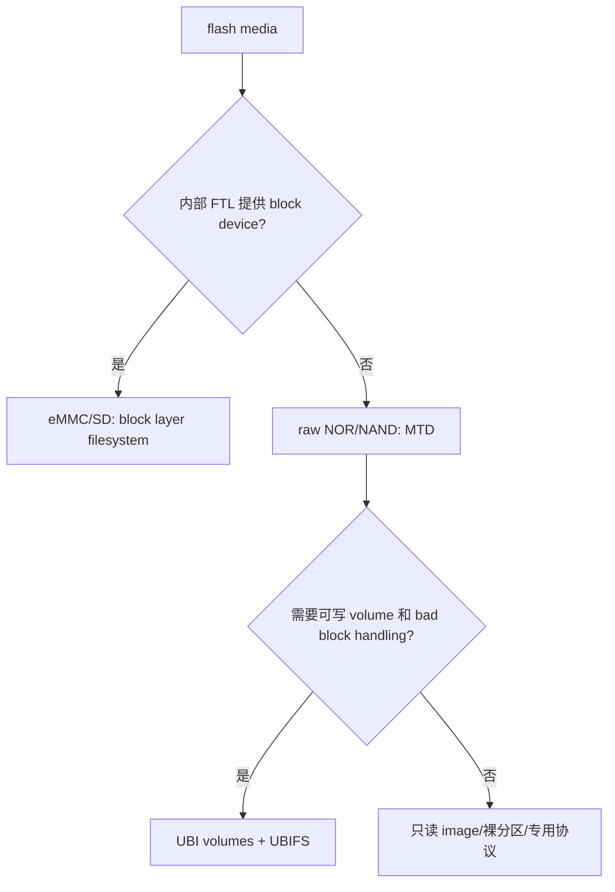
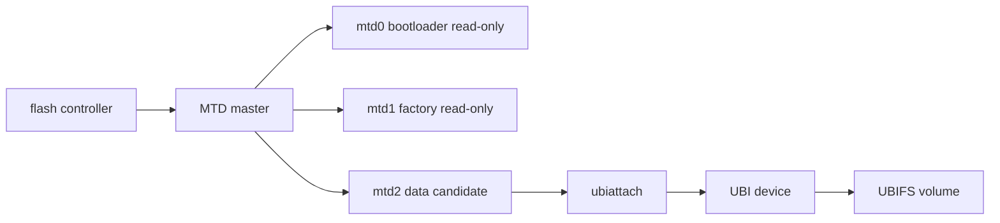
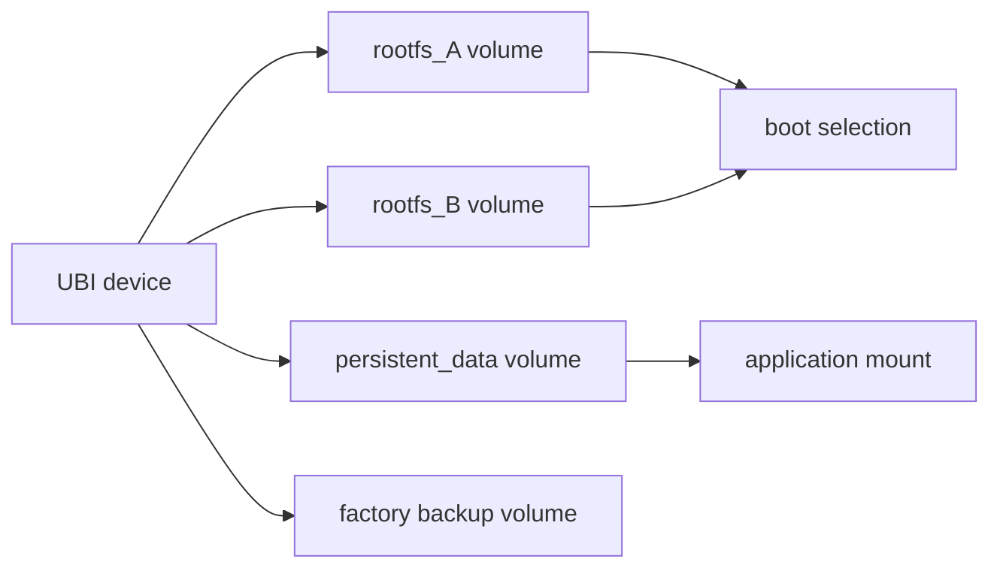
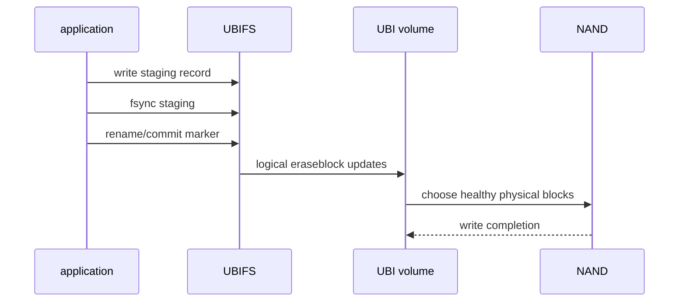
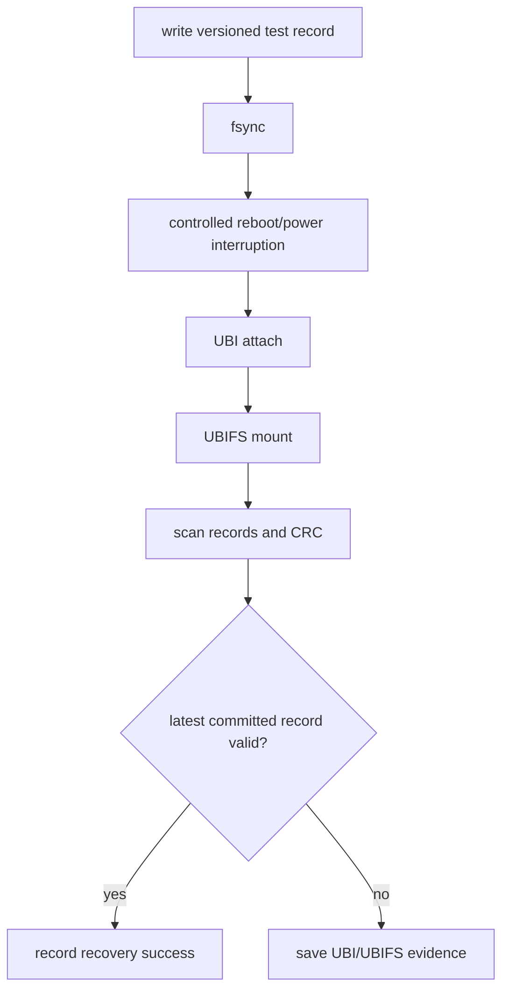

原始 SPI NOR 和 NAND flash 不是缩小版 eMMC。

eMMC 内部已经提供 flash translation layer、坏块管理与块设备语义；原始 flash 则把擦除块、坏块、ECC、wear leveling 和掉电恢复的责任暴露给软件栈。

Linux 的 MTD 负责描述原始介质，UBI 在其上处理逻辑擦除块、磨损均衡和坏块，UBIFS 则是在 UBI volume 上提供文件系统。

本章以“为可更新的数据卷建立断电后仍可挂载的存储路径”为主线，说明什么时候使用 MTD/UBI，而不是把每个 /dev/mtdX 当作普通磁盘。

## 1. 先按介质语义选择块层还是 MTD/UBI

一个存储芯片连接在 SPI 或 NAND controller 上，不自动决定它是否应使用 UBI。

关键在于它是否为原始 flash、容量与擦写特性、是否需要坏块管理、是否承载可写文件系统，以及厂商 SDK 已有的启动和升级约束。



| 介质 | 常用内核接口 | 典型用途 | 重点风险 |
| --- | --- | --- | --- |
| SPI NOR | MTD，可能直接放只读镜像 | bootloader、env、较小只读资源 | 擦除粒度、写保护、分区边界 |
| raw NAND | MTD + UBI/UBIFS | 大容量 rootfs、数据卷 | 坏块、ECC、磨损和掉电 |
| eMMC | block layer | rootfs、数据、A/B 分区 | FTL 寿命和写缓存 |
| SPI NAND | 依 driver 和产品方案而定 | 小型嵌入式系统 | bad block/ECC 与厂商差异 |

不要因为 UBI 具有恢复能力，就把 boot ROM、SPL 或 bootloader 必须读取的固定镜像也无差别放入 UBI。

启动链的每一段必须遵守 ROM 和 bootloader 的寻址、ECC、偏移与冗余格式要求。

### 为本章选择非关键数据卷

所有 attach、format、ubiformat、ubimkvol 和擦除实验都可能破坏数据。

只在明确的测试分区或测试板上操作，先从 /proc/mtd、DTS、烧录配置和启动参数四个来源交叉确认目标。

```sh
cat /proc/mtd
find /sys/class/mtd -maxdepth 2 -type f | sort
cat /proc/cmdline
mount | grep -E 'ubi|ubifs'
```

如果任何来源对分区名称、大小或用途的描述不一致，停止操作并回到当前 SDK 的分区表和打包脚本核对。

## 2. 第一步：让 DTS 和 MTD 分区准确表达原始介质布局

flash controller 节点描述 SPI/NAND controller 的时钟、DMA、pinctrl 和 chip select。

flash 子节点和 partition 节点描述具体芯片和不重叠的存储范围。

以下是结构示意，offset 与 size 必须来自实际板级分区方案。

```dts
&spiX {
    flash@0 {
        compatible = "jedec,spi-nor";
        reg = <0>;
        spi-max-frequency = <ACTUAL_FREQUENCY>;

        partitions {
            compatible = "fixed-partitions";
            #address-cells = <1>;
            #size-cells = <1>;

            bootloader@0 {
                label = "bootloader";
                reg = <0x00000000 0x00100000>;
                read-only;
            };

            factory@100000 {
                label = "factory";
                reg = <0x00100000 0x00100000>;
                read-only;
            };

            data@200000 {
                label = "data";
                reg = <0x00200000 0x00600000>;
            };
        };
    };
};
```

read-only 应用于 Linux 运行期禁止修改的 bootloader、factory 和密钥区域。

它不替代硬件写保护、secure boot 或量产权限管理，但能降低普通软件误擦除的概率。



### 从 MTD 日志确认 flash 真实能力

启动日志和 sysfs 可以显示 erase size、write size、OOB、ECC 与坏块数量等关键信息。

这些参数来自 controller/flash driver 识别，不应由应用假定。

```sh
dmesg | grep -i -E 'mtd|nand|spi-nor|spi-nand|ubi|ubifs'
cat /sys/class/mtd/mtdX/name
cat /sys/class/mtd/mtdX/erasesize
cat /sys/class/mtd/mtdX/size
```

擦除块是原始 flash 的回收单位。

向一个 bit 已从 1 写成 0 的位置再次写入，通常不能像 RAM 一样改回 1，必须先擦除整个 erase block。

NAND 还可能包含出厂坏块和运行中出现的坏块，因此“固定物理 offset 连续存放 N 个文件”不是可维护设计。

## 3. 第二步：让 UBI 管理坏块和可写 volume

UBI 将 MTD eraseblock 转换为逻辑 eraseblock，并在坏块、磨损均衡和 volume 管理之间建立一层抽象。

UBIFS 挂载的是 UBI volume，不是 /dev/mtdX。

```mermaid
flowchart TD
    A[raw NAND eraseblocks] --> B[MTD partition]
    B --> C[UBI attach scans bad blocks]
    C --> D[physical erase blocks PEB]
    D --> E[logical erase blocks LEB]
    E --> F[UBI volume]
    F --> G[UBIFS filesystem]
    G --> H[/data]
```

在生产镜像和测试系统中，UBI attach 参数必须统一，例如 MTD 分区编号、VID header offset、fastmap 配置和 volume 名称。

不同参数可能导致同一介质在不同 rootfs 下无法识别。

以下命令只用于已经确认安全的测试 MTD 分区。

```sh
# 所有 X、N 和名称都必须先按 /proc/mtd 与产品分区表核实。
ubiattach /dev/ubi_ctrl -m X
ubinfo -a
ubimkvol /dev/ubiN -N data-test -s ACTUAL_SIZE
mount -t ubifs ubiN:data-test /mnt/data-test
```

首次对空白 raw NAND 建立 UBI 的初始化操作，必须使用与该 SDK/生产线一致的工具和参数。

不要把这组简化命令应用到已有 rootfs 或已有校准数据的分区。

### volume 是升级和数据隔离的边界

可以将 rootfs、data、factory backup 或 A/B image 放入不同 UBI volume，但每个 volume 的类型、大小和更新策略都要事先设计。

动态 volume 适合可变数据；静态 volume 适合预生成镜像等确定内容。具体选择要结合 upgrade 工具与 UBI 配置。



数据卷不能与升级镜像共用同一个“剩余空间”概念。

升级中需要写入完整候选镜像、保留回滚路径并记录 commit 状态，因此应预先计算 volume 容量和最坏情况下可用 PEB。

## 4. 第三步：以 UBIFS 文件事务处理可写数据

UBIFS 是日志型 flash 文件系统，能适应 UBI 的逻辑擦除块和坏块管理，但它不懂应用的多文件业务事务。

应用仍需设计文件写入、fsync、rename、版本和 CRC。



一份设备配置可采用如下受控更新流程：

1. 写入带版本和 CRC 的 staging 文件；
2. fsync staging 文件；
3. 原子 rename 为当前配置名；
4. fsync 所在目录；
5. 启动时只接受 magic、版本和 CRC 都正确的最新记录。

这比直接覆盖唯一配置文件更能抵抗写入中途掉电。

### 不要将 UBI 工具用于运行时日常写入

ubiupdatevol、ubimkvol、ubirmvol 等是 volume 级维护工具。

它们适用于镜像制作、受控升级或维护流程，不是应用在每次保存配置时应调用的 API。

运行期数据应通过挂载后的 UBIFS 正常文件接口写入。

| 需求 | 正确层次 |
| --- | --- |
| 保存一条应用配置 | UBIFS 文件操作 |
| 更新完整只读镜像 | 受控 UBI volume update |
| 创建/删除 volume | 初始化或维护流程 |
| 查看坏块/volume 状态 | ubinfo、日志、health 监控 |
| 擦除原始分区 | 专用烧录/恢复流程 |

## 5. 第四步：通过坏块、掉电与重挂载验证恢复行为

原始 flash 的可靠性测试不能只看一次 mount 成功。

需要在安全数据卷上重复创建、写入、同步、重启、检查 CRC，并记录 UBI/UBIFS 日志。



对 NAND，坏块数量在设备生命周期中可能变化。

出厂坏块不是必然故障，UBI 的职责正是避开它们；运行中坏块增长、ECC 校正次数激增或 attach/mount 时间明显变化才需要纳入长期监控。

| 现象 | 优先排查 | 禁止的快捷处理 |
| --- | --- | --- |
| /dev/mtdX 名称不符 | DTS/分区表/启动日志 | 按旧编号执行 format |
| UBI attach 失败 | 分区目标、header 参数、介质状态 | 对未知分区直接 ubiformat |
| UBIFS mount 失败 | volume、UBI 日志、坏块/ECC | 自动擦除保留证据 |
| 重启后配置丢失 | 应用 commit/fync 边界 | 只增加写入延迟 |
| 可用空间异常减少 | UBI reserve、bad block、volume 配置 | 把数据写进 rootfs volume |
| ECC/bitflip 告警 | NAND 介质、controller、温度 | 忽略日志继续量产 |

### 本章练习

从现有 DTS、/proc/mtd 和烧录配置整理一张原始 flash 分区表，标明 boot、factory、rootfs 和数据区的读写权限。

在独立测试 MTD 分区上验证 UBI attach、创建 data-test volume、挂载 UBIFS、写入一份带 CRC 的文件和卸载重挂载。

设计 staging/commit 文件更新方式，并在受控重启后验证最后一份已提交记录仍可读取。

收集一次 UBI attach、UBIFS mount、ECC 或 bad block 相关日志，能够说明它来自哪一层。

### 本章验收

完成本章后，应能独立回答：

- 为什么 raw NAND/SPI NOR 不能直接按 eMMC 块设备方式使用；
- MTD、UBI 与 UBIFS 各自解决什么问题；
- 为什么 DTS partition 名称和大小是产品 ABI；
- 为什么 erase block、坏块和 ECC 必须进入存储设计；
- 为什么 UBIFS 挂载的是 UBI volume 而不是 /dev/mtdX；
- 为什么 volume 管理工具不适合应用日常保存配置；
- 如何用 staging、fsync、commit marker 与重挂载验证掉电恢复；
- 为什么未知分区上的 ubiformat 是不可接受的排障方式。

当原始 flash 的物理限制、UBI 的映射职责和应用的数据提交边界被分别验证后，NAND 存储才具备可恢复而非侥幸可用的基础。

### 建议保留的 UBI 介质档案

对每块测试或量产 flash，记录 MTD 名称、总大小、erase size、ECC 信息、坏块数量、UBI attach 参数、volume 名称和大小、UBIFS 挂载选项及镜像 hash。

这些字段是诊断“同一镜像为何在另一块板上 attach 失败”的基础。只保留 rootfs 文件版本，无法判断是否分区、header 偏移或介质状态发生了变化。

升级前后都应收集一次 UBI/UBIFS 日志，并在完成后验证 factory 区仍为只读且未被触碰。可写 data volume 的空间耗尽、坏块增长和反复 mount recovery 需要作为运维告警，而不是等到无法启动才处理。

> 🏷️ Linux BSP · MTD · UBI · UBIFS · SPI NOR · NAND · bad block · ECC
