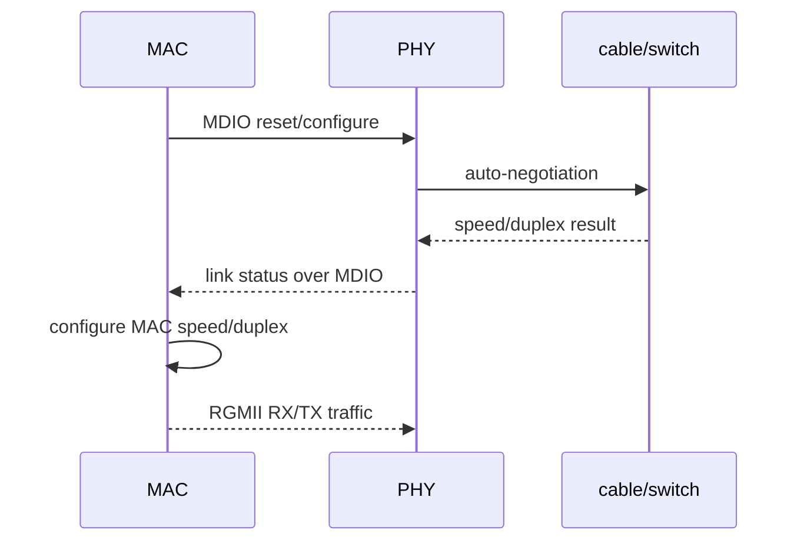
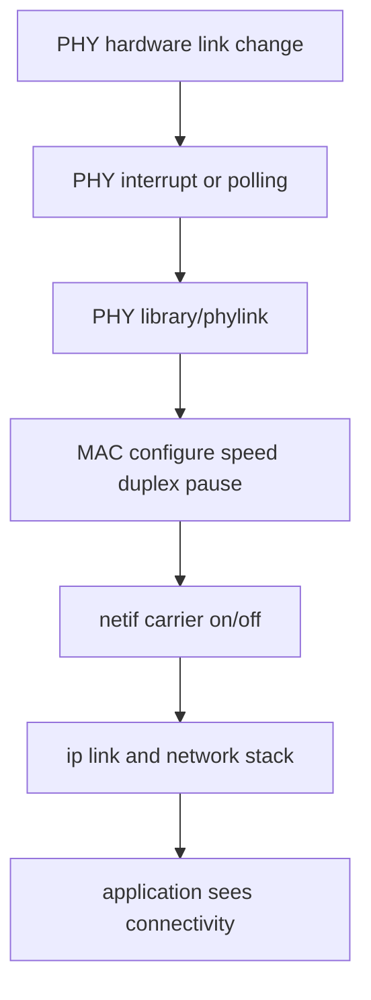
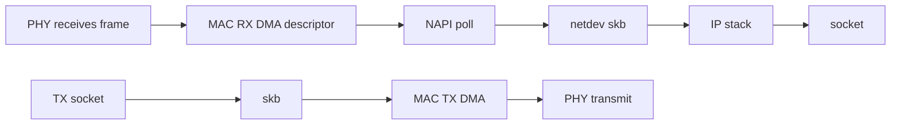
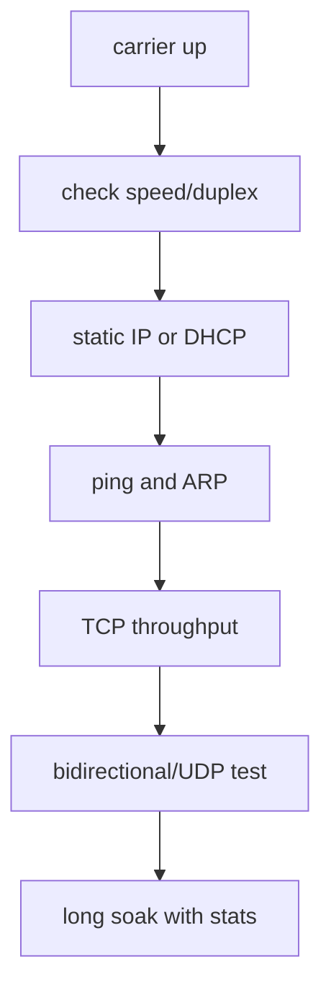
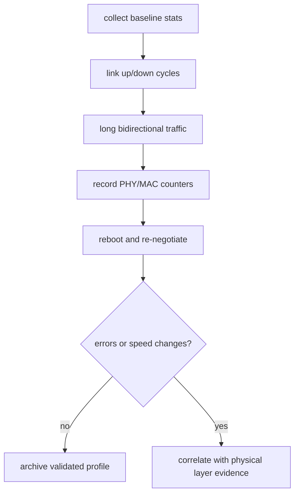

网口能拿到 DHCP 地址，不等于它在温度变化、持续流量、协商重试和重启后都可靠。

一条以太网链路包含 SoC MAC、MAC 到 PHY 的数字接口、PHY 模拟前端、磁性器件、网线和交换机端口。

Linux netdev、PHY library 和 phylink 将这些硬件层连接到内核网络栈；任何一层配置不一致，都可能表现为 link 不起、只跑百兆、随机丢包或高负载报错。

本章以“板卡在千兆全双工下持续收发并能解释链路状态”为主线建立验收路径。

## 1. 先从 RJ45 到 socket 画出完整链路

应用的 send/recv 只处于最上层。

先把物理电气、MAC/PHY 协商、DMA ring、netdev 和 IP 配置分开，才能确定问题发生的位置。


| 层 | 应先确认的事实 | 常见误判 |
| --- | --- | --- |
| 网线/交换机 | 对端端口与线缆可用 | 把对端限速当作板端故障 |
| PHY | address、reset、供电、link LED | PHY MDIO 可读就认为数据 path 正常 |
| MAC-PHY 接口 | RGMII/RMII mode、时钟与 delay | 把 rgmii-id 写成任意延时配置 |
| MAC DMA | descriptor、IOMMU、IRQ、coalesce | link up 就不查 RX error |
| netdev | carrier、speed、duplex、stats | ping 通就不看丢包 |
| IP 层 | 地址、route、DNS | DHCP 失败就先改 PHY 驱动 |

先用 ethtool 和 ip link 记录基线。

```sh
ip -details link show dev eth0
ethtool eth0
ethtool -S eth0
ip addr show dev eth0
ip route
```

输出中的 speed、duplex、auto-negotiation、Link detected 和 RX/TX error counter 是之后每次修改 DTS、时钟或 PHY reset 时都要对比的证据。

## 2. 第一步：让 DTS 准确描述 MAC、PHY 和接口时序

MAC 节点要知道自己通过什么 interface-mode 接到哪个 PHY，PHY 节点要知道 MDIO 地址、reset 和电源等资源。

以下片段展示常见关系；compatible、clock、reset、delay 属性名及数值必须基于实际 RV1126 MAC binding、PHY datasheet 和板级原理图。

```dts
&gmac {
    phy-mode = "rgmii-id";
    phy-handle = <&eth_phy0>;
    clock_in_out = "output";
    pinctrl-names = "default";
    pinctrl-0 = <&gmac_miim &gmac_rgmii>;
    status = "okay";

    mdio {
        #address-cells = <1>;
        #size-cells = <0>;

        eth_phy0: ethernet-phy@1 {
            reg = <1>;
            reset-gpios = <&gpioX PHY_RESET_PIN GPIO_ACTIVE_LOW>;
            reset-assert-us = <ACTUAL_ASSERT_US>;
            reset-deassert-us = <ACTUAL_RELEASE_US>;
        };
    };
};
```

phy-mode 不是一个模糊的“网口模式”标签。

它必须匹配 PCB 上的 MAC-PHY 数字接口和实际选择的内部/外部 RGMII 时钟延时策略。

rgmii、rgmii-id、rgmii-rxid 与 rgmii-txid 的差异决定延时由 MAC、PHY 或双方承担。双方都加或双方都不加都可能在低速偶尔可用、高速随机出错。



### PHY reset 与电源是启动链的一部分

PHY 能否被 MDIO 读取取决于 reset、供电、25 MHz/其他参考时钟和 strap pin 采样。

如果 reset 脚在 bootloader 或 pinctrl 中被错误复用，内核可能偶尔读到错误 PHY ID 或 link state。

先用示波器确认电源、reset 和参考时钟；再看 MDIO 日志和 PHY ID。

```sh
dmesg | grep -i -E 'gmac|stmmac|phy|mdio|rgmii'
ethtool -i eth0
ethtool phy-statistics eth0 2>/dev/null
```

工具和统计项随 driver/内核而异。缺少某项时先确认 driver 是否实现，而不是把空输出解释为零错误。

## 3. 第二步：理解 PHY library/phylink 如何驱动 netdev 状态

PHY library 负责发现 PHY、读取/设置 link 状态和处理 autoneg；phylink 用于协调 MAC 与 PHY/PCS 等不同链路模式。

网络驱动不应在每次定时器触发时手工写 PHY 寄存器来“强制连上”。



使用 ip monitor link 可以实时观察 carrier 状态，而 ethtool 能说明协商后的 speed/duplex。

```sh
ip monitor link &
ethtool eth0
ip link set eth0 up
sleep 2
ethtool eth0
```

如果 carrier 没有出现，先查 PHY reset、MDIO address、对端和 mode。

如果 carrier 出现但只有 100M，比较双方协商能力、线缆四对线、磁性器件和 RGMII 时序。

强制 speed/duplex 可以作为短时定位手段，但不能成为长期修复，因为它会掩盖 auto-negotiation 或物理层问题。

### MAC DMA ring 也属于网口问题

链路已经协商成功后，包仍可能在 MAC RX/TX ring、DMA mapping、IRQ 或 NAPI budget 处丢失。

持续增长的 rx_errors、rx_crc_errors、rx_dropped、tx_errors 或 DMA reset 日志说明问题不在 IP 地址配置。



接收高负载时，使用 ethtool -S、/proc/interrupts、softnet_stat 和 driver debug 信息观察 DMA/IRQ/NAPI，而不是只反复 ping。

## 4. 第三步：建立从 carrier 到吞吐和丢包的分层验收

先验证 link，再验证 L2/L3 连通，再验证吞吐、双向并发和长时间稳定性。

每个步骤只增加一个变量，便于定位。

```sh
# 1. link 状态
ethtool eth0

# 2. 本地地址与 route
ip addr show eth0
ip route get PEER_IP

# 3. 有限次数连通性
ping -c 20 PEER_IP

# 4. 在可信测试网络测 TCP/UDP 吞吐
iperf3 -c PEER_IP -t 60
iperf3 -c PEER_IP -u -b ACTUAL_RATE -t 60
```

不要在生产网络随意跑 UDP 满速测试。它可能挤占交换机带宽、触发丢包并影响其他设备。



每次测试前后保存 ethtool -S 和 dmesg 片段。

吞吐低而无 error 时，检查 CPU 频率、IRQ affinity、offload、MTU 和对端能力；吞吐低且 error 增长时优先回到 PHY/MAC/时序。

### MAC 地址来源必须稳定且可追溯

MAC 可能来自 bootloader、NVMEM、device tree 或 driver fallback。

它必须与前述板级身份管理方案一致，并在每次启动时验证为有效 unicast 地址。

```sh
cat /sys/class/net/eth0/address
ip -details link show eth0
```

多个设备使用同一 MAC 会造成 ARP 表抖动、偶发断链和难以重现的网络异常。量产测试必须把 MAC 唯一性纳入服务器端登记。

## 5. 第四步：用错误计数、温度和重连压力完成收尾

网口问题常只在热态、长线、特定交换机或大流量下出现。

验收至少覆盖冷启动、热重启、反复插拔、不同线缆、不同对端和持续双向流量。



| 现象 | 最高优先级检查 | 说明 |
| --- | --- | --- |
| PHY 不响应 MDIO | reset、供电、MDIO pinmux、地址 strap | 先不改 IP 配置 |
| link flapping | 线缆、磁性器件、供电、对端、PHY reset | 记录 link 事件时间 |
| 只协商到 100M | 四对线、RGMII delay、对端能力 | 不先永久强制千兆 |
| 千兆下 CRC/error 增长 | RGMII timing、信号完整性、时钟 | 示波器/原理图证据优先 |
| link 正常但高负载丢包 | MAC DMA、IRQ/NAPI、CPU | 对照 ethtool -S 和软中断 |
| 重启后 MAC 改变 | NVMEM/bootloader fallback | 修复身份来源，不用脚本覆盖 |

### 本章练习

从原理图确定 MAC 到 PHY 的接口类型、PHY 地址、reset、电源、参考时钟和 RGMII 延时由谁提供。

用 DTS、dmesg、ethtool 和示波器分别确认 PHY 识别、carrier、speed/duplex 和物理波形。

在隔离测试网络完成静态 IP、DHCP、TCP、UDP、双向流和 30 分钟统计对比。

对一次故意拔线或切换对端端口，记录 carrier 变化到应用恢复连接的完整时间线。

### 本章验收

完成本章后，应能独立回答：

- MAC、PHY、磁性器件和 netdev 分别承担什么职责；
- 为什么 DHCP 成功不等于千兆链路稳定；
- phy-mode 与 RGMII delay 为什么必须和原理图一致；
- PHY reset、供电和 strap 为什么影响 Linux 识别；
- PHY library/phylink 如何把链路变化传递给 netdev；
- 如何区分物理层错误、MAC DMA 丢包与 IP 配置问题；
- 为什么 MAC 地址必须有稳定且唯一的板级来源；
- 如何用 long soak、统计计数和多对端测试验证网口可靠性。

当每一次 link 变化、每个错误计数和每种协商结果都能映射回 MAC、PHY 或物理层证据时，网口调试才不再依赖换线和重启的偶然成功。

### 建议保留的网口链路档案

一次完整的网口验收应保存 PHY ID、PHY driver、MAC driver、接口模式、对端交换机端口配置、协商出的 speed/duplex、MAC 地址来源、线缆类型和测试开始/结束的 ethtool 统计。

每次 link flap 都要记录发生时间和上下文，例如是否在 camera/DDR 高负载、温度升高、重启、插拔或对端重新协商后出现。这样才能判断它是物理层问题、软件状态机问题，还是测试环境变化。

对于千兆链路，至少使用两根已知良好线缆和两个独立对端复测。只在单一交换机端口成功，不足以排除对端限速、EEE 策略、端口故障或线缆边际问题。

生产测试还应验证 MAC 唯一性与网络注册记录一致，避免把“链路通”当作“设备身份可用”。

网络性能报告应分别记录单向 TCP、双向 TCP、目标 UDP 和小包压力，不要只给最高单向吞吐。小包场景更容易暴露 IRQ、NAPI、CPU/缓存与系统调用压力，而双向流会验证 RX/TX 同时工作时的 DMA/队列行为。

当更换 PHY、切换 RGMII delay 或更新 MAC driver 后，应先复测 link 协商、error counter 和长流，再比较吞吐。只报告 iperf3 单次结果，无法证明修改没有引入低温、热态或协商重连回归。

对所有稳定性结论，至少保留开始与结束两份 ethtool -S。若 error counter 在零流量也增长，或者流量停止后仍有 MAC reset 日志，应停止把问题归为对端应用性能。

网络服务本身也必须处理 carrier off 和地址变化。BSP 链路恢复只保证 netdev 可用，业务协议的 reconnect、缓存上限、证书时间和上报重试仍应由服务层独立验证。

最终验收应在冷启动和热重启后各执行一次。bootloader 遗留的 PHY reset、时钟或 MAC 配置可能让热重启看似正常，而冷启动暴露真实时序问题。

- 记录供电电压与 PHY 温度；
- 记录对端 port 的 speed/duplex/EEE 配置；
- 记录开始和结束的 error counter；
- 记录任何一次 link down 的准确时间。

> 🏷️ Linux BSP · Ethernet · MAC · PHY · RGMII · phylink · netdev · ethtool
