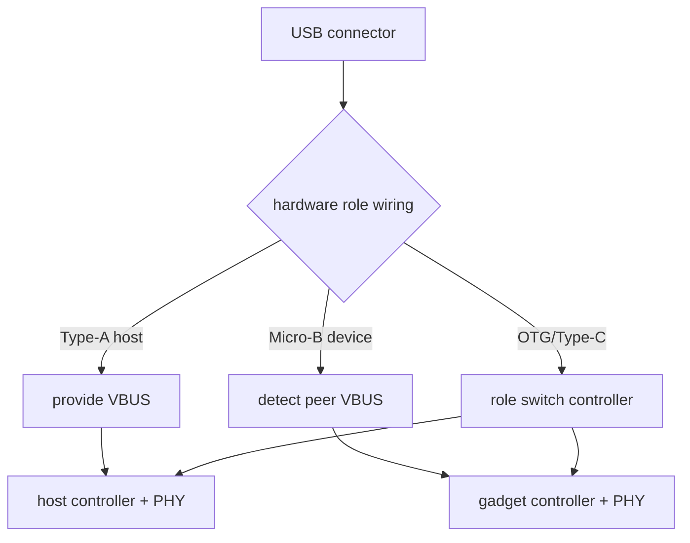
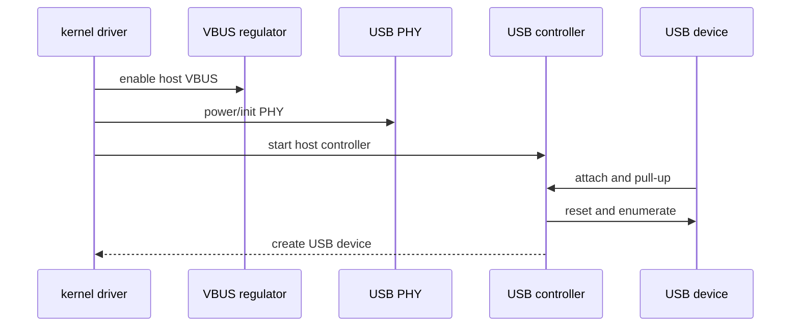
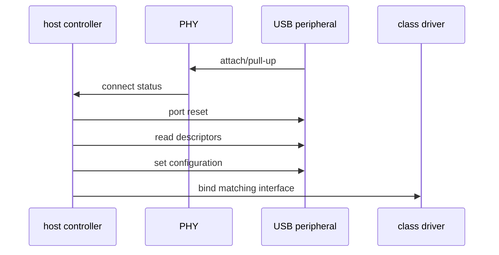
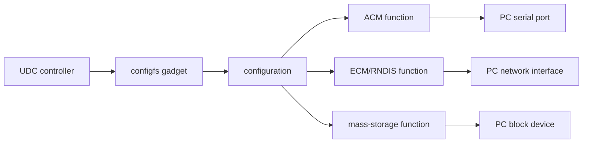
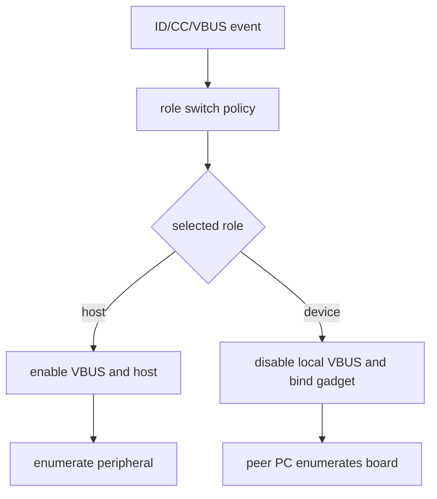
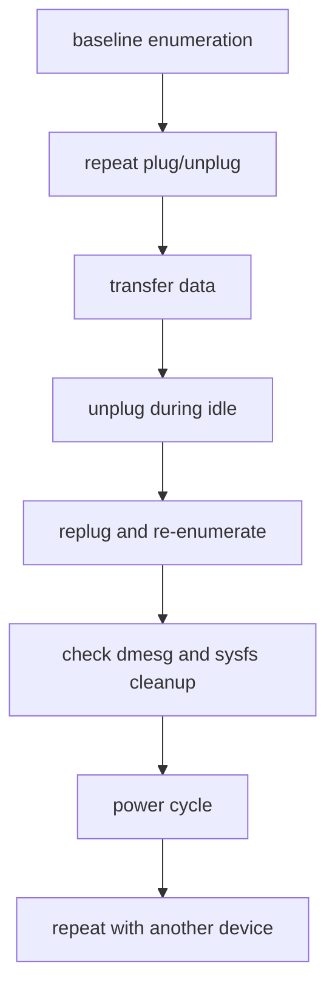

一个可工作的端口首先需要 USB controller 驱动寄存器与 DMA，再由 USB PHY 连接总线电气；host 侧还要正确提供 VBUS，连接器和检测电路共同决定当前 role；随后 host 才能发起 enumeration，并为接口绑定相应 class driver。板卡作为外设时走的是 gadget 框架，由对端 host 完成枚举。

因此“没有识别 U 盘”不能直接归结为缺少驱动模块。Type-A、Micro-USB 或 Type-C 连接器的实际接线、供电方向、ID/CC 检测和控制器能力共同决定端口是固定 host、固定 device 还是 dual-role。

本章聚焦 Linux BSP 集成：把控制器、PHY、供电、角色选择和功能绑定串成可验证的板级路径。USB 协议、descriptor、URB、具体 class 驱动以及 MCU/CherryUSB 的深入内容，继续阅读[USB 专题系列](../../usb/)。

## 一、先确定接口角色和供电方向

同一个 SoC USB controller 常既可作为 host，也可作为 gadget controller。

板级连接方式决定它在产品中是否真的能切换。

Type-A 通常固定为 host；Micro-B 通常固定为 device；Micro-AB 或 Type-C 可能需要 OTG/dual-role 支持，但仍要看 CC、ID 和 VBUS 检测电路是否实际接出。



| 问题 | 必须由原理图回答 |
| --- | --- |
| VBUS 由谁供电 | PMIC、load switch、外部 hub 还是对端 |
| 过流信号接到哪里 | GPIO、PMIC IRQ、无检测或 Type-C controller |
| ID/CC 信号是否存在 | 是否真的支持 OTG/dual-role |
| D+/D- 是否经过 hub/ESD/mux | 连接拓扑和 power sequence |
| USB2/USB3 PHY 是否独立 | 对应 controller 和时钟资源 |

不要把固定 Type-A host 口设成 dr_mode = "otg"，也不要期望一个没有 VBUS source 的 device-only 口去驱动 U 盘。

### 为实验选择安全的外设

host 验证可使用已知良好的低功耗 U 盘、USB 串口或键盘。

device/gadget 验证需连接可信 PC。对含有产品数据的 U 盘，不应使用自动挂载后立即写入的脚本。


## 二、用 DTS 描述 controller、PHY、VBUS 和角色

USB controller 节点需要关联 PHY、clock、reset、interrupt 和可能的 VBUS regulator/role switch。

属性与节点命名高度依赖 SoC 和内核版本，下面只强调资源关系。

```dts
&usb_host {
    dr_mode = "host";
    phys = <&usb2phy_host>;
    phy-names = "usb2-phy";
    vbus-supply = <&vcc_usb_host_5v>;
    status = "okay";
};

&usb_device {
    dr_mode = "peripheral";
    phys = <&usb2phy_device>;
    phy-names = "usb2-phy";
    status = "okay";
};
```

dr_mode 说明 controller 的软件角色，vbus-supply 说明 host 口提供电源的资源。

它们不能替代实际 load switch、over-current GPIO、Type-C controller 或 pinctrl 配置。



若 VBUS 未实际升到规定电压，host 即使 controller 驱动加载成功也不会发现外设。

应先测 VBUS 测试点，再检查 regulator summary、过流状态和 USB 日志。

```sh
dmesg -w
lsusb -t
lsusb
find /sys/bus/usb/devices -maxdepth 1 -type l | sort
```

## 三、用枚举日志区分物理层、协议与 class driver

USB 枚举有明确的时序：检测 attach、端口 reset、读取 descriptor、选择 configuration，最后才绑定 mass storage、HID、CDC ACM 等 class driver。



如果 dmesg 中完全没有 connect 事件，先查 VBUS、线缆、connector、PHY 供电和 controller role。

如果能看到 new USB device 但 descriptor read error，查信号完整性、供电压降、hub、PHY 时钟和对端设备。

如果枚举成功但没有 /dev/ttyACM0 或 block device，则问题在 class driver、配置或权限层。

| 现象 | 更可能的层 | 第一项检查 |
| --- | --- | --- |
| 插拔无任何日志 | VBUS/PHY/role/物理连接 | 万用表测 VBUS，核对 dr_mode |
| 反复 reset/disconnect | 供电压降、线缆、PHY、过流 | dmesg 时间线和 VBUS 波形 |
| 设备出现在 lsusb 但无功能节点 | class driver 或接口类型 | lsusb -v、内核模块、udev |
| U 盘出现又立刻消失 | 供电能力或介质错误 | VBUS 电流、hub、dmesg |
| 只在 USB2/USB3 一种速率失败 | 对应 PHY/lane/mux | 端口拓扑和 speed 日志 |

### 不要把 USB 存储枚举和文件系统挂载混为一谈

USB mass storage 驱动成功后只会产生块设备，例如 /dev/sda。

分区表、文件系统、自动挂载和应用权限仍是独立问题。

先用 lsblk 和 blkid 确认目标，再在安全条件下挂载。

```sh
lsblk -o NAME,TRAN,SIZE,FSTYPE,LABEL,MOUNTPOINTS
blkid /dev/sdX1
mount -o ro /dev/sdX1 /mnt/usb-test
```

首次验证建议只读挂载，避免因错误目标、文件系统错误或应用脚本写入破坏用户介质。

## 四、在 device/gadget 模式中显式管理功能组合

当板子作为 USB device 连接 PC 时，Linux gadget framework 需要提供明确功能，例如 ACM 串口、ECM/RNDIS 网络、mass storage 或自定义 FunctionFS。

它不是“开启 USB device controller 后 PC 自动看到文件”的行为。



gadget 的 vendor ID、product ID、serial、configuration 和 function 必须由产品配置管理，而不是每次启动临时拼接。

mass-storage function 若导出某个镜像或 block device，Linux 本地不能同时以可写方式挂载并修改同一后端，否则两端文件系统视图会不一致。

### role 切换必须有单一控制者

OTG/Type-C 场景下，role switch 可能由 Type-C controller、extcon、USB role switch framework 或 vendor glue driver 协调。

手工在 sysfs 与脚本中交替加载 host/gadget 驱动，容易造成 VBUS 同时被两个方向驱动或 controller 状态残留。



对于固定角色产品，最可靠的策略通常是固定 DTS role 和简化硬件路径。

只有真实产品需要双角色时，才引入 OTG/Type-C 状态机并进行电源和插拔全组合验证。

## 五、用插拔、过流和解绑回归验证接口恢复

USB 的成功标准必须包含重复插拔、不同设备、异常断开和恢复。

对 host 口，还应验证 VBUS 过流或短路保护不会导致 SoC 或其他端口异常；对 gadget 口，验证 PC 重连、功能重新绑定和数据一致性。



| 验收项目 | Host | Device/Gadget |
| --- | --- | --- |
| 供电 | VBUS 电压、电流和过流保护 | 不向对端反向供电 |
| 枚举 | 多种 class 设备均能识别 | PC 能稳定识别 VID/PID/功能 |
| 数据 | 连续读写、错误统计 | 串口/网络/存储功能完整 |
| 插拔 | 设备节点、挂载和驱动清理 | PC 拔插后重新绑定 |
| 重启 | controller 和 PHY 可恢复 | gadget 配置不依赖旧连接 |

### 官方资料

- [Linux USB API](https://docs.kernel.org/driver-api/usb/index.html)
- [USB Gadget API for Linux](https://docs.kernel.org/driver-api/usb/gadget.html)
- [Linux USB gadget configured through configfs](https://docs.kernel.org/usb/gadget_configfs.html)
- [Linux USB Power Management](https://docs.kernel.org/driver-api/usb/power-management.html)

### 本章练习

从原理图确认一个 USB 口的 connector 类型、实际角色、VBUS 来源、过流检测和 PHY/controller 对应关系。

在 DTS 中核对 dr_mode、PHY 和 VBUS resource，并用万用表与 dmesg 验证 host 枚举。

使用低功耗 USB 串口、键盘和 U 盘分别验证 class driver 路径，首次对 U 盘只读挂载。

为一个 device 口创建最小 ACM 或 ECM gadget，在 PC 端反复插拔并保存枚举与数据传输日志。

## 六、小结与验收

USB BSP 集成应沿着电源与角色、控制器与 PHY、枚举、功能绑定、数据传输和异常恢复逐层验证。固定角色产品应尽量固定硬件和 DTS 策略；只有真实需要双角色时，才引入 Type-C/OTG 状态机并验证全部供电组合。

### 验收问题

完成本章后，应能独立回答：

- host、device、OTG/dual-role 的电源与枚举责任如何不同；
- 为什么 connector 外形不能单独证明接口角色；
- dr_mode、PHY 与 VBUS regulator 在 DTS 中各自描述什么；
- USB 枚举日志如何区分物理层、descriptor 和 class driver 问题；
- 为什么 USB 存储出现块设备后仍要单独处理分区与挂载；
- gadget framework 为什么需要显式的 function/configuration；
- 为什么 host 与 gadget 不能无控制地同时驱动同一个 controller；
- 如何用重复插拔、过流和重启验证 USB 端口的恢复能力。

当角色、供电、PHY、枚举和功能绑定都能逐层验证时，USB 接口才具备产品所需的可恢复性，而不是只在某一根线和某一个 U 盘上偶然可用。

> 🏷️ Linux BSP · USB · host · gadget · OTG · PHY · VBUS · enumeration
