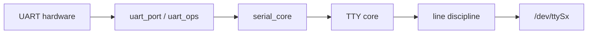

UART 硬件只负责按波特率收发 bit，`/dev/ttySx` 却支持 termios、阻塞读写、line discipline 和 console。中间的 serial_core 与 TTY core 把不同 UART controller 统一成终端接口。

## 1. UART driver 向 serial_core 注册端口

controller driver 为每个实例填充 `uart_port`：MMIO、IRQ、clock、FIFO、line 编号和 `uart_ops`。`uart_ops` 实现启动、停止 TX/RX、设置 modem control、读取状态和配置 termios。

`uart_driver` 描述一组端口及设备名，`uart_add_one_port()` 把具体 port 加入 serial_core。驱动不应绕过 serial_core 自己创建 tty 节点。

## 2. TTY core 管理用户可见终端

TTY 维护 read/write buffer、termios 和会话语义。line discipline 位于 TTY 与用户之间，默认 N_TTY 处理 canonical mode、echo 和控制字符。



## 3. termios 决定数据格式

`stty` 可设置 baud、data bits、parity、stop bits 和 flow control：

```sh
stty -F /dev/ttyS2 115200 cs8 -cstopb -parenb -ixon -ixoff
stty -F /dev/ttyS2 -a
```

serial_core 把 termios 转换为 driver 的 `set_termios`，driver 根据输入 clock 计算 divisor。实际波特率误差、FIFO threshold 和 DMA 模式要结合 controller 手册。

## 4. IRQ、PIO 和 DMA 共同搬运数据

简单 UART 在 TX empty/RX ready 中断中读写 FIFO；高吞吐路径可用 DMA。RX 中断把字符和错误标志插入 tty flip buffer，再推给 line discipline。overrun、frame、parity 错误要计入统计并正确标记。

## 5. earlycon、console 和普通 tty 不同

earlycon 在完整 driver probe 前用早期映射输出启动日志，功能很少；console 注册后承接 printk；普通 tty 节点服务用户程序。启动参数中的 `earlycon`、`console=ttyS2,115200` 与设备树 stdout-path 要匹配真实端口。

```sh
cat /proc/consoles
cat /proc/tty/driver/serial
dmesg | grep -i -E 'tty|serial|uart'
```

若终端乱码，先核对 clock、baud 和电平标准；RS-232/RS-485 与 SoC TTL UART 不能直接连接。

下一篇进入 PCI/PCIe：它能够自行枚举配置空间和 BAR，设备发现方式与 platform 完全不同。

## 6. uart_ops 把 controller 行为交给 serial_core

最小 SoC UART driver 至少要实现 TX empty、set/get mctrl、start/stop TX、stop RX、startup/shutdown 和 set_termios。startup 申请 IRQ、初始化 FIFO 并使能接收；shutdown 先关闭中断和 DMA，再释放资源。

```c
static const struct uart_ops demo_uart_ops = {
    .tx_empty = demo_tx_empty,
    .set_mctrl = demo_set_mctrl,
    .get_mctrl = demo_get_mctrl,
    .stop_tx = demo_stop_tx,
    .start_tx = demo_start_tx,
    .stop_rx = demo_stop_rx,
    .startup = demo_startup,
    .shutdown = demo_shutdown,
    .set_termios = demo_set_termios,
};
```

TX 路径从 port state 的 circular buffer 取字符写 FIFO，空间可用时继续；RX IRQ 读取 status/data，把 parity/frame/overrun 标志和字符插入 flip buffer，再调用 `tty_flip_buffer_push()`。锁内只操作寄存器和 ring，不能执行可睡眠工作。

验证时做三层回环：短接 TX/RX 检查 controller，连接已知串口模块检查电平与 flow control，最后让应用持续收发并比较字节计数。console 端口测试还要避免调试日志混入业务协议。

## 7. 参考资料

- [TTY](https://docs.kernel.org/driver-api/tty/index.html)
- [Serial core](https://docs.kernel.org/driver-api/tty/driver.html)
- [野火：TTY 子系统](https://doc.embedfire.com/linux/rk356x/driver/zh/latest/linux_driver/subsystem_tty_subsystem.html)
