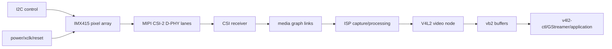
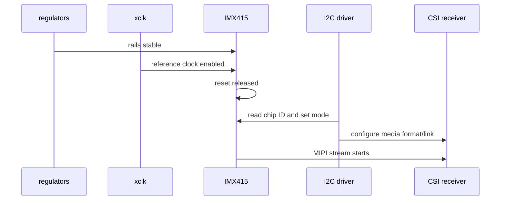
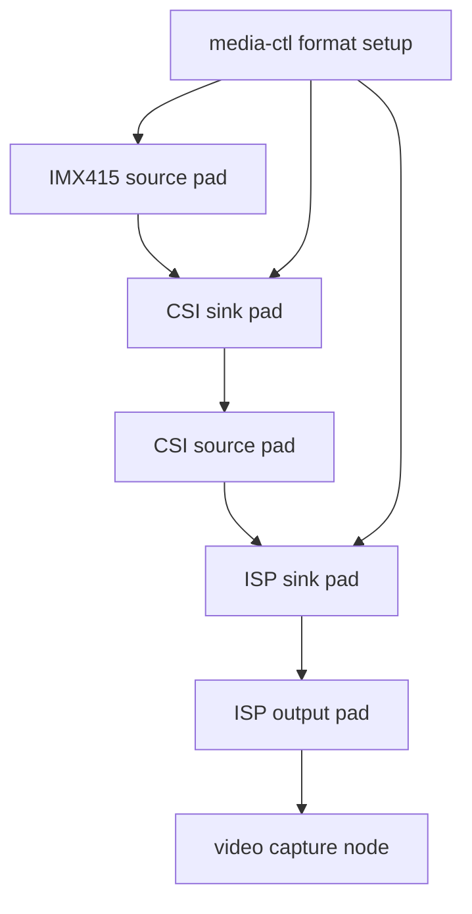
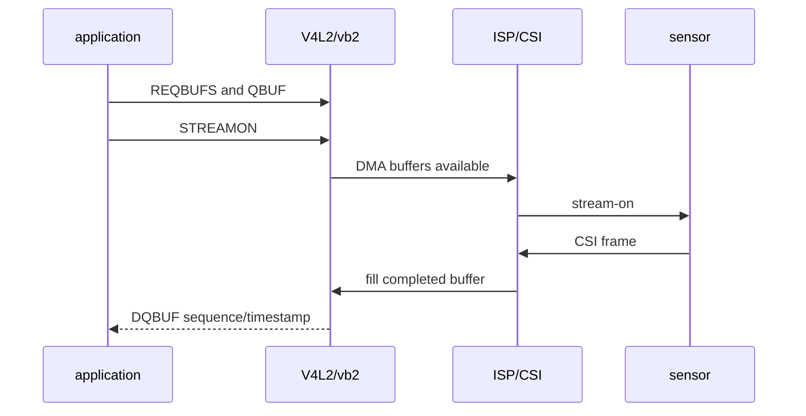
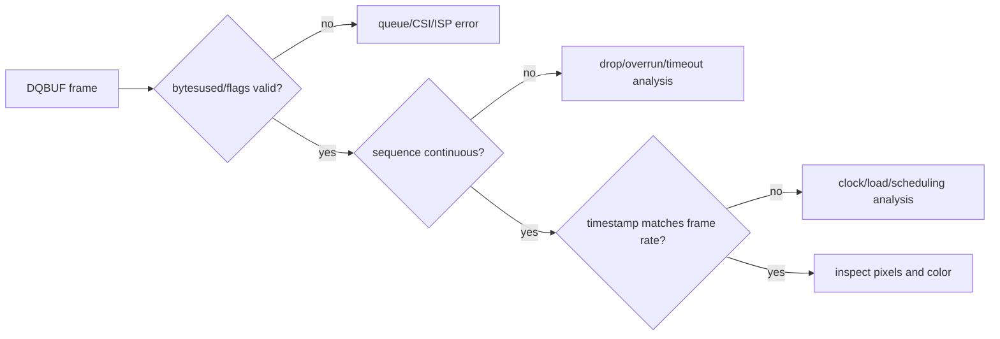
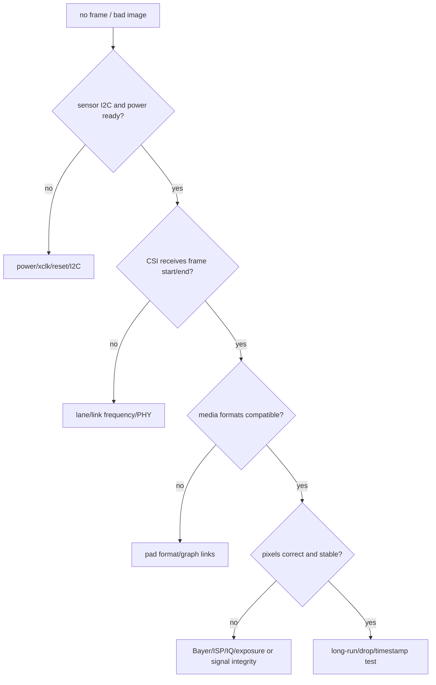

摄像头数据从 sensor 产生，经 MIPI CSI-2 物理链路进入接收端；sensor 驱动注册为 V4L2 sub-device，多个实体通过 media graph 组成管线；采集驱动再用 videobuf2 管理 DMA 缓冲区，最终才由 video node 向用户态提供帧。

因此出现 `/dev/videoX` 只说明某个节点已注册，不表示 IMX415 已正确上电、输出目标 mode，也不表示 lane、像素格式、ISP 和 buffer queue 已连续工作。黑帧、花屏、帧率为零、首帧成功后停顿和 CSI error 都需要沿实际数据路径分层定位。

本章聚焦 RV1126 + IMX415 的 BSP bring-up：从电源、时钟、I2C 和 endpoint 一路验证到稳定采集。像素格式、ISP、编码、流媒体和应用管线的完整内容见[音视频专题系列](../../video-audio/)。所有 lane 数、link frequency、寄存器、地址和端点编号仍须以当前模组原理图、sensor datasheet 与正在使用的 Rockchip SDK 为准。

## 一、先画出一帧从 sensor 到用户态的真实路径

图像采集不是单一驱动的工作。

sensor driver 是 V4L2 sub-device，负责 sensor mode、寄存器和 stream on/off；CSI receiver 接收 MIPI 包；ISP 根据 media graph 和格式配置处理；video node 才把 buffer queue 暴露给应用。



| 层 | 需要先确认的事实 | 不应由它解释的问题 |
| --- | --- | --- |
| sensor 电源/时钟/reset | 设备确实可启动并响应 I2C | ISP color pipeline |
| sensor subdev | mode、像素码、曝光/增益和 stream | MIPI lane 物理信号质量 |
| CSI receiver | lane、data type、帧同步与错误计数 | 应用 buffer 使用 |
| media controller | entities、pads、links 和 format 传播 | 镜头对焦/曝光效果 |
| ISP/video node | capture format、buffer queue、timestamps | sensor I2C address |
| 用户态 | 请求 buffer、dequeue、编码/显示 | 低层 CSI CRC 根因 |

在开始前记录当前拓扑和节点，避免把多个 video 节点中的统计、ISP 输出、编码器输入混为同一个设备。

```sh
media-ctl -p -d /dev/mediaX
v4l2-ctl --list-devices
v4l2-ctl -d /dev/videoX --all
```

如果系统没有 media-ctl 或 v4l2-ctl，需要先在 rootfs 中启用对应工具。没有拓扑证据就修改 sensor DTS，通常只能靠猜测反复试错。

## 二、用 DTS 描述 sensor 电源、时钟与 MIPI endpoint

IMX415 节点应描述 I2C 连接、供电 rail、外部时钟、reset/pwdn、pinctrl 和 CSI endpoint。

CSI receiver 端也要以 remote-endpoint 与 sensor 对接，双方 lane、link frequency 和 data format 约束必须一致。

```dts
&i2cX {
    imx415: camera@ACTUAL_I2C_ADDRESS {
        compatible = "sony,imx415";
        reg = <ACTUAL_I2C_ADDRESS>;

        avdd-supply = <&vcc_cam_avdd>;
        dvdd-supply = <&vcc_cam_dvdd>;
        dovdd-supply = <&vcc_cam_dovdd>;
        clocks = <&cru CAM_XCLK>;
        clock-names = "xclk";
        reset-gpios = <&gpioX CAM_RESET GPIO_ACTIVE_LOW>;

        port {
            imx415_out: endpoint {
                remote-endpoint = <&csi_in>;
                data-lanes = <1 2>;
                link-frequencies = /bits/ 64 <ACTUAL_LINK_FREQUENCY>;
            };
        };
    };
};

&csi_receiver {
    ports {
        port@0 {
            csi_in: endpoint {
                remote-endpoint = <&imx415_out>;
                data-lanes = <1 2>;
            };
        };
    };
};
```

以上是关系示例，不是可直接用于某一份 RV1126 DTS 的最终文件。

IMX415 模组可能使用不同 lane 数、时钟来源、reset 极性、I2C 地址和 vendor-specific binding。任何一个数字都必须与实际硬件及 driver 支持的 mode table 对齐。



### 先用电气证据证明 sensor 有资格被访问

I2C probe 失败时，优先检查 AVDD/DVDD/DOVDD、xclk、reset/pwdn 与 I2C 上拉电平，而不是修改 chip ID 常量。

I2C 能读到 ID 后，仍要确认 xclk 频率和 MIPI lane 已按 mode 要求配置。

```sh
dmesg | grep -i -E 'imx415|camera|csi|isp|mipi'
cat /sys/kernel/debug/clk/clk_summary | grep -i -E 'cam|cif|mipi'
cat /sys/kernel/debug/regulator/regulator_summary | grep -i -E 'cam|avdd|dvdd'
```

debugfs 节点和 clock 名称取决于内核配置。实际板端时序仍应由示波器确认，不要把 framework 显示 enabled 当作电压和时钟真的到达模组。

## 三、通过 media graph 完成 format 与链路协商

V4L2 media controller 的 entity、pad 和 link 描述的是硬件视频路径。

一条 link 存在不代表 format 自动相容；sensor source pad、CSI sink/source、ISP sink/source 和 video node 必须在分辨率、像素码、field、stride 等约束上达成一致。



首先用 media-ctl -p 查看现有 links 是否 enabled、每个 pad 当前是什么 format。

再根据实际 SDK 的 media graph 示例设置 sensor 与 receiver format。不要将别的 sensor 的 Bayer code、宽高或 link frequency 原样复制给 IMX415。

```sh
media-ctl -p -d /dev/mediaX
v4l2-ctl -d /dev/videoX --list-formats-ext
v4l2-ctl -d /dev/videoX --get-fmt-video
```

黑帧常来自 format mismatch、没有真正执行 stream on、CSI 没收到帧起始或 ISP 未连接到正确 source pad。

如果 media graph 已经由 vendor camera service 自动配置，手工 media-ctl 修改可能与服务竞争。先确定当前系统是由应用、RKMedia、camera daemon 还是测试脚本拥有 graph 配置权。

### mode 是一组不可拆开的约束

一个 sensor mode 至少关联：

| 参数 | 必须和谁一致 |
| --- | --- |
| 宽度/高度 | sensor crop、CSI/ISP sink、应用格式 |
| Bayer pattern/bit depth | sensor 输出、ISP 输入和 IQ 配置 |
| lane 数 | 硬件走线与 endpoint |
| link frequency | sensor PLL、D-PHY 和 CSI receiver |
| 帧率 | line length/frame length、曝光上限和 downstream 带宽 |
| xclk | driver mode table 与 hardware clock |

只改应用请求的 3840x2160，无法让 sensor 在未支持的 lane/frequency 下产生该模式。

## 四、用 videobuf2 队列验证真实帧与所有权

video node 正常的最低证据是成功 request buffers、queue、stream on、dequeue 多帧，并检查每帧 bytesused、sequence、timestamp 和 error flag。



可先使用 v4l2-ctl 在低风险分辨率和有限帧数下采集。

```sh
v4l2-ctl -d /dev/videoX --stream-mmap=4 +  --stream-count=120 --stream-to=/tmp/capture.raw +  --stream-poll
stat /tmp/capture.raw
```

命令中的 videoX、buffer 数、格式和分辨率必须先经 --list-formats-ext 确认。

采集到非零文件不等于图像正确。还要按已知格式解析、抽取几帧查看、检查 sequence 连续性和 timestamp 间隔。



### buffer 内存和 DMA 所有权

vb2 负责 V4L2 buffer queue 与 memory type。mmap、userptr、DMABUF 等模式有不同的 CPU/DMA 所有权和 cache 同步边界。

应用不要在已经 QBUF 给驱动后继续修改 buffer；只有 DQBUF 返回的 buffer 才重新由应用拥有。

若要将帧交给 RGA、VENC 或 NPU，优先使用框架支持的 dma-buf 路径并遵守 fence/queue 同步，不要从 mmap 地址手工推导 DMA 地址。

## 五、结合 CSI 错误、帧属性和长时间采集定位问题

传感器问题需要同时看寄存器/日志、CSI error counter、帧统计和实际像素。

只盯着 I2C 成功会忽略 lane 质量；只看一张截图会忽略掉帧和热态问题。



| 现象 | 优先检查 |
| --- | --- |
| sensor probe 失败 | 上电、xclk、reset、I2C 地址和 pull-up |
| I2C 正常但无帧 | stream-on 寄存器、MIPI lane、CSI receiver link |
| 只有首帧或偶发帧 | buffer queue、CSI error、时钟/电源波动 |
| 图像全黑/全白 | 曝光、gain、镜头盖、Bayer/ISP 配置 |
| 花屏/彩条/局部错行 | D-PHY/link frequency、信号完整性、format/stride |
| 帧率不稳/丢帧 | sensor timing、CSI/ISP load、DMA、CPU/DDR 带宽 |
| 热态后失败 | 电源、时钟、sensor 温度与 lane margin |

长时间验证要固定模式、光照和下游负载，记录帧数、丢帧、CSI error、温度、ISP/DDR 负载和日志。

对可支持的 sensor test pattern，可先验证 sensor 到 CSI 的纯数字路径，再恢复真实镜头图像。这能把光学/曝光问题与 MIPI 数据路径问题拆开。

### 官方资料

- [Video for Linux API](https://docs.kernel.org/userspace-api/media/v4l/v4l2.html)
- [V4L2 sub-device userspace API](https://docs.kernel.org/userspace-api/media/v4l/dev-subdev.html)
- [Media Controller devices](https://docs.kernel.org/userspace-api/media/mediactl/media-controller.html)
- [videobuf2 framework](https://docs.kernel.org/driver-api/media/v4l2-videobuf2.html)

### 本章练习

从 IMX415 模组原理图整理 AVDD/DVDD/DOVDD、xclk、reset、I2C 地址、lane 数和 CSI 连接表。

用示波器和 dmesg 验证上电、xclk、reset 和 sensor ID；再用 media-ctl -p 保存整个 media graph。

选择 driver 已支持的一种 mode，完成 format 配置、120 帧有限采集和 sequence/timestamp 检查。

进行 30 分钟连续采集，保存 CSI/ISP 错误、掉帧统计、温度和首尾帧图像。

## 六、小结与验收

摄像头 bring-up 的关键是让板级时序、sub-device 状态、media link、格式传播和 buffer completion 形成同一条证据链。看到节点或单张图像都不够，必须能解释每个 mode 的时钟、带宽、队列和长期错误计数。

### 验收问题

完成本章后，应能独立回答：

- 为什么 /dev/videoX 存在不等于 sensor 正在输出有效帧；
- IMX415 的电源、xclk、reset 和 I2C 为什么必须先于 CSI 调试；
- endpoint、lane、link frequency 和 sensor mode 为什么必须一致；
- media graph 的 entity/pad/link 如何帮助定位 format 问题；
- V4L2 QBUF/DQBUF 如何定义 buffer 的所有权；
- 黑帧、花屏、掉帧和颜色异常分别应先看哪一层；
- 为什么 sensor test pattern 有助于拆分光学问题与数据路径问题；
- 如何用 sequence、timestamp、CSI error 和长时间采集证明链路稳定。

当一帧图像从上电、寄存器、lane、media link 到 buffer completion 都有独立证据时，摄像头 bring-up 才能从“试到有画面”为止，进化为可复现的工程闭环。

> 🏷️ Linux BSP · V4L2 · IMX415 · MIPI CSI-2 · ISP · media controller · vb2 · camera bring-up
